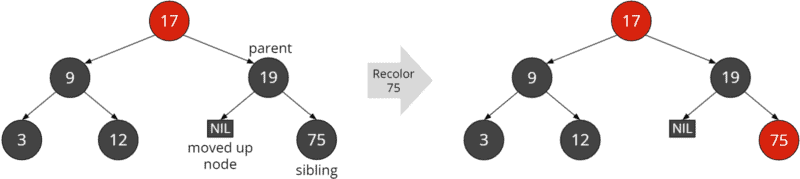

# 红黑树

源代码: 

[RedBlackTree.java]: ./RedBlackTree.java	"RedBlackTree.java"

红黑树是自平衡二叉搜索树的一种广泛使用的具体实现。在 JDK 中，它用于 TreeMap，自 Java 8 起，它还用于 HashMap 中的桶碰撞。它是如何工作的？

在本文中，您将了解到

* 什么是红黑树？
* 如何在红黑树中插入元素？如何删除元素？
* 平衡红黑树的规则是什么？
* 如何用 Java 实现红黑树？
* 如何确定其时间复杂度？
* 红黑树与其他数据结构的区别是什么？

## 什么是红黑树？

红黑树是一种自平衡二叉搜索树，即自动保持某种平衡的二叉搜索树。

每个节点都有一种颜色（红色或黑色）。一组规则规定了这些颜色必须如何排列（例如，红色节点不能有红色子节点）。这种排列方式可以确保树保持一定的平衡。

在插入和删除节点后，会应用相当复杂的算法来检查是否符合规则，如果出现偏差，则通过重新对节点着色和旋转来恢复规定的属性。

### 红黑树上的 NIL 节点

In the literature, red-black trees are depicted with and without so-called NIL nodes. A NIL node is a leaf that does not contain a value. NIL nodes become relevant for the algorithms later on, e.g., to determine colors of uncle or sibling nodes.

In Java, NIL nodes can be represented simply by `null` references; more on this later.

## 红黑树示例

下面的示例展示了红黑树的两种可能的表示方法。第一张图片显示的是没有（即隐含）NIL 叶子的树；第二张图片显示的是有显式 NIL 叶子的树。


在本教程中，我一般不会展示 NIL 叶子。在讲解插入和删除操作时，如果有助于理解相关算法，我会偶尔展示它们。

## 红黑树特性

以下规则强制执行红黑树平衡：

* 每个节点要么是红色，要么是黑色。
* (根为黑色）。
* 所有 NIL 叶子都是黑色的。
* 红色节点不能有红色子节点。
* 从节点到下面叶子的所有路径都包含相同数量的黑色节点。


规则 2 放在括号里是因为它不影响树的平衡。如果红色根节点的子节点也是红色的，那么根据规则 4，根节点必须被染成黑色。但是，如果红色根只有黑色子节点，那么将根涂成黑色就没有任何好处了。

因此，文献中经常省略规则 2。

在解释插入和删除操作时，以及在 Java 代码中，如果我们也执行规则 2，我将指出存在差异的地方。提前说这么多： 每个操作只差一行代码：)

顺便说一下，根据规则 4 和 5，一个红色节点总是有两个 NIL 叶子或两个有值的黑色子节点。如果它有一个 NIL 叶子和一个带值的黑色子节点，那么通过这个子节点的路径将比通向 NIL 叶子的路径至少多一个黑色节点，这将违反第 5 条规则。

## 红黑树的高度

我们所说的红黑树高度是指从树根到 NIL 叶子的最大节点数，不包括树根。上例中的红黑树高度为 4：


根据规则 3 和 4 可以得出

从树根到树叶的最长路径（不计树根）最多是树根到树叶的最短路径的两倍。

这一点很容易解释：

假设最短路径（除根节点外）有 n 个黑色节点，没有红色节点。那么，我们可以在每个黑色节点之前再添加 n 个红色节点，而不会破坏规则 3（我们可以将其改写为：没有两个红色节点可以相互跟随）。

下面的例子左侧显示了高度为 4 的红黑树的最短路径，右侧显示了最长路径：


左侧 NIL 叶子的路径长度（不包括根）为 2，右下方 NIL 叶子的路径长度为 4。

## 红黑树的黑色高度

黑色高度是指从给定节点到其叶子的黑色节点数。黑色 NIL 叶子会被计算在内，而起始节点不会被计算在内。

整棵树的黑色高度是指从树根（不计算在内）到 NIL 叶子的黑色节点数。

目前显示的所有红黑树的黑色高度都是 2。

## 红黑树 Java 实现

作为用 Java 实现红黑树的起点，我使用了二叉树系列第二部分中二叉搜索树的 Java 源代码。

节点由 Node 类表示。为简单起见，我们使用 int 类型作为节点值。

要实现红黑树，除了左右两边的子节点外，我们还需要父节点和节点颜色的引用。我们用布尔值来存储颜色，将红色定义为 false，黑色定义为 true。

```java
public class Node {
  int data;

  Node left;
  Node right;
  Node parent;

  boolean color;

  public Node(int data) {
    this.data = data;
  }
}
```

## 红黑轮旋转

插入和删除的工作原理基本与有关二叉搜索树的文章所述相同。

在插入和删除后，要对红黑规则（见上文）进行审查。如果违反了这些规则，就必须恢复。这可以通过节点重新着色和旋转来实现。

旋转的工作原理与 AVL 树完全相同，我在上一教程中已经介绍过。这里我将再次向大家展示相应的图表。您可以在上述文章的 "AVL 树旋转 "部分找到详细解释。

### 右旋转

下图显示的是右旋转。颜色与红黑树的颜色无关。它们只是用来更好地跟踪节点的移动。

左节点 L 成为新的根节点；根节点 N 成为它的右子节点。旋转前左节点 L 的右子节点 LR 变成了旋转后右节点 N 的左子节点。


由于以下两个原因，Java 代码比 AVL 树稍长：

1. 我们还需要更新节点的父节点引用（在 AVL 树中，我们的工作不需要父节点引用）。
2. 我们需要更新旋转前顶层节点的父节点（图中的 N）的引用和父节点的引用。在 AVL 树中，我们通过返回旋转后子树的新根，并将旋转 "挂钩 "到插入和删除操作的递归调用中，间接实现了这一点。 

你可以在源代码的第 358 行找到右旋转的实现：

````java
private void rotateRight(Node node) {
  Node parent = node.parent;
  Node leftChild = node.left;

  node.left = leftChild.right;
  if (leftChild.right != null) {
    leftChild.right.parent = node;
  }

  leftChild.right = node;
  node.parent = leftChild;

  replaceParentsChild(parent, node, leftChild);
}
````

最后调用的 replaceParentsChild() 方法设置了旋转子树的前根节点 N 的父节点与其新根节点 L 之间的父子关系：

````java
private void replaceParentsChild(Node parent, Node oldChild, Node newChild) {
  if (parent == null) {
    root = newChild;
  } else if (parent.left == oldChild) {
    parent.left = newChild;
  } else if (parent.right == oldChild) {
    parent.right = newChild;
  } else {
    throw new IllegalStateException("Node is not a child of its parent");
  }

  if (newChild != null) {
    newChild.parent = parent;
  }
}
````

### 左旋转

左旋转的原理与此类似： 右节点 R 移动到顶端，根节点 N 成为 R 的左子节点。根节点 N 变成了 R 的左子节点。原右节点 R 的左子节点 RL 变成了旋转后左节点 N 的右子节点。


下面是左旋转的 Java 代码（源代码，从第 373 行开始）：

````java
private void rotateLeft(Node node) {
  Node parent = node.parent;
  Node rightChild = node.right;

  node.right = rightChild.left;
  if (rightChild.left != null) {
    rightChild.left.parent = node;
  }

  rightChild.left = node;
  node.parent = rightChild;

  replaceParentsChild(parent, node, rightChild);
}
````

## 红黑树操作

与其他二叉树一样，红黑树也提供查找、插入和删除节点的操作。我们将在下面的章节中逐步介绍这些操作。

在此，我向大家推荐[戴维-加勒斯（David Galles）的红黑树模拟器](https://www.cs.usfca.edu/~galles/visualization/RedBlack.html)。它可以将任何插入、删除和搜索操作制成动画。

### 红黑树搜索

搜索工作与任何二叉搜索树一样： 我们首先将搜索键与根进行比较。如果搜索键较小，我们就继续在左侧子树中搜索；如果搜索键较大，我们就继续在右侧子树中搜索。

如此反复，直到找到要找的节点，或者找到 NIL 叶子（Java 代码中为空引用）。搜索到 NIL 叶子意味着我们要找的键在树中不存在。

有关搜索的图形表示，请参阅文章 "二叉搜索树 "中的示例。

对于红黑树，我们实现了搜索的迭代变体。你可以从源代码的第 14 行开始找到它：

````java
public Node searchNode(int key) {
  Node node = root;
  while (node != null) {
    if (key == node.data) {
      return node;
    } else if (key < node.data) {
      node = node.left;
    } else {
      node = node.right;
    }
  }

  return null;
}
````

这段代码应该不言自明。

在上述文章的 "搜索 "部分，你还可以找到搜索的递归版本。

### 红黑树插入

要插入一个新节点，我们首先要按照相应文章中 "二叉搜索树插入 "部分的描述进行操作。也就是说，我们从根向下搜索插入位置，然后将新节点附加到叶子或半叶子上。

你可以在 RedBlackTree 类中找到代码，从第 29 行开始：

````java
public void insertNode(int key) {
  Node node = root;
  Node parent = null;

  // Traverse the tree to the left or right depending on the key
  while (node != null) {
    parent = node;
    if (key < node.data) {
      node = node.left;
    } else if (key > node.data) {
      node = node.right;
    } else {
      throw new IllegalArgumentException("BST already contains a node with key " + key);
    }
  }

  // Insert new node
  Node newNode = new Node(key);
  newNode.color = RED;
  if (parent == null) {
    root = newNode;
  } else if (key < parent.data) {
    parent.left = newNode;
  } else {
    parent.right = newNode;
  }
  newNode.parent = parent;

  fixRedBlackPropertiesAfterInsert(newNode);
}
````

我们最初会将新节点染成红色，这样就能满足规则 5，即所有路径在插入后都有相同数量的黑色节点。

但是，如果插入节点的父节点也是红色，我们就违反了规则 4。这时，我们就必须通过重新着色和/或旋转来修复这棵树，从而再次满足所有规则。修复工作在 fixRedBlackPropertiesAfterInsert() 方法中完成，该方法在 insertNode() 方法的最后一行中调用。

在修复过程中，我们必须处理五种不同的情况：

* 情况 1：新节点是根节点
* 情况 2：父节点是红色的，也是根节点
* 情况 3：父节点和叔叔节点都是红色的
* 情况 4：父节点是红色的，叔叔节点是黑色的，插入节点是 "内孙 "节点
* 情况 5：父节点为红色，叔叔节点为黑色，插入节点为 "外孙 "节点

这五种情况描述如下

#### 情况1：新节点是根节点

如果新节点是根节点，我们就不需要做其他任何事情了。除非我们使用规则 2（"根节点总是黑色的"）。在这种情况下，我们必须将根节点涂成黑色。

#### 情况 2： 父节点为红色，根节点为红色

在这种情况下，就违反了规则 4（"没有红-红！"）。我们现在要做的就是把根部涂成黑色。这样，第 4 条规则又得到了遵守。


规则 5 呢？由于这条规则中没有计算根节点，因此所有路径仍有一个黑色节点（图形中未显示的 NIL 叶子）。如果我们计算根节点，那么现在所有路径都会有两个黑色节点，而不是一个，这也是允许的。

如果我们使用规则 2（"根部总是黑色的"），那么在情况 1 中，我们已经将根部涂成了黑色，因此情况 2 不可能再出现了。

#### 情况 3：父节点和叔节点均为红色

我们使用 "叔叔节点 "来指代父节点的同胞节点，也就是父节点旁边祖节点的第二个子节点。下面的图表可以让我们理解这一点： 插入的是 81 节点；它的父节点是 75 节点，祖节点是 19 节点，叔节点是 18 节点。

父节点和叔节点都是红色的。在这种情况下，我们采取以下措施：

我们将父节点和叔节点（示例中的 18 节点和 75 节点）改成黑色，将祖节点（19 节点）改成红色。这样，插入节点就再次满足了规则 4（"无红色-红色！"）。每条路径上的黑色节点数量不变（在示例中仍为 2 个）。


但是，如果曾祖节点（示例中的 17 节点）也是红色的，那么在祖节点处可能会出现连续两个红色节点。在这种情况下，我们必须进行进一步的修复。为此，我们将在祖节点上递归调用修复函数。

#### 情况 4：父节点为红色，叔叔节点为黑色，插入节点为 "内孙"

我必须首先解释一下这种情况： "内孙 "指的是从祖节点到插入节点的路径形成一个三角形，如下图中的 19、75 和 24 所示。在这个例子中，你可以看到 NIL 叶子也被视为黑叔叔（根据规则 3）。

(为了清楚起见，我没有画出 9 和 24 的两片 NIL 叶子，以及 75 的右 NIL 叶子）。


在这种情况下，我们首先在父节点处沿插入节点的相反方向旋转。

这意味着什么？

如果插入节点是父节点的左子节点，我们就在父节点处向右旋转。如果插入节点是右子节点，我们就向左旋转。

在示例中，插入节点（24）是左子节点，因此我们在父节点（示例中的 75）处向右旋转：


其次，我们在祖节点处以与上一次旋转相反的方向进行旋转。在示例中，我们围绕 19 向左旋转：


最后，我们将刚刚插入的节点（示例中的 24 节点）染成黑色，将原来的祖节点（示例中的 19 节点）染成红色：


由于现在在最后一个旋转子树的顶端有一个黑色节点，因此在该位置不可能违反第 4 条规则（"没有红色-红色！"）。

同样，将原来的祖节点 (19) 重新着色为红色也不会违反第 4 条规则。它的左侧子代是叔叔，根据本例的定义，叔叔是黑色的。而第二次旋转后的右子节点是插入节点的左子节点，因此是一片黑色 NIL 叶子。

插入的红色 75 节点有两个 NIL 叶子，因此也没有违反第 4 条规则。

至此，修复完成；无需再递归调用修复函数。

#### 情况 5：父节点为红色，叔叔节点为黑色，插入节点为 "外孙节点"

"外孙节点 "是指从外孙节点到插入节点的路径形成一条直线，如下面示例中的 19、75 和 81：


在这种情况下，我们在父节点和插入节点的相反方向上旋转祖节点（示例中为 19 节点）（毕竟在这种情况下，两者的旋转方向相同）。在示例中，父节点和插入节点都是右侧子节点，因此我们在祖节点处向左旋转：


然后，我们将前父代（示例中为 75）重新着色为黑色，将前祖代（19）重新着色为红色：


与情况 4 的结尾一样，我们在旋转的顶端有一个黑色节点，因此这里不可能违反第 4 条规则（"没有红-红！"）。

19 的左子节点是旋转后的原叔叔节点，因此根据案例定义它是黑色的。19 的右子节点是父节点 (75) 的原始左子节点，它也必须是黑色 NIL 叶子；否则，我们插入 81 的右侧位置就不会是空闲的（因为红色节点总是有两个有值的黑色子节点或两个黑色 NIL 子节点）。

红色 81 节点是插入的节点，因此也有两个黑色 NIL 叶子。

至此，我们完成了对红黑树的修复。

如果你仔细观察，就会发现情况 5 与情况 4 的第二次旋转正好对应。在代码中，情况 4 只执行了第一次旋转，然后程序跳转到情况 5 的代码，这就表明了这一点。

#### 实现插入后修复方法

你可以在 RedBlackTree 中找到完整的修复功能，从第 64 行开始。我用注释标记了案例 1 至 5。根据父节点是祖节点的左子节点（4a/5a）还是右子节点（4b/5b），情况 4 和 5 被分为 4a/4b 和 5a/5b。

````java
private void fixRedBlackPropertiesAfterInsert(Node node) {
  Node parent = node.parent;

  // Case 1: Parent is null, we've reached the root, the end of the recursion
  if (parent == null) {
    // Uncomment the following line if you want to enforce black roots (rule 2):
    // node.color = BLACK;
    return;
  }

  // Parent is black --> nothing to do
  if (parent.color == BLACK) {
    return;
  }

  // From here on, parent is red
  Node grandparent = parent.parent;

  // Case 2:
  // Not having a grandparent means that parent is the root. If we enforce black roots
  // (rule 2), grandparent will never be null, and the following if-then block can be
  // removed.
  if (grandparent == null) {
    // As this method is only called on red nodes (either on newly inserted ones - or -
    // recursively on red grandparents), all we have to do is to recolor the root black.
    parent.color = BLACK;
    return;
  }

  // Get the uncle (may be null/nil, in which case its color is BLACK)
  Node uncle = getUncle(parent);

  // Case 3: Uncle is red -> recolor parent, grandparent and uncle
  if (uncle != null && uncle.color == RED) {
    parent.color = BLACK;
    grandparent.color = RED;
    uncle.color = BLACK;

    // Call recursively for grandparent, which is now red.
    // It might be root or have a red parent, in which case we need to fix more...
    fixRedBlackPropertiesAfterInsert(grandparent);
  }

  // Parent is left child of grandparent
  else if (parent == grandparent.left) {
    // Case 4a: Uncle is black and node is left->right "inner child" of its grandparent
    if (node == parent.right) {
      rotateLeft(parent);

      // Let "parent" point to the new root node of the rotated sub-tree.
      // It will be recolored in the next step, which we're going to fall-through to.
      parent = node;
    }

    // Case 5a: Uncle is black and node is left->left "outer child" of its grandparent
    rotateRight(grandparent);

    // Recolor original parent and grandparent
    parent.color = BLACK;
    grandparent.color = RED;
  }

  // Parent is right child of grandparent
  else {
    // Case 4b: Uncle is black and node is right->left "inner child" of its grandparent
    if (node == parent.left) {
      rotateRight(parent);

      // Let "parent" point to the new root node of the rotated sub-tree.
      // It will be recolored in the next step, which we're going to fall-through to.
      parent = node;
    }

    // Case 5b: Uncle is black and node is right->right "outer child" of its grandparent
    rotateLeft(grandparent);

    // Recolor original parent and grandparent
    parent.color = BLACK;
    grandparent.color = RED;
  }
}
````

You will find the helper function `getUncle()` [starting at line 152](https://github.com/SvenWoltmann/binary-tree/blob/main/src/main/java/eu/happycoders/binarytree/RedBlackTree.java#L152):

````java
private Node getUncle(Node parent) {
  Node grandparent = parent.parent;
  if (grandparent.left == parent) {
    return grandparent.right;
  } else if (grandparent.right == parent) {
    return grandparent.left;
  } else {
    throw new IllegalStateException("Parent is not a child of its grandparent");
  }
}
````

#### 实现说明

与 AVL 树不同，我们无法轻松地将红黑树的修复功能与 BinarySearchTreeRecursive 现有的递归功能挂钩。这是因为我们不仅需要在插入新节点的节点上进行旋转，还需要在必要时在祖节点上进行旋转（第 3 和第 4 种情况）。

你可以在文献中找到许多其他实现方法。由于这些方法结合了多个步骤，因此有时比本文介绍的方法性能略高。这不会改变性能的数量级，但可以提高几个百分点。对我来说，重要的是以易于理解的方式实现算法。性能更高的算法也总是更复杂。

我分两步实现了迭代插入--先搜索，再插入--与二叉搜索树迭代不同，我将这两步合并了。这使得阅读代码更容易，但需要额外的 "if (key < parent.data) "检查，以确定新节点需要作为左子节点还是右子节点插入其父节点下。

### 红黑树删除

如果您刚刚读完有关插入的章节，可能需要稍作休息。毕竟，删除更为复杂。

首先，我们按照一般二叉搜索树文章中 "二叉搜索树删除 "部分的描述进行。

下面是摘要：

* 如果要删除的节点没有子节点，我们只需删除它。
* 如果要删除的节点有一个子节点，我们就删除该节点，让它的单个子节点移动到它的位置。
* 如果要删除的节点有两个子节点，我们就把右边子节点的后继子节点的内容（不是颜色！）复制到要删除的节点中，然后根据规则 1 或 2 删除后继子节点（根据定义，后继子节点最多只有一个子节点）。

之后，我们需要检查树的规则，并在必要时对其进行修复。为此，我们需要记住被删除节点的颜色以及我们向上移动了哪个节点。

* 如果被删除的节点是红色的，那么我们就没有违反任何规则： 它既不会导致两个连续的红色节点（规则 4），也不会改变任何路径上黑色节点的数量（规则 5）。
* 但是，如果被删除的节点是黑色的，我们就肯定违反了规则 5（除非树中只有一个黑色的根），而且也可能违反了规则 4，即如果被删除节点的父节点和上移的子节点都是红色的。

首先，这里是实际删除节点的代码（类 RedBlackTree，第 163 行）。在代码下方，我将解释代码的各个部分：

````java
public void deleteNode(int key) {
  Node node = root;

  // Find the node to be deleted
  while (node != null && node.data != key) {
    // Traverse the tree to the left or right depending on the key
    if (key < node.data) {
      node = node.left;
    } else {
      node = node.right;
    }
  }

  // Node not found?
  if (node == null) {
    return;
  }

  // At this point, "node" is the node to be deleted

  // In this variable, we'll store the node at which we're going to start to fix the R-B
  // properties after deleting a node.
  Node movedUpNode;
  boolean deletedNodeColor;

  // Node has zero or one child
  if (node.left == null || node.right == null) {
    movedUpNode = deleteNodeWithZeroOrOneChild(node);
    deletedNodeColor = node.color;
  }

  // Node has two children
  else {
    // Find minimum node of right subtree ("inorder successor" of current node)
    Node inOrderSuccessor = findMinimum(node.right);

    // Copy inorder successor's data to current node (keep its color!)
    node.data = inOrderSuccessor.data;

    // Delete inorder successor just as we would delete a node with 0 or 1 child
    movedUpNode = deleteNodeWithZeroOrOneChild(inOrderSuccessor);
    deletedNodeColor = inOrderSuccessor.color;
  }

  if (deletedNodeColor == BLACK) {
    fixRedBlackPropertiesAfterDelete(movedUpNode);

    // Remove the temporary NIL node
    if (movedUpNode.getClass() == NilNode.class) {
      replaceParentsChild(movedUpNode.parent, movedUpNode, null);
    }
  }
}
````

前几行代码会搜索要删除的节点；如果找不到该节点，方法就会终止。

如何继续取决于要删除的子节点的数量。

#### 删除只有一个或零个子节点的节点

如果被删除的节点最多只有一个子节点，我们会调用 deleteNodeWithZeroOrOneChild() 方法。你可以在源代码的第 221 行找到该方法：

````java
private Node deleteNodeWithZeroOrOneChild(Node node) {
  // Node has ONLY a left child --> replace by its left child
  if (node.left != null) {
    replaceParentsChild(node.parent, node, node.left);
    return node.left; // moved-up node
  }

  // Node has ONLY a right child --> replace by its right child
  else if (node.right != null) {
    replaceParentsChild(node.parent, node, node.right);
    return node.right; // moved-up node
  }

  // Node has no children -->
  // * node is red --> just remove it
  // * node is black --> replace it by a temporary NIL node (needed to fix the R-B rules)
  else {
    Node newChild = node.color == BLACK ? new NilNode() : null;
    replaceParentsChild(node.parent, node, newChild);
    return newChild;
  }
}
````

我已经在旋转中向大家介绍了 replaceParentsChild() 方法（在这里被多次调用）。

被删除的节点是黑色且没有子节点的情况是一种特殊情况。这将在最后一个 else 代码块中处理：

我们在上文已经看到，删除黑色节点会导致所有路径上的黑色节点数量不再相同。也就是说，我们必须修复这棵树。树修复总是从被移动的节点开始（很快就会看到）。

如果被删除的节点没有子节点，那么它的一个 NIL 叶子就会虚拟移动到它的位置。为了以后能从这个 NIL 叶子导航到它的父节点，我们需要一个特殊的占位符。我在 NilNode 类中实现了一个，你可以在源代码的第 349 行找到它：

````java
private static class NilNode extends Node {
  private NilNode() {
    super(0);
    this.color = BLACK;
  }
}
````

最后，deleteNodeWithZeroOrOneChild() 方法会返回调用 deleteNode() 方法时存储在 movedUpNode 变量中的上移节点。

#### 删除有两个子节点的节点

如果要删除的节点有两个子节点，我们首先使用 findMinimum() 方法（第 244 行）找到从右侧子节点开始的子树的顺序继承者：

````java
private Node findMinimum(Node node) {
  while (node.left != null) {
    node = node.left;
  }
  return node;
}
````

然后，我们将无序继承节点的数据复制到要删除的节点中，并调用上文介绍的 deleteNodeWithZeroOrOneChild() 方法将无序继承节点从树上删除。同样，我们会在 movedUpNode 中记住被移动的节点。

#### 修复树

下面是 deleteNode() 方法的最后一个 if 块：

````java
if (deletedNodeColor == BLACK) {
  fixRedBlackPropertiesAfterDelete(movedUpNode);

  // Remove the temporary NIL node
  if (movedUpNode.getClass() == NilNode.class) {
    replaceParentsChild(movedUpNode.parent, movedUpNode, null);
  }
}
````

如上所述，删除红色节点不会违反任何规则。但如果删除的节点是黑色的，我们就需要调用修复方法 fixRedBlackPropertiesAfterDelete()。

如果有的话，我们在 deleteNodeWithZeroOrOneChild() 中创建的临时 NilNode 占位符只是为了调用修复函数。因此，我们可以在之后删除它。

在删除时，我们必须考虑比插入时更多的情况。与插入不同的是，这里与 "叔叔 "的颜色无关，而是与被删除节点的兄弟节点的颜色有关。

* 情况 1：删除的节点是根节点
* 情况 2：同胞节点为红色
* 情况 3：同胞为黑色，有两个黑色子节点，父节点为红色
* 情况 4：同胞为黑色，有两个黑色子节点，父节点为黑色
* 情况 5： 兄弟姐妹是黑人，至少有一个红色孩子，"外甥 "是黑人
* 情况 6： 兄弟姐妹是黑人，至少有一个红色孩子，"外甥 "是红色的

下文将详细介绍这六种情况：

#### 情况 1：删除的节点是根节点

如果我们删除根节点，另一个节点就会移动到它的位置。这只有在根节点没有或只有一个子节点的情况下才会发生。如果根节点有两个子节点，那么最终被移除的将是按顺序排列的后继节点，而不是根节点。

如果根节点没有子节点，那么新的根节点就是一个黑色的 NIL 节点。因此，这棵树是空的，也是有效的：


如果根有一个孩子，那么这个孩子必须是红色的，而且没有其他孩子。

解释： 如果红色子节点有另一个红色子节点，那么就违反了规则 4（"没有红色-红色！"）。如果红色子节点有一个黑色子节点，那么通过红色子节点的路径就会比根的 NIL 子树多出至少一个黑色子节点，因此就违反了规则 5。

因此，这棵树只有一个红色树根，因此也是有效的。


如果我们按照规则 2（"根部总是黑色的"）进行操作，现在就可以给根部重新着色。

#### 情况 2：兄弟姐妹是红色的

对于所有其他情况，我们首先检查同辈节点的颜色。即删除节点的父节点的第二个子节点。在下面的示例中，我们删除了 9；它的同级节点是红色的 19：


在这种情况下，我们首先给兄弟姐妹涂上黑色，给父代涂上红色：


这显然违反了规则 5：父节点右侧子树上的路径比左侧子树上的路径多两个黑色节点。我们可以沿着被删除节点的方向围绕父节点旋转来解决这个问题。

在本例中，我们删除了父节点的左节点--因此，我们要进行左旋转：


现在，我们在右侧路径上有两个黑色节点，在通往 18 的路径上也有两个。但是，在通往 17 的左侧 NIL 叶子的路径上，我们只有一个黑色节点（记住：根节点不算，NIL 节点才算，即使是图形中没有画出的节点）。

我们来看看被删除节点的新同级节点（示例中为 18）。这个新同级节点现在肯定是黑色的，因为它是案例开始时红色同级节点的原始子节点。

此外，新的同胞节点也有黑色子节点。因此，我们将同辈节点（18）染成红色，将父辈节点（17）染成黑色：


Now all paths have two black nodes; we have a valid red-black tree again.

#### 案例 2 ‒落空

事实上，在最后一步，我已经预料到了一些事情。也就是说，我们已经执行了情况 3 的规则（这就是为什么图片的副标题在括号里）。

在情况 2 的最后一步中，我们总是有一个黑色的同胞兄弟。情况 3 所要求的黑人兄弟姐妹有两个黑人孩子的事实只是一个巧合。事实上，在案例 2 的最后一步，案例 3 至 6 中的任何一种情况都有可能出现，都必须按照下面的章节进行处理。

#### 案例 3：兄弟姐妹是黑人，有两个黑子孩子，父母是红节点

在下面的示例中，我们删除 75，让它的一片黑色 NIL 叶子向上移动。

(再次提醒大家： 我只在图形中显示与理解相关的 NIL 节点）。


删除违反了规则 5：在最右边的路径中，我们现在比其他路径少了一个黑色节点。

同级节点（示例中的 18）是黑色的，并且有两个黑色子节点（未显示 NIL 叶子）。父节点（19）是红色的。在这种情况下，我们对树进行如下修复：

我们将同级树（18 号树叶）重新着色为红色，将父级树叶（19 号树叶）重新着色为黑色：


这样，我们又有了一棵有效的红黑树。在所有路径上，黑色节点的数量都是相同的（符合规则 5 的要求）。由于同胞树只有黑色子节点，因此将其涂成红色不会违反第 4 条规则（"不能涂成红-红！"）。

#### 案例 4：兄弟姐妹是黑人，有两个黑人孩子，父母是黑人

在下面的示例中，我们删除了 18：


这就导致了对规则 5 的违反（就像在案例 3 中一样）：在通往被删除节点的路径上，我们现在比其他路径上少了一个黑色节点。

与案例 3 不同的是，在本案例中，被删除节点的父节点是黑色的。我们首先将其兄弟节点染成红色：



这意味着从父节点开始的子树中的黑色高度也是一致的（2）。而在左侧子树中，黑色高度要高出一个 (3)。因此仍然违反了规则 5。

#### 案例 4：递归

为了解决这个问题，我们假定删除了 17 节点和 19 节点之间的一个黑色节点（效果相同）。因此，我们在父节点上递归调用修复函数，即 19 节点（在这种情况下，它本来就是被移动的节点）。

19 节点有一个黑色兄弟节点（9 节点）和两个黑色子节点（3 节点和 12 节点）以及一个红色父节点（17 节点）。因此，我们又回到了情况 3。

我们将父节点涂成黑色，将同级节点涂成红色，从而解决案例 3 的问题：


现在，所有路径上的黑色高度都是 2，因此我们的红黑树又有效了。

#### 情况 5：兄弟姐妹是黑人，至少有一个红色孩子，"外甥 "是黑人

在本例中，我们删除 18：


因此，我们再次违反了第 5 条规则，因为从该同胞节点开始的子树现在的黑色高度大于 1。

我们检查被删除节点的 "外甥"。"外甥 "指的是与被删除节点相对的同辈节点的子节点。在示例中，它是 75 节点下的右侧（顾名思义是黑色的）NIL 叶子。

在下图中，可以看到父节点、同级节点和外甥节点共同组成了一条线（在示例中为 19、75 及其右侧 NIL 子节点）。

在开始修复时，我们将内侄（示例中的 24）涂成黑色，将同胞（75）涂成红色：


然后，我们在同级节点上执行与删除节点方向相反的旋转。在示例中，我们删除了父节点的左侧子节点，因此我们在同级节点（即 75 节点）上进行右旋转：


我们又要重新着色了：

* 我们用父代的颜色给同辈节点重新着色（在本例中，24 节点为红色）。
* 然后，我们将删除节点的父节点（19）和外甥节点（即新同级节点的右侧子节点（示例中的 75））重新着色为黑色：


最后，我们按照删除节点的方向对父节点进行旋转。在示例中，被删除的节点是左子节点，因此我们相应地进行了左旋转（示例中的 19 处）：


最后一步恢复遵守所有红黑规则。没有两个连续的红色节点，所有路径上的黑色节点数都是两个。这样，我们就完成了对树的修复。

#### 案例 6： 兄弟姐妹是黑色，至少有一个红色孩子，"外甥 "是红色的

最后一个例子与案例 5 非常相似，我们也删除了 18：


因此，与案例 5 一样，我们违反了规则 5，因为现在通往被删除节点的路径中少了一个黑色节点。

在第 6 种情况中，与第 5 种情况不同的是，外甥（示例中为 81）是红色而不是黑色。

我们首先用父节点的颜色给同辈节点重新着色（在示例中为 75 红色）。然后，我们将父节点（示例中的 19）和外甥节点（示例中的 81）重新着色为黑色：


其次，我们在父节点上按照删除节点的方向进行旋转。在示例中，我们删除了一个左侧子节点；因此，我们围绕 19 进行左旋转：


这种旋转恢复了红黑规则。没有两个红色节点相互跟随，所有路径上黑色节点的数量相同（即 2 个）。

最后一种情况的规则与情况 5 的最后两步类似。在源代码中，你会看到情况 5 只执行了前两步，然后程序会进入情况 6 执行最后两步。

至此，我们已经学习了所有六个案例。下面我们继续用 Java 实现修复函数。

#### 实现删除后修复方法

您可以在源代码的第 252 行找到 fixRedBlackPropertiesAfterDelete() 方法。我用注释标记了第 1 至第 6 个案例。

````java
private void fixRedBlackPropertiesAfterDelete(Node node) {
  // Case 1: Examined node is root, end of recursion
  if (node == root) {
    // Uncomment the following line if you want to enforce black roots (rule 2):
    // node.color = BLACK;
    return;
  }

  Node sibling = getSibling(node);

  // Case 2: Red sibling
  if (sibling.color == RED) {
    handleRedSibling(node, sibling);
    sibling = getSibling(node); // Get new sibling for fall-through to cases 3-6
  }

  // Cases 3+4: Black sibling with two black children
  if (isBlack(sibling.left) && isBlack(sibling.right)) {
    sibling.color = RED;

    // Case 3: Black sibling with two black children + red parent
    if (node.parent.color == RED) {
      node.parent.color = BLACK;
    }

    // Case 4: Black sibling with two black children + black parent
    else {
      fixRedBlackPropertiesAfterDelete(node.parent);
    }
  }

  // Case 5+6: Black sibling with at least one red child
  else {
    handleBlackSiblingWithAtLeastOneRedChild(node, sibling);
  }
}
````

您可以在第 334 行找到 getSibling() 和 isBlack() 这两个辅助方法：

````java
private Node getSibling(Node node) {
  Node parent = node.parent;
  if (node == parent.left) {
    return parent.right;
  } else if (node == parent.right) {
    return parent.left;
  } else {
    throw new IllegalStateException("Parent is not a child of its grandparent");
  }
}

private boolean isBlack(Node node) {
  return node == null || node.color == BLACK;
}
````

处理红色同胞（情况 2）从第 289 行开始：

````java
private void handleRedSibling(Node node, Node sibling) {
  // Recolor...
  sibling.color = BLACK;
  node.parent.color = RED;

  // ... and rotate
  if (node == node.parent.left) {
    rotateLeft(node.parent);
  } else {
    rotateRight(node.parent);
  }
}
````

您可以从第 302 行开始找到至少有一个红色子代的黑色同胞结的实现（情况 5 和 6）：

````java
private void handleBlackSiblingWithAtLeastOneRedChild(Node node, Node sibling) {
  boolean nodeIsLeftChild = node == node.parent.left;

  // Case 5: Black sibling with at least one red child + "outer nephew" is black
  // --> Recolor sibling and its child, and rotate around sibling
  if (nodeIsLeftChild && isBlack(sibling.right)) {
    sibling.left.color = BLACK;
    sibling.color = RED;
    rotateRight(sibling);
    sibling = node.parent.right;
  } else if (!nodeIsLeftChild && isBlack(sibling.left)) {
    sibling.right.color = BLACK;
    sibling.color = RED;
    rotateLeft(sibling);
    sibling = node.parent.left;
  }

  // Fall-through to case 6...

  // Case 6: Black sibling with at least one red child + "outer nephew" is red
  // --> Recolor sibling + parent + sibling's child, and rotate around parent
  sibling.color = node.parent.color;
  node.parent.color = BLACK;
  if (nodeIsLeftChild) {
    sibling.right.color = BLACK;
    rotateLeft(node.parent);
  } else {
    sibling.left.color = BLACK;
    rotateRight(node.parent);
  }
}
````

就像插入一样，你可以在文献中找到许多其他的删除方法。我已经尽量安排好代码的结构，使你可以尽可能地跟上代码的流程。

### 遍历红黑树

与其他二叉树一样，我们可以按前序、后序、顺序、逆序和层序遍历红黑树。在二叉树入门文章的 "二叉树遍历 "部分，我详细介绍了遍历。

在该部分中，你还可以找到相应的 Java 源代码，它们分别在深度优先遍历、深度优先迭代遍历和深度优先递归遍历类中实现。

这些遍历方法在二叉树接口上工作。由于 RedBlackTree 也实现了这个接口，因此我们也可以轻松地将遍历方法应用于它。

## Summary

本教程将向您介绍什么是红黑树、红黑树受哪些规则的支配，以及在插入和删除节点后如何评估这些规则并在必要时恢复这些规则。我还向您介绍了尽可能简单易懂的 Java 实现。

JDK 在 TreeMap 中使用了红黑树（这里是 GitHub 上的源代码），在 HashMap 中使用了桶碰撞（这里是源代码）。

二叉树系列教程到此结束。

如果我能帮助你更好地理解一般二叉树、二叉搜索树、AVL 树，以及本文中的红黑树，我很高兴能得到你的评论。此外，欢迎使用文末的分享按钮分享本文。

你想在 HappyCoders.eu 发表下一篇文章时收到通知吗？请点击这里订阅HappyCoders时事通讯。

>  本文摘自： https://github.com/SvenWoltmann/binary-tree/blob/main/src/main/java/eu/happycoders/binarytree/RedBlackTree.java#L64