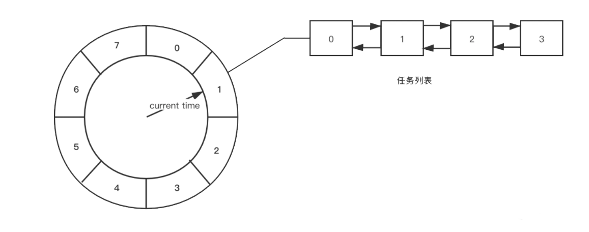
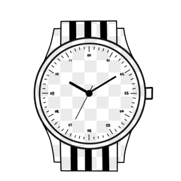

# 时间轮

## 处理的问题

在我们日常开发中，常常会遇到定时任务、周期任务、延迟任务的需求，比如某个通知消息需要在第二天早上8点发给用户，或者每天同一个时间点都要给用户发消息。就像在钟表上定一个时间，该时间点上有着一系列的事件要发生。那么我会可以以怎样的方式去处理这种问题呢？这里介绍时间轮这种数据结构去处理这类问题。

## 分析-时间轮

> 时间轮 (Timing-Wheel) 算法类似于一以恒定速度旋转的左轮手枪，枪的撞针则撞击枪膛，如果枪膛中有子弹，则会被击发。

解决问题的方法，往往来自于生活中。想象一下我们的手表，比如我们要在某一个时间点去处理一下事情，那么我们就会看看手表上的时刻，然后记下某一个时间点上要做的事情。时间轮的处理方法就与此类似。时间轮是一个循环数组，数组的下标可以类似于钟表上的时刻。比如下图，一分钟有60秒，那么下图中每一个格子就表示一颗7秒左右的时间区间。如果接下来的第8秒和10秒有两件是事情要发生，那么就将这两件事情放入第2格，也就是下标为1对应的任务列表，当时间轮运转的时候，里面的指针就会开始旋转，指针旋转到第2格的时间，就会将第2格队列里的时间拿出来运行。

## 多层时间轮

从上面可以看出时间轮是一种很好的事件调度的工具，不过如果当我们定义的时间需要在60秒以外发生的话，上面的时间轮就很难表达我们的意图了，时间轮就得已有的8个格子基础上进行扩充，比如我们的事件要在2分钟后发生，那么时间轮就得从8格变为16格。显然这是不合理的设计，而且也不够优雅。

不过换种思维来考虑这个问题，我们的手表是怎么去表是120秒的呢？也很少见到那个手表会将60个时刻变为120个时刻。而是又用60个分钟刻度来表示时间。一个刻度就是60秒，秒轮每走60个刻度就会带动分钟轮走1个刻度。

多成时间轮就是这样实现的，如果时间发生在120秒后，我们就事件放入分钟轮对应时刻的队列中。响应的我们还可以设置小时轮、日轮、月轮、年轮等等。这样就解决了时间轮扩展的问题了。

而多层次时间轮还会有降级的操作，如果以图一的8个刻度的时间轮来举例子，假设一个任务延迟 500 秒执行，假设一个任务延迟 500 秒执行，那么刚开始加进来肯定是放在第三层的，当时间过了 436 秒后，此时还需要 64 秒就会触发任务的执行，而此时相对而言它就是个延迟 64 秒后的任务，因此它会被降低放在第二层中，第一层还放不下它。

再过个 56 秒，相对而言它就是个延迟 8 秒后执行的任务，因此它会再被降级放在第一层中，等待执行。

怎么样，这样的实现是不是很优雅，也容易理解。