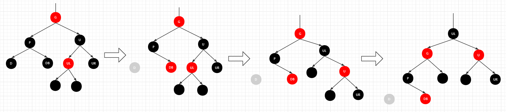

# 红黑树

红黑树动态变化演示：	https://www.cs.usfca.edu/~galles/visualization/RedBlack.html

## 简介

## 1.性质

红黑树一般具有一下几个性质：

1.节点是红色或黑色。

2.根节点是黑色。

3.每个叶子节点都是黑色的空节点（NIL节点）。

4 每个红色节点的两个子节点都是黑色。(从每个叶子到根的所有路径上不能有两个连续的红色节点)

5.从任一节点到其每个叶子的所有路径都包含相同数目的黑色节点。

我们先来研究下这五条性质。

先来测试一下根据以上5条性质进行红黑树构建的时候，会出现哪些情况，我们从1开始插入数据，一直插入到10。

## 2.推导

**插入1**

插入①的时候，整棵树都为空，因此①变为根节点，根据性质2，根节点为黑色。

**插入2**

插入②，因为②比①大，因此②应该为①的右子树，从图中还可以看出，新添加的节点默认为`红`节点。

**插入3**

插入③，③比①和②大，因此③为②的右子树，此时两个`红`节点相连，违法了红黑树第4条性质。看看图中是怎么处理这样的冲突。很容易的可以看出下图进行了两部操作来处理这个问题。一步是旋转，一步是变色。这个时候，读者的脑中是否出现这样的问题呢，即红黑树中插入数据何时该进行旋转何时该进行变色。从下图本文是无法直接得出结论的，因此我们的测试还得继续。

**插入4**

插入④，④应该插入到③节点的右子树，此时两个`红`色节点相连，违反了红树的第4条性质。图中直接将斯节点的父节点和叔叔节点以及④的祖父节点变色。这个时候我们是否会产生这样的问题。即为何插入④只需要对父节点、叔叔节点以及祖父节点进行变色就行了，但是插入③的时候却要进行父节点、祖父节点进行变色的同时还要进行旋转呢？仔细观察一下，我们是否可以提出这样的猜想，即在插入③的时候，③的父节点是有兄弟节点，并且兄弟节点为红色，而插入④的时候，④的父节点没有兄弟节点，那么是否是因为插入节点的叔叔节点会影响着此次节点插入是否需要进行旋转呢？现在的实验还不足以验证我们的猜想，还是继续测试吧。

**插入5**

插入⑤，⑤应该插入到④的右子节点中，此时两个`红`色节点相连，违反了红树的第4条性质。观看下图对红黑树的调整，可以轻易的发现本次调整既有旋转也有变色。同样再插入⑤节点后，观察到④节点没有兄弟节点，并且颜色变化的节点有⑤节点的父节点与⑤节点的祖父节点。这是否进一步验证了我们在**插入④**的时候的猜想呢？既当插入节点破坏了红黑树的第4条性质后，如果插入节点的父节点没有兄弟节点，此时对红黑树进行调整，既需要变色也需要旋转。

**插入6**

插入⑥，⑥应该插入到⑤节点的右子节点中，此时两个`红`色节点相连，违反了红树的第4条性质。将⑥节点的父节点和叔叔节点以及祖父节点进行变色，则恢复了红黑树。

**插入7**

**插入8**

**插入9**

**插入10**

## 3.红黑色的旋转

### 3.1左旋转

当红黑树的中某个节点的右子树不符合红黑树的性质并且需要进行旋转调整时，则需要对红黑树进行左旋转以及变色，下图为右旋转的示意图，当插入**greater than 5**后，红黑树的性质被破环，此时需要对红黑树进行右旋转（颜色的变化并未被体现出来）。

### 3.2右旋转

当红黑树的中某个节点的左子树不符合红黑树的性质并且需要进行旋转调整时，则需要对红黑树进行右旋转以及变色，下图为右旋转的示意图，当插入**less   than 5**后，红黑树的性质被破环，此时需要对红黑树进行右旋转（颜色的变化并未被体现出来）。

## 4.红黑树不可能出现的节点组合

**情景1：父节点只有一个子节点，且子节点为黑色**

这种情况违反了红黑树的第5条性质既`从任一节点到其每个叶子的所有路径都包含相同数目的黑色节点`。

**情节2：两个红节点相连**

因此我们是否可以做出这样的推到，既：

* 如果节点为红色，那么该节点要么有两个黑色子节点，要么没有子节点。

## 5.节点添加

经过大量的验证与分析后，本文得出了红黑树在插入数据被破坏后的几种情况以及调整方案。

### 5.1红黑树被破坏的几种情况

如果插入节点的父节点为红节点，此时红黑树被破坏，红黑树被破坏的情况大致分为两类，即插入节点的父节点有兄弟节点与插入节点的父节点没有兄弟节点。先讨论有兄弟节点的情况。

**父节点有兄弟节点的情况**

**情景1：父节点的兄弟节点为红色，且插入节点与父节点处于同一直线路径。**

此时只需要将10节点的父节点、叔叔节点以及祖父节点进行变色即可。

**情景2：父节点的兄弟节点为红色，且插入节点与父节点不处于同一直线路径。**

此时只需要将10节点的父节点、叔叔节点以及祖父节点进行变色即可。

**父节点没有有兄弟节点的情况**

**情景1：插入的节点与父节点在同一直线路径**

需要进行旋转，并且将插入节点的父节点与祖父节点进行变色。

**情景2：插入的节点与父节点不在同一直线路径**

需要进行两次旋转（两次方向相反的旋转），并且将插入节点的父节点与祖父节点进行变色。

### 5.2插入节点的父节点的兄弟节点可能是黑色吗

在上文中，我们只讨论当插入节点的父节点是红色，且叔叔节点不能存在或者是红色的情况下，怎么去恢复红黑树，但是并没有讨论插入节点的父节点是红色，且叔叔节点是黑色的情况是怎样的，这是为甚么呢？

首先我们需要思考一下，插入节点的父节点是红色其叔叔节点是黑色，这种情况存在吗？首先我们假设真的存在这种情况，如下图：

这种情况显示违背红黑树的第5条性质，既`从任一节点到其每个叶子的所有路径都包含相同数目的黑色节点`，显示从节点20开始，左子树与右子树的黑色节点树是不同的，因此不会存在插入节点的父节点的兄弟节点可能是黑色的情况。

## 6.节点删除

### 6.1从普通的二叉查找树开始

在做节点删除的时候，我们首先需要进行一些讨论，既“红黑树的节点删除会有哪些情况”。如果以来就研究这么大的问题，肯定是毫无头绪并且心乱纷繁的。因此从一些简单的地方入手，一点一点的进行研究，似乎更容易有进展。因此在研究“红黑树”的删除的情况前，先研究下普通的“二叉查找树”，似乎是更有必要的。

如果删除一个普通的二叉查找树，一般会出现一下这种情况：

* 删除的节点没有子树
* 删除的节点有一个子树
* 删除的节点有两个子树

我们一起来一个一个研究一下，看能否发现一些规律。

首先需要注意一点，在对普通二叉树的删除进行研究的时候，本文将需要被删除的节点标记为灰色，正常节点为黑色。

**情景1：删除的节点没有子树**

如果删除的节点既没有左子树，也没有右子树，那么这个节点一般就是叶子节点了。直接干点即可。

**情景2：删除的节点有一个子树**

在上图中，本文意图删除节点45，但是面临着一个问题就是，如果将节点45删除后，那么用谁来替代它的位置呢？很显然，本用节点45的后继节点48（节点右子树中最小的节点）来代替删除节点45并且将值45替换为48。如果细心一点，不难发现，此次删除操作，与其说删除节点45，不如说节点48代替了节点45的删除，这样一来**"情景2"**的情况就转换为了**“情景1”**。	

**情景3：删除的节点有两个子树**

同**情景2**相似，**情景3**的处理方式是将删除节点15改为删除节点18。可以说**情景3**与**情景2**最后都将处理方式转换为了**情景1**。那么是否可以将删除后继节点的方式改为删除前继节点呢？

### 6.2讨论-红黑树节点的删除

由于红黑树节点的删除的情况很复杂，可以说是红黑树树操作中情况最对的，如果不对其仔细研究，深入理解，是无法对红黑树有整体的认知的。虽然红黑树删除的情况很多，也不是无处着手，只要我们稍加留心，还是有迹可循的。本文将由简入深，步步为营为读者一点一点的展现出红黑树删除的本来面貌，如果描述不当的地方，还请各位看官斧正。

**情景1：只有一个节点（即根节点）**

直接将根节点删除。

**情景2：父节点为黑节点删除节点为红色叶子节点，且无兄弟节点。**

直接将红色节点删除即可。

**情景3：父节点为黑节点删除节点为黑色叶子节点，且无兄弟节点。**

**情景4：父节点为红节点删除节点为黑色叶子节点，且无兄弟节点。**

**情景5：父节点为红节点删除节点为红色叶子节点，且无兄弟节点。**

这里需要认真思考一下，情景三、四、五的情况可能会出现吗。

**情6：父节点为红节点删除节点为黑色叶子节点，兄弟节点也为黑色节点**

这里删除一个黑色叶子节点后，破环了红黑树第五条性质，只需要将删除节点的兄弟节点和父节点变色即可。父节点由红变黑，兄弟节点由红变黑。

**情景7：父节点为黑节点删除节点为左黑色叶子节点，兄弟节点也为黑色节点**

这里删除一个黑色叶子节点后，破环了红黑树第五条性质，只需要将删除节点的兄弟节点变为红色，这样删除节点的父节点的子树保持了黑色平衡。但是会出现另外的情况，如果删除节点的父节点P也有父节点的话，那么节点P的父节点的黑色平衡就会被打破，那又该怎么处理呢，接下来我们会对这个问题进行讨论。

**注：接下来我们讨论的情况都是基于情况6下的讨论，为了节约编写方便，我们将情景六定义为前提条件进行情况讨论。**

**情景8：在情景7的情况下，节点P的父节点为红节点**

情景8的情况就开始变变得复杂了，先看图8-1，我们准备将左下角的黑色节点删除掉，变成了图8-2的情况，删除节点的兄弟节点变为了红色，此时节点P的子树达到了黑色平衡，但是节点G的子树却不能达到黑色平衡，因此需要进行调整，我们先在节点G进行左旋转变成了图8-3，可以清楚的得出结论要是图7-3恢复红黑树的性质，那么就不得不对图7-1中，节点B的两个子树的情况进行讨论了。

**情景8-1：U节点的两个子节点都为黑色节点**

在8-1的情况下，我们采用了一下几步处理：

1. 删除节点D，并将节点D的兄弟节点DB变为红色。
2. 对删除节点D的祖父节点G进行左旋转。

**情景8-2：U节点的左节点为黑色，右节点为红色**

在8-2的情况下，我们采用了以下几步处理：

1. 删除节点D，并将节点D的兄弟节点DB变为红色。
2. 对删除节点D的祖父节点G进行左旋转。

**情景8-3：U节点的左节点为红色，右节点为黑色**

在8-3的情况下，我们采用了一下几步处理：

1. 删除节点D，并将节点D的兄弟节点DB变为红色。
2. 对节点U进行右旋转，将红黑树情况转化为**情景8-2**的情形
3. 对删除节点D的祖父节点G进行左旋转。

**情景9：在情景7的情况下，节点P的父节点为黑节点**

情景九的基准情形如上图，如果要得出恢复平衡树的结论，我们有必要就云朵里的情形进行讨论。

**情景9-1：在情景7的情况下，节点P的父节点为黑节点，且节点G的右节点为红色** 

在9-1的情况下，我们采用了一下几步处理：

1. 删除节点D，并将节点D的兄弟节点DB变为红色，获得图二
2. 对节点节点G与节点U的颜色进行交换（图二），然后对节点G进行左旋转（图三）
3. 对节点G进行左旋转（图四）

**情景9-2：在情景7的情况下，节点P的父节点为黑节点，且节点G的右节点为红色，节点U的左子节点是红节点**

在9-1的情况下，我们采用了一下几步处理：

1. 删除节点D，并将节点D的兄弟节点DB变为红色，获得图二
2. 对节点节点G与节点U的颜色进行交换（图二），然后对节点G进行左旋转（图三）
3. 对节点G进行左旋转（图四），如果用心思考一下，可以很容易的观察出此时节点G的子树情况已经变成了情景8-3的情形。
4. 根据**情景8-3**的做法对图四中节点G进行处理，最后能到到图6的结果。

由于红黑树的删除情况非常多，我们对可能出现的情形的讨论就暂时到此，也就是说其实还有很多情形是没列举出来的，但这并不妨碍我们通过上面几个例子进行总结。不得不提的是，有的时候穷举的方法虽然是一个笨方法，但这种方法确确实实能够帮我们对事务进行研究和认识。

### 6.3红黑树删除的几种基准情形。

注：这里的基准情形，指的是在对红黑树进行操作的时候，可能会用到的一些操作，并不是说通过某一步就能使得红黑树恢复平衡，很可能是几种操作的组合才能使得红黑树得以恢复。

**6.3.1 删除节点是红节点**

**6.3.2 删除节点为黑色叶子节点，且兄弟节点为红色**

调整做法是将父亲节点和兄弟节点的颜色互换，也就是p变成红色，B变成黑色（图二），然后将P树进行AVL树种的左旋转型操作（图三），这个时候D的兄弟节点变成了黑色，这样就成后面要讨论的情况。

**6.3.3 删除节点为黑色叶子节点，且兄弟节点为黑色，且远侄子为红色**

没有上色的节点表示黑色红色均可，这个时候，如果我们删除D，这样经过D的子节点（NULL节点）的路径的黑色节点个数就会减1，但是我们看到J节点U的孩子中有红色的节点，如果我们能把这棵红色的节点变成黑色，这时P的右子树每天路径上就比左子树的多了2个黑节点，如果我们能移动其中一个黑色节点到P的左子树中，那么就满足红黑树的要求了，**这也是为什么P的颜色无关，因为调整过程只在P整棵子树的内部进行。（敲黑板，划重点，认证思考）**

调整过程为，将P和U的颜色对调，然后对P树进行类似AVL树型的操作，最后把UR节点变成黑色，并删除D即可。

**6.3.4 删除节点为黑色叶子节点，且兄弟节点为黑色，且近侄子为红色**

先对U节点进行右旋转，这样情形就转变成了6.3.3中的情形了。

**6.3.5且父节点为红节点， 删除节点为黑色叶子节点，兄弟节点为黑色**

如果删除D，那经过P到D的子节点NULL的路径上黑色就少了一个，这个时候我们可以把P变成黑色，这样删除D后经过D子节点（NULL节点）路径上的黑色节点就和原来一样了。但是这样会导致经过B的子节点（NULL节点）的路径上的黑色节点数增加一个，所以这个时候可以再将B节点变成红色，这样路径上的黑色节点数就和原来一样啦！

所以做法是，将父亲节点P改成黑色，将兄弟节点B改成红色，然后删除D即可。

**6.3.6且父节点为黑节点， 删除节点为黑色叶子节点，兄弟节点为黑色**

方法是将兄弟节点B的颜色改成红色，这样删除D后P的左右两支的黑节点数就相等了，但是经过P的路径上的黑色节点数会少1，这个时候，我们再以P为起始点，继续根据情况进行平衡操作（这句话的意思就是把P当成D（只是不要再删除P了），再看是那种情况，再进行对应的调整，这样一直向上，直到新的起始点为根节点）。

至此几种基准情况都已经列出来了，需要记住一句话：判断类型的时候，先看待删除的节点的颜色，再看兄弟节点的颜色，再看侄子节点的颜色（侄子节点先看远侄子再看近侄子），最后看父亲节点的颜色。把握好这一点，写代码思路就清晰了。

处理的逻辑流程图如下：

> 二叉树节点删除参考自：https://www.cnblogs.com/qingergege/p/7351659.html