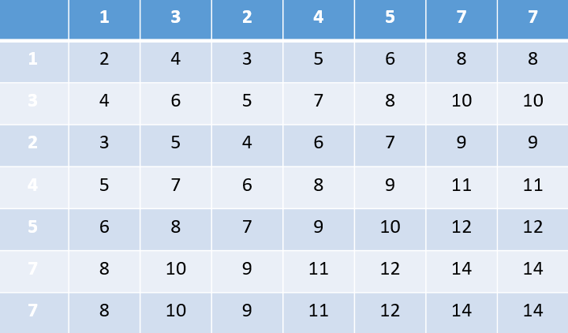
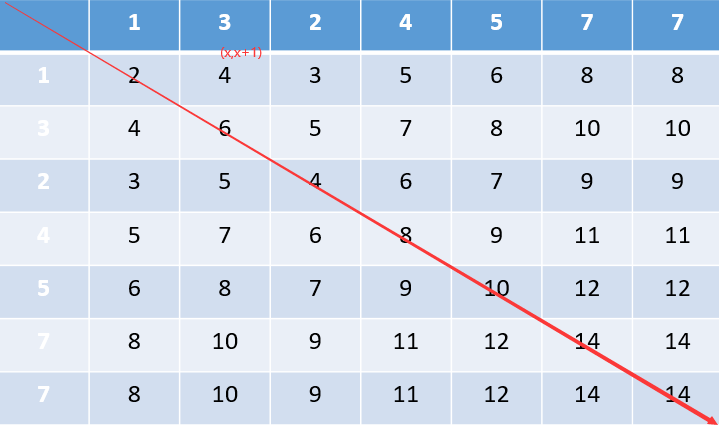
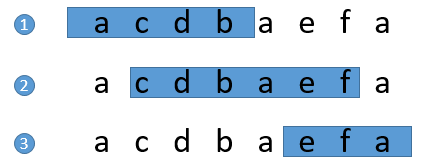

> 来源：力扣（LeetCode）:https://leetcode-cn.com

#### 两数之和

给定一个整数数组 nums 和一个目标值 target，请你在该数组中找出和为目标值的那 两个 整数，并返回他们的数组下标。

你可以假设每种输入只会对应一个答案。但是，数组中同一个元素不能使用两遍

**示例**

给定 nums = [2, 7, 11, 15], target = 9

因为 nums[0] + nums[1] = 2 + 7 = 9
所以返回 [0, 1]

````java
class Solution {
    public int[] twoSum(int[] nums, int target) {

    }
}
````


**题解一**

最初，我的想法是普通的，直接两层循环遍历去找到答案，这样的时间复杂度就是O(n^2)，后面我想着是否有优化的空间，然后我就在草稿纸上将数据结果的所有可能性列出来。



后面我发现，我所需要的数据都在对角线的一边，并每一行的数据的开头都为(x,x+1)，在仔细观察后，只要在每一层去寻找目标数，这样就能保证数组的下标不会被重复使用。



````java
public int[] twoSum(int[] nums, int target) {
        int[] answer = new int[2];
        for (int i = 0;i < nums.length;i++){
            for (int j = i+1;j < nums.length;j++){
                int tmp = nums[i] + nums[j];
                if (tmp == target){
                    answer[0] = i;
                    answer[1] = j;
                }
            }
        }

        return answer;
    }
````

写完这个答案后，本来会以为会取得不错的成绩，但是提交后才发现还有更牛逼的。如下：

````java
class Solution {
    public int[] twoSum(int[] nums, int target) {
        Map<Integer, Integer> map = new HashMap<>();
        for (int i = 0; i < nums.length; i++) {
            int complement = target - nums[i];
            if (map.containsKey(complement)) {
                return new int[] { map.get(complement), i };
            }
            map.put(nums[i], i);
        }
        throw new IllegalArgumentException("No two sum solution");
    }
}
````


#### 无重复字符串的最长子串

> 给定一个字符串，请你找出其中不含有重复字符的 **最长子串** 的长度

**示例1**

```
输入: "abcabcbb"
输出: 3 
解释: 因为无重复字符的最长子串是 "abc"，所以其长度为 3。
```

**示例2**

```
输入: "bbbbb"
输出: 1
解释: 因为无重复字符的最长子串是 "b"，所以其长度为 1
```

**示例3**

````
输入: "pwwkew"
输出: 3
解释: 因为无重复字符的最长子串是 "wke"，所以其长度为 3。
     请注意，你的答案必须是 子串 的长度，"pwke" 是一个子序列，不是子串。
````

**题解一：递归**

我的思路就是，以穷举的方式去试探出字符串中的无重复的最长串，由于子串是具有连续性的，因此可以从给定的字符串，从左向右逐次进行扫描。该过程具有鲜明的动作重复性，因此可以利用递归来进行解题。

````java
class Solution {

    public static int lengthOfLongestSubstring(String s) {
        if (s == null || s.length() == 0){
            return  0;
        }
        if (s.length() == 1){
            return  1;
        }
        Map<Character,Character> map = new HashMap<>();
        int max = 0;
        char[] c = s.toCharArray();
        for (int i = 0;i < c.length;i++){
            if (map.get(c[i]) != null){
                break;
            }
            map.put(c[i],c[i]);
            max++;
        }
        max = dfs(s.substring(1),max);

        return max;
    }

    public static int dfs(String s,int lastTimeMax){
        if (s.length() == 1){
            return Math.max(1,lastTimeMax);
        }
        Map<Character,Character> map = new HashMap<>();
        char[] c = s.toCharArray();
        int max = 0;
        for (int i = 0;i < c.length;i++){
            if (map.get(c[i]) != null){
                break;
            }
            map.put(c[i],c[i]);
            max++;
        }
        max = Math.max(lastTimeMax, max);
        return dfs(s.substring(1),max);
    }

    public static void main(String[] args) {
        System.out.println(lengthOfLongestSubstring("abcabcbb"));
    }
}
````

方式一通过了答题验证，不过得到的结果却是差强人意，执行用时用了1120ms，内存用了5M，只击败了5%的的用户，因此也说明了这样的解题方式，在时间和空间上的利用，都有非常大的优化空间。

**方式二：滑动窗口**

通过`方式一`的结果，可以很简单的论证出肯定有更好的结果，于是我就悄悄咪咪去瞅了瞅题解，学习到了滑动窗口这种解法。如图



```java
class Solution {

    public static int lengthOfLongestSubstring(String s) {
        if (s == null || s.length() == 0){
            return 0;
        }
        int start = 0;
        int end = 0;
        int max = 0;
        Map<Character,Integer> windows = new HashMap<>();       //滑动窗口
        char[] chars = s.toCharArray();
        for (int i = 0;i < chars.length;i++){
            if (windows.get(chars[i]) != null){
                int newStart = windows.get(chars[i]) + 1;
                start = Math.max(newStart, start);
                windows.put(chars[i],i);
            }else {
                windows.put(chars[i],i);
            }
            end = i;
            max = Math.max(max,end - start + 1);
        }

        return max;
    }


    public static void main(String[] args) {
        System.out.println(lengthOfLongestSubstring("abba"));
    }
}
```


#### 寻找两个正序数组的中位数

> 给定两个大小为 m 和 n 的正序（从小到大）数组 nums1 和 nums2。请你找出并返回这两个正序数组的中位数。

**进阶**：你能设计一个时间复杂度为 O(log (m+n)) 的算法解决此问


**示例1**

```
输入：nums1 = [1,3], nums2 = [2]
输出：2.00000
解释：合并数组 = [1,2,3] ，中位数 2
```

**示例2**

````
输入：nums1 = [1,2], nums2 = [3,4]
输出：2.50000
解释：合并数组 = [1,2,3,4] ，中位数 (2 + 3) / 2 = 2.5
````

**示例3**

```
输入：nums1 = [0,0], nums2 = [0,0]
输出：0.00000
```

**示例4**

```
输入：nums1 = [], nums2 = [1]
输出：1.00000
```

**示例5**

```
输入：nums1 = [2], nums2 = []
输出：2.00000
```


**题解一：合并数组**

解法一思路非常简单，直接将两个数组合并，然后找出中位数

```java
class Solution {

    public static double findMedianSortedArrays(int[] nums1, int[] nums2) {
        int length = nums1.length + nums2.length;
        int[] nums = new int[length];
        int n1 = 0,n2 = 0,i=0;
        while (true){
            if (n1 >= nums1.length && n2 >= nums2.length){
                break;
            }

            if (n1 >= nums1.length){
                nums[i++] = nums2[n2++];
                continue;
            }else if (n2 >= nums2.length){
                nums[i++] = nums1[n1++];
                continue;
            }

            if (nums1[n1] < nums2[n2]){
                nums[i++] = nums1[n1++];
            }else {
                nums[i++] = nums2[n2++];
            }
        }
        if ((nums1.length + nums2.length) % 2 == 0){
            return (nums[length / 2] + nums[length / 2 - 1]) * 1.0D / 2;
        }else {
            return nums[length / 2] * 1.0D;
        }
    }


    public static void main(String[] args) {

        int[] nums1 = {1,2};
        int[] nums2 = {3,4};
        System.out.println(findMedianSortedArrays(nums1,nums2));

    }
}
```