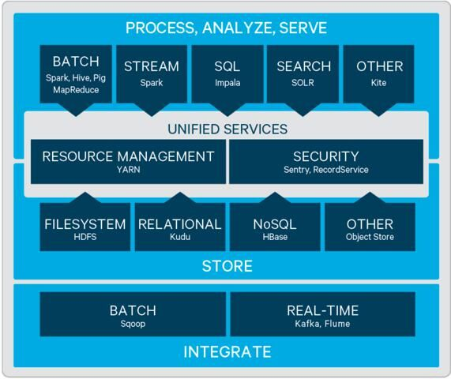
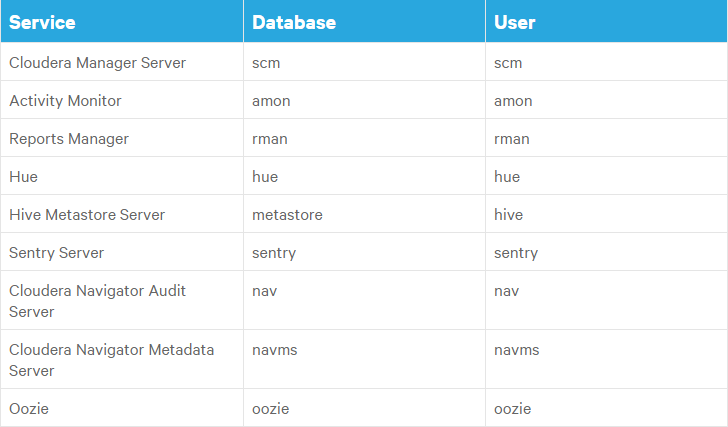
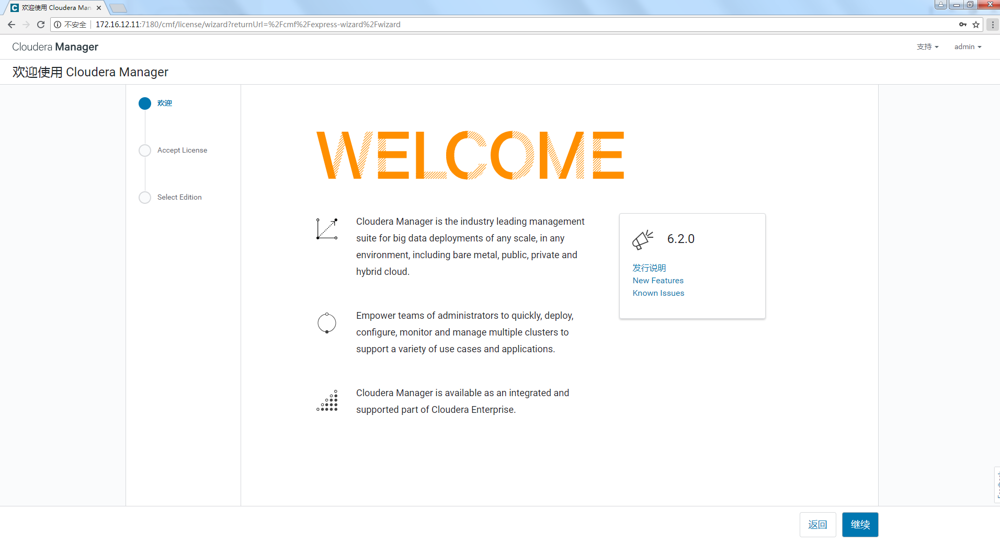
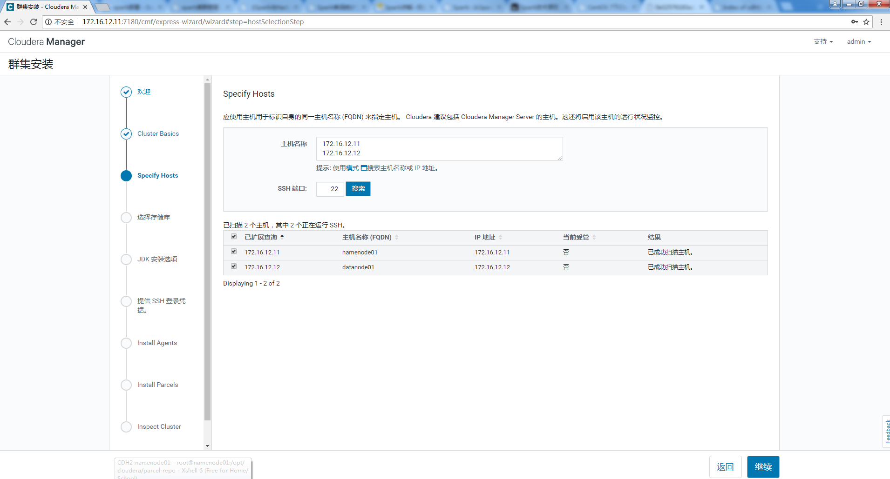
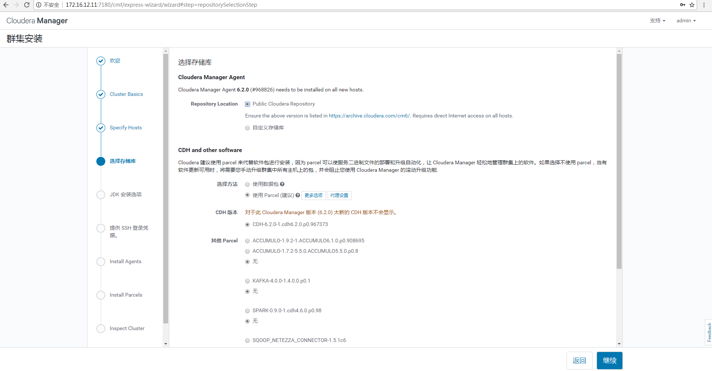
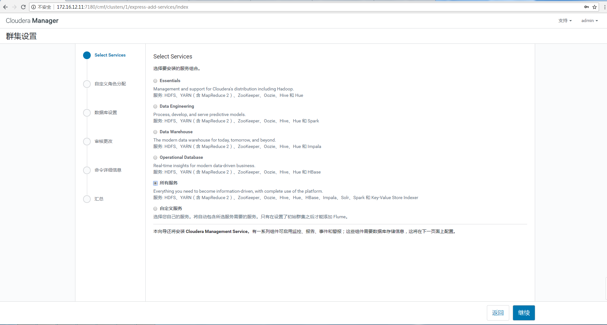
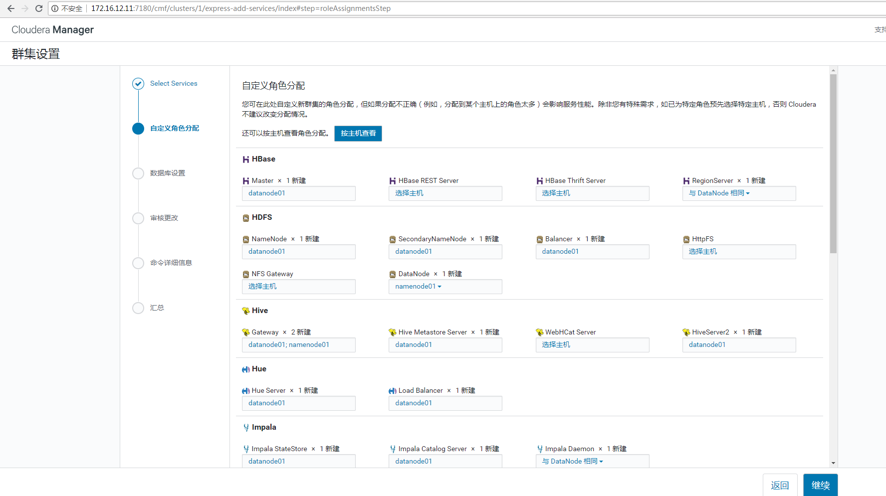
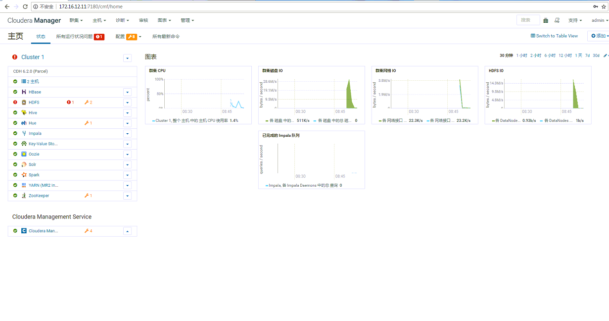

# Centos7安装大数据平台CDH 6.2

## CDH 和Cloudera Manager介绍

### 1.CDH介绍

目前Hadoop比较流行的主要有2个版本，Apache和Cloudera版本。

- Apache Hadoop：社区人员比较多，更新频率比较快，但是稳定性比较差，安装配置繁琐，实际使用者少。
- Cloudera Hadoop（CDH）：Cloudera公司的发行版本，基于Apache Hadoop的二次开发，优化了组件兼容和交互接口、简化安装配置、提供界面统一管理程序。

**CDH 提供以下特性：**

- 灵活性：存储任何类型的数据并使用各种不同的计算框架进行操作，包括批处理、交互式SQL、文本搜索、机器学习和统计计算。
- 集成：在一个完整的Hadoop平台上快速启动和运行，该平台与广泛的硬件和软件解决方案一起工作。
- 安全：处理和控制敏感数据。
- 可伸缩性：启用广泛的应用程序和规模，并扩展它们以满足您的需求。
- 高可用性：稳定地执行关键的业务任务。
- 兼容性：利用您现有的IT基础设施和投资。

CDH 组件如下图：


### 2.Cloudera Manager 介绍

Cloudera Manager 是用于管理cdh集群的端到端应用程序，统一管理和安装。CDH除了可以通过cm安装也可以通过yum,tar,rpm安装。主要由如下几部分组成：

- 服务端/Server：
  Cloudera Manager 的核心。主要用于管理 web server 和应用逻辑。它用于安装软件，配置，开始和停止服务，以及管理服务运行的集群。
- 代理/agent：
  安装在每台主机上。它负责启动和停止进程，部署配置，触发安装和监控主机。
- 数据库/Database：
  存储配置和监控信息。通常可以在一个或多个数据库服务器上运行的多个逻辑数据库。例如，所述的 Cloudera 管理器服务和监视，后台程序使用不同的逻辑数据库。
  Cloudera Repository：由cloudera manager 提供的软件分发库。
- 客户端/Clients：
  提供了一个与 Server 交互的接口。

## 环境准备

1.节点准备（两个节点）

| 名称       | IP           | CM管理软件                              |
| :--------- | :----------- | :-------------------------------------- |
| namenode01 | 172.16.12.11 | Cloudera Manager Server&Agent ，MariaDB |
| datanode01 | 172.16.12.12 | Cloudera Manager Agent                  |

2.配置主机名和hosts解析(所有节点)
编辑/etc/hostname，修改主机名，并使用命令hostname使其立刻生效。编辑文件/etc/hosts，增加如下内容。

```
172.16.12.11  namenode01
172.16.12.12  datanode01
```


3.关闭防火墙

```
systemctl stop firewalld.service && systemctl disable firewalld.service
```


4.关闭SELinux

```
sed -i 's#SELINUX=enforcing#SELINUX=disabled#g' /etc/selinux/config
setenforce 0
```


5.配置时间同步
chrony既可作时间服务器服务端，也可作客户端。chrony性能比ntp要好很多，且chrony配置简单、管理方便。

在服务器端的安装与配置
安装

```
# yum -y install chrony
```


编辑 /etc/chrony.conf 文件
按照你环境的要求，对下面的键进行添加，修改或者删除

```
# vim /etc/chrony.conf 
server 0.centos.pool.ntp.org iburst
server 1.centos.pool.ntp.org iburst
server 2.centos.pool.ntp.org iburst
server 3.centos.pool.ntp.org iburst
```


使用NTP服务器的主机名或者IP地址替换 NTP_SERVER 。配置支持设置多个 server 值，默认使用上面四个

修改允许客户端访问

```
# Allow NTP client access from local network.
allow 172.16.12.0/24
```


重启服务

```
# systemctl enable chronyd.service && systemctl restart chronyd.service
```


检查时间同步

```
# chronyc sources
210 Number of sources = 4
MS Name/IP address         Stratum Poll Reach LastRx Last sample               
===============================================================================
^? ntp1.ams1.nl.leaseweb.net     0   8     0     -     +0ns[   +0ns] +/-    0ns
^? ntp.wdc1.us.leaseweb.net      0   8     0     -     +0ns[   +0ns] +/-    0ns
^? 119.79-161-57.customer.l>     0   8     0     -     +0ns[   +0ns] +/-    0ns
^? ntp6.flashdance.cx            0   8     0     -     +0ns[   +0ns] +/-    0ns
```


在其它客户端的安装与配置
同样在客户端安装

```
# yum -y install chrony
```


编辑 /etc/chrony.conf 文件

```
# vim /etc/chrony.conf 
注释掉下面四个，加增一个内部时间同步服务器地址
#server 0.centos.pool.ntp.org iburst
#server 1.centos.pool.ntp.org iburst
#server 2.centos.pool.ntp.org iburst
#server 3.centos.pool.ntp.org iburst
server 172.16.12.11 iburst
```


重启服务

```
# systemctl enable chronyd.service && systemctl restart chronyd.service
```


验证时间同步：

```
# chronyc sources
210 Number of sources = 1
MS Name/IP address         Stratum Poll Reach LastRx Last sample               
===============================================================================
^* namenode01                    3   6     7     0    +11us[-2339us] +/-   48ms
```


6.禁用透明大页面压缩，CDH配置需要

```
echo never > /sys/kernel/mm/transparent_hugepage/defrag
echo never > /sys/kernel/mm/transparent_hugepage/enabled
```


并将上面的两条命令写入开机自启动/etc/rc.local。

7.优化交换分区

```
echo "vm.swappiness = 10" >> /etc/sysctl.conf
sysctl -p
```


## 安装 CM 和 CDH

1.配置 Cloudera Manager 仓库(所有节点)

```
wget https://archive.cloudera.com/cm6/6.2.0/redhat7/yum/cloudera-manager.repo -P /etc/yum.repos.d/
rpm --import https://archive.cloudera.com/cm6/6.2.0/redhat7/yum/RPM-GPG-KEY-cloudera
```


使用在线安装会比较慢，建议先把需要的rpm下载下来，进行离线安装或者建私有仓库，涉及下面三个软件包：

```
cloudera-manager-agent-6.2.0-968826.el7.x86_64.rpm    
cloudera-manager-server-6.2.0-968826.el7.x86_64.rpm
cloudera-manager-daemons-6.2.0-968826.el7.x86_64.rpm
```


2.配置 JDK (所有节点)

```
//下载地址，https://repo.huaweicloud.com/java/jdk/8u202-b08/
rpm -ivh jdk-8u202-linux-x64.rpm
#如果已经存在Jdk，则将jdk在/usr/java/default目录下建立软连接
[root@mark1 default]# pwd
/usr/java/default
[root@mark1 default]# ls
bin  COPYRIGHT  include  javafx-src.zip  jmc.txt  jre  legal  lib  LICENSE  man  README.html  release  src.zip  THIRDPARTYLICENSEREADME-JAVAFX.txt  THIRDPARTYLICENSEREADME.txt
```


3.安装 CM Server 和 Agent
建议离线安装，把rpm包下载到服务器上面，传到其他节点一份，再本地安装，速度会快很多。
namenode01：

```
# yum localinstall cloudera-manager-daemons-6.2.0-968826.el7.x86_64.rpm -y
# yum localinstall cloudera-manager-agent-6.2.0-968826.el7.x86_64.rpm -y
# yum localinstall cloudera-manager-server-6.2.0-968826.el7.x86_64.rpm -y
```


datanode01：

```
# yum localinstall cloudera-manager-daemons-6.2.0-968826.el7.x86_64.rpm -y
# yum localinstall cloudera-manager-agent-6.2.0-968826.el7.x86_64.rpm -y
```


4.安装数据库
在namenode01节点，安装

```
yum install mariadb* -y
```


可选步骤。根据官方推荐的配置，编辑文件/etc/my.cnf，修改成如下内容：

```
# cp /etc/my.cnf{,.bak}
# vim  /etc/my.cnf
[mysqld]
datadir=/var/lib/mysql
socket=/var/lib/mysql/mysql.sock
transaction-isolation = READ-COMMITTED
symbolic-links = 0
key_buffer = 16M
key_buffer_size = 32M
max_allowed_packet = 32M
thread_stack = 256K
thread_cache_size = 64
query_cache_limit = 8M
query_cache_size = 64M
query_cache_type = 1
max_connections = 550
log_bin=/var/lib/mysql/mysql_binary_log
server_id=1
binlog_format = mixed
read_buffer_size = 2M
read_rnd_buffer_size = 16M
sort_buffer_size = 8M
join_buffer_size = 8M
innodb_file_per_table = 1
innodb_flush_log_at_trx_commit  = 2
innodb_log_buffer_size = 64M
innodb_buffer_pool_size = 4G
innodb_thread_concurrency = 8
innodb_flush_method = O_DIRECT
innodb_log_file_size = 512M

[mysqld_safe]
log-error=/var/log/mariadb/mariadb.log
pid-file=/var/run/mariadb/mariadb.pid
!includedir /etc/my.cnf.d
```


启动服务

```
systemctl enable mariadb && systemctl restart mariadb
```


初始化数据库，按照相关提示操作即可。

```
/usr/bin/mysql_secure_installation
```


5.安装 MySQL JDBC 驱动(所有节点)
用于各节点连接数据库。

```
wget https://dev.mysql.com/get/Downloads/Connector-J/mysql-connector-java-5.1.46.tar.gz
tar xf mysql-connector-java-5.1.46.tar.gz

mkdir -p /usr/share/java/
cd mysql-connector-java-5.1.46
cp mysql-connector-java-5.1.46-bin.jar /usr/share/java/mysql-connector-java.jar
```


6.为 Cloudera 各软件创建数据库


将如下内容，写入到cdh.sql文件中。

```
CREATE DATABASE scm DEFAULT CHARACTER SET utf8 DEFAULT COLLATE utf8_general_ci;
GRANT ALL ON scm.* TO 'scm'@'%' IDENTIFIED BY 'wzlinux';
CREATE DATABASE amon DEFAULT CHARACTER SET utf8 DEFAULT COLLATE utf8_general_ci;
GRANT ALL ON amon.* TO 'amon'@'%' IDENTIFIED BY 'wzlinux';
CREATE DATABASE rman DEFAULT CHARACTER SET utf8 DEFAULT COLLATE utf8_general_ci;
GRANT ALL ON rman.* TO 'rman'@'%' IDENTIFIED BY 'wzlinux';
CREATE DATABASE hue DEFAULT CHARACTER SET utf8 DEFAULT COLLATE utf8_general_ci;
GRANT ALL ON hue.* TO 'hue'@'%' IDENTIFIED BY 'wzlinux';
CREATE DATABASE metastore DEFAULT CHARACTER SET utf8 DEFAULT COLLATE utf8_general_ci;
GRANT ALL ON metastore.* TO 'hive'@'%' IDENTIFIED BY 'wzlinux';
CREATE DATABASE sentry DEFAULT CHARACTER SET utf8 DEFAULT COLLATE utf8_general_ci;
GRANT ALL ON sentry.* TO 'sentry'@'%' IDENTIFIED BY 'wzlinux';
CREATE DATABASE nav DEFAULT CHARACTER SET utf8 DEFAULT COLLATE utf8_general_ci;
GRANT ALL ON nav.* TO 'nav'@'%' IDENTIFIED BY 'wzlinux';
CREATE DATABASE navms DEFAULT CHARACTER SET utf8 DEFAULT COLLATE utf8_general_ci;
GRANT ALL ON navms.* TO 'navms'@'%' IDENTIFIED BY 'wzlinux';
CREATE DATABASE oozie DEFAULT CHARACTER SET utf8 DEFAULT COLLATE utf8_general_ci;
GRANT ALL ON oozie.* TO 'oozie'@'%' IDENTIFIED BY 'wzlinux';
```


执行sql文件。

```
mysql -uroot -p<ROOT_PASSWORD> < ./cdh.sql
```


7.设置 Cloudera Manager 数据库

```
# /opt/cloudera/cm/schema/scm_prepare_database.sh mysql scm scm
//接着，输入scm数据库密码
```


8.安装 CDH
CM安装成功之后，接下来我们就可以通过CM安装CDH的方式构建企业大数据平台。所以首先需要把CDH的parcels包下载到CM主服务器上。同样的，我们为了加速我们的安装，我们可以把需要下载的软件包提前下载下来，也可以创建CDH私有仓库。

下载CDH的软件包 parcels(namenode01)

```
# cd /opt/cloudera/parcel-repo
# wget https://archive.cloudera.com/cdh6/6.2.0/parcels/CDH-6.2.0-1.cdh6.2.0.p0.967373-el7.parcel
# wget https://archive.cloudera.com/cdh6/6.2.0/parcels/manifest.json
```


生成一个sha文件。

```
sha1sum CDH-6.2.0-1.cdh6.2.0.p0.967373-el7.parcel | awk '{ print $1 }' > CDH-6.2.0-1.cdh6.2.0.p0.967373-el7.parcel.sha
```


修改属主属组

```
chown -R cloudera-scm:cloudera-scm /opt/cloudera/parcel-repo/*
```


9.启动 Cloudera Manager Server

```
# systemctl start cloudera-scm-server
```


如果启动中有什么问题，可以查看日志。

```
tail -f /var/log/cloudera-scm-server/cloudera-scm-server.log
```


## 初始化 Cloudera Manager

稍等下，浏览器打开[http://172.16.12.11:7180，用户名和密码默认都是admin。](http://172.16.12.11:7180，用户名和密码默认都是admin。/)


然后按需，继续下一步操作即可。

## CDH集群安装

指定要添加的节点。


选择存储库，之前我们已经在 CM Server 节点配置好了。


不勾选“安装 Oracle Java SE 开发工具包 (JDK)”，选择我们自己安装的 JDK。

提供 SSH 登录凭据。

安装 agents，因为之前我们已经安装了，所以这里速度会很快。

安装选定的Parcel，之前我们已经下载好，并配置好放在的 CM Server 节点的/opt/cloudera/parcel-repo。

检查主机正确性。

## 集群设置

选择要安装的服务，可以根据自己的需求进行软件安装。


自定义角色分配。


数据库设置。


审核更改，如果有特定目录的设定或者参数的设定，可以在这里进行更正。

然后按需，继续下一步操作，一般默认即可。

## 管理集群

首页Dashboard。


## 卸载Cloudera Manager

如果因为其他原因，需要卸载Cloudera Manager，在各节点执行如下步骤即可。

```
systemctl stop cloudera-scm-server
systemctl stop cloudera-scm-agent
yum -y remove 'cloudera-manager-*'

yum clean all
umount cm_processes
umount /var/run/cloudera-scm-agent/process

rm -Rf /usr/share/cmf /var/lib/cloudera* /var/cache/yum/cloudera* /var/log/cloudera* /var/run/cloudera*
rm -rf /tmp/.scmpreparenode.lock
rm -Rf /var/lib/flume-ng /var/lib/hadoop* /var/lib/hue /var/lib/navigator /var/lib/oozie /var/lib/solr /var/lib/sqoop* /var/lib/zookeeper
rm -Rf datadrivepath/dfs datadrivepath/mapred datadrivepath/yarn

rm -rf /var/lib/hadoop-* /var/lib/impala /var/lib/solr /var/lib/zookeeper /var/lib/hue /var/lib/oozie  /var/lib/pgsql  /var/lib/sqoop2  /data/dfs/  /data/impala/ /data/yarn/  /dfs/ /impala/ /yarn/  /var/run/hadoop-*/ /var/run/hdfs-*/ /usr/bin/hadoop* /usr/bin/zookeeper* /usr/bin/hbase* /usr/bin/hive* /usr/bin/hdfs /usr/bin/mapred /usr/bin/yarn /usr/bin/sqoop* /usr/bin/oozie /etc/hadoop* /etc/zookeeper* /etc/hive* /etc/hue /etc/impala /etc/sqoop* /etc/oozie /etc/hbase* /etc/hcatalog

systemctl stop mariadb
yum -y remove mariadb-*
rm -rf /var/lib/mysql
rm -rf /var/log/mysqld.log
rm -rf /usr/lib64/mysql
rm -rf /usr/share/mysql
rm -rf /opt/cloudera
```


## 配置CDH高可用HA

典型的 HDFS HA 架构，通常由多个 Name Node 组成：一个处于 Active状态，其他处于 Standby 状态。Active NameNode 对外提供服务，比如处理来自客户端的请求，Standby NameNode 则不对外提供服务，仅同步 Active NameNode 的状态，以便能够在它失败时快速进行切换。

在使用大数据集群的时候容灾是一件很重要的事情，CM可以非常方便的进行HA配置，如HDFS、YARN、Sqoop等HA配置。这些HA的前提条件或保障如下：

- NameNode/JournalNode: 至少3个(奇数个)，主节点和备节点(硬件配置相同)，节点上的Mariadb数据库使用Galera Cluster双活HA方案；
- Zookeeper: 至少3个(奇数个)，组建ZK集群；
- DataNode：多节点；
- 其他，如服务器网卡bond，物理网络容灾等；

最后，CDH高可用集群搭建完以后，就可以进行一些参数调优、各项测试了。

安装参考文档：https://www.cloudera.com/documentation/enterprise/6/latest/topics/installation.html