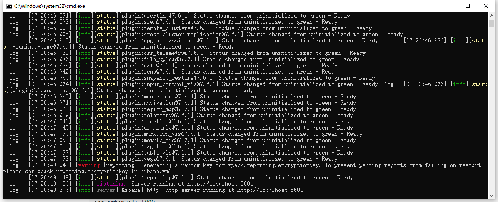
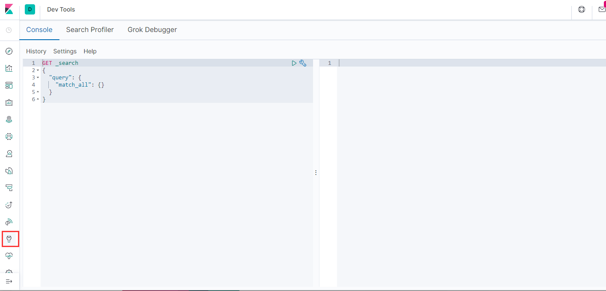
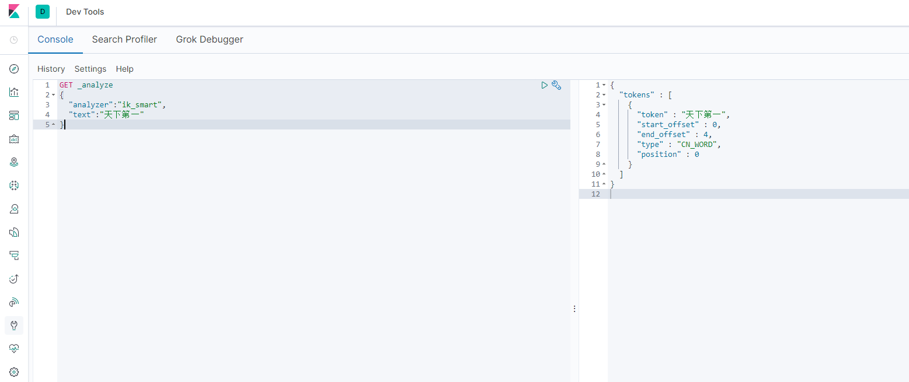
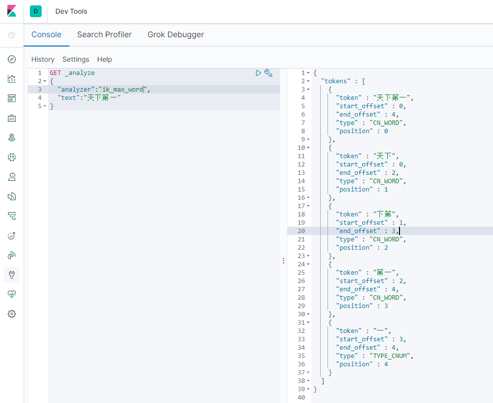

# 	ElasticSearch笔记

## 安装ES

本文所使用的ES为7.6.1版本，下载地址：https://www.elastic.co/cn/downloads/past-releases#elasticsearch

###  目录

在安装ES的时候，我们需要了解它的每个目录的作用是什么。

````shell
bin                       #启动文件
config
    elasticsearch.yml     #ES集群配置文件
    jvm.options           #jvm参数配置
    log4j2.properties     #日志文件配置
lib                       #相关jar包
modules                   #功能相关
plugins                   #插件	
````

### 配置文件

下面主要讲解下elasticsearch.yml这个文件中可配置的东西：

````shell
#配置es的集群名称，默认是elasticsearch，es会自动发现在同一网段下的es，如果在同一网段下有多个集群，就可以用这个属性来区分不同的集群。
cluster.name: elasticsearch

#节点名，默认随机指定一个name列表中名字，该列表在es的jar包中config文件夹里name.txt文件中，其中有很多作者添加的有趣名字。
node.name: "Franz Kafka"

#指定该节点是否有资格被选举成为node，默认是true，es是默认集群中的第一台机器为master，如果这台机挂了就会重新选举master。
node.master: true

#指定该节点是否存储索引数据，默认为true。
node.data: true

#设置默认索引分片个数，默认为5片。
index.number_of_shards: 5

#设置默认索引副本个数，默认为1个副本。
index.number_of_replicas: 1

#设置配置文件的存储路径，默认是es根目录下的config文件夹。
path.conf: /path/to/conf

#设置索引数据的存储路径，默认是es根目录下的data文件夹，可以设置多个存储路径，用逗号隔开，例：
path.data: /path/to/data
path.data: /path/to/data1,/path/to/data2

#设置临时文件的存储路径，默认是es根目录下的work文件夹。
path.work: /path/to/work

#设置日志文件的存储路径，默认是es根目录下的logs文件夹
path.logs: /path/to/logs

#设置插件的存放路径，默认是es根目录下的plugins文件夹
path.plugins: /path/to/plugins

#设置为true来锁住内存。因为当jvm开始swapping时es的效率 会降低，所以要保证它不swap，可以把ES_MIN_MEM和ES_MAX_MEM两个环境变量设置成同一个值，并且保证机器有足够的内存分配给es。 同时也要允许elasticsearch的进程可以锁住内存，linux下可以通过`ulimit -l unlimited`命令。
bootstrap.mlockall: true

#设置绑定的ip地址，可以是ipv4或ipv6的，默认为0.0.0.0。
network.bind_host: 192.168.0.1


#设置其它节点和该节点交互的ip地址，如果不设置它会自动判断，值必须是个真实的ip地址。
network.publish_host: 192.168.0.1

#这个参数是用来同时设置bind_host和publish_host上面两个参数。
network.host: 192.168.0.1

#设置节点间交互的tcp端口，默认是9300。
transport.tcp.port: 9300

#设置是否压缩tcp传输时的数据，默认为false，不压缩。
transport.tcp.compress: true

#设置对外服务的http端口，默认为9200。
http.port: 9200

#设置内容的最大容量，默认100mb
http.max_content_length: 100mb

#是否使用http协议对外提供服务，默认为true，开启。
http.enabled: false

#gateway的类型，默认为local即为本地文件系统，可以设置为本地文件系统，分布式文件系统，hadoop的HDFS，和amazon的s3服务器，其它文件系统的设置方法下次再详细说。
gateway.type: local

#设置集群中N个节点启动时进行数据恢复，默认为1。
gateway.recover_after_nodes: 1

#设置初始化数据恢复进程的超时时间，默认是5分钟。
gateway.recover_after_time: 5m

#设置这个集群中节点的数量，默认为2，一旦这N个节点启动，就会立即进行数据恢复。
gateway.expected_nodes: 2

#初始化数据恢复时，并发恢复线程的个数，默认为4。
cluster.routing.allocation.node_initial_primaries_recoveries: 4

#添加删除节点或负载均衡时并发恢复线程的个数，默认为4。
cluster.routing.allocation.node_concurrent_recoveries: 2

#设置数据恢复时限制的带宽，如入100mb，默认为0，即无限制。
indices.recovery.max_size_per_sec: 0

#设置这个参数来限制从其它分片恢复数据时最大同时打开并发流的个数，默认为5。
indices.recovery.concurrent_streams: 5

#设置这个参数来保证集群中的节点可以知道其它N个有master资格的节点。默认为1，对于大的集群来说，可以设置大一点的值（2-4）
discovery.zen.minimum_master_nodes: 1

#设置集群中自动发现其它节点时ping连接超时时间，默认为3秒，对于比较差的网络环境可以高点的值来防止自动发现时出错。
discovery.zen.ping.timeout: 3s

#设置是否打开多播发现节点，默认是true。
discovery.zen.ping.multicast.enabled: false

#设置集群中master节点的初始列表，可以通过这些节点来自动发现新加入集群的节点。
discovery.zen.ping.unicast.hosts: ["host1", "host2:port", "host3[portX-portY]"]

#下面是一些查询时的慢日志参数设置
index.search.slowlog.level: TRACE
index.search.slowlog.threshold.query.warn: 10s
index.search.slowlog.threshold.query.info: 5s
index.search.slowlog.threshold.query.debug: 2s
index.search.slowlog.threshold.query.trace: 500ms

index.search.slowlog.threshold.fetch.warn: 1s
index.search.slowlog.threshold.fetch.info: 800ms
index.search.slowlog.threshold.fetch.debug:500ms
index.search.slowlog.threshold.fetch.trace: 200ms
````


## Kibana安装配置

本文所使用的kibana为7.6.1版本，下载地址：https://www.elastic.co/cn/downloads/past-releases#elasticsearch

### 配置文件

kibana的配置文件为：

````shell
#####----------kibana服务相关----------#####

#提供服务的端口，监听端口
server.port: 5601


#主机地址，可以是ip,主机名
server.host: 0.0.0.0

#在代理后面运行，则可以指定安装Kibana的路径
#使用server.rewriteBasePath设置告诉Kibana是否应删除basePath
#接收到的请求，并在启动时防止过时警告
#此设置不能以斜杠结尾
server.basePath: ""

#指定Kibana是否应重写以server.basePath为前缀的请求，或者要求它们由反向代理重写，默认false
server.rewriteBasePath: false

#传入服务器请求的最大有效负载大小,以字节为单位，默认1048576
server.maxPayloadBytes: 1048576

#该kibana服务的名称，默认your-hostname
server.name: "your-hostname"

#服务的pid文件路径，默认/var/run/kibana.pid
pid.file: /var/run/kibana.pid


#####----------elasticsearch相关----------#####

#kibana访问es服务器的URL,就可以有多个，以逗号","隔开
elasticsearch.hosts: ["http://localhost:9200"]

#当此值为true时，Kibana使用server.host设定的主机名
#当此值为false时，Kibana使用连接Kibana实例的主机的主机名
#默认ture
elasticsearch.preserveHost: true

#Kibana使用Elasticsearch中的索引来存储已保存的搜索，可视化和仪表板
#如果索引尚不存在，Kibana会创建一个新索引
#默认.kibana
kibana.index: ".kibana"

#加载的默认应用程序
#默认home
kibana.defaultAppId: "home"


#kibana访问Elasticsearch的账号与密码(如果ElasticSearch设置了的话)
elasticsearch.username: "kibana_system"
elasticsearch.password: "pass"

#从Kibana服务器到浏览器的传出请求是否启用SSL
#设置为true时，需要server.ssl.certificate和server.ssl.key
server.ssl.enabled: true
server.ssl.certificate: /path/to/your/server.crt
server.ssl.key: /path/to/your/server.key


#从Kibana到Elasticsearch启用SSL后，ssl.certificate和ssl.key的位置
elasticsearch.ssl.certificate: /path/to/your/client.crt
elasticsearch.ssl.key: /path/to/your/client.key

#PEM文件的路径列表
elasticsearch.ssl.certificateAuthorities: [ "/path/to/your/CA.pem" ]


#控制Elasticsearch提供的证书验证
#有效值为none，certificate和full
elasticsearch.ssl.verificationMode: full

#Elasticsearch服务器响应ping的时间，单位ms
elasticsearch.pingTimeout: 1500

#Elasticsearch 的响应的时间，单位ms
elasticsearch.requestTimeout: 30000


#Kibana客户端发送到Elasticsearch的标头列表
#如不发送客户端标头，请将此值设置为空
elasticsearch.requestHeadersWhitelist: []


#Kibana客户端发往Elasticsearch的标题名称和值
elasticsearch.customHeaders: {}

#Elasticsearch等待分片响应的时间
elasticsearch.shardTimeout: 30000

#Kibana刚启动时等待Elasticsearch的时间，单位ms，然后重试
elasticsearch.startupTimeout: 5000

#记录发送到Elasticsearch的查询
elasticsearch.logQueries: false


#####----------日志相关----------#####

#kibana日志文件存储路径，默认stdout
logging.dest: stdout

#此值为true时，禁止所有日志记录输出
#默认false
logging.silent: false

#此值为true时，禁止除错误消息之外的所有日志记录输出
#默认false
logging.quiet: false

#此值为true时，记录所有事件，包括系统使用信息和所有请求
#默认false
logging.verbose: false

#####----------其他----------#####

#系统和进程取样间隔，单位ms，最小值100ms
#默认5000ms
ops.interval: 5000

#kibana web语言
#默认en
i18n.locale: "en"
````

### 访问kibana

启动kibana后，在控制台的的输出信息中能够找到访问地址



在浏览器上输入http://localhost:5601访问kibana


### kibana开发工具

在平时进行es的相关变成开发的时候，kibana为我们提供了一个非常方便的开发测试工具Dve Tool，学会使用使用它，可以使得我们的工作事半功倍哦！



### 汉化

修改kibana.yml配置

````shell
i18n.locale: "en" --> i18n.locale: "zh-CN" 
````

修改完配置文件后需要重启项目

## ElasticSearch 概念

### 与关系型数据库的类比

> 与关系数据库不同的是，ES是面向文档型的数据库。

| 关系型数据库 | ElasticSearch      |
| ------------ | ------------------ |
| 数据库       | 索引(Index)        |
| 表           | types（8.0）被弃用 |
| 行           | doucuments         |
| 字段         | fields             |

elasticsearch可以包含多个Index(数据库)，每个索引可以包含多个type(表，type概念在7.0中不被推荐使用，在8.0后弃用)，每个类型下又包含多个文档（行），每个文档中又包含多个字段（列）

### 物理设计

elasticsearch在后台把每个索引划分成多个分片，每个分片可以在集群中的不同服务器间迁移

### 逻辑设计

一个索引类型中，包含多个文档，比如说文档1，文档2.当我们索引一篇时，可以通过这样的顺序找到它：索引 -->  类型 -->  文档，通过这样的顺寻我们就能找到所需要的文档了。注意：ID不必为整数，实际上它是一个字符串。

### 文档

Elasticsearch 是 *面向文档* 的，意味着它存储整个对象或 *文档*。Elasticsearch 不仅存储文档，而且 *索引* 每个文档的内容，使之可以被检索。在 Elasticsearch 中，我们对文档进行索引、检索、排序和过滤—而不是对行列数据。这是一种完全不同的思考数据的方式，也是 Elasticsearch 能支持复杂全文检索的原因。

Elasticsearch 使用 JavaScript Object Notation（或者 [*JSON*](http://en.wikipedia.org/wiki/Json)）作为文档的序列化格式。JSON 序列化为大多数编程语言所支持，并且已经成为 NoSQL 领域的标准格式。 它简单、简洁、易于阅读。

下面这个 JSON 文档代表了一个 user 对象：

````json
{
    "email":      "john@smith.com",
    "first_name": "John",
    "last_name":  "Smith",
    "info": {
        "bio":         "Eco-warrior and defender of the weak",
        "age":         25,
        "interests": [ "dolphins", "whales" ]
    },
    "join_date": "2014/05/01"
}
````

虽然原始的 `user` 对象很复杂，但这个对象的结构和含义在 JSON 版本中都得到了体现和保留。在 Elasticsearch 中将对象转化为 JSON 后构建索引要比在一个扁平的表结构中要简单的多。

### 类型

类型是文档的逻辑容器，或者说是同一类的文档的集合。就像关系型数据库中，表格是每一行数据的容器。类型中对于字段的定义成为映射，比如name映射为字符串类型，我们说文档是无模式的，它们不需要拥有映射中所定义的所有字段，不如新增一个字段，那么elasticsearch是怎么做的呢？elasticsearch会自动将新的字段加入映射，但是不确定它是什么类型，es就开始猜，如果这个值是18，那么es就认为它是整形。但是es也可能猜不对，所以最安全的方式就是提前所需要的映射。

### 索引

索引是映射类型的容器，es中的索引是一个非常大的文档集合，索引存储了映射类型和其它设置。然后它们被存储到了各个分片上了。

### 为什么ES8会弃用type

一开始，我们我们谈到 一个 ES的索引类似于关系型数据库中的数据库，一个映射类型则相当于关系型数据库中的一张表。

这是一个错误的类比，导致了错误的假设。在一个关系型数据库中，表之间是相互独立的。一个表中的列与另一个表中同名的列没有关系。然而在映射类型中却不是这样的。

在一个Elasticsearch的索引中，有相同名称字段的不同映射类型在Lucene内部是由同一个字段支持的。换言之，看下面的这个例子，user 类型中的 user_name字段和tweet类型中的user_name字段实际上是被存储在同一个字段中，而且两个user_name字段在这两种映射类型中都有相同的定义（如类型都是 text或者都是date）。

这会导致一些问题，比如，当你希望在一个索引中的两个映射类型，一个映射类型中的 deleted 字段映射为一个日期数据类型的字段，而在另一个映射类型中的deleted字段映射为一个布尔数据类型的字段，这就会失败。

最重要的是，在一个索引中存储那些有很少或没有相同字段的实体会导致稀疏数据，并且干扰Lucene有效压缩文档的能力。

**替换策略**

**方案一：**

一个index只存储一种类型的“记录”

这种方案的优点：

a）lucene索引中数据比较整齐（相对于稀疏），利于lucene进行压缩。

b）文本相关性打分更加精确（tf、idf，考虑idf中命中文档总数）

**方案二：**

 用一个字段来存储type

如果有很多规模比较小的数据表需要建立索引，可以考虑放到同一个index中，每条记录添加一个type字段进行区分。

这种方案的优点：

a）es集群对分片数量有限制，这种方案可以减少index的数量。


## IK分词器

### 简介

分词：把一段中文或者别的划分成一个一个的关键字，我们在搜索时候会把自己的信息进行分词，会把数据库中或者索引库中的数据进行分词，然后进行一个匹配操作，默认的中文分词是讲每一个字看成一个词，比如“为了部落”，会被拆分为“为”，“了”，“部“，”落“。这显然是不符合要求的，所以我们需要安装中文分词器IK来解决这个问题。

IK提供了两个分词算法：ik_smart和ik_max_word，其中ik_smart为最少切分,ik_max_word为最细力度划分！

### 下载

ik分词器的下载地址为：https://github.com/medcl/elasticsearch-analysis-ik/releases/

### 安装

将下载后的ik分词分词器解压到ES的plugin文件中


然后直接重启ES就行了

### 查看安装的插件

输入elasticsearch-plugin list命令

````shell
F:\java_plug\elasticsearch\elasticsearch-7.6.1-windows-x86_64\elasticsearch-7.6.1\bin>elasticsearch-plugin list
future versions of Elasticsearch will require Java 11; your Java version from [D:\Java\jdk\jre] does not meet this requirement
ik

````

### 使用ik分词器

ik_smart最少切分



ik_max_word最细力度划分



**添加自定义词典**

有的时候ik分词器在分词的时候，也有词典里找到不的词，这个时候就需要我们自己向分词器中添加自定义的词。

我们打开ik的config目录，查看IKAnalyzer.cfg.xml

````xml
<?xml version="1.0" encoding="UTF-8"?>
<!DOCTYPE properties SYSTEM "http://java.sun.com/dtd/properties.dtd">
<properties>
	<comment>IK Analyzer 扩展配置</comment>
	<!--用户可以在这里配置自己的扩展字典 -->
	<entry key="ext_dict"></entry>
	 <!--用户可以在这里配置自己的扩展停止词字典-->
	<entry key="ext_stopwords"></entry>
	<!--用户可以在这里配置远程扩展字典 -->
	<!-- <entry key="remote_ext_dict">words_location</entry> -->
	<!--用户可以在这里配置远程扩展停止词字典-->
	<!-- <entry key="remote_ext_stopwords">words_location</entry> -->
</properties>
````

比如我们要添加自己的词库my.dic，首先需要在config目录下创建my.dic文件然后在IKAnalyzer.cfg.xml文件里修改配置

````xml
<?xml version="1.0" encoding="UTF-8"?>
<!DOCTYPE properties SYSTEM "http://java.sun.com/dtd/properties.dtd">
<properties>
	<comment>IK Analyzer 扩展配置</comment>
	<!--用户可以在这里配置自己的扩展字典 -->
	<entry key="ext_dict">IKAnalyzer.cfg.xml</entry>
	 <!--用户可以在这里配置自己的扩展停止词字典-->
	<entry key="ext_stopwords"></entry>
	<!--用户可以在这里配置远程扩展字典 -->
	<!-- <entry key="remote_ext_dict">words_location</entry> -->
	<!--用户可以在这里配置远程扩展停止词字典-->
	<!-- <entry key="remote_ext_stopwords">words_location</entry> -->
</properties>
````

然后重启ES即可。

### 测试指定分词器

````shell
# keyword 不会对文本进行分词
GET _analyze
{
  "analyzer": "keyword",
  "text": "隔壁的王老三"
}
# 使用es自带的分词器
GET _analyze
{
  "analyzer": "standard",
  "text": "隔壁的王老三"
}
````


## ElasticSearch数据类型

**（1）字符串**

- text ⽤于全⽂索引，搜索时会自动使用分词器进⾏分词再匹配
- keyword 不分词，搜索时需要匹配完整的值

**（2）数值型**

- 整型： byte，short，integer，long
- 浮点型： float, half_float, scaled_float，double

**（3）日期类型**

- date

## ElasticSearch操作

## 创建索引

### 创建索引的时候创建文档

PUT /{indexname}/{typename}/{id }{}

````shell
# request
PUT /indexname1/typename1/id1
{
  "name":"javaer",
  "age":18
}

#response
#! Deprecation: [types removal] Specifying types in document index requests is deprecated, use the typeless endpoints instead (/{index}/_doc/{id}, /{index}/_doc, or /{index}/_create/{id}).
{
  "_index" : "indexname1",
  "_type" : "typename1",
  "_id" : "id1",
  "_version" : 1,
  "result" : "created",
  "_shards" : {
    "total" : 2,
    "successful" : 1,
    "failed" : 0
  },
  "_seq_no" : 0,
  "_primary_term" : 1
}
````

可以看到返回的提示当中提到，type类型已经被废弃了.

### 创建索引的时候创建映射规则mapping

````shell
# request
PUT /indexname3
{
  "mappings": {
    "properties": {
      "name":{
        "type": "text"
      },
      "age":{
        "type":"integer"
      },
      "birthday":{
        "type":"date"
      }
    }
  }
}

#response
````

### 获取某个索引创建信息

GET /indexname

````shell
# request
GET /indexname1

#response
{
  "indexname1" : {
    "aliases" : { },
    "mappings" : {
      "properties" : {
        "age" : {
          "type" : "long"
        },
        "name" : {
          "type" : "text",
          "fields" : {
            "keyword" : {
              "type" : "keyword",
              "ignore_above" : 256
            }
          }
        }
      }
    },
    "settings" : {
      "index" : {
        "creation_date" : "1608376589063",
        "number_of_shards" : "1",
        "number_of_replicas" : "1",
        "uuid" : "GqyjLNpGSzu2HgzWm-Em_g",
        "version" : {
          "created" : "7060199"
        },
        "provided_name" : "indexname1"
      }
    }
  }
}
````

### 获取所有索引的信息

GET /_cat/indices?v

````shell
#request 
GET /_cat/indices?v

#response
health status index                    uuid                   pri rep docs.count docs.deleted store.size pri.store.size
yellow open   indexname3               VKB8FkIYSluepXddXlkexw   1   1          0            0       283b           283b
green  open   .kibana_task_manager_1   nRprEdDcQbSIfc7ZRY4x5A   1   0          2            0     12.4kb         12.4kb
yellow open   indexname2               zf_ZsOjCTNS7ChESgvnGxg   1   1          1            0      3.7kb          3.7kb
yellow open   indexname1               GqyjLNpGSzu2HgzWm-Em_g   1   1          1            0      3.7kb          3.7kb
green  open   .apm-agent-configuration S4Ajpvr2SWGg4nZ8MeDWzw   1   0          0            0       283b           283b
green  open   .kibana_1                aZ7TBrrVRcWAGDwl5nuMrg   1   0         12            0     14.7kb         14.7kb
````

## 修改索引

### 直接覆盖索引内容

PUT /{indexname}/{typename}/{id} {json}

````shell
# request
PUT /indexname1/typename1/id1
{
  "name":"javaer2",
  "age":"18"
}

#response 
#! Deprecation: [types removal] Specifying types in document index requests is deprecated, use the typeless endpoints instead (/{index}/_doc/{id}, /{index}/_doc, or /{index}/_create/{id}).
{
  "_index" : "indexname1",
  "_type" : "typename1",
  "_id" : "id1",
  "_version" : 2,
  "result" : "updated",
  "_shards" : {
    "total" : 2,
    "successful" : 1,
    "failed" : 0
  },
  "_seq_no" : 2,
  "_primary_term" : 3
}
````

这种以覆盖的方式修改数据的方法，会将文档的version值增加，然后返回给客户端。不过该方法有一个弊端，就是修改时需要将原来文档的所有字段都带上，因为是以覆盖的方法修改的数据，如果修改时请求传送的json里面的字段属性，与原来文档的字段属性对不上，那么原来的字段属性会被冲刷掉。

### 非覆盖的方式修改

POST  /{indexname}/{typename}/{id}/_update  {json}

````shell
#request
POST /indexname1/typename1/id1/_update
{
  "doc":{
    "name":"javaer3"
  }
}

#response
#! Deprecation: [types removal] Specifying types in document update requests is deprecated, use the endpoint /{index}/_update/{id} instead.
{
  "_index" : "indexname1",
  "_type" : "typename1",
  "_id" : "id1",
  "_version" : 3,
  "result" : "updated",
  "_shards" : {
    "total" : 2,
    "successful" : 1,
    "failed" : 0
  },
  "_seq_no" : 3,
  "_primary_term" : 3
}
````

## 删除索引

DELETE /{indexName}

````shell
# request
GET  /indexname1/_doc/1

#response
{
  "_index" : "indexname1",
  "_type" : "_doc",
  "_id" : "1",
  "_version" : 3,
  "_seq_no" : 2,
  "_primary_term" : 1,
  "found" : true,
  "_source" : {
    "name" : "王五",
    "age" : "18"
  }
}
````

## 查询

### 普通查询

GET /{indexname}/{type}/{id} 

````shell
# request
DELETE /indexname2/_doc/id1

# response
{
  "_index" : "indexname2",
  "_type" : "_doc",
  "_id" : "id1",
  "_version" : 2,
  "result" : "deleted",
  "_shards" : {
    "total" : 2,
    "successful" : 1,
    "failed" : 0
  },
  "_seq_no" : 1,
  "_primary_term" : 3
}
````

### 条件查询

**方式一：GET  /indexname1/_doc/_search?q=name:王**（这种方式玩一玩就可以了，不推荐经常使用）

````shell
# request
GET  /indexname1/_doc/_search?q=name:王
# response
#! Deprecation: [types removal] Specifying types in search requests is deprecated.
{
  "took" : 46,
  "timed_out" : false,
  "_shards" : {
    "total" : 1,
    "successful" : 1,
    "skipped" : 0,
    "failed" : 0
  },
  "hits" : {
    "total" : {
      "value" : 1,
      "relation" : "eq"
    },
    "max_score" : 0.9808291,
    "hits" : [
      {
        "_index" : "indexname1",
        "_type" : "_doc",
        "_id" : "1",
        "_score" : 0.9808291,
        "_source" : {
          "name" : "王五",
          "age" : "18"
        }
      }
    ]
  }
}

````

**方式二：GET  /indexname1/_doc/_search  {}** (本文以后的查询主要以方式二进行展开)

````shell
#request
GET  /indexname1/_doc/_search
{
  "query":{
    "match":{
      "name":"王"
    }
  }
}
#response
#! Deprecation: [types removal] Specifying types in search requests is deprecated.
{
  "took" : 1,
  "timed_out" : false,
  "_shards" : {
    "total" : 1,
    "successful" : 1,
    "skipped" : 0,
    "failed" : 0
  },
  "hits" : {
    "total" : {
      "value" : 1,
      "relation" : "eq"
    },
    "max_score" : 0.9808291,
    "hits" : [
      {
        "_index" : "indexname1",
        "_type" : "_doc",
        "_id" : "1",
        "_score" : 0.9808291,
        "_source" : {
          "name" : "王五",
          "age" : "18"
        }
      }
    ]
  }
}
````

### 指定查询的字段

在json体内带上_source参数，指定需要查询的字段，这样就不用每次都返回文档中全部的字段。

````shell
# request
GET  /indexname1/_doc/_search
{
  "query":{
    "match":{
      "name":"王"
    }
  },
  "_source":["name"]
}

# response
#! Deprecation: [types removal] Specifying types in search requests is deprecated.
{
  "took" : 930,
  "timed_out" : false,
  "_shards" : {
    "total" : 1,
    "successful" : 1,
    "skipped" : 0,
    "failed" : 0
  },
  "hits" : {
    "total" : {
      "value" : 2,
      "relation" : "eq"
    },
    "max_score" : 0.6931471,
    "hits" : [
      {
        "_index" : "indexname1",
        "_type" : "_doc",
        "_id" : "1",
        "_score" : 0.6931471,
        "_source" : {
          "name" : "王五"
        }
      },
      {
        "_index" : "indexname1",
        "_type" : "_doc",
        "_id" : "PWuQgHYBEwMaiIGMJpQ9",
        "_score" : 0.6931471,
        "_source" : {
          "name" : "王四"
        }
      }
    ]
  }
}

````


###  排序

在请求体中添加sort，并只当排序的阻断

````shell
# request
GET /indexname1/_search
{
  "query":{
    "match": {
      "name": "王"
    }
  },
  "sort":[
    {
      "name":{
        "order":"asc"
      }
    }
    ]
}
````


### 分页

**方式一：from  to  size**

在请求体中添加from to属性，并指定分页大小，from从哪条数据开始，size指定获取多少跳数据。

````shell
# request
GET /indexname1/_search
{
  "query":{
    "match": {
      "name": "王"
    }
  },
  "sort":[
    {
      "name":{
        "order":"asc"
      }
    }
    ],
    "from": 0,    
    "size": 1
}
````

**注：**理解为什么深度分页是有问题的，我们可以假设在一个有 5 个主分片的索引中搜索。 当我们请求结果的第一页（结果从 1 到 10 ），每一个分片产生前 10 的结果，并且返回给 *协调节点* ，协调节点对 50 个结果排序得到全部结果的前 10 个。

现在假设我们请求第 1000 页—结果从 10001 到 10010 。所有都以相同的方式工作除了每个分片不得不产生前10010个结果以外。 然后协调节点对全部 50050 个结果排序最后丢弃掉这些结果中的 50040 个结果。

可以看到，在分布式系统中，对结果排序的成本随分页的深度成指数上升。这就是 web 搜索引擎对任何查询都不要返回超过 1000 个结果的原因。

**方式二：scorll**

`scroll` 查询 可以用来对 Elasticsearch 有效地执行大批量的文档查询，而又不用付出深度分页那种代价。

游标查询允许我们 先做查询初始化，然后再批量地拉取结果。 这有点儿像传统数据库中的 *cursor* 。

游标查询会取某个时间点的快照数据。 查询初始化之后索引上的任何变化会被它忽略。 它通过保存旧的数据文件来实现这个特性，结果就像保留初始化时的索引 *视图* 一样。

深度分页的代价根源是结果集全局排序，如果去掉全局排序的特性的话查询结果的成本就会很低。 游标查询用字段 `_doc` 来排序。 这个指令让 Elasticsearch 仅仅从还有结果的分片返回下一批结果。

启用游标查询可以通过在查询的时候设置参数 `scroll` 的值为我们期望的游标查询的过期时间。 游标查询的过期时间会在每次做查询的时候刷新，所以这个时间只需要足够处理当前批的结果就可以了，而不是处理查询结果的所有文档的所需时间。 这个过期时间的参数很重要，因为保持这个游标查询窗口需要消耗资源，所以我们期望如果不再需要维护这种资源就该早点儿释放掉。 设置这个超时能够让 Elasticsearch 在稍后空闲的时候自动释放这部分资源。	

```js
GET /old_index/_search?scroll=1m 
{
    "query": { "match_all": {}},
    "sort" : ["_doc"], 
    "size":  1000
}
```

* scroll=1m ：保持游标查询窗口一分钟。
* 关键字 `_doc` 是最有效的排序顺序。

这个查询的返回结果包括一个字段 `_scroll_id`， 它是一个base64编码的长字符串 。 现在我们能传递字段 `_scroll_id` 到 `_search/scroll` 查询接口获取下一批结果：

````shell
GET /_search/scroll
{
    "scroll": "1m", 
    "scroll_id" : "cXVlcnlUaGVuRmV0Y2g7NTsxMDk5NDpkUmpiR2FjOFNhNnlCM1ZDMWpWYnRROzEwOTk1OmRSamJHYWM4U2E2eUIzVkMxalZidFE7MTA5OTM6ZFJqYkdhYzhTYTZ5QjNWQzFqVmJ0UTsxMTE5MDpBVUtwN2lxc1FLZV8yRGVjWlI2QUVBOzEwOTk2OmRSamJHYWM4U2E2eUIzVkMxalZidFE7MDs="
}
````

这个游标查询返回的下一批结果。 尽管我们指定字段 `size` 的值为1000，我们有可能取到超过这个值数量的文档。 当查询的时候， 字段 `size` 作用于单个分片，所以每个批次实际返回的文档数量最大为 `size * number_of_primary_shards` 。

### 布尔查询

**must,should与must_not**

在bool查询中must就类似于SQL中的AND

````shell
#本例的must查询就类似于 WHERE name="王" and age=18
GET /indexname1/_search
{
  "query": {
    "bool": {
      "must": [
        {
          "match": {
            "name": "王"
          }
        },
        {
          "match": {
            "age": 18
          }
        }
      ]
    }
  }
}
````

在bool查询中should查询就类似于SQL中的OR

````shell
#本例的must查询就类似于 WHERE name="王" OR age=18
GET /indexname1/_search
{
  "query": {
    "bool": {
      "should": [
        {
          "match": {
            "name": "王"
          }
        },
        {
          "match": {
            "age": "18"
          }
        }
      ]
    }
  }
}
````

在bool查询中must_not表示所有的语句都 *不能（must not）* 匹配，与 `NOT` （!=）等价。

### 组合查询

在bool查询中，如果我们想查这样一条数据`where name = "王" and  (name = "李" or age = 18)应该怎么样做呢？

````shell
GET /indexname1/_search
{
  "query": {
    "bool": {
      "must": [
        {
          "match": {
            "age": 18
          }
        },
        {
          "bool": {
            "should": [
              {
                "match": {
                  "name": "李"
                }
              },
              {
                "match": {
                  "name": "王"
                }
              }
            ]
          }
        }
      ]
    }
  }
}
````

需要注意的是这里的第二个bool查询时嵌套在must查询中的。其他的嵌套查询可以以此类推，这里就不做穷举展示了。

### filter

前边提到了must,must_not,should三种查询，这三种查询本质上都是等值查询，如果我们有范围查询的需求的话，就需要用到filter了。比如我们查询文档中age大于等于10，小于等于20的数据，就可以像下面的例子这样做:

````shell
GET /indexname1/_search
{
  "query": {
    "bool": {
      "filter": {
        "range": {
          "age": {
            "gte": 10,
            "lte": 20
          }
        }
      }
    }
  }
}
````

在范围查询中`gt`为大于,`gte`为大于等于,`lt`为小于,`lte`为小于等于。并且filter中可以嵌套bool查询等。

### term

term的作用为精确查找，term不会将查找的条件进行分词，term会直接用查找的条件去索引库里查找数据。

````shell
GET /indexname1/_search
{
  "query":{
    "term": {
      "name": "王老六"
    }
  }
}
````

### 根据系统生成的id进行查询

````shell
GET /indexname1/_search
{
  "query": {
    "ids": {
      "type": "_doc",     //这里指的是文档的type，默认为_doc
      "values": [1,2]     //指定要查询的id有哪些，id查询为精准查询，不会将查询的条件进行分词
    }
  }
}
````

### 前缀查询

prefix指定查询字段的前缀

````shell
GET /indexname1/_search
{
  "query": {
    "bool": {
      "must": [
        {
          "prefix": {
            "name": {
              "value": "王"
            }
          }
        }
      ]
    }
  }
}
````

### 通配符查询

匹配与通配符表达式具有匹配字段的文档（**not analyzed**）。支持的通配符是 “*”，它匹配任何字符序列（包括空字符）；还有 “？”，它匹配任何单个字符。请注意，此查询可能很慢，因为它需要迭代多个项。为了防止极慢的通配符查询，通配符项不应以通配符 “*” 或 “？” 开头。通配符查询对应 **Lucene** 的 **WildcardQuery** 。

````shell
GET /indexname1/_search
{
  "query": {
    "wildcard": {
      "name": {
        "value": "老*"
      }
    }
  }
}
````


### 正则表达式查询

**regexp** （正则表达式）查询允许您使用正则表达式进行**项查询**。有关支持的正则表达式语言的详细信息，请参阅[正则表达式语法](https://www.elastic.co/guide/en/elasticsearch/reference/current/query-dsl-regexp-query.html#regexp-syntax)。第一个句子中的 “项查询” 意味着 **Elasticsearch** 会将正则表达式应用于由该字段生成的项，而不是字段的原始文本。

注意： **regexp** （正则表达式）查询的性能很大程度上取决于所选的正则表达式。匹配一切像 **“.\*”** ，是非常慢的，使用回顾正则表达式也是如此。如果可能，您应该尝试在正则表达式开始之前使用长前缀。通配符匹配器 **“.\*？+”** 将主要降低性能。

````shell
GET /indexname1/_search
{
  "query": {
    "regexp": {
      "name": "老*"
    }
  }
}
````


### 字段高亮

````shell
GET /indexname1/_search
{
  "query": {
    "bool": {
      "must": [
        {
          "match": {
            "name": "王"
          }
        }
      ]
    }
  },
  "highlight": {
    "pre_tags": "<p style='color:red'>",      #设置高亮标签的样式 
    "post_tags": "</p>",                      #设置高亮标签的后缀
    "fields": {
      "name": {}
    }
  }
}
````

##  获取索引下的数据总数

````
GET /indexname1/_count
{
  
}
````

