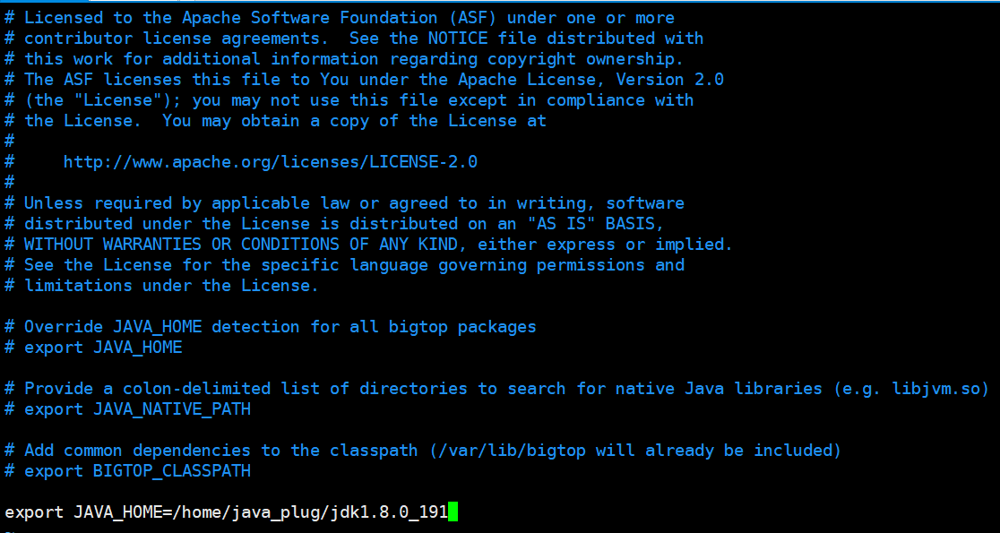
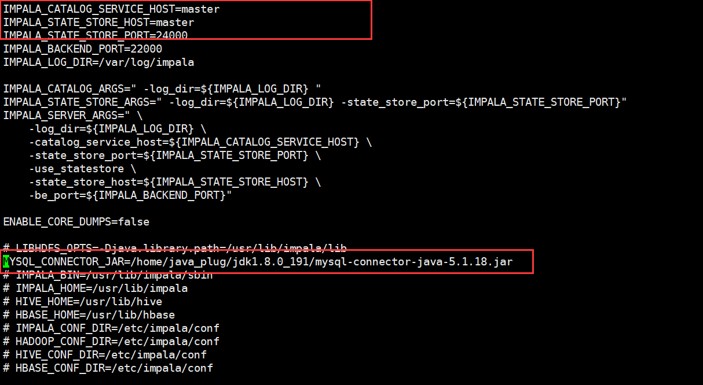
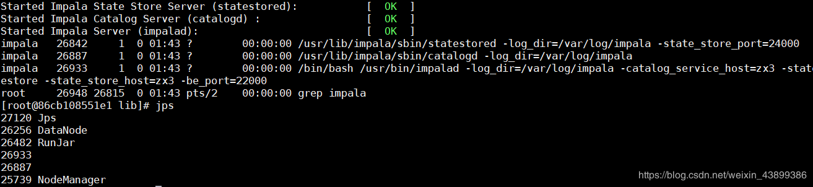
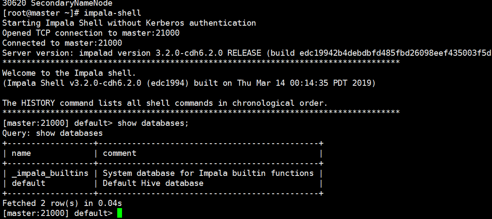

## impala安装

### 下载rpm包

 由于impala没有提供tar包供我们进行安装，只提供了rpm包，所以我们在安装impala的时候，需要使用rpm包来进行安装，rpm包只有cloudera公司提供了，所以我们去cloudera公司网站进行下载rpm包即可，但是另外一个问题，impala的rpm包依赖非常多的其他的rpm包，可以一个个的将依赖找出来，也可以将所有的rpm包下载下来，制作成我们本地yum源来进行安装。

下载连接：https://archive.cloudera.com/cdh6/6.2.0/redhat7/yum/RPMS/

也可以粘贴复制下列连接直接下载

````
https://archive.cloudera.com/cdh6/6.2.0/redhat7/yum/RPMS/x86_64/bigtop-jsvc-1.0.10+cdh6.2.0-967373.el7.x86_64.rpm
https://archive.cloudera.com/cdh6/6.2.0/redhat7/yum/RPMS/x86_64/bigtop-jsvc-debuginfo-1.0.10+cdh6.2.0-967373.el7.x86_64.rpm
https://archive.cloudera.com/cdh6/6.2.0/redhat7/yum/RPMS/x86_64/hadoop-3.0.0+cdh6.2.0-967373.el7.x86_64.rpm
https://archive.cloudera.com/cdh6/6.2.0/redhat7/yum/RPMS/x86_64/hadoop-client-3.0.0+cdh6.2.0-967373.el7.x86_64.rpm
https://archive.cloudera.com/cdh6/6.2.0/redhat7/yum/RPMS/x86_64/hadoop-conf-pseudo-3.0.0+cdh6.2.0-967373.el7.x86_64.rpm
https://archive.cloudera.com/cdh6/6.2.0/redhat7/yum/RPMS/x86_64/hadoop-debuginfo-3.0.0+cdh6.2.0-967373.el7.x86_64.rpm
https://archive.cloudera.com/cdh6/6.2.0/redhat7/yum/RPMS/x86_64/hadoop-doc-3.0.0+cdh6.2.0-967373.el7.x86_64.rpm
https://archive.cloudera.com/cdh6/6.2.0/redhat7/yum/RPMS/x86_64/hadoop-hdfs-3.0.0+cdh6.2.0-967373.el7.x86_64.rpm
https://archive.cloudera.com/cdh6/6.2.0/redhat7/yum/RPMS/x86_64/hadoop-hdfs-datanode-3.0.0+cdh6.2.0-967373.el7.x86_64.rpm
https://archive.cloudera.com/cdh6/6.2.0/redhat7/yum/RPMS/x86_64/hadoop-hdfs-fuse-3.0.0+cdh6.2.0-967373.el7.x86_64.rpm
https://archive.cloudera.com/cdh6/6.2.0/redhat7/yum/RPMS/x86_64/hadoop-hdfs-journalnode-3.0.0+cdh6.2.0-967373.el7.x86_64.rpm
https://archive.cloudera.com/cdh6/6.2.0/redhat7/yum/RPMS/x86_64/hadoop-hdfs-namenode-3.0.0+cdh6.2.0-967373.el7.x86_64.rpm
https://archive.cloudera.com/cdh6/6.2.0/redhat7/yum/RPMS/x86_64/hadoop-hdfs-nfs3-3.0.0+cdh6.2.0-967373.el7.x86_64.rpm
https://archive.cloudera.com/cdh6/6.2.0/redhat7/yum/RPMS/x86_64/hadoop-hdfs-secondarynamenode-3.0.0+cdh6.2.0-967373.el7.x86_64.rpm
https://archive.cloudera.com/cdh6/6.2.0/redhat7/yum/RPMS/x86_64/hadoop-hdfs-zkfc-3.0.0+cdh6.2.0-967373.el7.x86_64.rpm
https://archive.cloudera.com/cdh6/6.2.0/redhat7/yum/RPMS/x86_64/hadoop-httpfs-3.0.0+cdh6.2.0-967373.el7.x86_64.rpm
https://archive.cloudera.com/cdh6/6.2.0/redhat7/yum/RPMS/x86_64/hadoop-kms-3.0.0+cdh6.2.0-967373.el7.x86_64.rpm
https://archive.cloudera.com/cdh6/6.2.0/redhat7/yum/RPMS/x86_64/hadoop-kms-server-3.0.0+cdh6.2.0-967373.el7.x86_64.rpm
https://archive.cloudera.com/cdh6/6.2.0/redhat7/yum/RPMS/x86_64/hadoop-libhdfs-3.0.0+cdh6.2.0-967373.el7.x86_64.rpm
https://archive.cloudera.com/cdh6/6.2.0/redhat7/yum/RPMS/x86_64/hadoop-libhdfs-devel-3.0.0+cdh6.2.0-967373.el7.x86_64.rpm
https://archive.cloudera.com/cdh6/6.2.0/redhat7/yum/RPMS/x86_64/hadoop-mapreduce-3.0.0+cdh6.2.0-967373.el7.x86_64.rpm
https://archive.cloudera.com/cdh6/6.2.0/redhat7/yum/RPMS/x86_64/hadoop-mapreduce-historyserver-3.0.0+cdh6.2.0-967373.el7.x86_64.rpm
https://archive.cloudera.com/cdh6/6.2.0/redhat7/yum/RPMS/x86_64/hadoop-yarn-3.0.0+cdh6.2.0-967373.el7.x86_64.rpm
https://archive.cloudera.com/cdh6/6.2.0/redhat7/yum/RPMS/x86_64/hadoop-yarn-nodemanager-3.0.0+cdh6.2.0-967373.el7.x86_64.rpm
https://archive.cloudera.com/cdh6/6.2.0/redhat7/yum/RPMS/x86_64/hadoop-yarn-proxyserver-3.0.0+cdh6.2.0-967373.el7.x86_64.rpm
https://archive.cloudera.com/cdh6/6.2.0/redhat7/yum/RPMS/x86_64/hadoop-yarn-resourcemanager-3.0.0+cdh6.2.0-967373.el7.x86_64.rpm
https://archive.cloudera.com/cdh6/6.2.0/redhat7/yum/RPMS/x86_64/hadoop-yarn-timelinereader-3.0.0+cdh6.2.0-967373.el7.x86_64.rpm
https://archive.cloudera.com/cdh6/6.2.0/redhat7/yum/RPMS/x86_64/hbase-2.1.0+cdh6.2.0-967373.el7.x86_64.rpm
https://archive.cloudera.com/cdh6/6.2.0/redhat7/yum/RPMS/x86_64/hbase-doc-2.1.0+cdh6.2.0-967373.el7.x86_64.rpm
https://archive.cloudera.com/cdh6/6.2.0/redhat7/yum/RPMS/x86_64/hbase-master-2.1.0+cdh6.2.0-967373.el7.x86_64.rpm
https://archive.cloudera.com/cdh6/6.2.0/redhat7/yum/RPMS/x86_64/hbase-regionserver-2.1.0+cdh6.2.0-967373.el7.x86_64.rpm
https://archive.cloudera.com/cdh6/6.2.0/redhat7/yum/RPMS/x86_64/hbase-rest-2.1.0+cdh6.2.0-967373.el7.x86_64.rpm
https://archive.cloudera.com/cdh6/6.2.0/redhat7/yum/RPMS/x86_64/hbase-thrift-2.1.0+cdh6.2.0-967373.el7.x86_64.rpm
https://archive.cloudera.com/cdh6/6.2.0/redhat7/yum/RPMS/x86_64/hue-4.2.0+cdh6.2.0-967373.el7.x86_64.rpm
https://archive.cloudera.com/cdh6/6.2.0/redhat7/yum/RPMS/x86_64/impala-3.2.0+cdh6.2.0-967373.el7.x86_64.rpm
https://archive.cloudera.com/cdh6/6.2.0/redhat7/yum/RPMS/x86_64/impala-catalog-3.2.0+cdh6.2.0-967373.el7.x86_64.rpm
https://archive.cloudera.com/cdh6/6.2.0/redhat7/yum/RPMS/x86_64/impala-debuginfo-3.2.0+cdh6.2.0-967373.el7.x86_64.rpm
https://archive.cloudera.com/cdh6/6.2.0/redhat7/yum/RPMS/x86_64/impala-server-3.2.0+cdh6.2.0-967373.el7.x86_64.rpm
https://archive.cloudera.com/cdh6/6.2.0/redhat7/yum/RPMS/x86_64/impala-shell-3.2.0+cdh6.2.0-967373.el7.x86_64.rpm
https://archive.cloudera.com/cdh6/6.2.0/redhat7/yum/RPMS/x86_64/impala-state-store-3.2.0+cdh6.2.0-967373.el7.x86_64.rpm
https://archive.cloudera.com/cdh6/6.2.0/redhat7/yum/RPMS/x86_64/impala-udf-devel-3.2.0+cdh6.2.0-967373.el7.x86_64.rpm
https://archive.cloudera.com/cdh6/6.2.0/redhat7/yum/RPMS/x86_64/kudu-1.9.0+cdh6.2.0-967373.el7.x86_64.rpm
https://archive.cloudera.com/cdh6/6.2.0/redhat7/yum/RPMS/x86_64/kudu-client-devel-1.9.0+cdh6.2.0-967373.el7.x86_64.rpm
https://archive.cloudera.com/cdh6/6.2.0/redhat7/yum/RPMS/x86_64/kudu-client0-1.9.0+cdh6.2.0-967373.el7.x86_64.rpm
https://archive.cloudera.com/cdh6/6.2.0/redhat7/yum/RPMS/x86_64/kudu-debuginfo-1.9.0+cdh6.2.0-967373.el7.x86_64.rpm
https://archive.cloudera.com/cdh6/6.2.0/redhat7/yum/RPMS/x86_64/kudu-master-1.9.0+cdh6.2.0-967373.el7.x86_64.rpm
https://archive.cloudera.com/cdh6/6.2.0/redhat7/yum/RPMS/x86_64/kudu-tserver-1.9.0+cdh6.2.0-967373.el7.x86_64.rpm
https://archive.cloudera.com/cdh6/6.2.0/redhat7/yum/RPMS/x86_64/zookeeper-3.4.5+cdh6.2.0-967373.el7.x86_64.rpm
https://archive.cloudera.com/cdh6/6.2.0/redhat7/yum/RPMS/x86_64/zookeeper-debuginfo-3.4.5+cdh6.2.0-967373.el7.x86_64.rpm
https://archive.cloudera.com/cdh6/6.2.0/redhat7/yum/RPMS/x86_64/zookeeper-native-3.4.5+cdh6.2.0-967373.el7.x86_64.rpm
https://archive.cloudera.com/cdh6/6.2.0/redhat7/yum/RPMS/x86_64/zookeeper-server-3.4.5+cdh6.2.0-967373.el7.x86_64.rpm
https://archive.cloudera.com/cdh6/6.2.0/redhat7/yum/RPMS/noarch/avro-doc-1.8.2+cdh6.2.0-967373.el7.noarch.rpm
https://archive.cloudera.com/cdh6/6.2.0/redhat7/yum/RPMS/noarch/avro-libs-1.8.2+cdh6.2.0-967373.el7.noarch.rpm
https://archive.cloudera.com/cdh6/6.2.0/redhat7/yum/RPMS/noarch/avro-tools-1.8.2+cdh6.2.0-967373.el7.noarch.rpm
https://archive.cloudera.com/cdh6/6.2.0/redhat7/yum/RPMS/noarch/bigtop-utils-0.7.0+cdh6.2.0-967373.el7.noarch.rpm
https://archive.cloudera.com/cdh6/6.2.0/redhat7/yum/RPMS/noarch/flume-ng-1.9.0+cdh6.2.0-967373.el7.noarch.rpm
https://archive.cloudera.com/cdh6/6.2.0/redhat7/yum/RPMS/noarch/flume-ng-agent-1.9.0+cdh6.2.0-967373.el7.noarch.rpm
https://archive.cloudera.com/cdh6/6.2.0/redhat7/yum/RPMS/noarch/flume-ng-doc-1.9.0+cdh6.2.0-967373.el7.noarch.rpm
https://archive.cloudera.com/cdh6/6.2.0/redhat7/yum/RPMS/noarch/gcs-1.9.10+cdh6.2.0-967373.el7.noarch.rpm
https://archive.cloudera.com/cdh6/6.2.0/redhat7/yum/RPMS/noarch/hbase-solr-1.5+cdh6.2.0-967373.el7.noarch.rpm
https://archive.cloudera.com/cdh6/6.2.0/redhat7/yum/RPMS/noarch/hbase-solr-doc-1.5+cdh6.2.0-967373.el7.noarch.rpm
https://archive.cloudera.com/cdh6/6.2.0/redhat7/yum/RPMS/noarch/hbase-solr-indexer-1.5+cdh6.2.0-967373.el7.noarch.rpm
https://archive.cloudera.com/cdh6/6.2.0/redhat7/yum/RPMS/noarch/hive-2.1.1+cdh6.2.0-967373.el7.noarch.rpm
https://archive.cloudera.com/cdh6/6.2.0/redhat7/yum/RPMS/noarch/hive-hbase-2.1.1+cdh6.2.0-967373.el7.noarch.rpm
https://archive.cloudera.com/cdh6/6.2.0/redhat7/yum/RPMS/noarch/hive-hcatalog-2.1.1+cdh6.2.0-967373.el7.noarch.rpm
https://archive.cloudera.com/cdh6/6.2.0/redhat7/yum/RPMS/noarch/hive-jdbc-2.1.1+cdh6.2.0-967373.el7.noarch.rpm
https://archive.cloudera.com/cdh6/6.2.0/redhat7/yum/RPMS/noarch/hive-metastore-2.1.1+cdh6.2.0-967373.el7.noarch.rpm
https://archive.cloudera.com/cdh6/6.2.0/redhat7/yum/RPMS/noarch/hive-server-2.1.1+cdh6.2.0-967373.el7.noarch.rpm
https://archive.cloudera.com/cdh6/6.2.0/redhat7/yum/RPMS/noarch/hive-server2-2.1.1+cdh6.2.0-967373.el7.noarch.rpm
https://archive.cloudera.com/cdh6/6.2.0/redhat7/yum/RPMS/noarch/hive-webhcat-2.1.1+cdh6.2.0-967373.el7.noarch.rpm
https://archive.cloudera.com/cdh6/6.2.0/redhat7/yum/RPMS/noarch/hive-webhcat-server-2.1.1+cdh6.2.0-967373.el7.noarch.rpm
https://archive.cloudera.com/cdh6/6.2.0/redhat7/yum/RPMS/noarch/kafka-2.1.0+cdh6.2.0-967373.el7.noarch.rpm
https://archive.cloudera.com/cdh6/6.2.0/redhat7/yum/RPMS/noarch/kafka-mirror-maker-2.1.0+cdh6.2.0-967373.el7.noarch.rpm
https://archive.cloudera.com/cdh6/6.2.0/redhat7/yum/RPMS/noarch/kafka-server-2.1.0+cdh6.2.0-967373.el7.noarch.rpm
https://archive.cloudera.com/cdh6/6.2.0/redhat7/yum/RPMS/noarch/kite-1.0.0+cdh6.2.0-967373.el7.noarch.rpm
https://archive.cloudera.com/cdh6/6.2.0/redhat7/yum/RPMS/noarch/oozie-5.1.0+cdh6.2.0-967373.el7.noarch.rpm
https://archive.cloudera.com/cdh6/6.2.0/redhat7/yum/RPMS/noarch/oozie-client-5.1.0+cdh6.2.0-967373.el7.noarch.rpm
https://archive.cloudera.com/cdh6/6.2.0/redhat7/yum/RPMS/noarch/parquet-1.9.0+cdh6.2.0-967373.el7.noarch.rpm
https://archive.cloudera.com/cdh6/6.2.0/redhat7/yum/RPMS/noarch/parquet-format-2.3.1+cdh6.2.0-967373.el7.noarch.rpm
https://archive.cloudera.com/cdh6/6.2.0/redhat7/yum/RPMS/noarch/pig-0.17.0+cdh6.2.0-967373.el7.noarch.rpm
https://archive.cloudera.com/cdh6/6.2.0/redhat7/yum/RPMS/noarch/search-1.0.0+cdh6.2.0-967373.el7.noarch.rpm
https://archive.cloudera.com/cdh6/6.2.0/redhat7/yum/RPMS/noarch/sentry-2.1.0+cdh6.2.0-967373.el7.noarch.rpm
https://archive.cloudera.com/cdh6/6.2.0/redhat7/yum/RPMS/noarch/sentry-hdfs-plugin-2.1.0+cdh6.2.0-967373.el7.noarch.rpm
https://archive.cloudera.com/cdh6/6.2.0/redhat7/yum/RPMS/noarch/sentry-store-2.1.0+cdh6.2.0-967373.el7.noarch.rpm
https://archive.cloudera.com/cdh6/6.2.0/redhat7/yum/RPMS/noarch/solr-7.4.0+cdh6.2.0-967373.el7.noarch.rpm
https://archive.cloudera.com/cdh6/6.2.0/redhat7/yum/RPMS/noarch/solr-crunch-1.0.0+cdh6.2.0-967373.el7.noarch.rpm
https://archive.cloudera.com/cdh6/6.2.0/redhat7/yum/RPMS/noarch/solr-doc-7.4.0+cdh6.2.0-967373.el7.noarch.rpm
https://archive.cloudera.com/cdh6/6.2.0/redhat7/yum/RPMS/noarch/solr-mapreduce-1.0.0+cdh6.2.0-967373.el7.noarch.rpm
https://archive.cloudera.com/cdh6/6.2.0/redhat7/yum/RPMS/noarch/solr-server-7.4.0+cdh6.2.0-967373.el7.noarch.rpm
https://archive.cloudera.com/cdh6/6.2.0/redhat7/yum/RPMS/noarch/spark-core-2.4.0+cdh6.2.0-967373.el7.noarch.rpm
https://archive.cloudera.com/cdh6/6.2.0/redhat7/yum/RPMS/noarch/spark-history-server-2.4.0+cdh6.2.0-967373.el7.noarch.rpm
https://archive.cloudera.com/cdh6/6.2.0/redhat7/yum/RPMS/noarch/spark-python-2.4.0+cdh6.2.0-967373.el7.noarch.rpm
https://archive.cloudera.com/cdh6/6.2.0/redhat7/yum/RPMS/noarch/sqoop-1.4.7+cdh6.2.0-967373.el7.noarch.rpm
https://archive.cloudera.com/cdh6/6.2.0/redhat7/yum/RPMS/noarch/sqoop-metastore-1.4.7+cdh6.2.0-967373.el7.noarch.rpm

````

### 开始安装

#### 第一步：安装rmp包

````
rpm -ivh --nodeps impala*
rpm -ivh --nodeps hadoop*
rpm -ivh --nodeps bigtop-utils-0.7.0+cdh6.3.0-1279813.noarch.rpm
rpm -ivh --nodeps hive*
rpm -ivh --nodeps sentry*
yum install redhat-lsb
````

其中sentry为impala必须依赖的，如果是第一次装impla,建议用一台干净的虚拟机来装。

impala的依赖文件为/usr/lib/impala/lib，如果rpm包全部下载安装则会有所需的依赖，否则请自己寻找依赖包并建立软链。

#### 第二部：配置bigtop-utils

````
vim /etc/default/bigtop-utils 修改java路径
export JAVA_HOME=/home/java_plug/jdk1.8.0_191 #这里改到自己的java路径
````



#### 第三步：配置impala的conf

````
cp $HADOOP_HOME/etc/hadoop/hdfs-site.xml /etc/impala/conf
cp $HADOOP_HOME/etc/hadoop/core-site.xml /etc/impala/conf
cp $HIVE_HOME/conf/hive-site.xml /etc/impala/conf
这里的三个文件是/usr/lib/hadoop , /usr/lib/hive下的配置文件，可以根据自己的需要进行修改
````

````
vim /etc/impala/conf/hive-site.xml
  <!-- 指定hive metastore服务请求的uri地址 -->  
  <property> 
    <name>hive.metastore.uris</name>  
    <value>thrift://master:9083</value>  #这里是自己的主机名
  </property> 
````

````
vim /etc/impala/conf/hdfs-site.xml

<property>
		<name>dfs.client.read.shortcircuit</name>
		<value>true</value>
	</property>
	<property>
		<name>dfs.domain.socket.path</name>
		<value>/var/run/hdfs-sockets/dn</value>
	</property>
	<property>
		<name>dfs.client.file-block-storage-locations.timeout.millis</name>
		<value>10000</value>
	</property>
	<property>
		<name>dfs.datanode.hdfs-blocks-metadata.enabled</name>
		<value>true</value>
	</property> 
#创建上面路径
mkdir /var/run/hdfs-sockets/
最后将上面修改的文件cp所有主机，集群内的配置文件也要修改
````

#### 第四步：配置impala所需mysql的语言包

````
find / -name mysql-connector-*.jar #查找本机mysql-connector.jar路径
ln -s /home/hive-3.1.1/lib/mysql-connector-java-5.1.47-bin.jar /home/jdk1.8.0_211/mysql-connector-java.jar #软连接到java路径下

将mysql的驱动包在/usr/lib/impala/lib下也放一个
````

#### 第五步：配置impala

````
vim /etc/default/impala
IMPALA_CATALOG_SERVICE_HOST=master #修改为自己的主机名
IMPALA_STATE_STORE_HOST=master
MYSQL_CONNECTOR_JAR=/home/jdk1.8.0_211/mysql-connector-java.jar

````



````
hive --service metastore &
service impala-state-store start
service impala-catalog start
service impala-server start
ps -ef | grep impala
jps
````




注意！注意！注意！

以上如果报错则查看impala错误日志路径cd /var/log/impala/
catalogd.ERROR,impalad.ERROR,statestored.ERROR
大部分原因为依赖错误，可查看文末的impala依赖修改问题

#### 第七步

测试impala

````
impala-shell
show databases;
use zx1;
desc t1; #查询其中的表结构，如果无误则安装成功
````

