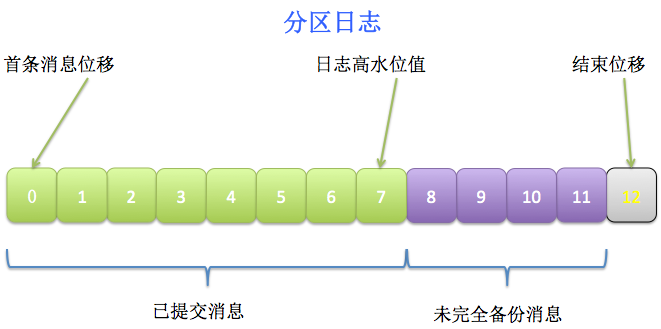
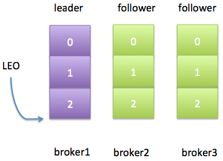
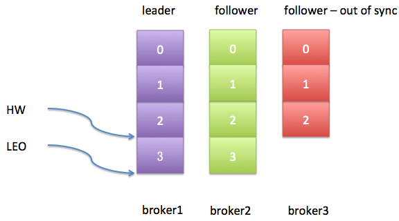
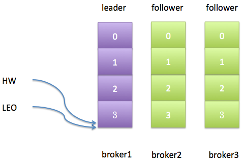
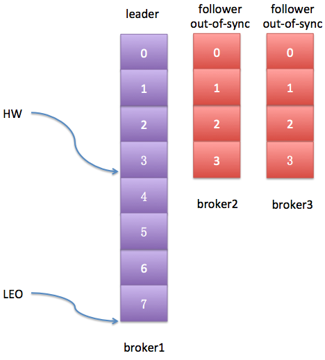

> 本文摘自：https://www.cnblogs.com/huxi2b/p/5903354.html

# Kafka为何去掉replica-lag-max-messages

今天查看Kafka 0.10.0的官方文档，发现了这样一句话：*Configuration parameter replica.lag.max.messages was removed. Partition leaders will no longer consider the number of lagging messages when deciding which replicas are in sync.* 即replica.lag.max.messages参数被正式地移除了，现在topic每个分区的leader副本都不再使用这个参数作为判断follower副本同步状态的依据。看到之后顿觉十分好奇于是抽出半天时间仔细研究了一下，终于弄明白了移除该参数的原因，特此记录一下。

　　首先我们来看一下这个参数本来的含义： *If a replica falls more than this many messages behind the leader, the leader will remove the follower from ISR and treat it as dead.* 即如果某个副本落后leader副本的消息数超过了这个值，那么leader副本就会把该follower副本从ISR中移除。Kafka 0.8.2.2的代码是这样使用该参数的：

````scala
val stuckReplicas = candidateReplicas.filter(r => (time.milliseconds - r.logEndOffsetUpdateTimeMs) > keepInSyncTimeMs)
val slowReplicas = candidateReplicas.filter(r =>
      r.logEndOffset.messageOffset >= 0 &&
      leaderLogEndOffset.messageOffset - r.logEndOffset.messageOffset > keepInSyncMessages)  // keepInSyncMessages即replica.lag.max.messages的值

````

这段代码表明若分区leader副本的结束位移(以下皆称LEO, log end offset)与该follower副本LEO的差值超过了这个阈值，那么就会被视为slow副本，并加入到slowReplicas集合中。该集合中的所有副本都将被认为是与leader副本不同步(out of sync)。但是Kafka 0.9之后的代码变成了这个样子：

````scala
val laggingReplicas = candidateReplicas.filter(r => (time.milliseconds - r.lastCaughtUpTimeMs) > maxLagMs)
````

显然，新版本(0.9及以后)的Kafka只使用一个参数来确定滞后副本(lagging replica)，而不再使用replica.lag.max.messages参数。这是因为什么原因呢？

　　在详细解释此事之前我们先明确一些公共的术语以方便后续的讨论：

- AR：assigned replicas。通常情况下，每个分区都会被分配多个副本。具体的副本数量由参数offsets.topic.replication.factor指定。分区的AR数据保存在Zookeeper的/brokers/topics/<topic>节点中
- ISR：in-sync replicas。与leader副本保持同步状态的副本集合(leader副本本身也在ISR中)。ISR数据保存在Zookeeper的/brokers/topics/<topic>/partitions/<partitionId>/state节点中
- High Watermark：副本高水位值，简称HW，它表示该分区最新一条已提交消息(committed message)的位移
- LEO：log end offset。从名字上来看似乎是日志结束位移，但其实是下一条消息的位移，即追加写下一条消息的位移

　　值得一提的，HW表示的是最新一条**已提交**消息的位移。注意这里是已提交的，说明这条消息已经完全备份过了(fully replicated)，而LEO可能会比HW值大——因为对于分区的leader副本而言，它的日志随时会被追加写入新消息，而这些新消息很可能还没有被完全复制到其他follower副本上，所以LEO值可能会比HW值大。两者的关系可参考下图：



消费者只能消费到HW线以下的消息，即上图中绿色的部分；而紫色的消息就是未完全备份的消息，因而不能被消费者消费。

　　明白了这些术语之后，还有个问题需要研究下： follower部分与leader副本不同步，这是什么意思？不同步(out of sync)意味着follower副本无法追上leader副本的LEO，而这又是什么意思呢？我们举个简单的例子来说明。设想我们有一个topic，它只有一个分区，备份因子是3。假设这三个副本分别保存在broker1，broker2和broker3上。leader副本在broker1上，其他两个broker上的副本都是follower副本，且当前所有的副本都在ISR中。现在我们设置replica.lag.max.messages等于4——表示只要follower副本落后leader副本的消息数小于4，该follower副本就不会被踢出ISR。如果此时有个producer程序每次给这个topic发送3条消息，那么初始状态如下：



很显然，目前2个follower副本与leader副本是同步的，即它们都能追上leader副本的LEO。假设此时producer生产了1条新消息给leader副本，而同时broker3上的follower副本经历了一次Full GC，那么现在的日志状态如下图：



从上图可以发现，leader副本的HW值和LEO值已然变得不一样了。不过更重要的是，最新生产的这条消息是不会被视为“已提交”的，除非broker3被踢出ISR或者broker3上的follower副本追上了leader的LEO。由于replica.lag.max.messages=4，而broker3上的follower副本也只是落后leader副本1条消息，所以此时broker3上的副本并不满足条件因而也不会被踢出ISR。对于broker3上的副本而言，事情变得相当简单——只需追上leader的LEO即可。如果我们假设broker3因为Full GC停顿了100ms之后追上了leader的进度，那么此时的日志状态应该如下图所示：



此时一切都很完美了，leader的HW值与LEO值相同；2个follower副本都与leader副本是同步的。

 　那么有什么可能的原因会使得follower副本与leader副本不同步呢？归纳起来有三种原因:

- 速度跟不上——follower副本在一段时间内都没法追上leader副本的消息写入速度，比如follower副本所在broker的网络IO开销过大导致备份消息的速度慢于从leader处获取消息的速度
- 进程卡住了——follower副本在一段时间内根本就没有向leader副本发起FetchRequest请求(该请求就是获取消息数据)，比如太过频繁的GC或其他失败导致
- 新创建的——如果用户增加了备份因子，很显然新follower副本在启动过程初始肯定是全力追赶leader副本，因而与其是不同步的

　　replica.lag.max.messags参数就是用于检测第一种情况的。当然Kafka还提供了一个参数 replica.lag.time.max.ms来检测另外两种情况。比如如果设置 replica.lag.time.max.ms=500ms，只要follower副本每隔500ms都能发送FetchRequest请求给leader，那么该副本就不会被标记成dead从而被踢出ISR。

　　由于本文重点关注replica.lag.max.messages参数，那么我们来说一下Kafka检测第一种情况会碰到的问题。回到之前提到的那个例子，如果producer一次性发送消息的速率是2条/秒，即一个batch都有2条消息，那么显然设置replica.lag.max.messages=4是个相当安全且合适的数值。为什么？ 因为在leader副本接收到producer发送过来的消息之后而follower副本开始备份这些消息之前，follower副本落后leader的消息数不会超过3条消息。但如果follower副本落后leader的消息数超过了3条，那么你肯定希望leader把这个特别慢的follower副本踢出ISR以防止增加producer消息生产的延时。从这个简单的例子上来看，这个参数似乎工作得很好，为什么要移除它呢？根本原因在于如果要正确设置这个参数的值，需要用户结合具体使用场景自己去评估——基于这个原因，新版本Kafka把这个参数移除了。

　　好了，我来详细解释一下这个根本原因。首先，对于一个参数的设置，有一点是很重要的：**用户应该对他们知道的参数进行设置，而不是对他们需要进行猜测的参数进行设置**。对于该参数来说，我们只能去猜它应该设置成哪些值，而不是根据我们的需要对其进行设置。为什么？举个例子，假设在刚才那个topic的环境中producer程序突然发起了一波消息生产的瞬时高峰流量增加，比如producer现在一次性发送4条消息过来了，也就是说与replica.lag.max.messages值相等了。此时，这两个follower副本都会被认为是与leader副本不同步了，从而被踢出ISR，具体日志状态如下图所示：



从上图看，这两个follower副本与leader不再同步，但其实他们都是存活状态(alive)的且没有任何性能问题。那么在下次FetchRequest时它们就能追上leader的LEO，并重新被加入ISR——于是就出现了这样的情况：它们不断地被踢出ISR然后重新加回ISR，造成了与leader不同步、再同步、又不同步、再次同步的情况发生。想想就知道这是多大的开销！问题的关键就在replica.lag.max.messages这个参数上。用户通过猜测设置该值，猜测producer的速度，猜测leader副本的入站流量。

　　可能有用户会说该参数默认值是4000，应该足够使用了吧。但有一点需要注意的是，这个参数是全局的！即所有topic都受到这个参数的影响。假设集群中有两个topic： t1和t2。假设它们的流量差异非常巨大，t1的消息生产者一次性生产5000条消息，直接就突破了4000这个默认值；而另一个topic，t2，它的消息生产者一次性生产10条消息，那么Kafka就需要相当长的时间才能辨别出t2各个分区中那些滞后的副本。很显然这种流量差异巨大的topic很容易地在同一个集群上部署，那么这种情况下replica.lag.max.messages参数应该设置什么值呢？ 显然没有合适的值，对吧？

　　综上所述，新版本的Kafka去除了这个参数，改为只使用一个参数就能够同时检测由于slow以及由于进程卡壳而导致的滞后(lagging)——即follower副本落后leader副本的时间间隔。这个唯一的参数就是replica.lag.time.max.ms，默认是10秒。对于第2，3种不同步原因而言，该参数没有什么具体的变化。但是对于第一种情况，检测机制有了一些微调——如果一个follower副本落后leader的时间持续性地超过了这个阈值，那么这个副本就要被标记为dead从而被踢出ISR。这样即使出现刚刚提到的producer瞬时峰值流量，只要follower没有持续性地落后，它就不会反复地在ISR中移进移出。

　　最后说一句，这是Kafka副本调优的一个需求，具体的细节详见[KIP-16](https://cwiki.apache.org/confluence/display/KAFKA/KIP-16+-+Automated+Replica+Lag+Tuning) --- Automated Replica Lag Tuning 