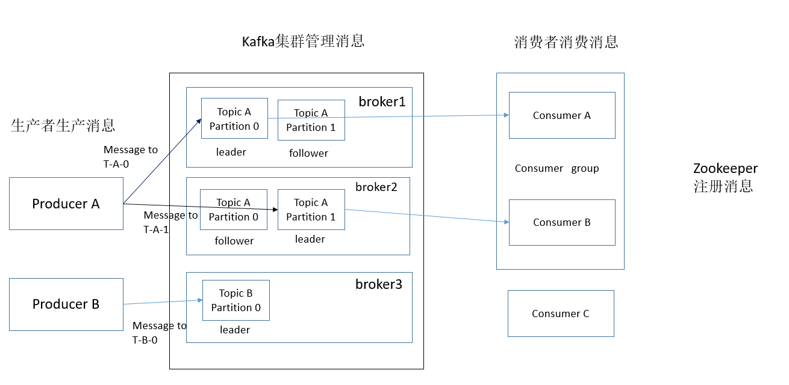

### 基础架构图

* Producer：消息的生产者，向Kafka Broker发消息的客户端
* Broker：一个Broker表示kafka集群中的一个实例
* Partition：消息分区，一个Topic下面会有多个Partition，每个Partition都是一个有序队列，Partition中的每条消息都会被分配一个有序的id。
* Topic：topic：用于对消息分类用。
* leader、follower：类似于ES中的主分片与从分片。访问请求最开始是打在主分片的，如果主分片忙不过来，就会将请求打到从分片上去。follower也是leader的一种备份。
* Consumer：消息的消费者，从Kafka Broker取消息的客户端
* Consumer: 消费者组，由多个Consumer组成。一个消费者组里的成员不能消费同一个broker中的数据，这样做既提高了消费的效率，也避免了消息被重复消费。因此消费者组的成员数量一般是小于等于broker。
* zookeeper：简单讲，ZooKeeper用于分布式系统的协调，Kafka使用ZooKeeper也是基于相同的原因。ZooKeeper主要用来协调Kafka的各个broker，不仅可以实现broker的负载均衡，而且当增加了broker或者某个broker故障了，ZooKeeper将会通知生产者和消费者，这样可以保证整个系统正常运转