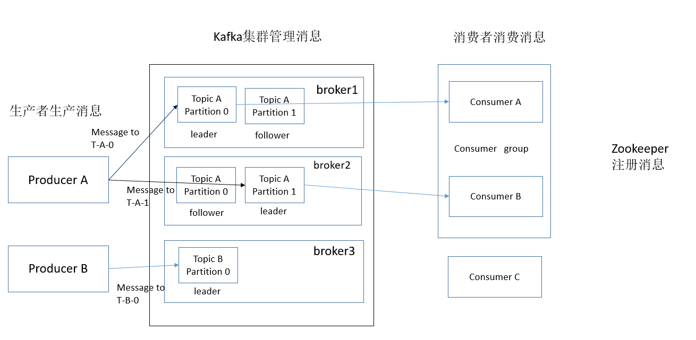
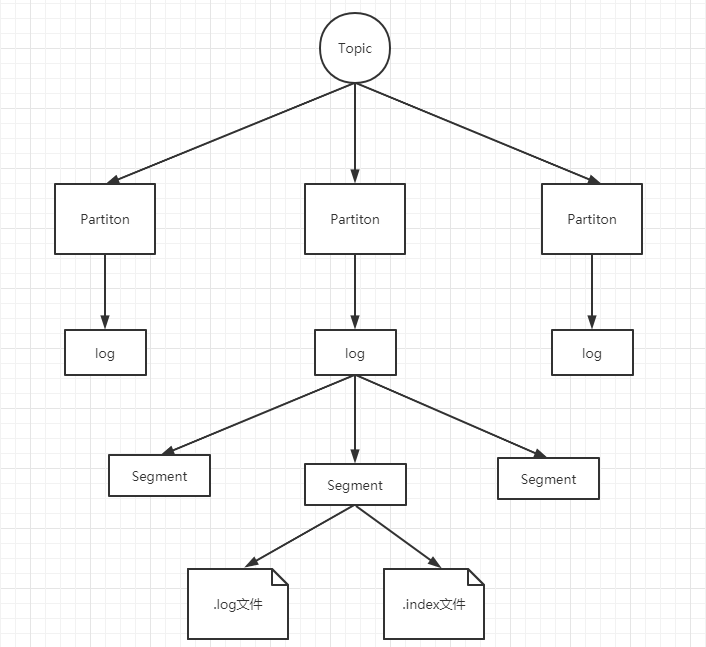
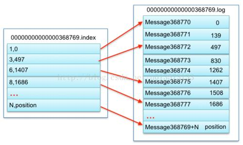

# Kafka笔记

## 基础架构图



* Producer：消息的生产者，向Kafka Broker发消息的客户端
* Broker：一个Broker表示kafka集群中的一个实例
* Partition：消息分区，一个Topic下面会有多个Partition，每个Partition都是一个有序队列，Partition中的每条消息都会被分配一个有序的id。
* Topic：topic：用于对消息分类用。
* leader、follower：类似于ES中的主分片与从分片。访问请求最开始是打在主分片的，如果主分片忙不过来，就会将请求打到从分片上去。follower也是leader的一种备份。
* Consumer：消息的消费者，从Kafka Broker取消息的客户端
* Consumer: 消费者组，由多个Consumer组成。一个消费者组里的成员不能消费同一个broker中的数据，这样做既提高了消费的效率，也避免了消息被重复消费。因此消费者组的成员数量一般是小于等于broker。
* zookeeper：简单讲，ZooKeeper用于分布式系统的协调，Kafka使用ZooKeeper也是基于相同的原因。ZooKeeper主要用来协调Kafka的各个broker，不仅可以实现broker的负载均衡，而且当增加了broker或者某个broker故障了，ZooKeeper将会通知生产者和消费者，这样可以保证整个系统正常运转


## 安装kafka

### 下载

kafka下载地址：http://kafka.apache.org/downloads，本文使用的2.5.0版本

### 配置文件

````shell
每一个broker在集群中的唯一表示，要求是正数，kafka及其根据id来识别broker机器。当该服务器的IP地址发生改变时，broker.id没有变化，则不会影响consumers的消息情况
broker.id =0

kafka数据的存放地址，多个地址的话用逗号分割/kafka/kafka-logs-1，/kafka/kafka-logs-2
log.dirs=/kafka/kafka-logs

kafka Server端启动端口，如果是同一台机器启动多个Kafka Server，则需要改此端口号。注意：如果这里的localhost不写明IP（PLAINTEXT://:9092），则默认使用内网IP，例：192.168.2.61
listeners=PLAINTEXT://:9092


代理将向生产者和消费者通告的主机名和端口。 如果未设置，则将其配置为“侦听器”的值
advertised.listeners=PLAINTEXT://your.host.name:9092

表示消息体的最大大小，单位是字节
message.max.bytes =6525000

broker处理消息的最大线程数，一般情况下不需要去修改
num.network.threads =4

broker处理磁盘IO的线程数，数值应该大于你的硬盘数
num.io.threads =8

一些后台任务处理的线程数，例如过期消息文件的删除等，一般情况下不需要去做修改
background.threads =4

等待IO线程处理的请求队列最大数，若是等待IO的请求超过这个数值，那么会停止接受外部消息，应该是一种自我保护机制。
queued.max.requests =500

broker的主机地址，若是设置了，那么会绑定到这个地址上，若是没有，会绑定到所有的接口上，并将其中之一发送到ZK，一般不设置
host.name

socket的发送缓冲区，socket的调优参数SO_SNDBUFF
socket.send.buffer.bytes=100*1024

socket的接受缓冲区，socket的调优参数SO_RCVBUFF
socket.receive.buffer.bytes =100*1024

socket请求的最大数值，防止serverOOM，message.max.bytes必然要小于socket.request.max.bytes，会被topic创建时的指定参数覆盖
socket.request.max.bytes =100*1024*1024


Kafka中log日志的参数配置

topic的分区是以一堆segment文件存储的，这个控制每个segment的大小，会被topic创建时的指定参数覆盖
log.segment.bytes =1024*1024*1024

这个参数会在日志segment没有达到log.segment.bytes设置的大小，也会强制新建一个segment会被 topic创建时的指定参数覆盖
log.roll.hours =24*7

日志清理策略选择有：delete和compact主要针对过期数据的处理，或是日志文件达到限制的额度，会被 topic创建时的指定参数覆盖
log.cleanup.policy = delete

数据存储的最大时间超过这个时间会根据log.cleanup.policy设置的策略处理数据，也就是消费端能够多久去消费数据
log.retention.minutes=3days

log.retention.bytes和log.retention.minutes任意一个达到要求，都会执行删除，会被topic创建时的指定参数覆盖


topic每个分区的最大文件大小，一个topic的大小限制 =分区数*log.retention.bytes。-1没有大小限log.retention.bytes和log.retention.minutes任意一个达到要求，都会执行删除，会被topic创建时的指定参数覆盖
log.retention.bytes=-1

文件大小检查的周期时间，是否处罚 log.cleanup.policy中设置的策略
log.retention.check.interval.ms=5minutes

是否开启日志压缩
log.cleaner.enable=false

日志压缩运行的线程数
log.cleaner.threads = 2

日志压缩时候处理的最大大小
log.cleaner.io.max.bytes.per.second=None

日志压缩去重时候的缓存空间，在空间允许的情况下，越大越好
log.cleaner.dedupe.buffer.size=500*1024*1024

日志清理时候用到的IO块大小一般不需要修改
log.cleaner.io.buffer.size=512*1024

检查是否处罚日志清理的间隔
log.cleaner.backoff.ms =15000

日志清理的频率控制，越大意味着更高效的清理，同时会存在一些空间上的浪费，会被topic创建时的指定参数覆盖
log.cleaner.min.cleanable.ratio=0.5

对于压缩的日志保留的最长时间，也是客户端消费消息的最长时间，同log.retention.minutes的区别在于一个控制未压缩数据，一个控制压缩后的数据。会被topic创建时的指定参数覆盖
log.cleaner.delete.retention.ms =1day

对于segment日志的索引文件大小限制，会被topic创建时的指定参数覆盖
log.index.size.max.bytes =10*1024*1024

当执行一个fetch操作后，需要一定的空间来扫描最近的offset大小，设置越大，代表扫描速度越快，但是也更好内存，一般情况下不需要搭理这个参数
log.index.interval.bytes =4096

log文件”sync”到磁盘之前累积的消息条数,因为磁盘IO操作是一个慢操作,但又是一个”数据可靠性"的必要手段,所以此参数的设置,需要在"数据可靠性"与"性能"之间做必要的权衡.如果此值过大,将会导致每次"fsync"的时间较长(IO阻塞),如果此值过小,将会导致"fsync"的次数较多,这也意味着整体的client请求有一定的延迟.物理server故障,将会导致没有fsync的消息丢失.
log.flush.interval.messages=None

log.flush.scheduler.interval.ms =3000
检查是否需要固化到硬盘的时间间隔

仅仅通过interval来控制消息的磁盘写入时机,是不足的.此参数用于控制"fsync"的时间间隔,如果消息量始终没有达到阀值,但是离上一次磁盘同步的时间间隔达到阀值,也将触发.
log.flush.interval.ms = None

文件在索引中清除后保留的时间一般不需要去修改
log.delete.delay.ms =60000

log.flush.offset.checkpoint.interval.ms =60000
控制上次固化硬盘的时间点，以便于数据恢复一般不需要去修改


auto.create.topics.enable =true
是否允许自动创建topic，若是false，就需要通过命令创建topic

是否允许自动创建topic，若是false，就需要通过命令创建topic
default.replication.factor =1

每个topic的分区个数，若是在topic创建时候没有指定的话会被topic创建时的指定参数覆盖
num.partitions =1

Kafka中leader、replicas参数配置

partition leader与replicas之间通讯时,socket的超时时间
controller.socket.timeout.ms =30000

partition leader与replicas数据同步时,消息的队列尺寸
controller.message.queue.size=10

replicas响应partition leader的最长等待时间，若是超过这个时间，就将replicas列入ISR(in-sync replicas)，并认为它是死的，不会再加入管理中
replica.lag.time.max.ms =10000

如果follower落后与leader太多,将会认为此follower[或者说partition relicas]已经失效
replica.lag.max.messages =4000

##通常,在follower与leader通讯时,因为网络延迟或者链接断开,总会导致replicas中消息同步滞后

##如果消息之后太多,leader将认为此follower网络延迟较大或者消息吞吐能力有限,将会把此replicas迁移

##到其他follower中.

##在broker数量较少,或者网络不足的环境中,建议提高此值.

follower与leader之间的socket超时时间
replica.socket.timeout.ms=30*1000

leader复制时候的socket缓存大小
replica.socket.receive.buffer.bytes=64*1024

replicas每次获取数据的最大大小
replica.fetch.max.bytes =1024*1024

replicas同leader之间通信的最大等待时间，失败了会重试
replica.fetch.wait.max.ms =500

fetch的最小数据尺寸,如果leader中尚未同步的数据不足此值,将会阻塞,直到满足条件
replica.fetch.min.bytes =1

leader进行复制的线程数，增大这个数值会增加follower的IO
num.replica.fetchers=1

每个replica检查是否将最高水位进行固化的频率
replica.high.watermark.checkpoint.interval.ms =5000

是否允许控制器关闭broker ,若是设置为true,会关闭所有在这个broker上的leader，并转移到其他broker
controlled.shutdown.enable =false

控制器关闭的尝试次数
controlled.shutdown.max.retries =3

每次关闭尝试的时间间隔
controlled.shutdown.retry.backoff.ms =5000

leader的不平衡比例，若是超过这个数值，会对分区进行重新的平衡
leader.imbalance.per.broker.percentage =10

检查leader是否不平衡的时间间隔
leader.imbalance.check.interval.seconds =300

客户端保留offset信息的最大空间大小
offset.metadata.max.bytes

kafka中zookeeper的参数配置

必须配置项：：：zookeeper集群的地址，可以是多个，多个之间用逗号分割，一般端口都为2181；hostname1:port1,hostname2:port2,hostname3:port3
zookeeper.connect = localhost:2181

ZooKeeper的最大超时时间，就是心跳的间隔，若是没有反映，那么认为已经死了，不易过大
zookeeper.session.timeout.ms=6000

ZooKeeper的连接超时时间
zookeeper.connection.timeout.ms =6000

ZooKeeper集群中leader和follower之间的同步实际那
zookeeper.sync.time.ms =2000
````

## Kafka操作

### 启动

进入kafka的bin目录

````shell
# 阻塞启动
./kafka-server-start.sh  ../config/server.properties 
# 非阻塞启动
./kafka-server-start.sh  -daemon ../config/server.properties

[root@localhost bin]# netstat -anp|grep 9092
tcp6       0      0 :::9092                 :::*                    LISTEN      27810/java          
tcp6       0      0 127.0.0.1:9092          127.0.0.1:55210         ESTABLISHED 27810/java          
tcp6       0      0 127.0.0.1:55210         127.0.0.1:9092          ESTABLISHED 27810/java 
````

### 停止

````shell
./kafka-server-stop.sh
````

###  查看有哪些topics

````shell
[root@localhost bin]# ./kafka-topics.sh --list --bootstrap-server localhost:9092
test
````

* --boostrap-server:指定连接到的kafka服务器的ip与端口

### 创建topic

````shell
./kafka-topics.sh --create --bootstrap-server localhost:9092 --replication-factor 1 --partitions 1 --topic test
````

* --boostrap-server:指定连接到的kafka服务器的ip与端口
* --partitions  指定topic的分区数
* --replicatoin-factor:要创建的主题中每个分区的副本。 如果未提供，则默认为群集默认值。

* --topic:创建，更改，描述或删除的主题。

### 查看某个topic的详情

````shell
[root@localhost bin]# ./kafka-topics.sh  --describe --bootstrap-server localhost:9092  --topic test
Topic: test	PartitionCount: 1	ReplicationFactor: 1	Configs: segment.bytes=1073741824
	Topic: test	Partition: 0	Leader: 0	Replicas: 0	Isr: 0
````

* --describe：列出给定主题的详细信息。

### 删除topic

````shell
 ./kafka-topics.sh  --delete --bootstrap-server localhost:9092 --topic  test
````

### 向kafka里生产消息

````shell
./kafka-console-producer.sh  --bootstrap-server  localhost:9092 --topic test
````

### 消费kafka里生产的消息

````shell
./kafka-console-consumer.sh  --bootstrap-server localhost:9092  --topic test --from-beginning 
````

* --from-beginning 表示从开头的地方消费消息，这里的开头不是最新的消息。


## Kafka的工作流程与文件存储机制

### topic的存储机制

Kafka中消息是以topic进行分类的，生产者生产消息，消息者消费消息，都是面向topic的。

topic是逻辑上的概念，而partition是物理概念，可以说一个topic被分为了多个partition，也可以说多个一个topic有多个partition组成。每个partition对应一个log文件，该log文件中存储的就是producer生产的消息。producer生产的消息会不断的追加到该log文件末端，且每条数据都有自己的offset。消费者组中的每个消费者中的每个消费者，都会实时记录自己消费到了哪个offset，以便出错恢复时，从上次的位置继续消费。



kafka的数据是放在log.dirs对应的目录下

````shell
#kafka的数据目录
log.dirs=/tmp/kafka-logs
# 指定每个日志文件中的某个segment的大小限制，超过了这个大小限制就会创建一个新的segment文件
log.segment.bytes=1073741824
````

kafka存放数据文件夹的结构

````shell
[root@localhost kafka-logs]# ls /tmp/kafka-logs
__consumer_offsets-49        --offset-0
__consumer_offsets-5         recovery-point-offset-checkpoint
__consumer_offsets-6         replication-offset-checkpoint
__consumer_offsets-7         test-0
__consumer_offsets-8         test2-0
__consumer_offsets-9         test2-1
latest-0
log-start-offset-checkpoint
meta.properties
````

* 其中test-0,test2-0中, "-"前一部分对应的是topic的名称，"-"后一部分对应的是分区的编号。

kafka topic数据目录的结构

````shell
[root@localhost kafka-logs]# ll test-0/
total 20500
-rw-r--r--. 1 root root        0 Dec 24 04:11 00000000000000000000.index
-rw-r--r--. 1 root root     1015 Dec 24 04:11 00000000000000000000.log
-rw-r--r--. 1 root root       12 Dec 24 04:11 00000000000000000000.timeindex
-rw-r--r--. 1 root root 10485760 Dec 24 04:11 00000000000000000020.index
-rw-r--r--. 1 root root      725 Dec 24 04:11 00000000000000000020.log
-rw-r--r--. 1 root root       10 Dec 24 04:11 00000000000000000020.snapshot
-rw-r--r--. 1 root root 10485756 Dec 24 04:11 00000000000000000020.timeindex
````

* *.log：存储生产的数据
* *.index：记录对应的log文件的偏移量的其实位置

由于生产者生产的消息会不断的追加到log文件夹尾，为防止log文件过大而导致数据定位效率变得低下，Kafka采取了分片和索引机制。将每个partition分为多个segment，每个segment对应两个文件--“.index"文件和".log"文件。这些文件位于一个文件夹下，该文件夹的命名规则为：topic名称+分区号。index和log文件以当前segment的第一条消息的offset命名。下图为index文件和log文件的结构示意图。



在这里000000000000000368769.log这个文件记录第368769到下一个log文件编号的消息。假设这个文件有n条消息，那么第3条消息对应的是497，那么也就是说在log文件中，第3条消息（在log全局的368772个message）在本文件的物理便宜地址为497.

