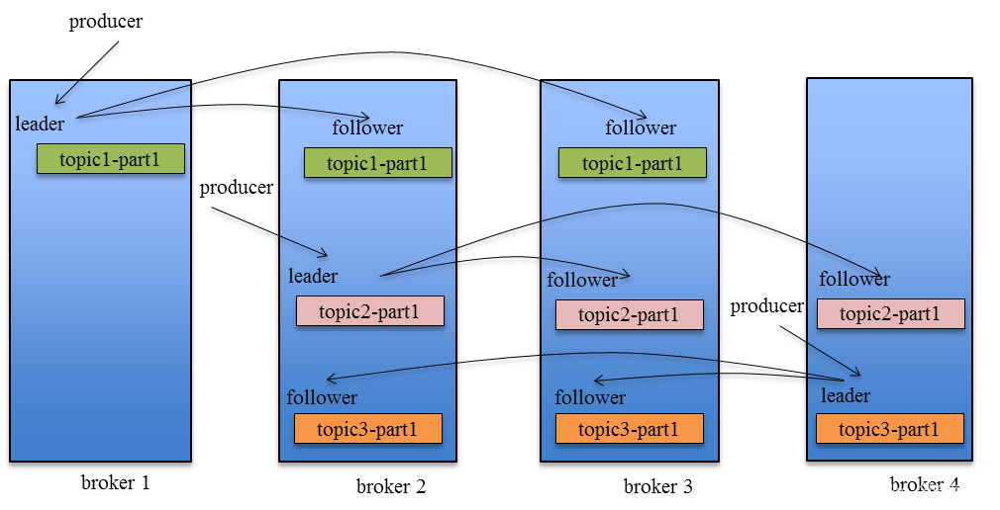
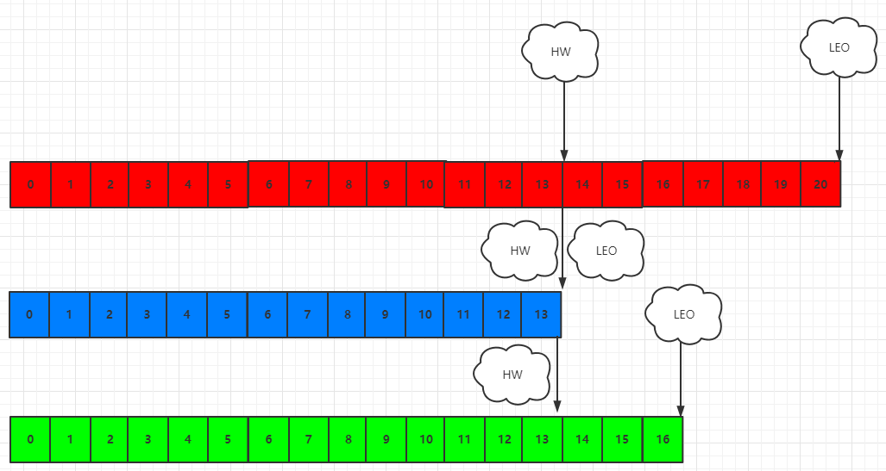
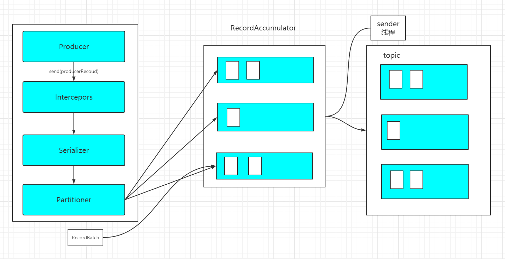

# Kafka笔记

## 基础架构图


* Producer：消息的生产者，向Kafka Broker发消息的客户端
* Broker：一个Broker表示kafka集群中的一个实例
* Partition：消息分区，一个Topic下面会有多个Partition，每个Partition都是一个有序队列，Partition中的每条消息都会被分配一个有序的id。
* Topic：topic：用于对消息分类用。
* leader、follower：类似于ES中的主分片与从分片。访问请求最开始是打在主分片的，如果主分片忙不过来，就会将请求打到从分片上去。follower也是leader的一种备份。
* Consumer：消息的消费者，从Kafka Broker取消息的客户端
* Consumer: 消费者组，由多个Consumer组成。一个消费者组里的成员不能消费同一个broker中的数据，这样做既提高了消费的效率，也避免了消息被重复消费。因此消费者组的成员数量一般是小于等于broker。
* zookeeper：简单讲，ZooKeeper用于分布式系统的协调，Kafka使用ZooKeeper也是基于相同的原因。ZooKeeper主要用来协调Kafka的各个broker，不仅可以实现broker的负载均衡，而且当增加了broker或者某个broker故障了，ZooKeeper将会通知生产者和消费者，这样可以保证整个系统正常运转


## 安装kafka

### 下载

kafka下载地址：http://kafka.apache.org/downloads，本文使用的2.5.0版本

### 配置文件

#### 服务器配置文件

````shell
每一个broker在集群中的唯一表示，要求是正数，kafka及其根据id来识别broker机器。当该服务器的IP地址发生改变时，broker.id没有变化，则不会影响consumers的消息情况
broker.id = 0

kafka数据的存放地址，多个地址的话用逗号分割/kafka/kafka-logs-1，/kafka/kafka-logs-2
log.dirs=/kafka/kafka-logs

kafka Server端启动端口，如果是同一台机器启动多个Kafka Server，则需要改此端口号。注意：如果这里的localhost不写明IP（PLAINTEXT://:9092），则默认使用内网IP，例：192.168.2.61
listeners=PLAINTEXT://:9092


代理将向生产者和消费者通告的主机名和端口。 如果未设置，则将其配置为“侦听器”的值
advertised.listeners=PLAINTEXT://your.host.name:9092

表示消息体的最大大小，单位是字节
message.max.bytes =6525000

broker处理消息的最大线程数，一般情况下不需要去修改
num.network.threads =4

broker处理磁盘IO的线程数，数值应该大于你的硬盘数
num.io.threads =8

一些后台任务处理的线程数，例如过期消息文件的删除等，一般情况下不需要去做修改
background.threads =4

等待IO线程处理的请求队列最大数，若是等待IO的请求超过这个数值，那么会停止接受外部消息，应该是一种自我保护机制。
queued.max.requests =500

broker的主机地址，若是设置了，那么会绑定到这个地址上，若是没有，会绑定到所有的接口上，并将其中之一发送到ZK，一般不设置
host.name

socket的发送缓冲区，socket的调优参数SO_SNDBUFF
socket.send.buffer.bytes=100*1024

socket的接受缓冲区，socket的调优参数SO_RCVBUFF
socket.receive.buffer.bytes =100*1024

socket请求的最大数值，防止serverOOM，message.max.bytes必然要小于socket.request.max.bytes，会被topic创建时的指定参数覆盖
socket.request.max.bytes =100*1024*1024


Kafka中log日志的参数配置

topic的分区是以一堆segment文件存储的，这个控制每个segment的大小，会被topic创建时的指定参数覆盖
log.segment.bytes =1024*1024*1024

这个参数会在日志segment没有达到log.segment.bytes设置的大小，也会强制新建一个segment会被 topic创建时的指定参数覆盖
log.roll.hours =24*7

日志清理策略选择有：delete和compact主要针对过期数据的处理，或是日志文件达到限制的额度，会被 topic创建时的指定参数覆盖
log.cleanup.policy = delete

数据存储的最大时间超过这个时间会根据log.cleanup.policy设置的策略处理数据，也就是消费端能够多久去消费数据
log.retention.minutes=3days

log.retention.bytes和log.retention.minutes任意一个达到要求，都会执行删除，会被topic创建时的指定参数覆盖


topic每个分区的最大文件大小，一个topic的大小限制 =分区数*log.retention.bytes。-1没有大小限log.retention.bytes和log.retention.minutes任意一个达到要求，都会执行删除，会被topic创建时的指定参数覆盖
log.retention.bytes=-1

文件大小检查的周期时间，是否处罚 log.cleanup.policy中设置的策略
log.retention.check.interval.ms=5minutes

是否开启日志压缩
log.cleaner.enable=false

日志压缩运行的线程数
log.cleaner.threads = 2

日志压缩时候处理的最大大小
log.cleaner.io.max.bytes.per.second=None

日志压缩去重时候的缓存空间，在空间允许的情况下，越大越好
log.cleaner.dedupe.buffer.size=500*1024*1024

日志清理时候用到的IO块大小一般不需要修改
log.cleaner.io.buffer.size=512*1024

检查是否处罚日志清理的间隔
log.cleaner.backoff.ms =15000

日志清理的频率控制，越大意味着更高效的清理，同时会存在一些空间上的浪费，会被topic创建时的指定参数覆盖
log.cleaner.min.cleanable.ratio=0.5

对于压缩的日志保留的最长时间，也是客户端消费消息的最长时间，同log.retention.minutes的区别在于一个控制未压缩数据，一个控制压缩后的数据。会被topic创建时的指定参数覆盖
log.cleaner.delete.retention.ms =1day

对于segment日志的索引文件大小限制，会被topic创建时的指定参数覆盖
log.index.size.max.bytes =10*1024*1024

当执行一个fetch操作后，需要一定的空间来扫描最近的offset大小，设置越大，代表扫描速度越快，但是也更好内存，一般情况下不需要搭理这个参数
log.index.interval.bytes =4096

log文件”sync”到磁盘之前累积的消息条数,因为磁盘IO操作是一个慢操作,但又是一个”数据可靠性"的必要手段,所以此参数的设置,需要在"数据可靠性"与"性能"之间做必要的权衡.如果此值过大,将会导致每次"fsync"的时间较长(IO阻塞),如果此值过小,将会导致"fsync"的次数较多,这也意味着整体的client请求有一定的延迟.物理server故障,将会导致没有fsync的消息丢失.
log.flush.interval.messages=None

log.flush.scheduler.interval.ms =3000
检查是否需要固化到硬盘的时间间隔

仅仅通过interval来控制消息的磁盘写入时机,是不足的.此参数用于控制"fsync"的时间间隔,如果消息量始终没有达到阀值,但是离上一次磁盘同步的时间间隔达到阀值,也将触发.
log.flush.interval.ms = None

文件在索引中清除后保留的时间一般不需要去修改
log.delete.delay.ms =60000

log.flush.offset.checkpoint.interval.ms =60000
控制上次固化硬盘的时间点，以便于数据恢复一般不需要去修改


auto.create.topics.enable =true
是否允许自动创建topic，若是false，就需要通过命令创建topic

是否允许自动创建topic，若是false，就需要通过命令创建topic
default.replication.factor =1

每个topic的分区个数，若是在topic创建时候没有指定的话会被topic创建时的指定参数覆盖
num.partitions =1

Kafka中leader、replicas参数配置

partition leader与replicas之间通讯时,socket的超时时间
controller.socket.timeout.ms =30000

partition leader与replicas数据同步时,消息的队列尺寸
controller.message.queue.size=10

replicas响应partition leader的最长等待时间，若是超过这个时间，就将replicas列入ISR(in-sync replicas)，并认为它是死的，不会再加入管理中
replica.lag.time.max.ms =10000

如果follower落后与leader太多,将会认为此follower[或者说partition relicas]已经失效
replica.lag.max.messages =4000

##通常,在follower与leader通讯时,因为网络延迟或者链接断开,总会导致replicas中消息同步滞后

##如果消息之后太多,leader将认为此follower网络延迟较大或者消息吞吐能力有限,将会把此replicas迁移

##到其他follower中.

##在broker数量较少,或者网络不足的环境中,建议提高此值.

follower与leader之间的socket超时时间
replica.socket.timeout.ms=30*1000

leader复制时候的socket缓存大小
replica.socket.receive.buffer.bytes=64*1024

replicas每次获取数据的最大大小
replica.fetch.max.bytes =1024*1024

replicas同leader之间通信的最大等待时间，失败了会重试
replica.fetch.wait.max.ms =500

fetch的最小数据尺寸,如果leader中尚未同步的数据不足此值,将会阻塞,直到满足条件
replica.fetch.min.bytes =1

leader进行复制的线程数，增大这个数值会增加follower的IO
num.replica.fetchers=1

每个replica检查是否将最高水位进行固化的频率
replica.high.watermark.checkpoint.interval.ms =5000

是否允许控制器关闭broker ,若是设置为true,会关闭所有在这个broker上的leader，并转移到其他broker
controlled.shutdown.enable =false

控制器关闭的尝试次数
controlled.shutdown.max.retries =3

每次关闭尝试的时间间隔
controlled.shutdown.retry.backoff.ms =5000

leader的不平衡比例，若是超过这个数值，会对分区进行重新的平衡
leader.imbalance.per.broker.percentage =10

检查leader是否不平衡的时间间隔
leader.imbalance.check.interval.seconds =300

客户端保留offset信息的最大空间大小
offset.metadata.max.bytes

kafka中zookeeper的参数配置

必须配置项：：：zookeeper集群的地址，可以是多个，多个之间用逗号分割，一般端口都为2181；hostname1:port1,hostname2:port2,hostname3:port3
zookeeper.connect = localhost:2181

ZooKeeper的最大超时时间，就是心跳的间隔，若是没有反映，那么认为已经死了，不易过大
zookeeper.session.timeout.ms=6000

ZooKeeper的连接超时时间
zookeeper.connection.timeout.ms =6000

ZooKeeper集群中leader和follower之间的同步实际那
zookeeper.sync.time.ms =2000
````

#### 生产者配置文件

````shell
# 配置请求的消息体的最大值
max.request.size = 5242880 （5M）请求的最大大小为字节。要小于 message.max.bytes
````


## Kafka操作

### 启动

进入kafka的bin目录

````shell
# 阻塞启动
./kafka-server-start.sh  ../config/server.properties 
# 非阻塞启动
./kafka-server-start.sh  -daemon ../config/server.properties

[root@localhost bin]# netstat -anp|grep 9092
tcp6       0      0 :::9092                 :::*                    LISTEN      27810/java          
tcp6       0      0 127.0.0.1:9092          127.0.0.1:55210         ESTABLISHED 27810/java          
tcp6       0      0 127.0.0.1:55210         127.0.0.1:9092          ESTABLISHED 27810/java 
````

### 停止

````shell
./kafka-server-stop.sh
````

###  查看有哪些topics

````shell
[root@localhost bin]# ./kafka-topics.sh --list --bootstrap-server localhost:9092
test
````

* --boostrap-server:指定连接到的kafka服务器的ip与端口

### 创建topic

````shell
./kafka-topics.sh --create --bootstrap-server localhost:9092 --replication-factor 1 --partitions 1 --topic test
````

* --boostrap-server:指定连接到的kafka服务器的ip与端口
* --partitions  指定topic的分区数
* --replicatoin-factor:要创建的主题中每个分区的副本。 如果未提供，则默认为群集默认值。

* --topic:创建，更改，描述或删除的主题。

### 查看某个topic的详情

````shell
[root@localhost bin]# ./kafka-topics.sh  --describe --bootstrap-server localhost:9092  --topic test
Topic: test	PartitionCount: 1	ReplicationFactor: 1	Configs: segment.bytes=1073741824
	Topic: test	Partition: 0	Leader: 0	Replicas: 0	Isr: 0
````

* --describe：列出给定主题的详细信息。

### 删除topic

````shell
 ./kafka-topics.sh  --delete --bootstrap-server localhost:9092 --topic  test
````

### 查看集群中消费者组的信息

````shell
> bin/kafka-consumer-groups.sh --bootstrap-server localhost:9092 --list
 
test-consumer-group
````

### 查看某个消费者组的情况

```shell
> bin/kafka-consumer-groups.sh --bootstrap-server localhost:9092 --describe --group my-group
 
TOPIC           PARTITION  CURRENT-OFFSET  LOG-END-OFFSET  LAG             CONSUMER-ID                                    HOST            CLIENT-ID
topic3          0          241019          395308          154289          consumer2-e76ea8c3-5d30-4299-9005-47eb41f3d3c4 /127.0.0.1      consumer2
topic2          1          520678          803288          282610          consumer2-e76ea8c3-5d30-4299-9005-47eb41f3d3c4 /127.0.0.1      consumer2
topic3          1          241018          398817          157799          consumer2-e76ea8c3-5d30-4299-9005-47eb41f3d3c4 /127.0.0.1      consumer2
topic1          0          854144          855809          1665            consumer1-3fc8d6f1-581a-4472-bdf3-3515b4aee8c1 /127.0.0.1      consumer1
topic2          0          460537          803290          342753          consumer1-3fc8d6f1-581a-4472-bdf3-3515b4aee8c1 /127.0.0.1      consumer1
topic3          2          243655          398812          155157          consumer4-117fe4d3-c6c1-4178-8ee9-eb4a3954bee0 /127.0.0.1      consumer4

```

### 向kafka里生产消息

````shell
./kafka-console-producer.sh  --bootstrap-server  localhost:9092 --topic test
````

### 消费kafka里生产的消息

````shell
./kafka-console-consumer.sh  --bootstrap-server localhost:9092  --topic test --from-beginning 
````

* --from-beginning 表示从开头的地方消费消息，这里的开头不是最新的消息。

## Kafka之数据存储

### topic的存储机制

Kafka中消息是以topic进行分类的，生产者生产消息，消息者消费消息，都是面向topic的。

topic是逻辑上的概念，而partition是物理概念，可以说一个topic被分为了多个partition，也可以说多个一个topic有多个partition组成。每个partition对应一个log文件，该log文件中存储的就是producer生产的消息。producer生产的消息会不断的追加到该log文件末端，且每条数据都有自己的offset。消费者组中的每个消费者中的每个消费者，都会实时记录自己消费到了哪个offset，以便出错恢复时，从上次的位置继续消费。


kafka的数据是放在log.dirs对应的目录下

````shell
#kafka的数据目录
log.dirs=/tmp/kafka-logs
# 指定每个日志文件中的某个segment的大小限制，超过了这个大小限制就会创建一个新的segment文件
log.segment.bytes=1073741824
````

kafka存放数据文件夹的结构

````shell
[root@localhost kafka-logs]# ls /tmp/kafka-logs
__consumer_offsets-49        --offset-0
__consumer_offsets-5         recovery-point-offset-checkpoint
__consumer_offsets-6         replication-offset-checkpoint
__consumer_offsets-7         test-0
__consumer_offsets-8         test2-0
__consumer_offsets-9         test2-1
latest-0
log-start-offset-checkpoint
meta.properties
````

* 其中test-0,test2-0中, "-"前一部分对应的是topic的名称，"-"后一部分对应的是分区的编号。

kafka topic数据目录的结构

````shell
[root@localhost kafka-logs]# ll test-0/
total 20500
-rw-r--r--. 1 root root        0 Dec 24 04:11 00000000000000000000.index
-rw-r--r--. 1 root root     1015 Dec 24 04:11 00000000000000000000.log
-rw-r--r--. 1 root root       12 Dec 24 04:11 00000000000000000000.timeindex
-rw-r--r--. 1 root root 10485760 Dec 24 04:11 00000000000000000020.index
-rw-r--r--. 1 root root      725 Dec 24 04:11 00000000000000000020.log
-rw-r--r--. 1 root root       10 Dec 24 04:11 00000000000000000020.snapshot
-rw-r--r--. 1 root root 10485756 Dec 24 04:11 00000000000000000020.timeindex
````

* *.log：存储生产的数据
* *.index：记录对应的log文件的偏移量的其实位置

由于生产者生产的消息会不断的追加到log文件夹尾，为防止log文件过大而导致数据定位效率变得低下，Kafka采取了分片和索引机制。将每个partition分为多个segment，每个segment对应两个文件--“.index"文件和".log"文件。这些文件位于一个文件夹下，该文件夹的命名规则为：topic名称+分区号。index和log文件以当前segment的第一条消息的offset命名。下图为index文件和log文件的结构示意图。


在这里000000000000000368769.log这个文件记录第368769到下一个log文件编号的消息。假设这个文件有n条消息，那么第3条消息对应的是497，那么也就是说在log文件中，第3条消息（在log全局的368772个message）在本文件的物理便宜地址为497.

### topic的分区规则

1.在指定分区的时候，kafka会将数据存入指定的分区中

````java
public ProducerRecord(String topic, Integer partition, Long timestamp, K key, V value, Iterable<Header> headers)
public ProducerRecord(String topic, Integer partition, Long timestamp, K key, V value)
public ProducerRecord(String topic, Integer partition, K key, V value, Iterable<Header> headers)
public ProducerRecord(String topic, Integer partition, K key, V value)
````

2.没有明确指定分区但是指定了key的时候，将key的hash值与topic的partition数据进行取余得到partion的值

````java
public ProducerRecord(String topic, K key, V value)
````

3.既没有指定分区也没有指定key的时候，第一次调用时随机生成一个整数（后面每次调用在这个整数上自增），将这个值与topic可用的partition总数取余得到partition值，也就时常说的轮询算法。

### 数据可靠性保证

#### 问题

下面简单的说一下在kafka中，怎样保证leader分区与follower之间的数据可靠性，即kafka在进行数据备份的时候需要解决哪些问题。

1. 怎么propagate消息
2. 在向Producer发送ACK前需要保证有多少个replica已经收到该消息
3. 怎么处理replica不工作的情况
4. 怎么处理field replica恢复的情况

#### propagate

1.kafka的topic可以设置有N个副本（replica），副本数最好要小于broker的数量，也就是要保证一个broker上的replica最多有一个，所以可以用broker id指定Partition replica。

2.创建副本的单位是topic的分区，每个分区有1个leader和0到多个follower，我们把多个replica分为Lerder replica和follower replica。

3.当producer在向partition中写数据时，根据ack机制，默认ack=1，只会向leader中写入数据，然后leader中的数据会复制到其他的replica中，follower会周期性的从leader中pull数据，但是对于数据的读写操作都在leader replica中，follower副本只是当leader副本挂了后才重新选取leader，follower并不向外提供服务。

通过zookeeper先知道leader在哪一台机器上，然后produce将消息发送到leader上，Follower 在收到该消息并写入其 Log 后，向 Leader 发送 ACK。一旦 Leader 收到了 ISR 中的所有 Replica 的 ACK，该消息就被认为已经 commit 了，Leader 将增加 High Watermark并且向 Producer 发送 ACK。



#### ACK 前需要保证有多少个 Replica 已经收到该消息

Leader 会跟踪与其保持同步的 Replica 列表，该列表称为 ISR（即 in-sync Replica 同步中的副本）。如果一个 Follower 宕机，或者数据数落后太多，Leader 将把它从 ISR 中移除，即replica.lag.max.messages（注：这条规则在新版本中已被删除[Kafka为何去掉replica-lag-max-messages](./Kafka为何去掉replica-lag-max-messages.md )）。

**Kafka 的复制机制既不是完全的同步复制，也不是单纯的异步复制**。**完全同步复制**要求所有能工作的 Follower 都复制完，这条消息才会被认为 commit，这种复制方式极大的影响了吞吐率（高吞吐率是 Kafka 非常重要的一个特性）。而**异步复制方式下**，Follower 异步的从 Leader 复制数据，数据只要被 Leader 写入 log 就被认为已经 commit，这种情况下如果 Follower 都复制完都落后于 Leader，而如果 Leader 突然宕机，则会丢失数据。

#### Data Replication如何处理Replica全部宕机

1、等待ISR中任一Replica恢复,并选它为Leader

- 等待时间较长,降低可用性
- 或ISR中的所有Replica都无法恢复或者数据丢失,则该Partition将永不可用

2、选择第一个恢复的Replica为新的Leader,无论它是否在ISR中

- 并未包含所有已被之前Leader Commit过的消息,因此会造成数据丢失
- 可用性较高

#### Data Replication如何处理Replica恢复

leader挂掉了，从它的follower中选举一个作为leader，并把挂掉的leader从ISR中移除，继续处理数据。一段时间后该leader重新启动了，它知道它之前的数据到哪里了，尝试获取它挂掉后leader处理的数据，获取完成后它就加入了ISR。

#### ack机制

为了保证producer的消息能可靠的投递到指定的topic，topic的每个分区partition收到消息后，都需要向producer发送ack（acknowlege确认收到），如果生产者producer收到了ack，则进行下一轮的发送，否则重新发送。

| 方案                        | 优点                                               | 缺点                                                |
| --------------------------- | -------------------------------------------------- | --------------------------------------------------- |
| 半数以上完成同步，就发送ack | 延迟低                                             | 选举新的leader时，容忍n台节点的故障，需要2n+1个副本 |
| 全部完成同步，才发送ack     | 选举新的leader时，容忍n台节点的故障，需要n+1个副本 | 延迟高                                              |

kafka采用的eader+follower完全同步机制(ISR中follower)，所有节点同步完成才返回ack。

ack有3个可选值，分别是1，0，-1。

ack=1，简单来说就是，producer只要收到一个分区副本成功写入的通知就认为推送消息成功了。这里有一个地方需要注意，这个副本必须是leader副本。只有leader副本成功写入了，producer才会认为消息发送成功。

注意，ack的默认值就是1。这个默认值其实就是吞吐量与可靠性的一个折中方案。生产上我们可以根据实际情况进行调整，比如如果你要追求高吞吐量，那么就要放弃可靠性。

ack=0，简单来说就是，producer发送一次就不再发送了，不管是否发送成功。

ack=-1，简单来说就是，producer只有收到分区内所有副本的成功写入的通知才认为推送消息成功了。

再ack=1以及ack=0的情况下，如果副本在同步数据的时候奔溃掉，那么数据就会出现丢失的风险，但是当ack=-1的时候，如果isr里的副本数大于1（如果isr的副本数等于1的话就变成了ack=0的情况了）的话，副本在同步数据的时候奔溃掉，会出现数据重复的问题。

### 数据的一直性

在消费者对kafka进行消费时，kafka集群的每一个Follower在这一刻所存储的数据不一定就是相同的，如下图：



上图出现了两个概念：

HW(High Watermark)：ISR队列中最小的LEO，也是消费者能看到的最大的offset

LEO(Log End Offset)：每个副本中的最后一个offset

如果在消费者消费数据的时候，集群发生故障，那么kafka会的相应的情况进行处理：

**1、follower故障：**

follower放生故障后会被临时踢出ISR,待该follower恢复后，follower会读取本地磁盘记录上的上次的HW，并将log文件高于HW的部分截掉，然后从HW开始向leader进行同步。等待该follower的LED大于等于ISR对列中的HW的时候，即follower追上leader后，就可以重新加入ISR了

**2、leader故障**

leader发生故障之后，会从ISR中选出一个新的leader，之后，为保证多个副本之间的数据一致性，其余的follower会先将各自的log文件高于HW的那一步分截取掉，然后从新的leader同步数据。

注意：这只能保证副本间数据的一致性，并不能保证数据不丢失或者不重复。

### Exactly once

将服务器的ACK设置为-1，可以保证Producer到Server之间不会丢失数据。即At least once语音。相对的，将服务器的ACK设置为0，则可以保证每条消息只会被发送一次，即at most once。

at least once可以保证数据不会丢失但是不会保证数据不会重复，相对的at most once可以保证数据不会重复，但是不能保证数据不会丢失。但是一些重要的数据，比如交易信息，下游消费者要求数据不会重复也不会丢失，即exactly once。在0.11版本前kafka对此是无能为力的，只能通过下游消费者自己实现exactly once，在0.11版本后的Kafka引入了新的特性--幂等性。所谓的幂等性就是指Producer不论向Server发送多少次重复消费，Server发送多少次重复数据，Server端都只会持久化一条。幂等性结合At least once语义就构成了Kafka的Exactly once。

要启动幂等性，只需要将Producer的参数中enable.idempotence设置为true即可。开启幂等性的Producer初始化的时候会被分配一个PID,发往同一个Partition的消息会附带Sequence  Number.而Broker端会对<PID,Partition,SeqNumber>做缓存，当具有相同主键的消息提交时，Broker只会持久化一条。

每个新的 Producer 在初始化的时候会被分配一个唯一的 PID，该PID对用户完全透明而不会暴露给用户。在底层，它和 TCP 的工作原理有点像，每一批发送到 Kafka 的消息都将**包含 PID 和一个从 0 开始单调递增序列号**。

Broker 将使用这个序列号来删除重复的发送。和只能在瞬态内存中的连接中保证不重复的 TCP 不同，这个序列号被持久化到副本日志，所以，即使分区的 leader 挂了，其他的 broker 接管了leader，新 leader 仍可以判断重新发送的是否重复了。这种机制的开销非常低：每批消息只有几个额外的字段。这种特性比非幂等的生产者只增加了可忽略的性能开销。

- 如果消息序号比 Broker 维护的序号大 1 以上，说明中间有数据尚未写入，也即乱序，此时 Broker 拒绝该消息。
- 如果消息序号小于等于 Broker 维护的序号，说明该消息已被保存，即为重复消息，Broker直接丢弃该消息。

但是PID重启就会变化，同时不同的Partition也具有不同主键，所以幂等性无法保证跨分区会话的exactly once。


## Kafka消费者

### 消费方式

consumer采用pull(拉)模式从broker中读取数据。

push(推)模式很难适应消费速率不同的消费者，因为消息消息的发送速率是由broker决定的。它的目标时尽可能以最快的速率传递消息，但是这样很容易造成consumer来不及处理消息，典型的表现就是拒绝服务以及网络拥塞。而pull模式则可以根据consumer的消费能力以适当的速率消费消息。

Pull消费不足之处在是：如果kafka没有数据，消费者可能陷入循环中，一直返回空数据。针对这一点,Kafka的消费者在消费数据时会传入一个超市参数timeout，如果当前没有数据可供消费，consumer会等待一段时间后再返回，这段时长则为timeout。

### 分区分配方式

> 摘自：https://my.oschina.net/u/4262150/blog/3274346

对于消费者来说，一个consumer group中有多个consumer，一个 topic有多个partition，所以肯定会涉及到partition的分配问题，即确定每个partition由哪个consumer来消费，这就是分区分配策略（Partition Assignment Strategy）。

在这个消费逻辑设定下，假设目前某消费组内只有一个消费者C0，订阅了一个topic，这个topic包含6个分区，也就是说这个消费者C0订阅了6个分区，这时候可能会发生下列三种情况：

1. 如果这时候消费者组内**新增**了一个**消费者**C1，这个时候就需要把之前分配给C0的6个分区拿出来3个分配给C1；
2. 如果这时候这个topic**多了一些分区**，就要按照某种策略，把多出来的分区分配给C0和C1；
3. 如果这时候C1**消费者挂掉了或者退出**了，不在消费者组里了，那所有的分区需要再次分配给C0。

总结一下，这三种情况其实就是kafka进行分区分配的前提条件：

1. 同一个 Consumer Group 内新增消费者；
2. 订阅的主题新增分区；
3. 消费者离开当前所属的Consumer Group，包括shuts down 或 crashes。

只有满足了这三个条件的任意一个，才会进行分区分配 。**分区的所有权从一个消费者移到另一个消费者称为重新平衡（rebalance），如何rebalance就涉及到本节提到的分区分配策略。kafka提供了消费者客户端参数partition.assignment.strategy用来设置消费者与订阅主题之间的分区分配策略。默认情况下，此参数的值为：org.apache.kafka.clients.consumer.RangeAssignor，即采用range分配策略。除此之外，Kafka中还提供了roundrobin分配策略和sticky分区分配策略。消费者客户端参数partition.asssignment.strategy可以配置多个分配策略，把它们以逗号分隔就可以了。**

#### Range分配策略

Range分配策略是**面向每个主题**的，首先会对同一个主题里面的分区按照序号进行排序，并把消费者线程按照字母顺序进行排序。然后用分区数除以消费者线程数量来判断每个消费者线程消费几个分区。如果除不尽，那么前面几个消费者线程将会多消费一个分区。

我们假设有个名为T1的主题，包含了7个分区，它有两个消费者组（C0和C1），其中C0的num.streams(消费者线程) = 1，C1的num.streams = 2。排序后的分区是：0，1，2，3，4，5，6；消费者线程排序后是：C0-0，C1-0，C1-1；一共有7个分区，3个消费者线程，进行计算7/3=2…1，商为2余数为1，则每个消费者线程消费2个分区，并且前面1个消费者线程多消费一个分区，结果会是这样的：

| 消费者线程 | 对应消费的分区序号 |
| ---------- | ------------------ |
| C0-0       | 0，1，2            |
| C1-0       | 3，4               |
| C1-1       | 5，6               |

这样看好像还没什么问题，但是一般在咱们实际生产环境下，会有多个主题，我们假设有3个主题（T1，T2，T3），都有7个分区，那么按照咱们上面这种Range分配策略分配后的消费结果如下：

| 消费者线程 | 对应消费的分区序号                          |
| ---------- | ------------------------------------------- |
| C0-0       | T1（0，1，2），T2（0，1，2），T3（0，1，2） |
| C1-0       | T1（3，4），T2（3，4），T3（3，4）          |
| C1-1       | T1（5，6），T2（5，6），T3（5，6）          |

**我们可以发现，在这种情况下，C0-0消费线程要多消费3个分区，这显然是不合理的，其实这就是Range分区分配策略的缺点。**

#### RoundRobin分配策略

RoundRobin策略的原理是**将消费组内所有消费者以及消费者所订阅的所有topic的partition按照字典序排序**，然后通过轮询算法逐个将分区以此分配给每个消费者。

使用RoundRobin分配策略时会出现两种情况：

1. 如果同一消费组内，所有的消费者订阅的消息都是相同的，那么 RoundRobin 策略的分区分配会是均匀的。
2. 如果同一消费者组内，所订阅的消息是不相同的，那么在执行分区分配的时候，就不是完全的轮询分配，有可能会导致分区分配的不均匀。如果某个消费者没有订阅消费组内的某个 topic，那么在分配分区的时候，此消费者将不会分配到这个 topic 的任何分区。

我们分别举例说明：

第一种：比如我们有3个消费者（C0，C1，C2），都订阅了2个主题（T0 和 T1）并且每个主题都有 3 个分区(p0、p1、p2)，那么所订阅的所有分区可以标识为T0p0、T0p1、T0p2、T1p0、T1p1、T1p2。此时使用RoundRobin分配策略后，得到的分区分配结果如下：

| 消费者线程 | 对应消费的分区序号 |
| ---------- | ------------------ |
| C0         | T0p0、T1p0         |
| C1         | T0p1、T1p1         |
| C2         | T0p2、T1p2         |

可以看到，这时候的分区分配策略是比较平均的。

第二种：比如我们依然有3个消费者（C0，C1，C2），他们合在一起订阅了 3 个主题：T0、T1 和 T2（C0订阅的是主题T0，消费者C1订阅的是主题T0和T1，消费者C2订阅的是主题T0、T1和T2），这 3 个主题分别有 1、2、3 个分区(即:T0有1个分区(p0)，T1有2个分区(p0、p1)，T2有3个分区(p0、p1、p2))，即整个消费者所订阅的所有分区可以标识为 T0p0、T1p0、T1p1、T2p0、T2p1、T2p2。此时如果使用RoundRobin分配策略，得到的分区分配结果如下：

| 消费者线程 | 对应消费的分区序号     |
| ---------- | ---------------------- |
| C0         | T0p0                   |
| C1         | T1p0                   |
| C2         | T1p1、T2p0、T2p1、T2p2 |

这时候显然分配是不均匀的，因此在使用RoundRobin分配策略时，为了保证得均匀的分区分配结果，需要满足两个条件：

1. 同一个消费者组里的每个消费者订阅的主题必须相同；
2. 同一个消费者组里面的所有消费者的num.streams必须相等。

如果无法满足，那最好不要使用RoundRobin分配策略。

#### Sticky分配策略

最后介绍一下**Sticky分配策略，这种分配策略是在kafka的0.11.X版本才开始引入的，是目前最复杂也是最优秀的分配策略。**

Sticky分配策略的原理比较复杂，它的设计主要实现了两个目的：

1. 分区的分配要尽可能的均匀；
2. 分区的分配尽可能的与上次分配的保持相同。

如果这两个目的发生了冲突，优先实现第一个目的。

我们举例进行分析：比如我们有3个消费者（C0，C1，C2），都订阅了2个主题（T0 和 T1）并且每个主题都有 3 个分区(p0、p1、p2)，那么所订阅的所有分区可以标识为T0p0、T0p1、T0p2、T1p0、T1p1、T1p2。此时使用Sticky分配策略后，得到的分区分配结果如下：

| 消费者线程 | 对应消费的分区序号 |
| ---------- | ------------------ |
| C0         | T0p0、T1p0         |
| C1         | T0p1、T1p1         |
| C2         | T0p2、T1p2         |

哈哈，这里可能会惊呼，怎么和前面RoundRobin分配策略一样，其实底层实现并不一样。这里假设C2故障退出了消费者组，然后需要对分区进行再平衡操作，如果使用的是RoundRobin分配策略，它会按照消费者C0和C1进行重新轮询分配，再平衡后的结果如下：

| 消费者线程 | 对应消费的分区序号 |
| ---------- | ------------------ |
| C0         | T0p0、T0p2、T1p1   |
| C1         | T0p1、T1p0、T1p2   |

但是如果使用的是Sticky分配策略，再平衡后的结果会是这样：

| 消费者线程 | 对应消费的分区序号 |
| ---------- | ------------------ |
| C0         | T0p0、T1p0、T0p2   |
| C1         | T0p1、T1p1、T1p2   |

看出区别了吗？Stiky分配策略保留了再平衡之前的消费分配结果，并将原来消费者C2的分配结果分配给了剩余的两个消费者C0和C1，最终C0和C1的分配还保持了均衡。这时候再体会一下sticky（翻译为：粘粘的）这个词汇的意思，是不是豁然开朗了。

**为什么要这么处理呢？**

**这是因为发生分区重分配后，对于同一个分区而言有可能之前的消费者和新指派的消费者不是同一个，对于之前消费者进行到一半的处理还要在新指派的消费者中再次处理一遍，这时就会浪费系统资源。而使用Sticky策略就可以让分配策略具备一定的“粘性”，尽可能地让前后两次分配相同，进而可以减少系统资源的损耗以及其它异常情况的发生。**

接下来，再来看一下上一节RoundRobin存在缺陷的地方，这种情况下sticky是怎么分配的？

比如我们依然有3个消费者（C0，C1，C2），他们合在一起订阅了 3 个主题：T0、T1 和 T2（C0订阅的是主题T0，消费者C1订阅的是主题T0和T1，消费者C2订阅的是主题T0、T1和T2），这 3 个主题分别有 1、2、3 个分区(即:T0有1个分区(p0)，T1有2个分区(p0、p1)，T2有3个分区(p0、p1、p2))，即整个消费者所订阅的所有分区可以标识为 T0p0、T1p0、T1p1、T2p0、T2p1、T2p2。此时如果使用sticky分配策略，得到的分区分配结果如下：

| 消费者线程 | 对应消费的分区序号 |
| ---------- | ------------------ |
| C0         | T0p0               |
| C1         | T1p0、T1p1         |
| C2         | T2p0、T2p1、T2p2   |

由于C0消费者没有订阅T1和T2主题，因此如上这样的分配策略已经是这个问题的最优解了！

这时候，再补充一个例子，加入C0挂了，发生再平衡后的分配结果，RoundRobin和Sticky又有什么区别呢？

RoundRobin再平衡后的分配情况：

| 消费者线程 | 对应消费的分区序号     |
| ---------- | ---------------------- |
| C1         | T0p0、T1p1             |
| C2         | T1p0、T2p0、T2p1、T2p2 |

而如果使用Sticky策略，再平衡后分分配情况：

| 消费者线程 | 对应消费的分区序号 |
| ---------- | ------------------ |
| C1         | T1p0、T1p1、T0p0   |
| C2         | T2p0、T2p1、T2p2   |

这里我们惊奇的发现sticky只是把之前C0消耗的T0p0分配给了C1，我们结合资源消耗来看，这相比RoundRobin能节省更多的资源。

因此，强烈建议使用sticky分区分配策略。

## Kafka事务

待填写

## Kafka Api

### 消息发送流程

Kafka的Producer发送消息采用的是异步发送的方式。在消息发送的过程中，涉及到了两个线程城----produver线程和sender线程，以及一个线程共享变量----RecordAccumulator，Sender线程不断从RecordAccumulator中拉取消息发送到Kafka broker。



相关参数：

batch.size：只有数据累计到batch.size之后，sender才会发送数据。

linger.ms：如果数据迟迟未到batch.size，sender等待linger.time之后就会发送数据。

### 生产者API

````xml
        <!-- https://mvnrepository.com/artifact/org.apache.kafka/kafka -->
        <dependency>
            <groupId>org.apache.kafka</groupId>
            <artifactId>kafka_2.12</artifactId>
            <version>2.5.0</version>
        </dependency>
````

编写生产者代码

````java
import org.apache.kafka.clients.producer.KafkaProducer;
import org.apache.kafka.clients.producer.ProducerRecord;
import org.apache.kafka.clients.producer.RecordMetadata;

import java.util.ArrayList;
import java.util.List;
import java.util.Properties;
import java.util.concurrent.ExecutionException;
import java.util.concurrent.Future;

public class Test {

    public static void main(String[] args) throws InterruptedException {

        Properties properties = new Properties();
        properties.put("bootstrap.servers","192.168.190.128:9092");
        properties.put("acks","all");
        //等待的时间
        properties.put("retries",3);
        //16kb
        properties.put("batch.size",16384);

        properties.put("linger.ms",1);

        //RecordAccumulator缓冲区大小
        properties.put("buffer.memory",33554432);

        properties.put("key.serializer","org.apache.kafka.common.serialization.StringSerializer");

        properties.put("value.serializer","org.apache.kafka.common.serialization.StringSerializer");

        //创建生产者对象
        KafkaProducer<String,String> producer = new KafkaProducer<>(properties);

        List<Future<RecordMetadata>> list = new ArrayList<>();
        //发送数据
        for (int i = 0;i < 10;i++){
            list.add(producer.send(new ProducerRecord<>("bigdata2", "name" + i)));
        }
        list.forEach(e -> {
            try {
                e.get();
            } catch (InterruptedException ex) {
                ex.printStackTrace();
            } catch (ExecutionException ex) {
                ex.printStackTrace();
            }
        });
    }
}
````

#### 

### 消费者API

````java

import org.apache.kafka.clients.consumer.ConsumerConfig;
import org.apache.kafka.clients.consumer.ConsumerRecord;
import org.apache.kafka.clients.consumer.ConsumerRecords;
import org.apache.kafka.clients.consumer.KafkaConsumer;

import java.util.Collections;
import java.util.Properties;

public class Test {

    public static void main(String[] args) throws InterruptedException {

        //消费者配置信息
        Properties properties = new Properties();
        properties.put(ConsumerConfig.BOOTSTRAP_SERVERS_CONFIG,"mark1:9092");

        //开启自动提交，提交offset
        properties.put(ConsumerConfig.ENABLE_AUTO_COMMIT_CONFIG,true);
        //自动提交时间，提交offset
        properties.put(ConsumerConfig.AUTO_COMMIT_INTERVAL_MS_CONFIG,1000);

        //反序列化
        properties.put(ConsumerConfig.KEY_DESERIALIZER_CLASS_CONFIG,"org.apache.kafka.common.serialization.StringDeserializer");
        properties.put(ConsumerConfig.VALUE_DESERIALIZER_CLASS_CONFIG,"org.apache.kafka.common.serialization.StringDeserializer");

        //消费者组
        properties.put(ConsumerConfig.GROUP_ID_CONFIG,"hw");

        KafkaConsumer<String,String> kafkaConsumer = new KafkaConsumer<>(properties);
        //订阅主题
        kafkaConsumer.subscribe(Collections.singletonList("bigdata2"));

        //拉取数据
        ConsumerRecords<String, String> poll = kafkaConsumer.poll(100000000);

        for (ConsumerRecord<String,String > consumerRecord : poll){
            System.out.println(consumerRecord.key() + "----" + consumerRecord.value());
        }

        kafkaConsumer.close();
    }
}
````

