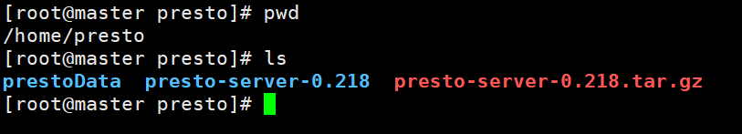
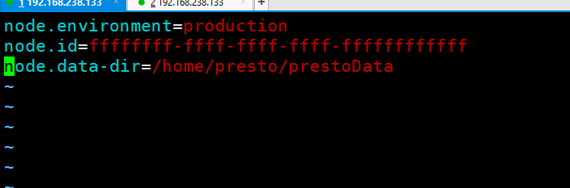
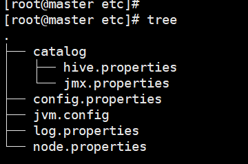
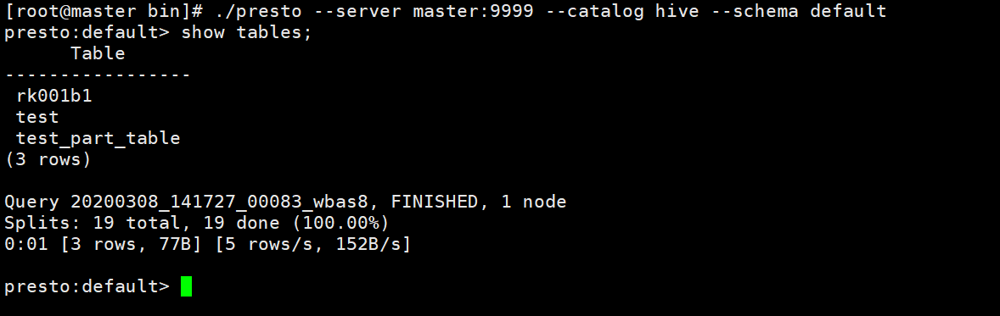

## presto单机安装

#### 第一步：下载安装包

去presto官网下载安装包[download](https://repo1.maven.org/maven2/com/facebook/presto/presto-server/)，俺用这个版本presto-server-0.218.tar.gz。将下载的安装包上传到linux的/home/presto目录下，并解压，得到presto-server-0.218目录。



### 第二步

在/home/presto目录下创建prestoData目录

````
mkdir -p /home/presto/prestoData
````

### 第三步

进入/home/presto/presto-server-0.218目录创建etc目录，并进入改目录

````
mkdir -p /home/presto/presto-server-0.218/etc
cd /home/presto/presto-server-0.218/etc
````


### 第四步

##### 创建node.properties文件

````
mkdir -p /home/presto/presto-server-0.218/etc/node.properties
````

##### 编辑node.properties文件

````
vim /home/presto/presto-server-0.218/etc/node.properties
node.environment=production
node.id=ffffffff-ffff-ffff-ffff-ffffffffffff
node.data-dir=/home/presto/prestoData
````



* `node.environment`：环境的名称。集群中的所有Presto节点必须具有相同的环境名称

* `node.id`：此Presto安装的唯一标识符。对于每个节点，这必须是唯一的。这个标识符应该在重新启动或升级Presto时保持一致。如果在一台机器上运行多个Presto安装(即在同一台机器上运行多个节点)，则每个安装必须具有唯一标识符。
* `node.data-dir`：数据目录的位置(文件系统路径)。Presto将在这里存储日志和其他数据。


##### 创建jvm.config文件

````
touch -p /home/presto/presto-server-0.218/etc/jvm.config
````

##### 编辑jvm.config文件

````
vim /home/presto/presto-server-0.218/etc/jvm.config
-server
-Xmx16G
-XX:+UseG1GC
-XX:G1HeapRegionSize=32M
-XX:+UseGCOverheadLimit
-XX:+ExplicitGCInvokesConcurrent
-XX:+HeapDumpOnOutOfMemoryError
-XX:+ExitOnOutOfMemoryError
````

这个文件时设置jvm参数的，不懂的自己去百度吧。

##### 创建config.properties

````
touch -p /home/presto/presto-server-0.218/etc/config.properties
````

##### 编辑config.properties文件

````
vim /home/presto/presto-server-0.218/etc/config.properties
coordinator=true
#如果时单机该选项需要设置为true
node-scheduler.include-coordinator=true
http-server.http.port=9999
query.max-memory=50GB
query.max-memory-per-node=1GB
query.max-total-memory-per-node=2GB
discovery-server.enabled=true
discovery.uri=http://yourip:9999
````

* `coordinator`：允许此Presto实例充当协调器(接受来自客户端的查询并管理查询执行)。
* `node-scheduler.include-coordinator`：允许在协调器上调度工作。对于较大的集群，协调器上的处理工作可能会影响查询性能，因为机器的资源无法用于调度、管理和监视查询执行的关键任务
* `http-server.http.port`：指定HTTP服务器的端口。Presto使用HTTP进行所有内部和外部通信。
* `query.max-memory`：查询可能使用的最大分布式内存。
* `query.max-total-memory-per-node`：查询可以在任何一台机器上使用的用户和系统内存的最大数量，其中系统内存是在执行期间由读取器、写入器和网络缓冲区等使用的内存。
* `discovery-server.enabled`：Presto使用发现服务查找集群中的所有节点。每个Presto实例将在启动时向发现服务注册自己。为了简化部署并避免运行附加服务，Presto协调器可以运行发现服务的嵌入式版本。它与Presto共享HTTP服务器，因此使用相同的端口。
* `discovery.uri`：到发现服务器的URI。因为我们已经在Presto协调器中启用了发现的嵌入式版本，所以这应该是Presto协调器的URI。替换example.net:8080以匹配Presto协调器的主机和端口。这个URI不能以斜线结束。

##### 创建log.properties文件

````
touch -p /home/presto/presto-server-0.218/etc/log.properties
````

##### 编辑log.properties文件

````
vim /home/presto/presto-server-0.218/etc/log.properties
com.facebook.presto=INFO
````

##### 创建连接配置文件

连接配置文件的详情可以在这里去看

[presto连接配置](https://prestodb.io/docs/current/connector.html )

创建jmx.properties文件

````
touch /home/presto/presto-server-0.218/etc/catalog/jmx.properties
````

##### 编辑jmx.properties

````
vim /home/presto/presto-server-0.218/etc/catalog/jmx.properties
connector.name=jmx
````

如果要连接hive可这样做

##### 创建hive.properties文件

````
touch /home/presto/presto-server-0.218/etc/catalog/hive.properties
````

编辑hive.properties

````
vim /home/presto/presto-server-0.218/etc/catalog/hive.properties

connector.name=hive-hadoop2
hive.metastore.uri=thrift://master:9083
hive.config.resources=/home/softwore/hadoop-2.7.6/etc/hadoop/core-site.xml,/home/softwore/hadoop-2.7.6/etc/hadoop/hdfs-site.xml
#-DHADOOP_USER_NAME=root
#配置Presto访问HiveMetastore服务的Kerberos信息，该段配置可以只存在Presto的Coordinator节点
hive.metastore.authentication.type=KERBEROS
hive.metastore.service.principal=hive/_HOST@FAYSON.COM
hive.metastore.client.principal=presto/admin@FAYSON.COM
hive.metastore.client.keytab=/opt/cloudera/parcels/presto/etc/presto.keytab

#配置Presto访问HDFS的Kerberos信息，改段配置可以只存在Presto的Worker节点
hive.hdfs.authentication.type=KERBEROS
hive.hdfs.impersonation.enabled=true
hive.hdfs.presto.principal=presto/admin@FAYSON.COM
hive.hdfs.presto.keytab=/opt/cloudera/parcels/presto/etc/presto.keytab
````

弄完了上面的步骤/home/presto/presto-server-0.218/etc/的目录结构应该时这样的



### 启动presto

进入bin目录

````
cd /home/presto/presto-server-0.218/bin
````

输入

````
./launcher start 启动presto
./launcher status 查看presto状态
./launcher stop  停止presto
````

### 安装presto客户端

去官网下载presto-cli-0.218-executable.jar包

[download](https://repo1.maven.org/maven2/com/facebook/presto/presto-cli/ )

将presto-cli-0.218-executable.jar上传至/home/presto/presto-server-0.218/bin

````
mv  presto-cli-0.218-executable.jar  presto
./presto --server yourip:9999 --catalog hive --schema default 
````

