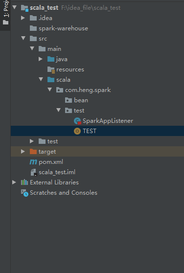

## SparkListener

在使用spark的时候，经常会遇到rdd在进行运算的时候报错，本地代码捕获不到异常信息的情况，

````scala
  def main(args: Array[String]): Unit = {

    val conf = new SparkConf().setMaster("local[*]").setAppName("wh_test");
    val sc = new SparkContext(conf);
    sc.addSparkListener(new SparkAppListener)
    val data = Array( 1,2,4,5,6);
    val rdd1 = sc.parallelize(data);
    rdd1.foreach(e => println(
      throw new Exception()
    ));

  }
````

像这样，在driver端就没办法对executor端的异常进行处理。这种情况有的时候是很令人头疼的，这样会使得程序变得不可控制。一个很好的解决办法就是去实现**SparkListener**接口，SparkListener接口提供了一系列的会回调方法，帮助我们去监听任务的各个阶段，并且我们可以重写这些接口来实现一些自定义的动作。SparkListener提供的接口非常好理解

````scala

  /**
   * Called when a stage completes successfully or fails, with information on the completed stage.
   */
  def onStageCompleted(stageCompleted: SparkListenerStageCompleted): Unit

  /**
   * Called when a stage is submitted
   */
  def onStageSubmitted(stageSubmitted: SparkListenerStageSubmitted): Unit

  /**
   * Called when a task starts
   */
  def onTaskStart(taskStart: SparkListenerTaskStart): Unit

  /**
   * Called when a task begins remotely fetching its result (will not be called for tasks that do
   * not need to fetch the result remotely).
   */
  def onTaskGettingResult(taskGettingResult: SparkListenerTaskGettingResult): Unit

  /**
   * Called when a task ends
   */
  def onTaskEnd(taskEnd: SparkListenerTaskEnd): Unit

  /**
   * Called when a job starts
   */
  def onJobStart(jobStart: SparkListenerJobStart): Unit

  /**
   * Called when a job ends
   */
  def onJobEnd(jobEnd: SparkListenerJobEnd): Unit

  /**
   * Called when environment properties have been updated
   */
  def onEnvironmentUpdate(environmentUpdate: SparkListenerEnvironmentUpdate): Unit

  /**
   * Called when a new block manager has joined
   */
  def onBlockManagerAdded(blockManagerAdded: SparkListenerBlockManagerAdded): Unit

  /**
   * Called when an existing block manager has been removed
   */
  def onBlockManagerRemoved(blockManagerRemoved: SparkListenerBlockManagerRemoved): Unit

  /**
   * Called when an RDD is manually unpersisted by the application
   */
  def onUnpersistRDD(unpersistRDD: SparkListenerUnpersistRDD): Unit

  /**
   * Called when the application starts
   */
  def onApplicationStart(applicationStart: SparkListenerApplicationStart): Unit

  /**
   * Called when the application ends
   */
  def onApplicationEnd(applicationEnd: SparkListenerApplicationEnd): Unit

  /**
   * Called when the driver receives task metrics from an executor in a heartbeat.
   */
  def onExecutorMetricsUpdate(executorMetricsUpdate: SparkListenerExecutorMetricsUpdate): Unit

  /**
   * Called when the driver registers a new executor.
   */
  def onExecutorAdded(executorAdded: SparkListenerExecutorAdded): Unit

  /**
   * Called when the driver removes an executor.
   */
  def onExecutorRemoved(executorRemoved: SparkListenerExecutorRemoved): Unit

  /**
   * Called when the driver receives a block update info.
   */
  def onBlockUpdated(blockUpdated: SparkListenerBlockUpdated): Unit

  /**
   * Called when other events like SQL-specific events are posted.
   */
  def onOtherEvent(event: SparkListenerEvent): Unit
````


可以通过实现这些接口来做一些自己想做的事，举一个例子，实现异常的监听



````scala
package com.heng.spark.test

import org.apache.spark.SparkConf
import org.apache.spark.scheduler.{JobFailed, JobSucceeded, SparkListener, SparkListenerApplicationEnd, SparkListenerApplicationStart, SparkListenerJobEnd, SparkListenerJobStart}
import org.apache.spark.internal.Logging


class SparkAppListener() extends SparkListener{

  var start = 0L;

  @Override
  override def onApplicationStart(applicationStart: SparkListenerApplicationStart): Unit = {
    val appId = applicationStart.appId;
    print("**********spark启动************")
    print("**********appId为" + appId + "************")
  }

  override def onJobStart(jobStart: SparkListenerJobStart): Unit = {
    val jobId = jobStart.jobId;
    start = jobStart.time;
    val tasks = jobStart.stageInfos.map(stageInfo => {
      println("jobId为" + jobId);
      println("该阶段有" + stageInfo.numTasks + "个分区");
      println("开始时间" + jobStart.time);
      stageInfo.numTasks}).sum
  }

  override def onJobEnd(jobEnd: SparkListenerJobEnd): Unit = {

    val result = jobEnd.jobResult match {
      case JobSucceeded => {
        val jobId = jobEnd.jobId;
        val time = jobEnd.time
        println("jobId：" + jobId + ",用时:" + (time - start) )
      }
      case default => {
        println(jobEnd.jobResult.toString)
      }
    };
  }
}
````

上面的代码实现对Spark Job监听的重写，当job结束时就会调用**onJobEnd**方法，然后程序再对job返回的结果对象**jobEnd：SparkListenerJobEnd**进行判断，这样就可以捕获spark程序executors端运行时抛出的异常了 。

````
    val conf = new SparkConf().setMaster("local[*]").setAppName("wh_test");
    val sc = new SparkContext(conf);
    sc.addSparkListener(new SparkAppListener)
    val data = Array( 1,2,4,5,6);
    val rdd1 = sc.parallelize(data);
    rdd1.foreach(e => println(
      throw new Exception()
    ));

  }
````

其实，仔细看看SparkListener接口**onJobStart(jobStart: SparkListenerJobStart)**方法，就可以发现通过jobStart.stageInfos方法可以获悉该job有多少个stage,每个stage有多少分区，那么这样是不是就意味着我们可以实现spark任务的进度条制作呢？

