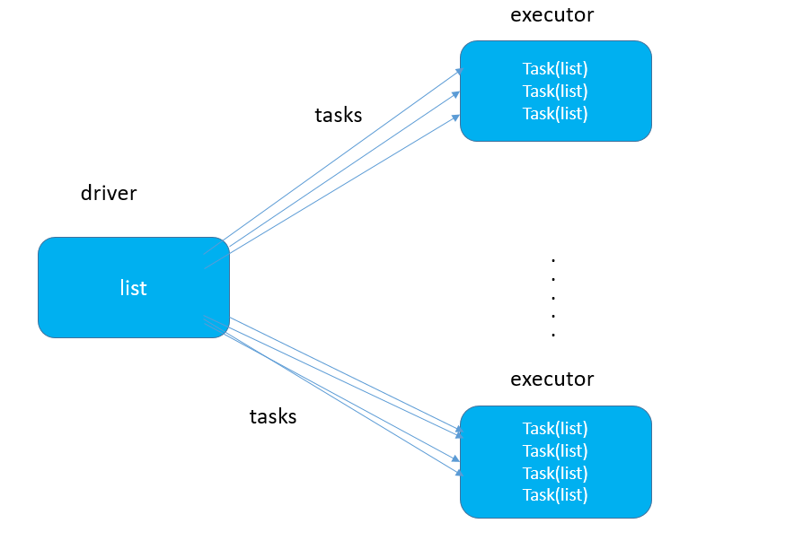

## 广播变量

Spark 会自动把闭包中所引用到的变量发送到工作节点上。虽然这很方便，但也很低效。原因有二：首先，默认的任务发射机制是专门为小任务进行优化的；其次，事实上你可能会在多个并行操作中使用同一个变量，但是 Spark 会为每个操作分别发送。

看着很抽象，我们还是以程序语言进行交流吧。


```java
object TEST {

  def main(args: Array[String]): Unit = {

    val conf = new SparkConf().setMaster("local[*]").setAppName("wh_test");
    val sc = new SparkContext(conf);
    val list = List("Hello java","Hello","java");

    val data = Array("hello","workd","java");
    val rdd1 = sc.parallelize(data);
    val line  = rdd1.filter(line => {
      list.contains(line);
    }).foreach(line => println(line));
  }

}
```

list变量是在driver端创建的，但是因为需要在excutor端使用，所以driver会把list变量以task的形式发送到executor端，如果有很多task，就会给多个executor端携带多个list,如果这个时候list非常大的时候，就可能造成内存溢出（如下所示）。这个时候就引出了广播变量。

**使用广播变量前**



**使用广播变量后**


使用广播变量前，driver端将list变量发送到每一个tasks中，这样就比较适合对小数据进行处理，数据就在task中，读取和处理都比较快捷。

使用广播变量后，driver端将list放松到每一个executor的BlockManager中，taks会自己去BlockManager去取数据，这样虽然增加了读取数据的耗时，但避免了处理大数据量时，内存溢出。

使用广播变量的过程很简单：

(1) 通过对一个类型 T 的对象调用 SparkContext.broadcast 创建出一个 Broadcast[T] 对象。任何可序列化的类型都可以这么实现。

(2) 通过 value 属性访问该对象的值（在 Java 中为 value() 方法）。

(3) 变量只会被发到各个节点一次，应作为只读值处理（修改这个值不会影响到别的节点）。

```
object TEST {

  def main(args: Array[String]): Unit = {

    val conf = new SparkConf().setMaster("local[*]").setAppName("wh_test");
    val sc = new SparkContext(conf);
    val list = List("Hello java","Hello","java");
    var broadcast = sc.broadcast(list);

    val data = Array("hello","workd","java");
    val rdd1 = sc.parallelize(data);
    rdd1.filter(line => {
      broadcast.value.contains(line);
    }).foreach(line => println(line));
    sc.stop();
  }

}
```

**注意事项：**

能不能将一个RDD使用广播变量广播出去？

不能，因为RDD是不存储数据的。可以将RDD的结果广播出去。

广播变量只能在Driver端定义，不能在Executor端定义。

**在Driver**端可以修改广播变量的值，在**Executor**端无法修改广播变量的值。


> 参考自：https://blog.csdn.net/Android_xue/article/details/79780463