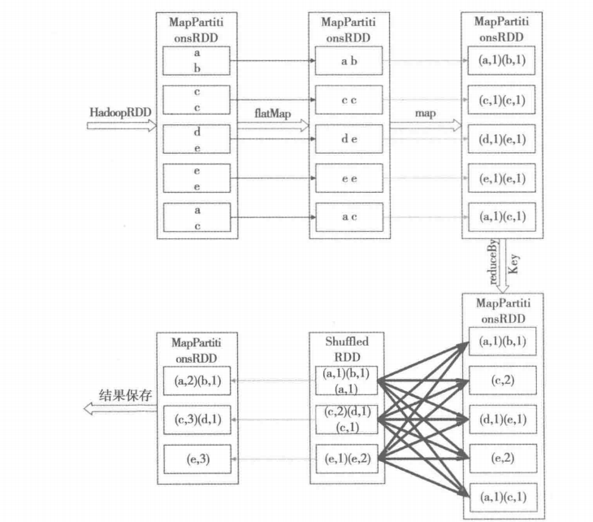
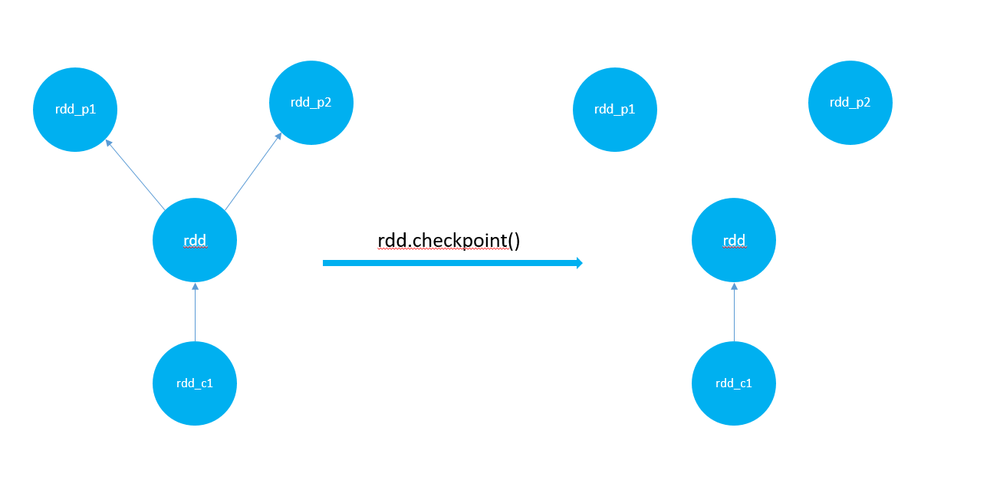
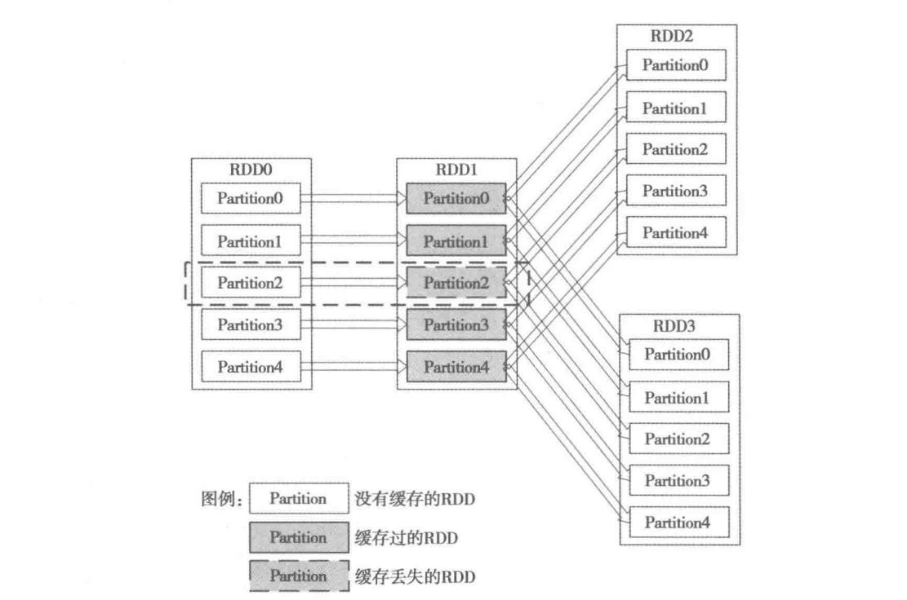

### spark的wordcount的阶段划分图

上图简要展示了spark实现wordcount的流程，网络io与磁盘io的过程被省略了，其实俺现在也不知道spark的网络数据传输和磁盘数据传输是咋回事。从上面的图可以看出来，reduceBykey分为3个阶段，第一个阶段是生成一个mapPartitionsRDD，这个阶段数据再本地进行聚合，第二个阶段是生成ShuffledRDD，也就是常说的shuffled阶段，可以看到这个阶段生成的子rdd(Shuffled)依赖所有的父rdd，因此在这个阶段分区数据的计算不会并发运行，子rdd的每个分区都依赖父rdd的所有分区，子rdd必须等待父rdd运行完，才能接着运行。最后分区数有父rdd的5个变成了3个。第三个阶段，就是对ShuffledRDD生成的分区数据进行聚合生成一个mapPartitionsRDD。

### spark的checkpoint

在spark中，存在两种rdd的缓存处理方式，一种的是rdd.cache()，一种是rdd.checkpoint()，其中在调用checkpoint的时候，rdd会将rdd自身所表示的数据集进行持久化，这里持久化的路径有本地文件系统、hdfs文件系统等等。最后rdd会清除自身所有的依赖，着也意味着rdd的转换的计算链等信息都被清除，其实这也是可以理解的，rdd调用checkpoint()方法后，会将自身进行持久化，这样在下次重新计算rdd的时候就不需要再去计算rdd_p1与rdd_p2了。

### RDD的容错机制

总的来说，spark的容错机制是基于rdd的lineage（血统）来实现的，rdd可以很容易的通过自己所依赖的父rdd来恢复数据。如下图，RDD1先进行计算，计算后的结果被缓存起来，然后rdd2与rdd3在计算的时候就可以直接运用rdd1的计算结果。当spark任务运行的途中由于内存的限制，spark会将最早缓存的rdd的数据剔出内存。下图中rdd2计算过程中，生成p0,p1,p3,p4分区的时候，rdd1的相关依赖已经存在就不需要重新计算，这个时候rdd2直接拿着用就行了，但是因rdd1中的p2的数据丢失了，因此rdd2在计算p2的时候需要rdd1重新计算p2。

