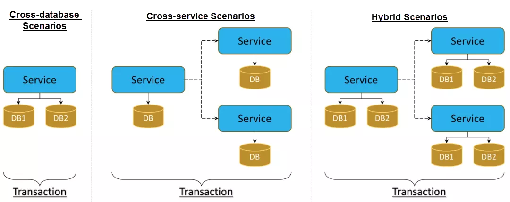
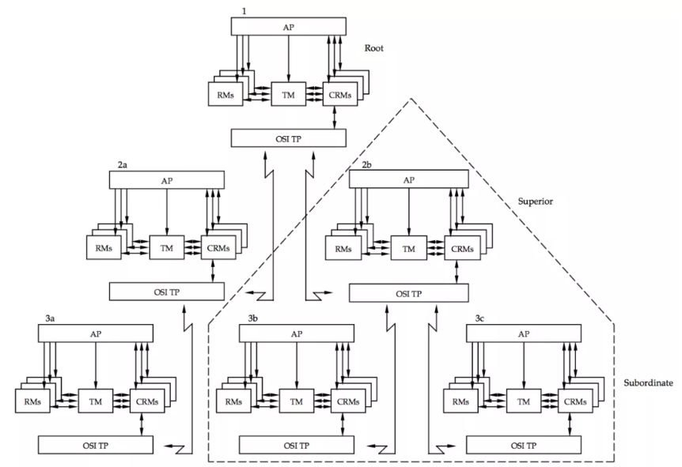
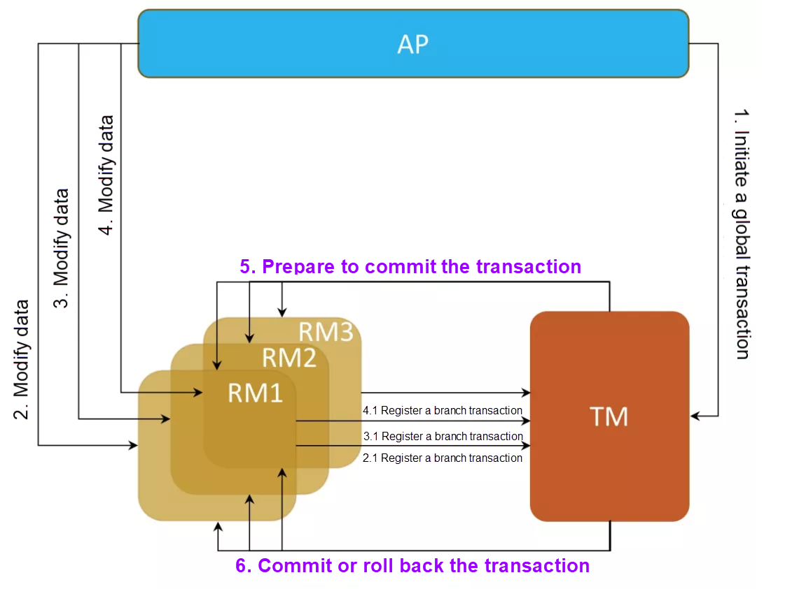
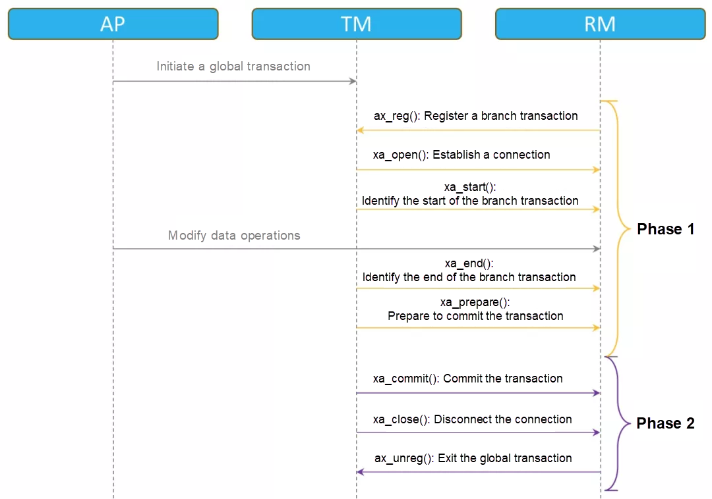
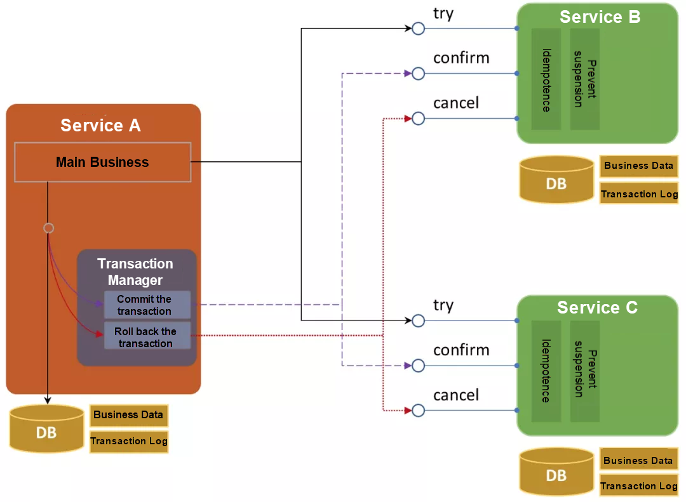

# 对分布式交易解决方案的深入分析

> 本文转自：https://www.alibabacloud.com/blog/an-in-depth-analysis-of-distributed-transaction-solutions_597232

本文总结了五种分布式事务解决方案并分析了它们的特点。XA规范、TCC、Saga、基于本地消息的分布式交易，以及基于交易消息的分布式事务。考虑到它的长度，我建议你把它添加到你的收藏夹中，在你方便的时候阅读它。

## 概述

一个事务是一组完整的操作。这些操作要么作为一个整体成功执行，要么作为一个整体被取消。最典型的交易场景是银行账户之间的转账。如果A账户想把100元人民币转到B账户，100元人民币将从A账户中扣除并加到B账户中。在这种情况下，只有当两个账户的金额变化都成功时，才能认为是成功的转账。更严格地说，事务被定义为具有ACID特征，即指原子性（atomicity）、一致性（consistency）、隔离性（isolation）和持久性（durability）。

* 原子性：一个事务中的所有操作必须作为一个整体成功执行，否则所有操作都必须取消。
* 持久性：例如，账户A和账户B各拥有人民币100元。无论这两个账户相互转账多少次，两个账户的总余额始终是200元人民币。

* 隔离性：表示并发事务之间的影响程度。它还被分为未提交的读取、已提交的读取和可重复的读取。
* 持久性：在事务完成后，对数据库所做的数据修改会被保留。

单个数据库不涉及网络互动，所以处理多个表之间的事务相对容易。这种事务被称为本地事务。

然而，当单个数据库的性能达到瓶颈时，就需要将数据库分片（变为多个物理实例），这就导致了跨数据库（跨数据库实例）事务。随着企业应用的扩展，企业将进一步进行面向服务的转型，以满足业务增长。随着微服务架构的日益普及，我们将看到越来越多的跨服务交易。

这些都是分布式事务的要求。 分布式事务是指事务的发起者、参与者、资源服务器和事务管理器位于分布式系统的不同节点上。

一般来说，分布式事务有三种场景：

* 跨数据库分布式事务
* 跨服务分布式事务
* 混合分布式事务

分布式事务系统的参与者分布在异步网络上。 它们通过网络通信实现一致性，在此期间，故障和超时是不可避免的。 因此，分布式事务比本地事务更难实现。 以下是一些常见的分布式事务解决方案：

## 分布式事务模型

### XA 协议

最早的分布式事务产品可能是 AT&T 在 1980 年代推出的 Tuxedo（Transactions for UNIX，Extended for Distributed Operations）。 Tuxedo 最初是作为电信领域 OLTP 系统的分布式事务中间件开发的。 后来标准化组织X/Open采用了Tuxedo的设计和一些接口，引入了分布式事务规范，XA规范。

XA 规范定义了一个分布式事务处理模型，包括四个核心角色：

* **RM（Resource Manager）**：提供数据操作和管理的接口，保证数据的一致性和完整性。 数据库管理系统是最具代表性的 RM 实例。 一些文件系统和消息队列 (MQ) 系统也可以被视为 RM 实例。
* **TM（事务管理器）**：作为协调器，协调所有与跨数据库事务关联的 RM 的行为。
* **Application Program（即应用程序简称AP）**：根据业务规则调用RM接口修改业务模型数据。 如果一个数据的变化涉及到多个 RM 并且必须保护事务的一致性和完整性，AP 通过一个 TM 定义一个事务的边界，它负责协调事务中涉及的 RM 来完成一个全局事务。
* 通信资源管理器 (CRM)：负责跨服务传输事务。

下图显示了 XA 规范中定义的事务模型。 发起分布式事务的TM实例称为根节点，其他TM实例统称为事务参与者。 发起者启动一个全局事务，事务参与者运行自己的事务分支。 如果一个 TM 实例向其他 TM 实例发起服务调用，则发起者为上级节点，而被调用的实例为下级节点。

在XA规范中，分布式事务是建立在RM的本地事务上，然后被认为是一个分支事务。TM负责协调这些分支事务，并确保所有的事务都被成功提交，或者所有的事务都被回滚。XA规范将分布式事务处理过程分为以下两个阶段，因此，它也被称为两阶段提交协议。

**1) 准备阶段**

TM 记录事务启动并查询每个 RM 是否准备好执行准备操作。

RM 收到命令后，会评估自己的状态，并尝试为本地事务执行准备操作，例如预留资源、锁定资源和执行操作。 然后，RM 等待来自 TM 的后续命令而不提交事务。 如果前面的尝试失败，RM 会通知 TM 该阶段的执行失败并回滚已执行的操作。 然后，RM 不再参与该事务。 例如，MySQL 会在这个阶段锁定资源并写入 redo 和 undo 日志。

TM 收集 RM 的响应并将事务准备记录为已完成。

**2)提交或回滚阶段**

本阶段根据前一阶段的协调结果发起事务提交或回滚操作。

如果所有 RM 在上一步中都响应成功，则执行以下操作：

* TM将事务记录为已提交，并向所有RM发出事务提交命令。
* 在RM收到命令后，他们提交事务，释放资源，并以 "提交完成 "回应TM。
* 如果TM收到所有这些RM的响应，它就把事务记录为完成。

如果任何 RM 在上一步中响应执行失败或没有及时响应，则 TM 将事务视为失败。 然后，将执行以下操作：

* TM 将事务记录为中止，并向所有 RM 发出事务回滚命令。
* RM收到订单后，回滚事务，释放资源，回复TM“回滚完成”。
* 如果 TM 收到所有这些 RM 的响应，它会将事务记录为已完成。

XA 规范还定义了以下优化措施：

* 如果 TM 发现整个事务中只涉及到一个 RM，整个过程就会降级为一阶段提交。
* 如果 RM 接收到的来自 AP 的数据操作是只读操作，则 RM 可以在第一阶段完成事务，并通知 TM 不再需要第二阶段。 如果是这种情况，可能会发生脏读。
* 如果RM在第一阶段完成后很久没有收到进入第二阶段的命令，它可以自行提交或回滚本地事务。 这种情况称为启发式完成。 请注意，此问题可能会破坏事务的一致性并导致异常。

XA 规范详细定义了核心组件之间的交互接口。 以 TM 与 RM 的交互接口为例。 下图是一个完整的全局事务，其中 TM 和 RM 的交互非常频繁。

事务执行期间可能会发生错误和网络超时。 对于这些异常，不同的实现可能会有不同的异常处理方法，如下所述。

* 如果 TM 在第一阶段查询 RM 之前遇到停机，则从停机恢复后将不需要任何操作。
* 如果 TM 在第一阶段查询 RM 后遇到停机，由于一些 RM 可能已经收到查询，需要向这些 RM 发送回滚请求。
* 如果 TM 在第一阶段查询 RM 后遇到停机，但在记录准备操作完成之前，需要在从停机中恢复后向 RM 发送回滚请求，因为 TM 不知道停机前的协商结果。
* 如果TM在第一阶段记录交易准备工作完成后遇到宕机，可以在从宕机中恢复后根据产生的日志发出提交或回滚命令。
* 如果TM在第二阶段生成提交或中止日志之前遇到了停机，可以在停机恢复后根据日志发出提交或回滚命令。
* 如果TM在第二阶段将交易记录为已完成之前遇到宕机，可以在从宕机中恢复后根据产生的日志发出提交或回滚命令。
* 如果TM在第二阶段记录交易完成后遇到宕机，在从宕机中恢复后不需要任何操作。
* 当任何RM在第一阶段没有及时响应时，TM会向所有的RM发出回滚命令。
* 当任何RM在第二阶段没有及时响应时，TM继续向没有响应的RM发出回滚命令。

**特征分析**

XA 两阶段提交协议旨在像本地事务一样实现事务的原子性、一致性、隔离性和持久性。

* 原子性：确保事务在准备和提交阶段是原子的。
* 一致性：XA 协议实现了强一致性。
* 隔离：XA事务持有资源锁直到完成，实现写隔离。
* 持久性：由于 XA 事务是基于本地事务的，因此可以确保持久性。

XA 规范是最早的分布式事务规范。 Oracle、MySQL、SQL Server等主流数据库产品都支持XA规范。 请注意，J2EE 中的 JTA 规范也是基于 XA 规范，因此与 XA 规范兼容。

XA 是在资源管理层实现的分布式事务模型。 它的特点是对业务的侵入程度低。

XA 的两阶段提交协议可以覆盖分布式事务的三种场景。 但是，RM 在执行全局事务期间会一直锁定资源。 如果事务涉及的 RM 过多，特别是在跨业务场景下，网络通信的数量和时间消耗会迅速增加。 从而导致阻塞时间延长，系统吞吐量下降，事务死锁概率增加。 因此，两阶段提交协议不适用于微服务场景下的跨服务分布式事务模式。

每个 TM 都创建一个单例，这可能会导致单点故障。 如果 TM 在第一阶段之后崩溃，参与的 RM 将不会收到第二阶段的命令，因此会长时间持有资源锁。 因此，这会影响业务的吞吐量。 另一方面，在一个完整的全局事务中，TM 与 RM 交互 多 次，导致复杂性和性能下降。

此外，两阶段协议可能会导致脑裂异常。 如果 TM 在第二阶段通知 RM 提交事务后出现故障，并且只有部分 RM 收到提交命令，那么当 TM 恢复时，它无法协调所有 RM 维护本地事务的一致性。

XA 必须处理许多异常情况，这对框架的实现具有挑战性。 关于开源实现，可以参考 Atomikos 和 Bitronix。

针对两阶段提交协议中存在的问题，提出了一种改进的三阶段提交方案。 这种新的解决方案消除了单点故障 (SPOF)，并为 RM 添加了超时机制，以避免长期锁定资源。 然而，三阶段解决方案无法解决裂脑问题，很少应用于实际案例。 如果您对此解决方案感兴趣，可以阅读相关资料。

### TCC协议

try、commit和cancle (TCC) 是一种补偿事务的模型。 该模型要求应用程序的每个服务提供三个接口，即try、commit、cancel接口。 该模型的核心思想是通过保留资源（提供中间状态），以最快的速度释放资源的锁定。 如果可以提交事务，则确认保留的资源。 如果事务需要回滚，则释放保留的资源。

TCC 也是两阶段提交协议，可以认为是两阶段提交 XA 的一个变种，不会长时间持有资源锁。

TCC 模型将事务的提交分为两个阶段：

**1) Phase one**

第一阶段，TCC进行业务检查（一致性）和业务资源预留（准隔离）。 这定义了 TCC 的 try 操作。

**2) Phase two**

如果try阶段所有业务资源预留成功，则执行confirm操作。 否则，执行取消操作。

* **Confirm**: 确认操作只作用于预留的资源，不检查业务。 如果操作失败，系统会不断重试。

* **Cancel**: 取消操作取消业务操作的执行，释放保留的资源，如果失败则重试。

在 TCC 模型中，事务的发起者和参与者都需要为事务记录日志。 发起者记录全局事务和每个分支事务的状态和信息。 参与者记录分支交易的状态。

在TCC事务执行过程的任何阶段，都可能出现宕机、重启、断网等异常。 如果是这种情况，则事务进入非原子且不一致的状态。 因此，需要根据主事务和分支事务的日志来提交或回滚剩余的分支事务。 这样整个分布式系统中的所有事务都可以达到最终的一致性和原子性。

**举例**

以电子商务系统为例。 小明在淘宝上花了100元买了一本书，这次购买获得了10个积分。 这次购物涉及系统中的以下操作：

* 订单系统创建商品订单。
* 支付系统接受小明的支付。
* 库存系统扣除产品库存。
* 会员系统将积分奖励到小明的账户。

这些操作需要作为一个事务执行，并且必须全部成功或全部取消。

如果在这种情况下使用 TCC 模型，则系统必须进行如下变换：

**1) 订单系统**

* Try：系统创建一个状态为“待付款”的订单。
* commit：系统将订单状态更新为“已完成”。
* cancle：系统将订单状态更新为“取消”。

**2) 支付系统**

* Try：假设小明账户里有1000元，购买时系统冻结100元。 此时，小明账户里还有1000元的余额。
* commit：系统将账户余额更改为900元，并清除冻结记录。
* cancle：系统清除冻结记录。

**3) 库存系统**

* try：假设库存中有 10 本书，系统冻结其中一本。 在这一步中，库存中还有 10 本书。
* commit：系统将库存更新为9册，并清除冻结记录。
* cancle：系统清除冻结记录。

**4)会员系统**

* try:假设小明的账户里有3,000个积分，现在系统奖励他10个积分。在这一步中，小明账户中的积分仍然是3,000。
* commit:系统将积分更新为3,010，并清除积分准备记录。
* cancle。系统清除信用准备记录。

**功能分析**

TCC 交易有四个特点：

* 原子性：事务的发起者协调并确保所有分支事务都提交或全部回滚。
* 一致性：TCC 事务确保最终的一致性。
* 隔离性：TCC通过在try阶段预分配资源来实现数据隔离。
* 持久性：TCC 通过协调每个分支事务来实现持久性。

TCC事务模型对业务有侵入性，业务方需要将一个接口拆分为三个，开发成本高。

同时，为了避免异步网络中通信失败或超时导致的异常，TCC要求业务方在设计和实现上遵循三个策略：

- 允许空回滚：当部分参与者在第一阶段没有收到try请求时，系统将取消整个事务。 如果try失败或未执行try操作的参与者收到cancle请求，则需要执行空回滚操作。
- 保持幂等性：当第二阶段出现网络超时等异常时，会重复调用confirm或cancel方法。 因此，这两种方法的实现必须是幂等的。
- 防止资源挂起：网络异常打乱了两个阶段的执行顺序，使得参与者端的try请求晚于cancel请求到达。 cancle操作会进行空回滚以保证事务的正确性，不会执行try操作。

TCC在业务层而不是资源层实现分布式事务，允许业务灵活选择资源锁定粒度。 另外，全局事务执行过程中不会一直持有锁，因此系统吞吐量远高于两阶段提交XA模式。

支持 TCC 交易的开源框架包括 ByteTCC、Himly 和 TCC-transaction。
