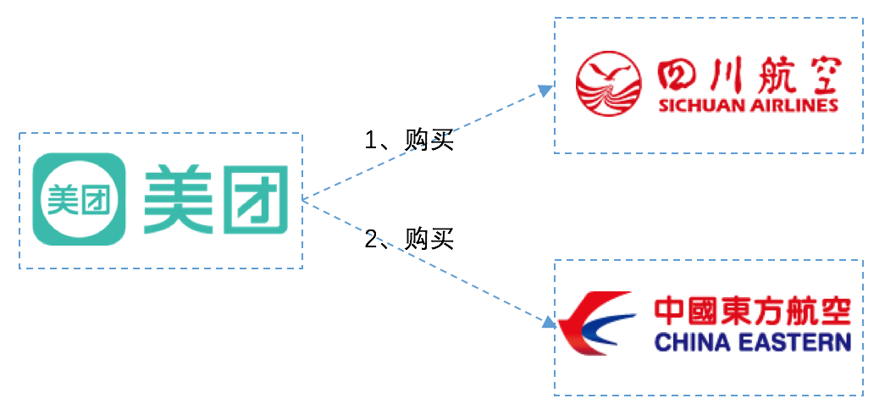
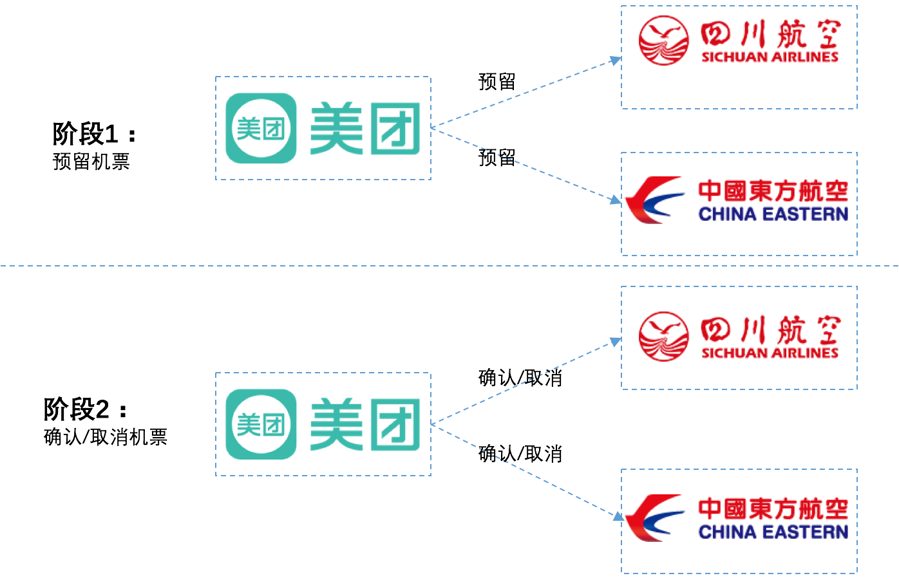

# 柔性事务之TCC两阶段补偿型

TCC方案是可能是目前最火的一种柔性事务方案了。关于TCC（Try-Confirm-Cancel）的概念，最早是由Pat Helland于2007年发表的一篇名为《Life beyond Distributed Transactions:an Apostate’s Opinion》的论文提出。在该论文中，TCC还是以Tentative-Confirmation-Cancellation命名。正式以Try-Confirm-Cancel作为名称的是Atomikos公司，其注册了TCC商标。

   国内最早关于TCC的报道，应该是InfoQ上对阿里程立博士的一篇采访。经过程博士的这一次传道之后，TCC在国内逐渐被大家广为了解并接受。

  Atomikos公司在商业版本事务管理器ExtremeTransactions中提供了TCC方案的实现，但是由于其是收费的，因此相应的很多的开源实现方案也就涌现出来，如：tcc-transaction、ByteTCC、spring-cloud-rest-tcc。

  TCC的作用主要是解决跨服务调用场景下的分布式事务问题，在本文中，笔者将先介绍一个跨服务的场景案例，并分析其中存在的分布式事务问题；然后介绍TCC的基本概念以及其是如何解决这个问题的。

## **场景案例**

 Atomikos官网上<<Composite Transactions for SOA>>一文中，以航班预定的案例，来介绍TCC要解决的事务场景。在这里笔者虚构一个完全相同的场景，把自己当做航班预定的主人公，来介绍这个案例。事实上，你可以把本案例当做官方文档案例的一个翻译，只不过把地点从Brussels-->Toronto-->Washington，改成从合肥-->昆明-->大理。

   有一次，笔者买彩票中奖了(纯属虚构)，准备从合肥出发，到云南大理去游玩，然后使用美团App(机票代理商)来订机票。发现没有从合肥直达大理的航班，需要到昆明进行中转。如下图： 


从图中我们可以看出来，从合肥到昆明乘坐的是四川航空，从昆明到大理乘坐的是东方航空。

   由于使用的是美团App预定，当我选择了这种航班预定方案后，美团App要去四川航空和东方航空各帮我购买一张票。如下图： 



考虑最简单的情况：美团先去川航帮我买票，如果买不到，那么东航也没必要买了。如果川航购买成功，再去东航购买另一张票。

  现在问题来了：假设美团先从川航成功买到了票，然后去东航买票的时候，因为天气问题，东航航班被取消了。那么此时，美团必须取消川航的票，因为只有一张票是没用的，不取消就是浪费我的钱。那么如果取消会怎样呢？如果读者有取消机票经历的话，非正常退票，肯定要扣手续费的。在这里，川航本来已经购买成功，现在因为东航的原因要退川航的票，川航应该是要扣代理商的钱的。

  那么美团就要保证，如果任一航班购买失败，都不能扣钱，怎么做呢？

  两个航空公司都为美团提供以下3个接口：机票预留接口、确认接口、取消接口。美团App分2个阶段进行调用，如下所示： 



**在第1阶段：**

   美团分别请求两个航空公司预留机票，两个航空公司分别告诉美图预留成功还是失败。航空公司需要保证，机票预留成功的话，之后一定能购买到。

**在第2阶段：**

  如果两个航空公司都预留成功，则分别向两个公司发送确认购买请求。

  如果两个航空公司任意一个预留失败，则对于预留成功的航空公司也要取消预留。这种情况下，对于之前预留成功机票的航班取消，也不会扣用户的钱，因为购买并没实际发生，之前只是请求预留机票而已。

   通过这种方案，可以保证两个航空公司购买机票的一致性，要不都成功，要不都失败，即使失败也不会扣用户的钱。如果在两个航班都已经已经确认购买后，再退票，那肯定还是要扣钱的。

  当然，实际情况肯定这里提到的肯定要复杂，通常航空公司在第一阶段，对于预留的机票，会要求在指定的时间必须确认购买(支付成功)，如果没有及时确认购买，会自动取消。假设川航要求10分钟内支付成功，东航要求30分钟内支付成功。以较短的时间算，如果用户在10分钟内支付成功的话，那么美团会向两个航空公司都发送确认购买的请求，如果超过10分钟(以较短的时间为准)，那么就不能进行支付。

  再次强调，这个案例，可以算是<<Composite Transactions for SOA>>中航班预定案例的汉化版。而实际美团App是如何实现这种需要中转的航班预定需求，笔者并不知情。

  另外，注意这只是一个案例场景，实际情况中，你是很难去驱动航空公司进行接口改造的。

  Whatever，这个方案提供给我们一种跨服务条用保证事务一致性的一种解决思路，可以把这种方案当做TCC的雏形。 

## **TCC 的基本概念**

TCC是Try-Confirm-Cancel的简称:

**Try阶段：**

  完成所有业务检查（一致性），预留业务资源(准隔离性)

   回顾上面航班预定案例的阶段1，机票就是业务资源，所有的资源提供者(航空公司)预留都成功，try阶段才算陈宫

**Confirm阶段：**

  确认执行业务操作，不做任何业务检查， 只使用Try阶段预留的业务资源。回顾上面航班预定案例的阶段2，美团APP确认两个航空公司机票都预留成功，因此向两个航空公司分别发送确认购买的请求。

**Cancel阶段：**

   取消Try阶段预留的业务资源。回顾上面航班预定案例的阶段2，如果某个业务方的业务资源没有预留成功，则取消所有业务资源预留请求。 


敏锐的读者立马会想到，TCC与XA两阶段提交有着异曲同工之妙，下图列出了二者之间的对比：


 \1) 在阶段1：

  在XA中，各个RM准备提交各自的事务分支，事实上就是准备提交资源的更新操作(insert、delete、update等)；而在TCC中，是主业务活动请求(try)各个从业务服务预留资源。

 \2) 在阶段2：

   XA根据第一阶段每个RM是否都prepare成功，判断是要提交还是回滚。如果都prepare成功，那么就commit每个事务分支，反之则rollback每个事务分支。

  TCC中，如果在第一阶段所有业务资源都预留成功，那么confirm各个从业务服务，否则取消(cancel)所有从业务服务的资源预留请求。


TCC两阶段提交与XA两阶段提交的区别是：

  **XA是资源层面的分布式事务，强一致性，在两阶段提交的整个过程中，一直会持有资源的锁。**

​    XA事务中的两阶段提交内部过程是对开发者屏蔽的，回顾我们之前讲解JTA规范时，通过UserTransaction的commit方法来提交全局事务，这只是一次方法调用，其内部会委派给TransactionManager进行真正的两阶段提交，因此开发者从代码层面是感知不到这个过程的。而事务管理器在两阶段提交过程中，从prepare到commit/rollback过程中，资源实际上一直都是被加锁的。如果有其他人需要更新这两条记录，那么就必须等待锁释放。

  **TCC是业务层面的分布式事务，最终一致性，不会一直持有资源的锁。**

   TCC中的两阶段提交并没有对开发者完全屏蔽，也就是说从代码层面，开发者是可以感受到两阶段提交的存在。如上述航班预定案例：在第一阶段，航空公司需要提供try接口(机票资源预留)。在第二阶段，航空公司提需要提供confirm/cancel接口(确认购买机票/取消预留)。开发者明显的感知到了两阶段提交过程的存在。try、confirm/cancel在执行过程中，一般都会开启各自的本地事务，来保证方法内部业务逻辑的ACID特性。其中：

  1、try过程的本地事务，是保证资源预留的业务逻辑的正确性。

  2、confirm/cancel执行的本地事务逻辑确认/取消预留资源，以保证最终一致性，也就是所谓的`补偿型事务`(Compensation-Based Transactions)。

由于是多个独立的本地事务，因此不会对资源一直加锁。

另外，这里提到confirm/cancel执行的本地事务是补偿性事务，关于什么事补偿性事务，atomikos 官网上有以下描述： 


 红色框中的内容，是对补偿性事务的解释。大致含义是，"补偿是一个独立的支持ACID特性的本地事务，用于在逻辑上取消服务提供者上一个ACID事务造成的影响，对于一个长事务(long-running transaction)，与其实现一个巨大的分布式ACID事务，不如使用基于补偿性的方案，把每一次服务调用当做一个较短的本地ACID事务来处理，执行完就立即提交”。

   在这里，笔者理解为confirm和cancel就是补偿事务，用于取消try阶段本地事务造成的影响。因为第一阶段try只是预留资源，之后必须要明确的告诉服务提供者，这个资源你到底要不要，对应第二阶段的confirm/cancel。

  提示：读者现在应该明白为什么把TCC叫做两阶段补偿性事务了，提交过程分为2个阶段，第二阶段的confirm/cancel执行的事务属于补偿事务。 

## **TCC事务模型 VS DTP事务模型**

在介绍完TCC的基本概念之后，我们再来比较一下TCC事务模型和DTP事务模型，如下所示： 


这两张图看起来差别较大，实际上很多地方是类似的!

**1、TCC模型中的主业务服务 相当于 DTP模型中的AP，TCC模型中的从业务服务 相当于 DTP模型中的RM**

​    在DTP模型中，应用AP操作多个资源管理器RM上的资源；而在TCC模型中，是主业务服务操作多个从业务服务上的资源。例如航班预定案例中，美团App就是主业务服务，而川航和东航就是从业务服务，主业务服务需要使用从业务服务上的机票资源。不同的是DTP模型中的资源提供者是类似于Mysql这种关系型数据库，而TCC模型中资源的提供者是其他业务服务。

**2、TCC模型中，从业务服务提供的try、confirm、cancel接口 相当于 DTP模型中RM提供的prepare、commit、rollback接口**

   XA协议中规定了DTP模型中定RM需要提供prepare、commit、rollback接口给TM调用，以实现两阶段提交。

   而在TCC模型中，从业务服务相当于RM，提供了类似的try、confirm、cancel接口。

**3、事务管理器**

   DTP模型和TCC模型中都有一个事务管理器。不同的是：

   在DTP模型中，阶段1的(prepare)和阶段2的(commit、rollback)，都是由TM进行调用的。

   在TCC模型中，阶段1的try接口是主业务服务调用(绿色箭头)，阶段2的(confirm、cancel接口)是事务管理器TM调用(红色箭头)。这就是 TCC 分布式事务模型的二阶段异步化功能，从业务服务的第一阶段执行成功，主业务服务就可以提交完成，然后再由事务管理器框架异步的执行各从业务服务的第二阶段。这里牺牲了一定的隔离性和一致性的，但是提高了长事务的可用性。问题来了，既然第二阶段是异步执行的，主业务服务怎么知道异步执行的结果呢？发消息异步通知？返回一个id，后面让业务去查？

 

**TCC事务的优缺点：**

   **优点：**XA两阶段提交资源层面的，而TCC实际上把资源层面二阶段提交上提到了业务层面来实现。有效了的避免了XA两阶段提交占用资源锁时间过长导致的性能地下问题。

  **缺点：**主业务服务和从业务服务都需要进行改造，从业务方改造成本更高。还是航班预定案例，原来只需要提供一个购买接口，现在需要改造成try、confirm、canel3个接口，开发成本高。


提示：国内有一些关于TCC方案介绍的文章中，把TCC分成三种类型：

- 通用型TCC，如果我们上面介绍的TCC模型实例，从业务服务需要提供try、confirm、cancel
- 补偿性TCC，从业务服务只需要提供 Do 和 Compensate 两个接口
- 异步确保型 TCC，主业务服务的直接从业务服务是可靠消息服务，而真正的从业务服务则通过消息服务解耦，作为消息服务的消费端，异步地执行。

关于这种划分，笔者并不赞同，基于两点：

   1、笔者在Atomikos在官网上参考了多份资料，并没有看到这种划分，猜测应该是这些公司在内部实践中，自行提出的概念。

  2、对于上面所谓的"补偿性TCC”、”异步确保型 TCC”，从业务服务不需要提供try、confirm、cancel三个接口，在这种情况下，好像称之为TCC也不太合适。 

## **TCC For REST案例**

   通过前面的介绍，我们基本已经掌握了TCC的工作原理。在本节中，笔者借用Atomikos官网提供的<<Tcc For Rest>>进行TCC案例讲解。

  需要注意的是，这个案例的主要目的是说明，在使用基于HTTP的REST服务中，TCC模型中各个参与方的API接口应该如何设计。通常一个TCC方案是不会依赖于底层通信框架的，例如我们也可以使用业界比较火的spring cloud、dubbo等。这个时候，提供实现类似接口的功能就可以了。

首先我们总结一下TCC模型各个参与方需要提供的API：

  **Participant API：**从业务服务需要提供的API，其需要提供try接口供主业务服务调用，需要提供confirm、cancel接口供事务管理器调用。这里将从业务服务称之为Participant。

   **Transaction Coordinator API：**事务管理/协调器需要提供的API，其需要提供事务日志上报接口，让主业务活动上报try阶段各个从业务活动资源是否预留成功的信息

  **Application：**主业务服务，其不需要提供任何接口，只需要操作上述 Participant、 Transaction Coordinator提供的接口即可。

  熟悉的配方，熟悉的味道，<<Tcc For Rest>>采用的依然航班预定案例，如下图所示：


其中：

Booking Proccess是主业务活动，处理机票预定业务

Swiss和easyjet是从业务服务，可以理解为两个不同航空公司的机票预定系统

Transaction Coordinator是事务协调器，或者称之为事务管理器。

上图中描述的整体流程如下所示：

1 Booking Proccess接受到一个需要中转的航班预定请求(bookTrip)

   -1.1：Booking Proccess向swiss发起机票预定请求 R1，其中/booking/A表示swis提供的预留机票资源的try接口

   -1.2：Booking Proccess向easyjet发起机票预定请求 R2，其中/booking/B表示easyjet提供的预留机票资源的try接口

   -1.3：Booking Proccess将请求1.1、1.2步骤中try的结果合并上报给Transaction Coordinator。

​      -1.3.1 Transaction Coordinator 向swiss发送确认执行业务操作的请求

​      -1.3.2 Transaction Coordinator 向easyjet发送确认执行业务操作的请求

### Participant API

  从业务服务需要提供try、confirm和cancel三个接口，其中try接口是给主业务服务调用的，confirm和cancel是给事务协调器调用的。

***\*try接口\****

   在1.1和1.2步骤中，Booking Proccess向swiss和easyjet提供的try接口分别发起机票预留请求，swiss和easyjet作为参与者，返回的响应格式如下所示 

````json
{"participantLink":
    {"uri":"http://www.example.com/part/123",
    "expires":"2014-01-11T10:15:54Z"
    }
}
````

这里返回的是一个JSON格式，事实上返回的格式什么是无所谓的，不过Atomikos官方建议使用JSON格式。其中：

   uri ：表示的是稍后在Confirm确认执行业务操作时，需要调用的url

   expires：表示截止时间，也就是说，如果超过这个时间依然没有确认购买，那么swiss和easyjet将会自动取消这个机票的预留

**confirm接口**

   Transaction Coordinator判断资源都预留成功，解析出json格式中的uri部分，向swiss和easyjet发送确认执行请求(Confirm)，请求格式如下：

````http
PUT /part/123 HTTP/1.1
Host: www.example.com
Accept: application/tcc
````

注意请求头中Accept接受的MIME类型, 暗示了客户端的语义期望。 这个并不是强制的。  

如果swiss和easyjet都确认执行成功，应该返回204，表示执行成功

````http
HTTP/1.1 204 No Content
````

 需要注意的是，如果在截止时间(expires)后发送确认执行的请求，swiss和easyjet应该返回404

````http
HTTP/1.1 404 Not Found
````

而Transaction Coordinator自身也应该有这种超时判断，以为较小的expires为准，当超过这个时间时，就不应该发送confirm确认执行的请求。

而在expires之前如果确认执行失败，Transaction Coordinator应该进行重试。

**cancel接口(可选实现)**

  参与者可以选择是否显式的提供cancel接口，如果提供了。Transaction Coordinator应该发送DELETE请求，告诉参与者取消资源预留，格式如下

````http
DELETE /part/123 HTTP/1.1
Host: www.example.com
Accept: application/tcc
````

  如果取消成功，则返回

````http
HTTP/1.1 204 No Content
````

 如果取消失败，也不会影响结果。前面提到过，资源预留都有一个expires截止时间，超过这个截止时间，参与者就可以主动取消这个预留的资源。

  如果是因为超时，参与者自行取消资源预留的情况下，应该返回

````http
HTTP/1.1 404 Not Found
````

另外，由于参与具备超时自动取消预留的功能，因此DELETE接口是可选的。如果参与者不提供DELETE接口来支持显式cancel，可以返回

````http
HTTP/1.1 405 Method Not Allowed
````

 不过笔者还是建议显式的提供cancel接口，例如，如果swiss预留成功，easyjet预留失败。对于预留失败的情况，其实我们已经没有必要进行cancel了。但是swiss预留成功了，如果等待超时自动取消，可能会比较耗时，通过显式提供cancel接口，来更快的取消预留的资源，将机票卖给其他客户。

### Transaction Coordinator API

  TCC模型中，主业务服务需要将事务日志上报给事务管理器/协调器，然后由协调器来调用从业务服务的confirm或者cancel接口。因此事务管理器/协调器必须提供一个事务日志上报的接口。而本节就是介绍这个接口接受的参数类型和响应类型。

   主业务服务在第一阶段，调用各个从业务服务的try接口，并且将响应合并起来上传报给Transaction Coordinator。考虑一下，这里应该分为2种情况：

1、所有的try接口都调用成功了，因此主业务服务希望Transaction Coordinator向各个从业务服务进行confirm

2、try接口部分成功，部分失败。因此主业务服务希望Transaction Coordinator对已经try成功的从业务服务都进行cancel

   因此对Transaction Coordinator来说，需要提供2个事务日志上报接口：confirm接口、cancel接口.

**confirm接口**

请求格式如下：

````http
PUT /coordinator/confirm HTTP/1.1
Host: www.taas.com
Content-Type: application/tcc+json
{
  "participantLinks": [
     {
     "uri": "http://www.example.com/part1",
     "expires": "2014-01-11T10:15:54Z"
     },
     {
     "uri": "http://www.example.com/part2",
     "expires": "2014-01-11T10:15:54+01:00"
     }
  ]
}
````

然后协调器会对参与者逐个发起Confirm请求, 如果一切顺利那么将会返回如下结果

````http
HTTP/1.1 204 No Content
````

如果发起Confirm请求的时间太晚, 那么意味着所有被动方都已经进行了超时补偿

````http
HTTP/1.1 404 Not Found
````

最糟糕的情况就是有些参与者确认了, 但是有些就没有. 这种情况就应该要返回409, 这种情况在Atomikos中定义为启发式异常

````http
HTTP/1.1 409 Conflict
````

 当然, 这种情况应该尽量地避免发生, 要求Confirm与Cancel实现幂等性, 出现差错时协调器可多次对参与者重试以尽量降低启发性异常发生的几率. 万一409真的发生了, 则应该由请求方主动进行检查或者由协调器返回给请求方详细的执行信息, 例如对每个参与者发起故障诊断的GET请求, 记录故障信息并进行人工干预.

**cancel接口**

一个cancel请求跟confirm请求类似, 都是使用PUT请求, 唯一的区别是URI的不同

唯一可预见的响应就是

````http
HTTP/1.1 204 No Content
````

因为当预留资源没有被确认时最后都会被释放, 所以参与者返回其他错误也不会影响最终一致性。


## **推荐阅读资料：**

**开源TCC实现方案**

  [tcc-transaction](https://github.com/changmingxie/tcc-transaction)：

  [ ByteTCC](https://github.com/liuyangming/ByteTCC)

  [spring-cloud-rest-tcc](https://github.com/prontera/spring-cloud-rest-tcc)

**Atomikos的官方文档**

   [**<< Transaction management API for REST: TCC>>**](https://www.atomikos.com/Main/DownloadPublications?article=TccForRestApi.pdf)

   **<<Atomikos ExtremeTransactions Guide>>**