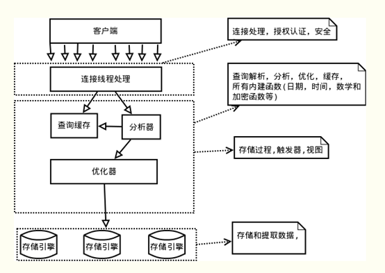

# MySQL执行流程

本文主要通过一些简单的实例，粗略的过一遍sql在MySQL服务器中是怎样执行的。是为鸟瞰全图，心里有数。

## Mysql逻辑架构图

Mysql主要由`连接器`、`分析器`、`优化器`、以及`存储引擎`组成,本文将从四个部分来简单概述MySQL的这四个组件。其中“连接器”、“分析器”、“优化器”为MySQL的Server层，“存储引擎”为单独的一层。



## 连接器

Mysql Server层的第一个模块，就是连接器。当我们使用MySQL客户端连接MySQL服务器的时候，处理连接的就是这一个模块。一般我们是这样连接MySQL服务器的

````shell
[root@localhost ~]# mysql -u${username} -p${password}
````

MySQL客户端与服务端使用TCP协议进行连接，完成连接后，服务器便对用户进行身份认证。

1. 如果用户的账号和密码都正确，则连接器回去用户的权限表查出用户账号拥有的权限。在**本次连接中**，以后所有的操作权限都基于此时查询的权限。这便意味着，用户连接成功后再修改用户的权限，对之前的连接也是不起作用的。只有修改权限后再连接MySQL服务才会起作用。连接建立成功后，再一段时间内没有进行操作，则MySQL会自动断开连接，断开连接的时间是由wait_timeout控制的（默认为8小时），如果连接自动断开后再试图去对MySQL进行操作则会收到“Lost connection to MySQL server during query”信息。
2. 如果用户的连接信息不正确。那么连接器会抛出一个 "Access denied for user"的错误，客户端结束执行。

使用show processList命令可以看到系统的所有连接信息

````sql
mysql> SHOW PROCESSLIST;
+----+-----------------+-----------------+------+---------+--------+------------------------+------------------+
| Id | User            | Host            | db   | Command | Time   | State                  | Info             |
+----+-----------------+-----------------+------+---------+--------+------------------------+------------------+
|  4 | event_scheduler | localhost       | NULL | Daemon  | 221803 | Waiting on empty queue | NULL             |
|  9 | root            | localhost:49456 | test | Sleep   |     13 |                        | NULL             |
| 10 | root            | localhost:49459 | test | Sleep   |     24 |                        | NULL             |
| 11 | root            | localhost:49484 | NULL | Query   |      0 | starting               | SHOW PROCESSLIST |
+----+-----------------+-----------------+------+---------+--------+------------------------+------------------+
4 rows in set (0.00 sec)
````

可以看淡 Command列中有几个状态，其中Sleep表示该链接此时为空闲状态，没有进行操作。

MySQL建立连接的过程比较复杂，会消耗一定的系统资源，因此在使用MySQL的过程中，推荐尽量使用长连接，而非使用使用频繁断开的短链接。

不过大量的使用长连接，也会占用大量的系统内存，到了一个临界点的时候


## 查询缓存

在执行SQL的时候，会首先去查询缓存中寻找是否执行过对应的sql语句，如果有则把对应SQL缓存的结果取出来返回给用户，如果没有则进入`分析器`的逻辑中，然后将查询的结果进行缓存。

在多数情况下本文都建议不要使用查询缓存，从经验来看查询缓存的弊大于利。为什么呢？当表被更新的时候，这张表的查询缓存就会被清除掉，因此在实际的场景中查询缓存的命中率会很低。除非能够确认目标表是一张更新频次非常低的表，不然强烈建议关闭查询缓存。

MySQL 也提供了这种“按需使用”的方式。你可以将参数 query_cache_type 设置成 DEMAND，这样对于默认的 SQL 语句都不使用查询缓存。而对于你确定要使用查询缓存的语句，可以用 SQL_CACHE 显式指定，像下面这个语句一样：

````shell
mysql > SELECT SQL_CACHE  * from test where name = "zhangsan";
````

在MySQL 8.0 版本直接将查询缓存的整块功能删掉了，也就是说 8.0 开始彻底没有这个功能了。

## 分析器

如果在查询缓存中没有命中，就需要老老实实的去执行语句了。MySQL会先对sql语句进行分析，来知道用户要干什么。在经历了“词法分析”后，MySQL会识别出sql中的字符串，提取相应的关键字，并对其进行分析，搞清楚其是什么，干什么的。做完这些后，MySQL会对SQL的语法进行检查，如果语法不对，就会抛出“You have an error in your SQL syntax”的错误

````sql
mysql> select   from test;
ERROR 1064 (42000): You have an error in your SQL syntax; check the manual that corresponds to your MySQL server version for the right syntax to use near 'from test' at line 1
````

## 优化器

经过了分析器后，MySQL已经大致知道该干啥了。接下来MySQL会先对表进行权限验证，如果用户有表的权限，则继续执行，如果用户没有用户权限，则抛出异常，退出执行。

````sql
mysql> select * from person where ID=10;

ERROR 1142 (42000): SELECT command denied to user 'test'@'localhost' for table 'person'
````

然后MySQL继续打开表运行，执行器就会根据表的引擎定义，去使用这个引擎提供的接口（所以到了执行的时候才会进入到数据库引擎，然后执行器也是通过调用数据库引擎的API来进行数据操作的。也因此数据库引擎才会是插件形式的）。

比如我们这个例子中的表 person 中，ID 字段没有索引，那么执行器的执行流程是这样的：

1. 调用 InnoDB 引擎接口取这个表的第一行，判断 ID 值是不是 10，如果不是则跳过，如果是则将这行存在结果集中；

2. 调用引擎接口取“下一行”，重复相同的判断逻辑，直到取到这个表的最后一行。

3. 执行器将上述遍历过程中所有满足条件的行组成的记录集作为结果集返回给客户端。

至此，这个语句就执行完成了。对于有索引的表，执行的逻辑也差不多。第一次调用的是“取满足条件的第一行”这个接口，之后循环取“满足条件的下一行”这个接口，这些接口都是引擎中已经定义好的。你会在数据库的慢查询日志中看到一个 rows_examined 的字段，表示这个语句执行过程中扫描了多少行。这个值就是在执行器每次调用引擎获取数据行的时候累加的。

你会在数据库的慢查询日志中看到一个 rows_examined 的字段，表示这个语句执行过程中扫描了多少行。这个值就是在执行器每次调用引擎获取数据行的时候累加的。在有些场景下，执行器调用一次，在引擎内部则扫描了多行，因此引擎扫描行数跟 rows_examined 并不是完全相同的。

