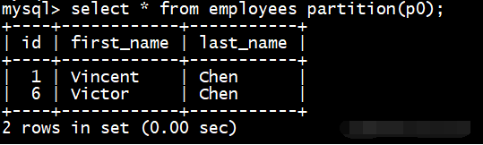
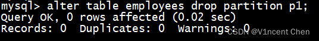
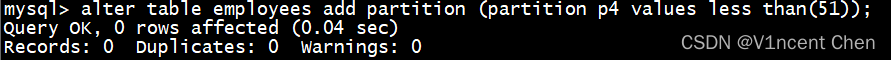
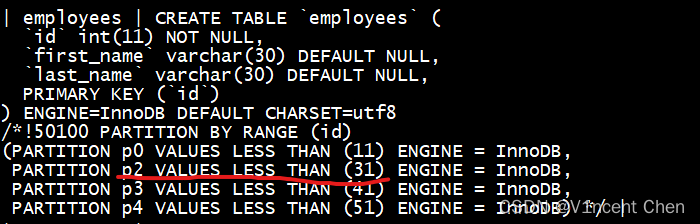
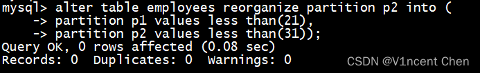
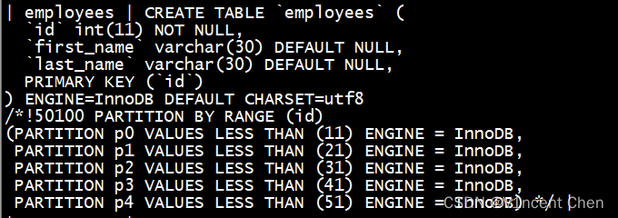
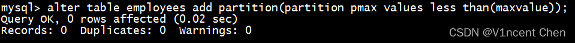
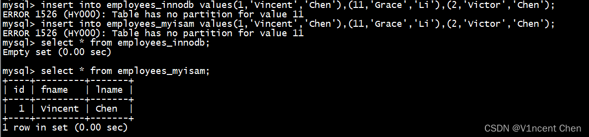

# Mysql之分区表

通常情况下，同一张表的数据在物理层面都是存放在一起的。随着业务增长，当同一张表的数据量过大时，会带来管理上的不便。而分区特性可以将一张表从物理层面根据一定的规则将数据划分为多个分区，多个分区可以单独管理，甚至存放在不同的磁盘/文件系统上，提升效率。

分区表的优点：

数据可以跨磁盘/文件系统存储，适合存储大量数据。
数据的管理非常方便，以分区为单位操作数据，不会影响其他分区的正常运行。
数据查询上在某些条件可以利用分区裁剪(partition pruning)特性，将搜索范围快速定位到特性分区，提升查询性能。
对于应用来说，表依然是一个逻辑整体，但数据库可以针对不同的数据分区独立执行管理操作，不影响其他分区的运行。而数据划分的规则即称为分区函数，数据写入表时，会根据运算结果决定写入哪个分区。

MySQL的分区插件与存储引擎运行在不同的层，因此大部分存储引擎都可以利用MySQL的分区特性，只有少数存储引擎（merge，CSV，federated）不支持分区特性。若某张表使用的分区特性，则所有的分区都需要使用相同的存储引擎，且分区特性会同时应用到数据和索引上。

一、分区的类型
1. Range partition(范围分区)
Range partition是按照分区表达式的运算结果，判断结果落在某个范围内，从而将数据存储在对应的分区。各个分区定义之间需要连续且不能重叠，范围分区通过partition by range子句定义，而分区的范围通过values less than子句划分。

例：定义一个员工表，根据员工ID分区，1~10号员工一个分区，11~20号员工一个分区，依次类推，共建立4个分区：


````java
create table employees (
    id int not null primary key,
    first_name varchar(30),
    last_name varchar(30))
    partition by range(id)(
    partition p0 values less than (11),
    partition p1 values less than (21),
    partition p2 values less than (31),
    partition p3 values less than (41)
    );
````

现在随便插入几条数据：

````java
insert into employees values(1,'Vincent','Chen');
insert into employees values(6,'Victor','Chen');
insert into employees values(11,'Grace','Li');
insert into employees values(16,'San','Zhang');
commit;
````

**分区查询：**

如果在查询时候明确的知道数据所在的分区，我们可以直接指定分区：

````shell
select * from employees partition(p0);  -- 查询p0分区
select * from employees partition(p0,p1);  -- 查询p0和p1分区
````



**分区删除：**

如果某分区数据不再需要的时候，我们可以用alter table ... drop partition来删除指定分区，例如删除分区p1，采用drop partition的方式可以快速清除历史数据:

````shell
alter table employees drop partition p1;
````



分区p1被删除后，所有p1分区的数据都已丢失，此时原p1分区的范围将由p2覆盖。

**分区新增：**

对于range分区来说，分区新增只能在最大范围之上增加分区，因此p1分区被删除后就无法通过新增分区的方式加回了，下例试图对ID10~20的员工新增一个分区，系统会返还错误。

````java
alter table employees add partition (partition n1 values less than(21));
````


而在最大的分区范围之上是可以的：

````java
alter table employees add partition (partition p4 values less than(51));
````



**分区重组织：**

如果一定要在分区之间插入新的分区，则可以采用重组织的方式，将已有分区的数据重新划分，达到创建新分区的效果：



 例如我要将p2划分为2个分区，分别是11~20,21~30:

````java
alter table employees reorganize partition p2 into (
partition p1 values less than(21),
partition p2 values less than(31));
````





此时原p2分区被拆分为了p1,p2，数据也在2个分区间重新分布，保证不会丢失。效果就像我们在中间插入了一个分区一样。

目前定义的分区都是有上限的，如果有大于分区上限的值想插入表中，系统会返还错误，为了兼容这种情况，我们可以新增一个分区，上限为maxvalue。所有大于当前上限的值都会放入这个分区：

````java
alter table employees add partition(partition pmax values less than(maxvalue));
````



范围分区的条件除了直接用值，还可以用函数来定义。一个常用的场景就是按时间分区，例如：在create table中使用partition by range(year(hire_date))，可以按照年份来进行分区。这种分区方式在需要定期清理过期数据的场景会非常方便。

**Range columns分区：**

Range分区还有一个变种，叫做range columns分区。此分区方式允许使用多个column来作为分区范围条件。但是此分区方式不能接受函数，只能直接用列的名称。但是对分区列的类型不再限制为整数，可以使用string,date等类型。

使用range columns对多个列进行分区：

````java
CREATE TABLE rc2 (
    a INT,
    b INT
)
PARTITION BY RANGE COLUMNS(a,b) (
    PARTITION p0 VALUES LESS THAN (0,10),
    PARTITION p1 VALUES LESS THAN (10,20),
    PARTITION p2 VALUES LESS THAN (10,30),
    PARTITION p3 VALUES LESS THAN (MAXVALUE,MAXVALUE) );
````

使用range columns直接对date类型进行分区：

````java
CREATE TABLE members (
    firstname VARCHAR(25) NOT NULL,
    lastname VARCHAR(25) NOT NULL,
    username VARCHAR(16) NOT NULL,
    joined DATE NOT NULL
)
PARTITION BY RANGE COLUMNS(joined) (
    PARTITION p0 VALUES LESS THAN ('1960-01-01'),
    PARTITION p1 VALUES LESS THAN ('1970-01-01'),
    PARTITION p2 VALUES LESS THAN ('1980-01-01'),
    PARTITION p3 VALUES LESS THAN ('1990-01-01'),
    PARTITION p4 VALUES LESS THAN MAXVALUE);
````

**Range partition和null:**

对range分区来说，如果插入数据分区键为null，是可以成功的，数据会被放到第一个分区中。

**2. List partition(列表分区)**

列表分区和范围分区类似，主要区别是list partition的分区范围是预先定义好的一系列值，而不是连续的范围。列表分区采用partition by list和values in子句定义。

示例，创建一张员工表按照ID进行列表分区：

````java
CREATE TABLE employees (
    id INT NOT NULL,
    fname VARCHAR(30),
    lname VARCHAR(30)
)
PARTITION BY LIST(id) (
    PARTITION p0 VALUES IN (1,3,5,7,9),
    PARTITION p1 VALUES IN (2,4,6,8,10)
);
````

和range分区一样，可以使用alter table ... add/drop partition新增/删除分区：

````java
ALTER TABLE employees ADD PARTITION(PARTITION p2 VALUES IN (11,12,13,14,15));
````

````java
ALTER TABLE employees DROP PARTITION p0;
````

**List partition和非事务引擎：**

如果插入的值在list分区范围中不存在的话，语句会返还错误。如果表使用的是事务型引擎，如innodb。则这个事务会完全回滚。如果使用的是非事务引擎，若MyISAM，虽然也会报错，但是已插入的行无法回滚。

下面新建两张表，一张使用innodb,一张使用myisam:

````java
CREATE TABLE employees_innodb (
    id INT NOT NULL,
    fname VARCHAR(30),
    lname VARCHAR(30)
) ENGINE=InnoDB   -- 事务型引擎
PARTITION BY LIST(id) (
    PARTITION p0 VALUES IN (1,3,5,7,9),
    PARTITION p1 VALUES IN (2,4,6,8,10));
 
CREATE TABLE employees_myisam (
    id INT NOT NULL,
    fname VARCHAR(30),
    lname VARCHAR(30)
) ENGINE=MyISAM   -- 非事务型引擎
PARTITION BY LIST(id) (
    PARTITION p0 VALUES IN (1,3,5,7,9),
    PARTITION p1 VALUES IN (2,4,6,8,10));
````

````java
insert into employees_innodb values(1,'Vincent','Chen'),(11,'Grace','Li'),(2,'Victor','Chen');
insert into employees_myisam values(1,'Vincent','Chen'),(11,'Grace','Li'),(2,'Victor','Chen');
 
select * from employees_innodb;
select * from employees_myisam;
````



我们在中间放了一个不存在对应分区的记录来触发错误， 可以看到innodb引擎数据没有数据插入(回滚)。但MyISAM引擎报错前的数据已经保留了下来，但是报错之后的记录未执行插入。

如果要忽略此错误，可以在insert语句中使用ignore关键字来忽略此错误，只插入符合分区条件的值：

````java
insert ignore into employees_innodb values(1,'Vincent','Chen'),(11,'Grace','Li'),(2,'Victor','Chen');
insert ignore into employees_myisam values(1,'Vincent','Chen'),(11,'Grace','Li'),(2,'Victor','Chen');
````


 可以看到符合条件的记录被插入，不符合条件的自动被过滤，不返回错误。

List columns分区：

和range分区类似，list partition也有一个变种的list columns 分区，此分区类型可以使用多个列同时作为分区条件，且不再限制整数。并且可以使用string,date等数据类型作为分区条件。

list partition和null:

对于列表分区来说，必须有1个分区显示的指定可以包含null，否则插入会失败。