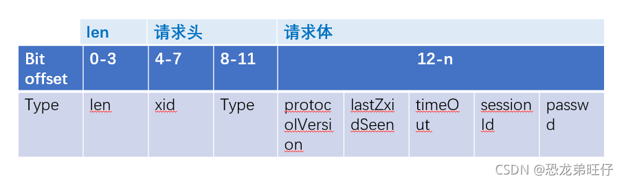
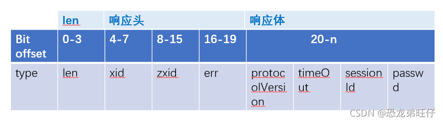
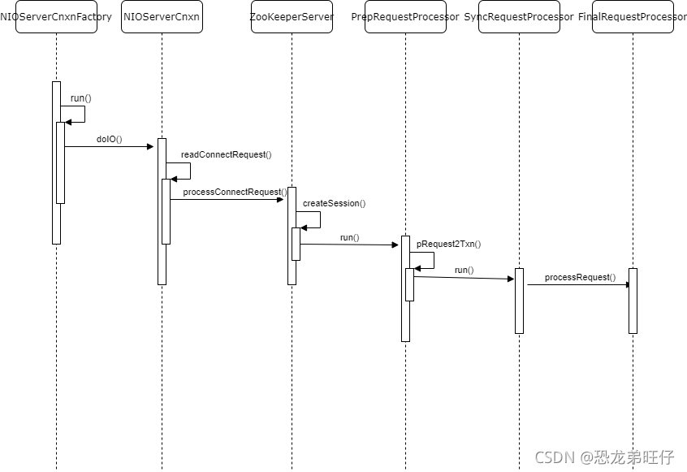

# zookeeperServer之创建session源码解析

本文主要就介绍下服务端[监听](https://so.csdn.net/so/search?q=监听&spm=1001.2101.3001.7020)到创建Session的请求后，如何进行处理。也就是如何解析ConnectRequest（如下图）



如何返回响应ConnectResponse（如下图）



前一篇文章分析QuorumPeerMain单机版服务端启动时，得知请求的监听都是通过NIOServerCnxnFactory来完成的。我们一起来看下其具体监听过程

## **1.Zookeeper server监听请求**

````java
public class NIOServerCnxnFactory extends ServerCnxnFactory implements Runnable {
	public void run() {
        while (!ss.socket().isClosed()) {
            try {
            	// 标志的NIO操作
                selector.select(1000);
                Set<SelectionKey> selected;
                synchronized (this) {
                    selected = selector.selectedKeys();
                }
                ArrayList<SelectionKey> selectedList = new ArrayList<SelectionKey>(
                        selected);
                Collections.shuffle(selectedList);
                for (SelectionKey k : selectedList) {
                    // 如果有连接进入，则进行处理，这里是本文分析的重点
                    if ((k.readyOps() & SelectionKey.OP_ACCEPT) != 0) {
                        SocketChannel sc = ((ServerSocketChannel) k
                                .channel()).accept();
                        InetAddress ia = sc.socket().getInetAddress();
                        int cnxncount = getClientCnxnCount(ia);
                        // 同一个客户端创建的连接不能超过maxClientCnxns
                        if (maxClientCnxns > 0 && cnxncount >= maxClientCnxns){
                            LOG.warn("Too many connections from " + ia
                                     + " - max is " + maxClientCnxns );
                            sc.close();
                        } else {
                            LOG.info("Accepted socket connection from "
                                     + sc.socket().getRemoteSocketAddress());
                            // 正常请求，注册读事件监听，并创建NIOServerCnxn连接对象，后续通过其来处理监听到的读写事件
                            sc.configureBlocking(false);
                            SelectionKey sk = sc.register(selector,
                                    SelectionKey.OP_READ);
                            NIOServerCnxn cnxn = createConnection(sc, sk);
                            sk.attach(cnxn);
                            addCnxn(cnxn);
                        }
                    } else if ((k.readyOps() & (SelectionKey.OP_READ | SelectionKey.OP_WRITE)) != 0) {
                        // 针对一个客户端连接，不只是OP_ACCEPT事件监听，还会发送一个ConnectRequest请求，这里会监听到该连接的OP_READ事件，进行doIO()处理
                        NIOServerCnxn c = (NIOServerCnxn) k.attachment();
                        c.doIO(k);
                    } else {
                        if (LOG.isDebugEnabled()) {
                            LOG.debug("Unexpected ops in select "
                                      + k.readyOps());
                        }
                    }
                }
                selected.clear();
            } catch (RuntimeException e) {
                LOG.warn("Ignoring unexpected runtime exception", e);
            } catch (Exception e) {
                LOG.warn("Ignoring exception", e);
            }
        }
        closeAll();
        LOG.info("NIOServerCnxn factory exited run method");
    }
}
````

之前熟悉过NIO的知识，这里对其的分析就不算困难，主要就是监听连接的OP_ACCEPT OP_READ事件

因为客户端创建Session并不是简单的一个OP_ACCEPT 三次握手，还需要发送ConnectRequest请求（OP_READ），验证完成之后才算连接成功，所以一次Session创建需要监听两种事件请求。

## **2.NIOServerCnxn.doIO() 处理ConnectRequest请求**本文重点就是这里，看Server端如何处理该请求

````java
public class NIOServerCnxn extends ServerCnxn {
	void doIO(SelectionKey k) throws InterruptedException {
        try {
            ...
            // 主要是这个readable事件
            if (k.isReadable()) {
                // 读取4字节数据，也就是ConnectRequest中的头4个字节 len字段
                int rc = sock.read(incomingBuffer);
                if (rc < 0) {
                    throw new EndOfStreamException(
                            "Unable to read additional data from client sessionid 0x"

   + Long.toHexString(sessionId)
     losed socket");
                     }
                     // 读取到完整的4字节
                     if (incomingBuffer.remaining() == 0) {
                         boolean isPayload;
                         // 默认第一次是相等的
                         if (incomingBuffer == lenBuffer) { // start of next request
                             incomingBuffer.flip();
                             // 读取到len对应的长度后，后面开始真正的读取len字节的数据
                             isPayload = readLength(k);
                             incomingBuffer.clear();
                         } else {
                             // continuation
                             isPayload = true;
                         }
                         if (isPayload) { // not the case for 4letterword
                             // 读取len字节的数据，2.1继续分析
                             readPayload();
                         }
                         else {
                             // four letter words take care
                             // need not do anything else
                             return;
                         }
                     }
                 }
                 if (k.isWritable()) {
                     ...

                synchronized(this.factory){
                    if (outgoingBuffers.size() == 0) {
                        if (!initialized
                                && (sk.interestOps() & SelectionKey.OP_READ) == 0) {
                            throw new CloseRequestException("responded to info probe");
                        }
                        sk.interestOps(sk.interestOps()
                                & (~SelectionKey.OP_WRITE));
                    } else {
                        sk.interestOps(sk.interestOps()
                                | SelectionKey.OP_WRITE);
                    }
                }
            }
        } ...
    }

}
````

### **2.1 NIOServerCnxn.readPayload() 读取客户端请求**

````java
public class NIOServerCnxn extends ServerCnxn {
	private void readPayload() throws IOException, InterruptedException {
        if (incomingBuffer.remaining() != 0) { // have we read length bytes?
            int rc = sock.read(incomingBuffer); // sock is non-blocking, so ok
            if (rc < 0) {
                throw new EndOfStreamException(
                        "Unable to read additional data from client sessionid 0x"

   + Long.toHexString(sessionId)
     as closed socket");
                 }
             }

        // remaining()==0，说明已经读取到len个字节，数据已经全部读取到
        if (incomingBuffer.remaining() == 0) { // have we read length bytes?
            packetReceived();
            incomingBuffer.flip();
            // 如果initialized初始化状态为false，说明是第一次请求，那么这个请求就是创建Session的请求
            if (!initialized) {
                // 本文主要分析该方法
                readConnectRequest();
            } else {
                // 其他请求的处理，后续我们专门分析
                readRequest();
            }
            lenBuffer.clear();
            incomingBuffer = lenBuffer;
        }
    }

}
````

### 2.2 NIOServerCnxn.readConnectRequest() 处理Session创建请求
````java
public class NIOServerCnxn extends ServerCnxn {
	private void readConnectRequest() throws IOException, InterruptedException {
        if (!isZKServerRunning()) {
            throw new IOException("ZooKeeperServer not running");
        }
        zkServer.processConnectRequest(this, incomingBuffer);
        initialized = true;
    }
}
2.3 ZooKeeperServer.processConnectRequest 
public class ZooKeeperServer implements SessionExpirer, ServerStats.Provider {
	public void processConnectRequest(ServerCnxn cnxn, ByteBuffer incomingBuffer) throws IOException {
        BinaryInputArchive bia = BinaryInputArchive.getArchive(new ByteBufferInputStream(incomingBuffer));
        ConnectRequest connReq = new ConnectRequest();
        connReq.deserialize(bia, "connect");
        if (LOG.isDebugEnabled()) {
            LOG.debug("Session establishment request from client "

   + cnxn.getRemoteSocketAddress()
     tZxid is 0x"

        + Long.toHexString(connReq.getLastZxidSeen()));

          ​        ...
          ​        // 如果请求的lastZXID 大于 server端的最新的ZXID，说明客户端请求异常    
          ​        if (connReq.getLastZxidSeen() > zkDb.dataTree.lastProcessedZxid) {
          ​            String msg = "Refusing session request for client "

             + cnxn.getRemoteSocketAddress()
               s seen zxid 0x"
                  + Long.toHexString(connReq.getLastZxidSeen())
                     zxid is 0x"
                       + Long.toHexString(getZKDatabase().getDataTreeLastProcessedZxid())
                         ust try another server";

            LOG.info(msg);
            throw new CloseRequestException(msg);
        }
        // 与服务端协商session超时时间，需要介于minSessionTimeout 和 maxSessionTimeout之间
        int sessionTimeout = connReq.getTimeOut();
        byte passwd[] = connReq.getPasswd();
        int minSessionTimeout = getMinSessionTimeout();
        if (sessionTimeout < minSessionTimeout) {
            sessionTimeout = minSessionTimeout;
        }
        int maxSessionTimeout = getMaxSessionTimeout();
        if (sessionTimeout > maxSessionTimeout) {
            sessionTimeout = maxSessionTimeout;
        }
        cnxn.setSessionTimeout(sessionTimeout);
        // We don't want to receive any packets until we are sure that the
        // session is setup
        cnxn.disableRecv();
        long sessionId = connReq.getSessionId();
        // 如果客户端是首次连接，那么sessionId未分配过，则默认为0，如果不是0，说明之前已经分配过
        // 但由于某种原因，又断开重连了，所以服务端针对这种连接会重新打开对应的session
        if (sessionId != 0) {
            long clientSessionId = connReq.getSessionId();
            LOG.info("Client attempting to renew session 0x"
                    + Long.toHexString(clientSessionId)
                    + " at " + cnxn.getRemoteSocketAddress());
            serverCnxnFactory.closeSession(sessionId);
            cnxn.setSessionId(sessionId);
            // 重新打开对应的session
            reopenSession(cnxn, sessionId, passwd, sessionTimeout);
        } else {
            LOG.info("Client attempting to establish new session at "
                    + cnxn.getRemoteSocketAddress());
            // 首次连接，需要创建Session
            createSession(cnxn, passwd, sessionTimeout);
        }
    }

}
````


### 2.4 ZooKeeperServer.createSession() 创建Session
````java
public class ZooKeeperServer implements SessionExpirer, ServerStats.Provider {
	long createSession(ServerCnxn cnxn, byte passwd[], int timeout) {
        // 通过SessionTracker直接创建sessionId，递增
        long sessionId = sessionTracker.createSession(timeout);
        // 密码的创建
        Random r = new Random(sessionId ^ superSecret);
        r.nextBytes(passwd);
        ByteBuffer to = ByteBuffer.allocate(4);
        to.putInt(timeout);
        cnxn.setSessionId(sessionId);
        // 重点在这个方法
        submitRequest(cnxn, sessionId, OpCode.createSession, 0, to, null);
        return sessionId;
    }
    

    // 提交请求
    public void submitRequest(Request si) {
        ...
        try {
            touch(si.cnxn);
            boolean validpacket = Request.isValid(si.type);
            if (validpacket) {
                // 请求交由Processor相关处理类处理
                firstProcessor.processRequest(si);
                if (si.cnxn != null) {
                    incInProcess();
                }
            } else {
                LOG.warn("Received packet at server of unknown type " + si.type);
                new UnimplementedRequestProcessor().processRequest(si);
            }
        } ...
    }
}
````

这里的firstProcessor，我们在前文中见过，也就是ZooKeeperServer.startup()方法中

````java
public class ZooKeeperServer implements SessionExpirer, ServerStats.Provider {
	protected void setupRequestProcessors() {
        RequestProcessor finalProcessor = new FinalRequestProcessor(this);
        RequestProcessor syncProcessor = new SyncRequestProcessor(this,
                finalProcessor);
        ((SyncRequestProcessor)syncProcessor).start();
        firstProcessor = new PrepRequestProcessor(this, syncProcessor);
        ((PrepRequestProcessor)firstProcessor).start();
    }
}
````

**可以看出这三个processor的处理顺序为 PrepRequestProcessor --> SyncRequestProcessor --> FinalRequestProcessor**

所以最终交由PrepRequestProcessor 来处理Request

### 3.RequestProcessor相关类处理创建Session请求

### 3.1 PrepRequestProcessor 

````java
public class PrepRequestProcessor extends ZooKeeperCriticalThread implements RequestProcessor {
	public void run() {
        try {
            while (true) {
                Request request = submittedRequests.take();
                long traceMask = ZooTrace.CLIENT_REQUEST_TRACE_MASK;
                if (request.type == OpCode.ping) {
                    traceMask = ZooTrace.CLIENT_PING_TRACE_MASK;
                }
                if (LOG.isTraceEnabled()) {
                    ZooTrace.logRequest(LOG, traceMask, 'P', request, "");
                }
                if (Request.requestOfDeath == request) {
                    break;
                }
                // 直接调用pRequest()方法
                pRequest(request);
            }
        } ...
    }
    

    protected void pRequest(Request request) throws RequestProcessorException {
        // LOG.info("Prep>>> cxid = " + request.cxid + " type = " +
        // request.type + " id = 0x" + Long.toHexString(request.sessionId));
        request.hdr = null;
        request.txn = null;
        
        try {
            switch (request.type) {
                case OpCode.create:
                // 创建CreateRequest对象，直接调用pRequest2Txn处理
                CreateRequest createRequest = new CreateRequest();
                pRequest2Txn(request.type, zks.getNextZxid(), request, createRequest, true);
                break;
            }
            ...
        }
    }
    
    protected void pRequest2Txn(int type, long zxid, Request request, Record record, boolean deserialize)
        throws KeeperException, IOException, RequestProcessorException
    {
        // server端拼装request请求，对于client端而言也就是响应response
        request.hdr = new TxnHeader(request.sessionId, request.cxid, zxid,
                                    Time.currentWallTime(), type);
     
        switch (type) {
            case OpCode.createSession:
                // 拼装request信息
                request.request.rewind();
                int to = request.request.getInt();
                request.txn = new CreateSessionTxn(to);
                request.request.rewind();
                zks.sessionTracker.addSession(request.sessionId, to);
                zks.setOwner(request.sessionId, request.getOwner());
                break;
        }
        
        request.zxid = zks.getZxid();
        // 拼装好的request对象交由SyncRequestProcessor 处理
        nextProcessor.processRequest(request);
    }

}
````


### 3.2 SyncRequestProcessor.processRequest()
````java
public class SyncRequestProcessor extends ZooKeeperCriticalThread implements RequestProcessor {
    private final LinkedBlockingQueue<Request> queuedRequests =
        new LinkedBlockingQueue<Request>();
    

    // 只是将request添加到queue中，真正的操作由run()方法执行
    public void processRequest(Request request) {
        // request.addRQRec(">sync");
        queuedRequests.add(request);
    }
    
    public void run() {
        try {
            int logCount = 0;
     
            setRandRoll(r.nextInt(snapCount/2));
            while (true) {
                Request si = null;
                if (toFlush.isEmpty()) {
                    si = queuedRequests.take();
                } else {
                    si = queuedRequests.poll();
                    if (si == null) {
                        flush(toFlush);
                        continue;
                    }
                }
                if (si == requestOfDeath) {
                    break;
                }
                // 有关于snapshotLog细节，后续专门来讲解下，这里只要知道后面请求交由FinalRequestProcessor处理即可
                if (si != null) {
                    // track the number of records written to the log
                    if (zks.getZKDatabase().append(si)) {
                        logCount++;
                        if (logCount > (snapCount / 2 + randRoll)) {
                            setRandRoll(r.nextInt(snapCount/2));
                            // roll the log
                            zks.getZKDatabase().rollLog();
                            // take a snapshot
                            if (snapInProcess != null && snapInProcess.isAlive()) {
                                LOG.warn("Too busy to snap, skipping");
                            } else {
                                snapInProcess = new ZooKeeperThread("Snapshot Thread") {
                                        public void run() {
                                            try {
                                                zks.takeSnapshot();
                                            } catch(Exception e) {
                                                LOG.warn("Unexpected exception", e);
                                            }
                                        }
                                    };
                                snapInProcess.start();
                            }
                            logCount = 0;
                        }
                    } else if (toFlush.isEmpty()) {
                        // optimization for read heavy workloads
                        // iff this is a read, and there are no pending
                        // flushes (writes), then just pass this to the next
                        // processor
                        if (nextProcessor != null) {
                            nextProcessor.processRequest(si);
                            if (nextProcessor instanceof Flushable) {
                                ((Flushable)nextProcessor).flush();
                            }
                        }
                        continue;
                    }
                    toFlush.add(si);
                    if (toFlush.size() > 1000) {
                        flush(toFlush);
                    }
                }
            }
        } catch (Throwable t) {
            handleException(this.getName(), t);
            running = false;
        }
        LOG.info("SyncRequestProcessor exited!");
    }

}
````


### 3.3 FinalRequestProcessor.processRequest()
````java
public class FinalRequestProcessor implements RequestProcessor {
    public void processRequest(Request request) {
        ...
		switch (request.type) {
          case OpCode.createSession: {
                zks.serverStats().updateLatency(request.createTime);

                lastOp = "SESS";
              	// 修改连接的stat信息
                cnxn.updateStatsForResponse(request.cxid, request.zxid, lastOp,
                        request.createTime, Time.currentElapsedTime());
     
              	// 将ConnectResponse发送回去
                zks.finishSessionInit(request.cnxn, true);
                return;
            }      
        }
    }

}
````

有关于RequestProcessor的相关说明比较简略，本文的主流程不是他们，所以一笔带过，后面我们会专门来说明下这三个Processor的相关处理。

在这里我们只需要知道，通过Processor最终将ConnectResponse返回到client端即可。

总结：
从NIOServerCnxn.doIo()处理客户端相关事件开始，Session的创建分为重用已有的、创建新的；

ConnectResponse的主要参数：

    sessionId是由服务端递增出来的；
    
    timeout是由客户端与服务端共同协商出来的，处于minSessionTimeout 和 maxSessionTimeout之间；

最终ConnectResponse交由FinalRequestProcessor发送出去。

老规矩，最后时序图总结下整个过程



> 摘自： https://blog.csdn.net/qq_26323323/article/details/120884040