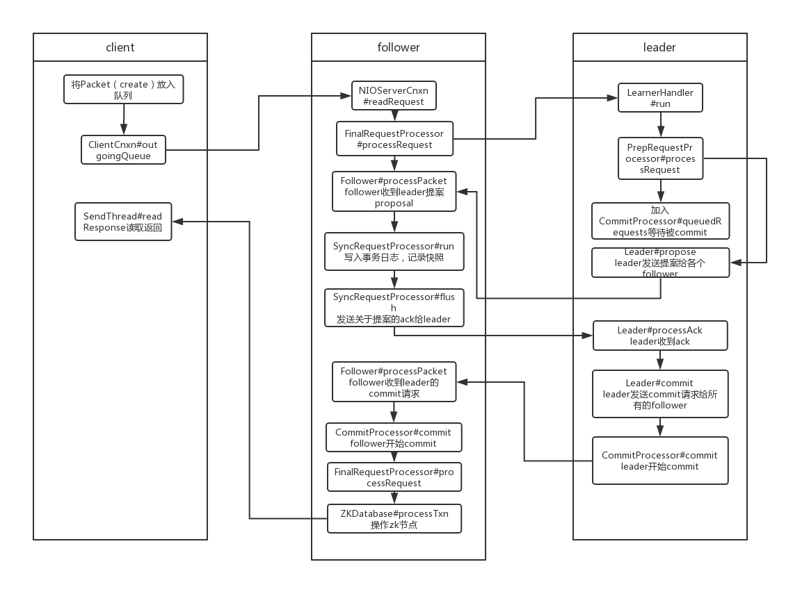
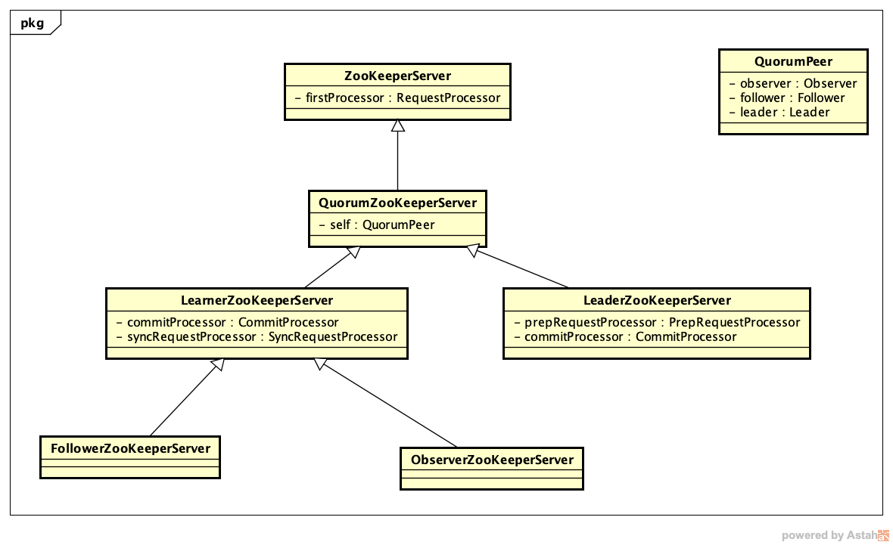
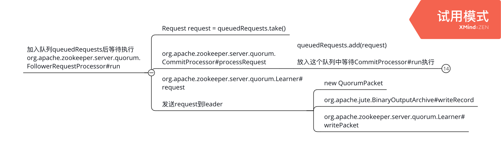
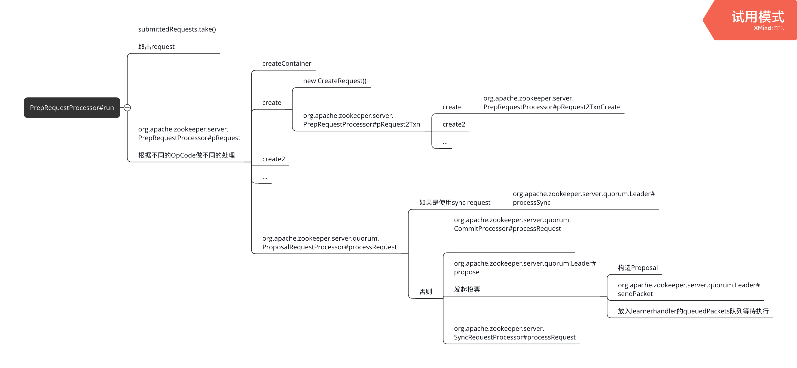
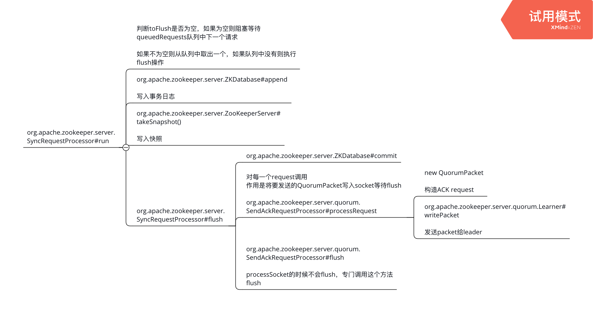
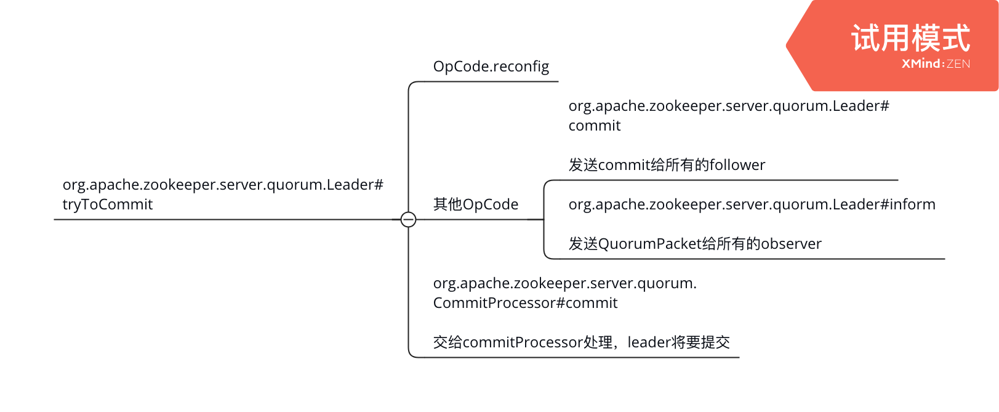
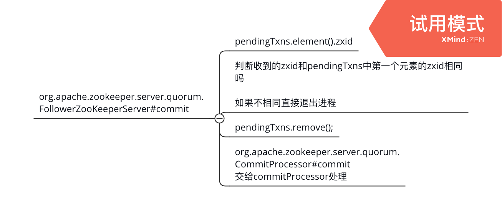

# zookeeperServer之处理写请求

## 目录

- 处理写请求总体过程
- 客户端发起写请求
- follower和leader交互过程
- follower发送请求给客户端

## 处理写请求总体过程

zk为了保证分布式数据一致性，使用ZAB协议，在客户端发起一次写请求的时候时候，假设该请求请求到的是follower，follower不会直接处理这个请求，而是转发给leader，由leader发起投票决定该请求最终能否执行成功，所以整个过程client、被请求的follower、leader、其他follower都参与其中。以创建一个节点为例，总体流程如下：



从图中可以看出，创建流程为

1. follower接受请求，解析请求
2. follower通过FollowerRequestProcessor将请求转发给leader
3. leader接收请求
4. leader发送proposal给follower
5. follower收到请求记录txlog、snapshot
6. follower发送ack给leader
7. leader收到ack后进行commit，并且通知所有的learner，发送commit packet给所有的learner

这里说的follower、leader都是server，在zk里面server总共有这么几种



由于server角色不同，对于请求所做的处理不同，每种server包含的processor也不同，下面细说下具体有哪些processor。

### follower的processor链

这里的follower是FollowerZooKeeperServer，通过setupRequestProcessors来设置自己的processor链

```java
FollowerRequestProcessor -> CommitProcessor ->FinalRequestProcessor
```

每个processor对应的功能为:

#### FollowerRequestProcessor：

作用：将请求先转发给下一个processor，然后根据不同的OpCode做不同的操作

如果是：sync，先加入org.apache.zookeeper.server.quorum.FollowerZooKeeperServer#pendingSyncs，然后发送给leader

如果是：create等，直接转发

如果是：createSession或者closeSession，如果不是localsession则转发给leader

#### CommitProcessor ：

有一个WorkerService，将请求封装为CommitWorkRequest执行

作用：

转发请求，读请求直接转发给下一个processor

写请求先放在pendingRequests对应的sessionId下的list中，收到leader返回的commitRequest再处理

1. 处理读请求（不会改变服务器状态的请求）
2. 处理committed的写请求（经过leader 处理完成的请求）

维护一个线程池服务WorkerService，每个请求都在单独的线程中处理

1. 每个session的请求必须按顺序执行
2. 写请求必须按照zxid顺序执行
3. 确认一个session中写请求之间没有竞争

#### FinalRequestProcessor：

总是processor chain上最后一个processor

作用：

1. 实际处理事务请求的processor
2. 处理query请求
3. 返回response给客户端

#### SyncRequestProcessor：

作用：

1. 接收leader的proposal进行处理
2. 从org.apache.zookeeper.server.SyncRequestProcessor#queuedRequests中取出请求记录txlog和snapshot
3. 然后加入toFlush，从toFlush中取出请求交给org.apache.zookeeper.server.quorum.SendAckRequestProcessor#flush处理

### leader的processor链

这里的leader就是LeaderZooKeeperServer

通过setupRequestProcessors来设置自己的processor链

```java
PrepRequestProcessor -> ProposalRequestProcessor ->CommitProcessor -> Leader.ToBeAppliedRequestProcessor ->FinalRequestProcessor
```

## 客户端发起写请求

在客户端启动的时候会创建Zookeeper实例，client会连接到server，后面client在创建节点的时候就可以直接和server通信，client发起创建创建节点请求的过程是：

```java
org.apache.zookeeper.ZooKeeper#create(java.lang.String, byte[], java.util.List<org.apache.zookeeper.data.ACL>, org.apache.zookeeper.CreateMode)
org.apache.zookeeper.ClientCnxn#submitRequest
org.apache.zookeeper.ClientCnxn#queuePacket
```

1. 在`ZooKeeper#create`方法中构造请求的request

2. 在

   ```
   ClientCnxn#queuePacket
   ```

   方法中将request封装到packet中，将packet放入发送队列outgoingQueue中等待发送

   1. SendThread不断从发送队列outgoingQueue中取出packet发送

3. 通过 packet.wait等待server返回

## follower和leader交互过程

client发出请求后，follower会接收并处理该请求。选举结束后follower确定了自己的角色为follower，一个端口和client通信，一个端口和leader通信。监听到来自client的连接口建立新的session，监听对应的socket上的读写事件，如果client有请求发到follower，follower会用下面的方法处理

```java
org.apache.zookeeper.server.NIOServerCnxn#readPayload
org.apache.zookeeper.server.NIOServerCnxn#readRequest
```

readPayload这个方法里面会判断是连接请求还是非连接请求，连接请求在之前session建立的文章中介绍过，这里从处理非连接请求开始。

### follower接收client请求

follower收到请求之后，先请求请求的opCode类型（这里是create）构造对应的request，然后交给第一个processor执行，follower的第一个processor是FollowerRequestProcessor.

### follower转发请求给leader

由于在zk中follower是不能处理写请求的，需要转交给leader处理，在FollowerRequestProcessor中将请求转发给leader，转发请求的调用堆栈是

```java
serialize(OutputArchive, String):82, QuorumPacket (org.apache.zookeeper.server.quorum), QuorumPacket.java
writeRecord(Record, String):123, BinaryOutputArchive (org.apache.jute), BinaryOutputArchive.java
writePacket(QuorumPacket, boolean):139, Learner (org.apache.zookeeper.server.quorum), Learner.java
request(Request):191, Learner (org.apache.zookeeper.server.quorum), Learner.java
run():96, FollowerRequestProcessor (org.apache.zookeeper.server.quorum), FollowerRequestProcessor.java
```

FollowerRequestProcessor是一个线程在zk启动的时候就开始运行，主要逻辑在run方法里面，run方法的主要逻辑是



先把请求提交给CommitProcessor（后面leader发送给follower的commit请求对应到这里），然后将请求转发给leader，转发给leader的过程就是构造一个QuorumPacket，通过之前选举通信的端口发送给leader。

### leader接收follower请求

leader获取leader地位以后，启动learnhandler，然后一直在LearnerHandler#run循环，接收来自learner的packet，处理流程是：

```java
processRequest(Request):1003, org.apache.zookeeper.server.PrepRequestProcessor.java
submitLearnerRequest(Request):150, org.apache.zookeeper.server.quorum.LeaderZooKeeperServer.java
run():625, org.apache.zookeeper.server.quorum.LearnerHandler.java
```

handler判断是REQUEST请求的话交给leader的processor链处理，将请求放入org.apache.zookeeper.server.PrepRequestProcessor#submittedRequests，即leader的第一个processor。这个processor也是一个线程，从submittedRequests中不断拿出请求处理



processor主要做了：

1. 交给CommitProcessor等待提交
2. 交给leader的下一个processor处理：ProposalRequestProcessor

### leader 发送proposal给follower

ProposalRequestProcessor主要作用就是讲请求交给下一个processor并且发起投票，将proposal发送给所有的follower。

```java
// org.apache.zookeeper.server.quorum.Leader#sendPacket
void sendPacket(QuorumPacket qp) {
    synchronized (forwardingFollowers) {
        // 所有的follower，observer没有投票权
        for (LearnerHandler f : forwardingFollowers) {
            f.queuePacket(qp);
        }
    }
}
```

### follower 收到proposal

follower处理proposal请求的调用堆栈

```java
processRequest(Request):214, org.apache.zookeeper.server.SyncRequestProcessor.java
logRequest(TxnHeader, Record):89, org.apache.zookeeper.server.quorumFollowerZooKeeperServer.java
processPacket(QuorumPacket):147, org.apache.zookeeper.server.quorum.Follower.java
followLeader():102, org.apache.zookeeper.server.quorum.Follower.java
run():1199, org.apache.zookeeper.server.quorum.QuorumPeer.java
```

将请求放入org.apache.zookeeper.server.SyncRequestProcessor#queuedRequests

### follower 发送ack

线程SyncRequestProcessor#run从org.apache.zookeeper.server.SyncRequestProcessor#toFlush中取出请求flush，处理过程



1. follower开始commit，记录txLog和snapShot
2. 发送commit成功请求给leader，也就是follower给leader的ACK

### leader收到ack

leader 收到ack后判断是否收到大多数的follower的ack，如果是说明可以commit，commit后同步给follower



### follower收到commit

还是Follower#followLeader里面的while循环收到leader的commit请求后，调用下面的方法处理

org.apache.zookeeper.server.quorum.FollowerZooKeeperServer#commit



最终加入CommitProcessor.committedRequests队列，CommitProcessor主线程发现队列不空表明需要把这个request转发到下一个processor

### follower发送请求给客户端

follower的最后一个processor是FinalRequestProcessor，最后会创建对应的节点并且构造response返回给client

## 总结

本篇文章主要介绍了client发起一次写请求，client、follower和leader各自的处理过程。当然了，为了简单，其中设定了一些具体的场景，比如请求是发送到follower的而不是leader。

> 摘自： https://www.cnblogs.com/sunshine-2015/p/10977200.html