# Zookeeper之ZAB协议实现源码分析

## 前言

- Zookeeper特性与节点说明
- Zookeeper客户端使用与集群原理
- Zookeeper典型使用场景实践

本篇重点深入了解ZAB协议以及源码实现的解析。

**Zookeeper ZAB协议**
**什么是Zab协议？**
Zab协议的全称是 Zookeeper Atomic Broadcast （Zookeeper原子广播）。

Zookeeper 是通过 Zab 协议来保证分布式事务的最终一致性。

1.Zab协议是为分布式协调服务Zookeeper专门设计的一种 支持崩溃恢复 的 原子广播协议 ，是Zookeeper保证数据一致性的核心算法。Zab借鉴了Paxos算法，但又不像Paxos那样，是一种通用的分布式一致性算法。它是特别为Zookeeper设计的支持崩溃恢复的原子广播协议。
2.在Zookeeper中主要依赖Zab协议来实现数据一致性，基于该协议，zk实现了一种主备模型（即Leader和Follower模型）的系统架构来保证集群中各个副本之间数据的一致性。这里的主备系统架构模型，就是指只有一台客户端（Leader）负责处理外部的写事务请求，然后Leader客户端将数据同步到其他Follower节点。
Zookeeper 客户端会随机的链接到 zookeeper 集群中的一个节点，如果是读请求，就直接从当前节点中读取数据；如果是写请求，那么节点就会向 Leader 提交事务，Leader 接收到事务提交，会广播该事务，只要超过半数节点写入成功，该事务就会被提交。

**Zab 协议实现的作用**
1.使用一个单一的主进程（Leader）来接收并处理客户端的事务请求（也就是写请求），并采用了Zab的原子广播协议，将服务器数据的状态变更以 事务proposal （事务提议）的形式广播到所有的副本（Follower）进程上去。
2.保证一个全局的变更序列被顺序引用
Zookeeper是一个树形结构，很多操作都要先检查才能确定是否可以执行，比如P1的事务t1可能是创建节点"/a"，t2可能是创建节点"/a/bb"，只有先创建了父节点"/a"，才能创建子节点"/a/b"。

为了保证这一点，Zab要保证同一个Leader发起的事务要按顺序被apply，同时还要保证只有先前Leader的事务被apply之后，新选举出来的Leader才能再次发起事务。

3.当主进程出现异常的时候，整个zk集群依旧能正常工作。
**Zab协议原理**
Zab协议要求每个 Leader 都要经历三个阶段：发现，同步，广播。

- **发现：**要求zookeeper集群必须选举出一个 Leader 进程，同时 Leader 会维护一个 Follower 可用客户端列表。将来客户端可以和这些 Follower节点进行通信。
- **同步：**Leader 要负责将本身的数据与 Follower 完成同步，做到多副本存储。这样也是体现了CAP中的高可用和分区容错。Follower将队列中未处理完的请求消费完成后，写入本地事务日志中。
- **广播：**Leader 可以接收客户端新的事务Proposal请求，将新的Proposal请求广播给所有的 Follower。

**Zab协议核心**
Zab协议的核心：定义了事务请求的处理方式

1.所有的事务请求必须由一个全局唯一的服务器来协调处理，这样的服务器被叫做 Leader服务器。其他剩余的服务器则是 Follower服务器。
2.Leader服务器 负责将一个客户端事务请求，转换成一个 事务Proposal，并将该 Proposal 分发给集群中所有的 Follower 服务器，也就是向所有 Follower 节点发送数据广播请求（或数据复制）
分发之后Leader服务器需要等待所有Follower服务器的反馈（Ack请求），在Zab协议中，只要超过半数的Follower服务器进行了正确的反馈后（也就是收到半数以上的Follower的Ack请求），那么 3.Leader 就会再次向所有的 Follower服务器发送 Commit 消息，要求其将上一个 事务proposal 进行提交。

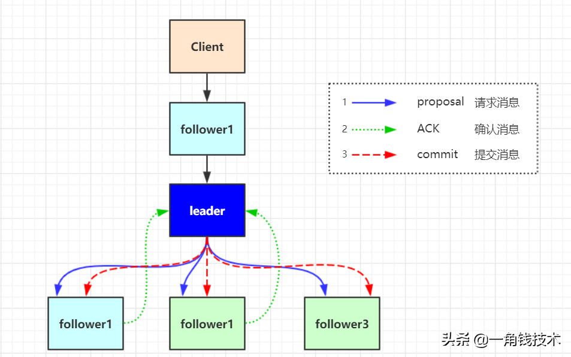

**Zab协议内容**
Zab 协议包括两种基本的模式：崩溃恢复 和 消息广播

**协议过程**
当整个集群启动过程中，或者当 Leader 服务器出现网络中弄断、崩溃退出或重启等异常时，Zab协议就会 进入崩溃恢复模式，选举产生新的Leader。

当选举产生了新的 Leader，同时集群中有过半的机器与该 Leader 服务器完成了状态同步（即数据同步）之后，Zab协议就会退出崩溃恢复模式，进入消息广播模式。

这时，如果有一台遵守Zab协议的服务器加入集群，因为此时集群中已经存在一个Leader服务器在广播消息，那么该新加入的服务器自动进入恢复模式：找到Leader服务器，并且完成数据同步。同步完成后，作为新的Follower一起参与到消息广播流程中。

**协议状态切换**
当Leader出现崩溃退出或者机器重启，亦或是集群中不存在超过半数的服务器与Leader保存正常通信，Zab就会再一次进入崩溃恢复，发起新一轮Leader选举并实现数据同步。同步完成后又会进入消息广播模式，接收事务请求。

**保证消息有序**
在整个消息广播中，Leader会将每一个事务请求转换成对应的 proposal 来进行广播，并且在广播 事务Proposal 之前，Leader服务器会首先为这个事务Proposal分配一个全局单递增的唯一ID，称之为事务ID（即zxid），由于Zab协议需要保证每一个消息的严格的顺序关系，因此必须将每一个proposal按照其zxid的先后顺序进行排序和处理。

**消息广播**
在zookeeper集群中，数据副本的传递策略就是采用消息广播模式。zookeeper中数据副本的同步方式与二段提交相似，但是却又不同。二段提交要求协调者必须等到所有的参与者全部反馈ACK确认消息后，再发送commit消息。要求所有的参与者要么全部成功，要么全部失败。二段提交会产生严重的阻塞问题。
Zab协议中 Leader 等待 Follower 的ACK反馈消息是指“只要半数以上的Follower成功反馈即可，不需要收到全部Follower反馈”

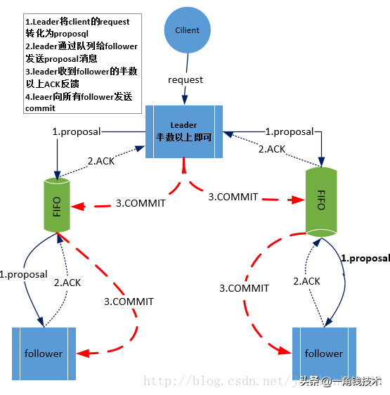

**消息广播具体步骤**

 

1. 客户端发起一个写操作请求。
2. Leader 服务器将客户端的请求转化为事务 Proposal 提案，同时为每个 Proposal 分配一个全局的ID，即zxid。
3. Leader 服务器为每个 Follower 服务器分配一个单独的队列，然后将需要广播的 Proposal 依次放到队列中去，并且根据 FIFO 策略进行消息发送。
4. Follower 接收到 Proposal 后，会首先将其以事务日志的方式写入本地磁盘中，写入成功后向 Leader 反馈一个 Ack 响应消息。
5. Leader 接收到超过半数以上 Follower 的 Ack 响应消息后，即认为消息发送成功，可以发送 commit 消息。
6. Leader 向所有 Follower 广播 commit 消息，同时自身也会完成事务提交。Follower 接收到 commit 消息后，会将上一条事务提交。

zookeeper 采用 Zab 协议的核心，就是只要有一台服务器提交了 Proposal，就要确保所有的服务器最终都能正确提交 Proposal。这也是 CAP/BASE 实现最终一致性的一个体现。

Leader 服务器与每一个 Follower 服务器之间都维护了一个单独的 FIFO 消息队列进行收发消息，使用队列消息可以做到异步解耦。 Leader 和 Follower 之间只需要往队列中发消息即可。如果使用同步的方式会引起阻塞，性能要下降很多。

**崩溃恢复**
一旦 Leader 服务器出现崩溃或者由于网络原因导致 Leader 服务器失去了与过半 Follower 的联系，那么就会进入崩溃恢复模式。

在 Zab 协议中，为了保证程序的正确运行，整个恢复过程结束后需要选举出一个新的 Leader 服务器。因此 Zab 协议需要一个高效且可靠的 Leader 选举算法，从而确保能够快速选举出新的 Leader 。

Leader 选举算法不仅仅需要让 Leader 自己知道自己已经被选举为 Leader ，同时还需要让集群中的所有其他机器也能够快速感知到选举产生的新 Leader 服务器。

崩溃恢复主要包括两部分：Leader选举 和 数据恢复

**Zab 协议如何保证数据一致性**
假设两种异常情况：

1.一个事务在 Leader 上提交了，并且过半的 Folower 都响应 Ack 了，但是 Leader 在 Commit 消息发出之前挂了。
2.假设一个事务在 Leader 提出之后，Leader 挂了。
要确保如果发生上述两种情况，数据还能保持一致性，那么 Zab 协议选举算法必须满足以下要求：

Zab 协议崩溃恢复要求满足以下两个要求：

1.确保已经被 Leader 提交的 Proposal 必须最终被所有的 Follower 服务器提交。
2.确保丢弃已经被 Leader 提出的但是没有被提交的 Proposal。
根据上述要求 Zab协议需要保证选举出来的Leader需要满足以下条件：

1.新选举出来的 Leader 不能包含未提交的 Proposal 。
即新选举的 Leader 必须都是已经提交了 Proposal 的 Follower 服务器节点。

2.新选举的 Leader 节点中含有最大的 zxid 。
这样做的好处是可以避免 Leader 服务器检查 Proposal 的提交和丢弃工作。

**Zab 如何数据同步**
1.完成 Leader 选举后（新的 Leader 具有最高的zxid），在正式开始工作之前（接收事务请求，然后提出新的 Proposal），Leader 服务器会首先确认事务日志中的所有的 Proposal 是否已经被集群中过半的服务器 Commit。
2.Leader 服务器需要确保所有的 Follower 服务器能够接收到每一条事务的 Proposal ，并且能将所有已经提交的事务 Proposal 应用到内存数据中。等到 Follower 将所有尚未同步的事务 Proposal 都从 Leader 服务器上同步过啦并且应用到内存数据中以后，Leader 才会把该 Follower 加入到真正可用的 Follower 列表中。
**Zab 数据同步过程中，如何处理需要丢弃的 Proposal**
在 Zab 的事务编号 zxid 设计中，zxid是一个64位的数字。

其中低32位可以看成一个简单的单增计数器，针对客户端每一个事务请求，Leader 在产生新的 Proposal 事务时，都会对该计数器加1。而高32位则代表了 Leader 周期的 epoch 编号。

epoch 编号可以理解为当前集群所处的年代，或者周期。每次Leader变更之后都会在 epoch 的基础上加1，这样旧的 Leader 崩溃恢复之后，其他Follower 也不会听它的了，因为 Follower 只服从epoch最高的 Leader 命令。

每当选举产生一个新的 Leader ，就会从这个 Leader 服务器上取出本地事务日志最大编号 Proposal 的 zxid，并从 zxid 中解析得到对应的 epoch 编号，然后再对其加1，之后该编号就作为新的 epoch 值，并将低32位数字归零，由0开始重新生成zxid。

Zab 协议通过 epoch 编号来区分 Leader 变化周期，能够有效避免不同的 Leader 错误的使用了相同的 zxid 编号提出了不一样的 Proposal 的异常情况。

基于以上策略： 当一个包含了上一个 Leader 周期中尚未提交过的事务 Proposal 的服务器启动时，当这台机器加入集群中，以 Follower 角色连上 Leader 服务器后，Leader 服务器会根据自己服务器上最后提交的 Proposal 来和 Follower 服务器的 Proposal 进行比对，比对的结果肯定是 Leader 要求 Follower 进行一个回退操作，回退到一个确实已经被集群中过半机器 Commit 的最新 Proposal。

**Zab实现原理**
**Zab 节点有三种状态**

- Following：当前节点是跟随者，服从 Leader 节点的命令。
- Leading：当前节点是 Leader，负责协调事务。
- Election/Looking：节点处于选举状态，正在寻找 Leader。

代码实现中，多了一种状态：Observing 状态 这是 Zookeeper 引入 Observer 之后加入的，Observer 不参与选举，是只读节点，跟 Zab 协议没有关系。

**节点的持久状态**

- history：当前节点接收到事务 Proposal 的Log
- acceptedEpoch：Follower 已经接收的 Leader 更改 epoch 的 newEpoch 提议。
- currentEpoch：当前所处的 Leader 年代
- lastZxid：history 中最近接收到的Proposal 的 zxid（最大zxid）

**Zab 的四个阶段**
**1.选举阶段（Leader Election）**
节点在一开始都处于选举节点，只要有一个节点得到超过半数节点的票数，它就可以当选准 Leader，只有到达第三个阶段（也就是同步阶段），这个准 Leader 才会成为真正的 Leader。

Zookeeper 规定所有有效的投票都必须在同一个 轮次 中，每个服务器在开始新一轮投票时，都会对自己维护的 logicalClock 进行自增操作。

每个服务器在广播自己的选票前，会将自己的投票箱（recvset）清空。该投票箱记录了所收到的选票。

例如：Server_2 投票给 Server_3，Server_3 投票给 Server_1，则Server_1的投票箱为(2,3)、(3,1)、(1,1)。（每个服务器都会默认给自己投票）

前一个数字表示投票者，后一个数字表示被选举者。票箱中只会记录每一个投票者的最后一次投票记录，如果投票者更新自己的选票，则其他服务器收到该新选票后会在自己的票箱中更新该服务器的选票。

这一阶段的目的就是为了选出一个准 Leader ，然后进入下一个阶段。

协议并没有规定详细的选举算法，后面会提到实现中使用的 Fast Leader Election。

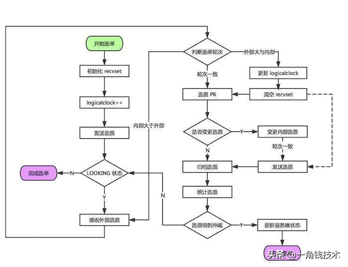

**2.发现阶段（Descovery）**
在这个阶段，Followers 和上一轮选举出的准 Leader 进行通信，同步 Followers 最近接收的事务 Proposal 。

一个 Follower 只会连接一个 Leader，如果一个 Follower 节点认为另一个 Follower 节点，则会在尝试连接时被拒绝。被拒绝之后，该节点就会进入 Leader Election阶段。

这个阶段的主要目的是发现当前大多数节点接收的最新 Proposal，并且准 Leader 生成新的 epoch ，让 Followers 接收，更新它们的 acceptedEpoch。

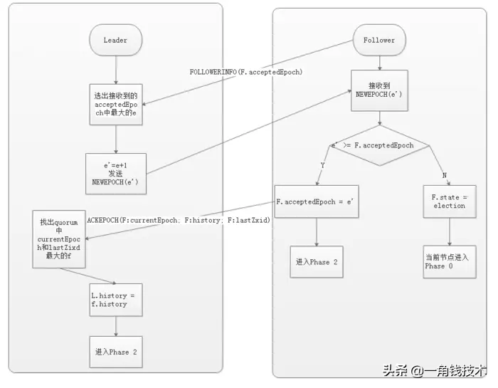

**3.同步阶段（Synchronization）**
同步阶段主要是利用 Leader 前一阶段获得的最新 Proposal 历史，同步集群中所有的副本。

只有当 quorum（超过半数的节点） 都同步完成，准 Leader 才会成为真正的 Leader。Follower 只会接受 zxid 比自己 lastZxid 大的 Proposal。

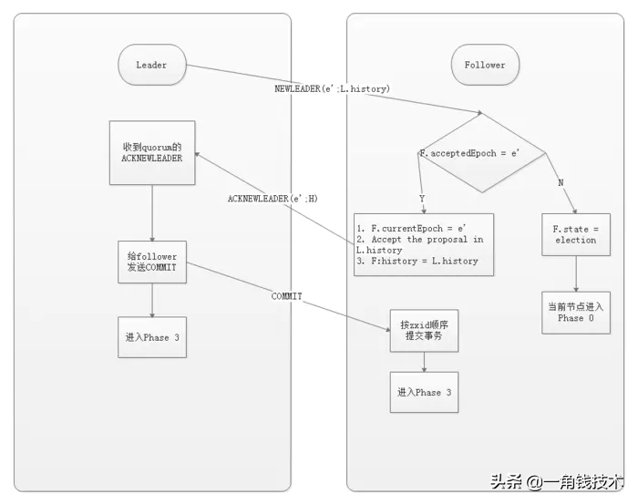

**4.广播阶段（Broadcast）**
到了这个阶段，Zookeeper 集群才能正式对外提供事务服务，并且 Leader 可以进行消息广播。同时，如果有新的节点加入，还需要对新节点进行同步。

需要注意的是，Zab 提交事务并不像 2PC 一样需要全部 Follower 都 Ack，只需要得到 quorum（超过半数的节点）的Ack 就可以。

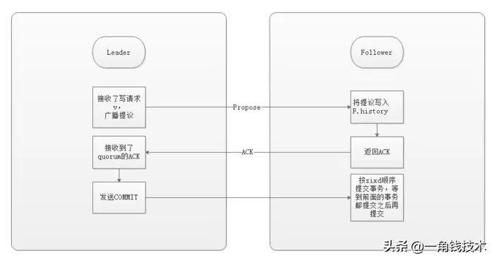

**Zab协议实现**
协议的 Java 版本实现跟上面的定义略有不同，选举阶段使用的是 Fast Leader Election（FLE），它包含了步骤1的发现职责。因为FLE会选举拥有最新提议的历史节点作为 Leader，这样就省去了发现最新提议的步骤。

实际的实现将发现和同步阶段合并为 Recovery Phase（恢复阶段），所以，Zab 的实现实际上有三个阶段。

**Zab协议三个阶段：**

1. 选举（Fast Leader Election）
2. 恢复（Recovery Phase）
3. 广播（Broadcast Phase）

**Fast Leader Election（快速选举）**

前面提到的 FLE 会选举拥有最新Proposal history （lastZxid最大）的节点作为 Leader，这样就省去了发现最新提议的步骤。这是基于拥有最新提议的节点也拥有最新的提交记录

**成为 Leader 的条件：**

1. 选 epoch 最大的
2. 若 epoch 相等，选 zxid 最大的
3. 若 epoch 和 zxid 相等，选择 server_id 最大的（zoo.cfg中的myid）

节点在选举开始时，都默认投票给自己，当接收其他节点的选票时，会根据上面的 Leader条件 判断并且更改自己的选票，然后重新发送选票给其他节点。当有一个节点的得票超过半数，该节点会设置自己的状态为 Leading ，其他节点会设置自己的状态为 Following。

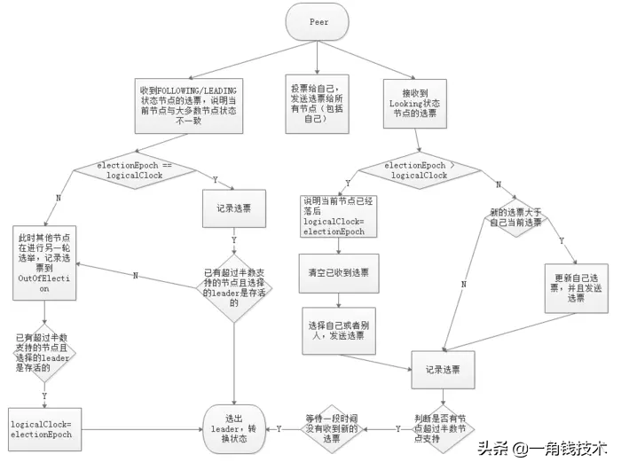

**Recovery Phase（恢复阶段）**

这一阶段 Follower 发送他们的 lastZxid 给 Leader，Leader 根据 lastZxid 决定如何同步数据。这里的实现跟前面的 Phase 2 有所不同：Follower 收到 TRUNC 指令会终止 L.lastCommitedZxid 之后的 Proposal ，收到 DIFF 指令会接收新的 Proposal。

history.lastCommitedZxid：最近被提交的 Proposal zxid history.oldThreshold：被认为已经太旧的已经提交的 Proposal zxid

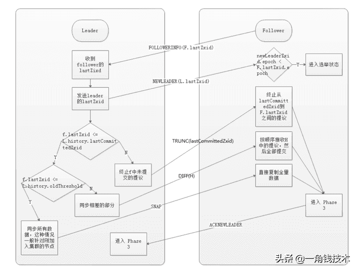

**Zookeeper ZAB协议实现源码**
启动流程
**知识点：**

1. 工程结构介绍
2. 启动流程宏观图
3. 集群启动详细流程
4. netty 服务工作机制

**工程结构介绍**
项目地址:https://github.com/apache/zookeeper.git

分支tag ：3.6.2

- zookeeper-recipes: 示例源码
- zookeeper-client: C语言客户端
- zookeeper-server：主体源码（包含客户端）

**启动宏观流程图**

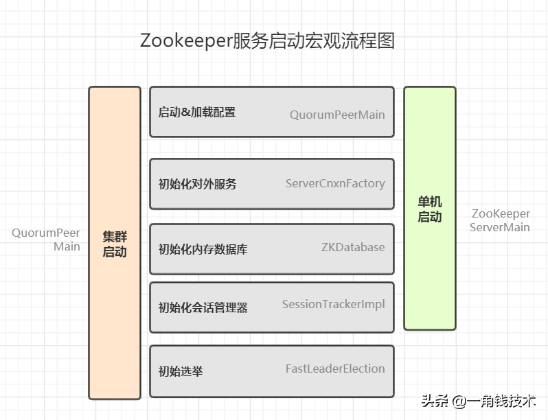

源码启动：

- 服务端：ZooKeeperServerMain
- 客户端：ZooKeeperMain

为方便阅读，以下代码均省略包名

**集群启动详细流程**
装载配置：

````shell
# zookeeper 启动流程堆栈 
 >QuorumPeerMain#initializeAndRun //启动工程  
   >QuorumPeerConfig#parse // 加载config 配置 
    >QuorumPeerConfig#parseProperties// 解析config配置 
 >new DatadirCleanupManager // 构造一个数据清器 
  >DatadirCleanupManager#start // 启动定时任务 清除过期的快照 

````

代码堆栈：

````shell
>QuorumPeerMain#main  //启动main方法 
 >QuorumPeerConfig#parse // 加载zoo.cfg 文件 
   >QuorumPeerConfig#parseProperties // 解析配置 
 >DatadirCleanupManager#start // 启动定时任务清除日志 
 >QuorumPeerConfig#isDistributed // 判断是否为集群模式 
  >ServerCnxnFactory#createFactory() // 创建服务默认为NIO，推荐netty 
 //***创建 初始化集群管理器**/ 
 >QuorumPeerMain#getQuorumPeer 
 >QuorumPeer#setTxnFactory  
 >new FileTxnSnapLog // 数据文件管理器，用于检测快照与日志文件 
   /**  初始化数据库*/ 
  >new ZKDatabase  
    >ZKDatabase#createDataTree //创建数据树，所有的节点都会存储在这 
 // 启动集群：同时启动线程 
  > QuorumPeer#start //  
    > QuorumPeer#loadDataBase // 从快照文件以及日志文件 加载节点并填充到dataTree中去 
    > QuorumPeer#startServerCnxnFactory // 启动netty 或java nio 服务，对外开放2181 端口 
    > AdminServer#start// 启动管理服务，netty http服务，默认端口是8080 
    > QuorumPeer#startLeaderElection // 开始执行选举流程 
    > quorumPeer.join()  // 防止主进程退出 
````

流程说明:

1. main方法启动
2. 加载zoo.cfg 配置文件
3. 解析配置
4. 创建服务工厂
5. 创建集群管理线程
6. 设置数据库文件管理器
7. 设置数据库
8. ....设置设置
9. start启动集群管理线程
10. 加载数据节点至内存
11. 启动netty 服务，对客户端开放端口
12. 启动管理员Http服务，默认8080端口
13. 启动选举流程
14. join 管理线程，防止main 进程退出

**netty 服务启动流程**
服务UML类图

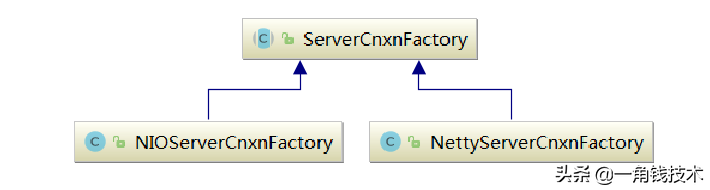

设置netty启动参数

````shell
-Dzookeeper.serverCnxnFactory=org.apache.zookeeper.server.NettyServerCnxnFactory 
````

**初始化：**

关键代码：

````shell
#初始化管道流  
#channelHandler 是一个内部类是具体的消息处理器。
protected void initChannel(SocketChannel ch) throws Exception { 
    ChannelPipeline pipeline = ch.pipeline();  
    if (secure) { 
        initSSL(pipeline);    
    }    
   pipeline.addLast("servercnxnfactory", channelHandler); 
} 
````

channelHandler 类结构

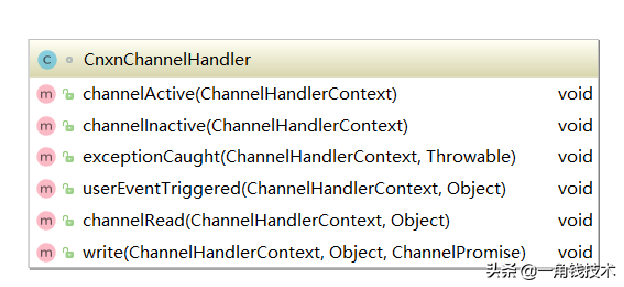

执行堆栈：

````shell
NettyServerCnxnFactory#NettyServerCnxnFactory  // 初始化netty服务工厂 
  > NettyUtils.newNioOrEpollEventLoopGroup  // 创建IO线程组 
  > NettyUtils#newNioOrEpollEventLoopGroup()  // 创建工作线程组 
  >ServerBootstrap#childHandler(io.netty.channel.ChannelHandler) // 添加管道流 
>NettyServerCnxnFactory#start    // 绑定端口，并启动netty服务 
````

**创建连接：**

每当有客户端新连接进来，就会进入该方法 创建 NettyServerCnxn对象。并添加至cnxns队列

执行堆栈

````shell
CnxnChannelHandler#channelActive 
 >new NettyServerCnxn        // 构建连接器 
>NettyServerCnxnFactory#addCnxn     // 添加至连接器，并根据客户端IP进行分组 
 >ipMap.get(addr) // 基于IP进行分组 
````

**读取消息：**

执行堆栈

````shell
CnxnChannelHandler#channelRead 
>NettyServerCnxn#processMessage //  处理消息  
 >NettyServerCnxn#receiveMessage // 接收消息 
  >ZooKeeperServer#processPacket //处理消息包 
   >org.apache.zookeeper.server.Request // 封装request 对象 
    >org.apache.zookeeper.server.ZooKeeperServer#submitRequest // 提交request   
     >org.apache.zookeeper.server.RequestProcessor#processRequest // 处理请求 
````

**快照与事务日志存储结构**
**概要**
ZK中所有的数据都是存储在内存中，即zkDataBase中。但同时所有对ZK数据的变更都会记录到事务日志中，并且当写入到一定的次数就会进行一次快照的生成。已保证数据的备份。其后缀就是ZXID（唯一事务ID）。

- 事务日志：每次增删改，的记录日志都会保存在文件当中
- 快照日志：存储了在指定时间节点下的所有的数据

**存储结构**
zkDdataBase 是zk数据库基类，所有节点都会保存在该类当中，而对Zk进行任何的数据变更都会基于该类进行。zk数据的存储是通过DataTree 对象进行，其用了一个map 来进行存储。

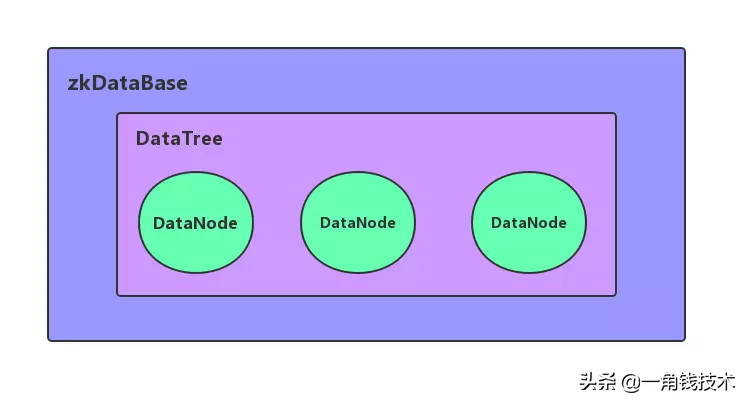

UML 类图：

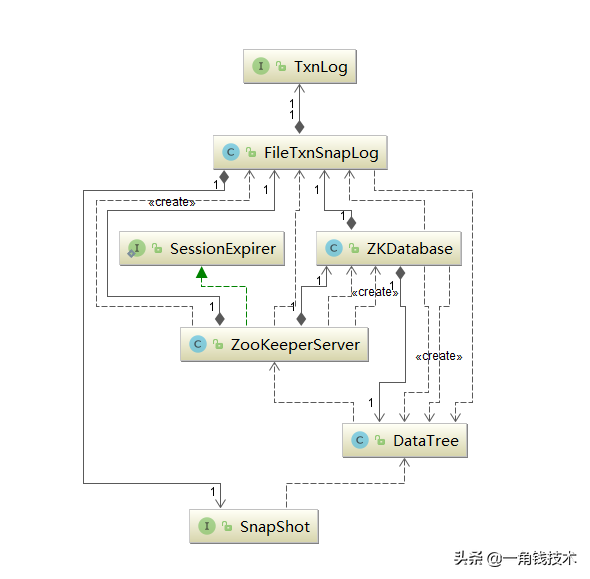

读取快照日志：

````shell
org.apache.zookeeper.server.SnapshotFormatter 
````

读取事务日志：

````shell
org.apache.zookeeper.server.LogFormatter 
````

**快照相关配置**

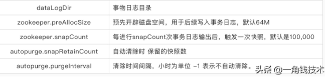

**快照装载流程**

````shell
>ZooKeeperServer#loadData // 加载数据 
>FileTxnSnapLog#restore // 恢复数据 
>FileSnap#deserialize() // 反序列化数据 
>FileSnap#findNValidSnapshots // 查找有效的快照 
  >Util#sortDataDir // 基于后缀排序文件 
    >persistence.Util#isValidSnapshot // 验证是否有效快照文件 
````

> 摘自： https://www.51cto.com/article/627984.html