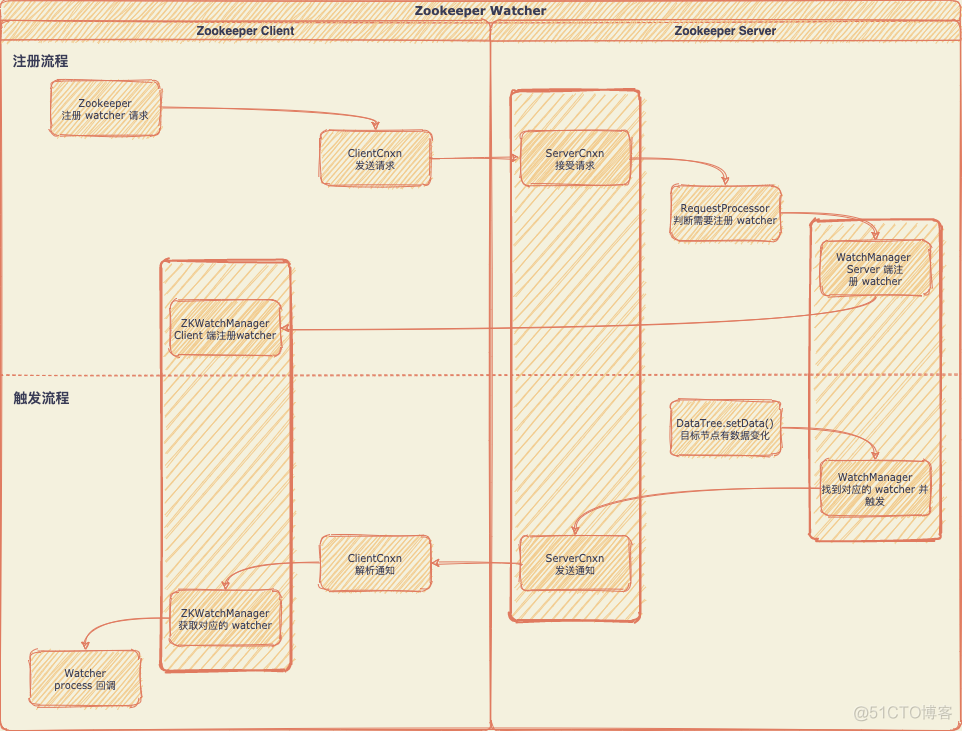

# **zookeeper的watcher是一次性的吗？！**


## zookeeper

[zookeeper](https://zookeeper.apache.org/)是流行的高性能分布式协调工具，它提供了分布式环境中需要的命名服务，配置管理，分布式锁，注册中心，Leader 选举等等功能，应用十分广泛。

## zookeeper的watcher

Client 可以在 zookeeper 的节点（znode）上设置监听器（watcher），当节点被修改时，zookeeper 会向客户端发送一个相应的通知。 可以通过 getData()，getChildren() 和 exists() 三个方法来设置 watcher。以 getData() 的方法签名为例：

````java
public byte[] getData(String path, boolean watch, Stat stat);
````

方法的第二个参数便表示是否在当前 path 上注册 watcher。

## watcher 流程

watcher 的注册与触发流程大致如下：



为了高性能考虑，zookeeper 的 watcher 被设计成很轻量级。上图 Client 与 Server 交互过程中，Client 并没有把 watcher 实例传给 Server 端，而只是设置一个标识位告诉它要监听某个节点的变化。同理，Server 端节点发生变化的时候，只能简单“通知” Client 变化的事件，而具体发生了什么变化，则需要 Client 自己去 Server 端再次获取。

## watcher 是一次性的吗？

对 zookeeper 有过简单了解的同学，估计都会认为 watcher 是一次性的，包括 官网都是这么介绍 watcher 的：

> One-time trigger: One watch event will be sent to the client when the data has changed. For example, if a client does a getData("/znode1", true) and later the data for /znode1 is changed or deleted, the client will get a watch event for /znode1. If /znode1 changes again, no watch event will be sent unless the client has done another read that sets a new watch.

是的，普通的 watcher 确实是一次性的，当事件被触发之后，所对应的 watcher 会被立马删除。如此设计的原因，依然是出于性能考虑（咱 zookeeper 是一个高性能的分布式协调工具！）。试想，如果 Server 端的每次数据变更都通知 Client，在更新非常频繁的情况下会影响性能。同时，Client 其实并不一定想知道每次数据更新，更多的是需要知道最新的数据。 不过如果 Client 想继续监听节点变化，如何注册一个永久的 watcher 呢？zookeeper 提供的方案是，在后续如 getData() 获取 Server 端最新数据的时候再注册一遍 watcher即可（同时这也是  Curator 添加永久 wathcher 的做法），这也是没有单独提供一个 addWatcher() 方法而需要与 getData() 绑定使用的原因。 所以 zookeeper 这么设计是情有可原的。

## 持久递归监听器（Persistent Recursive Watch）

在上文中我们知道，出于性能考虑，zookeeper 把 watcher 设计为一次性的，如果需要继续监听节点变化，则需要调用如 getData() 重新注册。然而在  zookeeper 3.6.0 中新增了如下方法：

````java
private void addPersistentWatches(String clientPath, Set<Watcher> result);
````

官网的介绍如下：

````java
New in 3.6.0: Clients can also set permanent, recursive watches on a znode that are not removed when triggered and that trigger for changes on the registered znode as well as any children znodes recursively.
````

也就是说，在 3.6.0 版本之后，zookeeper 支持设置永久的 watcher 了！来看看这个永久递归监听器的特性：

1. 支持 watcher 所支持的所有语义：CHILDREN，DATA 和 EXISTS。
2. 可以在任意节点上添加 CHILDREN 和 DATA 递归监听。
3. 可以在任意路径上添加 EXISTS 递归监听。
4. 添加一个递归监听器相当于在其所有子节点上添加 watcher
5. 跟普通的 watcher 一样，当递归监听器的某个子节点事件被触发之后，在对其调用 getData() 之前，不会再次触发事件。
6. 递归监听器会覆盖其子节点上的所有普通 watcher。

我们主要看第5条，举两个例子，假如我们在节点 /a 上添加了永久递归监听器：

情况一：

* 当 /a/a 变更时，将会触发监听器
* 当 /a/a 再次变更时，不会触发监听器
* Client 调用 get(/a/a) 之后，该子节点上的监听器被“自动重置”
* 当 /a/a 再次变更时，又会触发监听器

情况二：

* 当 /a/a 变更时，将会触发监听器
* 当 /a/b 变更时，将会触发监听器
* Client 调用 get(/a/a) 之后，该子节点上的监听器被“自动重置”
* 当 /a/b 再次变更时，不触发监听器
* 当 /a/a 再次变更时，又会触发监听器

不难看出，永久递归监听器虽然是永久的，但它与普通的 watcher 设计理念其实是一致的，也就是说，它保证了在事件触发和 Client 调用 getData() 获取数据 两个动作之间，没有中间事件，依然能保持 zookeeper 的高性能。 其实是因为该监听器是递归的，所以将它设置成是永久的。作者权衡过两种实现方式：

1. 给节点的子节点分别添加一个 watcher
2. 只在目标节点添加一个永久的 watcher，然后将已经触发的子节点事件记录在一个黑名单（blacklist）中

结果是采用了而第二种方式，因为它所需的内存更小。而在 Server 端监听器的重置，实际上只是将对应的子节点路径从黑名单中移除。

## 总结

为了实现高性能的目的，zookeeper 的 watcher 被设计成是轻量级，一次性的。如果客户端需要持续订阅某个节点的状态，需要每次在 getData() 方法里面重复注册 watcher。 在 3.6.0 版本之后，zookeeper 提供了永久递归 watcher，它是永久的。但其行为跟普通的 watcher 一致，即在通知发送给 Client 与 Client 调用 getData() 之间，不会有中间事件触发。其原理其实是，在 Client 调用 getData() 的时候，在 Server 端自动将该 watcher 重新注册了。