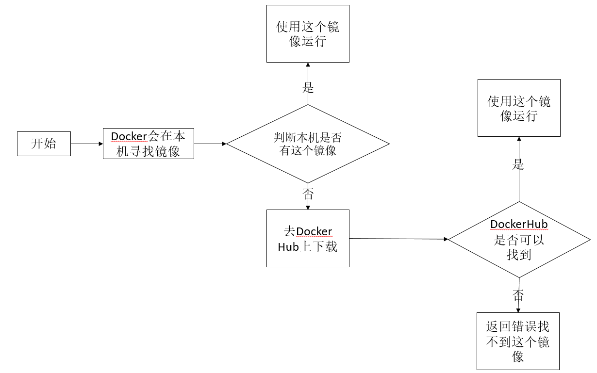
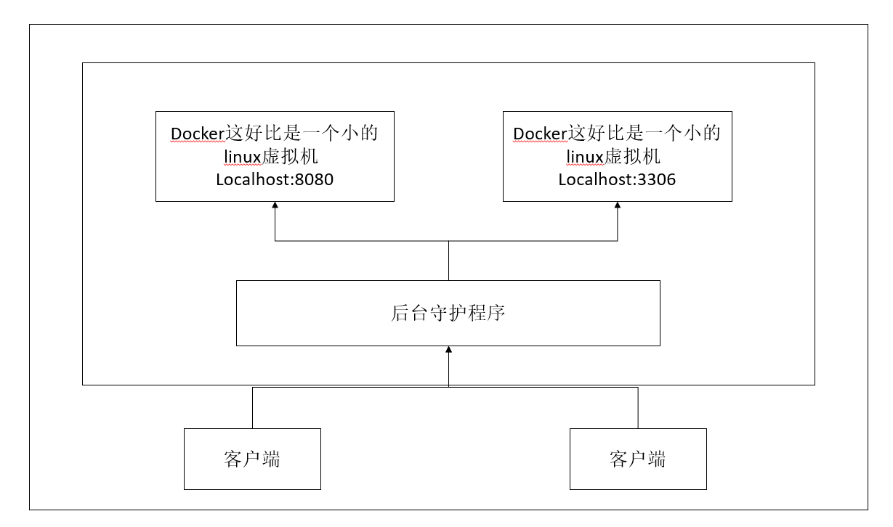
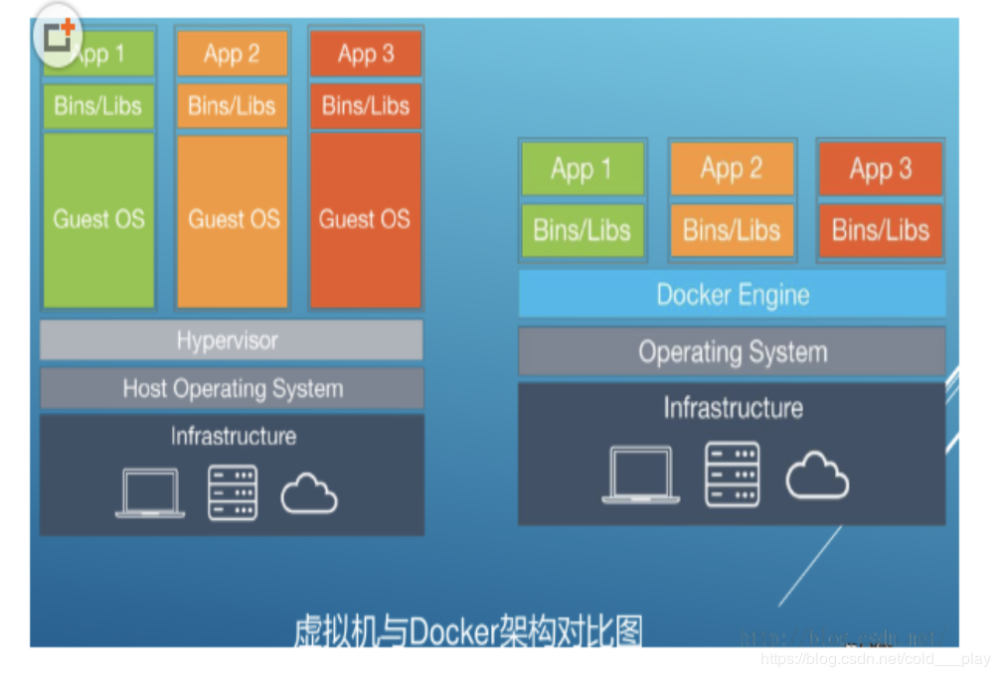
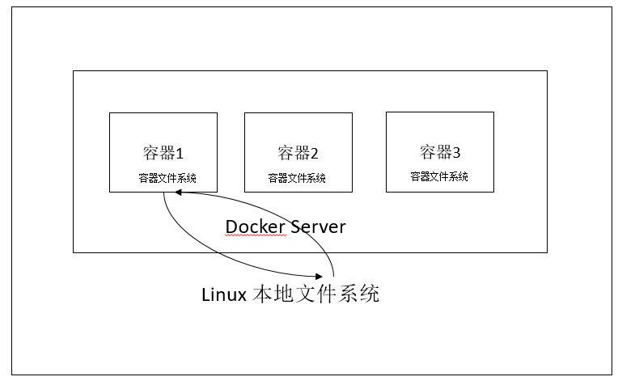
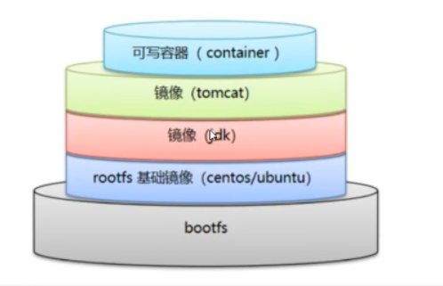
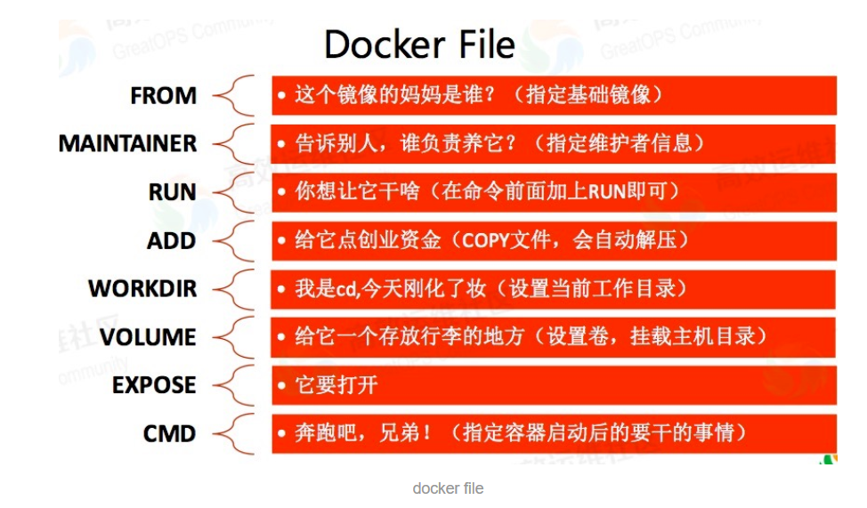
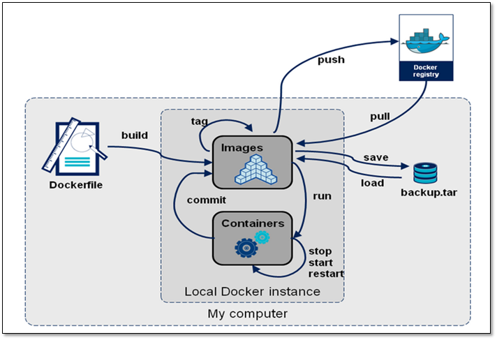

### docker安装

#### 卸载旧的版本

````shell
$ sudo yum remove docker \
                  docker-client \
                  docker-client-latest \
                  docker-common \
                  docker-latest \
                  docker-latest-logrotate \
                  docker-logrotate \
                  docker-engine
````

### 需要的安装包

````shell
sudo yum install -y yum-utils
````


#### 设置镜像的仓库

````shell
$ sudo yum-config-manager \
    --add-repo \
    https://download.docker.com/linux/centos/docker-ce.repo   #默认是国外的镜像
    
     yum-config-manager \
     --add-repo \
     http://mirrors.aliyun.com/docker-ce/linux/centos/docker-ce.repo  #推荐使用阿里云的，速度快
     
     
     #================================================
     # 创建或修改 /etc/docker/daemon.json 文件，修改为如下形式
     
{
    "registry-mirrors" : [
    "https://registry.docker-cn.com",
    "https://docker.mirrors.ustc.edu.cn",
    "http://hub-mirror.c.163.com",
    "https://cr.console.aliyun.com/"
  ]
}
# 重启docker服务使配置生效
$ systemctl restart docker.service

````

#### 更新yum

````shell
yum makecache fast
````


#### 安装docker

````shell
#	docker-ce 社区办  ee社区版
$ sudo yum install docker-ce docker-ce-cli containerd.io
````

#### 启动docker

````shell
$ sudo systemctl start docker
$ sudo  docker version   # 验证docker是否启动
````

输出结果

````
Client: Docker Engine - Community
 Version:           19.03.12
 API version:       1.40
 Go version:        go1.13.10
 Git commit:        48a66213fe
 Built:             Mon Jun 22 15:46:54 2020
 OS/Arch:           linux/amd64
 Experimental:      false

Server: Docker Engine - Community
 Engine:
  Version:          19.03.12
  API version:      1.40 (minimum version 1.12)
  Go version:       go1.13.10
  Git commit:       48a66213fe
  Built:            Mon Jun 22 15:45:28 2020
  OS/Arch:          linux/amd64
  Experimental:     false
 containerd:
  Version:          1.2.13
  GitCommit:        7ad184331fa3e55e52b890ea95e65ba581ae3429
 runc:
  Version:          1.0.0-rc10
  GitCommit:        dc9208a3303feef5b3839f4323d9beb36df0a9dd
 docker-init:
  Version:          0.18.0
  GitCommit:        fec3683
````

#### 测试hello world

````shell
$ sudo docker run hello-world
````

控制台输出为

````
Unable to find image 'hello-world:latest' locally

latest: Pulling from library/hello-world
0e03bdcc26d7: Already exists 
Digest: sha256:49a1c8800c94df04e9658809b006fd8a686cab8028d33cfba2cc049724254202
Status: Downloaded newer image for hello-world:latest

Hello from Docker!
This message shows that your installation appears to be working correctly.

To generate this message, Docker took the following steps:
 1. The Docker client contacted the Docker daemon.
 2. The Docker daemon pulled the "hello-world" image from the Docker Hub.
    (amd64)
 3. The Docker daemon created a new container from that image which runs the
    executable that produces the output you are currently reading.
 4. The Docker daemon streamed that output to the Docker client, which sent it
    to your terminal.

To try something more ambitious, you can run an Ubuntu container with:
 $ docker run -it ubuntu bash

Share images, automate workflows, and more with a free Docker ID:
 https://hub.docker.com/

For more examples and ideas, visit:
 https://docs.docker.com/get-started/
````

#### 重启docker

````shell
$ sudo system restart docker
````

#### 移除docker

1.  卸载docker引擎，客户以及容器包等等

   ```shell
   $ sudo yum remove docker-ce docker-ce-cli containerd.io
   ```

2. 不会自动删除主机上的镜像、容器、卷或自定义配置文件。删除所有图像、容器和卷(删除资源)。

   ```shell
   $ sudo rm -rf /var/lib/docker
   ```

###  Docker工作原理

#### docker 工作流程



#### docker是怎么工作的呢？

Docker是一个Client + Server结构的系统，Docker的守护进程运行在主机上。通过Socket从客户端访问！

DockerServer接收到Docker + Client的指令，就会执行这个命令！



#### Docker为什么会比VM快

1. docker有着比虚拟机更少的抽象层。由于docker不需要Hypervisor实现硬件资源虚拟化,运行在docker容器上的程序直接使用的都是实际物理机的硬件资源。因此在CPU、内存利用率上docker将会在效率上有明显优势。
2. docker利用的是宿主机的内核,而不需要Guest OS。因此,当新建一个容器时,docker不需要和虚拟机一样重新加载一个操作系统内核。仍而避免引寻、加载操作系统内核返个比较费时费资源的过程,当新建一个虚拟机时,虚拟机软件需要加载Guest OS,返个新建过程是分钟级别的。而docker由于直接利用宿主机的操作系统,则省略了返个过程,因此新建一个docker容器只需要几秒钟。




### Docker常用命令

#### 帮助命令

````shell
docker version   # 显示docker版本信息
docker info      # 显示docker的系统信息，包括镜像和容器的数量
docker --help    # 帮助命令
````

**docker 文档地址： **https://docs.docker.com/reference/

#### 镜像命令

````shell
[root@localhost ~]# docker images
REPOSITORY          TAG                 IMAGE ID            CREATED             SIZE
hello-world         latest              bf756fb1ae65        7 months ago        13.3kB

# 解释
REPOSITORY 镜像的仓库源
Tag  镜像的标签
IMAGE ID 镜像的ID
CREATED  镜像的创建时间
SIZE     镜像的大小

# 可选项

  -a, --all             Show all images (default hides intermediate images)
      --digests         Show digests
  -f, --filter filter   Filter output based on conditions provided
      --format string   Pretty-print images using a Go template
      --no-trunc        Don't truncate output
  -q, --quiet           Only show numeric IDs
````


#### Docker 搜索命令

````shell
[root@localhost ~]# docker search mysql
NAME                              DESCRIPTION                                     STARS               OFFICIAL            AUTOMATED
mysql                             MySQL is a widely used, open-source relation…   9804                [OK]                
mariadb                           MariaDB is a community-developed fork of MyS…   3579                [OK]                
mysql/mysql-server                Optimized MySQL Server Docker images. Create…   719                                     [OK]
percona                           Percona Server is a fork of the MySQL relati…   499                 [OK]                
# 可选项

Options:
  -f, --filter filter   Filter output based on conditions provided
      --format string   Pretty-print search using a Go template
      --limit int       Max number of search results (default 25)
      --no-trunc        Don't truncate output

````

####  Docker 下载镜像

````shell
[root@localhost ~]# docker pull mysql         #下载命令
Using default tag: latest                     #默认不写tag，某人就是latest
latest: Pulling from library/mysql	
bf5952930446: Pull complete                   #分成下载，docker image的核心 联合文件下载
8254623a9871: Pull complete 
938e3e06dac4: Pull complete 
ea28ebf28884: Pull complete 
f3cef38785c2: Pull complete 
894f9792565a: Pull complete 
1d8a57523420: Pull complete 
6c676912929f: Pull complete 
ff39fdb566b4: Pull complete 
fff872988aba: Pull complete 
4d34e365ae68: Pull complete 
7886ee20621e: Pull complete 
Digest: sha256:c358e72e100ab493a0304bda35e6f239db2ec8c9bb836d8a427ac34307d074ed  #签名
Status: Downloaded newer image for mysql:latest  
docker.io/library/mysql:latest                 #真是地址

#上面的下载命令等价于下面
[root@localhost ~]# docker pull docker.io/library/mysql:latest 

#指定版本下载
[root@localhost ~]# docker pull mysql:5.7
````


#### Docker 删除镜像

````shell
[root@localhost ~]# docker rmi 容器id    #删除指定容器
[root@localhost ~]# docker rmi -f 容器id  容器id  容器id
[root@localhost ~]# docker rmi -f(docker images -aq)  #删除全部容器
````


#### Docker容器命令

**说明：有镜像才能创建容器**

##### 新建容器并启动

````
docker pull centos
[root@localhost ~]# docker run --it centos /bin/bash
unknown flag: --it
See 'docker run --help'.
[root@localhost ~]# docker run -it centos /bin/bash
WARNING: IPv4 forwarding is disabled. Networking will not work.
[root@188a6161c622 /]# 
````

##### 运行镜像命令

````shell
docker run [可选参数] image

# 参数说明
--name="Name"  容器的名字
-d             后台方式运行
-it            使用交互方式运行，进入容器查看内容
-p             指定容器的端口
  ip:主机端口：容器端口
  主机端口：容器端口
  容器端口
-P             随机容器端口
````

**退出镜像命令**

````shell
# exit

[root@localhost ~]# docker run -it centos /bin/bash
WARNING: IPv4 forwarding is disabled. Networking will not work.
[root@188a6161c622 /]# 
[root@188a6161c622 /]# 
[root@188a6161c622 /]# ls
bin  dev  etc  home  lib  lib64  lost+found  media  mnt  opt  proc  root  run  sbin  srv  sys  tmp  usr  var
[root@188a6161c622 /]# 
[root@188a6161c622 /]# cd /home/
[root@188a6161c622 home]# ls
[root@188a6161c622 home]# cd ..
[root@188a6161c622 /]# 
[root@188a6161c622 /]# exit
exit
[root@localhost ~]#

[参数说明]
exit # 停止并退出容器
ctrl + P + Q #退出容器但不停止容器
````

**查看运行的容器**

````shell
[root@localhost ~]# docker ps
CONTAINER ID        IMAGE               COMMAND             CREATED             STATUS              PORTS               NAMES
[root@localhost ~]# docker ps -a
CONTAINER ID        IMAGE               COMMAND             CREATED             STATUS                     PORTS               NAMES
188a6161c622        centos              "/bin/bash"         4 minutes ago       Exited (0) 2 minutes ago                       condescending_cartwright
a5dc0f930239        hello-world         "/hello"            6 days ago          Exited (0) 6 days ago                          loving_galois
[root@localhost ~]# 

docker ps查看正在运行的容器
[参数说明]
-a  查看运行过的容器 
-n=?  显示最近常见的容器
````


**删除容器**

````
docker rm 容器id                   #删除指定的容器
docker rm -f ${docker ps -aq}     #删除所有的容器
docker ps -a -q|xargs dorcker -rm

docker rm  删除容器
[参数说明]
-f 强制删除容器
````

**启动和停止的操作**

````
docker start 容器id         #启动容器
docker restart 容器id       #重启容器
docker stop 容器id          #停止当前正在运行的容器
docker kill 容器id          #强制停止容器
````

#### 常用其他命令

	##### 后台启动容器

````shell
# 命令 docker run -d 镜像名！
[root@localhost ~]# docker run -d centos
WARNING: IPv4 forwarding is disabled. Networking will not work.
0bf34845e80743effd78830ecccfd5f692946353f76294ebc39e252a1c8dd795
[root@localhost ~]# docker ps
CONTAINER ID        IMAGE               COMMAND             CREATED             STATUS              PORTS               NAMES
[root@localhost ~]# 

[问题] 在docker没有启动centos的情况下，用 docker run -d centos去启动centos容器，发现centos容器并没有启动起来。
【原因】docker容器使用后台运行，就必须要一个前台进程，docker发现没有应用，就会自动停止。（运行了一个空的mian()方法？）
````


##### 查看日志

````shell
# docker logs
docker logs -tf  --tail 10 404cc7e9b2fd
````


##### 查看容器中的进程信息

````shell
docker top  [容器id]
````

##### 查看容器的元信息

````shell
docker inspect [容器id]

[root@localhost ~]# docker inspect  d4c5303f1540
[
    {
        "Id": "d4c5303f1540f9b5b9004a2017e0999fe3282900abaf700ce4fa36ebcdc000b2",
        "Created": "2020-08-09T09:03:20.461736094Z",
        "Path": "/bin/sh",
        "Args": [
            "-c",
            "while true;do echo wuheng;sleep 1;done"
        ],
        "State": {
            "Status": "running",
            "Running": true,
            "Paused": false,
            "Restarting": false,
            "OOMKilled": false,
            "Dead": false,
            "Pid": 18662,
            "ExitCode": 0,
            "Error": "",
            "StartedAt": "2020-08-09T09:03:20.774201637Z",
            "FinishedAt": "0001-01-01T00:00:00Z"
        },
        "Image": "sha256:831691599b88ad6cc2a4abbd0e89661a121aff14cfa289ad840fd3946f274f1f",
        "ResolvConfPath": "/var/lib/docker/containers/d4c5303f1540f9b5b9004a2017e0999fe3282900abaf700ce4fa36ebcdc000b2/resolv.conf",
        "HostnamePath": "/var/lib/docker/containers/d4c5303f1540f9b5b9004a2017e0999fe3282900abaf700ce4fa36ebcdc000b2/hostname",
        "HostsPath": "/var/lib/docker/containers/d4c5303f1540f9b5b9004a2017e0999fe3282900abaf700ce4fa36ebcdc000b2/hosts",
        "LogPath": "/var/lib/docker/containers/d4c5303f1540f9b5b9004a2017e0999fe3282900abaf700ce4fa36ebcdc000b2/d4c5303f1540f9b5b9004a2017e0999fe3282900abaf700ce4fa36ebcdc000b2-json.log",
        "Name": "/vigilant_snyder",
        "RestartCount": 0,
        "Driver": "overlay2",
        "Platform": "linux",
        "MountLabel": "",
        "ProcessLabel": "",
        "AppArmorProfile": "",
        "ExecIDs": null,
        "HostConfig": {
            "Binds": null,
            "ContainerIDFile": "",
            "LogConfig": {
                "Type": "json-file",
                "Config": {}
            },
            "NetworkMode": "default",
            "PortBindings": {},
            "RestartPolicy": {
                "Name": "no",
                "MaximumRetryCount": 0
            },
            "AutoRemove": false,
            "VolumeDriver": "",
            "VolumesFrom": null,
            "CapAdd": null,
            "CapDrop": null,
            "Capabilities": null,
            "Dns": [],
            "DnsOptions": [],
            "DnsSearch": [],
            "ExtraHosts": null,
            "GroupAdd": null,
            "IpcMode": "private",
            "Cgroup": "",
            "Links": null,
            "OomScoreAdj": 0,
            "PidMode": "",
            "Privileged": false,
            "PublishAllPorts": false,
            "ReadonlyRootfs": false,
            "SecurityOpt": null,
            "UTSMode": "",
            "UsernsMode": "",
            "ShmSize": 67108864,
            "Runtime": "runc",
            "ConsoleSize": [
                0,
                0
            ],
            "Isolation": "",
            "CpuShares": 0,
            "Memory": 0,
            "NanoCpus": 0,
            "CgroupParent": "",
            "BlkioWeight": 0,
            "BlkioWeightDevice": [],
            "BlkioDeviceReadBps": null,
            "BlkioDeviceWriteBps": null,
            "BlkioDeviceReadIOps": null,
            "BlkioDeviceWriteIOps": null,
            "CpuPeriod": 0,
            "CpuQuota": 0,
            "CpuRealtimePeriod": 0,
            "CpuRealtimeRuntime": 0,
            "CpusetCpus": "",
            "CpusetMems": "",
            "Devices": [],
            "DeviceCgroupRules": null,
            "DeviceRequests": null,
            "KernelMemory": 0,
            "KernelMemoryTCP": 0,
            "MemoryReservation": 0,
            "MemorySwap": 0,
            "MemorySwappiness": null,
            "OomKillDisable": false,
            "PidsLimit": null,
            "Ulimits": null,
            "CpuCount": 0,
            "CpuPercent": 0,
            "IOMaximumIOps": 0,
            "IOMaximumBandwidth": 0,
            "MaskedPaths": [
                "/proc/asound",
                "/proc/acpi",
                "/proc/kcore",
                "/proc/keys",
                "/proc/latency_stats",
                "/proc/timer_list",
                "/proc/timer_stats",
                "/proc/sched_debug",
                "/proc/scsi",
                "/sys/firmware"
            ],
            "ReadonlyPaths": [
                "/proc/bus",
                "/proc/fs",
                "/proc/irq",
                "/proc/sys",
                "/proc/sysrq-trigger"
            ]
        },
        "GraphDriver": {
            "Data": {
                "LowerDir": "/var/lib/docker/overlay2/320ad6491994a9630f409b4c041bcce05f9e989e45d16a4058c0d8933a0a0757-init/diff:/var/lib/docker/overlay2/ffe0a6511ff34f160da057ff53100d81dc7c5097b874837a5b900aa94a78ae60/diff",
                "MergedDir": "/var/lib/docker/overlay2/320ad6491994a9630f409b4c041bcce05f9e989e45d16a4058c0d8933a0a0757/merged",
                "UpperDir": "/var/lib/docker/overlay2/320ad6491994a9630f409b4c041bcce05f9e989e45d16a4058c0d8933a0a0757/diff",
                "WorkDir": "/var/lib/docker/overlay2/320ad6491994a9630f409b4c041bcce05f9e989e45d16a4058c0d8933a0a0757/work"
            },
            "Name": "overlay2"
        },
        "Mounts": [],
        "Config": {
            "Hostname": "d4c5303f1540",
            "Domainname": "",
            "User": "",
            "AttachStdin": false,
            "AttachStdout": false,
            "AttachStderr": false,
            "Tty": false,
            "OpenStdin": false,
            "StdinOnce": false,
            "Env": [
                "PATH=/usr/local/sbin:/usr/local/bin:/usr/sbin:/usr/bin:/sbin:/bin"
            ],
            "Cmd": [
                "/bin/sh",
                "-c",
                "while true;do echo wuheng;sleep 1;done"
            ],
            "Image": "centos",
            "Volumes": null,
            "WorkingDir": "",
            "Entrypoint": null,
            "OnBuild": null,
            "Labels": {
                "org.label-schema.build-date": "20200611",
                "org.label-schema.license": "GPLv2",
                "org.label-schema.name": "CentOS Base Image",
                "org.label-schema.schema-version": "1.0",
                "org.label-schema.vendor": "CentOS"
            }
        },
        "NetworkSettings": {
            "Bridge": "",
            "SandboxID": "43a8d733853b20aa738402ea4b58e20d1c1730ed6090dbd53e026999ba16c0cf",
            "HairpinMode": false,
            "LinkLocalIPv6Address": "",
            "LinkLocalIPv6PrefixLen": 0,
            "Ports": {},
            "SandboxKey": "/var/run/docker/netns/43a8d733853b",
            "SecondaryIPAddresses": null,
            "SecondaryIPv6Addresses": null,
            "EndpointID": "561bedbba91a7c64227720bc6df89dd78a94604282d9f5c6566df8bc463d0905",
            "Gateway": "172.17.0.1",
            "GlobalIPv6Address": "",
            "GlobalIPv6PrefixLen": 0,
            "IPAddress": "172.17.0.2",
            "IPPrefixLen": 16,
            "IPv6Gateway": "",
            "MacAddress": "02:42:ac:11:00:02",
            "Networks": {
                "bridge": {
                    "IPAMConfig": null,
                    "Links": null,
                    "Aliases": null,
                    "NetworkID": "6ead10118ffd86793e631ac373d7b6ef87d65b571772d5669a31339ac3647f88",
                    "EndpointID": "561bedbba91a7c64227720bc6df89dd78a94604282d9f5c6566df8bc463d0905",
                    "Gateway": "172.17.0.1",
                    "IPAddress": "172.17.0.2",
                    "IPPrefixLen": 16,
                    "IPv6Gateway": "",
                    "GlobalIPv6Address": "",
                    "GlobalIPv6PrefixLen": 0,
                    "MacAddress": "02:42:ac:11:00:02",
                    "DriverOpts": null
                }
            }
        }
    }
]
[root@localhost ~]# 

````

##### 进入当前正在运行的容器

````shell
# 命令
[root@localhost ~]# docker ps
CONTAINER ID        IMAGE               COMMAND                  CREATED             STATUS              PORTS               NAMES
d4c5303f1540        centos              "/bin/sh -c 'while t…"   27 hours ago        Up 27 hours                             vigilant_snyder
[root@localhost ~]# docker exec -it d4c5303f1540 /bin/bash
[root@d4c5303f1540 /]# 

# 方式二
docker attach [容器id]

# docker exec     #进入容器后开启一个新的终端，可以在里面操作（常用）
# docker attach   #进入容器正在执行的终端，不会启动新的终端
````


##### 从容器内拷贝文件到主机上

````shell
# docker cp 容器id:容器路径    目的主机路径
[root@localhost ~]# docker cp 4fa80b1166a8:/home/test.java  /home/
[root@localhost ~]# cd /home/
[root@localhost home]# ls
test  test.java
[root@localhost home]#

# 拷贝是一个手动过程，以后可以使用-v 卷的技术，实现自动同步
````


##### Docker启动mysql

````shell
 docker run -it  --name mysql1 -p 1234:3306  -e MYSQL_ROOT_PASSWORD=wuheng mysql
````

##### Docker启动tomcat

````shell
# 官方使用
docker run -it --rm tomcat:9.0
# docker run -it --rm [容器名]，一般用于测试，用完即删
 docker run -d --name tomcat1 -p 1235:8080 tomcat
````

##### Docker启动es与kibana

````shell
# es 暴露的端口很多
# es 十分的耗内存
# es 的数据一般需要放置到安装目录！挂载
#  --net someonework ? 网络配置

# 启动  elasticsearch
docker run -d --name elasticsearch -p 9200:9200 -e "discover.type=sing-node"   -e ES_JAVA_OPTS="-Xmx512m" elasticsearch:7.6.2

# 
````

##### Docker 查看镜像占资源命令

````shell
docker stats
````

#### Docker可视化

##### portainer

````shell
docker run -d -p 8088:9000 --restart=always -v /var/run/docker.sock:/var/run/docker.sock --privileged portainer/portainer
````

### Docker镜像讲解

#### 镜像是什么

镜像是一种轻量级、可执行的独立软件包，用来打包软件运行环境和基于运行环境的开发的软件，它包含运行某个软件所需的所有内容，包括代码、运行时、库、环境变量和配置文件。

所有的应用，直接打包docker原理，就可以直接跑起来！

**如何得到镜像：**

* 从远程仓库拷贝
* 从别的地方拷贝
* 自己制作一个镜像

#### Docker镜像加载原理

> UnionFS（联合文件系统）

UnionFS（联合文件系统）：Union文件系统（UnionFS）是一种分层，轻量级并且高性能的文件系统，它支持对文件系统的修改作为一次提交，来一层层的叠加，同时，可以将不同目录挂载到同一个虚拟文件系统下。Union文件系统是Docker镜像的基础。镜像可以通过分层来进行集成，基于基础镜像（没有父镜像），可以制作各种具体的应用镜像。

特性：一次同时加载多个文件系统，但从外面看起来，只能看到一个文件系统，联合加载会把各层文件系统叠加起来，这样最终的文件系统会包含所有底层的文件和目录。

> Docker镜像加载原理

docker的镜像实际上由一层一层的文件系统组成，这种层级的文件系统UnionFS。

bootfs(boot file system)主要包含bootloader和kernel，bootloader主要是引导加载kernel，Linux刚启动时会加载bootfs文件系统，在Docker镜像的最底层是bootfs。这一层是我们典型的Linux/Unix系统是一样的，包含boot加载器和内核。当boot加载完成之后整个内核都在内存中了，此时内存的使用权已由bootfs转交给内核，此时系统也会加载bootfs。

rootfs(root file system)，在bootfs之上。包含的就是典型Linux系统中的/dev，/proc，/bin，/etc等标准和文件。rootfs就是各种不同操作系统发行版，比如Ubuntu，Centos等等。	

#### 分层理解

> 分层的镜像

我们可以去下载一个镜像，注意观察下载的日志输出，可以看到是一层一层的在下载。

````shell
[root@localhost home]# docker pull redis
Using default tag: latest
latest: Pulling from library/redis
bf5952930446: Already exists 
911b8422b695: Pull complete 
093b947e0ade: Pull complete 
5b1d5f59e382: Pull complete 
7a5f59580c0b: Pull complete 
f9c63997c980: Pull complete 
Digest: sha256:09c33840ec47815dc0351f1eca3befe741d7105b3e95bc8fdb9a7e4985b9e1e5
Status: Downloaded newer image for redis:latest
docker.io/library/redis:latest
[root@localhost home]# 
````

思考：为什么Docker镜像要采用这种分层的结构呢？

最大的好处，莫过于资源共享！比如有多个镜像都从相同的Base镜像构建而来，那么宿主机只需在磁盘上保留一份base镜像，同时内存中也需要加载一份base镜像，这样就可以为所有的容器服务了，而且镜像的每一层都可以被共享。

查看镜像分层的方式可以通过docker image inspect命令！

````shell
[root@localhost home]# docker image inspect  redis:latest
[
    {
        "Id": "sha256:1319b1eaa0b7bcebae63af321fa67559b9517e8494060403d083bb3508fe52c8",
        "RepoTags": [
            "redis:latest"
        ],
        "RepoDigests": [
            "redis@sha256:09c33840ec47815dc0351f1eca3befe741d7105b3e95bc8fdb9a7e4985b9e1e5"
        ],
        "Parent": "",
        "Comment": "",
        "Created": "2020-08-05T06:36:50.735924115Z",
        "Container": "8c9280f90cadb7c3e7b9e0e2926f5be156d077d975b562fc37c0d64906e55b93",
        "ContainerConfig": {
            "Hostname": "8c9280f90cad",
            "Domainname": "",
            "User": "",
            "AttachStdin": false,
            "AttachStdout": false,
            "AttachStderr": false,
            "ExposedPorts": {
                "6379/tcp": {}
            },
            "Tty": false,
            "OpenStdin": false,
            "StdinOnce": false,
            "Env": [
                "PATH=/usr/local/sbin:/usr/local/bin:/usr/sbin:/usr/bin:/sbin:/bin",
                "GOSU_VERSION=1.12",
                "REDIS_VERSION=6.0.6",
                "REDIS_DOWNLOAD_URL=http://download.redis.io/releases/redis-6.0.6.tar.gz",
                "REDIS_DOWNLOAD_SHA=12ad49b163af5ef39466e8d2f7d212a58172116e5b441eebecb4e6ca22363d94"
            ],
            "Cmd": [
                "/bin/sh",
                "-c",
                "#(nop) ",
                "CMD [\"redis-server\"]"
            ],
            "ArgsEscaped": true,
            "Image": "sha256:193e98c00a42d985f4f93b2ca2d0e5c7e6fc9bf1990793efae6e3787a224dfbf",
            "Volumes": {
                "/data": {}
            },
            "WorkingDir": "/data",
            "Entrypoint": [
                "docker-entrypoint.sh"
            ],
            "OnBuild": null,
            "Labels": {}
        },
        "DockerVersion": "18.09.7",
        "Author": "",
        "Config": {
            "Hostname": "",
            "Domainname": "",
            "User": "",
            "AttachStdin": false,
            "AttachStdout": false,
            "AttachStderr": false,
            "ExposedPorts": {
                "6379/tcp": {}
            },
            "Tty": false,
            "OpenStdin": false,
            "StdinOnce": false,
            "Env": [
                "PATH=/usr/local/sbin:/usr/local/bin:/usr/sbin:/usr/bin:/sbin:/bin",
                "GOSU_VERSION=1.12",
                "REDIS_VERSION=6.0.6",
                "REDIS_DOWNLOAD_URL=http://download.redis.io/releases/redis-6.0.6.tar.gz",
                "REDIS_DOWNLOAD_SHA=12ad49b163af5ef39466e8d2f7d212a58172116e5b441eebecb4e6ca22363d94"
            ],
            "Cmd": [
                "redis-server"
            ],
            "ArgsEscaped": true,
            "Image": "sha256:193e98c00a42d985f4f93b2ca2d0e5c7e6fc9bf1990793efae6e3787a224dfbf",
            "Volumes": {
                "/data": {}
            },
            "WorkingDir": "/data",
            "Entrypoint": [
                "docker-entrypoint.sh"
            ],
            "OnBuild": null,
            "Labels": null
        },
        "Architecture": "amd64",
        "Os": "linux",
        "Size": 104160794,
        "VirtualSize": 104160794,
        "GraphDriver": {
            "Data": {
                "LowerDir": "/var/lib/docker/overlay2/29f29face112a310630e3b0ea2317f710da143e483c5ea062274dbdc62dfcd86/diff:/var/lib/docker/overlay2/d359d98a5a5d948776b33135fe86b31d04e84fd72507547e12858df3d330f545/diff:/var/lib/docker/overlay2/5efa795f34dcc16cf989874b0e3cf9ab87b2909103929705cbeff96806aaa79e/diff:/var/lib/docker/overlay2/7751cac5e6dabe8391061d8fe09402b02dbcdead33687e7f323843de3de80310/diff:/var/lib/docker/overlay2/e3081e67893dfcb4965903fdd974678a9a9f446ad6b3c2006608d1237ecadbbe/diff",
                "MergedDir": "/var/lib/docker/overlay2/21011003b8c4892716423be7f8699f9c2f8caff65e953d9ca093a786d4edd7ee/merged",
                "UpperDir": "/var/lib/docker/overlay2/21011003b8c4892716423be7f8699f9c2f8caff65e953d9ca093a786d4edd7ee/diff",
                "WorkDir": "/var/lib/docker/overlay2/21011003b8c4892716423be7f8699f9c2f8caff65e953d9ca093a786d4edd7ee/work"
            },
            "Name": "overlay2"
        },
        "RootFS": {
            "Type": "layers",
            "Layers": [
                "sha256:d0f104dc0a1f9c744b65b23b3fd4d4d3236b4656e67f776fe13f8ad8423b955c",
                "sha256:09b6608896c0a00497d9e9c1b045f0c906203555740dee64473db943244059c2",
                "sha256:ab0653e928a7c1d4b2f1c8e527d735aa0ea8dcb8c50e7cefc7680cf09cf6f985",
                "sha256:57094a432b39be6fc8a3f533567e10c354705eec37e4f7a8b5a7041a4ec63fa2",
                "sha256:1b80269d908f58520f9f3f00d75e65907eafa0f5143d5fe2b6cafcc30b32bc83",
                "sha256:1bd654b55bb49880160a60ad3a75c4b14254656229d535e943d8fb88124f6177"
            ]
        },
        "Metadata": {
            "LastTagTime": "0001-01-01T00:00:00Z"
        }
    }
]

````

#### commit镜像

````shell
docker commit -m="提交的描述信息" -a="作者信息" [容器id] 目标镜像名：[TAG]
````

### 容器数据卷

#### 什么是容器数据卷

##### docker 理念回顾

将应用和环境打包成一个镜像！

数据？如果数据都在容器中，那么我们容器被删除，数据就会丢失！比如有MySQL的容器被删了，那MySQL里的数据也就被删了（删库跑路？）

这个时候就需要有一个容器与本地之间有一个数据同步的技术。

这就是卷技术！即目录的挂载，将我们容器内的目录，挂载到Linux上面！



**总结：就是要解决容器与本地文件系统之间的关联关系（共享文件夹）**

##### 使用卷技术

在创建容器的时候，如果用户没有手动指定使用容器卷，那么docker会自动创建匿名数据卷进行映射和挂载

````shell
docker run -it -v 主机目录：容器目录
docker volume create edc-tomcat-vol   创建一个自定义容器卷
docker volume ls  查看所有容器卷
docker volume inspect edc-tomcat-vol   查看指定容器卷的详细信息
docker volume rm edc-tomcat-vol

# 指定容器权限
-v /home/tomcat/webapps:/usr/local/tomcat/webapps:ro  只能通过宿主机来修改容器的文件
-v /home/tomcat/webapps:/usr/local/tomcat/webapps:rw  宿主机与容器都可修改问题件
# 案例
# 有了自定义容器卷，我们可以创建并使用自定义容器卷
# 方式一：使用自定义容器卷
docker run -d -it --name=tomcat9.1 -p 8234:8080 -v edc-tomcat-vol:/usr/local/tomcat/webapps  tomcat
# 方式二：指定本地文件夹路径
docker run -d -it --name=tomcat9.1 -p 8234:8080 -v /home/tomcat/webapps:/usr/local/tomcat/webapps  tomcat
````


### DockerFile

在上面我们介绍了Docker的一些命令。那15个命令在手动创建镜像时会用到，它们涵盖了镜像的创建、提交、搜索、pull和push的功能。

现在问题来了，既然Docker能自动创建镜像，那为什么要选择耗时而又乏味的方式来创建镜像呢？

Docker为我们提供了Dockerfile来解决自动化的问题。下面，我们将讨论什么是Dockerfile，它能够做到的事情以及Dockerfile的一些基本语法。

#### DockerFile构建过程

**基础知识**

1. 每个保留关键字（指令）都必须是大写字母

2. 执行从上到下顺序执行

3. 表示注释
4. 每一行命令都会创建提交一个镜像层，并提交！



#### 命令

Dockerfile包含创建镜像所需要的全部指令。基于在Dockerfile中的指令，我们可以使用`Docker build`命令来创建镜像。通过减少镜像和容器的创建过程来简化部署。

Dockerfile支持支持的语法命令如下：

```
INSTRUCTION argument
```


指令不区分大小写。但是，命名约定为全部大写。

所有Dockerfile都必须以`FROM`命令开始。 `FROM`命令会指定镜像基于哪个基础镜像创建，接下来的命令也会基于这个基础镜像（译者注：CentOS和Ubuntu有些命令可是不一样的）。`FROM`命令可以多次使用，表示会创建多个镜像。具体语法如下：

```
FROM <image name>
```


例如：

```
FROM ubuntu
```


上面的指定告诉我们，新的镜像将基于Ubuntu的镜像来构建。

继`FROM`命令，DockefFile还提供了一些其它的命令以实现自动化。在文本文件或Dockerfile文件中这些命令的顺序就是它们被执行的顺序。

让我们了解一下这些有趣的Dockerfile命令吧。

1. MAINTAINER：设置该镜像的作者。语法如下：

```
MAINTAINER <author name>
```


2. RUN：在shell或者exec的环境下执行的命令。`RUN`指令会在新创建的镜像上添加新的层面，接下来提交的结果用在Dockerfile的下一条指令中。语法如下：

```
RUN 《command》
```


3. ADD：复制文件指令。它有两个参数<source>和<destination>。destination是容器内的路径。source可以是URL或者是启动配置上下文中的一个文件。语法如下：

```
ADD 《src》 《destination》
```


4. CMD：提供了容器默认的执行命令。 Dockerfile只允许使用一次CMD指令。 使用多个CMD会抵消之前所有的指令，只有最后一个指令生效。 CMD有三种形式：

```
CMD ["executable","param1","param2"]
CMD ["param1","param2"]
CMD command param1 param2
```


5. EXPOSE：指定容器在运行时监听的端口。语法如下：

```
EXPOSE <port>;
```


6. ENTRYPOINT：配置给容器一个可执行的命令，这意味着在每次使用镜像创建容器时一个特定的应用程序可以被设置为默认程序。同时也意味着该镜像每次被调用时仅能运行指定的应用。类似于`CMD`，Docker只允许一个ENTRYPOINT，多个ENTRYPOINT会抵消之前所有的指令，只执行最后的ENTRYPOINT指令。语法如下：

```
ENTRYPOINT ["executable", "param1","param2"]
ENTRYPOINT command param1 param2
```


7. WORKDIR：指定`RUN`、`CMD`与`ENTRYPOINT`命令的工作目录。语法如下：

```
WORKDIR /path/to/workdir
```


8. ENV：设置环境变量。它们使用键值对，增加运行程序的灵活性。语法如下：

```
ENV <key> <value>
```


9. USER：镜像正在运行时设置一个UID。语法如下：

```
USER <uid>
```


10. VOLUME：授权访问从容器内到主机上的目录。语法如下：

```
VOLUME ["/data"]
```

用一张通俗易懂的图来总结下：



#### 实战

docekr的最基础最基础的镜像是FROM scratch，然后	配置需要的软件和配置来进行的构建。

##### 创建自己的镜像

````shell
FROM centos
MAINTAINER <748580573@qq.com>

ENV MYPATH /usr/local
WORKDIR $MYPATH

RUN yum -y install vim*
RUN yum -y net-tools


EXPOSE 80
CMD echo $MYPATH
CMD echo "---end---"
CMD /bin/bash
````

##### docekr 镜像构建命令

````shell
docker build -f mydockerfile  -t mycentos:0.1 .
docker build -f mydockerfile  -t mycentos:0.1  .
````

##### docker 查看镜像构建历史

````shell
[root@localhost home]# docker history 4100cc7717ef
IMAGE               CREATED             CREATED BY                                      SIZE                COMMENT
4100cc7717ef        15 minutes ago      /bin/sh -c #(nop)  CMD ["/bin/sh" "-c" "/bin…   0B                  
3e3e52137f54        15 minutes ago      /bin/sh -c #(nop)  CMD ["/bin/sh" "-c" "echo…   0B                  
477ff55c5738        15 minutes ago      /bin/sh -c #(nop)  CMD ["/bin/sh" "-c" "echo…   0B                  
d9083aba8e52        15 minutes ago      /bin/sh -c #(nop)  EXPOSE 80                    0B                  
f2f09a690cc9        15 minutes ago      /bin/sh -c yum -y install net-tools             28.6MB              
86b360c8a47b        15 minutes ago      /bin/sh -c yum -y install vim*                  142MB               
78ae156cf231        17 minutes ago      /bin/sh -c #(nop) WORKDIR /usr/local            0B                  
9c7262260688        17 minutes ago      /bin/sh -c #(nop)  ENV MYPATH=/usr/local        0B                  
fd9aaa9c0d44        17 minutes ago      /bin/sh -c #(nop)  MAINTAINER <748580573@qq.…   0B                  
831691599b88        2 months ago        /bin/sh -c #(nop)  CMD ["/bin/bash"]            0B                  
<missing>           2 months ago        /bin/sh -c #(nop)  LABEL org.label-schema.sc…   0B                  
<missing>           2 months ago        /bin/sh -c #(nop) ADD file:84700c11fcc969ac0…   215MB
````

##### CMD与ENTRYPOINT的区别


````shell
CMD                      # 指定这个容器启动的时候要运行的命令，只有最后一个会生效，可别替代
ENTRYPOINT               # 指定这个容器启动的时候要运行的命令，可以追加命令
````


测试cmd

````shell
# 编写dockerfile文件
[root@localhost home]# vim cmdtest
FROM centos
CMD ["ls","-al"]

# 构建镜像
[root@localhost home]# docker build -f cmdtest  -t centos:0.2 .

# 运行centos:0.2，我们发现ls -a命令生效
[root@localhost home]# docker run centos:0.2
total 0
drwxr-xr-x.   1 root root   6 Aug 19 01:57 .
drwxr-xr-x.   1 root root   6 Aug 19 01:57 ..
-rwxr-xr-x.   1 root root   0 Aug 19 01:57 .dockerenv
lrwxrwxrwx.   1 root root   7 May 11  2019 bin -> usr/bin
drwxr-xr-x.   5 root root 340 Aug 19 01:57 dev
drwxr-xr-x.   1 root root  66 Aug 19 01:57 etc
drwxr-xr-x.   2 root root   6 May 11  2019 home
...

# 追加一个 -a命令试试，发现出错
[root@localhost home]# docker run centos:0.2 -a
docker: Error response from daemon: OCI runtime create failed: container_linux.go:349: starting container process caused "exec: \"-a\": executable file not found in $PATH": unknown.

#只有最后一个CMD命令才会在docker 容器启动的时候生效
````


测试ENTRYPOIN


````shell
# 编写dockerfile文件
[root@localhost home]# vim entrytest
FROM centos
ENTRYPOINT ["ls","-a"]

# 构建镜像
[root@localhost home]# docker build -f entrytest centos:0.3 .

# 运行centos:0.2，我们发现ls -a命令生效
[root@localhost home]# docker run centos:0.3
total 0
drwxr-xr-x.   1 root root   6 Aug 19 01:57 .
drwxr-xr-x.   1 root root   6 Aug 19 01:57 ..
-rwxr-xr-x.   1 root root   0 Aug 19 01:57 .dockerenv
lrwxrwxrwx.   1 root root   7 May 11  2019 bin -> usr/bin
drwxr-xr-x.   5 root root 340 Aug 19 01:57 dev
drwxr-xr-x.   1 root root  66 Aug 19 01:57 etc
drwxr-xr-x.   2 root root   6 May 11  2019 home
...

# 追加一个 -a命令试试，发现出错
[root@localhost home]# docker run centos:0.3 -l
total 0
drwxr-xr-x.   1 root root   6 Aug 19 02:18 .
drwxr-xr-x.   1 root root   6 Aug 19 02:18 ..
-rwxr-xr-x.   1 root root   0 Aug 19 02:18 .dockerenv
lrwxrwxrwx.   1 root root   7 May 11  2019 bin -> usr/bin
drwxr-xr-x.   5 root root 340 Aug 19 02:18 dev
drwxr-xr-x.   1 root root  66 Aug 19 02:18 etc
drwxr-xr-x.   2 root root   6 May 11  2019 home
....

#只有最后一个CMD命令才会在docker 容器启动的时候生效
````


##### 构建自己的tomcat镜像

````shell
FROM centos


ADD  ./apache-tomcat-8.5.37.tar.gz  /usr/local/
ADD  ./jdk-8u191-linux-x64.tar.gz  /usr/local/

RUN yum install -y vim
RUN yum install -y net-tools

ENV MYPATH /usr/local
WORKDIR $MYPATH

ENV JAVA_HOME /usr/local/jdk1.8.0_191
ENV PATH $PATH:$JAVA_HOME/bin:$PATH

EXPOSE 8080

CMD /usr/local/apache-tomcat-8.5.37/bin/startup.sh  && tailf /usr/local/apache-tomcat-8.5.37/log/catalina.out

````

运行构建的tomcat镜像

````shell
docker run -it -p 8324:8080 mytomcat:0.1
````

#### 给镜像打标签

````shell
# docker tag  标记本地镜像，将其归入某一仓库
docker tag [imageId] [REGISTRYHOST]/[imageName]:[version]

docker tag ba6516e4804d heng/mytomcat:2.0
````


#### 将自己的镜像发布

登录docker 

````shell
[root@localhost ~]# docker login  --help

Usage:	docker login [OPTIONS] [SERVER]

Log in to a Docker registry.
If no server is specified, the default is defined by the daemon.

Options:
  -p, --password string   Password
      --password-stdin    Take the password from stdin
  -u, --username string   Username
````

登录成功后，直接docker push

````shell
docker push [作者名]/[容器名]:[tag]
````


#### 小结




### Docker 网络

先查看物理机的ip

````shell
[root@localhost ~]# ip addr
# lo 本机回环地址
1: lo: <LOOPBACK,UP,LOWER_UP> mtu 65536 qdisc noqueue state UNKNOWN group default qlen 1000
    link/loopback 00:00:00:00:00:00 brd 00:00:00:00:00:00
    inet 127.0.0.1/8 scope host lo
       valid_lft forever preferred_lft forever
    inet6 ::1/128 scope host 
       valid_lft forever preferred_lft forever
# ens33 内网地址
2: ens33: <BROADCAST,MULTICAST,UP,LOWER_UP> mtu 1500 qdisc pfifo_fast state UP group default qlen 1000
    link/ether 00:0c:29:93:ec:2a brd ff:ff:ff:ff:ff:ff
    inet 192.168.238.134/24 brd 192.168.238.255 scope global dynamic ens33
       valid_lft 5168151sec preferred_lft 5168151sec
    inet6 fe80::20c:29ff:fe93:ec2a/64 scope link 
       valid_lft forever preferred_lft forever
# docker0 docker生成的一个网卡
3: docker0: <NO-CARRIER,BROADCAST,MULTICAST,UP> mtu 1500 qdisc noqueue state DOWN group default 
    link/ether 02:42:5b:55:b2:1a brd ff:ff:ff:ff:ff:ff
    inet 172.17.0.1/16 brd 172.17.255.255 scope global docker0
       valid_lft forever preferred_lft forever
    inet6 fe80::42:5bff:fe55:b21a/64 scope link 
       valid_lft forever preferred_lft forever
````

上图结果中，可以看到一共存在三个网络，那么docker是怎么处理容器访问的网络呢？

````shell
#运行并进入docker容器，查看该容器的ip地址
[root@c2dee87151a2 local]# ip addr
1: lo: <LOOPBACK,UP,LOWER_UP> mtu 65536 qdisc noqueue state UNKNOWN group default qlen 1000
    link/loopback 00:00:00:00:00:00 brd 00:00:00:00:00:00
    inet 127.0.0.1/8 scope host lo
       valid_lft forever preferred_lft forever
# 注意，容器在启动后，查看该容器的ip，发现一个202: eth0@if203 ip地址,docker分配的！
202: eth0@if203: <BROADCAST,MULTICAST,UP,LOWER_UP> mtu 1500 qdisc noqueue state UP group default 
    link/ether 02:42:ac:11:00:02 brd ff:ff:ff:ff:ff:ff link-netnsid 0
    inet 172.17.0.2/16 brd 172.17.255.255 scope global eth0
       valid_lft forever preferred_lft forever
       
# linux 能否ping通该ip呢(172.17.0.2)
[root@localhost ~]# ping 172.17.0.2
PING 172.17.0.2 (172.17.0.2) 56(84) bytes of data.
64 bytes from 172.17.0.2: icmp_seq=1 ttl=64 time=0.198 ms
64 bytes from 172.17.0.2: icmp_seq=2 ttl=64 time=0.105 ms
64 bytes from 172.17.0.2: icmp_seq=3 ttl=64 time=0.055 ms
....

````


#### Docker自定义网络

**查看已有网络**

````shell
[root@localhost ~]# docker network ls
NETWORK ID          NAME                DRIVER              SCOPE
8f9fd81c8c86        bridge              bridge              local
d93d561639bf        host                host                local
9eeedee75ba9        none                null                local
````

**创建新的网络 mynet**

````

[root@localhost ~]# docker network create --driver bridge --subnet 192.168.0.0/16 --gateway  192.168.0.1 mynet
f4da435c747d0ea7c8c6c0c10ab766a101b4fa62ea0be23c8b7c72cfe1a26621
[root@localhost ~]# docker network ls
NETWORK ID          NAME                DRIVER              SCOPE
8f9fd81c8c86        bridge              bridge              local
d93d561639bf        host                host                local
f4da435c747d        mynet               bridge              local
9eeedee75ba9        none                null                local
# 查看网络详情
[root@localhost ~]# docker network inspect mynet
[
    {
        "Name": "mynet",
        "Id": "f4da435c747d0ea7c8c6c0c10ab766a101b4fa62ea0be23c8b7c72cfe1a26621",
        "Created": "2020-08-23T10:22:01.289618948-04:00",
        "Scope": "local",
        "Driver": "bridge",
        "EnableIPv6": false,
        "IPAM": {
            "Driver": "default",
            "Options": {},
            "Config": [
                {
                    "Subnet": "192.168.0.0/16",
                    "Gateway": "192.168.0.1"
                }
            ]
        },
        "Internal": false,
        "Attachable": false,
        "Ingress": false,
        "ConfigFrom": {
            "Network": ""
        },
        "ConfigOnly": false,
        "Containers": {},
        "Options": {},
        "Labels": {}
    }
]
````

**用创建的网络创建tomcat容器**

````shell
[root@localhost ~]# docker run -d -p 8123:8080 --name heng2  --net mynet mytomcat:20
````
