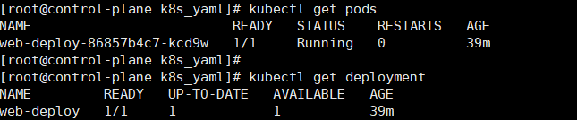
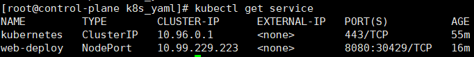
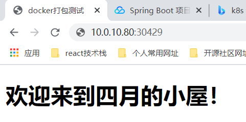
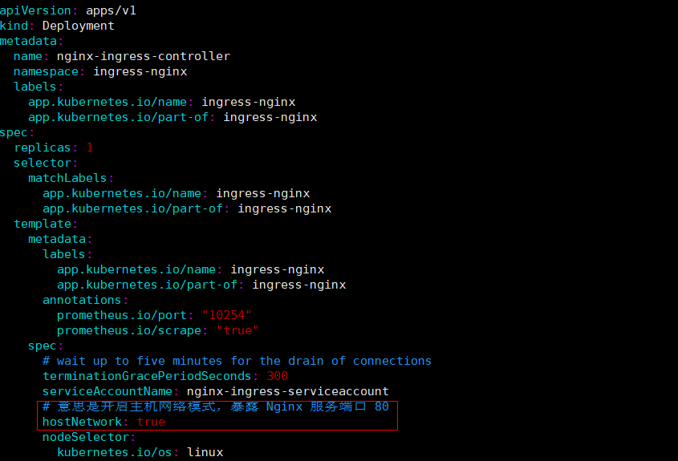

# kubernates 部署应用

> 为了实现在Kubernetes集群上部署容器化应用程序。需要创建一个Kubernetes Deployment，Deployment负责创建和更新应用。创建Deployment后，Kubernetes master 会将Deployment创建好的应用实例调度到集群中的各个节点。应用实例创建完成后，Kubernetes Deployment Controller会持续监视这些实例。如果管理实例的节点被关闭或删除，那么 Deployment Controller将会替换它们，实现自我修复能力。
>
> Pod是有生命周期的。当一个工作节点(Node)销毁时，节点上运行的Pod也会销毁，然后通过ReplicationController动态创建新的Pods来保持应用的运行。Kubernetes集群中的每个Pod都有一个独立的IP地址，甚至是同一个节点上的Pod，因此需要有一种方式来自动协调各个Pod之间的变化，以便应用能够持续运行。

## 1. 制作应用的镜像

#### 1.1 制作 DockerFile 文件

- 准备 jar 文件：[📎web_war-1.0-SNAPSHOT.jar](./files/web_war-1.0-SNAPSHOT.jar)
- 编写启动脚本

```shell
#!/bin/bash
echo "startup ..."
# 写java的全路径，有时候镜像内部未设置环境变量。nohup 后台启动方式没有成功，待后续
/usr/local/java/bin/java -jar ./web_war-1.0-SNAPSHOT.jar
```

- 编写Dockerfile

```shell
FROM kdvolder/jdk8
# 设置工作目录
WORKDIR /usr/local
# 将当前目录文件复制到工作目录中
COPY . .
# 暴露8080端口
EXPOSE 8080
# 执行启动脚本命令
ENTRYPOINT ["/bin/sh", "/usr/local/startup.sh"]
```

#### 1.2 生成镜像文件

```shell
docker build -t 镜像名:版本号 .
```

#### 1.3 启动镜像，验证服务

```shell
# 查看镜像列表
docker images
# 启动镜像服务
docker run -d -p 8080:8080 --name 镜像名 镜像名:版本号
# 查看容器启动日志
docker logs 容器ID
```


------

## 2. 制作k8s的yaml格式文件

编写内容不要出现 `-` 符号，会报语法问题。

```yaml
apiVersion: apps/v1
kind: Deployment
metadata:
    name: web_deploy
    labels:
        app: test
spec:
    replicas: 1
    selector:
        matchLabels:
            app: test
    template:
        metadata:
            labels:
                app: test
        spec:
            containers:
              name: web_container
              image: test-image:v2.0
              resources:
                requests:
                    cpu: 100m
                    memory: 400Mi
              ports:
                containerPort: 8080
```

------

## 3. 基于k8s管理镜像服务

#### 3.1 创建 deployment（同时会创建 pod）

```shell
kubectl create -f test_image.yaml
# 查看 deployment
kubectl get deployment
# 查看 pod 列表
kubectl get pods
# 查看 pod 的日志记录
kubectl logs pod名称
# 查看单个 pod 的详细信息
kubectl describe pod pod名称
```



#### 3.2 暴露端口，启动 service

**外部访问 service** 的方式有两种： `nodePort` 和 `LoadBalance` 。对内暴露服务使用： `ClusterIP`

```shell
kubectl expose deployment web-deploy --type=NodePort --port=8080
# 查看 service 服务
kubectl get service 或者 kubectl get svc
```



#### 3.3 验证服务

10.0.10.80 为当前宿主机的 IP 地址，**30429** 为随机分配的对外暴露端口。（也可以自己指定）



#### 3.4 删除 service 服务

```shell
kubectl delete services web-deploy
```


#### 3.5 删除 deployment（同时会删除 pod）

```shell
kubectl delete deployment web-deploy
```

## 4. 使用yaml文件部署服务

#### 4.1 使用NodePort网络类型部署

##### 4.1.1 命名空间配置

```shell
apiVersion: v1  
kind: Namespace  
metadata:  
        name: test 
```

##### 4.1.2 deployment配置

```shell
apiVersion: apps/v1
kind: Deployment
metadata:
    name: web-deploy
    namespace: test
spec:
    replicas: 2
    selector:
        matchLabels:
            app: web-deploy
    template:
        metadata:
            labels:
                app: web-deploy
        spec:
            containers:
            - name: web-container
              image: test-image:v2.0
              ports:
              - containerPort: 8080
```

##### 4.1.3 service配置

```shell
apiVersion: v1
kind: Service
metadata:
    name: web-deploy
    namespace: test
    labels:
        app: web-deploy
spec:
    selector:
        app: web-deploy
    type: NodePort
    ports:
      - port: 8080
      	nodePort: 32223
        targetPort: 8080
```

#### 4.2 使用Ingress Controller部署

##### 4.2.1 部署 ingress-nginx 控制器

控制器部署模板地址：https://gitee.com/agagin/ingress-nginx/blob/master/deploy/mandatory.yaml



**【注】**：在mandatory.yaml文件中添加上述配置，可以不额外写service配置。

```shell
# 启动服务
kubectl create -f mandatory.yaml
# 关闭服务
kubectl delete -f mandatory.yaml
```

##### 4.2.2 service配置

- 命名空间和deployment的配置同上所述：

```shell
apiVersion: v1
kind: Service
metadata:
    name: web-deploy
    namespace: test
    labels:
        app: web-deploy
spec:
    selector:
        app: web-deploy
    type: ClusterIP
    ports:
      - port: 8080
        targetPort: 8080
```

##### 4.2.3 ingress配置

```shell
apiVersion: extensions/v1beta1
kind: Ingress
metadata:
    name: web-deploy
    namespace: test
    annotations:
        # 指定 Ingress Controller 的类型
        kubernetes.io/ingress.class: "nginx"
        # # 指定我们的 rules 的 path 可以使用正则表达式
        nginx.ingress.kubernetes.io/use-regex: "true"
        # # 连接超时时间，默认为 5s
        nginx.ingress.kubernetes.io/proxy-connect-timeout: "600"
        # # 后端服务器回转数据超时时间，默认为 60s
        nginx.ingress.kubernetes.io/proxy-send-timeout: "600"
        # # 后端服务器响应超时时间，默认为 60s
        nginx.ingress.kubernetes.io/proxy-read-timeout: "600"
        # # 客户端上传文件，最大大小，默认为 20m
        nginx.ingress.kubernetes.io/proxy-body-size: "10m"
        # # URL 重写
        nginx.ingress.kubernetes.io/rewrite-target: /
spec:
    rules:
        - host: control-plane.minikube.internal
          http:
              paths:
                 - path: /web-deploy
                   backend:
                       serviceName: web-deploy
                       servicePort: 8080
```

**【注】**：通过 **http://control-plane.minikube.internal/web-deploy**进行地址访问