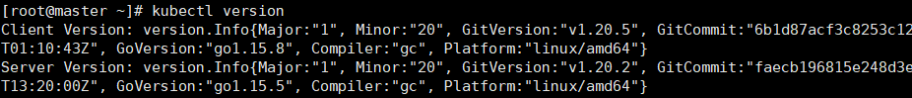
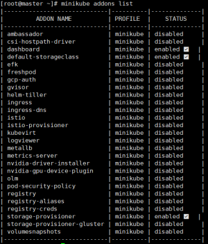

# minikube部署单机kubernetes

- **docker版本：20.10.5**
- **kubectl版本：1.20.5**
- **minikube版本：1.17.1**
- **centos版本：7.9**
- [kubernates版本信息](https://github.com/fabric8io/kubernetes-client#compatibility-matrix)：minikube默认安装最新的k8s，有一些低版本的应用，比如spark需要注意版本兼容

## 1.yum安装Docker

```
# step 0: 更新yum源
sudo yum update
# step 1: 安装必要的一些系统工具
sudo yum install -y yum-utils device-mapper-persistent-data lvm2
# Step 2: 添加软件源信息
sudo yum-config-manager --add-repo http://mirrors.aliyun.com/docker-ce/linux/centos/docker-ce.repo
# Step 3: 更新并安装 Docker-CE
sudo yum -y install docker-ce
# Step 4: 开启Docker服务
sudo systemctl start docker.service
# Step 5: 开启开机自启
sudo systemctl enable docker
```

配置阿里云镜像地址：修改或创建 **/etc/docker/daemon.json** 文件

```
{
 "registry-mirrors":["https://6kx4zyno.mirror.aliyuncs.com"]
}
```

## 2.kubectl工具安装

kubectl是Kubernetes集群的命令行工具，通过kubectl能够对集群本身进行管理，并能够在集群上进行容器化应用的安装部署。使用 curl 命令下载 kubectl 工具：

```
curl -LO https://storage.googleapis.com/kubernetes-release/release/$(curl -s https://storage.googleapis.com/kubernetes-release/release/stable.txt)/bin/linux/amd64/kubectl
```

在浏览器上输入 https://storage.googleapis.com/kubernetes-release/release/stable.txt，会返回版本信息，比如 **v1.20.5**，修改URL地址后进行下载：

```
curl -LO https://storage.googleapis.com/kubernetes-release/release/v1.20.5/bin/linux/amd64/kubectl
```

查看 kubectl 工具版本信息：



## 3.minikube在线安装

- **Minikube**是由Kubernetes社区维护的单机版的Kubernetes集群，详细见 [minikube使用文档](https://minikube.sigs.k8s.io/docs/start/)

#### 3.1 安装命令：

```
curl -Lo minikube https://github.com/kubernetes/minikube/releases/download/v1.17.1/minikube-linux-amd64 && chmod +x minikube && sudo mv minikube /usr/local/bin/
```

#### 3.2 启动minikube时报错处理

**启动命令：**

```
# 通过安装 KVM 或 VirtualBox 等工具，Minikube 可以创建虚拟机并在上面安装运行程序，如果不安装 Hypervisor 那 Minikube 就在本机上安装运行程序
# 在启动命令后也需要加上 --driver 参数
minikube start --driver=none
```


- **报错一：**Sorry, Kubernetes 1.20.2 requires conntrack to be installed in root's path
- **处理方式：yum  install  -y**  **conntrack**
- **报错二：**/proc/sys/net/bridge/bridge-nf-call-iptables contents are not set to 1
- **处理方式：echo  1  >  /proc/sys/net/bridge/bridge-nf-call-iptables**
- **报错三：**This bare metal machine is having trouble accessing https://k8s.gcr.io
- **处理方式：**在启动命令中添加国内镜像源信息


**修改后的启动命令（指定k8s的安装版本，minikube默认安装最新的）：**

```
[root@master bin]# minikube start --driver=none --image-repository=registry.cn-hangzhou.aliyuncs.com/google_containers --kubernetes-version="v1.15.3"
* minikube v1.17.1 on Centos 7.9.2009
* Using the none driver based on existing profile
* Starting control plane node minikube in cluster minikube
* Restarting existing none bare metal machine for "minikube" ...
* OS release is CentOS Linux 7 (Core)
* Preparing Kubernetes v1.20.2 on Docker 20.10.5 ...
* ......
```

**查看 minikube 的状态：**

```
[root@master bin]# minikube status
minikube
type: Control Plane
host: Running
kubelet: Running
apiserver: Running
kubeconfig: Configured
```

**查看kubernates集群的健康状态：**

```
[root@control-plane conf]# kubectl get cs
Warning: v1 ComponentStatus is deprecated in v1.19+
NAME                 STATUS    MESSAGE             ERROR
controller-manager   Healthy   ok                  
scheduler            Healthy   ok                  
etcd-0               Healthy   {"health":"true"} 
```

**查看启动后的 kubernetes 集群信息：**

```
[root@master bin]# kubectl cluster-info
Kubernetes control plane is running at https://10.0.10.80:8443
KubeDNS is running at https://10.0.10.80:8443/api/v1/namespaces/kube-system/services/kube-dns:dns/proxy
```

## 4.minikube使用

#### 4.1 minikube集群管理命令（更多命令见 minikube --help）

- 暂停Kubernetes，而不会影响已部署的应用程序：**minikube pause**
- 停止集群：**minikube stop**
- 增加默认内存限制（需要重新启动）：**minikube config set memory 16384**
- 删除minikube集群， `--all` 所有的：**minikube delete [--all]**
- 创建第二个基于v1.16.1版本的k8s集群：**minikube start -p aged --kubernetes-version=v1.16.1**
- 查看易于安装的kubernetes服务目录：**minikube addons list**

****

#### 4.2 dashboard仪表盘启动

使用 minikube 启动 k8s 集群应用的仪表盘

```
[root@master bin]# minikube dashboard
* Verifying dashboard health ...
* Launching proxy ...
* Verifying proxy health ...
http://127.0.0.1:39865/api/v1/namespaces/kubernetes-dashboard/services/http:kubernetes-dashboard:/proxy/
```

minikube 为自带的 dashboard 创建了默认的service ，并采用了 `ClusterIP` 的暴露策略，及只对集群内部提供了一个访问地址，集群外并不能直接访问，需要设置集群的代理地址。

```
[root@master bin]# nohub kubectl proxy  --port=[需要暴露的端口号] --address='[服务器IP]' --accept-hosts='^[外部访问服务器的IP]$'  >/dev/null 2>&1&
比如：10.0.10.80 为对外暴露的IP地址
nohup kubectl proxy  --port=8088 --address='10.0.10.80' --accept-hosts='^10.0.10.80$'  >/dev/null 2>&1& 
```

之后，执行 [**http://**](http://127.0.0.1:39865/api/v1/namespaces/kubernetes-dashboard/services/http:kubernetes-dashboard:/proxy/)**10.0.10.80:8088**[**/api/v1/namespaces/kubernetes-dashboard/services/http:kubernetes-dashboard:/proxy/**](http://127.0.0.1:39865/api/v1/namespaces/kubernetes-dashboard/services/http:kubernetes-dashboard:/proxy/) 即可访问仪表盘的web页面

#### 4.3 minikube部署应用

以 echoserver 服务为例，echoserver 镜像是一个简单的 HTTP 服务器，将请求的 body 携待的参数返回。这里使用阿里云的镜像源

- **创建服务的deployment和pod：**

```
sudo kubectl create deployment hello-minikube --image=registry.cn-hangzhou.aliyuncs.com/google_containers/echoserver:1.10
```