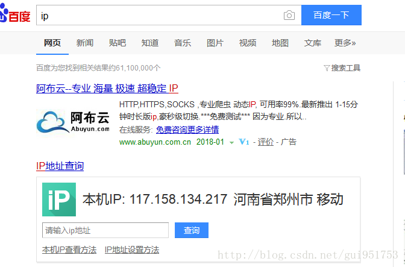
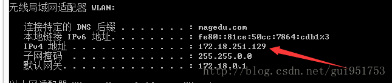
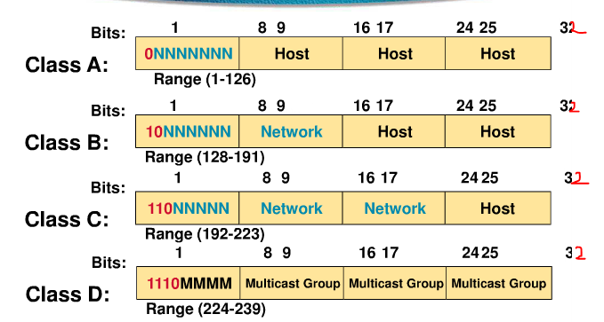
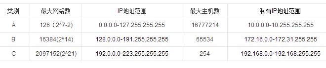
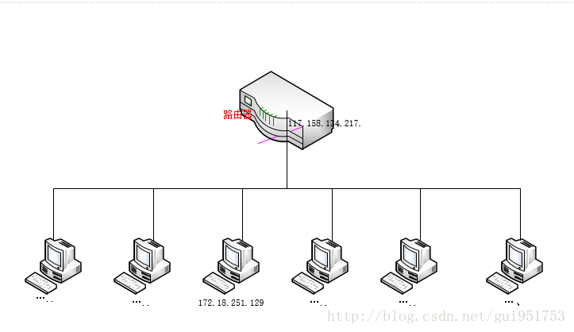
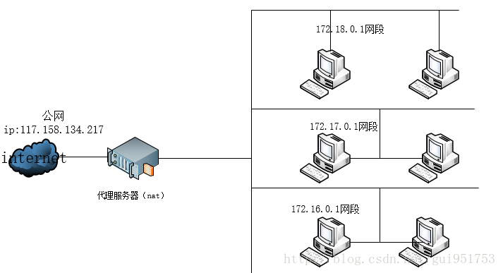

### 网络的划分，什么是A，B，C三类网络

> 本章节转自https://blog.csdn.net/gui951753/article/details/79210535

#### 背景

IP可以分为Public IP 和 Private IP,出现这种规划的原因在于IPv4所能表示的IP太少而电脑太多以至于不够用，然而只有Public IP才能直接连接上网络，所以对于那些公司，学校，政府机构等场所，就可以集中使用私有的IP进行管理，而大家可以共用一个IP去连接上公网，这样，就省下了许多宝贵的Public IP。你有没有发现，你每次使用ipconfig查到的地址，要么就是172.开头的，要么就是192.开头的，为什么？难道没有其他开头的嘛，答:基本没有。因为一个Ip分给我们一个Pc端太不划算了，一般都是很多人共享一个ip，我们用ipconfig查询到的其实只是我们的局域网IP,172.开头的意味着我们是B类型的局域网，以192.开头的意味着你是ｃ类的局域网。所以我们一直都没有接触到正真的IP，我们一直打交道的都是私有IP又叫private IP.

#### 引用问题

很多朋友常常听到什么真实IP,实体 IP, 虚拟 IP, 假的 IP...，其实没有那么复杂，在看linux私房菜的时候终于明白了这之间的区别。在上学的时候，学校老师也并不会涉及到这方面的内容。

 首先，引出问题，我们分别在百度搜IP查询，查询到本机的public IP （后文会介绍到这个概念）下图，再利用ipconfig查询到自身IP如下图。我们能看到这两个地址是不同的，那么不是说，每个主机都只有一个IP地址么，为什么我们查到的两个IP地址不一样呢。






好的，我们通过上面这两幅图能够看到第一张Ip是117.158.134.217 而第二章的Ip地址是172.18.251.129 现在我们要解释的问题就是为什么这两个Ip是不同的呢。

```
ipconfig查出来的是你本机的IP地址，也就是内网私有地址，此类地址仅在局域网使用，不能联通外网。
百度查出来的地址是你上网的共有地址，也许并不是你主机的地址，而是电信或联通分给你的地址，用于连接互联网。
```

也就是我们要引出私网Ip和公网IP这两个概念，下文会有提示。

首先我们要介绍ip的分类，因为ip常见有5种分类，而我们在实际生活中和生产中一般只会遇到A,B,C这三类地址，所以我就详细解释下这三类ip地址，我们需要知道这三种是怎么划分的。

#### IP地址划分

````
为了便于寻址以及层次化构造网络，每个IP地址包括两个标识码（ID），即网络ID和主机ID。同一个物理网络上的所有主机都使用同一个网络ID，网络上的一个主机（包括网络上工作站，服务器和路由器等）有一个主机ID与其对应。Internet委员会定义了5种IP地址类型以适合不同容量的网络，即A类~E类。
````





| 类别 | 默认子网掩码  | 支持主机数 |
| :--: | :-----------: | :--------: |
|  A   |   255.0.0.0   |   2^24-2   |
|  B   |  255.255.0.0  |   2^16-2   |
|  C   | 255.255.255.0 |   2^8-2    |


#### public IP和private Ip的概念和区别：

- Public IP : 公共 IP ，经由 INTERNIC 所统一规划的 IP，有这种 IP 才可以连上 Internet ；
- Private IP : 私有 IP 或保留 IP，不能直接连上 Internet 的 IP ，主要用于局域网络内的主机联机规划。

早在 IPv4 规划的时候就担心 IP 会有不足的情况，而且为了应付某些企业内部的网络设定，于是就有了私有IP (Private IP) 的产生了。私有 IP 也分别在 A, B, C 三个 Class 当中各保留一段作为私有 IP 网段，那就是：

- Class A：10.0.0.0  - 10.255.255.255
- Class B：172.16.0.0 - 172.31.255.255
- Class C：192.168.0.0 - 192.168.255.255

由于这三段 Class 的 IP 是预留使用的，所以并不能直接作为Internet 上面的连接之用，不然的话，到处就都有相同的IP 啰！那怎么行！网络岂不混乱？所以啰，这三个 IP 网段就只做为内部私有网域的IP 沟通之用。一般说来，我们用Ipcofig是无法查到公网ip的，大多数时候，你使用ipconfig查到的一般就只是以172.开头的b类私有Ip，或者以192.168开头的c类私有Ip.简单的说，s私有ip有底下的几个限制：

- 私有 IP 的路由信息不能对外散播 (只能存在内部网络)；
- 使用私有 IP 作为来源或目的地址的封包，不能透过 Internet 来转送 (不然网络会混乱)；
- 关于私有 IP 的参考纪录(如 DNS)，只能限于内部网络使用 (一样的原理啦)

这个私有 IP 有什么好处呢？由于他的私有路由不能对外直接提供信息，所以，你的内部网络将不会直接被 Internet 上面的 Cracker 所攻击！但是，你也就无法以私有 IP 来『直接上网』啰！因此相当适合一些尚未具有Public IP 的企业内部用来规划其网络之设定！否则当你随便指定一些可能是Public IP 的网段来规划你企业内部的网络设定时，万一哪一天真的连上Internet 了，那么岂不是可能会造成跟 Internet 上面的 Public IP 相同了吗？

只有公网ip是能够连接互联网的，私网IP 一般只用作局域网


| 类别 | IP范围                    | 私有地址范围                | 保留地址                    |
| :--- | :------------------------ | :-------------------------- | :-------------------------- |
| A    | 1.0.0.0~126.255.255.255   | 10.0.0.0~10.255.255.255     | 127.0.0.0~127.255.255.255   |
| B    | 128.0.0.0~191.255.255.255 | 172.16.0.0~172.31.255.255   | 169.254.0.0~169.254.255.255 |
| C    | 192.0.0.0~223.255.255.255 | 192.168.0.0~192.168.255.255 | 无                          |

#### 总结：

 我们能够上网靠的是isp组织分给我们的Ip地址，但是这个ip地址一般不是给个人的，一般都是给一个单位，一个区域的，也就是说我们实际上能接触到的一般都是私有地址，即我们用ipconig查到的都是私有地址，也就相当于局域网内的ip地址，当我们真正联网时，会先把数据发送到路由，然后再由路由进行处理实现真正的联网操作，路由的地址才是真正联网的Ip地址，也就是pubilc ip，而我们在自己电脑上查到的都是私有ip

 举个例子，我们在学校或者查到的Ip一般都是172.开头的，比如上图我的地址，那就是在学校里检测到的ip地址，通常是b类地址，而我们在家里一般用的都是c类地址。也就是一般是192.168开头的地址。这个大家可以自行去验证一下。如果看完所有的你还有疑问，可以去参考知乎上有关该问题的回答，下面是网址:

[
知乎解答该问题的帖子](https://www.zhihu.com/question/66785037)

#### 整理上网流程：

 我们重新整理一下我们上网的路线，看下图，移动公司分给我们的ip是117.158.134.217，这是我们这一栋楼能连上网的公网Ip,那么如何让这一个ip使学校里面的所有人都能使用呢，我们开始重新划分局域网。上文中，我们知B类私有地址范围是：172.16.0.0~172.31.255.255，我们学校采取的就是这种划分方法，所以我的私网ip地址就是172.18.251.129.那么怎么连上网的呢，我们通过私网ip然后把我们的需求和要发送的数据发给路由器，然后路由器对接网络，再把数据发送给Internet.然后internet发送数据到我们学校的路由，然后路由在通过我的私网ip发送给我，这就是我们真实上网的流程。



#### 遗留问题

大家可能也注意到了一个问题，就是我们在百度查到的ip是117开头的，也就是说其实是a类，但是我们这边私网Ip却是172开头的，是b类的私有ip地址，那么问题来了？117开头的IP地址是如何转换成172开头的私有ip的呢？他们之间一定有一个转换关系，构成了一个公网和私网之间的一个映射。这个关系是什么呢？？？

#### 自问自答

在查阅了多方资料之后，这个问题其实就是私网Ip和公网Ip的转换这个问题，其实利用到了nat转换技术，将172.16.xxx.xxx~172.31.xxx.xxx转换到公网ip,也就是我图中所示的那个郑州的117开头的ip。我们的私网ip是自成体系的，在合理的建设完私网ip后，我们只需利用nat技术将公网ip和私网ip做一个转换即可。大概就跟下图所示一样，二楼使用的是172.16.xx.xx开头的网址，三楼是172.17.xx.xx,四楼是172.18.xx.xx，从图中可以有一个很清晰地认识



#### 后记

随着学校换地方，我们的Ip也发生了一些微妙的变化。我们搬到了一个新的环境，还没搭建起服务器。当我使用Ipconfig命令来查询自己的ip地址的时候，我们发现了一个奇怪的事情，我们获取到的ip地址是一个以169开头的ip地址，上文已经提到过我们正常情况下获到的地址应该是一个以172.16~172.31这之间开头的，那么为什么会出现169开头的呢？

169开头的是一个保留地址，是本地连接受限时系统自动分配的ip没有什么实际的意义，出现这种情况可能是服务器还没搭建好。果然，等我们重新搭建好了代理服务器之后，我们的网址又变回了现在的172.18开头的网址。

#### 总结

**什么是子网掩码**

子网掩码主要是用来划分网络以及区分网络号与主机号。简单来说，子网掩码的作用是为了表述网络状态的一种补充技术。比如随意给一个IP地址。172.16.32.64。在不给你子网掩码的时候，你甚至都不能确定这是否是一个合法的IP地址。因为如果给一个/26以上的子网掩码地址的话这个地址就代表了网段地址。不能直接配给主机使用。

人们使用子网掩码划分了网段，最初时候网段是按照A、B、C类来划分的，当然还有D、E类地址，那个是属于特殊地址，暂时不在讨论范围。但是使用中会发现划分好的地址类会造成浪费，空白大半个网段地址或一个地址段不够用。后期就用可变子网掩码来做“订制服务”了。

另外，这里插播一个小知识。子网掩码是为了划分网段，划分网段是为了干什么呢？

划分网段是为了隔离广播域。在一个二层网络中，有很多特殊业务的数据帧是需要“广播”给全体成员的。成员在接收到广播后查看是否和自己有关，如果无关就丢弃，如果有关就接收并处理。这就像是大家微信里的工作群，部门群，公司群等一样。平以里面这个@一下这位同事，一会又被@回去。如果人员不是太多的话还好。如果一个群里有几百上千人，可用想象你的手机会响成什么样。别的活还干不干了？所以大家一般都屏蔽了大群，自己开部门群或者相关业务群的吧。这就是隔离广播域，广播域越小，受到的干扰就相对较少。

这里又出现问题了，如果大家都不看大群，大群里通知的内容大家都没看到怎么办？老大会在大群里找各个部门的部门领导，找到领导后也就相当于定位到了他所在的部门群，这就是路由寻址。路由寻址时通常会模糊到找这个网段的地址。这时也可以用可变子网掩码技术做网段聚合，也就是CIDR。比如某公司用了两个C类网线，192.168.0.0/24和192.168.1.0/24。就可以直接聚合成一个大的网段地址作为这个公司的路由寻址。如192.168.0.0/23（这里只是举例，192.168.X.X的地址段是私有地址段，不能直接接入公网的）