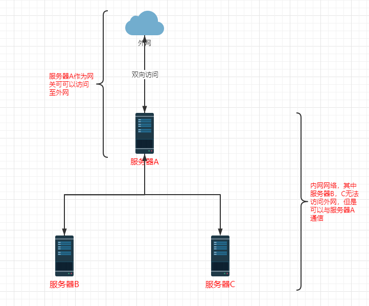
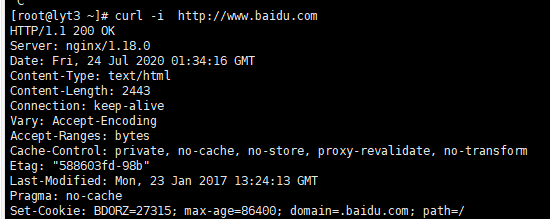
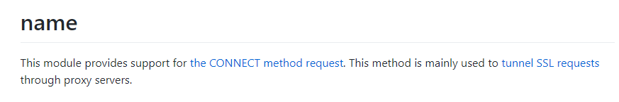
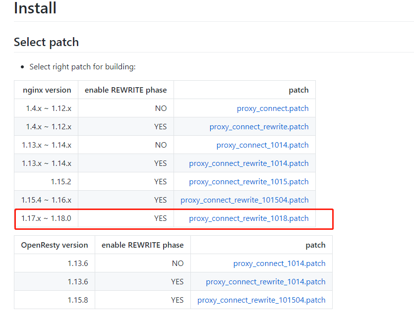
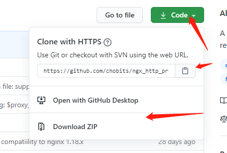
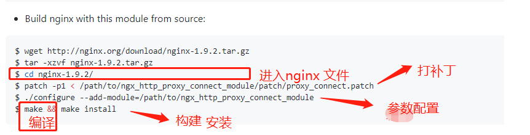
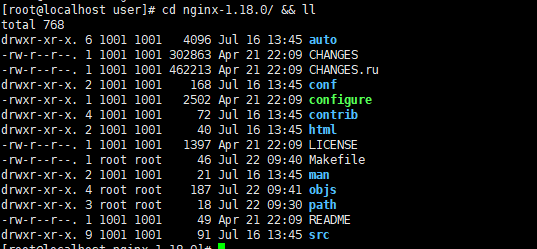
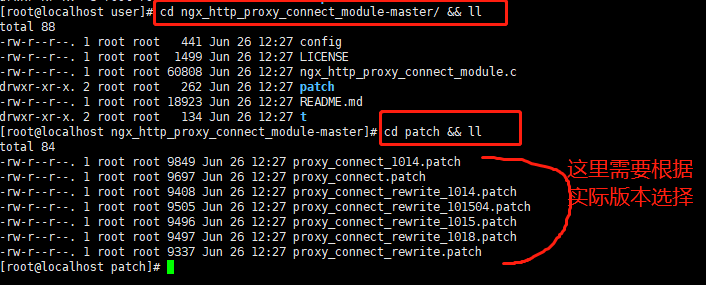

# 1.需求描述
nginx正向代理

如图所示，公司内网为了安全考虑，只提供一台服务器可与外网作为网关，进行访问。

1.服务器A可以访问外网；

2.服务器B，C无法访问外网；

3.服务器ABC之间内网互通；

需求原因：内部web系统，部署在BC上，其中有直接访问外网的部分第三方接口。

需求目的：使BC服务器可以正常访问外网。



# 2.分析
基于nginx的正向代理，在服务器A搭建一个代理服务器，使得BC可以通过服务器A的nginx 代理进行访问外网。

 

# 3.nginx搭建正向代理
nginx版本 1.18


以下示例采用源代码安装方式

## 3.1   服务器ABC测试
>  curl -i http://www.baidu.com

A 服务器（网关） 正常返回200



BC服务器

使用命令后在一段时间后返回无法访问。

## 3.2 下载https所需模块
没有这个nginx就无法代理https的请求，

地址：https://github.com/chobits/ngx_http_proxy_connect_module

ngx_http_proxy_connect_module模块主要用于隧道SSL请求的代理服务器



版本要求：



当然你可以先下载下来，

几种下载方式，最终上传到我们的服务器A中



## 3.3 安装 ngx_http_proxy_connect_module
将所需未见上传到服务器。如下我们已经解压成功

zip文件 的解压命令为 unzip xxx

gz文件 的解压命令为 tar -axvf xxx


参考官网示例进行安装：

 

### 3.3.1. 进入nginx
````shell
cd nginx-1.18.0/ && ll
````



### 3.3.2.打补丁
执行命令

````shell
patch -p1 < /opt/user/ngx_http_proxy_connect_module-master/patch/proxy_connect_rewrite_1018.patch
````

其中 /opt/user为我当前存放目录，请根据实际情况进行变更

补丁版本选择如下：

例如我的nginx是1.18的那么我选择




### 3.3.3.参数配置 
./configure --prefix=/usr/local/nginx --add-module=/opt/user/ngx_http_proxy_connect_module-master --with-http_ssl_module
同样需要注意的是你存放补丁的位置以及你需要安装的位置根据你的实际情况变更

### 3.3.4.编译
````shell
make
````

如是第一次安装nginx直接进入下一步

 第二次安装执行如下

（1.）对原始nginx 进行备份

进入到之前你的nginx执行启动脚本，进行备份，以防出错，可进行回滚

````shell
cp nginx nginx.bank
````

（2.）复制新编译的nginx替换之前的

根据实际情况变更目录

````shell
cp objs/nginx /usr/local/nginx/sbin/nginx
````

这个在make后会存放在

### 3.3.5.安装（非初次安装请勿执行）
````shell
make install
````

# 4.配置nginx正向代理文件
## 4.1.添加server模块
在nginx.conf中加入server模块。

以下三个可自定义

1.使用DNS 114.114.144.144

2.使用端口：8981

3.日志记录 /var/log/nginx/proxy/xx.log

配置文件如下，以下支持http和https代理


        server {
               resolver 114.114.114.114;       #指定DNS服务器IP地址 
                listen 8981;
                access_log  /var/log/nginx/proxy/access.log;
                proxy_connect;
                proxy_connect_allow 443 563;
                proxy_connect_connect_timeout 10s;
                proxy_connect_read_timeout 10s;
                proxy_connect_send_timeout 10s;
                location / {
                #proxy_pass  $scheme://$http_host$request_uri;
     
                proxy_set_header Host $http_host;
                proxy_pass https://$host$request_uri;    #设定代理服务器的协议和地址 
                proxy_buffers 256 4k;
                proxy_max_temp_file_size 0k;
                proxy_connect_timeout 30;
                proxy_send_timeout 60;
                proxy_read_timeout 60;
                proxy_next_upstream error timeout invalid_header http_502;
         }
}
## 4.2开放端口
使用的端口为8981

### 4.2.1查询端口是否开放
````shell
firewall-cmd --query-port=8981/tcp
````

no代表未开放

### 4.2.2 开放端口
````shell
firewall-cmd --permanent --add-port=8981/tcp
````

### 4.2.3重启防火墙
(修改配置后要重启防火墙)  ---必须操作

````shell
 firewall-cmd --reload
````

# 5.服务器BC配置
## 5.1 服务器配置
````shell
 vim /etc/profile
````


### 5.2 添加代理
其中我都A服务器Ip为：10.26.2.36 

export http_proxy   需要代理的http访问地址
export https_proxy  需要代理的https 访问地址

export no_proxy=服务器BC访问地址时不需要进行代理的是哪些，。这个一般可以不需要使用

````shell
export http_proxy=10.26.2.36:8981
export https_proxy=10.26.2.36:8981

export no_proxy=10.26.2.36,域名
````


### 5.3配置生效

````shell
source /etc/profile
````

————————————————
原文链接：https://blog.csdn.net/luChenH/article/details/107553493