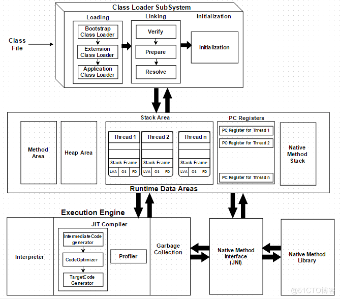
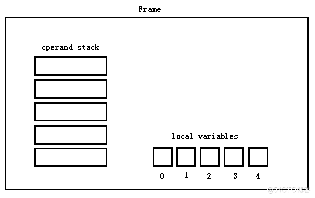

## Java ASM系列：（013）方法的初始Frame

> 转载自：https://blog.51cto.com/lsieun/2942716

## 1. Frame内存结构

JVM Architecture由Class Loader SubSystem、Runtime Data Areas和Execution Engine三个主要部分组成，如下图所示。其中，Runtime Data Areas包括Method Area、Heap Area、Stack Area、PC Registers和Native Method Stack等部分。



在程序运行的过程中，每一个线程（Thread）都对应一个属于自己的JVM Stack。当一个新线程（Thread）开始的时候，就会在内存上分配一个属于自己的JVM Stack；当该线程（Thread）执行结束的时候，相应的JVM Stack内存空间也就被回收了。

在JVM Stack当中，是栈的结构，里面存储的是frames；每一个frame空间可以称之为Stack Frame。当调用一个新方法的时候，就会在JVM Stack上分配一个frame空间；当方法退出时，相应的frame空间也会JVM Stack上进行清除掉（出栈操作）。在frame空间当中，有两个重要的结构，即local variables和operand stack。



在Stack Frame当中，operand stack是一个栈的结构，遵循“后进先出”（LIFO）的规则，local variables则是一个数组，索引从`0`开始。

对于每一个方法来说，它都是在自己的Stack Frame上来运行的，在编译的时候，就决定了local variables和operand stack的大小。在方法运行的过程中，方法里的数据需要放到local variables和operand stack上来进行计算。那么，在方法刚开始的时候，local variables和operand stack是一个什么样的状态呢？

## 2. 方法的初始Frame

在方法刚开始的时候，operand stack是空，不需要存储任何的数据，而local variables的初始状态，则需要考虑三个因素：

- 当前方法是否为static方法。如果当前方法是non-static方法，则需要在local variables索引为`0`的位置存在一个`this`变量；如果当前方法是static方法，则不需要存储`this`。

- 当前方法是否接收参数。方法接收的参数，会按照参数的声明顺序放到local variables当中。
- 方法参数是否包含`long`或`double`类型。如果方法的参数是`long`或`double`类型，那么它在local variables当中占用两个位置。

### 2.1 static方法

假设`HelloWorld`当中有一个静态`add(int, int)`方法，如下所示：

````java
public class HelloWorld {
    public static int add(int a, int b) {
        return a + b;
    }
}
````

我们可以通过运行`HelloWorldFrameCore`类，来查看`add(int, int)`方法的初始Frame：

````java
[int, int] []
````

在上面的结果中，第一个`[]`中存放的是local variables的数据，在第二个`[]`中存放的是operand stack的数据。

该方法包含的Instruction内容如下（使用`javap -c sample.HelloWorld`命令查看）：

````java
public static int add(int, int);
  Code:
     0: iload_0
     1: iload_1
     2: iadd
     3: ireturn
````

该方法整体的Frame变化如下：

````java
add(II)I
[int, int] []
[int, int] [int]
[int, int] [int, int]
[int, int] [int]
[] []
````

### 2.2 non-static方法

假设`HelloWorld`当中有一个非静态`add(int, int)`方法，如下所示：

````java
public class HelloWorld {
    public int add(int a, int b) {
        return a + b;
    }
}
````

我们可以通过运行`HelloWorldFrameCore`类，来查看`add(int, int)`方法的初始Frame：

````java
[sample/HelloWorld, int, int] []
````

该方法包含的Instruction内容如下：

````java
public int add(int, int);
  Code:
     0: iload_1
     1: iload_2
     2: iadd
     3: ireturn
````

该方法整体的Frame变化如下：

````java
add(II)I
[sample/HelloWorld, int, int] []
[sample/HelloWorld, int, int] [int]
[sample/HelloWorld, int, int] [int, int]
[sample/HelloWorld, int, int] [int]
[] []
````

### 2.3 long和double类型

假设`HelloWorld`当中有一个非静态`add(long, long)`方法，如下所示：

````java
public class HelloWorld {
    public long add(long a, long b) {
        return a + b;
    }
}
````

我们可以通过运行`HelloWorldFrameCore`类，来查看`add(long, long)`方法的初始Frame：

````java
[sample/HelloWorld, long, top, long, top] []
````

该方法包含的Instruction内容如下：

````java
public long add(long, long);
  Code:
     0: lload_1
     1: lload_3
     2: ladd
     3: lreturn
````

该方法整体的Frame变化如下：

````java
add(JJ)J
[sample/HelloWorld, long, top, long, top] []
[sample/HelloWorld, long, top, long, top] [long, top]
[sample/HelloWorld, long, top, long, top] [long, top, long, top]
[sample/HelloWorld, long, top, long, top] [long, top]
[] []
````

## 3. 总结

本文对方法初始的Frame进行了介绍，内容总结如下：

- 第一点，在JVM当中，每一个方法的调用都会分配一个Stack Frame内存空间；在Stack Frame内存空间当中，有local variables和operand stack两个重要结构；在Java文件进行编译的时候，方法对应的local variables和operand stack的大小就决定了。

- 第二点，如何计算方法的初始Frame。在方法刚开始的时候，Stack Frame中的operand stack是空的，而只需要计算local variables的初始状态；而计算local variables的初始状态，则需要考虑当前方法是否为static方法、是否接收方法参数、方法参数中是否有`long`和`double`类型。

