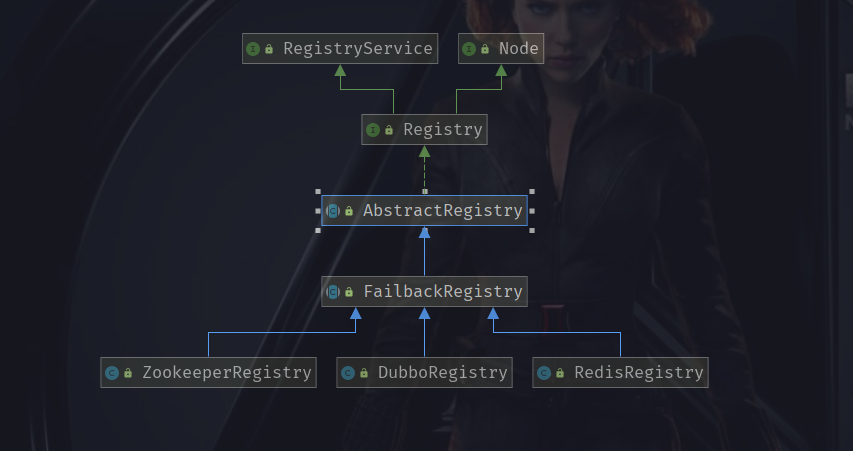

## 注册中心作用

开篇首先想思考一个问题，没有注册中心 Dubbo 还能玩下去吗？

当然可以，只要知道服务提供者地址相关信息，消费者配置之后就可以调用。如果只有几个服务，这么玩当然没问题。但是生产服务动辄成千上百，如果每个服务都需要手写配置信息，想象一下是多么麻烦。

好吧，如果上面的问题都不是事的话，试想一下如果一个服务提供者在运行过程中宕机，消费者怎么办？消费者不知情，所以它还会不断把请求发往服务提供者，然后不断失败。这个时候唯一的办法就是修改服务地址信息，然后重启服务。

可以看到如果没有注册中心，分布式环境中服务查找发现将会非常麻烦，一切需要手工配置，无法完成自动化。所以这里就需要一个第三者，协调服务提供者与消费者之间关系，这就是注册中心。

注册中心主要作用如下：

1. 动态加入,服务提供者通过注册中心动态的把自己暴露给消费者，无需消费者逐个更新配置文件。
2. 动态发现服务，消费者可以动态发现新的服务，无需重启生效。
3. 统一配置，避免本地配置导致每个服务配置不一致。
4. 动态调整，注册中心支持参数动态调整，新参数自动更新到所有相关的服务节点。
5. 统一管理，依靠注册中心数据，可以统一管理配置服务节点。

## 注册中心工作流程

注册中心工作流程总体比较简单，流程图大致如下：


主要工作流程可以分为如下几步：

1. 服务提供者启动之后，会将服务注册到注册中心。
2. 消费者启动之后主动订阅注册中心上提供者服务，从而获取到当前所有可用服务，同时留下一个回调函数。
3. 若服务提供者新增或下线，注册中心将通过第二步的注册的回调函数通知消费者。
4. dubbo-admin(服务治理中心)将会会订阅服务提供者以及消费者，从而可以在控制台管理所有服务提供者以及消费者。

Dubbo 之前版本主要可以使用 ZooKeeper，Redis 作为注册中心 ，而随着 Dubbo 版本不断更新，目前还支持 nacos，consul，etcd 等做为注册中心。

## Dubbo 注册中心核心源码

> **ps: 以下源码基于 dubbo 2.5.x 版本**

注册中心实现使用模板模式，源码位于 dubbo-registry 模块，类关系如下图：



最上层的 `RegistryService` 接口定义了核心方法，分别为注册，取消注册，订阅，取消订阅以及查询。


中间层抽象类主要实现通用逻辑，如：`AbstractRegistry` 实现缓存机制，`FailbackRegistry` 实现失败重试功能。

底层 `ZookeeperRegistry`等为具体实现类，实现与 ZooKeeper 等注册中心交互的逻辑。

接下去我们具体分析 `AbstractRegistry` 与 `FailbackRegistry` 逻辑。

## `AbstractRegistry` 缓存实现的原理

如果每次服务调用都需要调用注册中心实时查询可用服务列表，不但会让注册中心承受巨大的流量压力，还会产生额外的网络请求，导致系统性能下降。

其次注册中心需要非强依赖，其宕机不能影响正常的服务调用。

基于以上几点，注册中心模块在 `AbstractRegistry` 类中实现通用的缓存机制。这里的缓存可以分为两类，内存服务缓存以及磁盘文件缓存。

### 内存服务缓存

内存服务缓存很好理解也最容易实现，`AbstractRegistry`使用一个 `ConcurrentMap`保存相关信息。

```java
 private final ConcurrentMap<URL, Map<String, List<URL>>> notified = new ConcurrentHashMap<>();
```

这个集合中 key 为消费者的 URL，而 value 为一个 Map 集合。这个内层 Map 集合使用服务目录作为 key，分别为 providers，routers，configurators，consumers 四类，value 则是对应服务列表集合。

### 磁盘文件缓存

由于服务重启就会导致内存缓存消失，所以额外增加磁盘文件缓存。

文件缓存默认位置位于 `${user.home}/.dubbo/`文件夹，文件名为`dubbo-registry-${application.name}-${register_address}.cache`。可以设置 `dubbo.registry.file` 配置信息从而修改默认配置，实现源码如下：

```java
String filename = url.getParameter(Constants.FILE_KEY, System.getProperty("user.home") + "/.dubbo/dubbo-registry-" + url.getParameter(Constants.APPLICATION_KEY) + "-" + url.getAddress() + ".cache");
```

> ps: ${application.name} 取自 `dubbo.application.name` 信息，${register_address} 取值注册中心地址信息。缓存文件完整名称为：`C:\Users\xxx/.dubbo/dubbo-registry-dubbo-auto-configure-consumer-sample-127.0.0.1:2181.cache`

缓存文件内容使用 `properties` 配置文件格式，即 `key=value` 格式。key为服务接口名称，value 为服务列表，由于服务可能存在多个，将会使用空格分隔。

**缓存文件的加载**

dubbo 程序初始化的时候，`AbstractRegistry` 构造函数将会从本地磁盘文件中将数据读取到 `Properties` 对象实例中，后续都将会先写入 `Properties`，最后再将里面信息再写入文件。

缓存初始化的源码为下图。

```java
private void loadProperties() {
    if (file != null && file.exists()) {
        InputStream in = null;
        try {
            //读取磁盘缓存文件
            in = new FileInputStream(file);
            //由于文件内容为键值信息，所以使用Properties对象缓存文件信息
            properties.load(in);
            if (logger.isInfoEnabled()) {
                logger.info("Load registry store file " + file + ", data: " + properties);
            }
        } catch (Throwable e) {
            logger.warn("Failed to load registry store file " + file, e);
        } finally {
            if (in != null) {
                try {
                    in.close();
                } catch (IOException e) {
                    logger.warn(e.getMessage(), e);
                }
            }
        }
    }
}
```

**缓存文件的保存与更新**

缓存文件将会通过 `AbstractRegistry#notify` 方法保存或更新。客户端第一次订阅服务获取的全量数据，或者后续回调中获取到新数据，都将会调用 `AbstractRegistry#notify` 方法，用来更新内存缓存以及文件缓存。

*`notify` 方法源码如下图：*

```java
protected void notify(URL url, NotifyListener listener, List<URL> urls) {
    if (url == null) {
        throw new IllegalArgumentException("notify url == null");
    }
    if (listener == null) {
        throw new IllegalArgumentException("notify listener == null");
    }
    if ((urls == null || urls.size() == 0)
            && !Constants.ANY_VALUE.equals(url.getServiceInterface())) {
        logger.warn("Ignore empty notify urls for subscribe url " + url);
        return;
    }
    if (logger.isInfoEnabled()) {
        logger.info("Notify urls for subscribe url " + url + ", urls: " + urls);
    }
    Map<String, List<URL>> result = new HashMap<String, List<URL>>();
    for (URL u : urls) {
        if (UrlUtils.isMatch(url, u)) {
            String category = u.getParameter(Constants.CATEGORY_KEY, Constants.DEFAULT_CATEGORY);
            List<URL> categoryList = result.get(category);
            if (categoryList == null) {
                categoryList = new ArrayList<URL>();
                result.put(category, categoryList);
            }
            categoryList.add(u);
        }
    }
    if (result.size() == 0) {
        return;
    }
    Map<String, List<URL>> categoryNotified = notified.get(url);
    if (categoryNotified == null) {
        notified.putIfAbsent(url, new ConcurrentHashMap<String, List<URL>>());
        categoryNotified = notified.get(url);
    }
    for (Map.Entry<String, List<URL>> entry : result.entrySet()) {
        String category = entry.getKey();
        List<URL> categoryList = entry.getValue();
        /**
         * 更新内存缓存
         */
        categoryNotified.put(category, categoryList);
        /**
         * 更新注册信息到缓存文件中
         */
        saveProperties(url);
        listener.notify(categoryList);
    }
}
```

在保存文件缓存方法中，首先把根据 URL 取出的数据，拼接成字符串，然后写入上面提到过的 `properties` 对象中，最后输出到文件中。

这里可以选择两种保存方式，同步或异步。由于 `notify` 可能被多次调用，为了提高系统能，系统默认使用异步方式保存。

*`saveProperties` 方法源码如下：*

```java
private void saveProperties(URL url) {
    if (file == null) {
        return;
    }

    try {
        StringBuilder buf = new StringBuilder();
        Map<String, List<URL>> categoryNotified = notified.get(url);
        if (categoryNotified != null) {
            for (List<URL> us : categoryNotified.values()) {
                for (URL u : us) {
                    if (buf.length() > 0) {
                        //多个服务列表将会使用空格隔开
                        buf.append(URL_SEPARATOR);
                    }
                    buf.append(u.toFullString());
                }
            }
        }
        properties.setProperty(url.getServiceKey(), buf.toString());
        long version = lastCacheChanged.incrementAndGet();
        //默认选择异步的方式保存
        if (syncSaveFile) {
            doSaveProperties(version);
        } else {
            registryCacheExecutor.execute(new SaveProperties(version));
        }
    } catch (Throwable t) {
        logger.warn(t.getMessage(), t);
    }
}
```

`doSaveProperties` 方法最终将会将信息写入缓存。考虑到保存方法可能会被多个线程同时调用，这里使用 CAS 方法，首先比较版本大小，若小于，代表有新线程正在写入信息，本次更新直接丢弃。

其次考虑到多个 dubbo 应用可能共用一份缓存文件，所以这里使用文件排他锁当做分布式锁，防止多个应用并发操作同一份文件。

一旦文件写入异常或者获取锁失败，保存操作将会不断重试，直到超过最大次数。

> **ps: dubbo 2.7.2 之前重试没有设置最大次数，如果文件没有权限保存，保存将会一直失败，异步线程将会陷入死循环。**

*`doSaveProperties` 方法源码如下：*

```java
public void doSaveProperties(long version) {
    //比较传入的版本，如果小于就代表有其他线程在发起保存操作，就说明服务列表有更新
    if (version < lastCacheChanged.get()) {
        return;
    }
    if (file == null) {
        return;
    }
    // Save
    try {
        //为了防止多个dubbo应用共用同一份缓存文件，所以临时创建一个文件，当做分布式锁
        File lockfile = new File(file.getAbsolutePath() + ".lock");
        if (!lockfile.exists()) {
            lockfile.createNewFile();
        }
        RandomAccessFile raf = new RandomAccessFile(lockfile, "rw");
        try {
            FileChannel channel = raf.getChannel();
            try {
                FileLock lock = channel.tryLock();
                if (lock == null) {
                    throw new IOException("Can not lock the registry cache file " + file.getAbsolutePath() + ", ignore and retry later, maybe multi java process use the file, please config: dubbo.registry.file=xxx.properties");
                }
                // Save
                try {
                    if (!file.exists()) {
                        file.createNewFile();
                    }
                    FileOutputStream outputFile = new FileOutputStream(file);
                    try {
                        properties.store(outputFile, "Dubbo Registry Cache");
                    } finally {
                        outputFile.close();
                    }
                } finally {
                    lock.release();
                }
            } finally {
                channel.close();
            }
        } finally {
            raf.close();
        }
    } catch (Throwable e) {
        if (version < lastCacheChanged.get()) {
            return;
        } else {
            //如果保存文件异常或者有其他dubbo应用正在操作缓存文件，将会重试保存操作
            registryCacheExecutor.execute(new SaveProperties(lastCacheChanged.incrementAndGet()));
        }
        logger.warn("Failed to save registry store file, cause: " + e.getMessage(), e);
    }
}
```

### `FailbackRegistry` 重试机制

`FailbackRegistry` 继承 `AbstractRegistry`，实现了 `register`，`subscribe`等通用法，并增加 `doRegister`，`doSubscribe` 等模板方法，交由子类实现。

如果 `doRegister` 等模板方法发生异常，会将失败任务放入集合，然后定时再次调用模板方法。

`FailbackRegistry` 失败重试集合分别为：

```java
//注册失败集合
private final Set<URL> failedRegistered = new ConcurrentHashSet<URL>();

//取消注册失败集合
private final Set<URL> failedUnregistered = new ConcurrentHashSet<URL>();

//订阅失败集合
private final ConcurrentMap<URL, Set<NotifyListener>> failedSubscribed = new ConcurrentHashMap<URL, Set<NotifyListener>>();

//取消订阅失败集合
private final ConcurrentMap<URL, Set<NotifyListener>> failedUnsubscribed = new ConcurrentHashMap<URL, Set<NotifyListener>>();

//通知失败集合
private final ConcurrentMap<URL, Map<NotifyListener, List<URL>>> failedNotified = new ConcurrentHashMap<URL, Map<NotifyListener, List<URL>>>();
```

以 `subscribe` 方法为例，这里将会调用这些 `doSubscribe` 的模板方法。如果发生异常将会读取缓存文件中内容，然后加载服务。最后新建异步定时任务加入重试集合中，然后由定时器去重试这些任务。

*`FailbackRegistry#subscribe` 方法源码：*

```java
public void subscribe(URL url, NotifyListener listener) {
    //调用父类订阅方法
    super.subscribe(url, listener);
    removeFailedSubscribed(url, listener);
    try {
        // Sending a subscription request to the server side
        //调用子类订阅末班方法
        doSubscribe(url, listener);
    } catch (Exception e) {
        Throwable t = e;

        //从缓存文件中取出信息
        List<URL> urls = getCacheUrls(url);
        if (urls != null && urls.size() > 0) {
            //加载缓存文件服务列表
            notify(url, listener, urls);
            logger.error("Failed to subscribe " + url + ", Using cached list: " + urls + " from cache file: " + getUrl().getParameter(Constants.FILE_KEY, System.getProperty("user.home") + "/dubbo-registry-" + url.getHost() + ".cache") + ", cause: " + t.getMessage(), t);
        } else {
            // If the startup detection is opened, the Exception is thrown directly.
            boolean check = getUrl().getParameter(Constants.CHECK_KEY, true)
                    && url.getParameter(Constants.CHECK_KEY, true);
            boolean skipFailback = t instanceof SkipFailbackWrapperException;
            if (check || skipFailback) {
                if (skipFailback) {
                    t = t.getCause();
                }
                throw new IllegalStateException("Failed to subscribe " + url + ", cause: " + t.getMessage(), t);
            } else {
                logger.error("Failed to subscribe " + url + ", waiting for retry, cause: " + t.getMessage(), t);
            }
        }

        // Record a failed registration request to a failed list, retry regularly
        //加入失败重试集合
        addFailedSubscribed(url, listener);
    }
}
```

在 `addFailedSubscribed` 中将会新建定时任务，然后交由定时器执行。定时任务默认最大重试次数为 3 次，调用时间间隔默认为 5 s。

*`addFailedSubscribed` 源码如下：*

```
    public FailbackRegistry(URL url) {
        super(url);
        int retryPeriod = url.getParameter(Constants.REGISTRY_RETRY_PERIOD_KEY, Constants.DEFAULT_REGISTRY_RETRY_PERIOD);
        /**
         * 定时检测注册中心，如果失败了就重连,就是上文提到的4个失败Map
         */
        this.retryFuture = retryExecutor.scheduleWithFixedDelay(new Runnable() {
            public void run() {
                // Check and connect to the registry
                try {
                    retry();
                } catch (Throwable t) { // Defensive fault tolerance
                    logger.error("Unexpected error occur at failed retry, cause: " + t.getMessage(), t);
                }
            }
        }, retryPeriod, retryPeriod, TimeUnit.MILLISECONDS);
    }


private void addFailedSubscribed(URL url, NotifyListener listener) {
    Set<NotifyListener> listeners = failedSubscribed.get(url);
    if (listeners == null) {
        failedSubscribed.putIfAbsent(url, new ConcurrentHashSet<NotifyListener>());
        listeners = failedSubscribed.get(url);
    }
    listeners.add(listener);
}
```

其他失败重试任务都比较类似，全都继承自 `AbstractRetryTask` 父类，类关系如下图。


## 总结

本文主要讲述注册中心作用，工作流程，通用缓存机制以及失败重试机制。从中可以学到模板模式，以及多线程并发技巧。

这里没有涉及到具体注册中心实现，由于目前最主要使用 ZooKeeper 作为注册中心，所以下篇将会聊聊 ZooKeeper 注册中心原理，敬请期待。