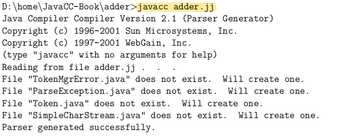

> 本文转载自：https://www.cnblogs.com/suhaha/p/11733528.html

### 一、 JAVA CC语法描述文件的格式解析

````java
options {
    JavaCC的选项
}

PARSER_BEGIN(解析器类名)
package 包名;
import 库名;

public class 解析器类名 {
    任意的Java代码
}
PARSER_END(解析器类名)

扫描器的描述

解析器的描述
````

     JavaCC和java一样将解析器的内容 **定义在单个类中** ，因此会在PARSER_BEGIN和PARSER_END之间描述这个类的相关内容。下面拿一段实际代码来做示例，并对代码进行逐段拆分解析。

#### 1. 示例代码

````java
options {
    STATIC = false;
}

PARSER_BEGIN(Adder)
package com.susu.testJavaCC;
import java.io.*;
public class Adder {
    public static void main(String[] args) {
        for (String arg : args) {
            try {
                System.out.println(evaluate(arg));
//                return(evaluate(arg));
            } catch (ParseException ex) {
                System.err.println(ex.getMessage());
            }
        }
    }

    public static long evaluate(String src) throws ParseException {
        Reader reader = new StringReader(src);
        return new Adder(reader).expr();
    }
}
PARSER_END(Adder)

SKIP: { <[" ", "\t", "\r", "\n"]> }
TOKEN: {
    <INTEGER: (["0"-"9"])+>
}

long expr():
{
    Token x, y;
}
{
    x=<INTEGER> "+" y=<INTEGER> <EOF>
    {
        return Long.parseLong(x.image) + Long.parseLong(y.image);
    }
}
````


#### 2.代码结构解析

1. options块中将STATIC选项设置为false, 将该选项设置为true的话JavaCC生成的所有成员及方法都将被定义为static，若将STATIC设置为true则所生成的解析器无法在多线程环境下使用，因此该选项总是被设置为false。(STATIC的默认值为true)
2. 从PARSER_BEING(Adder)到PARSER_END(Adder)是解析器类的定义。解析器类中需要定义的成员和方法也写在这里。为了实现即使只有Adder类也能够运行,这里定义了main函数。
3. 之后的SKIP和TOKEN部分定义了扫描器。SKIP表示要跳过空格、制表符(tab)和换行符。TOKEN表示扫描整数字符并生成token。
4. long expr...开始到最后的部分定义了狭义的解析器。这部分解析token序列并执行某些操作。


#### 3.main函数代码解析

  main函数将所有命令行参数的字符串作为计算对象的算式，依次用evaluate方法进行计算。
  evaluate方法中生成了Adder类的对象实例 。并让Adder对象来计算(解析)参数字符串src。
  要运行JavaCC生成的解析器类，需要下面2个步骤:

1. 生成解析器类的对象实例
2. 用生成的对象调用和需要解析的语句同名的方法

第1点: JavaCC4.0和JavaCC5.0生成的解析器中默认定义有如下四种类型的构造函数。

- Parser(InputStream s)：第1种的构造函数是通过传入InputStream对象来构造解析的。这个构造函数无法设定输入字符串的编码，因此无法处理中文字符等。
- Parser (InputStream s, String encoding)：第2种的构造函数除了InputStream对象外，还可以设置输入字符串的编码来生成解析器。但如果要解析中文字符串或注释的话，就必须使用第2种/3种构造函数。
- Parser(Reader r)：第3种的构造函数用于解析Reader对象所读入的内容。
- Parser (x x x x TokenManager tm)：第4种是将扫描器作为参数传入。

  解析器生成后，用这个实例调用和需要解析的语法同名的方法。这里调用Adder对象的expr方法，接回开始解析，解析正常结束后会返回语义值。


### 二、 处理中文字符

要使JavaCC能够处理中文首先需要将语法描述文件的options块的UNICODE_INPUT选项设置为true:

```java
options {
    STATIS = false;
    DEBUG_PARSER = true;
    UNICODE_PARSER = true;
    JDK_VERSION = "1.8";
}
```

  这样就会先将输入的字符转换成UNICODE后再进行处理。UNICODE_INPUT选项为false时只能处理ASCII范围的字符。
  另外还需要使用第2、3种构造方法为输入的字符串设置适当的编码。


### 三、 JAVA CC官方入门指南-概述

#### 1. 前言

在最开始使用JavaCC的时候，从网上查询了许多资料，但是网上的资料水平是参差不齐的，走了许多弯路，不得已自己查阅了英文版官网文档。令我伤心的是最后我回过头来再看那些博客资料时，发现其实他们写的都是没错的，只不过某些地方少了必要的讲解，以至于新手刚接触的时候是持续懵逼的。
  不管怎样，下面内容是对官方文档的翻译，加上一些自己的理解。
  官方文档连接：https://www.engr.mun.ca/~theo/JavaCC-Tutorial/javacc-tutorial.pdf
  这里所翻译的部分是JavaCC的入门知识，通过由浅入深的几个小例子，可以循序渐进的一步步了解JavaCC技术。

#### 2.JAVA CC概述

JavaCC全称为Java Compiler Compiler，它是一个生成器，用于生成词法分析器（lexical analysers）和语法分析器（parsers）。它可以通过读取一个词法和语法描述文件（即词法和语法描述是写在同一个文件中的），来生成一个java程序，这个java程序就包括了词法分析器和语法分析器。接着就可以用生成的词法分析器和语法分析器来对我们的输入进行判断，判断输入是否符合我们所要求的语法规则。
  编程语言中的编译器，其实就包含了词法分析器和语法分析器，编译器便是通过这两者来识别我们所编写的代码。除了在编译器中的应用之外，词法分析器和语法分析器在其他程序中也有着广泛的应用。
  那么什么是词法分析器和语法分析器呢？其中，词法分析器可以将一个字符序列拆分为一个个的子单元，这些子单元，在JavaCC中被称之为token——也就是说，词法分析器可以将一个字符序列拆分为一个个的token。这个解释可能依然有点让人摸不着头脑，下面看一个例子。
  假设我们要用词法分析器来解析下面的一段C语言编写的代码：

```c
int main() {
    return 0 ;
}
```

  那么C语言编译器中的词法分析器会将上述代码拆分为如下的token序列：

```
“int”, “ ”, “main”, “(”, “)”,
“ ”, “{”, “\n”, “\t”, “return”
“ ”, “0”, “ ”, “;”, “\n”,
“}”, “\n”, “” .
```

  可以看到所谓的拆分就是把int、空格、main、左括号等等各种字符给拆开罢了。那么在JavaCC中，会给拆分后得到的一个个token取一个逻辑上的名字，比如在本例中，我们所取的名称可以如下：

```
KWINT, SPACE, ID, OPAR, CPAR,
SPACE, OBRACE, SPACE, SPACE, KWRETURN,
SPACE, OCTALCONST, SPACE, SEMICOLON, SPACE,
CBRACE, SPACE, EOF .
```

  如此一来，KWINT这个token就表示“int”, SPACE这个token就表示“ ”， OPAR就表示左括号“(”等等。因此在JavaCC中，一般说到token的时候，一般指的是KWINT、SPACE、OPAR等这些东西。另外，EOF这个token表示“文件的末尾”。
经过词法分析而得到的tokens序列，在之后将会被传给语法分析器进行语法判断。
在C语言的编译器中，有时语法分析器在分析的时候是不需要所有的token的。比如在本例中，SPACE这个token就可以不用往下传给语法分析器了，那么此时SPACE这个 token应该如何处理掉，将在后面说到。
  在本例中，语法分析器将会对拿到的tokens序列进行分析，判断这些tokens序列是否符合c语言的语法结构。
  此外，词法分析器和语法分析器在分析的时候，还有可能会产生错误信息，即当你的输入并不符合你所定义的词法和语法规范时，就会抛出错误信息。
  最后需要注意的是，JavaCC本身并不是词法分析器和语法分析器，它是一个生成器！JavaCC通过读取一个后缀为.jj的描述文件中的特定描述，来生成词法分析器和语法分析器，并且生成的词法分析器和语法分析器使用Java书写的。）
  至此，已经简单说明了JavaCC是什么，以及词法分析器和语法分析器的作用，还引出了token的概念。下面将通过例子来一步一步进行讲解。


### 四、示例

#### 例1-整数加法运算

 在这个例子中，我们将判断如下输入的式子是否是一个合法的加法运算：

```
99 + 42 + 0 + 15
```

  并且在输入上面式子的时候，数字与加号之间的任何位置，都是可以有空格或者换行符的，也就说，即使我们输入的式子是下面这种形式，我们所编写的词法和语法分析器也应该要能判断出来它是一个合法的加法运算表示形式：

```
99 + 42 + 0
+ 15
```

  （注：上面输入的式子中既有空格，也有制表符，还有换行符）

##### 1.Option块和class声明块

  语法描述文件的第一部分是：

```java
/* adder.jj Adding up numbers */
options {
    STATIC = false ;
    }

PARSER_BEGIN(Adder)
    class Adder {
        public static void main( String[] args ) throws ParseException, TokenMgrError {
            Adder parser = new Adder( System.in );
            parser.Start();
        }
    }
PARSER_END(Adder)
```

  上面的代码可以分为两个部分，一个是options块，另一个是PARSER_BEGIN(XXX)…… PARSER_END(XXX)块。

- 在options中，几乎所有配置项的默认值都适用于本例子，除了 STATIC选项，STATIC默认是true，这里要将其修改为false，使得生成的函数不是static 的。
- 接下来是ARSER_BEGIN(XXX)……PARSER_END(XXX)块，这里定义了一个名为 Adder的类，当然在这个块中定义的并非是Adder类的全部，JavaCC会根据.jj描述文件的其他部分的描述，来生成Adder的其他声明信息。另外注意到，在该类的main方法声明中， 抛出了两个异常类，分别为ParseException和TokenMgrError，这两个异常类会在使用javacc 命令编译当前.jj描述文件的时候生成。）

##### 2.词法描述器

  我们在后面还会再讲到main方法。这里让我们先看看词法描述器。当前例子中所需的词法描述器通过如下的四行来进行描述：

```java
SKIP : { " "}
SKIP : { "\n" | "\r" | "\r\n" }
TOKEN : { < PLUS : "+" > }
TOKEN : { < NUMBER : (["0"-"9"])+ > }
```

- 第一行是SKIP，表示将会被词法分析器忽略的部分：空格。被忽略掉意味着，它们将不会被传给语法分析器。
- 第二行也是SKIP，定义了将会被忽略的部分：换行符。之所以会有几个，是因为在不同的系统中，换行符有不同的表示方式——在Unix/Linux系统中，换行符是"\n"；在Windows系统中，换行符是"\r"；在mac系统中，换行符则是"\r\n"。这几个换行符用一个竖杠分隔，表示“或”的意思。
- 第三行定义了一个名为PLUS的token，用它来表示加号"+"。
- 第四行定义了一个名为NUMBET的token，用它来表示([”0”-”9”])+，即所有的正整数序列。可以注意到([”0”-”9”])+是一个正则表达式。
    这四行描述都可以被称为表达生产式。
      事实上，词法分析器中还可以生成一种token，这种token用EOF表示，用来代表输入序列的末尾。但是没有必要在词法分析器部分显式的定义EOF这个token，因为JavaCC会自动处理文件的结束符了。
      假设有如下的输入：

```
“123 + 456\n”
```

  词法分析器将解析的7个token，依次是NUMBER、空格、PLUS、空格、NUMBER、换行符、EOF。在解析出来的这些token中，被标记为SKIP的token将不会被往下传递给语法分析器。词法分析器在分析完成之后，只会将以下token传递给语法分析器：NUMBER, PLUS, NUMBER, EOF。
  再假设一种不合法的输入，如下：

```
“123 - 456\n”
```

  词法分析器在对上面的输入进行解析时，解析到的第一个token是NUMBER，第二个token是空格，接下来，它就遇到了一个减号字符——因为在我们上面的词法描述器中没有定义减号这个token，因此就无法对其进行解析，此时词法分析器就抛出一个异常：TokenMgrError。
  再看另外一种输入情况：

```
“123 ++ 456\n”
```

  这时词法分析器可以对其进行解析，并给语法分析器传递如下的token序列：NUMBER, PLUS, PLUS, NUMBER, EOF。
  很明显，这不是一个合法的“加运算”的输入它连续出现了两个PLUS token。但是，词法分析器的任务是将输入解析成一个个的token，而不是判断token的顺序是否正确。判断tokens序列的顺序是否正确是语法分析器的任务。接下来将会介绍到的语法分析器，它在分析到第二个PLUS token的时候，将会检测到错误，一旦检测到错误，它就停止从词法分析器请求tokens了，所以，实际上真正传递给语法分析器的tokens序列只有NUMBER, PLUS, PLUS。

##### 3.语法分析器

  语法分析器的描述由BNF生产式构成。可以看到，语法分析器的描述看起来跟java的方法定义形式有点相似。

```java
void Start() :
{}
{
    <NUMBER>
    (
        <PLUS>
        <NUMBER>
    )*
    <EOF>
}
```

  上面的BNF生产式指定了合法的token序列的规则：必须以NUMBER token开头，以EOF token结尾，而在NUMBER和EOF中间，可以是0至多个PLUS和NUMBER的token，而且必须是PLUS后跟着NUMBER。
  根据上面的语法描述器语法，解析器将只检测输入序列是否无错误，它不会把数字加起来。我们接下来将很快修改解析器描述文件以更正此问题，但是首先，让我们生成Java组件并运行它们。

##### 4.生成词法描述器和语法描述器

  将前面部分提到的几个部分都合并起来，保存成adder.jj文件：

```java
/* adder.jj Adding up numbers */
options {
    STATIC = false ;
    }

PARSER_BEGIN(Adder)
    /*package com.heng.mycomplier设置生成的类的包路径*/
    
    class Adder {
        public static void main( String[] args ) throws ParseException, TokenMgrError {
            Adder parser = new Adder( System.in );
            parser.Start();
        }
    }
PARSER_END(Adder)

SKIP : { " "}
SKIP : { "\n" | "\r" | "\r\n" }
TOKEN : { < PLUS : "+" > }
TOKEN : { < NUMBER : (["0"-"9"])+ > }

void Start() :
{}
{
    <NUMBER>
    (
        <PLUS>
        <NUMBER>
    )*
    <EOF>
}
```

然后在上面调用javacc命令。下面是在windows系统上的演示。



执行完之后，会生成7个java文件。如下所示：


其中：

- TokenMgrError 是一个简单的定义错误的类，它是Throwable类的子类，用于定义在词法分析阶段检测到的错误。
- ParseException是另一个定义错误的类。它是Exception 和Throwable的子类，用于定义在语法分析阶段检测到的错误。
- Token类是一个用于表示token的类。我们在.jj文件中定义的每一个token（PLUS, NUMBER, or EOF），在Token类中都有对应的一个整数属性来表示，此外每一个token都有名为image的string类型的属性，用来表示token所代表的从输入中获取到的真实值。
- SimpleCharStream是一个转接器类，用于把字符传递给语法分析器。
- AdderConstants是一个接口，里面定义了一些词法分析器和语法分析器中都会用到的常量。
- AdderTokenManager 是词法分析器。
- Adder 是语法分析器。

  接下来我们对这些java文件进行编译：


编译完成之后，可得到对应的class文件：


##### 5.执行程序

  现在，让我们来看看Adder类中的main方法：

```java
Pubic static void main( String[] args ) throws ParseException, TokenMgrError {
    Adder parser = new Adder( System.in );
    parser.Start();
}
```

  首先注意到main方法有可能抛出两个异常错误类：ParseException和TokenMgrError，它们都是Throwable类的子类。这并不是一种好的编码习惯，理论上我们应该对着两异常进行try-catch捕获，但是在本例中我们暂且将其抛出，以使得代码简洁易懂。
  main方法的第一行代码new了一个parser对象，使用的是Adder类的默认构造器，它接收一个InputStream类型对象作为输入。此外Adder类还有一个构造器，这个构造器接收的入参是一个Reader对象。构造函数依次创建一个SimpleCharacterStream类实例和一个AdderTokenManager类的实例（即词法分析器对象）。因此，最后的效果是，词法分析器通过SimpleCharacterStream实例对象从System.in中读取字符，而语法分析器则是从语法分析器中读取tokens。
  第二行代码则是调用了语法分析器的一个名为Start()的方法。对于在.jj文件中的每一个BNF生产式，javacc在parser类中都会生成相应的方法。此方法负责尝试在其输入流中找到与输入描述匹配的项。比如，在本例中，调用Start()方法将会使得语法分析器尝试从输入中符合下面描述的tokens序列：

```java
<NUMBER> (<PLUS> <NUMBER>)* <EOF>
```

  我们可以事先准备一个input.txt文件，里面的内容下面会说到。在准备了输入文件之后，接下来就可以用下面的命令来执行程序了。


 执行的结果有可能为以下3中情况之一：

1. 程序报一个词法错误。比如，词法错误只有在词法分析器无法解析出输入的字符时才会抛出。假设input.txt文件中的内容是123 – 456，在这种情况下，程序就会抛出一个TokenMgrError的错误，报错的信息是：*Exception in thread ”main” TokenMgrError: Lexical error at line 1,column 5. Encountered: ”-” (45), after : ””* 。即：词法分析器不认识“-”减号，因为在.jj文件中，我们并没有对“-”定义相应的token。
2. 程序报一个语法错误。当语法分析器接收到的tokens序列不匹配Start()方法中的规范时，就会抛出该错误。比如，若input.txt文件中的内容是123 ++ 456或123 456又或者什么都不写，此时程序就会抛出一个ParseException.异常，对于123 ++ 456来说，抛出的异常就是：*Exception in thread ”main” ParseException: Encountered ”+” at line 1, column 6. Was expecting: ...* 。
3. 若输入中的tokens序列跟Start()方法中的规范匹配时，将不抛出任何错误异常，程序正常结束。
     但是从我们的代码可以看出，当我们的输入是合法的时候，语法分析器什么也不干，它仅仅用于检查我们的输入是否符合相应的表达式规范而已。在下一小节中，我们将对.jj文件进行一些修改，使得生成的语法分析器有更多的用处。

##### 6.生成的代码解析

  想要知道JavaCC生成的语法分析器是如何工作的，我们需要看一些它生成的代码。

```java
final public void Start() throws ParseException {
    jj_consume_token(NUMBER);
    label_1:
    while (true) {
        jj_consume_token(PLUS);
        jj_consume_token(NUMBER);
        switch ((jj_ntk == -1) ? jj_ntk() : jj_ntk) {
        case PLUS:
            ;
            break;
        default:
            jj_la1[0] = jj_gen;
            break label_1;
        }
    }
    jj_consume_token(0);
}
```

  jj_consume_token方法以token类型作为入参，并试图从语法分析器中获取指定类型的token，如果下一个获取到的token跟语法分析器中定义的不同，此时就会抛出一个异常。看下面的表达式：

```java
(jj_ntk == -1) ? jj_ntk() : jj_ntk
```

  该表达式计算下一个未读的token。
  程序的最后一行是要获取一个为0的token。JavaCC总是使用0来表示EOF的token。

#### 例2-整数加法运算--改良版（增强语法分析器）

##### 1.修改

  上一个例子中，JavaCC为BNF生产式所生成的方法，比如Start()，这些方法默认只简单的检查输入是否匹配BNF生产式指定的规范。但是我们也可以用java代码来扩充BNF生产式，使得由生产式生成的方法中也包含java代码。
  我们加下来会对上面例一中的adder.jj代码做一些修改。对于其中的Start这个BNF生产式，我们加入一些声明和java代码，如下所示：

```java
int Start() throws NumberFormatException :
{
    Token t ;
    int i ;
    int value ;
}
{
    t = <NUMBER>
    { i = Integer.parseInt( t.image ) ; }
    { value = i ; }
    (
        <PLUS>
        t = <NUMBER>
        { i = Integer.parseInt( t.image ) ; }
        { value += i ; }
    )*
    <EOF>
    { return value ; }
}
```

  首先第一个改动是BNF生产式的返回类型，这就使得由该BNF生产式生成的方法的返回值类型由void变成了int。另外的改动是，我们声明了一个可能抛出的异常NumberFormatException。在方法内，声明了3个变量，其中变量t是Token类型的，Token类是我们编译.jj文件文件之后生成的类，而Token类中的image属性则表示匹配到的token的值。在声明完变量之后，当一个token被BNF生产式匹配到，我们就可以通过t = 的方式，将token赋值给t从而记录下来。在BNF生产式中，我们可以加上任何的合法的Java代码，这些Java代码在javacc编译生成语法分析器类时，将会被原封不动的复制到语法分析器类的相应方法中。
  现在生成的Start方法将有一个返回值，因此我们对main方法做如下修改：

```java
Public static void main( String[] args ) throws ParseException, TokenMgrError, NumberFormatException {
    Adder parser = new Adder( System.in );
    int val = parser.Start() ;
    System.out.println(val);
}
```

  除此之外，我们还要做如下的一点小改进，我们看到，下面的代码出现了两次：

```java
{ i = Integer.parseInt( t.image ) ; }
{ value = i ; }
```

  虽然在这个例子中影响并不大，但是像这种重复出现的代码还是可能会导致代码维护的问题。因此我们对这两行代码进行重构，将它重构成另外一个BNF生产式，并把这个生产式命名为Primary。

```java
int Start() throws NumberFormatException :
{
    int i ;
    int value ;
}
{
    value = Primary()
    (
        <PLUS>
        i = Primary()
        { value += i ; }
    )*
    <EOF>
    { return value ; }
}

int Primary() throws NumberFormatException :
{
    Token t ;
}
{
    t=<NUMBER>
    { return Integer.parseInt( t.image ) ; }
}
```

  下面是生成的代码，从中我们可以看出javacc如何吧java的变量声明和逻辑代码跟生产式融合起来的。

```java
final public int Start() throws ParseException, NumberFormatException {
    int i ;
    int value ;
    value = Primary();
    label 1:
    while (true) {
        switch ((jj ntk==-1)?jj ntk():jj ntk) {
            case PLUS:
                ;
                break;
            default:
                jj la1[0] = jj gen;
                break label 1;
        }
        jj consume token(PLUS);
        i = Primary();
        value += i ;
    }
    jj consume token(0);
    {if (true)
        return value ;}
    throw new Error(”Missing return statement in function”);
}

final public int Primary() throws ParseException, NumberFormatException {
    Token t ;
    t = jj consume token(NUMBER);
    {if (true)
        return Integer.parseInt( t.image ) ;}
    throw new Error(”Missing return statement in function”);
}
```

##### 2.运行

###### 2.1 adder2.jj

  经过上面的修改，最终得到.jj描述文件内容如下，我们将其保存命名为adder2.jj：

```java
/* adder.jj Adding up numbers */
options {
    STATIC = false ;
    }

PARSER_BEGIN(Adder)
    class Adder {
        public static void main( String[] args ) throws ParseException, TokenMgrError, NumberFormatException {
            Adder parser = new Adder( System.in );
            int val = parser.Start();
            System.out.println(val);
        }
    }
PARSER_END(Adder)

SKIP : { " "}
SKIP : { "\n" | "\r" | "\r\n" }
TOKEN : { < PLUS : "+" > }
TOKEN : { < NUMBER : (["0"-"9"])+ > }

int Start() throws NumberFormatException :
{
    int i ;
    int value ;
}
{
    value = Primary()
    (
        <PLUS>
        i = Primary()
        { value += i ; }
    )*
    <EOF>
    { return value ; }
}

int Primary() throws NumberFormatException :
{
    Token t ;
}
{
    t=<NUMBER>
    { return Integer.parseInt( t.image ) ; }
}
```

###### 2.2 运行javacc命令

````shell
F:\java_plug\mycomplier\src\main\java\com\heng\mycomplier>java -cp F:\java_plug\javacc\javacc-7.0.4\bootstrap\javacc.jar   javacc  Adder.jj

Java Compiler Compiler Version 4.1d1 (Parser Generator)
(type "javacc" with no arguments for help)
Reading from file Adder.jj . . .
File "TokenMgrError.java" does not exist.  Will create one.
File "ParseException.java" does not exist.  Will create one.
File "Token.java" does not exist.  Will create one.
File "SimpleCharStream.java" does not exist.  Will create one.
Parser generated successfully.
````

###### 2.3运行生成的java文件

为了方便，就直接在ide里运行。


#### 例3-double类型加法

​        下面我们对上个例子的代码进行进一步的修改，使得代码具有简单的四则运算的功能。
  第一步修改，我们将打印出每一行的值，使得计算器更具交互性。一开始，我们只是把数字加起来，然后再关注其他运算，比如减法、乘法和除法。

##### 1.Options和class声明块

  描述文件calculator0.jj的第一部分如下所示：

```java
/* calculator0.jj An interactive calculator. */
options {
    STATIC = false ;
}
PARSER_BEGIN(Calculator)
    import java.io.PrintStream ;
    class Calculator {
        public static void main( String[] args )
            throws ParseException, TokenMgrError, NumberFormatException {
            Calculator parser = new Calculator( System.in ) ;
            parser.Start( System.out ) ;
        }
        double previousValue = 0.0 ;
    }
PARSER_END(Calculator)
```

  Calculator类中的previousValue属性，用于存储上一行的计算结果的，我们将在另一个版本中使用到该值，到时可以使用美元符号来表示它。import导入语句声明说明了在PARSER_BEGIN和PARSER_END之间可能有import导入声明；这些代码都会被原样复制到生成的语法解析类和token管理类中去。同样还可以有包package的声明，package的声明将会被复制到最后生成的所有java类中去。

##### 2.词法描述文件

  词法分析器的描述文件在这里将会发生一些变化，首先一行的结束符也被声明为了token，并给这些行结束符命名为EOL，这样一来这个token也可以被传递给语法分析器了。

```java
SKIP : { " " }
TOKEN : { < EOL : "\n" | "\r" | "\r\n" > }
TOKEN : { < PLUS : "+" > }
```

  接下来，我们要定义合适的token使得允许输入中的数值有小数点。为此我们修改NUMBER这个token的定义，使得它可以识别decimal类型的数值。当数值中有小数点，它可以有如下的4中类型，我们分别用竖线分隔开来了，这4中类型分别是：整型，没有小数点、小数点在中间、小数点在末尾和小数点在开头。满足此需求的描述串如下：

```java
TOKEN { < NUMBER : (["0"-"9"])+
                 | (["0"-"9"])+ "." (["0"-"9"])+
                 | (["0"-"9"])+ "."
                 | "." (["0"-"9"])+ >
        }
```

  有时候，同样的规则表达式可能会出现多次。为了更好的可读性，最好是给这些重复出现的表达式起一个名字。对于那些只在词法描述文件中使用到，但又不是token的规则表达式，我们创建了一个特殊的标识来表示它：#。因此，对于上面的词法描述，可以替换成如下：

```java
TOKEN : { < NUMBER : <DIGITS>
                   | <DIGITS> "." <DIGITS>
                   | <DIGITS> "."
                   | "."<DIGITS> >
        }
TOKEN : { < #DIGITS : (["0"-"9"])+ > }
```

  可以看到，我们把([”0”-”9”])+这串规则表达式提取了出来，并将其命名为了DIGITS。但是要注意到，DIGITS这个并不是token，这意味着在后面生成的Token类中，将不会有DIGITS对应的属性，而在语法分析器中也无法使用DIGITS。

##### 3.语法描述文件

  语法分析器的输入由零行或多行组成。每行包含一个表达式。通过使用BNF符号表达式，语法分析器可以写成如下：

```java
Start -->(Expression EOL) * EOF
```

  由此我们可以得出BNF生产式如下：

```java
void Start() :
{}
{
    (
        Expression()
        <EOL>
    )*
    <EOF>
}
```

  我们在上面的BNF生产式中填充上java代码，使得它具备接收入参、记录并打印每一行的计算结果：

```java
void Start(PrintStream printStream) throws NumberFormatException :
{}
{
    (
        previousValue = Expression()
        <EOL> { printStream.println( previousValue ) ; }
    )*
    <EOF>
}
```

  每个表达式由一个或多个数字组成，这些数字目前用加号隔开。用BNF符号表达式如下：

```java
Expression --> Primary(PLUS Primary)*
```

  在这里的Primary，我们暂时用它来表示数值。
  上面的BNF符号表达式用JavaCC表示出来如下所示：

```java
double Expression() throws NumberFormatException : {
    double i ;
    double value ;
}
{
    value = Primary()
    (
        <PLUS>
        i = Primary()
        { value += i ; }
    )*
    { return value ; }
}
```

  这个跟我们前面例子中的Start BNF生产式差不多，我们只是将数值的类型由int修改成了double类型而已。至于Primary()，跟上面例子也非常类似，它用BNF符号表达式来表示：

```java
Primary --> NUMBER
```

  Primary()对应的JavaCC描述文件其实也差不多，只不过在这里它是对double精度的数值进行的转换计算：

```java
double Primary() throws NumberFormatException :
{
    Token t ;
}
{
    t = <NUMBER>
    { return Double.parseDouble( t.image ) ; }
}
```

  下面我们用BNF符号表达式将语法分析器的逻辑表示出来：

```java
Start --> (Expression EOL) * EOF
Expression --> Primary (PLUS Primary)*
Primary --> NUMBER
```

  至此，我们就把calculator0.jj描述文件都修改完了，接下来可以跑几个例子进行测试。

##### 4.测试

###### 4.1 calculator0.jj

  经过上面的修改，最后得到的.jj描述文件如下：

```java
/* calculator0.jj An interactive calculator. */
options {
    STATIC = false ;
}
PARSER_BEGIN(Calculator)
    import java.io.PrintStream ;
    class Calculator {
        public static void main( String[] args )
            throws ParseException, TokenMgrError, NumberFormatException {
            Calculator parser = new Calculator( System.in ) ;
            parser.Start( System.out ) ;
        }
        double previousValue = 0.0 ;
    }
PARSER_END(Calculator)


SKIP : { " " }
TOKEN : { < EOL : "\n" | "\r" | "\r\n" > }
TOKEN : { < PLUS : "+" > }
TOKEN : { < NUMBER : <DIGITS>
                   | <DIGITS> "." <DIGITS>
                   | <DIGITS> "."
                   | "."<DIGITS> >
        }
TOKEN : { < #DIGITS : (["0"-"9"])+ > }


void Start(PrintStream printStream) throws NumberFormatException :
{}
{
    (
        previousValue = Expression()
        <EOL> { printStream.println( previousValue ) ; }
    )*
    <EOF>
}

double Expression() throws NumberFormatException : {
    double i ;
    double value ;
}
{
    value = Primary()
    (
        <PLUS>
        i = Primary()
        { value += i ; }
    )*
    { return value ; }
}

double Primary() throws NumberFormatException :
{
    Token t ;
}
{
    t = <NUMBER>
    { return Double.parseDouble( t.image ) ; }
```


#### 例4-加减法运算

##### 1. calculator1.jj

  为了使得计算器具备更多功能，我们需要更多的操作符，比如减法、乘法和除法。接下来我们添加减法运算。
  在词法分析器的描述部分，我们添加如下生产式：

```java
TOKEN : { < MINUS : "-" > }
```

  在词法分析器的描述文件中，我们层在定义EOL和NUMBER这两个token时，使用竖线来表示“或”的意思，以此来区分不同的选项。在语法分析器的BNF生产式中，我们也同样用竖线来表示“或”的功能。
  在这个例子中，我们需要在PLUS和MINUS这两个token之间做选择。用BNF符号表达式来表示就如下所示：

```java
Expression --> Primary ((PLUS | MINUS) Primary) *
```

  但是我们也可以使用如下表示：

```java
Expression --> Primary (PLUS Primary | MINUS Primary)*
```

  这种方式使得生成的java代码简单些，在JavaCC描述文件中，其对应的生产式如下所示：

```java
double Expression() throws NumberFormatException :
{
    double i ;
    double value ;
}
{
    value = Primary()
    (
        <PLUS>
            i = Primary()
            { value += i ; }
        | <MINUS>
            i = Primary()
            { value -= i ; }
    )*
    { return value ; }
}
```

##### 2.测试

  经过上面的修改，修改之后完整的.jj文件内容如下所示：

```java
/* calculator0.jj An interactive calculator. */
options {
    STATIC = false ;
}
PARSER_BEGIN(Calculator)
    import java.io.PrintStream ;
    class Calculator {
        public static void main( String[] args )
            throws ParseException, TokenMgrError, NumberFormatException {
            Calculator parser = new Calculator( System.in ) ;
            parser.Start( System.out ) ;
        }
        double previousValue = 0.0 ;
    }
PARSER_END(Calculator)


SKIP : { " " }
TOKEN : { < EOL : "\n" | "\r" | "\r\n" > }
TOKEN : { < PLUS : "+" > }
TOKEN : { < MINUS : "-" > }
TOKEN : { < NUMBER : <DIGITS>
                   | <DIGITS> "." <DIGITS>
                   | <DIGITS> "."
                   | "."<DIGITS> >
        }
TOKEN : { < #DIGITS : (["0"-"9"])+ > }


void Start(PrintStream printStream) throws NumberFormatException :
{}
{
    (
        previousValue = Expression()
        <EOL> { printStream.println( previousValue ) ; }
    )*
    <EOF>
}

double Expression() throws NumberFormatException :
{
    double i ;
    double value ;
}
{
    value = Primary()
    (
        <PLUS>
            i = Primary()
            { value += i ; }
        | <MINUS>
            i = Primary()
            { value -= i ; }
    )*
    { return value ; }
}


double Primary() throws NumberFormatException :
{
    Token t ;
}
{
    t = <NUMBER>
    { return Double.parseDouble( t.image ) ; }
}
```