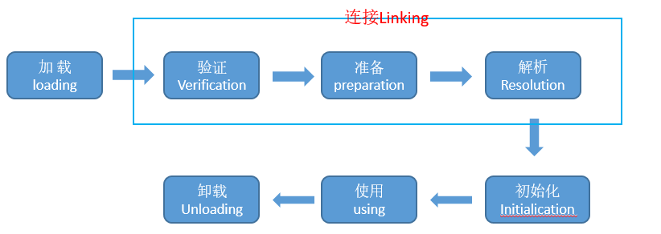

# 类加载时机

> 引用自《深入理解Java虚拟机》

​        类从被加载到虚拟机内存中开始，到卸载出内存为止，它的整个生命周期包括：加载、验证、准备、解析、初始化、使用、卸载7个阶段。其中验证、准备、解析3个部分统称为连接，这个7个阶段的发生顺序如下图



​       上图中，加载、验证、准备、初始化、和卸载这5个阶段的顺序是确定的，类的加载的过程必须按照这种顺序按部就班的开始，而解析阶段则不一定：它在某些情况下可以在初始化阶段之后再开始，这是为了支持java语言的运行时绑定（也称为动态绑定或晚期绑定）。注意，在这里笔者写的是按部就班的“开始”，而不是按部就班地“进行”或“完成”，强调这点是因为这些阶段通常都是互相交叉地混合式进行的，通常会在一个阶段的过程中调用、激活另外一个阶段。

​        什么情况下需要开始类加载过程的第一个阶段：加载？ Java虚拟机规范中并没有进行强制约束，这点可以交给虚拟机的具体实现来自由把握。但是对于初始化阶段，虚拟机规范则是严格规定了有且只有5中情况必须立即对类进行“初始化”（而加载、验证、准备自然需要在此之前开始）:

​     1）遇到new、getstatic、putstatic或invokestatic这4条字节码指令时，如果类没有进行过初始化，则需要先触发其初始化。生成这4条指令的最常见的Java代码场景是：使用new 关键字实例化对象的时候、读取或者只一个类的静态字段（被final修饰、已在编译器把结果放入常量池的静态字段触发）的时候，以及调用一个类的静态方法的时候。

​    2）使用java.lang.reflect包的时候对类进行反射调用的时候，如果类没有进行过 初始化，则需要先触发其初始化。

​     3）当初始化一个类的时候，如果发现其父类还 没有进行过初始化，则需要先触发其父类的初始化。

​     4）当虚拟机启动时，用户需要指定一个要执行的类（包含main()方法的那个类），虚拟机会先初始化这个类。

​     5）当使用JDK1.7的动态语言支持时，如果一个java.lang.invooke.MethodHandle实例最胡的解析结果REF_getStatic，REF_putStatic，REF_invokeStatic的方法句柄，并且这个方法句柄所对应的类没有进行过初始化，则需要先触发其初始化。   

​    除此5中情况外的所有引用类的方式都不会触发初始化，成为被动调用。下面举3个例子来说明何为被动引用。


​                                                                             **代码清单1**

```java
public class SuperClass {

    /**
     * 被动使用类字段演示一
     * 通过子类引用父类的静态字段，不会导致子类初始化
     */

    static {
        System.out.println("SuperClass init!");
    }

    public static int value = 123;
}

public class SubClass extends SuperClass {

    static {
        System.out.println("SubClass init");
    }
}


/**
 * 非主动使用类字段演示
 */
public class NotInitialization {

    public static void main(String[] args) {
        System.out.println(SubClass.value);
    }
}

```


​       上述代码运行之后，只会输出"SuperClass init!"，而不会输出"SubClass init"。对于静态字段，只有直接定义这个字段的类才会被初始化，因此通过其子类来引用父类中定义的静态字段，才会触发父类的初始化而不会触发子类的初始化。至于是否要触发子类的加载和验证，在虚拟机规范中并未明确给出，这点取决于虚拟机的具体实现。 


​                                                                              **代码清单2**

```java
public class NotInitialization {

    /**
     * 被动使用类字段演示二
     * 通过数组定义来引用类，不会触发此类的初始化
     * @param args
     */
    public static void main(String[] args) {
        SuperClass[] sca = new SuperClass[10];
    }
}
```


​                                                                     **代码清单3**

```java
/**
 * 常量在编译阶段会存入调用类的常量池中，本质上并没有直接引用到定义常量的类，因此不会触发定义常量的类的初始化
 */
public class ConstClass {
    
    static {
        System.out.println("ConstClass init!");
    }
    
    public static final String HELLOWORLD = "hello world";
}

public class NotInitialization {

    public static void main(String[] args) {
        System.out.println(ConstClass.HELLOWORLD);
    }
}

```

​    上述代码运行之后，也没有输出"ConstClass init"，只是因为虽然在Java源码中引用了ConstClass类中的常量HELLOWORLD，但其实在编译阶段通过常量传播优化，已将此常量存储到了NotInitialization的常量池中，以后ConstClass对常量的引用实际上都被转化未NotInitialization对自身常量池的引用了。也就是说，实际上NotInitialization的Class文件之中并没有ConstClass类的符号引用入口，这两个类在编译成Class之后就不存在任何关系了。