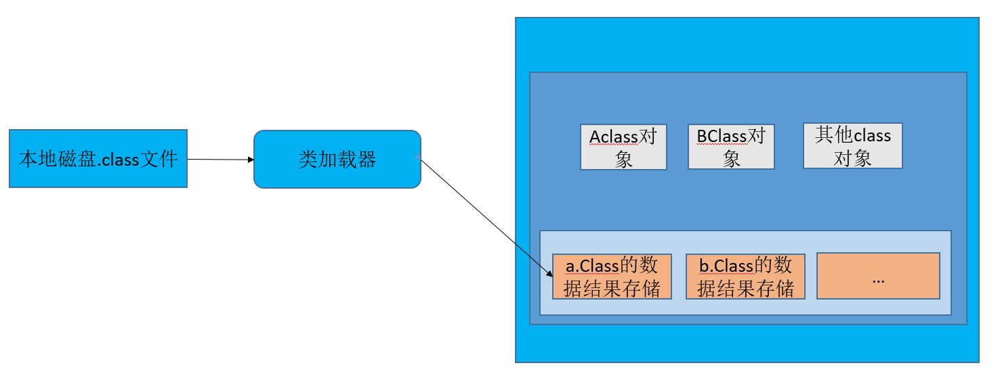

#  一：类加载器

## 1.1 在java代码中，类型的加载，连接，初始化过程都是在程序都是在程序运行期间完成的。


类型的加载--这里的类型是指的什么？

**答**：类型就是指的我们Java源代码通过编译后的class文件

1. 本地磁盘
2. 网络下载.class文件
3. war，jar下载.class文件
4. 从专门的数据库中读取.class文件(少见)
5. 将java源文件动态编译成class文件
   1. 典型的就是动态，通过运行期生成class文件
   2. 我们的jsp会被转换成servlet，而我们的serlvet是一个java文件，会被编译成class文件

### 通过什么来进行加载？（类加载器）



## 类加载器的层级结构


## 证明AppClassLoader的弗雷是ExetensClassLoader

````java
public static void main(String[] args) {
        System.out.println(Test.class.getClassLoader());
        System.out.println(Test.class.getClassLoader().getParent());
        System.out.println(Test.class.getClassLoader().getParent().getParent());
    }

输出结果：sun.misc.Launcher$AppClassLoader@18b4aac2
sun.misc.Launcher$ExtClassLoader@1b6d3586
null

````


## 类的初始化

主动使用 =========》  类的初始化（static{}


1. getStatic
2. invokeStatic
3. main
4. new
5. Class.forname
6. 子类初始化一定会触发我们的弗雷

初始化一定会触发类加载

类加载不一定初始化


这里需要结合Launcher类的源码，以及对ClassLoader.loadClass()源码进行分析


以下是AppClassLoader初始化的操作，它自身发ClassLoader parent引用指向了ExtClassLoader

````java
static class AppClassLoader extends URLClassLoader {
        final URLClassPath ucp = SharedSecrets.getJavaNetAccess().getURLClassPath(this);

        public static ClassLoader getAppClassLoader(final ClassLoader var0) throws IOException {
            final String var1 = System.getProperty("java.class.path");
            final File[] var2 = var1 == null ? new File[0] : Launcher.getClassPath(var1);
            return (ClassLoader)AccessController.doPrivileged(new PrivilegedAction<Launcher.AppClassLoader>() {
                public Launcher.AppClassLoader run() {
                    URL[] var1x = var1 == null ? new URL[0] : Launcher.pathToURLs(var2);
                    return new Launcher.AppClassLoader(var1x, var0);
                }
            });
        }

        AppClassLoader(URL[] var1, ClassLoader var2) {
            super(var1, var2, Launcher.factory);
            this.ucp.initLookupCache(this);
        }
        //Omintted other methods
  }
````

以下是ExtClassLoader初始化的操作

````java
public ExtClassLoader(File[] var1) throws IOException {
            super(getExtURLs(var1), (ClassLoader)null, Launcher.factory);
            SharedSecrets.getJavaNetAccess().getURLClassPath(this).initLookupCache(this);
        }

        private static File[] getExtDirs() {
            String var0 = System.getProperty("java.ext.dirs");
            File[] var1;
            if (var0 != null) {
                StringTokenizer var2 = new StringTokenizer(var0, File.pathSeparator);
                int var3 = var2.countTokens();
                var1 = new File[var3];

                for(int var4 = 0; var4 < var3; ++var4) {
                    var1[var4] = new File(var2.nextToken());
                }
            } else {
                var1 = new File[0];
            }

            return var1;
        }
````

