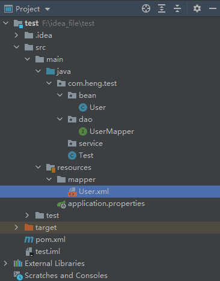
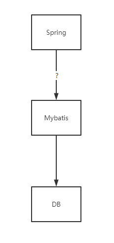
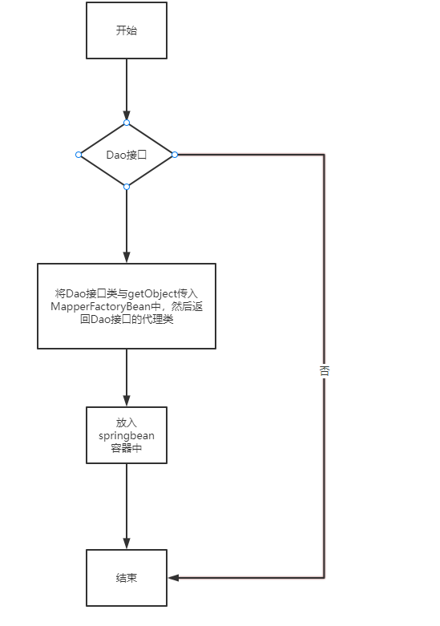

# Spring为什么通过调用接口就可以驱动mybatis去执行SQL语句

## 1、背景

在我们日常的开发当中，经常将spring和mybatis结合起来用。编码套路一般就是写一个DAO接口以及一个mapper.xml文件，如下：



然后再后续的使用中，我们直接通过spring依赖注入UserMapper对象来操作数据库。

## 2、Spring与Mybatis

### 2.1 DAO与Mapper

在长时间的使用spring-mybatis后，我们心中是否会有这样的疑惑，框架究竟是如何做到只需要调用DAO接口就去驱动mybatis操作数据的。毕竟spring与mybatis其实两个不同组件，它们俩是通过怎样的操作发生关联关系的。



让我们回到实际的编码当中去。先看看我们是如何编写DAO接口和Mapper文件的。

UserMapper.java

```java
import com.heng.test.bean.User;
import org.springframework.stereotype.Repository;

@Repository
public interface UserMapper {

    User getByUserId(String userId);
}
```

User.xml

````xml
<?xml version="1.0" encoding="UTF-8" ?>
<!DOCTYPE mapper PUBLIC "-//mybatis.org//DTD Mapper 3.0//EN"
        "http://mybatis.org/dtd/mybatis-3-mapper.dtd">
<mapper namespace="com.heng.test.dao.UserMapper">

	<!-- 根据用户id获取设置信息 -->
    <select id="getByUserId" resultType="com.heng.test.bean.User">
        SELECT id, user_id userId, theme, space_id spaceId, create_time createTime, update_time updateTime
        from user_settings
        where user_id = #{userId}
        limit 1
    </select>

</mapper>
````

通过仔细观察上面两个文件，UserMapper.java的类路径与User.xml的namespace的值是对应的，然后UserMapper.java的方法名与User.xml的SQL名是对应的。既然如此，那么就可以得出一个很直观的结论，即程序是通过UserMapper的类路径+方法名找到对应的Mapper文件需要执行的SQL。为了验证此猜想，我们得继续往后验证。

### 2.1 Mybatis的使用

我们在只是用Mybatis的情况想，往往是要实例化一个SqlSessionFactory对象，然后通过该对象去执行Mapper.xml文件里SQL语句，如下：

````java
SqlSessionFactory.openSession().selectOne("com.heng.test.dao.UserMapper.getByUserId",args)
````

如此，如果我们能做到通过程序去自动识别Mapper.xml的路径和传参，就能使得通过程序去驱动SqlSessionFactory变为可能，而不是每次都需要硬编码SqlSessionFactory。

### 2.2 Spring之FactoryBean接口

在spring中有两种bean存在，一种是我们经常用到的普通bean，spring管理普通bean的时候，一般就是管理该bean实例化后对应的对象。

````java
//普通bean
@Component
publica class MyBean{
    
}
````

spring中的另一种bean则是工厂bean，即FactoryBean。这种bean与普通bean不同之处在于，spring管理的是FactoryBean.getObject()返回的对象，而不是FactoryBean本身。这样可以让我们自定义Bean的创建过程更加灵活。

````java
@Component
public class MapperFactoryBean implements FactoryBean {
    @Override
    public Object getObject() throws Exception {
        return new MyBean();
    }

    @Override
    public Class<?> getObjectType() {
        return MyBean.class;
    }
}
````

至此我们找到了Spring与Mybatis之间的粘合剂FactoryBean接口。我们知道Spring可以通过DAO接口去驱动Mybaits操作数据库。如果平时在debug的时候留心的话，我们是可以发现spring自动注入的DAO接口其实是一个代理类。因此我们可以通过Spring + Mybatis + FactoryBean + 动态代理这四个关键点去实现spring与mybatis的整合

### 2.3 Spring整合mybatis

#### Spring之FactoryBean接口

Spring整合mybatis的关键代码：

````java
import com.heng.middleware.mybatis.SqlSessionFactory;
import org.slf4j.Logger;
import org.slf4j.LoggerFactory;
import org.springframework.beans.factory.FactoryBean;

import java.lang.reflect.InvocationHandler;
import java.lang.reflect.Method;
import java.lang.reflect.Proxy;

public class MapperFactoryBean<T> implements FactoryBean {

    private Logger logger = LoggerFactory.getLogger(MapperFactoryBean.class);

    private Class<T> mapperInterface;

    private SqlSessionFactory sqlSessionFactory;

    //依赖注入Dao接口类和sqlSessionFactory对象
    public MapperFactoryBean(Class<T> mapperInterface,SqlSessionFactory sqlSessionFactory){
        this.mapperInterface = mapperInterface;
        this.sqlSessionFactory = sqlSessionFactory;
    }

    //通过动态代理去代理Dao接口，当调用Dao接口时实际上是调用sqlSessionFactory去执行对应namespace的mapper.xml文件里的SQL语句
    @Override
    public T getObject() throws Exception {
        InvocationHandler invocationHandler = new InvocationHandler() {
            @Override
            public Object invoke(Object proxy, Method method, Object[] args) throws Throwable {
                logger.info("你被代理了，执行SQL操作！{}", method.getName());
                if ("toString".equals(method.getName())){
                    return null;
                }
                try {
                        //通过动态代理去代理Dao接口，当调用Dao接口时实际上是调用sqlSessionFactory去执行对应namespace的mapper.xml文件里的SQL语句
                    return sqlSessionFactory.openSession().selectOne(mapperInterface.getName() + "." + method.getName(),args[0]);
                }catch (Exception e){
                    e.printStackTrace();
                }
                return method.getReturnType().newInstance();
            }
        };
        return (T) Proxy.newProxyInstance(Thread.currentThread().getContextClassLoader(), new Class[]{mapperInterface},invocationHandler);
    }

    @Override
    public Class<?> getObjectType() {
        return mapperInterface;
    }

    @Override
    public boolean isSingleton() {
        return true;
    }
}
````

仔细观察MapperFactoryBean的构造参数和getObject方法，我们可以得出spring与mybatis整合流程：



以上，我们已经将Spring整合Mybatis的主要路径逻辑和代理整理出来了，还需解决的一个问题就是如何让MapperFactoryBean被纳入Spring的bean容器中去。下面就需要结合Spring的另一个接口来完成我们的最后一步动作。

#### Spring之BeanDefinitionRegistryPostProcessor接口

BeanDefinitionRegistryPostProcessor继承自BeanDefinitionPostProcessor，BeanDefinitionPostProcessor给予用户去修改已定义的BeanDefinition的扩展点，让用户可在bean被实例化之前，去修改bean的一些属性。BeanDefinitionRegistryPostProcessor则在BeanDefinitionPostProcessor之上添加了在bean被实例化之前添加BeanDefinition的能力。

我们可以通过定义BeanDefinitionRegistryPostProcessor的实现类来将MapperFactoryBean添加进Spring中去，如此spring与mybatis的整合就形成了一个闭环。代码如下

```java
import com.heng.middleware.mybatis.SqlSessionFactory;
import com.heng.middleware.mybatis.spring.dao.IUserDao;
import org.springframework.beans.BeansException;
import org.springframework.beans.factory.config.BeanDefinitionHolder;
import org.springframework.beans.factory.config.ConfigurableListableBeanFactory;
import org.springframework.beans.factory.support.BeanDefinitionRegistry;
import org.springframework.beans.factory.support.BeanDefinitionRegistryPostProcessor;
import org.springframework.context.annotation.ScannedGenericBeanDefinition;
import org.springframework.core.io.Resource;
import org.springframework.core.io.support.PathMatchingResourcePatternResolver;
import org.springframework.core.io.support.ResourcePatternResolver;
import org.springframework.core.type.classreading.MetadataReader;
import org.springframework.util.ClassUtils;

import java.beans.Introspector;
import java.io.IOException;

/**
 * MapperScannerConfigurer类实现了BeanDefinitionRegistryPostProcessor接口，
 * 利用BeanDefinitionRegistryPostProcessor提供的bean注册接口，运行代理技术，向spring注册的mybatis对应的接口
 */
public class MapperScannerConfigurer implements BeanDefinitionRegistryPostProcessor {

    // basePackage的值就是我们MapperScannerConfigurer类配置项中basePackage属性
    private String basePackage;

    private SqlSessionFactory sqlSessionFactory;

    @Override
    public void postProcessBeanDefinitionRegistry(BeanDefinitionRegistry beanDefinitionRegistry) throws BeansException {
        try {
            //通过
            String packageSearchPath =  "classpath:" + basePackage.replace(".","/") + "/**/*.class";
            ResourcePatternResolver resourcePatternResolver = new PathMatchingResourcePatternResolver();
            Resource[] resources = resourcePatternResolver.getResources(packageSearchPath);

            for (Resource resource : resources){
                MetadataReader metadataReader = new SimpleMetadataReader(resource, ClassUtils.getDefaultClassLoader());

            //一下通过构造MapperFactoryBean的BeanDefinition来告诉spring去自动注入MapperFactoryBean构造函数需要的值
                ScannedGenericBeanDefinition beanDefinition = new ScannedGenericBeanDefinition(metadataReader);
                String beanName = Introspector.decapitalize(ClassUtils.getShortName(beanDefinition.getBeanClassName()));

                beanDefinition.setResource(resource);
                beanDefinition.setSource(resource);
                beanDefinition.setScope("singleton");
                beanDefinition.getConstructorArgumentValues().addGenericArgumentValue(Class.forName(beanDefinition.getBeanClassName()));
                beanDefinition.getConstructorArgumentValues().addGenericArgumentValue(sqlSessionFactory);
                beanDefinition.setBeanClass(MapperFactoryBean.class);

                BeanDefinitionHolder beanDefinitionHolder = new BeanDefinitionHolder(beanDefinition,beanName);
                beanDefinitionRegistry.registerBeanDefinition(beanName,beanDefinitionHolder.getBeanDefinition());
            }
        } catch (IOException | ClassNotFoundException e) {
            e.printStackTrace();
        }
    }

    @Override
    public void postProcessBeanFactory(ConfigurableListableBeanFactory configurableListableBeanFactory) throws BeansException {
        // DO Nothing
    }

    public void setBasePackage(String basePackage) {
        this.basePackage = basePackage;
    }

    public void setSqlSessionFactory(SqlSessionFactory sqlSessionFactory) {
        this.sqlSessionFactory = sqlSessionFactory;
    }
}
```

以上MapperScannerConfigurer通过构造MapperFactoryBean的BeanDefinition，来驱动spring实例化MapperFactoryBean对象，然后调用MapperFactoryBean的getObejct方法来生成DAO接口对应的代理对象。