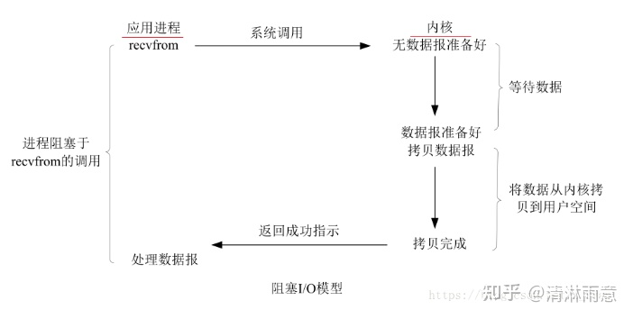
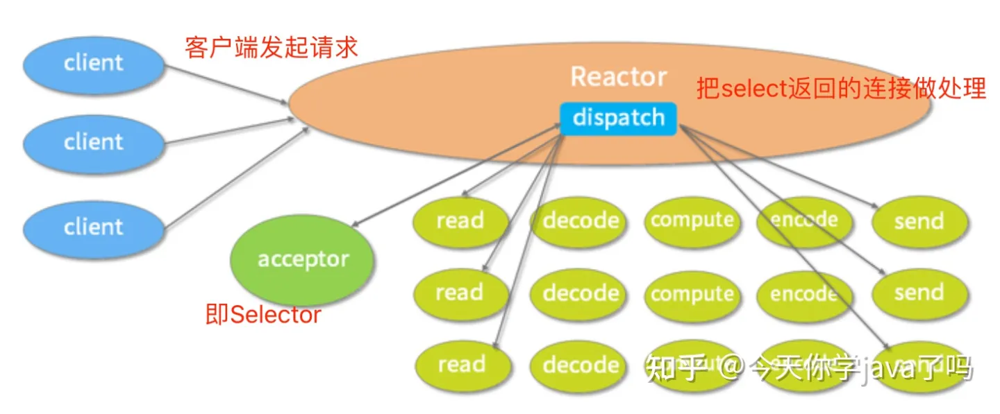
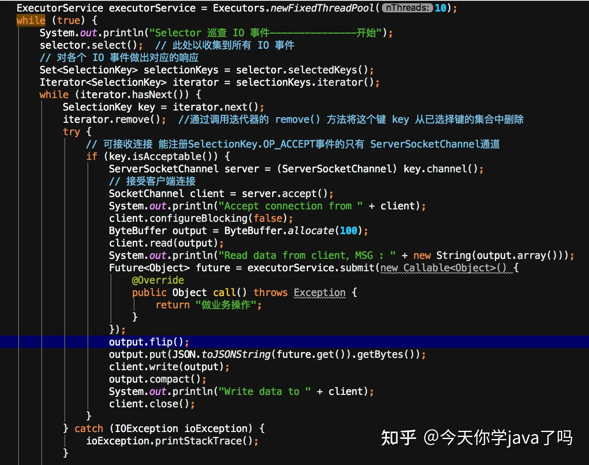

# IO多路复用机制

## 一、前言

netty能让使用者很轻松地使用较少的线程接入大量请求，这离不开其IO线程模型（即Reactor模型）的实现。

在我查找资料学习的过程中，大部分的博客都是在堆砌Reactor几种线程模型的介绍，并没有结合java代码进行说明，基本就是看了就忘。

**所以，本文决定从java网络编程入手，并结合一些操作系统相关知识（因为代码其实只是对操作系统方法的调用，底层决定上层逻辑），逐步阐述Reactor线程模型的设计原理。**

**你甚至不用先了解什么是Reactor模型！！！**

## **二、java BIO & Linux** 阻塞 IO

先从最基本的java Socket编程开始，根据上面的代码，可以看出分这几步：

1. 监听网络端口：newServerSocket(8080)
2. 死循环等待客户端建立连接
3. 接收到客户端连接：serverSocket.accept()
4. 读取输入，处理，写入输出，关闭连接

这里只用了一个线程，既要获取连接，又要处理请求。

而客户端的请求可能成千上万，所以可以优化成使用线程池处理，比如创建一万个线程，线程run方法里死循环，或者接收到客户端连接后将Socket提交给线程池进行后续处理。

作为一个java开发者我们可能只能基于上述代码想出此种优化方式，但如果我们更深入一点，了解下操作系统（Linux）的网络IO模型呢？

当上面代码去获取连接/读取网络输入流时，实际上是**应用程序执行了一个系统调用，比如去内核空间拷贝数据。**而内核缓冲区也需要等待网络上的数据分组到达，所以此处会堵塞。如下图

> 此处java代码底层也有可能使用的是同步非阻塞 IO，不确定，但原理大致相同

没有请求，代码就会一直堵塞在serverSocket.accept()。

这种IO方式对我们来说太耗费性能了，打个比方，就像大家去餐厅打包，每个人都去问前台我的食物有没有准备好，而后厨是不定时上菜，所有人在等待中浪费了时间和精力。

那还有没有其他更好的办法呢？

## **三、java NIO & Linux 多路复用**IO

有，Linux还提供了多路复用IO模型，原理如下图。

原理很简单，既然等待内核拷贝数据是必要且重复的，那么就提供一个方法（select、poll、epoll函数），可以去监听所有网络连接是否已就绪，数据是否已拷贝到内核。

就像餐厅打包这件事，变成了有个餐厅工作人员一直在问前台，有没有哪位顾客的食物已经准备好，有就呼叫顾客过来取餐，没有就继续问。

java也是根据此模型提出了NIO，让我们再结合相关代码看看。

首先，还是监听网络端口，创建一个Selector对象（通过此对象可发起底层select系统调用），注册ACCEPT事件，这样，select调用时就能把已建立的连接返回。

然后，循坏调用Selector的select方法，返回的肯定是已建立连接的，即isAcceptable的，所以下面就需要去读数据，但这个读也可以通过select系统调用，于是又向之前的Selector注册了READ事件，写同理，这样，select方法就把已建立连接的、可读的、可写的都返回，所以会有isAcceptable、isReadable、isWritable的判断，再分别去处理。

现在回过头再看NIO的用法是不是就比较清晰了呢！

采用这种方式就可以用少量的线程处理大量的连接请求，比如示例代码里是单线程，一次select可能就会查到多个就绪或者可读取请求数据的连接，再进行业务处理（其实redis单线程处理请求也是类似的方式）。

## 四、Reactor模式

Reactor线程模型基于NIO，有三种模式，分别介绍下。

### 1.单Reactor单线程模型

Reactor可以理解为主线程（或者单独创建一个线程去运行下述代码，则此线程就叫Reactor，主线程则用来堵塞不退出），运行逻辑就是通过select监控客户端请求事件，对返回的连接进行Read->业务处理->Send，反映到代码就是这样。

获取到就绪连接后，直接去堵塞地读和写。

**优点：**

1. 模型简单，没有多线程、进程通信、竞争的问题；

**缺点：**

1. 一个线程支持处理的连接数非常有限，无法发挥多核CPU的性能；
2. 多个事件被同时触发时，后面的事件必须等待前面的事件执行完毕，容易造成消息积压及请求超时；
3. 如果线程意外终止或者进入死循环，会导致整个系统不可用

### 2.单Reactor多线程模型

此模型与上面单线程模型最大的区别就在于引入了线程池去处理事件，反映到代码大概是这样。

> 此代码运行有点问题，当成伪代码看吧

把读到的请求数据提交给线程池去进行业务处理，再把返回的结果进行写入。

**优点：**

1. 可以充分利用多核CPU的能力

**缺点：**

1. 多线程数据共享和访问比较复杂，reactor主线程依旧是单线程去处理所有的事件监听和响应，在高并发下依旧存在性能问题

### **3.主从Reactor多线程模型**

此模型在上面单Reactor多线程的基础上又引入了一个Reactor线程，它也有一个Selector用于监听可读事件，其实有点像第三节的NIO示例一样，只是没复用同一个Selector，反映到代码大概是这样。

因为有了主从两个Reactor线程，所以主线程现在得用来堵塞从而保证不退出。主Reactor线程的逻辑还是去监听连接事件，但是会注册到从Reactor线程的Selector上。

从Reactor线程的逻辑就是去获取可读事件，然后交由线程池去处理，这块没有变化。

> 此代码请同样当成伪代码看吧

**优点：**

1. 响应快，不必为单个同步事件所阻塞，虽然Reactor线程本身依然是同步的；
2. 扩展性好，可以方便通过增加Reactor实例个数充分利用CPU资源，提升系统的吞吐量；
3. 连接建立和处理互不堵塞，支持海量客户端并发请求

> 本文摘自： https://zhuanlan.zhihu.com/p/486479088