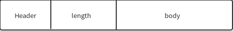
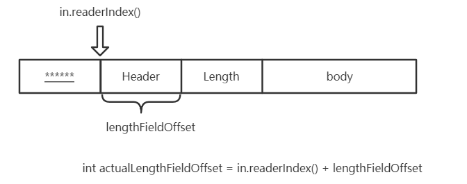
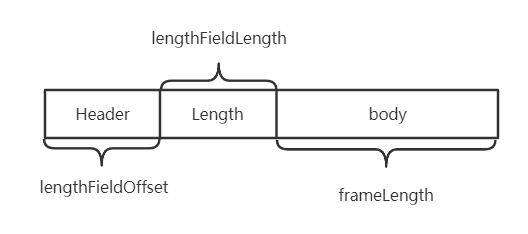
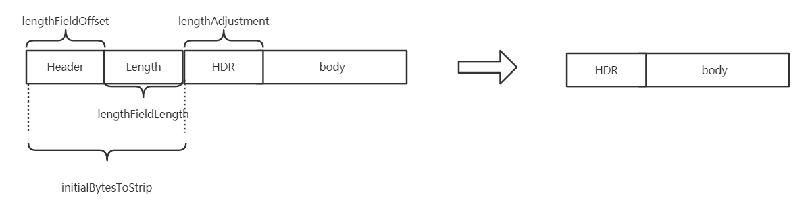

 #  Netty之LengthFieldBasedFrameDecoder的参数详解

## 参数介绍

一般情况下，协议都是有header,length,body组成，一般格式如下：



LengthFieldBasedFrameDecoder是netty解决拆包粘包问题的一个重要的类，主要结构就是header+body结构。我们只需要传入正确的参数就可以发送和接收正确的数据，那么重点就在于这几个参数的意义。下面我们就具体了解一下这几个参数的意义。先来看一下LengthFieldBasedFrameDecoder主要的构造方法：


````java
public LengthFieldBasedFrameDecoder(
            int maxFrameLength,
            int lengthFieldOffset, int lengthFieldLength,
            int lengthAdjustment, int initialBytesToStrip)
````

那么这几个重要的参数如下：

- maxFrameLength：最大帧长度。也就是可以接收的数据的最大长度。如果超过，此次数据会被丢弃。
- lengthFieldOffset：长度域偏移。就是说数据开始的几个字节可能不是表示数据长度，需要后移几个字节才是长度域。
- lengthFieldLength：长度域字节数。用几个字节来表示数据长度。
- lengthAdjustment：数据长度修正。因为长度域指定的长度可以使header+body的整个长度，也可以只是body的长度。如果表示header+body的整个长度，那么我们需要修正数据长度。
- initialBytesToStrip：跳过的字节数。如果你需要接收header+body的所有数据，此值就是0，如果你只想接收body数据，那么需要跳过header所占用的字节数。

## 参数详解

上面的后四个参数的主要作用，就是为了确定出最后想要获得的内容的长度。

我们先来看

LengthFieldBasedFrameDecoder的构造函数和

````java
 /**
     * Creates a new instance.
     *
     * @param byteOrder
     *        the {@link ByteOrder} of the length field
     * @param maxFrameLength
     *        the maximum length of the frame.  If the length of the frame is
     *        greater than this value, {@link TooLongFrameException} will be
     *        thrown.
     * @param lengthFieldOffset
     *        the offset of the length field
     * @param lengthFieldLength
     *        the length of the length field
     * @param lengthAdjustment
     *        the compensation value to add to the value of the length field
     * @param initialBytesToStrip
     *        the number of first bytes to strip out from the decoded frame
     * @param failFast
     *        If <tt>true</tt>, a {@link TooLongFrameException} is thrown as
     *        soon as the decoder notices the length of the frame will exceed
     *        <tt>maxFrameLength</tt> regardless of whether the entire frame
     *        has been read.  If <tt>false</tt>, a {@link TooLongFrameException}
     *        is thrown after the entire frame that exceeds <tt>maxFrameLength</tt>
     *        has been read.
     */
    public LengthFieldBasedFrameDecoder(
            ByteOrder byteOrder, int maxFrameLength, int lengthFieldOffset, int lengthFieldLength,
            int lengthAdjustment, int initialBytesToStrip, boolean failFast) {

        this.byteOrder = checkNotNull(byteOrder, "byteOrder");

        checkPositive(maxFrameLength, "maxFrameLength");

        checkPositiveOrZero(lengthFieldOffset, "lengthFieldOffset");

        checkPositiveOrZero(initialBytesToStrip, "initialBytesToStrip");

        if (lengthFieldOffset > maxFrameLength - lengthFieldLength) {
            throw new IllegalArgumentException(
                    "maxFrameLength (" + maxFrameLength + ") " +
                    "must be equal to or greater than " +
                    "lengthFieldOffset (" + lengthFieldOffset + ") + " +
                    "lengthFieldLength (" + lengthFieldLength + ").");
        }

       
        this.maxFrameLength = maxFrameLength;
        this.lengthFieldOffset = lengthFieldOffset;
        this.lengthFieldLength = lengthFieldLength;
        this.lengthAdjustment = lengthAdjustment;
        //lengthFieldEndOffset的值等于长度字段的偏移量+长度字段自身的大小
        this.lengthFieldEndOffset = lengthFieldOffset + lengthFieldLength;
        this.initialBytesToStrip = initialBytesToStrip;
        this.failFast = failFast;
    }
````


decode方法

````java
 /**
     * Create a frame out of the {@link ByteBuf} and return it.
     *
     * @param   ctx             the {@link ChannelHandlerContext} which this {@link ByteToMessageDecoder} belongs to
     * @param   in              the {@link ByteBuf} from which to read data
     * @return  frame           the {@link ByteBuf} which represent the frame or {@code null} if no frame could
     *                          be created.
     */
    protected Object decode(ChannelHandlerContext ctx, ByteBuf in) throws Exception {
        if (discardingTooLongFrame) {
            discardingTooLongFrame(in);
        }

        if (in.readableBytes() < lengthFieldEndOffset) {
            return null;
        }

        int actualLengthFieldOffset = in.readerIndex() + lengthFieldOffset;
        long frameLength = getUnadjustedFrameLength(in, actualLengthFieldOffset, lengthFieldLength, byteOrder);

        if (frameLength < 0) {
            failOnNegativeLengthField(in, frameLength, lengthFieldEndOffset);
        }

        frameLength += lengthAdjustment + lengthFieldEndOffset;

        if (frameLength < lengthFieldEndOffset) {
            failOnFrameLengthLessThanLengthFieldEndOffset(in, frameLength, lengthFieldEndOffset);
        }

        if (frameLength > maxFrameLength) {
            exceededFrameLength(in, frameLength);
            return null;
        }

        // never overflows because it's less than maxFrameLength
        int frameLengthInt = (int) frameLength;
        if (in.readableBytes() < frameLengthInt) {
            return null;
        }

        if (initialBytesToStrip > frameLengthInt) {
            failOnFrameLengthLessThanInitialBytesToStrip(in, frameLength, initialBytesToStrip);
        }
        in.skipBytes(initialBytesToStrip);

        // extract frame
        int readerIndex = in.readerIndex();
        int actualFrameLength = frameLengthInt - initialBytesToStrip;
        ByteBuf frame = extractFrame(ctx, in, readerIndex, actualFrameLength);
        in.readerIndex(readerIndex + actualFrameLength);
        return frame;
    }
````

从上面的方法我们一步一步的去分析几个参数的作用。

### lengthFieldOffset

在`decode()`方法的18行，先看`actualLengthFieldOffset`字段。它表示`LengthFieldOffset`的实际偏移量值。之所以需要定义这个字段，是因为` ByteBuf in`的readerIndex值可能不是0，换句话，本条数据的起始偏移量在` ByteBuf in`可能不是0。

````java
int actualLengthFieldOffset = in.readerIndex() + lengthFieldOffset;
````



### frameLength

在`decode()`方法的19行，frameLength表示此次传输，实际需要用到的数据的长度(一般指body的长度)。

````java
long frameLength = getUnadjustedFrameLength(in, actualLengthFieldOffset, lengthFieldLength, byteOrder);
````

看看`getUnadjustedFrameLength(in, actualLengthFieldOffset, lengthFieldLength, byteOrder)`的方法实现。

```java
/**
 * Decodes the specified region of the buffer into an unadjusted frame length.  The default implementation is
 * capable of decoding the specified region into an unsigned 8/16/24/32/64 bit integer.  Override this method to
 * decode the length field encoded differently.  Note that this method must not modify the state of the specified
 * buffer (e.g. {@code readerIndex}, {@code writerIndex}, and the content of the buffer.)
 *
 * @throws DecoderException if failed to decode the specified region
 */
protected long getUnadjustedFrameLength(ByteBuf buf, int offset, int length, ByteOrder order) {
    buf = buf.order(order);
    long frameLength;
    switch (length) {
    case 1:
        frameLength = buf.getUnsignedByte(offset);
        break;
    case 2:
        frameLength = buf.getUnsignedShort(offset);
        break;
    case 3:
        frameLength = buf.getUnsignedMedium(offset);
        break;
    case 4:
        frameLength = buf.getUnsignedInt(offset);
        break;
    case 8:
        frameLength = buf.getLong(offset);
        break;
    default:
        throw new DecoderException(
                "unsupported lengthFieldLength: " + lengthFieldLength + " (expected: 1, 2, 3, 4, or 8)");
    }
    return frameLength;
}
```

`long getUnadjustedFrameLength(ByteBuf buf, int offset, int length, ByteOrder order)`的作用就是从`ByteBuf buf`指定的索引位置开始读，读取length字节的数据。结合到`decode(ChannelHandlerContext ctx, ByteBuf in)`方法的内容，`getUnadjustedFrameLength`方法的作用就是从指定偏移量`actualLengthFieldOffset`开始读取length的数据，读取的数据结构就是 本次数据帧实际需要用到的数据的长度。

### lengthAdjustment

在`decode()`方法的25行frameLength的值被调整

```java
frameLength += lengthAdjustment + lengthFieldEndOffset;
//等价与
frameLength = frameLength + lengthAdjustment + lengthFieldEndOffset;
```

lengthFieldEndOffset的值在在构造函数中被初始化

````java
this.lengthFieldEndOffset = lengthFieldOffset + lengthFieldLength;
````

因此实际上frameLength的值为

````java
frameLength = frameLength + lengthAdjustment + lengthFieldOffset + lengthFieldLength;
````

一般情况下frameLength 、lengthFieldOffset 、 lengthFieldLength就能表示整个数据帧的长度，如下图：



但是有的时候长度域表示的长度不仅仅是body的长度，还可能包含长度域本身长度，也就是header+body，因此需要使用lengthAdjustment来调整。例如：

````shell
BEFORE DECODE (14 bytes)         AFTER DECODE (14 bytes)
+--------+----------------+      +--------+----------------+
| Length | Actual Content |----->| Length | Actual Content |
| 14     | "HELLO, WORLD" |      |  14    | "HELLO, WORLD" |
+--------+----------------+      +--------+----------------+
````

`"HELLO, WORLD"`的长度为12，很明显这里的Length是包含了Length本身的长度的，因此需要对进行调整，将lengthAdjustment的值设置为-2。

- lengthFieldOffset=0：开始的2个字节就是长度域，所以不需要长度域偏移。
- lengthFieldLength=2：长度域2个字节。
- lengthAdjustment=-2：因为长度域为总长度，所以我们需要修正数据长度，也就是减去2。
- initialBytesToStrip=0：我们发现接收的数据没有长度域的数据，所以要跳过长度域的2个字节。

除了上面这种情况需要lengthAdjustment进行调整，还会有其他的情况，例如在Length字段与body字段之间还存在其他的字段，这个时候我们也需要对lengthAdjustment进行调整。

````shell
BEFORE DECODE (16 bytes)                    AFTER DECODE (13 bytes)
+------+--------+------+----------------+      +------+----------------+
| HDR1 | Length | HDR2 | Actual Content |----->| HDR2 | Actual Content |
| 0xCA | 0x000C | 0xFE | "HELLO, WORLD" |      | 0xFE | "HELLO, WORLD" |
+------+--------+------+----------------+      +------+----------------+
````

这种情况下我们需要把hdr2+body当做body处理。body的长度要在`Actual Content`本身长度的基础上再加上` HDR2`的长度。

- lengthFieldOffset=1：开始的1个字节是长度域，所以需要设置长度域偏移为1。
- lengthFieldLength=2：长度域2个字节。
- lengthAdjustment=1：我们需要把hdr2+body当做body处理，所以数据长度需要加1。
- initialBytesToStrip=3：接收数据不包括hdr1和长度域相同，所以需要跳过3个字节。

### initialBytesToStrip

在`decode()`方法的37行

````java
int frameLengthInt = (int) frameLength;
````

在`decode()`方法的45行，initialBytesToStrip表示从本次数据帧`ByteBuf in`的readerIndex处跳过initialBytesToStrip个字节。

````java
int readerIndex = in.readerIndex();
````

在`decode()`方法的49行，actualFrameLength表示对

````java
int actualFrameLength = frameLengthInt - initialBytesToStrip;
````

### 最后得到的数据

在`decode()`方法的50行，在所有的参数都被调整好后，开始读取数据

````java
ByteBuf frame = extractFrame(ctx, in, readerIndex, actualFrameLength);
````

一起来看下`extractFrame(ChannelHandlerContext ctx, ByteBuf buffer, int index, int length)`方法的实现。

```
/**
 * Extract the sub-region of the specified buffer.
 */
protected ByteBuf extractFrame(ChannelHandlerContext ctx, ByteBuf buffer, int index, int length) {
    return buffer.retainedSlice(index, length);
}
```

该方法直接从`ByteBuf buffer`从中返回一个子分片。结合到`decode()`方法的内容分析，该分发直接从`ByteBuf in`的index索引处返回一个length长度的子分片。

## 总结

结合到上面的分析，我们可以得出LengthFieldBasedFrameDecoder与数据帧的关系如下图：



- lengthFieldOffset=length(Header)：开始的length(Header)个字节是长度域，所以需要设置长度域偏移为1。
- lengthFieldLength=length(Length)：长度域length(Length)个字节。
- lengthAdjustment=length(HDR)：我们需要把HDR+body当做body处理，所以数据长度需要加length(HDR)。
- initialBytesToStrip=length(Header) + length(Length)：接收数据不包括Header和长度域相同，所以需要跳过length(Header) + length(Length)个字节。

