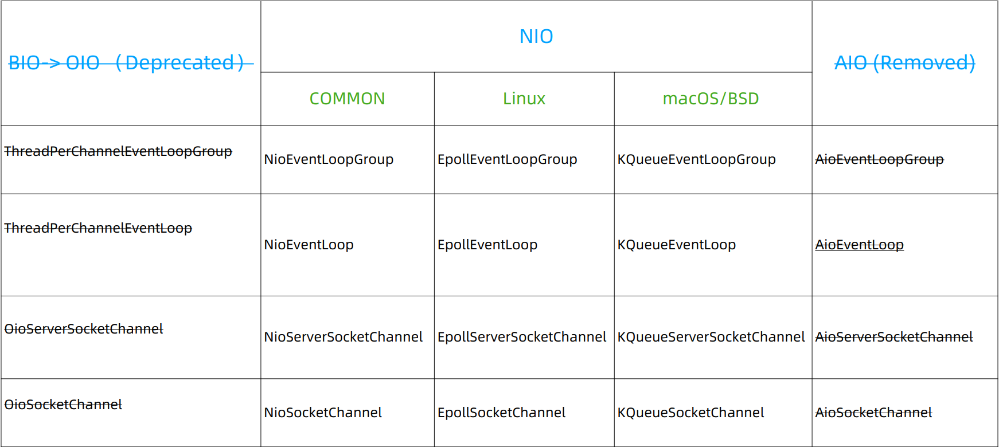

# Netty怎么切换三种IO模式

## 什么是经典的三种I/O模式

生活场景：

​        当我们去饭店吃饭时：

* 食堂排队打饭模式：排队在窗口，打好才走（BI0)；
* 点单、等待被叫模式：等待被叫，好了自己去端(NIO)；
* 包厢模式：点单后菜直接被端上桌(AIO)；

类比：

* 饭店 -> 服务器
* 饭菜 -> 数据
* 饭菜好了 -> 数据就绪
* 端菜/送菜 -> 数据读取

| 场景               | IO模式           | JDK版本           |
| ------------------ | ---------------- | ----------------- |
| 排队打饭模式       | BIO(阻塞I/O)     | JDK1.4以前        |
| 点单、等待被叫模式 | NIO（非阻塞I/O） | JDK1.4（2002年）  |
| 包厢模式           | AIO(异步I/O)     | JDK1.7（2011年）* |

## 几种模式的区别

### 阻塞与非阻塞

* 菜没好，要不要死等  -> 数据就绪钱要不要等待？
* 阻塞：没有数据传过来时，读会阻塞知道有数据；缓冲区满时，写阻塞也会阻塞。非阻塞遇到这些情况，则会直接返回。

### 同步与异步

* 菜好了，谁端 ？-> 数据就绪后，数据操作谁完成？
* 数据就绪后需要自己去读是同步，数据就绪直接读好后再回调给程序是异步。 

## Netty对三种I/O模式的支持

## 为什么Netty仅支持NIO了

### 为什么不建议（deprecate）阻塞I/O(BIO/OIO)？

连接数高的情况下：阻塞IO消耗资源多并且效率低

### 为什么删掉已经做好的AIO支持？

1. Windows实现成熟，但是很少用来做服务器。
2. Linux常用来做服务器，但是AIO实现不够成熟。
3. Linux下AIO相比较NIO性能提升不明显。

