# Netty那些事儿之Reactor在Netty中的实现-创建篇

> 转载自：https://segmentfault.com/a/1190000042200799


在上篇文章[《聊聊Netty那些事儿之从内核角度看IO模型》](https://developer.51cto.com/article/703026.html)中我们花了大量的篇幅来从内核角度详细讲述了五种IO模型的演进过程以及ReactorIO线程模型的底层基石IO多路复用技术在内核中的实现原理。

最后我们引出了netty中使用的主从Reactor IO线程模型。

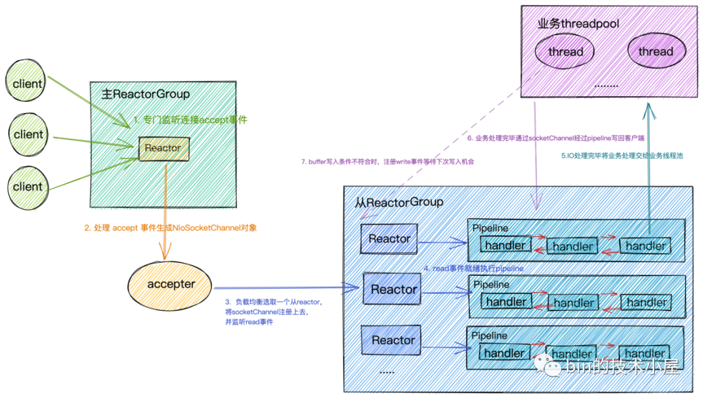

通过上篇文章的介绍，我们已经清楚了在IO调用的过程中内核帮我们搞了哪些事情，那么俗话说的好内核领进门，修行在netty，netty在用户空间又帮我们搞了哪些事情?

那么从本文开始，笔者将从源码角度来带大家看下上图中的Reactor IO线程模型在Netty中是如何实现的。

本文作为Reactor在Netty中实现系列文章中的开篇文章，笔者先来为大家介绍Reactor的骨架是如何创建出来的。

在上篇文章中我们提到Netty采用的是主从Reactor多线程的模型，但是它在实现上又与Doug Lea在Scalable IO in Java论文中提到的经典主从Reactor多线程模型有所差异。

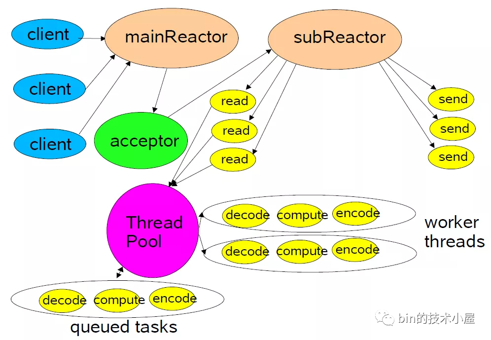

Netty中的Reactor是以Group的形式出现的，主从Reactor在Netty中就是主从Reactor组，每个Reactor Group中会有多个Reactor用来执行具体的IO任务。当然在netty中Reactor不只用来执行IO任务，这个我们后面再说。

- Main Reactor Group中的Reactor数量取决于服务端要监听的端口个数，通常我们的服务端程序只会监听一个端口，所以Main Reactor Group只会有一个Main Reactor线程来处理最重要的事情：绑定端口地址，接收客户端连接，为客户端创建对应的SocketChannel，将客户端SocketChannel分配给一个固定的Sub Reactor。也就是上篇文章笔者为大家举的例子，饭店最重要的工作就是先把客人迎接进来。“我家大门常打开，开放怀抱等你，拥抱过就有了默契你会爱上这里......”

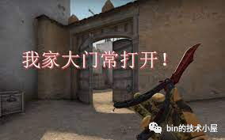

- Sub Reactor Group里有多个Reactor线程，Reactor线程的个数可以通过系统参数-D io.netty.eventLoopThreads指定。默认的Reactor的个数为CPU核数 * 2。Sub Reactor线程主要用来轮询客户端SocketChannel上的IO就绪事件，处理IO就绪事件，执行异步任务。Sub Reactor Group做的事情就是上篇饭店例子中服务员的工作，客人进来了要为客人分配座位，端茶送水，做菜上菜。“不管远近都是客人，请不用客气，相约好了在一起，我们欢迎您......”

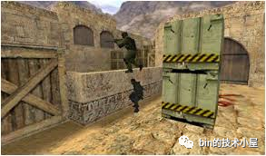

一个客户端SocketChannel只能分配给一个固定的Sub Reactor。一个Sub Reactor负责处理多个客户端SocketChannel，这样可以将服务端承载的全量客户端连接分摊到多个Sub Reactor中处理，同时也能保证客户端SocketChannel上的IO处理的线程安全性。

由于文章篇幅的关系，作为Reactor在netty中实现的第一篇我们主要来介绍主从Reactor Group的创建流程，骨架脉络先搭好。

下面我们来看一段Netty服务端代码的编写模板，从代码模板的流程中我们来解析下主从Reactor的创建流程以及在这个过程中所涉及到的Netty核心类。

## Netty服务端代码模板

````java
/**
 * Echoes back any received data from a client.
 */
public final class EchoServer {
    static final int PORT = Integer.parseInt(System.getProperty("port", "8007"));
    public static void main(String[] args) throws Exception {
        // Configure the server.
        //创建主从Reactor线程组
        EventLoopGroup bossGroup = new NioEventLoopGroup(1);
        EventLoopGroup workerGroup = new NioEventLoopGroup();
        final EchoServerHandler serverHandler = new EchoServerHandler();
        try {
            ServerBootstrap b = new ServerBootstrap();
            b.group(bossGroup, workerGroup)//配置主从Reactor
             .channel(NioServerSocketChannel.class)//配置主Reactor中的channel类型
             .option(ChannelOption.SO_BACKLOG, 100)//设置主Reactor中channel的option选项
             .handler(new LoggingHandler(LogLevel.INFO))//设置主Reactor中Channel->pipline->handler
             .childHandler(new ChannelInitializer<SocketChannel>() {//设置从Reactor中注册channel的pipeline
                 @Override
                 public void initChannel(SocketChannel ch) throws Exception {
                     ChannelPipeline p = ch.pipeline();
                     //p.addLast(new LoggingHandler(LogLevel.INFO));
                     p.addLast(serverHandler);
                 }
             });
            // Start the server. 绑定端口启动服务，开始监听accept事件
            ChannelFuture f = b.bind(PORT).sync();
            // Wait until the server socket is closed.
            f.channel().closeFuture().sync();
        } finally {
            // Shut down all event loops to terminate all threads.
            bossGroup.shutdownGracefully();
            workerGroup.shutdownGracefully();
        }
    }
}
````

首先我们要创建Netty最核心的部分 -> 创建主从Reactor Group，在Netty中EventLoopGroup就是Reactor Group的实现类。对应的EventLoop就是Reactor的实现类。

````java
  //创建主从Reactor线程组
  EventLoopGroup bossGroup = new NioEventLoopGroup(1);
  EventLoopGroup workerGroup = new NioEventLoopGroup();
````

创建用于IO处理的ChannelHandler，实现相应IO事件的回调函数，编写对应的IO处理逻辑。注意这里只是简单示例哈，详细的IO事件处理，笔者会单独开一篇文章专门讲述。

````java
final EchoServerHandler serverHandler = new EchoServerHandler();
/**
 * Handler implementation for the echo server.
 */
@Sharable
public class EchoServerHandler extends ChannelInboundHandlerAdapter {
    @Override
    public void channelRead(ChannelHandlerContext ctx, Object msg) {
        ................省略IO处理逻辑................
        ctx.write(msg);
    }
    @Override
    public void channelReadComplete(ChannelHandlerContext ctx) {
        
        ctx.flush();
    }
    @Override
    public void exceptionCaught(ChannelHandlerContext ctx, Throwable cause) {
        // Close the connection when an exception is raised.
        cause.printStackTrace();
        ctx.close();
    }
}
````

创建ServerBootstrapNetty服务端启动类，并在启动类中配置启动Netty服务端所需要的一些必备信息。

在上篇文章介绍Socket内核结构小节中我们提到，在编写服务端网络程序时，我们首先要创建一个Socket用于listen和bind端口地址，我们把这个叫做监听Socket,这里对应的就是NioServerSocketChannel.class。当客户端连接完成三次握手，系统调用accept函数会基于监听Socket创建出来一个新的Socket专门用于与客户端之间的网络通信我们称为客户端连接Socket,这里对应的就是NioSocketChannel.class。

netty有两种Channel类型：一种是服务端用于监听绑定端口地址的NioServerSocketChannel,一种是用于客户端通信的NioSocketChannel。每种Channel类型实例都会对应一个PipeLine用于编排对应channel实例上的IO事件处理逻辑。PipeLine中组织的就是ChannelHandler用于编写特定的IO处理逻辑。

**注意：**serverBootstrap.handler设置的是服务端NioServerSocketChannel PipeLine中的ChannelHandler。

- ServerBootstrap启动类方法带有child前缀的均是设置客户端NioSocketChannel属性的。
- ChannelInitializer是用于当SocketChannel成功注册到绑定的Reactor上后，用于初始化该SocketChannel的Pipeline。它的initChannel方法会在注册成功后执行。这里只是捎带提一下，让大家有个初步印象，后面我会专门介绍。
- serverBootstrap.childHandler(ChannelHandler childHandler)用于设置客户端NioSocketChannel中对应Pipieline中的ChannelHandler。我们通常配置的编码解码器就是在这里。
- serverBootstrap.option(ChannelOption.SO_BACKLOG, 100)设置服务端ServerSocketChannel中的SocketOption。关于SocketOption的选项我们后边的文章再聊，本文主要聚焦在Netty Main Reactor Group的创建及工作流程。
- serverBootstrap.handler(....)设置服务端NioServerSocketChannel中对应Pipieline中的ChannelHandler。
- 通过serverBootstrap.group(bossGroup, workerGroup)为Netty服务端配置主从Reactor Group实例。
- 通过serverBootstrap.channel(NioServerSocketChannel.class)配置Netty服务端的ServerSocketChannel用于绑定端口地址以及创建客户端SocketChannel。Netty中的NioServerSocketChannel.class就是对JDK NIO中ServerSocketChannel的封装。而用于表示客户端连接的NioSocketChannel是对JDK NIO SocketChannel封装。

ChannelFuture f = serverBootstrap.bind(PORT).sync()这一步会是下篇文章要重点分析的主题Main Reactor Group的启动，绑定端口地址，开始监听客户端连接事件(OP_ACCEPT)。本文我们只关注创建流程。

f.channel().closeFuture().sync()等待服务端NioServerSocketChannel关闭。Netty服务端到这里正式启动，并准备好接受客户端连接的准备。

shutdownGracefully优雅关闭主从Reactor线程组里的所有Reactor线程。

## Netty对IO模型的支持

在上篇文章中我们介绍了五种IO模型，Netty中支持BIO,NIO,AIO以及多种操作系统下的IO多路复用技术实现。

在Netty中切换这几种IO模型也是非常的方便，下面我们来看下Netty如何对这几种IO模型进行支持的。

首先我们介绍下几个与IO模型相关的重要接口：

### EventLoop

EventLoop就是Netty中的Reactor，可以说它就是Netty的引擎，负责Channel上IO就绪事件的监听，IO就绪事件的处理，异步任务的执行驱动着整个Netty的运转。

不同IO模型下，EventLoop有着不同的实现，我们只需要切换不同的实现类就可以完成对NettyIO模型的切换。

| BIO                   | NIO          | AIO          |
| --------------------- | ------------ | ------------ |
| ThreadPerTaskExecutor | NioEventLoop | AioEventLoop |

在NIO模型下Netty会自动根据操作系统以及版本的不同选择对应的IO多路复用技术实现。比如Linux 2.6版本以上用的是Epoll，2.6版本以下用的是Poll，Mac下采用的是Kqueue。

其中Linux kernel 在5.1版本引入的异步IO库io_uring正在netty中孵化。

### EventLoopGroup

Netty中的Reactor是以Group的形式出现的，EventLoopGroup正是Reactor组的接口定义，负责管理Reactor，Netty中的Channel就是通过EventLoopGroup注册到具体的Reactor上的。

Netty的IO线程模型是主从Reactor多线程模型，主从Reactor线程组在Netty源码中对应的其实就是两个EventLoopGroup实例。

不同的IO模型也有对应的实现：

| BIO                            | NIO               | AIO               |
| ------------------------------ | ----------------- | ----------------- |
| ThreadPerChannelEventLoopGroup | NioEventLoopGroup | AioEventLoopGroup |

### ServerSocketChannel

用于Netty服务端使用的ServerSocketChannel，对应于上篇文章提到的监听Socket，负责绑定监听端口地址，接收客户端连接并创建用于与客户端通信的SocketChannel。

不同的IO模型下的实现：

| BIO                    | NIO                    | AIO                    |
| ---------------------- | ---------------------- | ---------------------- |
| OioServerSocketChannel | NioServerSocketChannel | AioServerSocketChannel |

我们看到在不同IO模型的实现中，Netty这些围绕IO模型的核心类只是前缀的不同：

- BIO对应的前缀为Oio表示old io，现在已经废弃不推荐使用。
- NIO对应的前缀为Nio，正是Netty推荐也是我们常用的非阻塞IO模型。
- AIO对应的前缀为Aio，由于Linux下的异步IO机制实现的并不成熟，性能提升表现上也不明显，现已被删除。

我们只需要将IO模型的这些核心接口对应的实现类前缀改为对应IO模型的前缀，就可以轻松在Netty中完成对IO模型的切换。

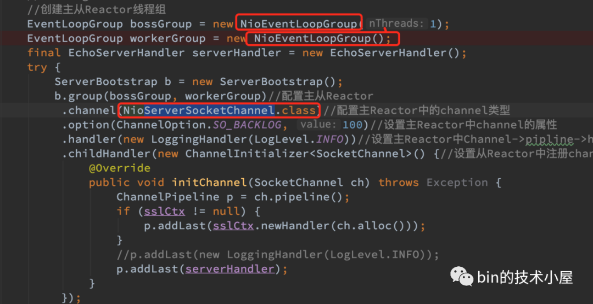

### 多种NIO的实现

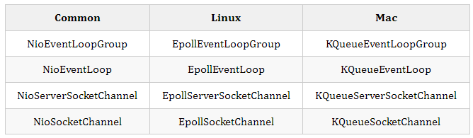

我们通常在使用NIO模型的时候会使用Common列下的这些IO模型核心类，Common类也会根据操作系统的不同自动选择JDK在对应平台下的IO多路复用技术的实现。

而Netty自身也根据操作系统的不同提供了自己对IO多路复用技术的实现，比JDK的实现性能更优。比如：

- JDK的 NIO 默认实现是水平触发，Netty 是边缘触发(默认)和水平触发可切换。
- Netty 实现的垃圾回收更少、性能更好。

我们编写Netty服务端程序的时候也可以根据操作系统的不同，采用Netty自身的实现来进一步优化程序。做法也很简单，直接将上图中红框里的实现类替换成Netty的自身实现类即可完成切换。

经过以上对Netty服务端代码编写模板以及IO模型相关核心类的简单介绍，我们对Netty的创建流程有了一个简单粗略的总体认识，下面我们来深入剖析下创建流程过程中的每一个步骤以及这个过程中涉及到的核心类实现。

以下源码解析部分我们均采用Common列下NIO相关的实现进行解析。

## 创建主从Reactor线程组

在Netty服务端程序编写模板的开始，我们首先会创建两个Reactor线程组：


- 一个是主Reactor线程组bossGroup用于监听客户端连接，创建客户端连接NioSocketChannel，并将创建好的客户端连接NioSocketChannel注册到从Reactor线程组中一个固定的Reactor上。
- 一个是从Reactor线程组workerGroup，workerGroup中的Reactor负责监听绑定在其上的客户端连接NioSocketChannel上的IO就绪事件，并处理IO就绪事件，执行异步任务。

````java
  //创建主从Reactor线程组
  EventLoopGroup bossGroup = new NioEventLoopGroup(1);
  EventLoopGroup workerGroup = new NioEventLoopGroup();
````

Netty中Reactor线程组的实现类为NioEventLoopGroup，在创建bossGroup和workerGroup的时候用到了NioEventLoopGroup的两个构造函数：

- 带nThreads参数的构造函数public NioEventLoopGroup(int nThreads)。
- 不带nThreads参数的默认构造函数public NioEventLoopGroup()。

````java
public class NioEventLoopGroup extends MultithreadEventLoopGroup {
    /**
     * Create a new instance using the default number of threads, the default {@link ThreadFactory} and
     * the {@link SelectorProvider} which is returned by {@link SelectorProvider#provider()}.
     */
    public NioEventLoopGroup() {
        this(0);
    }
    /**
     * Create a new instance using the specified number of threads, {@link ThreadFactory} and the
     * {@link SelectorProvider} which is returned by {@link SelectorProvider#provider()}.
     */
    public NioEventLoopGroup(int nThreads) {
        this(nThreads, (Executor) null);
    }
    ......................省略...........................
}
````

nThreads参数表示当前要创建的Reactor线程组内包含多少个Reactor线程。不指定nThreads参数的话采用默认的Reactor线程个数，用0表示。

最终会调用到构造函数。

````java
  public NioEventLoopGroup(int nThreads, Executor executor, final SelectorProvider selectorProvider,
                             final SelectStrategyFactory selectStrategyFactory) {
        super(nThreads, executor, selectorProvider, selectStrategyFactory, RejectedExecutionHandlers.reject());
    }
````

下面简单介绍下构造函数中这几个参数的作用，后面我们在讲解本文主线的过程中还会提及这几个参数，到时在详细介绍，这里只是让大家有个初步印象，不必做过多的纠缠。

- **Executor executor：**负责启动Reactor线程进而Reactor才可以开始工作。

Reactor线程组NioEventLoopGroup负责创建Reactor线程，在创建的时候会将executor传入。

- **RejectedExecutionHandler：** 当向Reactor添加异步任务添加失败时，采用的拒绝策略。Reactor的任务不只是监听IO活跃事件和IO任务的处理，还包括对异步任务的处理。这里大家只需有个这样的概念，后面笔者会专门详细介绍。
- **SelectorProvider selectorProvider：** Reactor中的IO模型为IO多路复用模型，对应于JDK NIO中的实现为java.nio.channels.Selector(就是我们上篇文章中提到的select,poll,epoll)，每个Reator中都包含一个Selector，用于轮询注册在该Reactor上的所有Channel上的IO事件。SelectorProvider就是用来创建Selector的。
- **SelectStrategyFactory selectStrategyFactory：** Reactor最重要的事情就是轮询注册其上的Channel上的IO就绪事件，这里的SelectStrategyFactory用于指定轮询策略，默认为DefaultSelectStrategyFactory.INSTANCE。

最终会将这些参数交给NioEventLoopGroup的父类构造器，下面我们来看下NioEventLoopGroup类的继承结构：

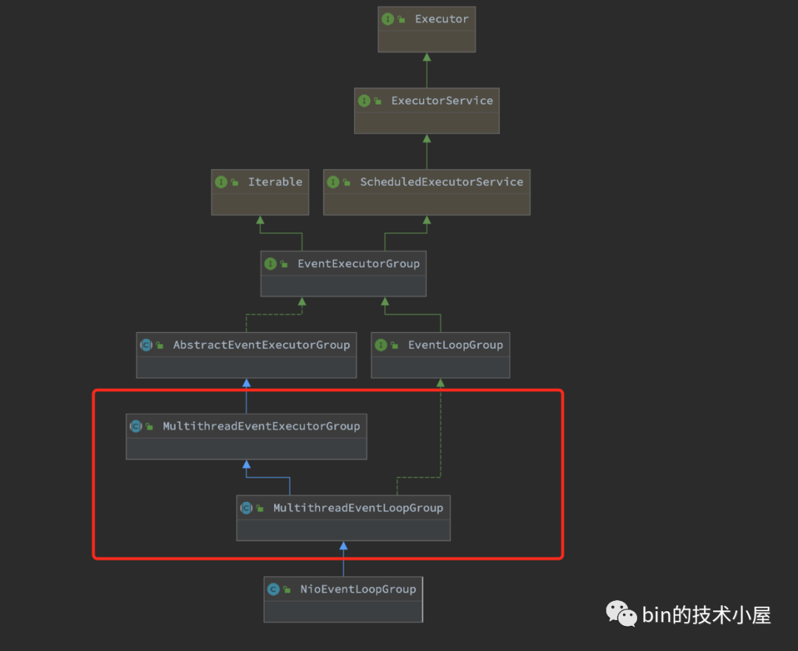

NioEventLoopGroup类的继承结构乍一看比较复杂，大家不要慌，笔者会随着主线的深入慢慢地介绍这些父类接口，我们现在重点关注Mutithread前缀的类。

我们知道NioEventLoopGroup是Netty中的Reactor线程组的实现，既然是线程组那么肯定是负责管理和创建多个Reactor线程的，所以Mutithread前缀的类定义的行为自然是对Reactor线程组内多个Reactor线程的创建和管理工作。

### MultithreadEventLoopGroup

````java
public abstract class MultithreadEventLoopGroup extends MultithreadEventExecutorGroup implements EventLoopGroup {
    private static final InternalLogger logger = InternalLoggerFactory.getInstance(MultithreadEventLoopGroup.class);
    //默认Reactor个数
    private static final int DEFAULT_EVENT_LOOP_THREADS;
    static {
        DEFAULT_EVENT_LOOP_THREADS = Math.max(1, SystemPropertyUtil.getInt(
                "io.netty.eventLoopThreads", NettyRuntime.availableProcessors() * 2));
        if (logger.isDebugEnabled()) {
            logger.debug("-Dio.netty.eventLoopThreads: {}", DEFAULT_EVENT_LOOP_THREADS);
        }
    }
    /**
     * @see MultithreadEventExecutorGroup#MultithreadEventExecutorGroup(int, Executor, Object...)
     */
    protected MultithreadEventLoopGroup(int nThreads, Executor executor, Object... args) {
        super(nThreads == 0 ? DEFAULT_EVENT_LOOP_THREADS : nThreads, executor, args);
    }
    ...................省略.....................
}
````

MultithreadEventLoopGroup类主要的功能就是用来确定Reactor线程组内Reactor的个数。

默认的Reactor的个数存放于字段DEFAULT_EVENT_LOOP_THREADS中。

从static {}静态代码块中我们可以看出默认Reactor的个数的获取逻辑：

- 可以通过系统变量 -D io.netty.eventLoopThreads"指定。
- 如果不指定，那么默认的就是NettyRuntime.availableProcessors() * 2。

当nThread参数设置为0采用默认设置时，Reactor线程组内的Reactor个数则设置为DEFAULT_EVENT_LOOP_THREADS。

### MultithreadEventExecutorGroup

MultithreadEventExecutorGroup这里就是本小节的核心，主要用来定义创建和管理Reactor的行为。

````java
public abstract class MultithreadEventExecutorGroup extends AbstractEventExecutorGroup {
    //Reactor线程组中的Reactor集合
    private final EventExecutor[] children;
    private final Set<EventExecutor> readonlyChildren;
    //从Reactor group中选择一个特定的Reactor的选择策略 用于channel注册绑定到一个固定的Reactor上
    private final EventExecutorChooserFactory.EventExecutorChooser chooser;
    /**
     * Create a new instance.
     *
     * @param nThreads          the number of threads that will be used by this instance.
     * @param executor          the Executor to use, or {@code null} if the default should be used.
     * @param args              arguments which will passed to each {@link #newChild(Executor, Object...)} call
     */
    protected MultithreadEventExecutorGroup(int nThreads, Executor executor, Object... args) {
        this(nThreads, executor, DefaultEventExecutorChooserFactory.INSTANCE, args);
    }
    ............................省略................................
}
````

首先介绍一个新的构造器参数EventExecutorChooserFactory chooserFactory。当客户端连接完成三次握手后，Main Reactor会创建客户端连接NioSocketChannel，并将其绑定到Sub Reactor Group中的一个固定Reactor，那么具体要绑定到哪个具体的Sub Reactor上呢?这个绑定策略就是由chooserFactory来创建的。默认为DefaultEventExecutorChooserFactory。

下面就是本小节的主题Reactor线程组的创建过程：

````java
    protected MultithreadEventExecutorGroup(int nThreads, Executor executor,
                                           EventExecutorChooserFactory chooserFactory, Object... args) {
        if (nThreads <= 0) {
            throw new IllegalArgumentException(String.format("nThreads: %d (expected: > 0)", nThreads));
        }
        if (executor == null) {
            //用于创建Reactor线程
            executor = new ThreadPerTaskExecutor(newDefaultThreadFactory());
        }
        children = new EventExecutor[nThreads];
        //循环创建reaactor group中的Reactor
        for (int i = 0; i < nThreads; i ++) {
            boolean success = false;
            try {
                //创建reactor
                children[i] = newChild(executor, args);
                success = true;
            } catch (Exception e) {
                throw new IllegalStateException("failed to create a child event loop", e);
            } finally {
                     ................省略................
                }
            }
        }
        //创建channel到Reactor的绑定策略
        chooser = chooserFactory.newChooser(children);

         ................省略................

        Set<EventExecutor> childrenSet = new LinkedHashSet<EventExecutor>(children.length);
        Collections.addAll(childrenSet, children);
        readonlyChildren = Collections.unmodifiableSet(childrenSet);
    }
````

### 1、创建用于启动Reactor线程的executor

在Netty Reactor Group中的单个Reactor的IO线程模型为上篇文章提到的单Reactor单线程模型，一个Reactor线程负责轮询注册其上的所有Channel中的IO就绪事件，处理IO事件，执行Netty中的异步任务等工作。正是这个Reactor线程驱动着整个Netty的运转，可谓是Netty的核心引擎。

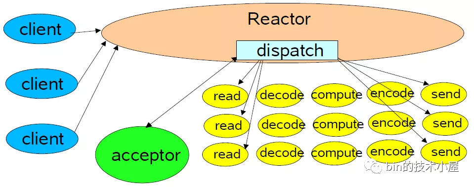

而这里的executor就是负责启动Reactor线程的，从创建源码中我们可以看到executor的类型为ThreadPerTaskExecutor。

#### ThreadPerTaskExecutor

````java
public final class ThreadPerTaskExecutor implements Executor {
    private final ThreadFactory threadFactory;
    public ThreadPerTaskExecutor(ThreadFactory threadFactory) {
        this.threadFactory = ObjectUtil.checkNotNull(threadFactory, "threadFactory");
    }
    @Override
    public void execute(Runnable command) {
        threadFactory.newThread(command).start();
    }
}
````

我们看到ThreadPerTaskExecutor做的事情很简单，从它的命名前缀ThreadPerTask我们就可以猜出它的工作方式，就是来一个任务就创建一个线程执行。而创建的这个线程正是netty的核心引擎Reactor线程。

在Reactor线程启动的时候，Netty会将Reactor线程要做的事情封装成Runnable，丢给exexutor启动。

而Reactor线程的核心就是一个死循环不停的轮询IO就绪事件，处理IO事件，执行异步任务。一刻也不停歇，堪称996典范。

这里向大家先卖个关子，"Reactor线程是何时启动的呢??"

### 2、 创建ReactorReactor

线程组NioEventLoopGroup包含多个Reactor，存放于private final EventExecutor[] children数组中。

所以下面的事情就是创建nThread个Reactor，并存放于EventExecutor[] children字段中，

我们来看下用于创建Reactor的newChild(executor, args)方法：

#### newChild

newChild方法是MultithreadEventExecutorGroup中的一个抽象方法，提供给具体子类实现。

````java
protected abstract EventExecutor newChild(Executor executor, Object... args) throws Exception;
````

这里我们解析的是NioEventLoopGroup，我们来看下newChild在该类中的实现：

````java
public class NioEventLoopGroup extends MultithreadEventLoopGroup {
    @Override
    protected EventLoop newChild(Executor executor, Object... args) throws Exception {
        EventLoopTaskQueueFactory queueFactory = args.length == 4 ? (EventLoopTaskQueueFactory) args[3] : null;
        return new NioEventLoop(this, executor, (SelectorProvider) args[0],
            ((SelectStrategyFactory) args[1]).newSelectStrategy(), (RejectedExecutionHandler) args[2], queueFactory);
    }
}
````

前边提到的众多构造器参数，这里会通过可变参数Object... args传入到Reactor类NioEventLoop的构造器中。

这里介绍下新的参数EventLoopTaskQueueFactory queueFactory，前边提到Netty中的Reactor主要工作是轮询注册其上的所有Channel上的IO就绪事件，处理IO就绪事件。除了这些主要的工作外，Netty为了极致的压榨Reactor的性能，还会让它做一些异步任务的执行工作。既然要执行异步任务，那么Reactor中就需要一个队列来保存任务。

这里的EventLoopTaskQueueFactory就是用来创建这样的一个队列来保存Reactor中待执行的异步任务。

可以把Reactor理解成为一个单线程的线程池，类似于JDK中的SingleThreadExecutor，仅用一个线程来执行轮询IO就绪事件，处理IO就绪事件，执行异步任务。同时待执行的异步任务保存在Reactor里的taskQueue中。

#### NioEventLoop

````java
public final class NioEventLoop extends SingleThreadEventLoop {
    //用于创建JDK NIO Selector,ServerSocketChannel
    private final SelectorProvider provider;
    //Selector轮询策略 决定什么时候轮询，什么时候处理IO事件，什么时候执行异步任务
    private final SelectStrategy selectStrategy;
    /**
     * The NIO {@link Selector}.
     */
    private Selector selector;
    private Selector unwrappedSelector;
    NioEventLoop(NioEventLoopGroup parent, Executor executor, SelectorProvider selectorProvider,
                 SelectStrategy strategy, RejectedExecutionHandler rejectedExecutionHandler,
                 EventLoopTaskQueueFactory queueFactory) {
        super(parent, executor, false, newTaskQueue(queueFactory), newTaskQueue(queueFactory),
                rejectedExecutionHandler);
        this.provider = ObjectUtil.checkNotNull(selectorProvider, "selectorProvider");
        this.selectStrategy = ObjectUtil.checkNotNull(strategy, "selectStrategy");
        final SelectorTuple selectorTuple = openSelector();
        this.selector = selectorTuple.selector;
        this.unwrappedSelector = selectorTuple.unwrappedSelector;
    }
}
````

这里就正式开始了Reactor的创建过程，我们知道Reactor的核心是采用的IO多路复用模型来对客户端连接上的IO事件进行监听，所以最重要的事情是创建Selector(JDK NIO 中IO多路复用技术的实现)。

可以把Selector理解为我们上篇文章介绍的Select,poll,epoll，它是JDK NIO对操作系统内核提供的这些IO多路复用技术的封装。

#### openSelector

openSelector是NioEventLoop类中用于创建IO多路复用的Selector，并对创建出来的JDK NIO 原生的Selector进行性能优化。

首先会通过SelectorProvider#openSelector创建JDK NIO原生的Selector。

````java
 private SelectorTuple openSelector() {
        final Selector unwrappedSelector;
        try {
            //通过JDK NIO SelectorProvider创建Selector
            unwrappedSelector = provider.openSelector();
        } catch (IOException e) {
            throw new ChannelException("failed to open a new selector", e);
        }

        ..................省略.............
}
````

SelectorProvider会根据操作系统的不同选择JDK在不同操作系统版本下的对应Selector的实现。Linux下会选择Epoll，Mac下会选择Kqueue。

下面我们就来看下SelectorProvider是如何做到自动适配不同操作系统下IO多路复用实现的。

#### SelectorProvider

````java
  public NioEventLoopGroup(ThreadFactory threadFactory) {
        this(0, threadFactory, SelectorProvider.provider());
    }
````

SelectorProvider是在前面介绍的NioEventLoopGroup类构造函数中通过调用SelectorProvider.provider()被加载，并通过NioEventLoopGroup#newChild方法中的可变长参数Object... args传递到NioEventLoop中的private final SelectorProvider provider字段中。

SelectorProvider的加载过程：

````java
public abstract class SelectorProvider {
    public static SelectorProvider provider() {
        synchronized (lock) {
            if (provider != null)
                return provider;
            return AccessController.doPrivileged(
                new PrivilegedAction<SelectorProvider>() {
                    public SelectorProvider run() {
                            if (loadProviderFromProperty())
                                return provider;
                            if (loadProviderAsService())
                                return provider;
                            provider = sun.nio.ch.DefaultSelectorProvider.create();
                            return provider;
                        }
                    });
        }
    }
}
````

从SelectorProvider加载源码中我们可以看出，SelectorProvider的加载方式有三种，优先级如下：

通过系统变量-D java.nio.channels.spi.SelectorProvider指定SelectorProvider的自定义实现类全限定名。通过应用程序类加载器(Application Classloader)加载。

通过SPI方式加载。在工程目录META-INF/services下定义名为java.nio.channels.spi.SelectorProvider的SPI文件，文件中第一个定义的SelectorProvider实现类全限定名就会被加载。

````java
  private static boolean loadProviderAsService() {
        ServiceLoader<SelectorProvider> sl =
            ServiceLoader.load(SelectorProvider.class,
                              ClassLoader.getSystemClassLoader());
        Iterator<SelectorProvider> i = sl.iterator();
        for (;;) {
            try {
                if (!i.hasNext())
                    return false;
                provider = i.next();
                return true;
            } catch (ServiceConfigurationError sce) {
                if (sce.getCause() instanceof SecurityException) {
                    // Ignore the security exception, try the next provider
                    continue;
                }
                throw sce;
            }
        }
    }
````

如果以上两种方式均未被定义，那么就采用SelectorProvider系统默认实现sun.nio.ch.DefaultSelectorProvider。笔者当前使用的操作系统是MacOS，从源码中我们可以看到自动适配了KQueue实现。

````java
public class DefaultSelectorProvider {
    private DefaultSelectorProvider() {
    }
    public static SelectorProvider create() {
        return new KQueueSelectorProvider();
    }
}
````

不同操作系统中JDK对于DefaultSelectorProvider会有所不同，Linux内核版本2.6以上对应的Epoll，Linux内核版本2.6以下对应的Poll，MacOS对应的是KQueue。

下面我们接着回到io.netty.channel.nio.NioEventLoop#openSelector的主线上来。

### Netty对JDK NIO 原生Selector的优化

首先在NioEventLoop中有一个Selector优化开关DISABLE_KEY_SET_OPTIMIZATION,通过系统变量-D io.netty.noKeySetOptimization指定，默认是开启的，表示需要对JDK NIO原生Selector进行优化。

````java
public final class NioEventLoop extends SingleThreadEventLoop {
   //Selector优化开关 默认开启 为了遍历的效率 会对Selector中的SelectedKeys进行数据结构优化
    private static final boolean DISABLE_KEY_SET_OPTIMIZATION =
            SystemPropertyUtil.getBoolean("io.netty.noKeySetOptimization", false);
}
````

如果优化开关DISABLE_KEY_SET_OPTIMIZATION是关闭的，那么直接返回JDK NIO原生的Selector。

````java
private SelectorTuple openSelector() {
        ..........SelectorProvider创建JDK NIO  原生Selector..............
        if (DISABLE_KEY_SET_OPTIMIZATION) {
            //JDK NIO原生Selector ，Selector优化开关 默认开启需要对Selector进行优化
            return new SelectorTuple(unwrappedSelector);
        }
}
````

下面为Netty对JDK NIO原生的Selector的优化过程：

获取JDK NIO原生Selector的抽象实现类sun.nio.ch.SelectorImpl。JDK NIO原生Selector的实现均继承于该抽象类。用于判断由SelectorProvider创建出来的Selector是否为JDK默认实现(SelectorProvider第三种加载方式)。因为SelectorProvider可以是自定义加载，所以它创建出来的Selector并不一定是JDK NIO 原生的。

````java
   Object maybeSelectorImplClass = AccessController.doPrivileged(new PrivilegedAction<Object>() {
            @Override
            public Object run() {
                try {
                    return Class.forName(
                            "sun.nio.ch.SelectorImpl",
                            false,
                            PlatformDependent.getSystemClassLoader());
                } catch (Throwable cause) {
                    return cause;
                }
            }
        });
````

JDK NIO Selector的抽象类sun.nio.ch.SelectorImpl。

````java
public abstract class SelectorImpl extends AbstractSelector {

    // The set of keys with data ready for an operation
    // //IO就绪的SelectionKey（里面包裹着channel）
    protected Set<SelectionKey> selectedKeys;

    // The set of keys registered with this Selector
    //注册在该Selector上的所有SelectionKey（里面包裹着channel）
    protected HashSet<SelectionKey> keys;

    // Public views of the key sets
    //用于向调用线程返回的keys，不可变
    private Set<SelectionKey> publicKeys;             // Immutable
    //当有IO就绪的SelectionKey时，向调用线程返回。只可删除其中元素，不可增加
    private Set<SelectionKey> publicSelectedKeys;     // Removal allowed, but not addition

    protected SelectorImpl(SelectorProvider sp) {
        super(sp);
        keys = new HashSet<SelectionKey>();
        selectedKeys = new HashSet<SelectionKey>();
        if (Util.atBugLevel("1.4")) {
            publicKeys = keys;
            publicSelectedKeys = selectedKeys;
        } else {
            //不可变
            publicKeys = Collections.unmodifiableSet(keys);
            //只可删除其中元素，不可增加
            publicSelectedKeys = Util.ungrowableSet(selectedKeys);
        }
    }
}
````

这里笔者来简单介绍下JDK NIO中的Selector中这几个字段的含义，我们可以和上篇文章讲到的epoll在内核中的结构做类比，方便大家后续的理解：

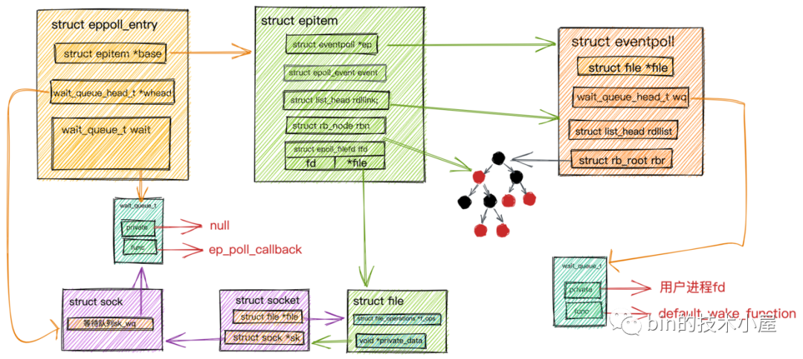

- Set selectedKeys 类似于我们上篇文章讲解Epoll时提到的就绪队列eventpoll->rdllist，Selector这里大家可以理解为Epoll。Selector会将自己监听到的IO就绪的Channel放到selectedKeys中。

这里的SelectionKey暂且可以理解为Channel在Selector中的表示，类比上图中epitem结构里的epoll_event，封装IO就绪Socket的信息。其实SelectionKey里包含的信息不止是Channel还有很多IO相关的信息。后面我们在详细介绍。

- **HashSet keys：**这里存放的是所有注册到该Selector上的Channel。类比epoll中的红黑树结构rb_root。

SelectionKey在Channel注册到Selector中后生成。

- Set publicSelectedKeys 相当于是selectedKeys的视图，用于向外部线程返回IO就绪的SelectionKey。这个集合在外部线程中只能做删除操作不可增加元素，并且不是线程安全的。
- Set publicKeys相当于keys的不可变视图，用于向外部线程返回所有注册在该Selector上的SelectionKey。

这里需要重点关注抽象类sun.nio.ch.SelectorImpl中的selectedKeys和publicSelectedKeys这两个字段，注意它们的类型都是HashSet，一会优化的就是这里!

判断由SelectorProvider创建出来的Selector是否是JDK NIO原生的Selector实现。因为Netty优化针对的是JDK NIO 原生Selector。判断标准为sun.nio.ch.SelectorImpl类是否为SelectorProvider创建出Selector的父类。如果不是则直接返回。不在继续下面的优化过程。

````java
   //判断是否可以对Selector进行优化，这里主要针对JDK NIO原生Selector的实现类进行优化，因为SelectorProvider可以加载的是自定义Selector实现
        //如果SelectorProvider创建的Selector不是JDK原生sun.nio.ch.SelectorImpl的实现类，那么无法进行优化，直接返回
        if (!(maybeSelectorImplClass instanceof Class) ||
            !((Class<?>) maybeSelectorImplClass).isAssignableFrom(unwrappedSelector.getClass())) {
            if (maybeSelectorImplClass instanceof Throwable) {
                Throwable t = (Throwable) maybeSelectorImplClass;
                logger.trace("failed to instrument a special java.util.Set into: {}", unwrappedSelector, t);
            }
            return new SelectorTuple(unwrappedSelector);
        }
````

通过前面对SelectorProvider的介绍我们知道，这里通过provider.openSelector()创建出来的Selector实现类为KQueueSelectorImpl类，它继承实现了sun.nio.ch.SelectorImpl，所以它是JDK NIO 原生的Selector实现。

````java
class KQueueSelectorImpl extends SelectorImpl {
}
````

创建SelectedSelectionKeySet通过反射替换掉sun.nio.ch.SelectorImpl类中selectedKeys和publicSelectedKeys的默认HashSet实现。

为什么要用SelectedSelectionKeySet替换掉原来的HashSet呢?

因为这里涉及到对HashSet类型的sun.nio.ch.SelectorImpl#selectedKeys集合的两种操作：

- **插入操作：** 通过前边对sun.nio.ch.SelectorImpl类中字段的介绍我们知道，在Selector监听到IO就绪的SelectionKey后，会将IO就绪的SelectionKey插入sun.nio.ch.SelectorImpl#selectedKeys集合中，这时Reactor线程会从java.nio.channels.Selector#select(long)阻塞调用中返回(类似上篇文章提到的epoll_wait)。
- **遍历操作：**Reactor线程返回后，会从Selector中获取IO就绪的SelectionKey集合(也就是sun.nio.ch.SelectorImpl#selectedKeys)，Reactor线程遍历selectedKeys,获取IO就绪的SocketChannel，并处理SocketChannel上的IO事件。

我们都知道HashSet底层数据结构是一个哈希表，由于Hash冲突这种情况的存在，所以导致对哈希表进行插入和遍历操作的性能不如对数组进行插入和遍历操作的性能好。

还有一个重要原因是，数组可以利用CPU缓存的优势来提高遍历的效率。后面笔者会有一篇专门的文章来讲述利用CPU缓存行如何为我们带来性能优势。

所以Netty为了优化对sun.nio.ch.SelectorImpl#selectedKeys集合的插入，遍历性能，自己用数组这种数据结构实现了SelectedSelectionKeySet，用它来替换原来的HashSet实现。

#### SelectedSelectionKeySet

- 初始化SelectionKey[] keys数组大小为1024，当数组容量不够时，扩容为原来的两倍大小。
- 通过数组尾部指针size，在向数组插入元素的时候可以直接定位到插入位置keys[size++]。操作一步到位，不用像哈希表那样还需要解决Hash冲突。
- 对数组的遍历操作也是如丝般顺滑，CPU直接可以在缓存行中遍历读取数组元素无需访问内存。比HashSet的迭代器java.util.HashMap.KeyIterator 遍历方式性能不知高到哪里去了。

````java
final class SelectedSelectionKeySet extends AbstractSet<SelectionKey> {
    //采用数组替换到JDK中的HashSet,这样add操作和遍历操作效率更高，不需要考虑hash冲突
    SelectionKey[] keys;
    //数组尾部指针
    int size;
    SelectedSelectionKeySet() {
        keys = new SelectionKey[1024];
    }
    /**
     * 数组的添加效率高于 HashSet 因为不需要考虑hash冲突
     * */
    @Override
    public boolean add(SelectionKey o) {
        if (o == null) {
            return false;
        }
        //时间复杂度O（1）
        keys[size++] = o;
        if (size == keys.length) {
            //扩容为原来的两倍大小
            increaseCapacity();
        }
        return true;
    }
    private void increaseCapacity() {
        SelectionKey[] newKeys = new SelectionKey[keys.length << 1];
        System.arraycopy(keys, 0, newKeys, 0, size);
        keys = newKeys;
    }
    /**
     * 采用数组的遍历效率 高于 HashSet
     * */
    @Override
    public Iterator<SelectionKey> iterator() {
        return new Iterator<SelectionKey>() {
            private int idx;
            @Override
            public boolean hasNext() {
                return idx < size;
            }
            @Override
            public SelectionKey next() {
                if (!hasNext()) {
                    throw new NoSuchElementException();
                }
                return keys[idx++];
            }
            @Override
            public void remove() {
                throw new UnsupportedOperationException();
            }
        };
    }
}
````

看到这里不禁感叹，从各种小的细节可以看出Netty对性能的优化简直淋漓尽致，对性能的追求令人发指。细节真的是魔鬼。

Netty通过反射的方式用SelectedSelectionKeySet替换掉sun.nio.ch.SelectorImpl#selectedKeys，sun.nio.ch.SelectorImpl#publicSelectedKeys这两个集合中原来HashSet的实现。

反射获取sun.nio.ch.SelectorImpl类中selectedKeys和publicSelectedKeys。

````java
  Field selectedKeysField = selectorImplClass.getDeclaredField("selectedKeys");
  Field publicSelectedKeysField = selectorImplClass.getDeclaredField("publicSelectedKeys");
````

Java9版本以上通过sun.misc.Unsafe设置字段值的方式。

````java
  if (PlatformDependent.javaVersion() >= 9 && PlatformDependent.hasUnsafe()) {
                        long selectedKeysFieldOffset = PlatformDependent.objectFieldOffset(selectedKeysField);
                        long publicSelectedKeysFieldOffset =
                                PlatformDependent.objectFieldOffset(publicSelectedKeysField);
                        if (selectedKeysFieldOffset != -1 && publicSelectedKeysFieldOffset != -1) {
                            PlatformDependent.putObject(
                                    unwrappedSelector, selectedKeysFieldOffset, selectedKeySet);
                            PlatformDependent.putObject(
                                    unwrappedSelector, publicSelectedKeysFieldOffset, selectedKeySet);
                            return null;
                        }
                        
                    }
````

通过反射的方式用SelectedSelectionKeySet替换掉hashSet实现的sun.nio.ch.SelectorImpl#selectedKeys，sun.nio.ch.SelectorImpl#publicSelectedKeys。

````java
  Throwable cause = ReflectionUtil.trySetAccessible(selectedKeysField, true);
          if (cause != null) {
                return cause;
          }
          cause = ReflectionUtil.trySetAccessible(publicSelectedKeysField, true);
          if (cause != null) {
                return cause;
          }
          //Java8反射替换字段
          selectedKeysField.set(unwrappedSelector, selectedKeySet);
          publicSelectedKeysField.set(unwrappedSelector, selectedKeySet);
````

将与sun.nio.ch.SelectorImpl类中selectedKeys和publicSelectedKeys关联好的Netty优化实现SelectedSelectionKeySet，设置到io.netty.channel.nio.NioEventLoop#selectedKeys字段中保存。

````java
  //会通过反射替换selector对象中的selectedKeySet保存就绪的selectKey
    //该字段为持有selector对象selectedKeys的引用，当IO事件就绪时，直接从这里获取
    private SelectedSelectionKeySet selectedKeys;
````

后续Reactor线程就会直接从io.netty.channel.nio.NioEventLoop#selectedKeys中获取IO就绪的SocketChannel。

用SelectorTuple封装unwrappedSelector和wrappedSelector返回给NioEventLoop构造函数。到此Reactor中的Selector就创建完毕了。

````java
return new SelectorTuple(unwrappedSelector,
                      new SelectedSelectionKeySetSelector(unwrappedSelector, selectedKeySet));
````


````java
  private static final class SelectorTuple {
        final Selector unwrappedSelector;
        final Selector selector;
        SelectorTuple(Selector unwrappedSelector) {
            this.unwrappedSelector = unwrappedSelector;
            this.selector = unwrappedSelector;
        }
        SelectorTuple(Selector unwrappedSelector, Selector selector) {
            this.unwrappedSelector = unwrappedSelector;
            this.selector = selector;
        }
    }
````

- 所谓的unwrappedSelector是指被Netty优化过的JDK NIO原生Selector。
- 所谓的wrappedSelector就是用SelectedSelectionKeySetSelector装饰类将unwrappedSelector和与sun.nio.ch.SelectorImpl类关联好的Netty优化实现SelectedSelectionKeySet封装装饰起来。

wrappedSelector会将所有对Selector的操作全部代理给unwrappedSelector，并在发起轮询IO事件的相关操作中，重置SelectedSelectionKeySet清空上一次的轮询结果。

````java
final class SelectedSelectionKeySetSelector extends Selector {
    //Netty优化后的 SelectedKey就绪集合
    private final SelectedSelectionKeySet selectionKeys;
    //优化后的JDK NIO 原生Selector
    private final Selector delegate;
    SelectedSelectionKeySetSelector(Selector delegate, SelectedSelectionKeySet selectionKeys) {
        this.delegate = delegate;
        this.selectionKeys = selectionKeys;
    }
    @Override
    public boolean isOpen() {
        return delegate.isOpen();
    }
    @Override
    public SelectorProvider provider() {
        return delegate.provider();
    }
    @Override
    public Set<SelectionKey> keys() {
        return delegate.keys();
    }
    @Override
    public Set<SelectionKey> selectedKeys() {
        return delegate.selectedKeys();
    }
    @Override
    public int selectNow() throws IOException {
        //重置SelectedKeys集合
        selectionKeys.reset();
        return delegate.selectNow();
    }
    @Override
    public int select(long timeout) throws IOException {
        //重置SelectedKeys集合
        selectionKeys.reset();
        return delegate.select(timeout);
    }
    @Override
    public int select() throws IOException {
        //重置SelectedKeys集合
        selectionKeys.reset();
        return delegate.select();
    }
    @Override
    public Selector wakeup() {
        return delegate.wakeup();
    }
    @Override
    public void close() throws IOException {
        delegate.close();
    }
}
````

到这里Reactor的核心Selector就创建好了，下面我们来看下用于保存异步任务的队列是如何创建出来的。

#### newTaskQueue

````java
  NioEventLoop(NioEventLoopGroup parent, Executor executor, SelectorProvider selectorProvider,
                 SelectStrategy strategy, RejectedExecutionHandler rejectedExecutionHandler,
                 EventLoopTaskQueueFactory queueFactory) {
        super(parent, executor, false, newTaskQueue(queueFactory), newTaskQueue(queueFactory),
                rejectedExecutionHandler);
        this.provider = ObjectUtil.checkNotNull(selectorProvider, "selectorProvider");
        this.selectStrategy = ObjectUtil.checkNotNull(strategy, "selectStrategy");
        final SelectorTuple selectorTuple = openSelector();
        //通过用SelectedSelectionKeySet装饰后的unwrappedSelector
        this.selector = selectorTuple.selector;
        //Netty优化过的JDK NIO远程Selector
        this.unwrappedSelector = selectorTuple.unwrappedSelector;
    }
````

我们继续回到创建Reactor的主线上，到目前为止Reactor的核心Selector就创建好了，前边我们提到Reactor除了需要监听IO就绪事件以及处理IO就绪事件外，还需要执行一些异步任务，当外部线程向Reactor提交异步任务后，Reactor就需要一个队列来保存这些异步任务，等待Reactor线程执行。

下面我们来看下Reactor中任务队列的创建过程：

````java
   //任务队列大小，默认是无界队列
    protected static final int DEFAULT_MAX_PENDING_TASKS = Math.max(16,
            SystemPropertyUtil.getInt("io.netty.eventLoop.maxPendingTasks", Integer.MAX_VALUE));
    private static Queue<Runnable> newTaskQueue(
            EventLoopTaskQueueFactory queueFactory) {
        if (queueFactory == null) {
            return newTaskQueue0(DEFAULT_MAX_PENDING_TASKS);
        }
        return queueFactory.newTaskQueue(DEFAULT_MAX_PENDING_TASKS);
    }
    private static Queue<Runnable> newTaskQueue0(int maxPendingTasks) {
        // This event loop never calls takeTask()
        return maxPendingTasks == Integer.MAX_VALUE ? PlatformDependent.<Runnable>newMpscQueue()
                : PlatformDependent.<Runnable>newMpscQueue(maxPendingTasks);
    }  
````

- 在NioEventLoop的父类SingleThreadEventLoop中提供了一个静态变量DEFAULT_MAX_PENDING_TASKS用来指定Reactor任务队列的大小。可以通过系统变量-D io.netty.eventLoop.maxPendingTasks进行设置，默认为Integer.MAX_VALUE，表示任务队列默认为无界队列。
- 根据DEFAULT_MAX_PENDING_TASKS变量的设定，来决定创建无界任务队列还是有界任务队列。

````java
   //创建无界任务队列
    PlatformDependent.<Runnable>newMpscQueue()
    //创建有界任务队列
    PlatformDependent.<Runnable>newMpscQueue(maxPendingTasks)
    public static <T> Queue<T> newMpscQueue() {
        return Mpsc.newMpscQueue();
    }
    public static <T> Queue<T> newMpscQueue(final int maxCapacity) {
        return Mpsc.newMpscQueue(maxCapacity);
    }
````

Reactor内的异步任务队列的类型为MpscQueue,它是由JCTools提供的一个高性能无锁队列，从命名前缀Mpsc可以看出，它适用于多生产者单消费者的场景，它支持多个生产者线程安全的访问队列，同一时刻只允许一个消费者线程读取队列中的元素。

我们知道Netty中的Reactor可以线程安全的处理注册其上的多个SocketChannel上的IO数据，保证Reactor线程安全的核心原因正是因为这个MpscQueue，它可以支持多个业务线程在处理完业务逻辑后，线程安全的向MpscQueue添加异步写任务，然后由单个Reactor线程来执行这些写任务。既然是单线程执行，那肯定是线程安全的了。

#### Reactor对应的NioEventLoop类型继承结构

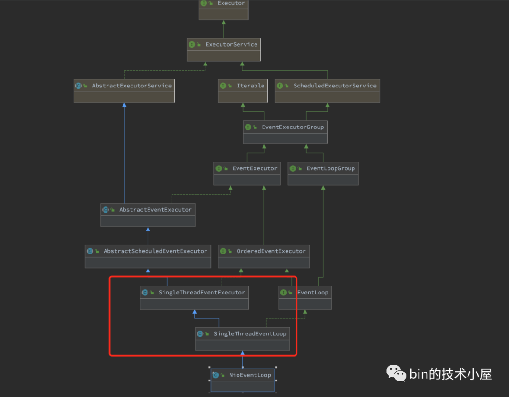

NioEventLoop的继承结构也是比较复杂，这里我们只关注在Reactor创建过程中涉及的到两个父类SingleThreadEventLoop,SingleThreadEventExecutor。

剩下的继承体系，我们在后边随着Netty源码的深入在慢慢介绍。

前边我们提到，其实Reactor我们可以看作是一个单线程的线程池，只有一个线程用来执行IO就绪事件的监听，IO事件的处理，异步任务的执行。用MpscQueue来存储待执行的异步任务。

命名前缀为SingleThread的父类都是对Reactor这些行为的分层定义。也是本小节要介绍的对象。

##### SingleThreadEventLoop

Reactor负责执行的异步任务分为三类：

- **普通任务：**这是Netty最主要执行的异步任务，存放在普通任务队列taskQueue中。在NioEventLoop构造函数中创建。
- **定时任务：** 存放在优先级队列中。后续我们介绍。
- **尾部任务：** 存放于尾部任务队列tailTasks中，尾部任务一般不常用，在普通任务执行完后 Reactor线程会执行尾部任务。**使用场景：**比如对Netty 的运行状态做一些统计数据，例如任务循环的耗时、占用物理内存的大小等等都可以向尾部队列添加一个收尾任务完成统计数据的实时更新。

SingleThreadEventLoop负责对尾部任务队列tailTasks进行管理。并且提供Channel向Reactor注册的行为。

````java
public abstract class SingleThreadEventLoop extends SingleThreadEventExecutor implements EventLoop {
    //任务队列大小，默认是无界队列
    protected static final int DEFAULT_MAX_PENDING_TASKS = Math.max(16,
            SystemPropertyUtil.getInt("io.netty.eventLoop.maxPendingTasks", Integer.MAX_VALUE));    
    //尾部任务队列
    private final Queue<Runnable> tailTasks;
    protected SingleThreadEventLoop(EventLoopGroup parent, Executor executor,
                                    boolean addTaskWakesUp, Queue<Runnable> taskQueue, Queue<Runnable> tailTaskQueue,
                                    RejectedExecutionHandler rejectedExecutionHandler) {
        super(parent, executor, addTaskWakesUp, taskQueue, rejectedExecutionHandler);
        //尾部队列 执行一些统计任务 不常用
        tailTasks = ObjectUtil.checkNotNull(tailTaskQueue, "tailTaskQueue");
    }
    @Override
    public ChannelFuture register(Channel channel) {
        //注册channel到绑定的Reactor上
        return register(new DefaultChannelPromise(channel, this));
    }
}
````

##### SingleThreadEventExecutor

SingleThreadEventExecutor主要负责对普通任务队列的管理，以及异步任务的执行，Reactor线程的启停。

````java
public abstract class SingleThreadEventExecutor extends AbstractScheduledEventExecutor implements OrderedEventExecutor {
    protected SingleThreadEventExecutor(EventExecutorGroup parent, Executor executor,
                                        boolean addTaskWakesUp, Queue<Runnable> taskQueue, RejectedExecutionHandler rejectedHandler) {
        //parent为Reactor所属的NioEventLoopGroup Reactor线程组
        super(parent);
        //向Reactor添加任务时，是否唤醒Selector停止轮询IO就绪事件，马上执行异步任务
        this.addTaskWakesUp = addTaskWakesUp;
        //Reactor异步任务队列的大小
        this.maxPendingTasks = DEFAULT_MAX_PENDING_EXECUTOR_TASKS;
        //用于启动Reactor线程的executor -> ThreadPerTaskExecutor
        this.executor = ThreadExecutorMap.apply(executor, this);
        //普通任务队列
        this.taskQueue = ObjectUtil.checkNotNull(taskQueue, "taskQueue");
        //任务队列满时的拒绝策略
        this.rejectedExecutionHandler = ObjectUtil.checkNotNull(rejectedHandler, "rejectedHandler");
    }
}
````

到现在为止，一个完整的Reactor架构就被创建出来了。

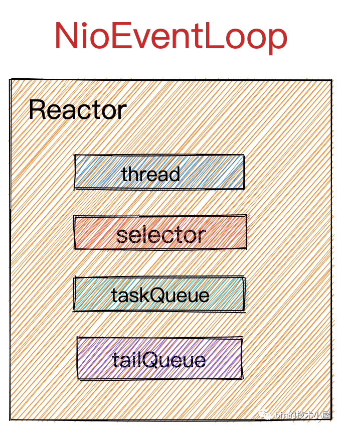

### 3、 创建Channel到Reactor的绑定策略

到这一步，Reactor线程组NioEventLoopGroup里边的所有Reactor就已经全部创建完毕。

无论是Netty服务端NioServerSocketChannel关注的OP_ACCEPT事件也好，还是Netty客户端NioSocketChannel关注的OP_READ和OP_WRITE事件也好，都需要先注册到Reactor上，Reactor才能监听Channel上关注的IO事件实现IO多路复用。

NioEventLoopGroup(Reactor线程组)里边有众多的Reactor，那么以上提到的这些Channel究竟应该注册到哪个Reactor上呢?这就需要一个绑定的策略来平均分配。

还记得我们前边介绍MultithreadEventExecutorGroup类的时候提到的构造器参数EventExecutorChooserFactory吗?

这时候它就派上用场了，它主要用来创建Channel到Reactor的绑定策略。默认为DefaultEventExecutorChooserFactory.INSTANCE。

````java
public abstract class MultithreadEventExecutorGroup extends AbstractEventExecutorGroup {
   //从Reactor集合中选择一个特定的Reactor的绑定策略 用于channel注册绑定到一个固定的Reactor上
    private final EventExecutorChooserFactory.EventExecutorChooser chooser;
    chooser = chooserFactory.newChooser(children);
}
````

下面我们来看下具体的绑定策略：

#### DefaultEventExecutorChooserFactory

````java
public final class DefaultEventExecutorChooserFactory implements EventExecutorChooserFactory {
    public static final DefaultEventExecutorChooserFactory INSTANCE = new DefaultEventExecutorChooserFactory();
    private DefaultEventExecutorChooserFactory() { }
    @Override
    public EventExecutorChooser newChooser(EventExecutor[] executors) {
        if (isPowerOfTwo(executors.length)) {
            return new PowerOfTwoEventExecutorChooser(executors);
        } else {
            return new GenericEventExecutorChooser(executors);
        }
    }
    private static boolean isPowerOfTwo(int val) {
        return (val & -val) == val;
    }
    ...................省略.................
}
````

我们看到在newChooser方法绑定策略有两个分支，不同之处在于需要判断Reactor线程组中的Reactor个数是否为2的次幂。

Netty中的绑定策略就是采用round-robin轮询的方式来挨个选择Reactor进行绑定。

采用round-robin的方式进行负载均衡，我们一般会用round % reactor.length取余的方式来挨个平均的定位到对应的Reactor上。

如果Reactor的个数reactor.length恰好是2的次幂，那么就可以用位操作&运算round & reactor.length -1来代替%运算round % reactor.length，因为位运算的性能更高。具体为什么&运算能够代替%运算，笔者会在后面讲述时间轮的时候为大家详细证明，这里大家只需记住这个公式，我们还是聚焦本文的主线。

了解了优化原理，我们在看代码实现就很容易理解了。

利用%运算的方式Math.abs(idx.getAndIncrement() % executors.length)来进行绑定。

````java
 private static final class GenericEventExecutorChooser implements EventExecutorChooser {
        private final AtomicLong idx = new AtomicLong();
        private final EventExecutor[] executors;
        GenericEventExecutorChooser(EventExecutor[] executors) {
            this.executors = executors;
        }
        @Override
        public EventExecutor next() {
            return executors[(int) Math.abs(idx.getAndIncrement() % executors.length)];
        }
    }
````

利用&运算的方式idx.getAndIncrement() & executors.length - 1来进行绑定。

````java
   private static final class PowerOfTwoEventExecutorChooser implements EventExecutorChooser {
        private final AtomicInteger idx = new AtomicInteger();
        private final EventExecutor[] executors;
        PowerOfTwoEventExecutorChooser(EventExecutor[] executors) {
            this.executors = executors;
        }
        @Override
        public EventExecutor next() {
            return executors[idx.getAndIncrement() & executors.length - 1];
        }
    }
````

又一次被Netty对性能的极致追求所折服。

### 4、 向Reactor线程组中所有的Reactor注册terminated回调函数

当Reactor线程组NioEventLoopGroup中所有的Reactor已经创建完毕，Channel到Reactor的绑定策略也创建完毕后，我们就来到了创建NioEventGroup的最后一步。

俗话说的好，有创建就有启动，有启动就有关闭，这里会创建Reactor关闭的回调函数terminationListener，在Reactor关闭时回调。

terminationListener回调的逻辑很简单：

- 通过AtomicInteger terminatedChildren变量记录已经关闭的Reactor个数，用来判断NioEventLoopGroup中的Reactor是否已经全部关闭。
- 如果所有Reactor均已关闭，设置NioEventLoopGroup中的terminationFuture为success。表示Reactor线程组关闭成功。

````java
 //记录关闭的Reactor个数，当Reactor全部关闭后，才可以认为关闭成功
        private final AtomicInteger terminatedChildren = new AtomicInteger();
        //关闭future
        private final Promise<?> terminationFuture = new DefaultPromise(GlobalEventExecutor.INSTANCE);
        final FutureListener<Object> terminationListener = new FutureListener<Object>() {
            @Override
            public void operationComplete(Future<Object> future) throws Exception {
                if (terminatedChildren.incrementAndGet() == children.length) {
                    //当所有Reactor关闭后 才认为是关闭成功
                    terminationFuture.setSuccess(null);
                }
            }
        };        
        //为所有Reactor添加terminationListener
        for (EventExecutor e: children) {
            e.terminationFuture().addListener(terminationListener);
        }

````

我们在回到文章开头Netty服务端代码模板。

````java
public final class EchoServer {
    static final int PORT = Integer.parseInt(System.getProperty("port", "8007"));
    public static void main(String[] args) throws Exception {
        // Configure the server.
        //创建主从Reactor线程组
        EventLoopGroup bossGroup = new NioEventLoopGroup(1);
        EventLoopGroup workerGroup = new NioEventLoopGroup();

        ...........省略............
    }
}

````

现在Netty的主从Reactor线程组就已经创建完毕，此时Netty服务端的骨架已经搭建完毕，骨架如下：

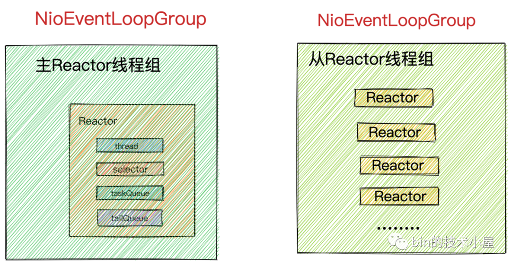

### 总结

本文介绍了首先介绍了Netty对各种IO模型的支持以及如何轻松切换各种IO模型。

还花了大量的篇幅介绍Netty服务端的核心引擎主从Reactor线程组的创建过程。在这个过程中，我们还提到了Netty对各种细节进行的优化，展现了Netty对性能极致的追求。

好了，Netty服务端的骨架已经搭好，剩下的事情就该绑定端口地址然后接收连接了。