# 一步一图带你深入剖析 JDK NIO ByteBuffer 在不同字节序下的设计与实现

在前面 Netty 源码解析系列 [《聊聊 Netty 那些事儿》](https://mp.weixin.qq.com/mp/appmsgalbum?__biz=Mzg2MzU3Mjc3Ng==&action=getalbum&album_id=2217816582418956300&scene=173&from_msgid=2247485290&from_itemidx=1&count=3&nolastread=1#wechat_redirect)中，笔者带领大家从宏观世界详细剖析了 Netty 的整个运转流程。从一个网络数据包在内核中的收发过程开始聊起，总体介绍了 Netty 的 IO 线程模型，后面我们围绕着这个 IO 模型又详细介绍了整个 Reactor 模型在 Netty 中的实现。

这个宏观流程包括：Reactor 模型的创建，启动，运转架构，网络连接的接收和关闭，网络数据的接收和发送，利用 pipeline 对 IO 处理逻辑的编排，Netty 的优雅关闭。

Netty 的源码解析系列写到这里，笔者算是带着大家在 Netty 的宏观世界中翱翔了一圈，但笔者还是不舍得和大家说再见，于是决定在带领大家到 Netty 的微观世界中一探究竟，这个系列的目的就是想让大家从内核层面深入地搞透 Netty。

在 Netty 的微观世界系列中，笔者会为大家讲述 Netty 中的高性能组件的相关设计和实现以及应用。内容包括：

- Netty 中的网络数据容器 ByteBuf 的整个设计体系的实现。
- Netty 中的内存池设计与实现，在这个过程中，笔者会把 Linux 内核中内存管理子系统相关源码带大家走读一遍，让大家从内核层面到应用层面彻底搞透彻高性能内存分配的原理及其实现。
- Netty 中用于执行海量延时任务的时间轮相关设计与实现，并与 Kafka 中的时间轮设计做出详细对比。
- Netty 中用到的零拷贝技术在内核中的实现。
- Netty 中用到的 MPSC （多生产者单消费者）队列的设计与实现以及应用场景。
- Netty 中实现无锁化并发的关键组件 FastThreadLocal 的设计与实现，并详细对比 FastThreadLocal 究竟比 JDK 中 ThreadLocal 快在了哪里。
- 理论讲完了，实践是必不可少的，最后笔者会带大家剖析 Netty 在各个著名中间件中是如何使用的，进一步加深大家对 Netty 的理解。

笔者的这个 Netty 微观世界系列会涉及大量丰富的细节描述，对于喜欢细节控的同学一定不要错过~~

## 写在本文开始之前.....

本文我们开始 Netty 微观世界系列第一部分的内容，聊聊 Netty 中的网络数据容器 ByteBuf ，对于 ByteBuf 我想大家一定不会陌生，它曾多次出现在前面的系列文章中，比如在[Netty 如何高效接收网络数据](../ByteBuffer动态自适应扩缩容机制/一文聊透 ByteBuffer 动态自适应扩缩容机制.md)和[Netty发送数据全流程](../Netty发送数据全流程/一文搞懂Netty发送数据全流程-你想知道的细节全在这里.md)这两篇文章中提到的 Netty 接收网络数据和发送网络数据时用到的ByteBuf。

ByteBuf 是 Netty 中的数据容器，Netty 在接收网络数据和发送网络数据时，都会首先将这些网络数据事先缓存在 ByteBuf 中，然后在将它们丢给 pipeline 处理或者发送给 Socket ，这样做的目的是防止在接收网络数据的过程中网络数据一直积压在 Socket 的接收缓冲区中使得接收缓冲区的数据越来越多，导致对端 TCP 协议中的窗口关闭（滑动窗口），影响到了整个 TCP 通信的速度。而有了 ByteBuf，我们可以先将读取的数据缓存在 ByteBuf 中，提高 TCP 的通信能力。

而在 Netty 发送数据的时候，也可以事先将数据缓存在 ByteBuf 中，如果 Socket 发送缓冲区已满变为不可写状态时，由于数据我们已经缓存在 ByteBuf 中了，用户的发送线程不需要阻塞等待，当 Socket 发送缓冲区再次变得可写时，Netty 会将 ByteBuf 中的数据写入到 Socket 中。这也是 Netty 实现异步发送数据的核心所在。

而 Netty 中的 ByteBuf 底层依赖了JDK NIO 中的 ByteBuffer 。众所周知 JDK NIO 中的 ByteBuffer 设计的非常复杂而且提供的相关 API 使用起来也很反人类，易用性不是很好，所以 Netty 的 ByteBuf 针对 JDK NIO ByteBuffer 进行了优化，再此基础上重新设计出了一套简洁易用的 API 出来。

熟悉笔者写作风格的读者朋友都知道，笔者一向是喜欢把技术的脉络给大家铺展开来讲解，一层一层地介绍技术的演变过程，力求给大家清晰地展现出整个技术的全貌。通过技术的演变过程，我们不仅可以知道这个技术点最初的样貌，它的优缺点是什么？瓶颈是什么？我们还可以针对这些缺点和瓶颈触发自己的思考，如何优化？如何演变？通过这个过程的洗礼，我们才能够对现有技术理解的清晰透彻。

根据这个思路，在介绍 Netty 的 ByteBuf 设计之前，笔者想专门用一篇文章来为大家介绍下 JDK NIO Buffer 的设计，看一下 NIO ByteBuffer 是如何设计的，它有哪些缺点。针对这些缺点，Netty 又是如何优化的。彻底理解 Netty 数据载体 ByteBuf 的前世今生。

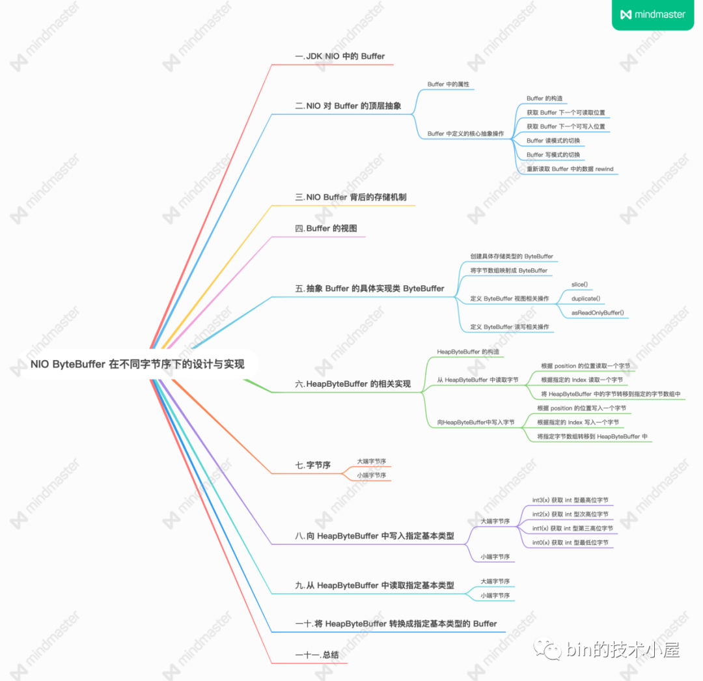

## 1. JDK NIO 中的 Buffer

在 NIO 没有出现之前，Java 传统的 IO 操作都是通过流的形式实现的（包括网络 IO 和文件 IO ），也就是我们常见的输入流 InputStream 和输出流 OutputStream。

但是 Java 传统 IO 的 InputStream 和 OutputStream 的相关操作全部都是阻塞的，比如我们使用 InputStream 的 read 方法从流中读取数据时，如果此时流中没有数据，那么用户线程就必须阻塞等待。

还有一点就是传统的这些输入输出流在处理字节流的时候一次只能处理一个字节，这样在处理网络 IO 的时候读取 Socket 缓冲区中的数据效率就会很低，而且在操作字节流的时候只能线性的处理流中的字节，不能来回移动字节流中的数据。这样导致我们在处理字节流中的数据的时候就显得不是很灵活。

所以综上所述，Java 传统 IO 是面向流的，流的处理是单向，阻塞的，而且无论是从输入流中读取数据还是向输出流中写入数据都是一个字节一个字节来处理的。通常都是从输入流中边读取数据边处理数据，这样 IO 处理效率就会很低，

基于上述原因，JDK1.4 引入了 NIO，而 NIO 是面向 Buffer 的，在处理 IO 操作的时候，会一次性将 Channel 中的数据读取到 Buffer 中然后在做后续处理，向 Channel 中写入数据也是一样，也是需要一个 Buffer 做中转，然后将 Buffer 中的数据批量写入 Channel 中。这样一来我们可以利用 Buffer 将里面的字节数据来回移动并根据我们想要的处理方式灵活处理。

除此之外，Nio Buffer 还提供了堆外的直接内存和内存映射相关的访问方式，来避免内存之间的来回拷贝，所以即使在传统 IO 中用到了 BufferedInputStream 也还是没办法和 Nio Buffer 相匹敌。

那么接下来就让我们正式进入JDK NIO Buffer 如何设计与实现的相关主题

## 2. NIO 对 Buffer 的顶层抽象

JDK NIO 提供的 Buffer 其实本质上是一块内存，大家可以把它简单想象成一个数组，JDK 将这块内存在语言层面封装成了 Buffer 的形式，我们可以通过 Buffer 对这块内存进行读取或者写入数据，以及执行各种骚操作。

如下图中所示，Buffer 类是JDK NIO 定义的一个顶层抽象类，对于缓冲区的所有基本操作和基础属性全部定义在顶层 Buffer 类中，在 Java 中一共有八种基本类型，JDK NIO 也为这八种基本类型分别提供了其对应的 Buffer 类，大家可以把这些 Buffer 类当做成对应基础类型的数组，我们可以利用这些基础类型相关的 Buffer 类对数组进行各种操作。


在为大家解析具体的缓冲区实现之前，我们先来看下这个缓冲区的顶层抽象类 Buffer 中到底定义规范了哪些抽象操作，具有哪些属性，这些属性分别是用来干什么的？先带大家从总体上认识一下JDK NIO 中的 Buffer 设计。

### 2.1 Buffer 中的属性

```java
public abstract class Buffer {

    private int mark = -1;
    private int position = 0;
    private int limit;
    private int capacity;
    
             .............
}
```

首先我们先来介绍下 Buffer 中最重要的这三个属性，后面即将介绍的关于 Buffer 的各种骚操作均依赖于这三个属性的动态变化。


- capacity：这个很好理解，它规定了整个 Buffer 的容量，具体可以容纳多少个元素。capacity 指针之前的元素均是 Buffer 可操作的空间。
- position：用于指向 Buffer 中下一个可操作性的元素，初始值为 0。在 Buffer 的写模式下，position 指针用于指向下一个可写位置。在读模式下，position 指针指向下一个可读位置。
- limit：表示 Buffer 可操作元素的上限。什么意思呢？比如在 Buffer 的写模式下，可写元素的上限就是 Buffer 的整体容量也就是 capacity ，capacity - 1 即为 Buffer 最后一个可写位置。在读模式下，Buffer 中可读元素的上限即为上一次 Buffer 在写模式下最后一个写入元素的位置。也就是上一次写模式中的 position。
- mark：用于标记 Buffer 当前 position 的位置。这个字段在我们对网络数据包解码的时候非常有用，在我们使用 TCP 协议进行网络数据传输的时候经常会出现粘包拆包的现象，所以为了应对粘包拆包的问题，在解码之前都需要先调用 mark 方法将 Buffer 的当前 position 指针保存至 mark 属性中，如果 Buffer 中的数据足够我们解码为一个完整的包，我们就执行解码操作。如果 Buffer 中的数据不够我们解码为一个完整的包（也就是半包），我们就调用 reset 方法，将 position 还原到原来的位置，等待剩下的网络数据到来。

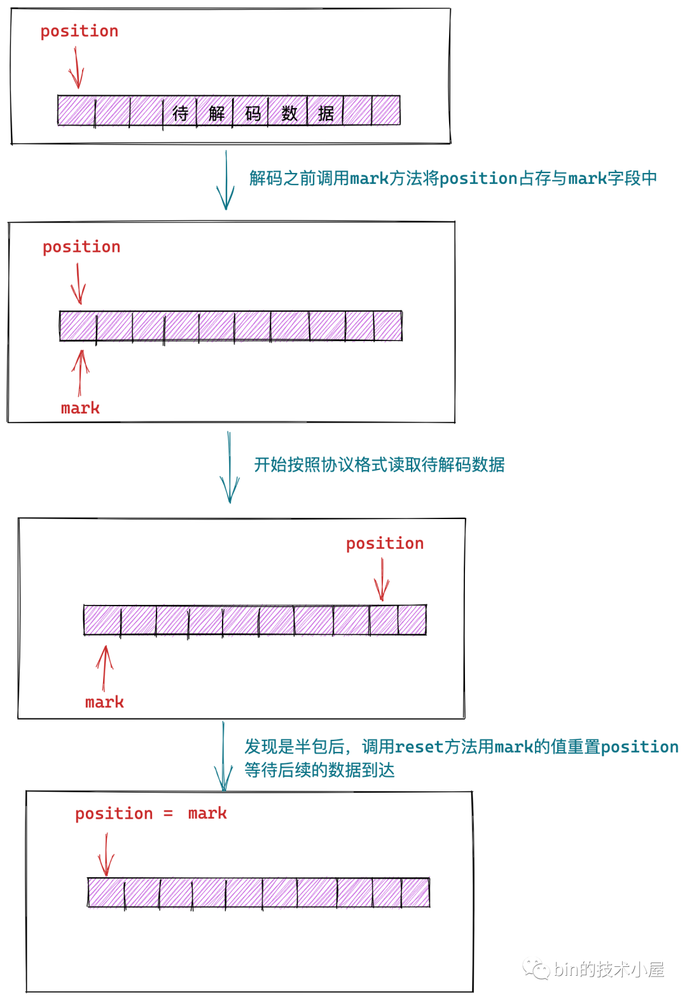

在我们理解了 Buffer 中这几个重要属性的含义之后，接下来我们就来看一看 JDK NIO 在 Buffer 顶层设计类中定义规范的那些抽象操作。

### 2.2 Buffer 中定义的核心抽象操作

本小节中介绍的这几个关于 Buffer 的核心操作均是基于上小节中介绍的那些核心指针的动态调整实现的。

#### 2.2.1 Buffer 的构造

构造 Buffer 的主要逻辑就是根据用户指定的参数来初始化 Buffer 中的这四个重要属性：mark，position，limit，capacity。它们之间的关系为：mark <= position <= limit <= capacity 。其中 mark 初始默认为 -1，position 初始默认为 0。

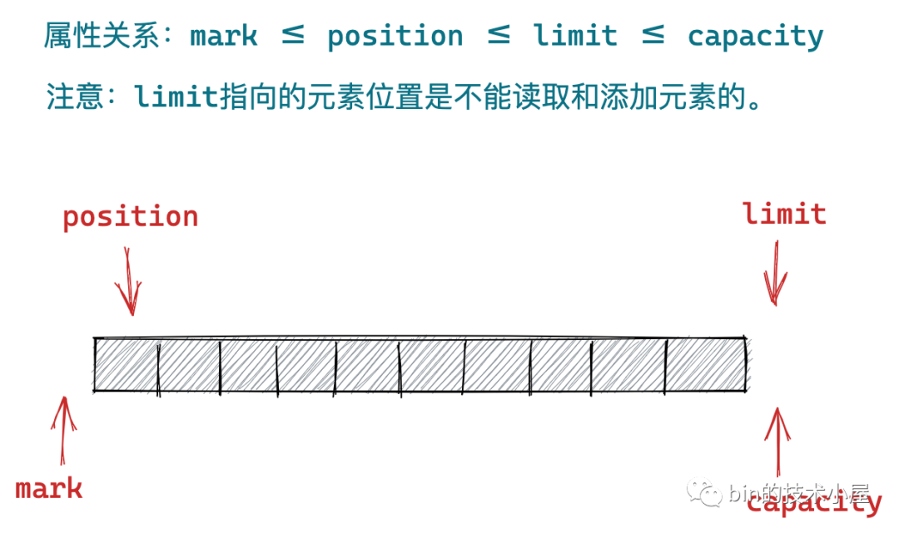

```java
public abstract class Buffer {

    private int mark = -1;
    private int position = 0;
    private int limit;
    private int capacity;

    Buffer(int mark, int pos, int lim, int cap) {     
        if (cap < 0)
            throw new IllegalArgumentException("Negative capacity: " + cap);
        this.capacity = cap;
        limit(lim);
        position(pos);
        if (mark >= 0) {
            if (mark > pos)
                throw new IllegalArgumentException("mark > position: ("
                                                   + mark + " > " + pos + ")");
            this.mark = mark;
        }
    }

    public final Buffer limit(int newLimit) {
        if ((newLimit > capacity) || (newLimit < 0))
            throw new IllegalArgumentException();
        limit = newLimit;
        if (position > limit) position = limit;
        if (mark > limit) mark = -1;
        return this;
    }

    public final Buffer position(int newPosition) {
        if ((newPosition > limit) || (newPosition < 0))
            throw new IllegalArgumentException();
        position = newPosition;
        if (mark > position) mark = -1;
        return this;
    }
}
```

#### 2.2.2 获取 Buffer 下一个可读取位置

当我们在 Buffer 的读模式下，需要从 Buffer 中读取数据时，需要首先知道当前 Buffer 中 position 的位置，然后根据 position 的位置读取 Buffer 中的元素。随后 position 向后移动指定的步长 nb。

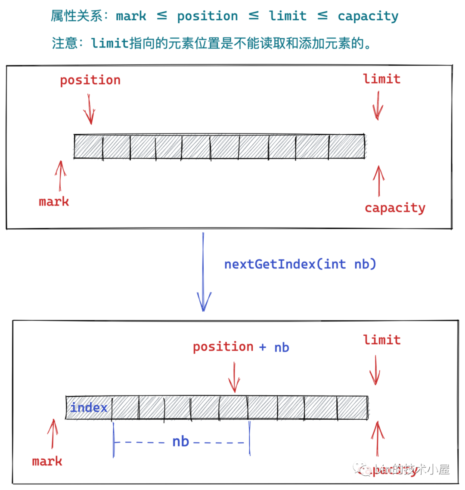

`nextGetIndex()` 方法首先获取 Buffer 当前 position 的位置作为 readIndex 返回给用户，然后 position 向后移动一位。这里的步长 nb 默认为1。

```
    final int nextGetIndex() {                        
        if (position >= limit)
            throw new BufferUnderflowException();
        return position++;
    }
```

`nextGetIndex(int nb)` 方法的逻辑和 nextGetIndex()  方法一样，唯一不同的是该方法指定了position 向后移动的步长 nb。

```
    final int nextGetIndex(int nb) {          
        if (limit - position < nb)
            throw new BufferUnderflowException();
        int p = position;
        position += nb;
        return p;
    }
```

**大家这里可能会感到好奇，为什么会增加一个指定 position 移动步长的  nextGetIndex(int nb) 方法呢**？

在《2. NIO 对 Buffer 的顶层抽象》小节的开始，我们介绍了 JDK NIO 中 Buffer 顶层设计体系，除了 boolean 这个基本类型，NIO 为几乎所有的 Java 基本类型定义了对应的 Buffer 类。


假如我们从一个 ByteBuffer 中读取一个 int 类型的数据时，我们就需要在读取完毕后将 position 的位置向后移动 4 位。在这种情况下 nextGetIndex(int nb) 方法的步长 nb 就应该指定为 4.

```
   public int getInt() {
        return getInt(ix(nextGetIndex((1 << 2))));
    }
```

#### 2.2.3 获取 Buffer 下一个可写入位置

同获取 readIndex 的过程一样，当我们处于 Buffer 的写模式下，向 Buffer 写入数据时，首先也需要获取 Buffer 当前 position 的位置（writeIndex）,当写入元素后，position 向后移动指定的步长 nb。

同样的道理，我们可以向 ByteBuffer 中写入一个 int 型的数据，这时候指定的步长 nb 也是 4 。

```
    final int nextPutIndex() {                        
        if (position >= limit)
            throw new BufferOverflowException();
        return position++;
    }

    final int nextPutIndex(int nb) {                  
        if (limit - position < nb)
            throw new BufferOverflowException();
        int p = position;
        position += nb;
        return p;
    }
```

#### 2.2.4 Buffer 读模式的切换

当我们在 Buffer 的写模式下向 Buffer 写入数据之后，接下来我们就需要从 Buffer 中读取刚刚写入的数据。由于 NIO 在对 Buffer 的设计中读写模式是混用一个 position 属性，所以我们需要做读模式的切换。

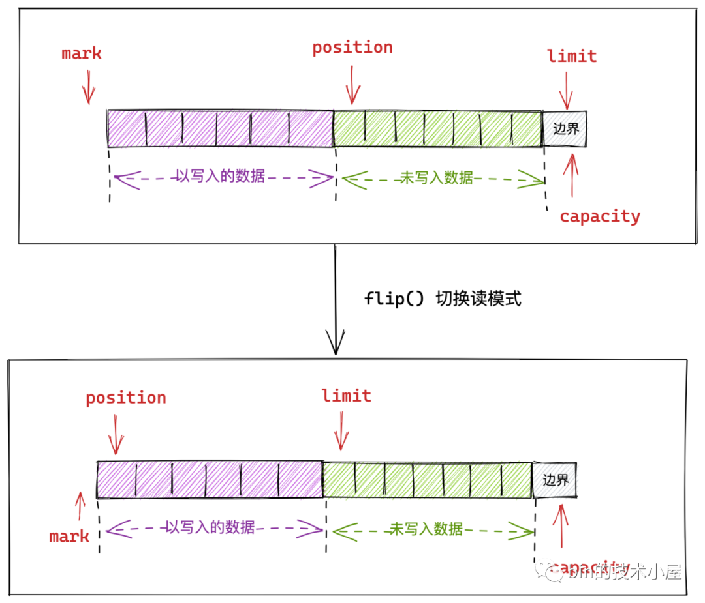

```
public final Buffer flip() {
        limit = position;
        position = 0;
        mark = -1;
        return this;
    }
```

我们看到  `flip()` 方法是对 Buffer 中的这四个指针做了一些调整达到了读模式切换的目的：

1. 将下一个可写入位置 position 作为读模式下的上限 limit。
2. position设置为 0 。这样使得我们可以从头开始读取 Buffer 中写入的数据。

#### 2.2.5 Buffer 写模式的切换

有读模式的切换肯定就会有对应的写模式切换，当我们在读模式下以将 Buffer 中的数据读取完毕之后，这时候如果再次向 Buffer 写入数据的话，就需要切换到 Buffer 的写模式下。

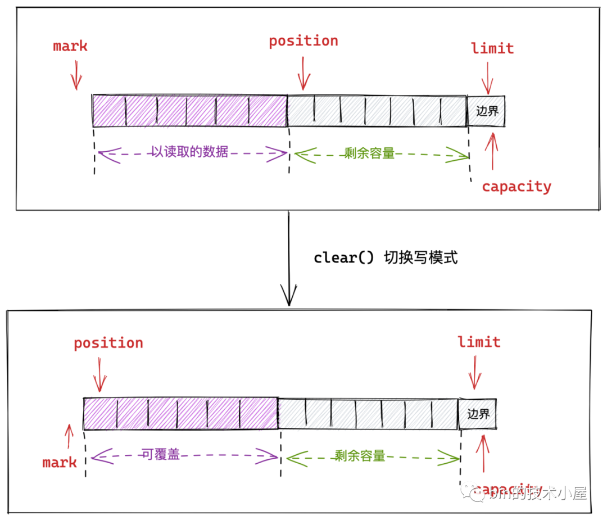

```
public final Buffer clear() {
        position = 0;
        limit = capacity;
        mark = -1;
        return this;
    }
```

我们看到调用 `clear()` 方法之后，Buffer 中各个指针的状态又回到了最初的状态：

1. position 位置重新指向起始位置 0 处。写入上限 limit 重新指向了 capacity 的位置。
2. 这时向 Buffer 中写入数据时，就会从 Buffer 的开头处依次写入，新写入的数据就会把已经读取的那部分数据覆盖掉。

但是这里就会有一问题，当我们在读模式下将 Buffer 中的数据全部读取完毕时，调用 clear() 方法开启写模式，是没有问题的。

如果我们只是读取了 Buffer 中的部分数据，但是还有一部分数据没有读取，这时候，调用 clear() 方法开启写模式向 Buffer 中写入数据的话，就会出问题，因为这会覆盖掉我们还没有读取的数据部分。


针对这种情况，我们就不能简单粗暴的设置 position 指针了，为了保证未读取的数据部分不被覆盖，我们就需要先将不可覆盖的数据部分移动到 Buffer 的最前边，然后将 position 指针指向可覆盖数据区域的第一个位置。

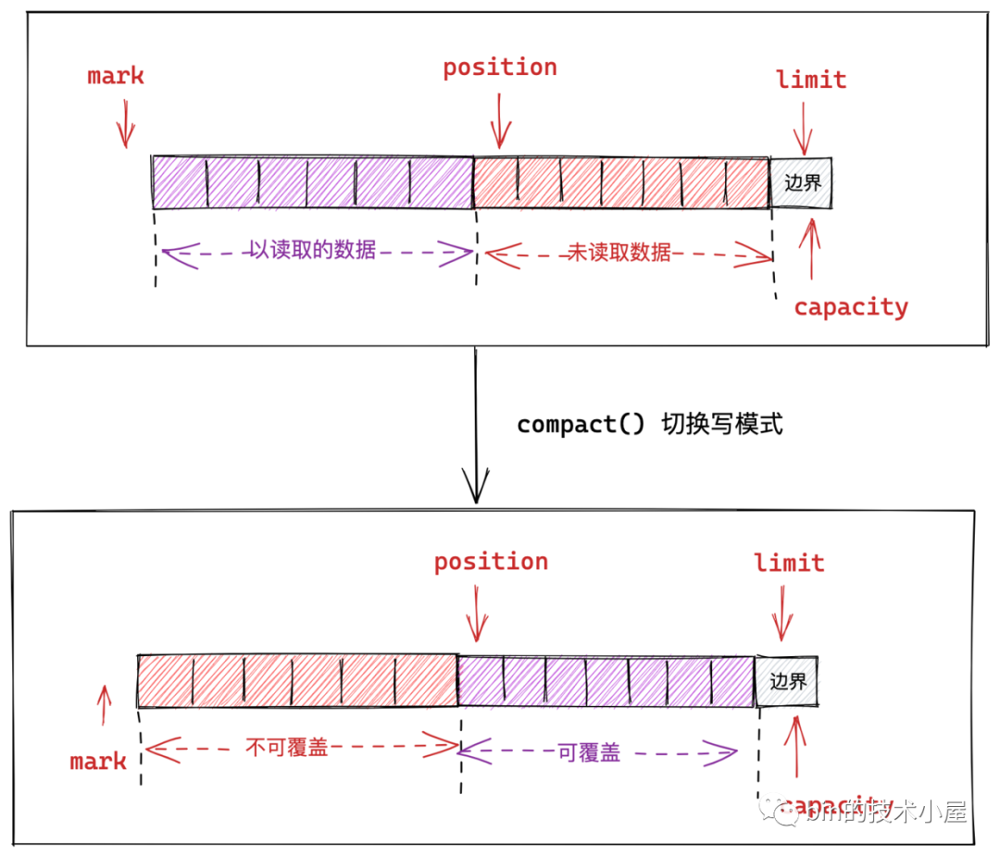

由于 Buffer 是顶层设计只是负责定义 Buffer 相关的操作规范，并未定义具体的数据存储方式，因为 `compact()` 涉及到移动数据，所以实现在了 Buffer 具体子类中，这里我们以 HeapByteBuffer 举例说明：

```
class HeapByteBuffer extends ByteBuffer {

    //HeapBuffer中底层负责存储数据的数组
    final byte[] hb; 

    public ByteBuffer compact() {
        System.arraycopy(hb, ix(position()), hb, ix(0), remaining());
        position(remaining());
        limit(capacity());
        discardMark();
        return this;
    }

    public final int remaining() {
        return limit - position;
    }

   final void discardMark() {                          
        mark = -1;
    }

}
```

#### 2.2.6 重新读取 Buffer 中的数据 rewind

`rewind()` 方法可以帮助我们重新读取 Buffer 中的数据，它会将 position 的值重新设置为 0，并丢弃 mark。

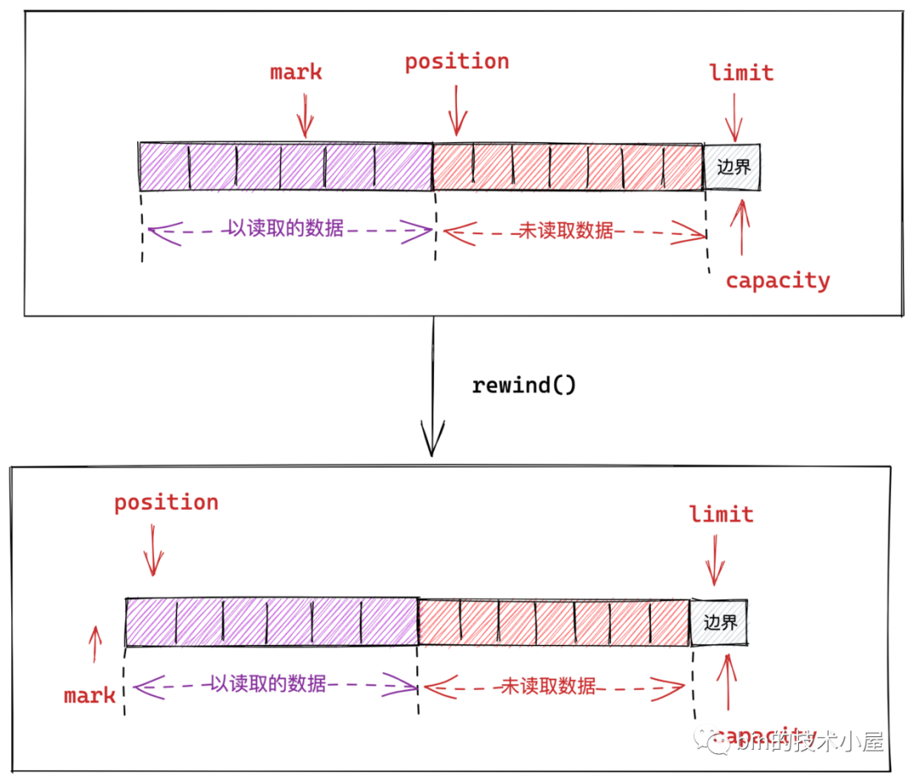

```
public final Buffer rewind() {
        position = 0;
        mark = -1;
        return this;
    }
```

## 3. NIO Buffer 背后的存储机制

在《2. NIO 对 Buffer 的顶层抽象》小节的开头提到我们可以把 Buffer 简单的看做是一个数组，然后基于前边介绍的四个指针：mark，position，limit，capacity 的动态调整来实现对 Buffer 的各种操作。

同时我们也提到了除了 boolean 这种基本类型之外，NIO 为其他几种 Java 基本类型都提供了其对应的 Buffer 类。


而针对每一种基本类型的 Buffer ，NIO 又根据 Buffer 背后的数据存储内存不同分为了：HeapBuffer，DirectBuffer，MappedBuffer。

HeapBuffer 顾名思义它背后的存储内存是在 JVM 堆中分配，在堆中分配一个数组用来存放 Buffer 中的数据。

```
public abstract class ByteBuffer extends Buffer implements Comparable<ByteBuffer> {
    //在堆中使用一个数组存放Buffer数据
    final byte[] hb;  
}
```

DirectBuffer 背后的存储内存是在堆外内存中分配，MappedBuffer 是通过内存文件映射将文件中的内容直接映射到堆外内存中，其本质也是一个 DirectBuffer 。

由于 DirectBuffer 和 MappedBuffer 背后的存储内存是在堆外内存中分配，不受 JVM 管理，所以不能用一个 Java 基本类型的数组表示，而是直接记录这段堆外内存的起始地址。

```
public abstract class Buffer {
    //堆外内存地址
    long address;
}
```

> 笔者后面还会为大家详细讲解 DirectBuffer 和 MappedBuffer。这里提前引出只是让大家理解这三种不同类型的 Buffer 背后内存区域的不同。

综上所述，HeapBuffer 背后是有一个对应的基本类型数组作为存储的。而 DirectBuffer 和 MappedBuffer 背后是一块堆外内存做存储。并没有一个基本类型的数组。

hasArray() 方法 就是用来判断一个 Buffer 背后是否有一个 Java 基本类型的数组做支撑。

```
 public abstract boolean hasArray();
```

如果 hasArray() 方法返回 true，我们就可以调用 Object array() 方法获取 Buffer 背后的支撑数组。

```
 public abstract Object array();
```

**其中 Buffer 中还有一个不太好理解的属性是 offset，而这个 offset 到底是用来干什么的呢**？

## 4. Buffer 的视图

```
public abstract class ByteBuffer extends Buffer implements Comparable<ByteBuffer> {
    //在堆中使用一个数组存放Buffer数据
    final byte[] hb;  
    // 数组中的偏移，用于指定数组中的哪一段数据是被 Buffer 包装的
    final int offset;
}
```

事实上我们可以根据一段连续的内存地址或者一个数组创建出不同的 Buffer 视图出来。

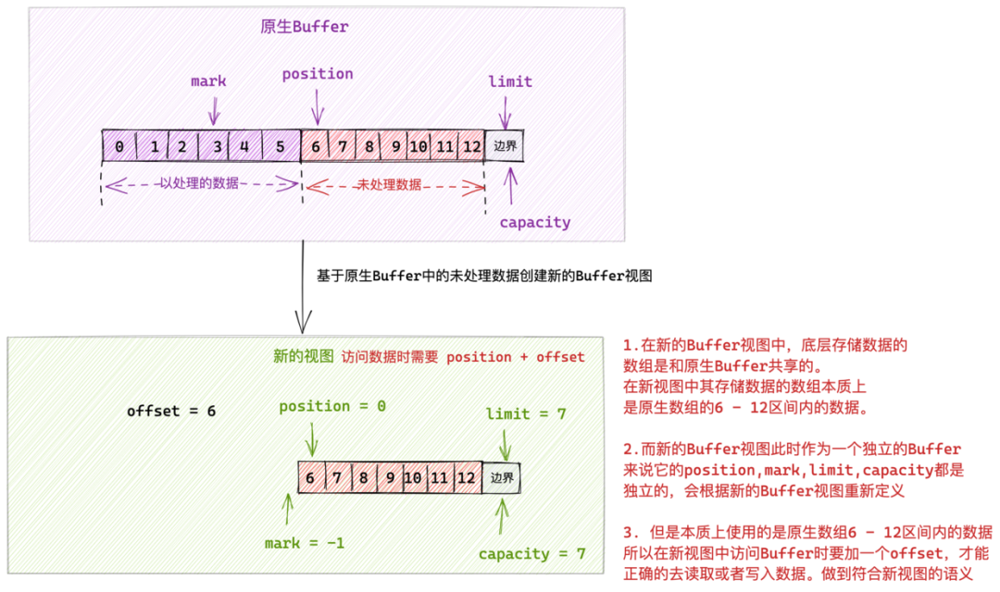

如上图所示，我们可以根据原生 Buffer 中的部分数据（比如图中的未处理数据部分）创建出一个新的 Buffer 视图出来。

这个新的视图 Buffer 本质上也是一个 Buffer ，拥有独立的 mark，position，limit，capacity 指针。这个四个指针会在新的 Buffer 视图下重新被创建赋值。所以在新的视图 Buffer 下和操作普通 Buffer 是一样的，也可以使用 《2.2 Buffer 中定义的核心抽象操作》小节中介绍的那些方法。只不过操作的数据范围不一样罢了。

新的视图 Buffer 和原生 Buffer **共享一个存储数组或者一段连续内存**。

站在新的视图 Buffer 角度来说，它的存储数组范围：`0 - 6`，所以再此视图下 position = 0，limit = capacity = 7 。这其实是一个障眼法，真实情况是新的视图 Buffer 其实是复用原生 Buffer 中的存储数组中的 `6 - 12 `这块区域。

所以在新视图 Buffer 中访问元素的时候，就需要加上一个偏移 offset ：`position + offset` 才能正确的访问到真实数组中的元素。这里的 offset = 6。

我们可以通过 arrayOffset() 方法获取视图 Buffer 中的 offset。

```
 public abstract int arrayOffset();
```

以上内容就是笔者要为大家介绍的 NIO Buffer 的顶层设计，下面我们来看下 Buffer 下具体的这些实现类。对于 Buffer 视图相关的创建和操作，笔者会把这部分内容放到具体的 Buffer 实现类中为大家介绍，这里大家只需要理解 Buffer 视图的概念即可~~~

## 5. 抽象 Buffer 的具体实现类 ByteBuffer


通过前面小节内容的介绍，我们知道了JDK NIO Buffer 为 Java 中每种基本类型都设计了对应的 Buffer 实现（除了 boolean 类型）。

而我们本系列的主题是 Netty 网络通讯框架的源码解析，在网络 IO 处理中出镜率最高的当然是 ByteBuffer，所以在下面的例子中笔者均已 ByteBuffer 作为讲解主线。相信大家在理解了 ByteBuffer 的整体脉络设计之后，在看其他基本类型的 Buffer 实现就能非常容易理解，基本上大同小异。

下面我们就来正式开始 ByteBuffer 的介绍~~~

在前边《3. NIO Buffer 背后的存储机制》小节的介绍中，我们知道 NIO 中的 ByteBuffer 根据其背后内存分配的区域不同，分为了：HeapByteBuffer，MappedByteBuffer，DirectByteBuffer 这三种类型。

而这三种类型的 ByteBuffer 肯定会有一些通用的属性以及方法，所以 ByteBuffer 这个类被设计成了一个抽象类，用来封装这些通用的属性和方法作为 ByteBuffer 这个基本类型 Buffer 的顶层规范。


```
public abstract class ByteBuffer extends Buffer implements Comparable<ByteBuffer> {
    // Buffer背后的数组
    final byte[] hb;  
    // 数组 offset，用于创建 Buffer 视图                
    final int offset;
    // 标识 Buffer 是否是只读的
    boolean isReadOnly;                

    ByteBuffer(int mark, int pos, int lim, int cap,  
                 byte[] hb, int offset)
    {
        super(mark, pos, lim, cap);
        this.hb = hb;
        this.offset = offset;
    }

    ByteBuffer(int mark, int pos, int lim, int cap) { 
        this(mark, pos, lim, cap, null, 0);
    }

}
```

ByteBuffer 中除了之前介绍的 Buffer 类中定义的四种重要属性之外，又额外定义了三种属性；

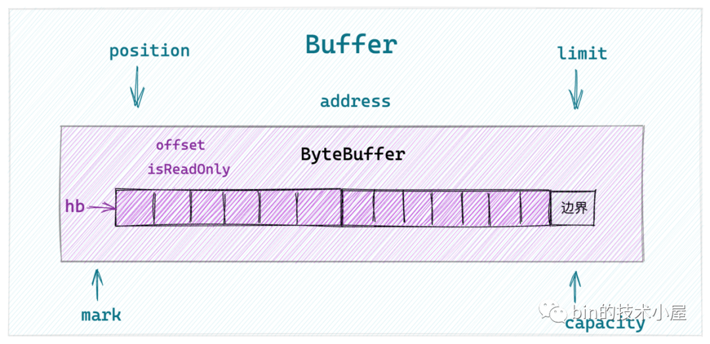

1. byte[] hb：ByteBuffer 中背后依赖的用于存储数据的数组，该字段只适用于 HeapByteBuffer ，而 DirectByteBuffer 和 MappedByteBuffer 背后依赖于堆外内存。这块堆外内存的起始地址存储于 Buffer 类中的 address 字段中。
2. int offset：ByteBuffer 中的内存偏移，用于创建新的 ByteBuffer 视图。详情可回看《4. Buffer 的视图》小节。
3. boolean isReadOnly：用于标识该 ByteBuffer 是否是只读的。

### 5.1 创建具体存储类型的 ByteBuffer

创建 DirectByteBuffer:

```
    public static ByteBuffer allocateDirect(int capacity) {
        return new DirectByteBuffer(capacity);
    }
```

创建 HeapByteBuffer:

```
    public static ByteBuffer allocate(int capacity) {
        if (capacity < 0)
            throw new IllegalArgumentException();
        return new HeapByteBuffer(capacity, capacity);
    }
```

> 由于 MappedByteBuffer 背后涉及到的原理比较复杂（虽然 API 简单），所以笔者后面会有一篇专门讲解 MappedByteBuffer 的文章，为了不使本文过于复杂，这里就不列出了。

### 5.2 将字节数组映射成 ByteBuffer

经过前边的介绍，我们知道 Buffer 其实本质上就是一个数组，在 Buffer 中封装了一些对这个数组的便利操作方法。既然 Buffer 已经为数组操作提供了便利，所以大家基本都不会愿意去直接操作原生字节数组。这样一来将一个原生字节数组映射成一个 ByteBuffer 的需求就诞生了。

```
    public static ByteBuffer wrap(byte[] array, int offset, int length) {
        try {
            return new HeapByteBuffer(array, offset, length);
        } catch (IllegalArgumentException x) {
            throw new IndexOutOfBoundsException();
        }
    }
```

ByteBuffer 中的 wrap 方法提供了这样的映射实现，该方法可以将字节数组全部映射成一个 ByteBuffer，或者将字节数组中的部分字节数据灵活映射成一个 ByteBuffer 。

- byte[] array：需要映射成 ByteBuffer 的原生字节数组 array。
- int offset：用于指定映射之后 Buffer 的 position。position = offset。注意此处的 offset 并不是 Buffer 视图中的 offset 。
- int length：用于计算映射之后 Buffer 的 limit。limit = offset + length，capacity = array,length。

> 映射后的 ByteBuffer 中 Mark = -1，offset = 0。此处的 offset 才是 Buffer 视图中的 offset。

```
    HeapByteBuffer(byte[] buf, int off, int len) { // package-private
        super(-1, off, off + len, buf.length, buf, 0);
    }
```


以上介绍的 wrap 映射方法是根据用户自己指定的 position 和 limit 对原生字节数组进行灵活映射。当然 NIO 中还提供了一个方法是直接对原生字节数组 array 进行默认全部映射。映射之后的Buffer ：position = 0，limit = capacity = array.length。

```
 public static ByteBuffer wrap(byte[] array) {
        return wrap(array, 0, array.length);
    }
```

### 5.3 定义 ByteBuffer 视图相关操作

在前边《4. Buffer 的视图》小节的介绍中，笔者介绍顶层抽象类 Buffer 中定义的 offset 属性的时候，我们提到过这个 offset 属性就是用来创建 Buffer 视图的。在该小节中笔者其实已经将 Buffer 创建视图的相关原理和过程已经给大家详细的介绍完了。而视图创建的相关操作就定义在 ByteBuffer 这个抽象类中，分别为 slice() 方法和 duplicate() 方法。

这里还是需要再次和大家强调的是我们基于原生 ByteBuffer 创建出来新的 ByteBuffer 视图其实是 NIO 设计的一个障眼法。原生的 ByteBuffer 和它的视图 ByteBuffer 其实本质上共用的是同一块内存。对于 HeapByteBuffer 来说这块共用的内存就是 JVM 堆上的一个字节数组，而对于 DirectByteBuffer 和 MappedByteBuffer 来说这块共用的内存是堆外内存中的同一块内存区域。

ByteBuffer 的视图本质上也是一个 ByteBuffer，原生的 ByteBuffer 和它的视图 ByteBuffer 拥有各自独立的 mark，position，limit，capacity 指针。只不过背后依靠的内存空间是一样的。所以在视图 ByteBuffer 做的任何内容上的改动，原生 ByteBuffer 是看得见的。同理在原生 ByteBuffer 上做的任何内容改动，视图 ByteBuffer 也是看得见的。它们是相互影响的，这点大家需要注意。

#### 5.3.1 slice()

```
 public abstract ByteBuffer slice();
```

调用 `slice()` 方法创建出来的  ByteBuffer 视图内容是从原生 ByteBufer 的当前位置 position 开始一直到 limit 之间的数据。也就是说通过 slice() 方法创建出来的视图里边的数据是原生 ByteBuffer 中还未处理的数据部分。


如上图所属，调用 slice() 方法创建出来的视图 ByteBuffer  它的存储数组范围：0 - 6，所以再此视图下 position = 0，limit = capacity = 7。这其实是一个障眼法，真实情况是新的视图 ByteBuffer 其实是复用原生 ByteBuffer 中的存储数组中的 6 - 12 这块区域（未处理的数据部分）。

> 所以在视图 ByteBuffer 中访问元素的时候，就需要 position + offset 来访问才能正确的访问到真实数组中的元素。这里的 offset = 6。

下面是 HeapByteBuffer 中关于 slice() 方法的具体实现：

```
class HeapByteBuffer extends ByteBuffer {

    public ByteBuffer slice() {
        return new HeapByteBuffer(hb,
                                        -1,
                                        0,
                                        this.remaining(),
                                        this.remaining(),
                                        this.position() + offset);
    }

}
```

#### 5.3.2 duplicate()

而由 `duplicate()` 方法创建出来的视图相当于就是完全复刻原生 ByteBuffer。它们的 offset，mark，position，limit，capacity 变量的值全部是一样的，这里需要注意虽然值是一样的，但是它们各自之间是相互独立的。用于对同一字节数组做不同的逻辑处理。

```
public abstract ByteBuffer duplicate();
```


下面是 HeapByteBuffer 中关于 `duplicate()` 方法的具体实现：

```
class HeapByteBuffer extends ByteBuffer {

    public ByteBuffer duplicate() {
        return new HeapByteBuffer(hb,
                                        this.markValue(),
                                        this.position(),
                                        this.limit(),
                                        this.capacity(),
                                        offset);
    }

}
```

#### 5.3.3 asReadOnlyBuffer()

```
public abstract ByteBuffer asReadOnlyBuffer();
```

通过 `asReadOnlyBuffer()` 方法我们可以基于原生 ByteBuffer 创建出一个只读视图。对于只读视图的 ByteBuffer 只能读取不能写入。对只读视图进行写入操作会抛出 ReadOnlyBufferException 异常。

下面是 HeapByteBuffer 中关于 asReadOnlyBuffer() 方法的具体实现：

```
class HeapByteBuffer extends ByteBuffer {

   public ByteBuffer asReadOnlyBuffer() {

        return new HeapByteBufferR(hb,
                                     this.markValue(),
                                     this.position(),
                                     this.limit(),
                                     this.capacity(),
                                     offset);
    }

}
```

NIO 中专门设计了一个只读 ByteBufferR 视图类。它的 isReadOnly 属性为 true。

```
class HeapByteBufferR extends HeapByteBuffer {

   protected HeapByteBufferR(byte[] buf,
                                   int mark, int pos, int lim, int cap,
                                   int off)
    {
        super(buf, mark, pos, lim, cap, off);
        this.isReadOnly = true;

    }

}
```

### 5.4 定义 ByteBuffer 读写相关操作

ByteBuffer 中定义了四种针对 Buffer 读写的基本操作方法，由于 ByteBuffer 这个抽象类是一个顶层设计类，只是规范定义了针对 ByteBuffer 操作的基本行为，它并不负责具体数据的存储，所以这四种基本操作方法会在其具体的实现类中实现，这个我们后面会一一介绍。这里只是向大家展示 NIO 针对 ByteBuffer 的顶层设计。

```
 //从ByteBuffer中读取一个字节的数据，随后position的位置向后移动一位
 public abstract byte get();

 //向ByteBuffer中写入一个字节的数据，随后position的位置向后移动一位
 public abstract ByteBuffer put(byte b);

 //按照指定index从ByteBuffer中读取一个字节的数据，position的位置保持不变
 public abstract byte get(int index);

 //按照指定index向ByteBuffer中写入一个字节的数据，position的位置保持不变
 public abstract ByteBuffer put(int index, byte b);
```

ByteBuffer 类中除了定义了这四种基本的读写操作，还依据这四个基本操作衍生出了几种通用操作，下面笔者来为大家介绍下这几种通用的操作：

**1. 将 ByteBuffer中的字节转移到指定的字节数组 dst 中**：

- offset：dst 数组存放转移数据的起始位置。
- length：从 ByteBuffer 中转移字节数。

```
   public ByteBuffer get(byte[] dst, int offset, int length) {
         //检查指定index的边界，确保不能越界
        checkBounds(offset, length, dst.length);
        //检查ByteBuffer是否有足够的转移字节
        if (length > remaining())
            throw new BufferUnderflowException();
        int end = offset + length;
        // 从当前ByteBuffer中position开始转移length个字节 到dst数组中
        for (int i = offset; i < end; i++)
            dst[i] = get();
        return this;
    }
```

**2. 将指定字节数组 src 中的数据转移到 ByteBuffer中**：

- offset：从字节数组中的 offset 位置处开始转移。
- length：向 ByteBuffer转移字节个数。

```
    public ByteBuffer put(byte[] src, int offset, int length) {
        //检查指定index的边界，确保不能越界
        checkBounds(offset, length, src.length);
        //检查ByteBuffer是否能够容纳得下
        if (length > remaining())
            throw new BufferOverflowException();
        int end = offset + length;
        //从字节数组的offset处，转移length个字节到ByteBuffer中
        for (int i = offset; i < end; i++)
            this.put(src[i]);
        return this;
    }
```

------

在为大家介绍完 ByteBuffer 的抽象设计之后，笔者相信大家现在已经对 NIO 的 ByteBuffer 有了一个整体上的认识。

接下来的内容，笔者将会为大家详细介绍之前多次提到的这三种 ByteBuffer 的具体实现类型：


让我们从 HeapByteBuffer 开始，HeapByteBuffer 的相关实现最简单最容易理解的，我们会在 HeapByteBuffer 的介绍中，详细介绍 Buffer 操作的实现。理解了 HeapByteBuffer 的相关实现，剩下的 Buffer 实现类就更容易理解了，都是大同小异。

## 6. HeapByteBuffer 的相关实现

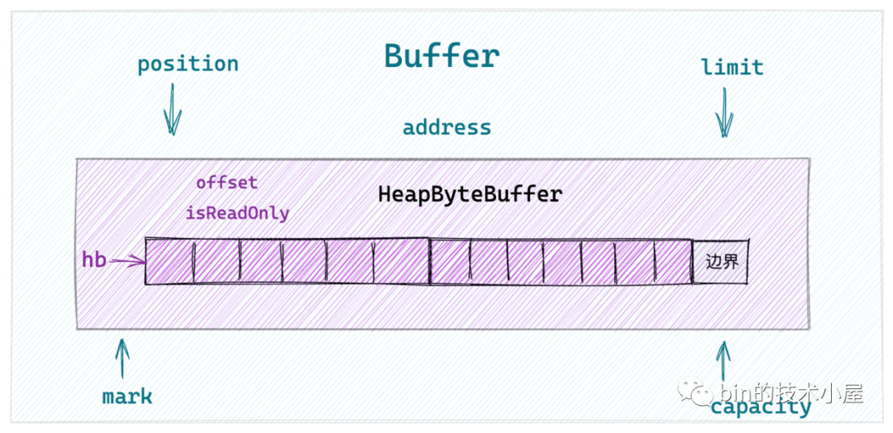

经过前边几个小节的介绍，大家应该对 HeapByteBuffer 的结构很清楚了，HeapByteBuffer 背后主要是依赖于 JVM 堆中的一个字节数组 byte[] hb。

在这个 JVM 堆中的字节数组的基础上，实现了在 Buffer 类和 ByteBuffer类中定义的抽象方法。

### 6.1 HeapByteBuffer 的构造

在 HeapByteBuffer 的构造过程中首先就会根据用户指定的 Buffer 容量 cap，在 JVM 堆中创建一个容量大小为 cap 的字节数组出来作为 HeapByteBuffer 底层存储数据的容器。

```
class HeapByteBuffer extends ByteBuffer {

   HeapByteBuffer(int cap, int lim) {      
        super(-1, 0, lim, cap, new byte[cap], 0);
   }

}
public abstract class ByteBuffer extends Buffer implements Comparable<ByteBuffer> {

    ByteBuffer(int mark, int pos, int lim, int cap,   
                 byte[] hb, int offset)
    {
        super(mark, pos, lim, cap);
        this.hb = hb;
        this.offset = offset;
    }

}
```

还有我们《5.2 将字节数组映射成 ByteBuffer》小节介绍的用于将原生字节数组映射成 ByteBuffer 的 wrap 方法中用到的构造函数：

```
    public static ByteBuffer wrap(byte[] array, int offset, int length) {
        try {
            return new HeapByteBuffer(array, offset, length);
        } catch (IllegalArgumentException x) {
            throw new IndexOutOfBoundsException();
        }
    }
    HeapByteBuffer(byte[] buf, int off, int len) { 
        super(-1, off, off + len, buf.length, buf, 0);
    }
```

以及我们在《5.3 定义 ByteBuffer 视图相关操作》小节介绍的用于创建 ByteBuffer 视图的两个方法 slice() 和 duplicate() 方法中用到的构造函数：

```
   protected HeapByteBuffer(byte[] buf,
                                   int mark, int pos, int lim, int cap,
                                   int off)
    {
        super(mark, pos, lim, cap, buf, off);
    }
```

### 6.2 从 HeapByteBuffer 中读取字节

#### 6.2.1 根据 position 的位置读取一个字节

- 首先会通过《2.2.2 获取 Buffer 下一个可读取位置》小节介绍的 nextGetIndex() 方法获取当前 HeapByteBuffer 中的 position 位置，根据 position 的位置读取字节。
- 为了兼容 Buffer 视图的相关操作，定位读取位置 position 都会加上 offset。原生 Buffer 中的 offset = 0。
- 通过 position + offset 确定好访问 Index 之后，就是数组的普通操作了，直接通过这个 Index 从 hb 字节数组中获取字节。随后 Buffer 中的 position 向后移动一个位置。

```
class HeapByteBuffer extends ByteBuffer {

    protected final byte[] hb;
    protected final int offset;

    public byte get() {
        return hb[ix(nextGetIndex())];
    }
   // 确定访问 index 
   protected int ix(int i) {
        return i + offset;
    }
}
```

#### 6.2.2 根据指定的 Index 读取一个字节

我们除了可以根据 Buffer 的 position 位置读取字节，还可以指定具体的 Index 来从 Buffer 中读取字节：

- 检查 Index 是否超出 Buffer 的边界范围，通过检查之后 Index + offset 确定读取位置。

> 注意这个方法读取字节之后，position 的位置是不会改变的。

```
public byte get(int i) {
        return hb[ix(checkIndex(i))];
    }
```

#### 6.2.3 将 HeapByteBuffer 中的字节转移到指定的字节数组中

这个方法其实笔者在《5.4 定义 ByteBuffer 读写相关操作》小节中介绍 ByteBuffer 的顶层规范设计时已经提到过了，由于 ByteBuffer 只是一个抽象类负责顶层操作规范的定义，本身并不具备具体存储数据的能力，所以在 ByteBuffer 中只是提供了一个通用的实现。ByteBuffer 中的实现是通过在一个 `for () {....}` 循环中不停的根据原生 Buffer 中的 position 指针（前边介绍的 get() 方法）遍历底层数组并一个一个的拷贝到目标字节数组 dst 中。这样的拷贝操作无疑是效率低下的。

而在 HeapByteBuffer 这个具体的 ByteBuffer 实现类中已经定义了具体的存储方式，所以根据具体的存储方式能够做一下拷贝上的优化：

```
    public ByteBuffer get(byte[] dst, int offset, int length) {
        checkBounds(offset, length, dst.length);
        if (length > remaining())
            throw new BufferUnderflowException();
        System.arraycopy(hb, ix(position()), dst, offset, length);
        position(position() + length);
        return this;
    }
```

HeapByteBuffer 中对于拷贝字节数组中的数据使用了 `System.arraycopy` 方法，该方法在 JVM 中是一个 `intrinsic method`，是经过 JVM 编译器特殊优化的，比通过 JNI 调用 native 方法的性能还要高。

利用 `System.arraycopy` 方法将 HeapByteBuffer 中的字节数据从 position 开始，拷贝 length 个字节到目标字节数组 dst 中。

### 6.3 向HeapByteBuffer中写入字节

#### 6.3.1 根据 position 的位置写入一个字节

- 首先会通过《2.2.3 获取 Buffer 下一个可写入位置》小节中介绍的 nextPutIndex()  方法获取当前 HeapByteBuffer 中的 position 位置，根据position的位置写入字节。
- 通过 position + offset 定位到写入位置 Index，然后向 HeapByteBuffer 底层的字节数组 hb 直接写入字节数据。随后 position 向后移动一个位置。

```
    public ByteBuffer put(byte x) {
        hb[ix(nextPutIndex())] = x;
        return this;
    }

   protected int ix(int i) {
        return i + offset;
    }
```

#### 6.3.2 根据指定的 Index 写入一个字节

> 注意通过这个方法根据指定 Index 写入字节之后，position 的位置是不会改变的。

```
    public ByteBuffer put(int i, byte x) {
        hb[ix(checkIndex(i))] = x;
        return this;
    }
```

#### 6.3.3 将指定字节数组转移到 HeapByteBuffer 中

同理和《6.2.3 将 HeapByteBuffer 中的字节转移到指定的字节数组中》小节中介绍的相关方法一样，HeapByteBuffer 也是采用了 JVM 中的 `System.arraycopy `方法（intrinsic method ）从而更加高效地进行字节数组的拷贝操作。

从字节数组 src 中的 offset 位置开始拷贝 length 个字节到 HeapByteBuffer中

```
   public ByteBuffer put(byte[] src, int offset, int length) {

        checkBounds(offset, length, src.length);
        if (length > remaining())
            throw new BufferOverflowException();
        System.arraycopy(src, offset, hb, ix(position()), length);
        position(position() + length);
        return this;
    }
```

------

HeapByteBuffer 背后依靠的字节数组存储的是一个一个的字节，以上操作全部针对的是单个字节来的，所以并不需要考虑字节序的影响，但是如果我们想从 HeapByteBuffer 中读取写入一个 int 或者一个 double 类型的数据，那么我们就需要考虑字节序的问题了。

在介绍如何从 HeapByteBuffer 中读取或者写入一个指定基本类型数据之前，笔者先来为大家介绍一下：

- 到底什么是字节序?
- 为什么会有字节序的存在?
- 字节序对 Buffer 的操作会有什么影响?

## 7. 字节序

谈起字节序来大家可能都会有这样的感触就是记了忘，忘了记，记了又忘。所以为了让大家清晰地理解字节序并且深深地刻入脑海中，笔者挖空心思终于想出了一个生活中的例子来为大家说明字节序。

笔者平时有健身的习惯，已经坚持撸铁四年多了，为了给身体补充蛋白质增加肌肉量，每天打底至少 15 个鸡蛋，所以剥鸡蛋就成为了笔者日常的一个重要任务。


那么问题来了，在我们剥鸡蛋的时候，我们到底是该从鸡蛋大的一端剥起还是从鸡蛋小的的一端剥起呢？

这还真是一个问题，有的人喜欢从小端剥起，但是笔者习惯从大端开始剥起。于是就有了**大端-小端**的剥法。

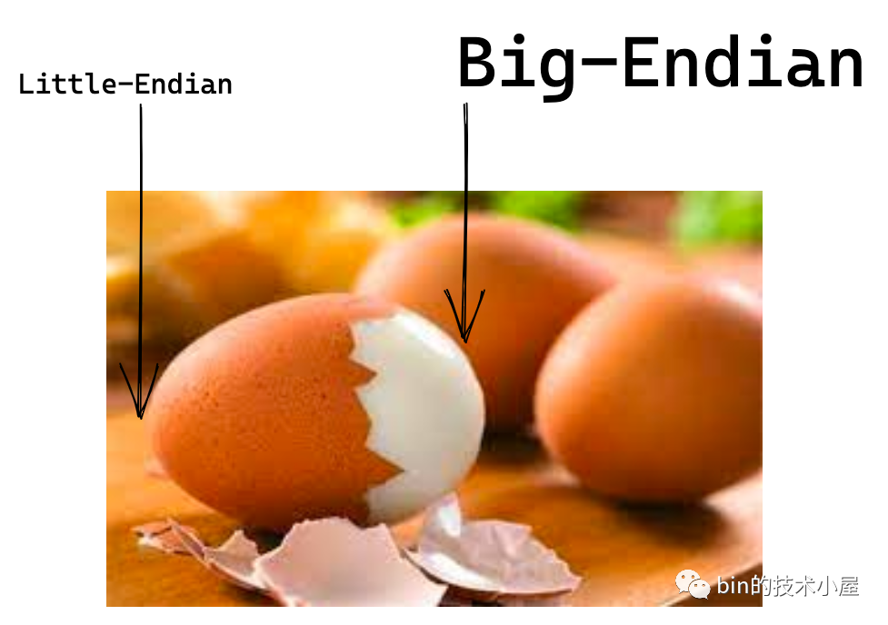

既然剥鸡蛋有大端-小端的分歧在，那么在计算机网络传输数据时也会存在这样的问题，计算机中是怎么扯出大端-小端的分歧呢？请耐心听笔者接着讲下去~~

我们都知道在计算机中存储数据，字符编码以及网络中传输数据时都是通过一个 bit 一个 bit 组成的 010101 这样的二进制形式传输存储的。由于本系列的主题是关于网络 IO 的处理，所以笔者这里以网络传输中的字节序举例：

比如现在我们要传输一个 int 型的整数 5674 到对端主机中。int 型的变量 5674 对应的二进制是 1011000101010 。如下图所示：


剥鸡蛋的分歧在于是从大的一端开始剥还是从小的一端开始剥，从大的一端开始剥我们叫做大端剥法，而从小的一端开始剥我们叫做小端剥法。

同样的道理，我们在网络传输二进制数据的时候也有分歧：我们是从二进制的高位开始传输呢（图中绿色区域）？还是从二进制的低位开始传输呢（图中黄色区域）？

如果我们从二进制数据的高位（类比鸡蛋的大端）开始传输我们就叫**大端字节序**，如果我们从二进制的低位（类比鸡蛋的小端）开始传输就叫**小端字节序**。

> 网络协议采用的是**大端字节序**传输

好了，现在关于网络传输字节的顺序问题，我们阐述清楚了，那么接下来我们看下当网络字节传输到对端时，对端如何接收？

当网络字节按照大端字节序传输到对端计算机时，对端会在操作系统的堆中开辟一块内存用来接收网络字节。而在操作系统的虚拟内存布局中，**堆空间的地址增长方向是从低地址向高地址增长**，而栈空间的地址是从高地址向低地址增长。


现在我们假设如果当网络字节传输到对端计算机中，我们在对端使用 HeapByteBuffer 去接收网络字节（这里只是假设，实践上都是使用 DirectByteBuffer ），经过前边内容的介绍我们知道，HeapByteBuffer 背后其实依靠一个字节数组来存储字节。如图中所示，字节数组从索引 0 开始到索引 6 它们在内存中的地址是从低地址到高地址。

理解了这些，下面我们就来看下字节在不同字节序下是如何接收存储的。

### 7.1 大端字节序

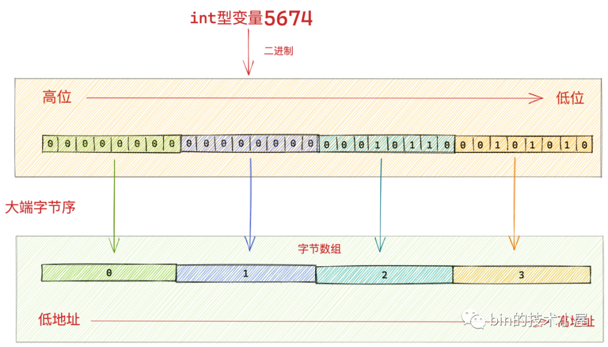

如图中所示，在**大端字节序**下 int 型变量 5674 它的字节**高位**被存储在了字节数组中的**低地址**中，字节的**低位**被存储在字节数组的**高地址**中。这就是大端字节序，也是比较符合人类的直观感受。

### 7.2 小端字节序


然而在**小端字节序**下，int 型变量 5674 它的字节**高位**被存储在了字节数组中的**高地址**中，字节的**低位**被存储在字节数组的**低地址**中。这就是小端字节序，正好和正常人类直观感受是相反的。

------

到现在，我想大家应该最起码从概念上知道什么是大端字节序？什么是小端字节序了吧？

下面笔者在带大家到实战中，再去体验一把大端字节序和小端字节序的不同。彻底让大家理解清楚。

## 8. 向 HeapByteBuffer 中写入指定基本类型

HeapByteBuffer 背后是一个在 JVM 堆中开辟的一个字节数组，里边存放的是一个一个的字节，当我们以单个字节的形式操作 HeapByteBuffer 的时候并没有什么问题，可是当我们向 HeapByteBuffer 写入一个指定的基本类型数据时，比如写入一个 int 型 （占用 4 个字节），写入一个 double 型 （占用 8 个字节），就必须要考虑字节序的问题了。

```
public abstract class ByteBuffer extends Buffer implements Comparable<ByteBuffer> {

   boolean bigEndian = true;
   boolean nativeByteOrder = (Bits.byteOrder() == ByteOrder.BIG_ENDIAN);

}
```

我们可以强制网络协议传输使用大端字节序，但是我们无法强制主机中采用的字节序，所以我们需要经常在网络 IO 场景下做一些字节序的转换工作。

JDK NIO ByteBuffer 默认的字节序为**大端模式**，我们可以通过 NIO 提供的操作类 `Bits` 获取主机字节序 `Bits.byteOrder()`，或者直接获取 NIO ByteBuffer 中的 nativeByteOrder 字段判断主机字节序：true 表示主机字节序为大端模式，false 表示主机字节序为小端模式。

当然我们也可以通过 ByteBuffer 中的 order 方法来指定我们想要的字节序：

```
    public final ByteBuffer order(ByteOrder bo) {
        bigEndian = (bo == ByteOrder.BIG_ENDIAN);
        nativeByteOrder =
            (bigEndian == (Bits.byteOrder() == ByteOrder.BIG_ENDIAN));
        return this;
    }
```

下面笔者就带大家分别从大端模式和小端模式下来看一下如何向 HeapByteBuffer 写入一个指定基本类型的数据。我们以 int 型数据举例，假设要写入的 int 值 为 5674。

### 8.1 大端字节序

```
class HeapByteBuffer extends ByteBuffer {

    public ByteBuffer putInt(int x) {
        Bits.putInt(this, ix(nextPutIndex(4)), x, bigEndian);
        return this;
    }
}
```

首先我们会获取当前 HeapByteBuffer 的写入位置 position，因为我们需要写入的是一个 int 型的数据，所以当写入完毕之后 position 的位置需要向后移动 4 位。nextPutIndex 方法的逻辑笔者在之前的内容中已经详细介绍过了，这里不在赘述。

```
class Bits { 

    static void putInt(ByteBuffer bb, int bi, int x, boolean bigEndian) {
        if (bigEndian)
            // 采用大端字节序写入 int 数据
            putIntB(bb, bi, x);
        else
            // 采用小端字节序写入 int 数据
            putIntL(bb, bi, x);
    }

    static void putIntB(ByteBuffer bb, int bi, int x) {
        bb._put(bi    , int3(x));
        bb._put(bi + 1, int2(x));
        bb._put(bi + 2, int1(x));
        bb._put(bi + 3, int0(x));
    }
}
```

大家看到了吗，这里就是按照我们之前介绍的大端字节序，从 int 值 5674 的二进制高位字节到低位字节依次写入 HeapByteBuffer中字节数组的低地址中。

这里的 `int3(x)` 方法就是负责获取写入数据 x 的最高位字节，并将最高位字节（下图中绿色部分）写入字节数组中的低地址中（下图中对应绿色部分）。

同理 int2(x)，int1(x)，int0(x) 方法依次获取 x 的次高位字节，依次写入字节数组中的低地址中。

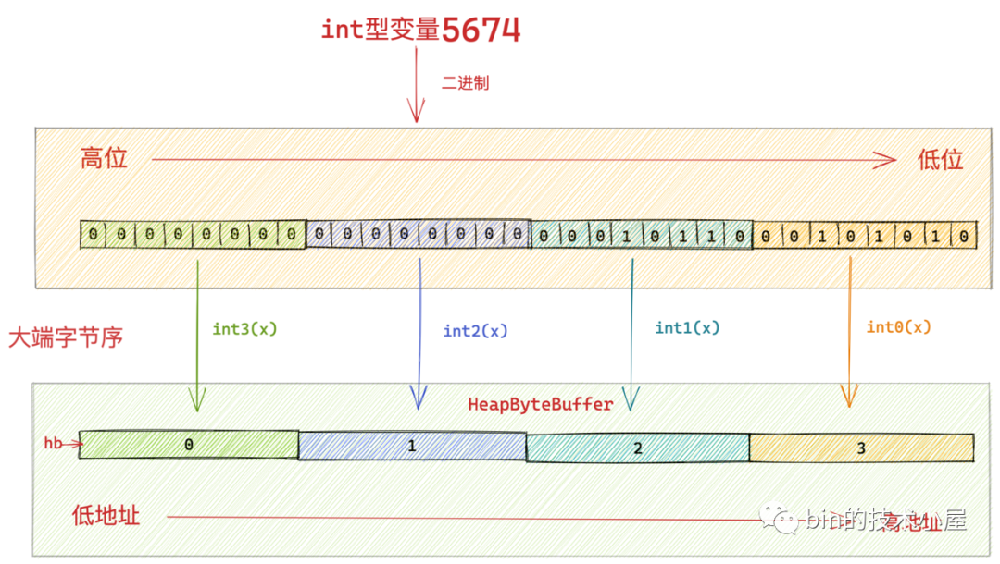

那么我们如何依次获得一个 int 型数据的高位字节呢？大家接着跟着笔者往下走~

#### 8.1.1 int3(x) 获取 int 型最高位字节

```
class Bits { 

 private static byte int3(int x) { return (byte)(x >> 24); }

}
```

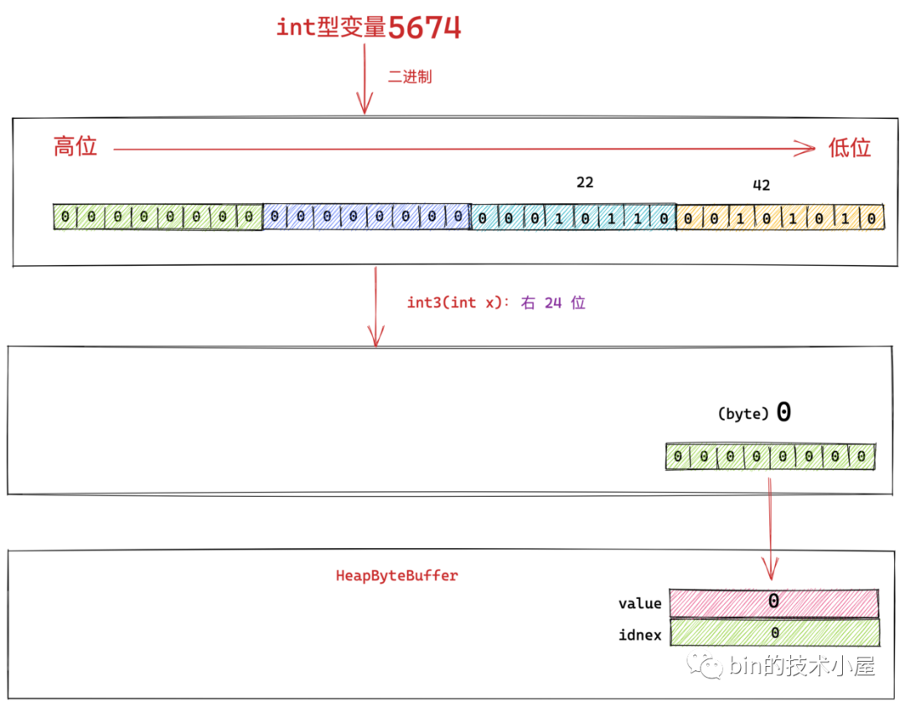

#### 8.1.2 int2(x) 获取 int 型次高位字节

```
class Bits { 

 private static byte int2(int x) { return (byte)(x >> 16); }

}
```

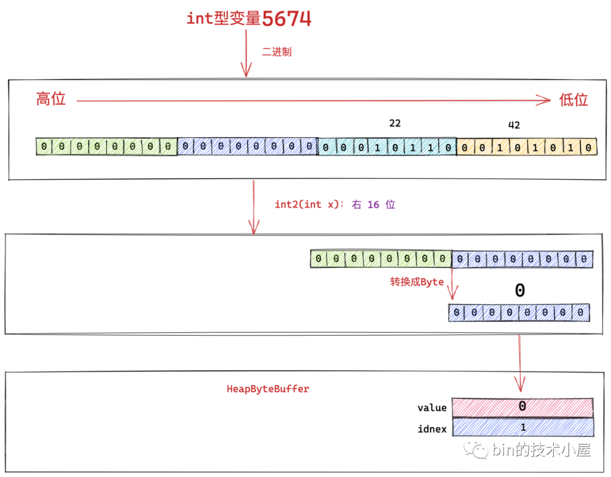

#### 8.1.3 int1(x) 获取 int 型第三高位字节

```
class Bits { 

 private static byte int1(int x) { return (byte)(x >> 8); }

}
```

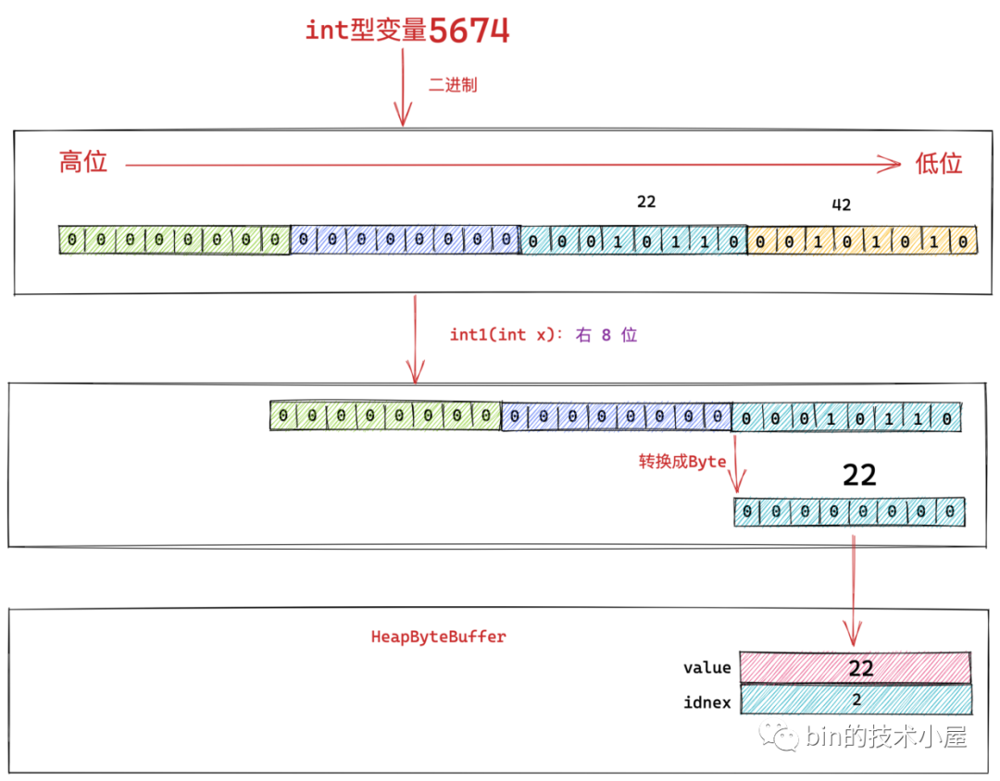

#### 8.1.4 int0(x) 获取 int 型最低位字节

```
class Bits { 

 private static byte int0(int x) { return (byte)(x      ); }

}
```


最终 int 型变量 5764 按照大端字节序写入到 HeapByteBuffer之后的字节数组结构如下：

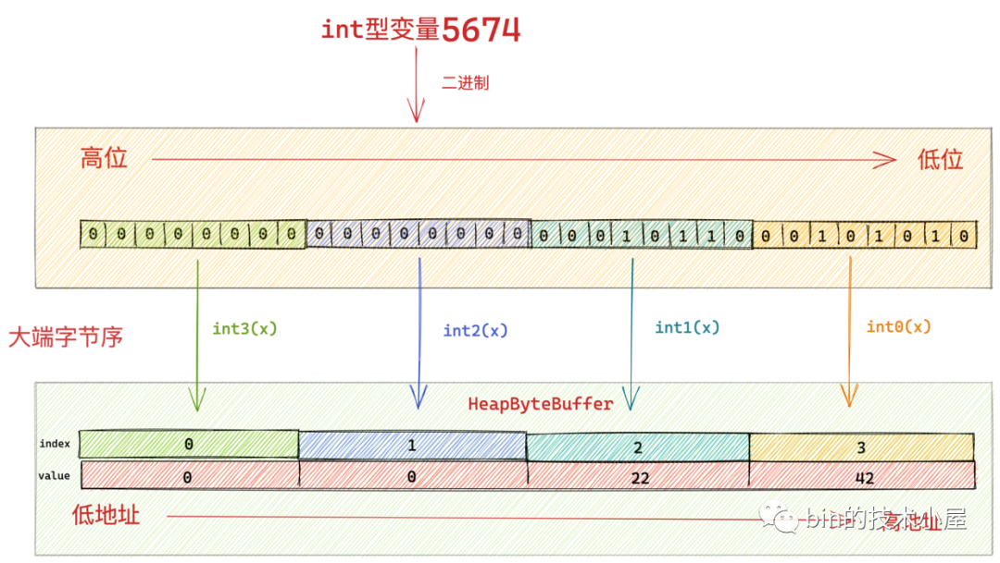

### 8.2 小端字节序

在我们彻底理解了大端字节序的操作之后，小端字节序的相关操作就很好理解了。

```
    static void putIntL(ByteBuffer bb, int bi, int x) {
        bb._put(bi + 3, int3(x));
        bb._put(bi + 2, int2(x));
        bb._put(bi + 1, int1(x));
        bb._put(bi    , int0(x));
    }
```

根据我们之前介绍的小端字节序的定义，在小端模式下二进制数据的高位是存储在字节数组中的高地址中，二进制数据的低位是存储在字节数组中的低地址中。
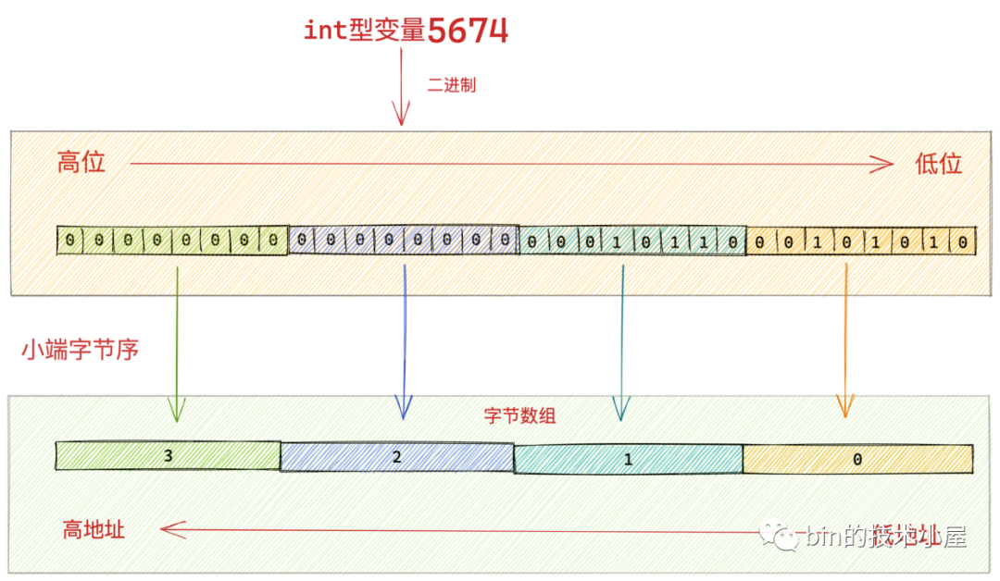

## 9. 从 HeapByteBuffer 中读取指定基本类型

当我们清楚了在不同的字节序下如何向 HeapByteBuffer 中写入指定基本类型数据的过程之后，那么在不同字节序下向 HeapByteBuffer 读取指定基本类型数据的过程，我想大家就能很容易理解了。

我们还是以 int 型数据举例，假设要从 HeapByteBuffer 中读取一个 int 型的数据。

首先我们还是获取当前 HeapByteBuffer 中的读取位置 position，从 position 位置开始读取四个字节出来，然后通过这四个字节组装成一个 int 数据返回。

```
class HeapByteBuffer extends ByteBuffer {

    public int getInt() {
        return Bits.getInt(this, ix(nextGetIndex(4)), bigEndian);
    }

}
class Bits { 

  static int getInt(ByteBuffer bb, int bi, boolean bigEndian) {
        return bigEndian ? getIntB(bb, bi) : getIntL(bb, bi) ;
    }

}
```

我们还是先来介绍大端模式下的读取过程：

### 9.1 大端字节序

```
class Bits { 

    static int getIntB(ByteBuffer bb, int bi) {
        return makeInt(bb._get(bi    ),
                       bb._get(bi + 1),
                       bb._get(bi + 2),
                       bb._get(bi + 3));
    }

}
```


由于在大端模式下，二进制数据的高位是存放于字节数组中的低地址中，我们需要从字节数组中的低地址中依次读取二进制数据的高位出来。

然后我们从高位开始依次组装 int 型数据，正好和写入过程相反。

```
    static private int makeInt(byte b3, byte b2, byte b1, byte b0) {
        return (((b3       ) << 24) |
                ((b2 & 0xff) << 16) |
                ((b1 & 0xff) <<  8) |
                ((b0 & 0xff)      ));
    }
```

### 9.2 小端字节序


```
class Bits { 

    static int getIntL(ByteBuffer bb, int bi) {
        return makeInt(bb._get(bi + 3),
                       bb._get(bi + 2),
                       bb._get(bi + 1),
                       bb._get(bi    ));
    }

}
```

而在小端模式下，我们则需要先从字节数组中的高地址中将二进制数据的高位依次读取出来，然后在从高位开始依次组装 int 型数据。

在笔者介绍完了关于 int 数据的读写过程之后，相信大家可以很轻松的理解其他基本类型在不同字节序下的读写操作过程了。

## 10. 将 HeapByteBuffer 转换成指定基本类型的 Buffer

在《2. NIO 对 Buffer 的顶层抽象》小节一开始就介绍到，NIO 其实为我们提供了多种基本类型的 Buffer 实现。


NIO 允许我们将 ByteBuffer 转换成任意一种基本类型的 Buffer，这里我们以转换 IntBuffer 为例说明：

```
class HeapByteBuffer extends ByteBuffer {

    public IntBuffer asIntBuffer() {
        int size = this.remaining() >> 2;
        int off = offset + position();
        return (bigEndian
                ? (IntBuffer)(new ByteBufferAsIntBufferB(this,
                                                             -1,
                                                             0,
                                                             size,
                                                             size,
                                                             off))
                : (IntBuffer)(new ByteBufferAsIntBufferL(this,
                                                             -1,
                                                             0,
                                                             size,
                                                             size,
                                                             off)));
    }

}
```

IntBuffer 底层其实依托了一个 ByteBuffer，当我们向 IntBuffer 读取一个 int 数据时，其实是从底层依托的这个 ByteBuffer 中读取 4 个字节出来然后组装成 int 数据返回。

```
class ByteBufferAsIntBufferB extends IntBuffer {

    protected final ByteBuffer bb;

    public int get() {
        return Bits.getIntB(bb, ix(nextGetIndex()));
    }
}
class Bits { 

    static int getIntB(ByteBuffer bb, int bi) {
        return makeInt(bb._get(bi    ),
                       bb._get(bi + 1),
                       bb._get(bi + 2),
                       bb._get(bi + 3));
    }

    static private int makeInt(byte b3, byte b2, byte b1, byte b0) {
        return (((b3       ) << 24) |
                ((b2 & 0xff) << 16) |
                ((b1 & 0xff) <<  8) |
                ((b0 & 0xff)      ));
    }

}
```

同理，我们向 IntBuffer 中写入一个int数据时，其实是想底层依托的这个 ByteBuffer 写入 4 个字节。

IntBuffer 底层依托的这个 ByteBuffer ，会根据字节序的不同分为：ByteBufferAsIntBufferB（大端实现）和 ByteBufferAsIntBufferL（小端实现）。

在我们详细介绍完 HeapByteBuffer 的实现之后，笔者这里就不在为大家详细介绍 ByteBufferAsIntBufferB 和 ByteBufferAsIntBufferL 了。操作全部是一样的，感兴趣的大家可以自行查看一下。

## 总结

本文我们以 JDK NIO Buffer 中最简单的一个实现类 HeapByteBuffer 为主线从 NIO 对 Buffer 的顶层抽象设计开始从整体上为大家介绍了 Buffer 的设计。

在这个过程中，我们可以体会到 NIO 对 Buffer 的设计还是比较复杂的，尤其是我们针对裸 NIO 进行编程的时候会有非常多的反人类操作，一不小心就会出错。

比如：用于 Buffer 读模式切换 flip() 方法，写模式切换的 clear() 方法和 compact() 方法以及用于重新处理 Buffer 中数据的 rewind() 方法。在我们使用这些方法处理字节数据的时候需要时刻清楚 Buffer 中的数据分布情况，一不小心就会造成数据的覆盖和丢失。

后面我们又介绍了 Buffer 中视图的概念和相关操作 slice() 方法和 duplicate() 方法，以及关于视图 Buffer 和原生 Buffer 之间的区别和联系。

我们以 HeapByteBuffer 为例，介绍了 NIO Buffer 相关顶层抽象方法的实现，并再次基础上更进一步介绍了在不同字节序下 ByteBuffer 相关的读取写入操作的详细过程。

最后我们介绍了 ByteBuffer 与相关指定基本类型 Buffer （比如 IntBuffer，LongBuffer）在不同字节序下的转换。

另外我们还穿插介绍了：到底什么是字节序? 为什么会有字节序的存在? 字节序对 Buffer 的操作会有什么影响?

因为 HeapByteBuffer 足够简单，所以利用它能够把整个 NIO 对 Buffer 的设计与实现串联起来，但是根据 Buffer 背后的存储机制不同，还有 DirectByteBuffer 和 MappedByteBuffer ，它们的 API 在使用上基本和 HeapByteBuffer 是一致的。但是它们背后涉及到的原理却是非常复杂的（尤其是 MappedByteBuffer）。

所以笔者后面会单独写两篇文章来详细分别为大家介绍 DirectByteBuffer 和 MappedByteBuffer 背后涉及到的复杂原理，目的是让大家不仅会使用而且还要把它们背后涉及到的复杂原理彻底搞透彻弄清楚，要知其然并且还要知其所以然~~~

> 参考自： https://mp.weixin.qq.com/s?__biz=Mzg2MzU3Mjc3Ng==&mid=2247485497&idx=1&sn=eb4afe6764b2b976fb80f6dc5c6fd68a&chksm=ce77ce7ef900476865864e09bb6f0688ca784afc396084ecc90a894bfd733692049c332edd11&scene=178&cur_album_id=2217816582418956300#rd