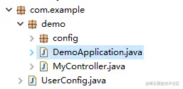
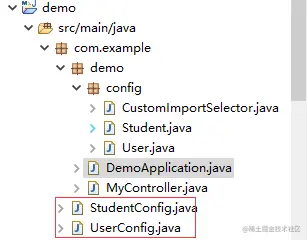
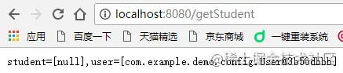

# Import和ImportSelector注解使用及源码分析

### 一、@Import

在学习`@Import`这个注解时，大家会不会在想一个问题，这个注解的作用是导入一个配置`Configuration`类，那到底什么地方会用到它呢？想到我们工程中也不会使用这个注解去导入配置呀，我们都是新建一个类`xxxxxxConfiguration.java`，然后直接在类里边把所有的`Bean`组件啥的都给声明了，下面的代码我们感觉似曾相识。

````java
/**
 * xx配置类，里边会有n个bean
 * @Author jiawei huang
 * @Since 2019年8月26日
 * @Version 1.0
 */
@Configuration
public class CustomConfig {
    @Bean
    public Marker zuulProxyMarkerBean() {
    	return new Marker();
    }
    ......
}
````

但你有没有想过一个问题，当配置类`CustomConfig`不在`@SpringBootApplication`所在包及其子包下时，它还能被装配进去吗？答案是不能。因为，它不在`springboot`默认扫描范围内。详情可查看[SpringBoot封装我们自己的Starter](https://juejin.cn/post/6844903923162038279)

我讲的到底有没有道理呢？让我们来做个实验。`UserConfig`用于配置`User`对象，它位于`com.example`包下，`DemoApplication.java`位于`com.example.demo`包下，此时`SpringBoot`是没法扫描到`UserConfig`并注入`User`对象的。



**UserConfig.java**

````java
/**
 * @Author jiawei huang
 * @Since 2019年8月26日
 * @Version 1.0
 */
@Configuration
public class UserConfig {
    @Bean
    public User getUser() {
    	return new User();
    }
}
````

使用下面代码注入会报错：

````java
@Autowired
private User user;
````

````shell
The injection point has the following annotations:
	- @org.springframework.beans.factory.annotation.Autowired(required=true)
````

怎么办呢？解决办法有二种：

- 1、使用`@ComponentScan("com.**")`注解一句话搞定
- 2、使用`@Import`注解引入

方法一简单粗暴，看似没啥毛病，但这是建立在你知道`bean`对象的大概包路径的基础上的，第三方的jar包中的`bean`可并不是都是以`com`开头命名的，这就尴尬了。 在上面的路径结构基础上，我们在`DemoApplication.java`中加入`@Import(UserConfig.class)`这个注解即可解决问题。

另外，`@Import`相当于Spring xml配置文件中的`<import />`标签。

### 二、ImportSelector

`@Import`注释是让我们导入一组指定的配置类--`@Configuration`修饰的类，类名一旦指定，将全部被解析。相反，`ImportSelector`将允许我们根据条件动态选择想导入的配置类，换句话说，它具有动态性。`ImportSelector`使用时，我们要创建一个类实现`ImportSelector`接口，并重写其中的`String[] selectImports(AnnotationMetadata importingClassMetadata);`方法。

假设我们想实现这样一个功能，我们创建一个`CustomImportSelector`类，当使用`CustomImportSelector`的元素是类时，我们返回`UserConfig`配置类，当使用`CustomImportSelector`的元素是接口时,我们返回`StudentConfig`配置类。



注意目录层次，要保证`UserConfig`和`StudentConfig`在`DemoApplication`的外层，否则，这两个配置类就会被spring默认解析到了。

````java
/**
 * 
 * @Author jiawei huang
 * @Since 2019年8月26日
 * @Version 1.0
 */
@Configuration
public class UserConfig {
	@Bean
	public User getUser() {
		return new User();
	}
}
/**
 * 
 * @Author jiawei huang
 * @Since 2019年8月26日
 * @Version 1.0
 */
@Configuration
public class StudentConfig {

	@Bean
	public Student getStudent() {
		return new Student();
	}

}
@SpringBootApplication
// 1、很明显，这里CustomImportSelector修饰的是一个类，我们将会返回UserConfig
@Import(CustomImportSelector.class)
public class DemoApplication {
	public static void main(String[] args) {
		SpringApplication.run(DemoApplication.class, args);
	}
}
/**
 * 
 * @Author jiawei huang
 * @Since 2019年8月19日
 * @Version 1.0
 */
@RestController
public class MyController {

	@Autowired(required = false)
	private Student student;

	@Autowired(required = false)
	private User user;

	@RequestMapping("/getStudent")
	private String getStudent() {
		return "student=[" + student + "],user=[" + user + "]";
	}

}
/**
 * 
 * @Author jiawei huang
 * @Since 2019年8月26日
 * @Version 1.0
 */
public class CustomImportSelector implements ImportSelector {

	/**
	 * importingClassMetadata:被修饰的类注解信息
	 */
	@Override
	public String[] selectImports(AnnotationMetadata importingClassMetadata) {

		// 注意，自定义注解这里是拿不到的
		System.out.println(importingClassMetadata.getAnnotationTypes());

		// 如果被CustomImportSelector导入的组件是类，那么我们就实例化UserConfig
		if (!importingClassMetadata.isInterface()) {
			return new String[] { "com.example.UserConfig" };
		}

		// 此处不要返回null
		return new String[] { "com.example.StudentConfig" };
	}
}
````

打开浏览器，调用接口，得到如下返回，证明`Student`没有被注入成为bean，而`User`成功被注入



### 三、讲讲原理

注解在Spring启动过程中在哪里被解析？ Spring源码版本：`5.1.6.RELEASE`	

粗略debug了下源码，这2个注解的解析过程统一在`ConfigurationClassParser$DeferredImportSelectorGroupingHandler`类中的`processImports()`方法实现的，该方法大致源码如下：

````java
private void processImports(ConfigurationClass configClass, SourceClass currentSourceClass,
    	Collection<SourceClass> importCandidates, boolean checkForCircularImports) {
    
    if (importCandidates.isEmpty()) {
    	return;
    }
    
    if (checkForCircularImports && isChainedImportOnStack(configClass)) {
    	this.problemReporter.error(new CircularImportProblem(configClass, this.importStack));
    }
    else {
    	this.importStack.push(configClass);
        try {
        for (SourceClass candidate : importCandidates) {
            // 1、如果该配置类被ImportSelector修饰，则当成ImportSelector进行处理
        	if (candidate.isAssignable(ImportSelector.class)) {
        		// Candidate class is an ImportSelector -> delegate to it to determine imports
        		Class<?> candidateClass = candidate.loadClass();
        		ImportSelector selector = BeanUtils.instantiateClass(candidateClass, ImportSelector.class);
        		ParserStrategyUtils.invokeAwareMethods(
        				selector, this.environment, this.resourceLoader, this.registry);
        		if (selector instanceof DeferredImportSelector) {
        			this.deferredImportSelectorHandler.handle(
        					configClass, (DeferredImportSelector) selector);
        		}
        		else {
        			String[] importClassNames = selector.selectImports(currentSourceClass.getMetadata());
        			Collection<SourceClass> importSourceClasses = asSourceClasses(importClassNames);
        			processImports(configClass, currentSourceClass, importSourceClasses, false);
        		}
        	}
        	// 2、如果该配置类被ImportBeanDefinitionRegistrar修饰，则当成ImportBeanDefinitionRegistrar进行处理
        	else if (candidate.isAssignable(ImportBeanDefinitionRegistrar.class)) {
        		// Candidate class is an ImportBeanDefinitionRegistrar ->
        		// delegate to it to register additional bean definitions
        		Class<?> candidateClass = candidate.loadClass();
        		ImportBeanDefinitionRegistrar registrar =
        				BeanUtils.instantiateClass(candidateClass, ImportBeanDefinitionRegistrar.class);
        		ParserStrategyUtils.invokeAwareMethods(
        				registrar, this.environment, this.resourceLoader, this.registry);
        		configClass.addImportBeanDefinitionRegistrar(registrar, currentSourceClass.getMetadata());
        	}
        	// 3、如果该配置类被Import修饰，则当成Import进行处理
        	else {
        		// Candidate class not an ImportSelector or ImportBeanDefinitionRegistrar ->
        		// process it as an @Configuration class
        		this.importStack.registerImport(
        				currentSourceClass.getMetadata(), candidate.getMetadata().getClassName());
        		processConfigurationClass(candidate.asConfigClass(configClass));
        	}
        }
        }
        catch (BeanDefinitionStoreException ex) {
        throw ex;
        }
        catch (Throwable ex) {
        throw new BeanDefinitionStoreException(
        		"Failed to process import candidates for configuration class [" +
        		configClass.getMetadata().getClassName() + "]", ex);
        }
        finally {
        this.importStack.pop();
        }
    }
}
````

从Spring启动开始，到执行注解解析，大致调用链路如下：

```
SpringApplication-refreshContext()`->`AbstractApplicationContext-refresh()-postProcessBeanFactory()`->`PostProcessorRegistrationDelegate-invokeBeanDefinitionRegistryPostProcessors()`->`ConfigurationClassPostProcessor-processConfigBeanDefinitions()`->`ConfigurationClassParser-parse()`->`ConfigurationClassParser-processImports()
```

`ConfigurationClassParser`是`Spring`提供的用于解析`@Configuration`的配置类，通过它将会得到一个`ConfigurationClass`对象列表。

> 本文转自： https://juejin.cn/post/6844903925242396686