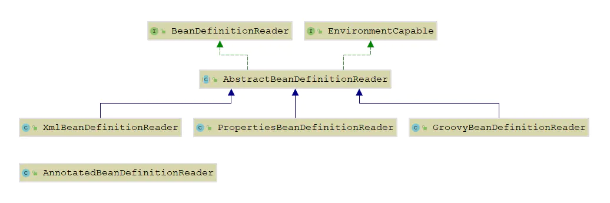
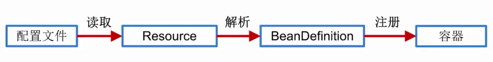
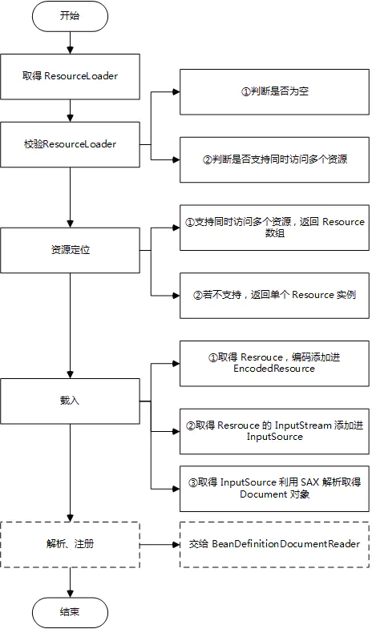

# spring之BeanDefinitionReader

## 概述

BeanDefinitionReader 的作用是读取 Spring 配置文件中的内容，将其转换为 IOC 容器内部的数据结构：BeanDefinition。在前面章节关于 BeanDefinition 的学习中有提到 XmlBeanDefinitionReader，该类是 BeanDefinitionReader 的一个重要实现。本文主要对 BeanDefinitionReader 体系中的关键方法进行解读。

## BeanDefinitionReader

BeanDefinitionRegistry 接口一次只能注册一个 BeanDefinition，而且只能自己构造 BeanDefinition 类来注册。BeanDefinitionReader 解决了这些问题，它一般可以使用一个 BeanDefinitionRegistry 构造，然后通过 loadBeanDefinitions()等方法，把 Resources 转化为多个 BeanDefinition 并注册到 BeanDefinitionRegistry。

##### BeanDefinitionReader 接口定义如下：


```java
public interface BeanDefinitionReader {

    //返回Bean工厂以向其注册Bean定义。
    BeanDefinitionRegistry getRegistry();

    /**
     * 返回资源加载器以用于资源位置。可以检查ResourcePatternResolver接口并进行相应的转换，以针对给定的      
     * 资源模式加载多个资源。一个null返回值表明，绝对资源加载不适用于这个bean定义阅读器。
     * 这主要用于从bean定义资源中导入其他资源，例如，通过XML bean定义中的“ import”标记。但是，建议相对       
     * 于定义资源应用此类导入；只有明确的完整资源位置才会触发绝对资源加载。
    **/
    @Nullable
    ResourceLoader getResourceLoader();

    //返回用于Bean类的类加载器。
    @Nullable
    ClassLoader getBeanClassLoader();

    //返回BeanNameGenerator用于匿名Bean（未指定显式Bean名称）。
    BeanNameGenerator getBeanNameGenerator();

    //从指定的资源加载bean定义。
    int loadBeanDefinitions(Resource resource) throws BeanDefinitionStoreException;


    int loadBeanDefinitions(Resource... resources) throws BeanDefinitionStoreException;

    //从指定的资源位置加载bean定义。
    //该位置也可以是位置模式，前提是此bean定义读取器的ResourceLoader是ResourcePatternResolver。
    int loadBeanDefinitions(String location) throws BeanDefinitionStoreException;


    int loadBeanDefinitions(String... locations) throws BeanDefinitionStoreException;

}
```

##### 关于 BeanDefinitionReader 的结构图如下：



- **AbstractBeanDefinitionReader**：实现了 EnvironmentCapable，提供了获取/设置环境的方法。定义了一些通用方法，使用策略模式，将一些具体方法放到子类实现。
- **XmlBeanDefinitionReader**：读取 XML 文件定义的 BeanDefinition
- **PropertiesBeanDefinitionReader**：可以从属性文件，Resource，Property 对象等读取 BeanDefinition
- **GroovyBeanDefinitionReader**：可以读取 Groovy 语言定义的 Bean
- **AnnotatedBeanDefinitionReader**：没有继承任何类。在AnnotationConfigApplicationContext中使用到。

#### AbstractBeanDefinitionReader

该类是实现了 BeanDefinitionReader 和 EnvironmentCapable 接口的抽象类，提供常见属性：工作的 bean 工厂、资源加载器、用于加载 bean 类的类加载器、环境等。具体定义如下：


```java
public abstract class AbstractBeanDefinitionReader implements BeanDefinitionReader, EnvironmentCapable {

    private final BeanDefinitionRegistry registry;

    @Nullable
    private ResourceLoader resourceLoader;

    @Nullable
    private ClassLoader beanClassLoader;

    private Environment environment;

    private BeanNameGenerator beanNameGenerator = DefaultBeanNameGenerator.INSTANCE;
}
```

关于该类最核心的方法是 loadBeanDefinitions()方法，所以接下来我们主要就是分析该方法。


```java
@Override
public int loadBeanDefinitions(Resource... resources) throws BeanDefinitionStoreException {
    Assert.notNull(resources, "Resource array must not be null");
    int count = 0;
    for (Resource resource : resources) {
        count += loadBeanDefinitions(resource);
    }
    return count;
}
```

当传入的参数为资源位置数组时，进入上述方法，如果为字符串数组，则挨个遍历调用 loadBeanDefinitions(location)方法。其定义如下：


```java
@Override
public int loadBeanDefinitions(String location) throws BeanDefinitionStoreException {
    return loadBeanDefinitions(location, null);
}

//加载资源的实际方法
public int loadBeanDefinitions(String location, @Nullable Set<Resource> actualResources) throws BeanDefinitionStoreException {
    //获取资源加载器，主要的功能就是根据路径和类加载器获取Resource对象
    ResourceLoader resourceLoader = getResourceLoader();
    //判断资源加载器是否为空
    if (resourceLoader == null) {
        throw new BeanDefinitionStoreException(
                "Cannot load bean definitions from location [" + location + "]: no ResourceLoader available");
    }
    //ResourcePatternResolver 用于加载多个文件或者能够加载Ant风格路径的文件资源
    if (resourceLoader instanceof ResourcePatternResolver) {
        // Resource pattern matching available.
        try {
            //根据资源路径调用resourceLoader的getResources方法，该方法以前在ResourceLoader一节讲过，此方法可以加载多个资源
            Resource[] resources = ((ResourcePatternResolver) resourceLoader).getResources(location);
            //根据资源来加载bean定义
            int count = loadBeanDefinitions(resources);
            if (actualResources != null) {
                Collections.addAll(actualResources, resources);
            }
            if (logger.isTraceEnabled()) {
                logger.trace("Loaded " + count + " bean definitions from location pattern [" + location + "]");
            }
            return count;
        }
        catch (IOException ex) {
            throw new BeanDefinitionStoreException(
                    "Could not resolve bean definition resource pattern [" + location + "]", ex);
        }
    }
    else {
        //加载单个文件资源
        // 直接使用ResouceLoader加载
        Resource resource = resourceLoader.getResource(location);
        int count = loadBeanDefinitions(resource);
        if (actualResources != null) {
            actualResources.add(resource);
        }
        if (logger.isTraceEnabled()) {
            logger.trace("Loaded " + count + " bean definitions from location [" + location + "]");
        }
        return count;
    }
}
```

根据资源加载器的不同，来处理资源路径，从而返回多个或一个资源，然后再将资源作为参数传递给 loadBeanDefinitions(resources)方法。在该类中存在一个 loadBeanDefinitions(Resource... resources)方法，该方法用于处理多个资源，归根结底，最后还是调用 loadBeanDefinitions((Resource)resource)方法，该方法的具体实现在 XmlBeanDefinitionReader 中。

#### XmlBeanDefinitionReader

该类作为 AbstractBeanDefinitionReader 的扩展类，继承了 AbstractBeanDefinitionReader 所有的方法，同时也扩展了很多新的方法，主要用于读取 XML 文件中定义的 bean。具体使用如下：


```dart
@Test
public void getBeanDefinition(){
    ClassPathResource resource = new ClassPathResource("application_context.xml");
    DefaultListableBeanFactory factory = new DefaultListableBeanFactory();
    XmlBeanDefinitionReader reader = new XmlBeanDefinitionReader(factory);
    reader.loadBeanDefinitions(resource);
}
```

这段代码是 Spring 中编程式使用 IOC 容器，通过这四段简单的代码，我们可以初步判断 IOC 容器的使用过程。

- 获取资源

- 获取 BeanFactory

- 根据新建的 BeanFactory 创建一个BeanDefinitionReader对象，该Reader 对象为资源的解析器

- 装载资源 整个过程就分为三个步骤：资源定位、装载、注册，如下：

  

- **资源定位**：我们一般用外部资源来定义 Bean 对象，所以在初始化 IoC 容器的第一步就是需要定位这个外部资源。在 Spring IoC资源管理的两篇文章中已经详细说明了资源加载的过程。

- **装载**：装载就是 BeanDefinition 的载入，BeanDefinitionReader 读取、解析 Resource 资源，也就是将用户定义的 Bean 表示成 IoC 容器 的内部数据结构：BeanDefinition。在 IoC 容器内部维护着一个 BeanDefinition Map 的数据结构，在配置文件中每一个都对应着一个 BeanDefinition 对象。

- **注册**：向 IoC 容器注册在第二步解析好的 BeanDefinition，这个过程是通过 BeanDefinitionRegistry 接口来实现的。本质上是将解析得到的 BeanDefinition 注入到一个 ConcurrentHashMap容器中，IoC 容器就是通过这个ConcurrentHashMap来维护这些 BeanDefinition 的。ApplicationContext实现的默认行为就是在启动时将所有singleton bean提前进行实例化（也就是依赖注入）。提前实例化意味着作为初始化过程的一部分，ApplicationContext实例会创建并配置所有的singleton bean。通常情况下这是件好事，因为这样在配置中的任何错误就会即刻被发现（否则的话可能要花几个小时甚至几天）

接着上述讲的 loadBeanDefinitions()，我们看一下在 XmlBeanDefinitionReader 类中的具体实现。


```java
public class XmlBeanDefinitionReader extends AbstractBeanDefinitionReader {

    private final ThreadLocal<Set<EncodedResource>> resourcesCurrentlyBeingLoaded =
            new NamedThreadLocal<Set<EncodedResource>>("XML bean definition resources currently being loaded"){
                @Override
                protected Set<EncodedResource> initialValue() {
                    return new HashSet<>(4);
                }
            };

    @Override
    public int loadBeanDefinitions(Resource resource) throws BeanDefinitionStoreException {
        return loadBeanDefinitions(new EncodedResource(resource));
    }

    public int loadBeanDefinitions(EncodedResource encodedResource) throws BeanDefinitionStoreException {
        Assert.notNull(encodedResource, "EncodedResource must not be null");
        if (logger.isTraceEnabled()) {
            logger.trace("Loading XML bean definitions from " + encodedResource);
        }
        //从本地线程变量中获取当前的正在加载的资源
        Set<EncodedResource> currentResources = this.resourcesCurrentlyBeingLoaded.get();
    
        //如果encodedResource添加进入currentResources失败，表明其中已经存在这个资源，只不过还没有加载完成，抛出重复加载的异常
        if (!currentResources.add(encodedResource)) {
            throw new BeanDefinitionStoreException(
                    "Detected cyclic loading of " + encodedResource + " - check your import definitions!");
        }

        //获取文件的输入流
        try (InputStream inputStream = encodedResource.getResource().getInputStream()) {
            //封装成InputSource，其中指定了输入流和编码格式
            InputSource inputSource = new InputSource(inputStream);
            //如果存在编码，那么将其添加进入InputSource中
            if (encodedResource.getEncoding() != null) {
                inputSource.setEncoding(encodedResource.getEncoding());
            }
            //调用同类的方法继续解析
            return doLoadBeanDefinitions(inputSource, encodedResource.getResource());
        }
        catch (IOException ex) {
            throw new BeanDefinitionStoreException(
                    "IOException parsing XML document from " + encodedResource.getResource(), ex);
        }
        finally {
            //最后，加载完毕之后，从currentResources中移除
            currentResources.remove(encodedResource);
            //如果currentResources是空的，将本地线程变量移除
            if (currentResources.isEmpty()) {
                this.resourcesCurrentlyBeingLoaded.remove();
            }
        }
    }

    protected int doLoadBeanDefinitions(InputSource inputSource, Resource resource)
            throws BeanDefinitionStoreException {

        try {
            //创建Document对象，XML的文档对象，就是dom树
            // 使用这个Document可以获取XML文件中的节点并且创建节点
            // SAX XML
            Document doc = doLoadDocument(inputSource, resource);
            //解析dom树，即解析出一个个属性，将其保存到BeanDefinition当中
            //并向容器注册BeanDefinition
            int count = registerBeanDefinitions(doc, resource);
            if (logger.isDebugEnabled()) {
                logger.debug("Loaded " + count + " bean definitions from " + resource);
            }
            return count;
        }
        catch (BeanDefinitionStoreException ex) {
            throw ex;
        }
        catch (SAXParseException ex) {
            throw new XmlBeanDefinitionStoreException(resource.getDescription(),
                    "Line " + ex.getLineNumber() + " in XML document from " + resource + " is invalid", ex);
        }
        catch (SAXException ex) {
            throw new XmlBeanDefinitionStoreException(resource.getDescription(),
                    "XML document from " + resource + " is invalid", ex);
        }
        catch (ParserConfigurationException ex) {
            throw new BeanDefinitionStoreException(resource.getDescription(),
                    "Parser configuration exception parsing XML from " + resource, ex);
        }
        catch (IOException ex) {
            throw new BeanDefinitionStoreException(resource.getDescription(),
                    "IOException parsing XML document from " + resource, ex);
        }
        catch (Throwable ex) {
            throw new BeanDefinitionStoreException(resource.getDescription(),
                    "Unexpected exception parsing XML document from " + resource, ex);
        }
    }
}
```

loadBeanDefinitions(resource) 是加载资源的真正实现，从指定的 XML 文件加载 Bean Definition，这里会对 Resource 封装成 EncodedResource，主要是为了对 Resource 进行编码，保证内容读取的正确性。封装成 EncodedResource 后，调用 loadBeanDefinitions(encodedResource)。

首先通过 resourcesCurrentlyBeingLoaded.get() 来获取已经加载过的资源，然后将 encodedResource 加入其中，如果 resourcesCurrentlyBeingLoaded 中已经存在该资源，则抛出 BeanDefinitionStoreException 异常。完成后从 encodedResource 获取封装的 Resource 资源并从 Resource 中获取相应的 InputStream ，最后将 InputStream 封装为 InputSource 调用 doLoadBeanDefinitions()。方法 doLoadBeanDefinitions() 为从 xml 文件中加载 Bean Definition 的真正逻辑 。

**doLoadBeanDefinitions()分为两步：**
 1、**Document doc = doLoadDocument(inputSource, resource)**：将InputSource转换为DOM对象，解析过程由DocumentLoader实现。
 2、**int count = registerBeanDefinitions(doc, resource)**：这里是启动对Bean定义解析的详细过程，根据返回的Dcoument注册Bean信息，该解析过程会用到Spring的Bean配置规则

#### 解析、注册BeanDefinition

获得Document以后调用XmlBeanDefinitionReader的registerBeanDefinitions（Document doc,Resouce resouce）方法：


```java
public class XmlBeanDefinitionReader extends AbstractBeanDefinitionReader {
    public int registerBeanDefinitions(Document doc, Resource resource) throws BeanDefinitionStoreException {
        //创建BeanDefinitionDocumentReader，这个是实际从XML的DOM树中读取BeanDefiniton
        BeanDefinitionDocumentReader documentReader = createBeanDefinitionDocumentReader();
        //获取注册表beanDefinitionMap的在本次加载前的BeanDefinition数量
        int countBefore = getRegistry().getBeanDefinitionCount();
        //加载并注册
        documentReader.registerBeanDefinitions(doc, createReaderContext(resource));
        //本次加载注册后容器里BeanDefinition的数量减去先前的，即本次加载的BeanDefinition数量
        return getRegistry().getBeanDefinitionCount() - countBefore;
    }
}
```

在这个方法里创建了BeanDefinitionDocumentReader,解析、注册BeanDefinition的工作又委托给了它。


```java
public class DefaultBeanDefinitionDocumentReader implements BeanDefinitionDocumentReader {
    
    @Nullable
    private XmlReaderContext readerContext;

    @Override
    public void registerBeanDefinitions(Document doc, XmlReaderContext readerContext) {
        //BeanDefinition读取过程中传递的上下文，封装相关的的配置和状态
        this.readerContext = readerContext;
        doRegisterBeanDefinitions(doc.getDocumentElement());
    }
}
```

第二个入参XmlReaderContext：


```java
public class XmlReaderContext extends ReaderContext {

    //注册BeanDefinition用实际上就是DefaultListableBeanFacotry
    private final XmlBeanDefinitionReader reader;

    //根据xml文件命名空间，查找对应的Handler去解析属性(除了固定的属性的自定义属性)
    private final NamespaceHandlerResolver namespaceHandlerResolver;
}
```

看一下NamespaceHandlerResolver的默认实现DefaultNamespaceHandlerResolver：


```dart
public class DefaultNamespaceHandlerResolver implements NamespaceHandlerResolver {

    /**
     * The location to look for the mapping files. Can be present in multiple JAR files.
     */
    public static final String DEFAULT_HANDLER_MAPPINGS_LOCATION = "META-INF/spring.handlers";

    /** Logger available to subclasses. */
    protected final Log logger = LogFactory.getLog(getClass());

    /** ClassLoader to use for NamespaceHandler classes. */
    @Nullable
    private final ClassLoader classLoader;

    /** Resource location to search for. */
    private final String handlerMappingsLocation;

    /** Stores the mappings from namespace URI to NamespaceHandler class name / instance. */
    @Nullable
    private volatile Map<String, Object> handlerMappings;

    /**
     * Load the specified NamespaceHandler mappings lazily.
     */
    private Map<String, Object> getHandlerMappings() {
        Map<String, Object> handlerMappings = this.handlerMappings;
        if (handlerMappings == null) {
            synchronized (this) {
                handlerMappings = this.handlerMappings;
                if (handlerMappings == null) {
                    if (logger.isTraceEnabled()) {
                        logger.trace("Loading NamespaceHandler mappings from [" + this.handlerMappingsLocation + "]");
                    }
                    try {
                        Properties mappings =
                                PropertiesLoaderUtils.loadAllProperties(this.handlerMappingsLocation, this.classLoader);
                        if (logger.isTraceEnabled()) {
                            logger.trace("Loaded NamespaceHandler mappings: " + mappings);
                        }
                        handlerMappings = new ConcurrentHashMap<>(mappings.size());
                        CollectionUtils.mergePropertiesIntoMap(mappings, handlerMappings);
                        this.handlerMappings = handlerMappings;
                    }
                    catch (IOException ex) {
                        throw new IllegalStateException(
                                "Unable to load NamespaceHandler mappings from location [" + this.handlerMappingsLocation + "]", ex);
                    }
                }
            }
        }
        return handlerMappings;
    }
}
```

getHandlerMappings()方法会加载classpath下所有的"META-INF/spring.handlers"文件，并存放在handlerMappings（Map）中，在后续的解析xml自定义属性时会根据命名空间在handlerMappings中查找NamespaceHandler去解析自定义的属性。


```ruby
http\://www.springframework.org/schema/c=org.springframework.beans.factory.xml.SimpleConstructorNamespaceHandler
http\://www.springframework.org/schema/p=org.springframework.beans.factory.xml.SimplePropertyNamespaceHandler
http\://www.springframework.org/schema/util=org.springframework.beans.factory.xml.UtilNamespaceHandler
```

这是spring-beans中的spring.handlers文件。这些自定义的NamespaceHandler都必须实现NamespaceHandler接口或继承NamespaceHandlerSupport，比如自定义的标签Dubbo：


```ruby
http\://code.alibabatech.com/schema/dubbo=com.alibaba.dubbo.config.spring.schema.DubboNamespaceHandler
```


```java
/*
 * DubboNamespaceHandler
 *
 * @export
 */
public class DubboNamespaceHandler extends NamespaceHandlerSupport {

    static {
        Version.checkDuplicate(DubboNamespaceHandler.class);
    }

    public void init() {
        registerBeanDefinitionParser("application", new DubboBeanDefinitionParser(ApplicationConfig.class, true));
        registerBeanDefinitionParser("module", new DubboBeanDefinitionParser(ModuleConfig.class, true));
        registerBeanDefinitionParser("registry", new DubboBeanDefinitionParser(RegistryConfig.class, true));
        registerBeanDefinitionParser("monitor", new DubboBeanDefinitionParser(MonitorConfig.class, true));
        registerBeanDefinitionParser("provider", new DubboBeanDefinitionParser(ProviderConfig.class, true));
        registerBeanDefinitionParser("consumer", new DubboBeanDefinitionParser(ConsumerConfig.class, true));
        registerBeanDefinitionParser("protocol", new DubboBeanDefinitionParser(ProtocolConfig.class, true));
        registerBeanDefinitionParser("service", new DubboBeanDefinitionParser(ServiceBean.class, true));
        registerBeanDefinitionParser("reference", new DubboBeanDefinitionParser(ReferenceBean.class, false));
        registerBeanDefinitionParser("annotation", new AnnotationBeanDefinitionParser());
    }
}
```

DubboBeanDefinitionParser是用来解析自定义属性的，它需要实现BeanDefinitionParser接口：


```java
public interface BeanDefinitionParser {

    @Nullable
    BeanDefinition parse(Element element, ParserContext parserContext);

}

public class DubboBeanDefinitionParser implements BeanDefinitionParser {
    ......
}
```

#### 继续看解析过程：


```kotlin
public class DefaultBeanDefinitionDocumentReader implements BeanDefinitionDocumentReader {

    public static final String PROFILE_ATTRIBUTE = "profile"

    @Nullable
    private BeanDefinitionParserDelegate delegate;

    /**
     * Register each bean definition within the given root {@code <beans/>} element.
     */
    @SuppressWarnings("deprecation")  // for Environment.acceptsProfiles(String...)
    protected void doRegisterBeanDefinitions(Element root) {
        //BeanDefinition解析委托类
        BeanDefinitionParserDelegate parent = this.delegate;
        this.delegate = createDelegate(getReaderContext(), root, parent);
        //判断这个根节点是否是默认的命名空间
        //底层就是判断这个根节点的NamespaceUrl=="http://www.springframework.org/schema/beans"
        if (this.delegate.isDefaultNamespace(root)) {
            //获取这个profile属性的值，表示剖面，用于设置环境
            String profileSpec = root.getAttribute(PROFILE_ATTRIBUTE);
            if (StringUtils.hasText(profileSpec)) {
                //根据分隔符换换成数组
                String[] specifiedProfiles = StringUtils.tokenizeToStringArray(
                        profileSpec, BeanDefinitionParserDelegate.MULTI_VALUE_ATTRIBUTE_DELIMITERS);
                // We cannot use Profiles.of(...) since profile expressions are not supported
                // in XML config. See SPR-12458 for details.
                //判断这个切面是否是激活的环境，如果不是直接返回，表示这个配置文件不是当前运行环境的配置文件
                if (!getReaderContext().getEnvironment().acceptsProfiles(specifiedProfiles)) {
                    if (logger.isDebugEnabled()) {
                        logger.debug("Skipped XML bean definition file due to specified profiles [" + profileSpec +
                                "] not matching: " + getReaderContext().getResource());
                    }
                    return;
                }
            }
        }
        //在解析xml之前做的准备工作，其实什么也没做
        preProcessXml(root);
        //调用这个方法，解析
        parseBeanDefinitions(root, this.delegate);
        //后续处理的
        postProcessXml(root);

        this.delegate = parent;
    }
}
```

###### 1、方法开始判断<beans>是否包含profile属性，如果存在校验环境变量是进行了设置。profile的作用类似maven的profile，可以做到开发、测试、生产环境的切换。


```xml
<?xml version="1.0" encoding="UTF-8"?>
<beans xmlns="http://www.springframework.org/schema/beans"
       xmlns:xsi="http://www.w3.org/2001/XMLSchema-instance"
       xmlns:dubbo="http://code.alibabatech.com/schema/dubbo"
       xsi:schemaLocation="http://www.springframework.org/schema/beans
           http://www.springframework.org/schema/beans/spring-beans-3.2.xsd
           http://code.alibabatech.com/schema/dubbo
           http://code.alibabatech.com/schema/dubbo/dubbo.xsd">

    <bean id="userService" class="org.springframework.example.service.impl.UserServiceImpl" lazy-init="true"></bean>
    <beans profile="dev">
        <bean id="testService" class="org.springframework.example.service.impl.TestServiceImpl" scope="prototype"
              lazy-init="true">
            <property name="userService" ref="userService"></property>
        </bean>
    </beans>
    <beans profile="test">

    </beans>
</beans>
```

这样就实现了通过profile标记不同的环境，接下来就可以通过设置spring.profiles.default和spring.profiles.active这两个属性来激活和使用对应的配置文件。default为默认，如果没有通过active来指定，那么就默认使用default定义的环境。

这两个属性可以通过多种方法来设置：

- 在web.xml中作为web应用的上下文参数context-param；
- 在web.xml中作为DispatcherServlet的初始化参数；
- 作为JNDI条目；
- 作为环境变量；
- 作为JVM的系统属性；
- 在集成测试类上，使用@ActiveProfiles注解配置。

前两者都可以在web.xml文件中设置：


```xml
<?xml version="1.0" encoding="UTF-8"?>
<web-app version="3.0" xmlns="http://java.sun.com/xml/ns/javaee"
    xmlns:xsi="http://www.w3.org/2001/XMLSchema-instance"
    xsi:schemaLocation="http://java.sun.com/xml/ns/javaee
    http://java.sun.com/xml/ns/javaee/web-app_3_0.xsd">

    <display-name>Archetype Created Web Application</display-name>

    <context-param>
        <param-name>contextConfigLocation</param-name>
        <param-value>
            classpath*:/applicationContext*.xml
        </param-value>
    </context-param>

    <!-- 在上下文context-param中设置profile.default的默认值 -->
    <context-param>
        <param-name>spring.profiles.default</param-name>
        <param-value>development</param-value>
    </context-param>

    <!-- 在上下文context-param中设置profile.active的默认值 -->
    <!-- 设置active后default失效，web启动时会加载对应的环境信息 -->
    <context-param>
        <param-name>spring.profiles.active</param-name>
        <param-value>dev</param-value>
    </context-param>

    <servlet>
        <servlet-name>appServlet</servlet-name>
        <servlet-class>org.springframework.web.servlet.DispatcherServlet</servlet-class>
        <!-- 在DispatcherServlet参数中设置profile的默认值，active同理 -->
        <init-param>
            <param-name>spring.profiles.default</param-name>
            <param-value>dev</param-value>
        </init-param>
        <load-on-startup>1</load-on-startup>
    </servlet>
    <servlet-mapping>
        <servlet-name>appServlet</servlet-name>
        <url-pattern>/</url-pattern>
    </servlet-mapping>

</web-app>
```

激活指定的环境，也可以通过JVM参数来设置，可以在tomcat的启动脚本中加入以下JVM参数来激活：


```bash
-Dspring.profiles.active="dev"
```

在程序中，也可以通过 @Profile("...") 对某些资源进行注解，这样只有当选择对应的环境时，才会产生对应的bean，如：


```java
@Bean
@Profile("dev")    
    public DataSource jndiDataSource(){
        JndiObjectFactoryBean jofb=new JndiObjectFactoryBean();
        jofb.setJndiName("jndi/iDS");
        jofb.setResourceRef(true);
        jofb.setProxyInterface(xxx.class);
        return (DataSource) jofb.getObject();
    }
}
```

###### 2、创建BeanDefinitionParserDelegate，xml具体的解析工作都是由它完成。


```csharp
BeanDefinitionParserDelegate parent = this.delegate;
this.delegate = createDelegate(getReaderContext(), root, parent);
```

因为<beans>里是可以嵌套<beans>的，所以递归调用这个方法时root是不一样的，需要重新生成BeanDefinitionParserDelegate 。

###### 3、委托BeanDefinitionParserDelegate解析xml节点


```csharp
protected void parseBeanDefinitions(Element root, BeanDefinitionParserDelegate delegate) {
    //如果是默认的命名空间
    if (delegate.isDefaultNamespace(root)) {
        //获取根节点下的所有子节点
        NodeList nl = root.getChildNodes();
        //遍历所有的子节点
        for (int i = 0; i < nl.getLength(); i++) {
            //取出节点
            Node node = nl.item(i);
            if (node instanceof Element) {
                Element ele = (Element) node;
                //Bean定义的Document对象使用了Spring默认的XML命名空间,如http://www.springframework.org/schema/beans
                if (delegate.isDefaultNamespace(ele)) {
                    //若是则按照spring原有的逻辑进行解析
                    parseDefaultElement(ele, delegate);
                }
                else {
                    //否则使用扩展的自定义代理类进行解析
                    delegate.parseCustomElement(ele);
                }
            }
        }
    }
    else {
        //使用扩展的自定义代理类进行解析
        delegate.parseCustomElement(root);
    }
}
```

###### 4、解析spring默认的标签


```csharp
private void parseDefaultElement(Element ele, BeanDefinitionParserDelegate delegate) {
    //如果元素节点是<Import>导入元素，进行导入解析
    //<import resource="classpath:applicationContext-datasource.xml" />
    if (delegate.nodeNameEquals(ele, IMPORT_ELEMENT)) {
        importBeanDefinitionResource(ele);
    }
    //如果元素节点是<Alias>别名元素，进行别名解析
    else if (delegate.nodeNameEquals(ele, ALIAS_ELEMENT)) {
        processAliasRegistration(ele);
    }
    //元素节点既不是导入元素，也不是别名元素，即普通的<Bean>元素，
    //按照Spring的Bean规则解析元素
    else if (delegate.nodeNameEquals(ele, BEAN_ELEMENT)) {
        processBeanDefinition(ele, delegate);
    }
    //解析beans，递归调用doRegisterBeanDefinitions
    else if (delegate.nodeNameEquals(ele, NESTED_BEANS_ELEMENT)) {
        // recurse
        doRegisterBeanDefinitions(ele);
    }
}
```

解析<Import>导入元素，从给定的导入路径加载Bean定义资源到Spring IoC容器中


```dart
/**
 * 解析<Import>导入元素，从给定的导入路径加载Bean定义资源到Spring IoC容器中
 * Parse an "import" element and load the bean definitions
 * from the given resource into the bean factory.
 */
protected void importBeanDefinitionResource(Element ele) {
    //获取给定的导入元素的location属性
    String location = ele.getAttribute(RESOURCE_ATTRIBUTE);
    //如果导入元素的location属性值为空，则没有导入任何资源，直接返回
    if (!StringUtils.hasText(location)) {
        getReaderContext().error("Resource location must not be empty", ele);
        return;
    }

    //使用系统变量值解析location属性值
    // Resolve system properties: e.g. "${user.dir}"
    location = getReaderContext().getEnvironment().resolveRequiredPlaceholders(location);

    Set<Resource> actualResources = new LinkedHashSet<>(4);

    //标识给定的导入元素的location是否是绝对路径
    // Discover whether the location is an absolute or relative URI
    boolean absoluteLocation = false;
    try {
        absoluteLocation = ResourcePatternUtils.isUrl(location) || ResourceUtils.toURI(location).isAbsolute();
    }
    catch (URISyntaxException ex) {
        // cannot convert to an URI, considering the location relative
        // unless it is the well-known Spring prefix "classpath*:"
        //给定的导入元素的location不是绝对路径
    }

    //给定的导入元素的location是否是绝对路径
    // Absolute or relative?
    if (absoluteLocation) {
        try {
            //使用资源读入器加载给定路径的Bean定义资源
            int importCount = getReaderContext().getReader().loadBeanDefinitions(location, actualResources);
            if (logger.isTraceEnabled()) {
                logger.trace("Imported " + importCount + " bean definitions from URL location [" + location + "]");
            }
        }
        catch (BeanDefinitionStoreException ex) {
            getReaderContext().error(
                    "Failed to import bean definitions from URL location [" + location + "]", ele, ex);
        }
    }
    else {
        //给定的导入元素的location是相对路径
        // No URL -> considering resource location as relative to the current file.
        try {
            int importCount;
            //将给定导入元素的location封装为相对路径资源
            Resource relativeResource = getReaderContext().getResource().createRelative(location);
            if (relativeResource.exists()) {
                //封装的相对路径资源存在
                //使用资源读入器加载Bean配置资源
                importCount = getReaderContext().getReader().loadBeanDefinitions(relativeResource);
                actualResources.add(relativeResource);
            }
            else {
                //获取Spring IOC容器资源读入器的基本路径
                String baseLocation = getReaderContext().getResource().getURL().toString();
                //根据Spring IOC容器资源读入器的基本路径加载给定导入路径的资源
                importCount = getReaderContext().getReader().loadBeanDefinitions(
                        StringUtils.applyRelativePath(baseLocation, location), actualResources);
            }
            if (logger.isTraceEnabled()) {
                logger.trace("Imported " + importCount + " bean definitions from relative location [" + location + "]");
            }
        }
        catch (IOException ex) {
            getReaderContext().error("Failed to resolve current resource location", ele, ex);
        }
        catch (BeanDefinitionStoreException ex) {
            getReaderContext().error(
                    "Failed to import bean definitions from relative location [" + location + "]", ele, ex);
        }
    }
    Resource[] actResArray = actualResources.toArray(new Resource[0]);
    //在解析完<Import>元素之后，发送容器导入其他资源处理完成事件
    getReaderContext().fireImportProcessed(location, actResArray, extractSource(ele));
}
```

bean标签是最长用到的，看一下它是如何解析的：


```csharp
/**
 * 解析BeanDefinition资源
 * Process the given bean element, parsing the bean definition
 * and registering it with the registry.
 */
protected void processBeanDefinition(Element ele, BeanDefinitionParserDelegate delegate) {
    // BeanDefinitionHolder是对BeanDefinition的封装，即Bean定义的封装类
    //对Document对象中<Bean>元素的解析由BeanDefinitionParserDelegate实现
    BeanDefinitionHolder bdHolder = delegate.parseBeanDefinitionElement(ele);
    if (bdHolder != null) {
        bdHolder = delegate.decorateBeanDefinitionIfRequired(ele, bdHolder);
        try {
            //向Spring IOC容器注册解析得到的BeanDefinition，这是BeanDefinition向IOC容器注册的入口
            BeanDefinitionReaderUtils.registerBeanDefinition(bdHolder, getReaderContext().getRegistry());
        }
        catch (BeanDefinitionStoreException ex) {
            getReaderContext().error("Failed to register bean definition with name '" +
                    bdHolder.getBeanName() + "'", ele, ex);
        }
        // 在完成BeanDefinition注册之后，往容器发送注册完成的事件
        getReaderContext().fireComponentRegistered(new BeanComponentDefinition(bdHolder));
    }
}
```

具体解析工作是有BeanDefinitionParserDelegate 完成


```dart
public class BeanDefinitionParserDelegate {
    @Nullable
    public BeanDefinitionHolder parseBeanDefinitionElement(Element ele) {
        return parseBeanDefinitionElement(ele, null);
    }

    /**
     * 解析Bean定义资源文件中的<Bean>元素，主要处理<Bean>元素的id，name和别名属性
     * Parses the supplied {@code <bean>} element. May return {@code null}
     * if there were errors during parse. Errors are reported to the
     * {@link org.springframework.beans.factory.parsing.ProblemReporter}.
     */
    @Nullable
    public BeanDefinitionHolder parseBeanDefinitionElement(Element ele, @Nullable BeanDefinition containingBean) {
        //获取<Bean>元素中的id属性值
        String id = ele.getAttribute(ID_ATTRIBUTE);
        //获取<Bean>元素中的name属性值
        String nameAttr = ele.getAttribute(NAME_ATTRIBUTE);

        List<String> aliases = new ArrayList<>();
        //将<Bean>元素中的所有name属性值存放到别名中
        if (StringUtils.hasLength(nameAttr)) {
            String[] nameArr = StringUtils.tokenizeToStringArray(nameAttr, MULTI_VALUE_ATTRIBUTE_DELIMITERS);
            aliases.addAll(Arrays.asList(nameArr));
        }

        String beanName = id;
        //如果<Bean>元素中没有配置id属性时，将别名中的第一个值赋值给beanName
        if (!StringUtils.hasText(beanName) && !aliases.isEmpty()) {
            beanName = aliases.remove(0);
            if (logger.isTraceEnabled()) {
                logger.trace("No XML 'id' specified - using '" + beanName +
                        "' as bean name and " + aliases + " as aliases");
            }
        }
        //元素中是否包含嵌套<Bean>元素
        if (containingBean == null) {
            //检查<Bean>元素所配置的id、name或者别名是否重复
            checkNameUniqueness(beanName, aliases, ele);
        }
        //对<bean>标签的其他属性进行解析
        AbstractBeanDefinition beanDefinition = parseBeanDefinitionElement(ele, beanName, containingBean);
        //主要给BeanDefinition起名字
        if (beanDefinition != null) {
            if (!StringUtils.hasText(beanName)) {
                try {
                    if (containingBean != null) {
                        beanName = BeanDefinitionReaderUtils.generateBeanName(
                                beanDefinition, this.readerContext.getRegistry(), true);
                    }
                    else {
                        beanName = this.readerContext.generateBeanName(beanDefinition);
                        // Register an alias for the plain bean class name, if still possible,
                        // if the generator returned the class name plus a suffix.
                        // This is expected for Spring 1.2/2.0 backwards compatibility.
                        String beanClassName = beanDefinition.getBeanClassName();
                        if (beanClassName != null &&
                                beanName.startsWith(beanClassName) && beanName.length() > beanClassName.length() &&
                                !this.readerContext.getRegistry().isBeanNameInUse(beanClassName)) {
                            aliases.add(beanClassName);
                        }
                    }
                    if (logger.isTraceEnabled()) {
                        logger.trace("Neither XML 'id' nor 'name' specified - " +
                                "using generated bean name [" + beanName + "]");
                    }
                }
                catch (Exception ex) {
                    error(ex.getMessage(), ele);
                    return null;
                }
            }
            String[] aliasesArray = StringUtils.toStringArray(aliases);
            return new BeanDefinitionHolder(beanDefinition, beanName, aliasesArray);
        }

        return null;
    }
}
```

具体解析内容，进入到parseBeanDefinitionElement(ele, beanName, containingBean)：


```dart
/**
 * 对<Bean>元素中配置的Bean定义其他属性进行解析
 * Parse the bean definition itself, without regard to name or aliases. May return
 * {@code null} if problems occurred during the parsing of the bean definition.
 */
@Nullable
public AbstractBeanDefinition parseBeanDefinitionElement(
        Element ele, String beanName, @Nullable BeanDefinition containingBean) {

    this.parseState.push(new BeanEntry(beanName));

    String className = null;
    //如果<Bean>元素中配置了class属性，则获取class属性的值
    if (ele.hasAttribute(CLASS_ATTRIBUTE)) {
        className = ele.getAttribute(CLASS_ATTRIBUTE).trim();
    }
    String parent = null;
    //如果<Bean>元素中配置了parent属性，则获取parent属性的值
    if (ele.hasAttribute(PARENT_ATTRIBUTE)) {
        parent = ele.getAttribute(PARENT_ATTRIBUTE);
    }

    try {
        //根据<Bean>元素配置的class名称和parent属性值创建BeanDefinition
        //为载入Bean定义信息做准备
        AbstractBeanDefinition bd = createBeanDefinition(className, parent);
        //解析<bean>标签里的各种属性值，将其set进GenericBeanDefinition里面
        parseBeanDefinitionAttributes(ele, beanName, containingBean, bd);
        bd.setDescription(DomUtils.getChildElementValueByTagName(ele, DESCRIPTION_ELEMENT));
        //bean标签的子元素meta
        parseMetaElements(ele, bd);
        //lookup-method
        parseLookupOverrideSubElements(ele, bd.getMethodOverrides());
        //replaced-method，运行时进行方法替换
        parseReplacedMethodSubElements(ele, bd.getMethodOverrides());

        parseConstructorArgElements(ele, bd);
        parsePropertyElements(ele, bd);
        parseQualifierElements(ele, bd);

        bd.setResource(this.readerContext.getResource());
        bd.setSource(extractSource(ele));

        return bd;
    }
    catch (ClassNotFoundException ex) {
        error("Bean class [" + className + "] not found", ele, ex);
    }
    catch (NoClassDefFoundError err) {
        error("Class that bean class [" + className + "] depends on not found", ele, err);
    }
    catch (Throwable ex) {
        error("Unexpected failure during bean definition parsing", ele, ex);
    }
    finally {
        this.parseState.pop();
    }

    return null;
}
```

解析bean标签，跟进parseBeanDefinitionAttributes(ele, beanName, containingBean, bd)方法：


```dart
/**
 * Apply the attributes of the given bean element to the given bean * definition.
 * @param ele bean declaration element
 * @param beanName bean name
 * @param containingBean containing bean definition
 * @return a bean definition initialized according to the bean element attributes
 */
public AbstractBeanDefinition parseBeanDefinitionAttributes(Element ele, String beanName,
        @Nullable BeanDefinition containingBean, AbstractBeanDefinition bd) {

    /**
     * scope:bean的作用域，
     *         --singleton：单例
     *         --prototype：多实例
     * scope=“singleton”,singleton=true只能二选一
     */
    // 忽略 spring1.0中的singleton属性
    if (ele.hasAttribute(SINGLETON_ATTRIBUTE)) {
        error("Old 1.x 'singleton' attribute in use - upgrade to 'scope' declaration", ele);
    }
    // // 解析scope属性
    else if (ele.hasAttribute(SCOPE_ATTRIBUTE)) {
        bd.setScope(ele.getAttribute(SCOPE_ATTRIBUTE));
    }
    else if (containingBean != null) {
        // Take default from containing bean in case of an inner bean definition.
        // 使用父类的scope
        bd.setScope(containingBean.getScope());
    }
    /**
     *     abstract：
     *         --true：spring不会初始化该bean
     *         --false：如果是抽象类设置为false，会抛异常
     */
    if (ele.hasAttribute(ABSTRACT_ATTRIBUTE)) {
        bd.setAbstract(TRUE_VALUE.equals(ele.getAttribute(ABSTRACT_ATTRIBUTE)));
    }

    /**
     * lazy-init：延迟加载
     *         --default：取beans标签default-lazy-init属性，如果没有默认false
     *         --true
     *         --false
     */
    String lazyInit = ele.getAttribute(LAZY_INIT_ATTRIBUTE);
    if (isDefaultValue(lazyInit)) {
        lazyInit = this.defaults.getLazyInit();
    }
    // 若没有设置或设置成其他字符都会被设置为false
    bd.setLazyInit(TRUE_VALUE.equals(lazyInit));

    /**
     * autowire:自动装配
     *   --default:如果bean上指定了default，它会去beans标签去找default-autowire属性,beans不设置默认no
     *   --no：spring不帮忙去匹配，但是bean的property属性必须定义ref
     *   --byName：根据名字匹配（id和name）,实际是根据属性的set方法的名称匹配，例如属性是service，
     *     但是set方法是setUserService，这个时候匹配是名称为userService的bean
     *   --byType：根据类型匹配，如果找到多个相同类型的bean会抛异常
     *   --constructor：根据构造器参数名匹配
     */
    String autowire = ele.getAttribute(AUTOWIRE_ATTRIBUTE);
    bd.setAutowireMode(getAutowireMode(autowire));

    // 解析dependency-on属性
    if (ele.hasAttribute(DEPENDS_ON_ATTRIBUTE)) {
        String dependsOn = ele.getAttribute(DEPENDS_ON_ATTRIBUTE);
        bd.setDependsOn(StringUtils.tokenizeToStringArray(dependsOn, MULTI_VALUE_ATTRIBUTE_DELIMITERS));
    }

    /**
     * autowire-candidate：自动装配候选人
     *         true: 默认
     *         false:容器在为其他bean装配属性时将不考虑该bean
     */
    String autowireCandidate = ele.getAttribute(AUTOWIRE_CANDIDATE_ATTRIBUTE);
    if (isDefaultValue(autowireCandidate)) {
        String candidatePattern = this.defaults.getAutowireCandidates();
        if (candidatePattern != null) {
            String[] patterns = StringUtils.commaDelimitedListToStringArray(candidatePattern);
            bd.setAutowireCandidate(PatternMatchUtils.simpleMatch(patterns, beanName));
        }
    }
    else {
        bd.setAutowireCandidate(TRUE_VALUE.equals(autowireCandidate));
    }

    /**
     * primary:优先选择状态，一个接口多个实现，按类型自动装填时会报错，设置该属性为true，可以优先装填，不会报错
     *         true、false
     */
    if (ele.hasAttribute(PRIMARY_ATTRIBUTE)) {
        bd.setPrimary(TRUE_VALUE.equals(ele.getAttribute(PRIMARY_ATTRIBUTE)));
    }

    /**
     * init-method:初始化bean的时候调用
     */
    if (ele.hasAttribute(INIT_METHOD_ATTRIBUTE)) {
        String initMethodName = ele.getAttribute(INIT_METHOD_ATTRIBUTE);
        bd.setInitMethodName(initMethodName);
    }
    else if (this.defaults.getInitMethod() != null) {
        bd.setInitMethodName(this.defaults.getInitMethod());
        bd.setEnforceInitMethod(false);
    }

    /**
     * destroy-method：销毁bean之前调用
     */
    if (ele.hasAttribute(DESTROY_METHOD_ATTRIBUTE)) {
        String destroyMethodName = ele.getAttribute(DESTROY_METHOD_ATTRIBUTE);
        bd.setDestroyMethodName(destroyMethodName);
    }
    else if (this.defaults.getDestroyMethod() != null) {
        bd.setDestroyMethodName(this.defaults.getDestroyMethod());
        bd.setEnforceDestroyMethod(false);
    }

    /**
     * factory-method:创建bena的工厂方法
     */
    if (ele.hasAttribute(FACTORY_METHOD_ATTRIBUTE)) {
        bd.setFactoryMethodName(ele.getAttribute(FACTORY_METHOD_ATTRIBUTE));
    }

    /**
     * factory-bean:创建bean的工厂bean
     */
    if (ele.hasAttribute(FACTORY_BEAN_ATTRIBUTE)) {
        bd.setFactoryBeanName(ele.getAttribute(FACTORY_BEAN_ATTRIBUTE));
    }

    return bd;
}
```

解析bean的子标签property：


```dart
/**
 * Parse property sub-elements of the given bean element.
 */
public void parsePropertyElements(Element beanEle, BeanDefinition bd) {
    NodeList nl = beanEle.getChildNodes();
    for (int i = 0; i < nl.getLength(); i++) {
        Node node = nl.item(i);
        if (isCandidateElement(node) && nodeNameEquals(node, PROPERTY_ELEMENT)) {
            parsePropertyElement((Element) node, bd);
        }
    }
}

/**
 * Parse a property element.
 */
public void parsePropertyElement(Element ele, BeanDefinition bd) {
    String propertyName = ele.getAttribute(NAME_ATTRIBUTE);
    //校验property name属性不能为空
    if (!StringUtils.hasLength(propertyName)) {
        error("Tag 'property' must have a 'name' attribute", ele);
        return;
    }
    this.parseState.push(new PropertyEntry(propertyName));
    try {
        if (bd.getPropertyValues().contains(propertyName)) {
            error("Multiple 'property' definitions for property '" + propertyName + "'", ele);
            return;
        }
        //解析property
        Object val = parsePropertyValue(ele, bd, propertyName);
        PropertyValue pv = new PropertyValue(propertyName, val);
        parseMetaElements(ele, pv);
        pv.setSource(extractSource(ele));
        bd.getPropertyValues().addPropertyValue(pv);
    }
    finally {
        this.parseState.pop();
    }
}
```

解析property 的value值：


```kotlin
/**
 * Get the value of a property element. May be a list etc.
 * Also used for constructor arguments, "propertyName" being null in this case.
 */
@Nullable
public Object parsePropertyValue(Element ele, BeanDefinition bd, @Nullable String propertyName) {
    String elementName = (propertyName != null ?
            "<property> element for property '" + propertyName + "'" :
            "<constructor-arg> element");

    // Should only have one child element: ref, value, list, etc.
    NodeList nl = ele.getChildNodes();
    Element subElement = null;
    for (int i = 0; i < nl.getLength(); i++) {
        Node node = nl.item(i);
        //略过description和meta属性
        if (node instanceof Element && !nodeNameEquals(node, DESCRIPTION_ELEMENT) &&
                !nodeNameEquals(node, META_ELEMENT)) {
            // Child element is what we're looking for.
            if (subElement != null) {
                error(elementName + " must not contain more than one sub-element", ele);
            }
            else {
                subElement = (Element) node;
            }
        }
    }
    // 解析 ref
    boolean hasRefAttribute = ele.hasAttribute(REF_ATTRIBUTE);
    // 解析 value
    boolean hasValueAttribute = ele.hasAttribute(VALUE_ATTRIBUTE);
    if ((hasRefAttribute && hasValueAttribute) ||
            ((hasRefAttribute || hasValueAttribute) && subElement != null)) {
             /*
              * 1.不能同时有ref 又有 value 2.不能存在ref 或者 value 又有子元素
              */
        error(elementName +
                " is only allowed to contain either 'ref' attribute OR 'value' attribute OR sub-element", ele);
    }

    if (hasRefAttribute) {
        String refName = ele.getAttribute(REF_ATTRIBUTE);
        if (!StringUtils.hasText(refName)) {
            error(elementName + " contains empty 'ref' attribute", ele);
        }
        // ref 属性的处理 , 使用RuntimeBeanReference封装对应的ref名称
        RuntimeBeanReference ref = new RuntimeBeanReference(refName);
        ref.setSource(extractSource(ele));
        return ref;
    }
    else if (hasValueAttribute) {
        // Value 属性的处理 , 使用TypedStringValue封装对应的
        TypedStringValue valueHolder = new TypedStringValue(ele.getAttribute(VALUE_ATTRIBUTE));
        valueHolder.setSource(extractSource(ele));
        return valueHolder;
    }
    else if (subElement != null) {
        // 解析子元素
        return parsePropertySubElement(subElement, bd);
    }
    else {
        // Neither child element nor "ref" or "value" attribute found.
        // 对于没有ref 也没有子元素的,Spring只好丢出异常
        error(elementName + " must specify a ref or value", ele);
        return null;
    }
}

@Nullable
public Object parsePropertySubElement(Element ele, @Nullable BeanDefinition bd) {
    return parsePropertySubElement(ele, bd, null);
}

@Nullable
public Object parsePropertySubElement(Element ele, @Nullable BeanDefinition bd, @Nullable String defaultValueType) {
    //判断是否是默认标签处理
    if (!isDefaultNamespace(ele)) {
        return parseNestedCustomElement(ele, bd);
    }
    //对于bean标签的处理
    else if (nodeNameEquals(ele, BEAN_ELEMENT)) {
        BeanDefinitionHolder nestedBd = parseBeanDefinitionElement(ele, bd);
        if (nestedBd != null) {
            nestedBd = decorateBeanDefinitionIfRequired(ele, nestedBd, bd);
        }
        return nestedBd;
    }
    else if (nodeNameEquals(ele, REF_ELEMENT)) {
        // A generic reference to any name of any bean.
        String refName = ele.getAttribute(BEAN_REF_ATTRIBUTE);
        boolean toParent = false;
        if (!StringUtils.hasLength(refName)) {
            // A reference to the id of another bean in a parent context.
            refName = ele.getAttribute(PARENT_REF_ATTRIBUTE);
            toParent = true;
            if (!StringUtils.hasLength(refName)) {
                error("'bean' or 'parent' is required for <ref> element", ele);
                return null;
            }
        }
        if (!StringUtils.hasText(refName)) {
            error("<ref> element contains empty target attribute", ele);
            return null;
        }
        RuntimeBeanReference ref = new RuntimeBeanReference(refName, toParent);
        ref.setSource(extractSource(ele));
        return ref;
    }
    //idref元素处理
    else if (nodeNameEquals(ele, IDREF_ELEMENT)) {
        return parseIdRefElement(ele);
    }
    //value元素处理
    else if (nodeNameEquals(ele, VALUE_ELEMENT)) {
        return parseValueElement(ele, defaultValueType);
    }
    //null元素处理
    else if (nodeNameEquals(ele, NULL_ELEMENT)) {
        // It's a distinguished null value. Let's wrap it in a TypedStringValue
        // object in order to preserve the source location.
        TypedStringValue nullHolder = new TypedStringValue(null);
        nullHolder.setSource(extractSource(ele));
        return nullHolder;
    }
    //array元素处理
    else if (nodeNameEquals(ele, ARRAY_ELEMENT)) {
        return parseArrayElement(ele, bd);
    }
    //list元素处理
    else if (nodeNameEquals(ele, LIST_ELEMENT)) {
        return parseListElement(ele, bd);
    }
    //set元素处理
    else if (nodeNameEquals(ele, SET_ELEMENT)) {
        return parseSetElement(ele, bd);
    }
    //map元素处理
    else if (nodeNameEquals(ele, MAP_ELEMENT)) {
        return parseMapElement(ele, bd);
    }
    //props元素处理
    else if (nodeNameEquals(ele, PROPS_ELEMENT)) {
        return parsePropsElement(ele);
    }
    else {
        error("Unknown property sub-element: [" + ele.getNodeName() + "]", ele);
        return null;
    }
}
```

在这个方法中会解析各种的property属性，包括直接ref引用，List，Map，Set等等，我们就找个List的解析看一下，其他集合类似：


```dart
/**
 * Parse a list element.
 */
public List<Object> parseListElement(Element collectionEle, @Nullable BeanDefinition bd) {
    String defaultElementType = collectionEle.getAttribute(VALUE_TYPE_ATTRIBUTE);
    NodeList nl = collectionEle.getChildNodes();
    //继承ArrayList，实现Mergeable接口，用来做集合value值合并
    ManagedList<Object> target = new ManagedList<>(nl.getLength());
    target.setSource(extractSource(collectionEle));
    target.setElementTypeName(defaultElementType);
    //是否可以合并，merge=true，会将父类相同List属性的值与子类的List值合并
    target.setMergeEnabled(parseMergeAttribute(collectionEle));
    parseCollectionElements(nl, target, bd, defaultElementType);
    return target;
}

protected void parseCollectionElements(
        NodeList elementNodes, Collection<Object> target, @Nullable BeanDefinition bd, String defaultElementType) {

    for (int i = 0; i < elementNodes.getLength(); i++) {
        Node node = elementNodes.item(i);
        if (node instanceof Element && !nodeNameEquals(node, DESCRIPTION_ELEMENT)) {
            //递归解析
            target.add(parsePropertySubElement((Element) node, bd, defaultElementType));
        }
    }
}
```

###### 解析后的BeanDefinition被封装为BeanDefinitionHolder返回。接下来就是就是BeanDefinition的注册。

###### 我们返回DefaultBeanDefinitionDocumentReader：


```csharp
public class DefaultBeanDefinitionDocumentReader implements BeanDefinitionDocumentReader {
    /**
     * Process the given bean element, parsing the bean definition
     * and registering it with the registry.
     * 解析BeanDefinition资源
     */
    protected void processBeanDefinition(Element ele, BeanDefinitionParserDelegate delegate) {
        // BeanDefinitionHolder是对BeanDefinition的封装，即Bean定义的封装类
        //对Document对象中<Bean>元素的解析由BeanDefinitionParserDelegate实现
        BeanDefinitionHolder bdHolder = delegate.parseBeanDefinitionElement(ele);
        if (bdHolder != null) {
            bdHolder = delegate.decorateBeanDefinitionIfRequired(ele, bdHolder);
            try {
                // Register the final decorated instance.
                //向Spring IOC容器注册解析得到的BeanDefinition，这是BeanDefinition向IOC容器注册的入口
                BeanDefinitionReaderUtils.registerBeanDefinition(bdHolder, getReaderContext().getRegistry());
            }
            catch (BeanDefinitionStoreException ex) {
                getReaderContext().error("Failed to register bean definition with name '" +
                        bdHolder.getBeanName() + "'", ele, ex);
            }
            // Send registration event.
            // 在完成BeanDefinition注册之后，往容器发送注册完成的事件
            getReaderContext().fireComponentRegistered(new BeanComponentDefinition(bdHolder));
        }
    }
}
```

调用BeanDefinitionReaderUtils.registerBeanDefinition方法进行BeanDefinition的注册，其中入参registry其实就是BeanFactory：DefaultListableBeanFacotry，它本身实现了BeanDefinitionRegistry接口。


```dart
public abstract class BeanDefinitionReaderUtils {
    /**
     * Register the given bean definition with the given bean factory.
     * @param definitionHolder the bean definition including name and aliases
     * @param registry the bean factory to register with
     * @throws BeanDefinitionStoreException if registration failed
     */
    public static void registerBeanDefinition(
            BeanDefinitionHolder definitionHolder, BeanDefinitionRegistry registry)
            throws BeanDefinitionStoreException {

        // Register bean definition under primary name.
        String beanName = definitionHolder.getBeanName();
        registry.registerBeanDefinition(beanName, definitionHolder.getBeanDefinition());

        // Register aliases for bean name, if any.
        String[] aliases = definitionHolder.getAliases();
        if (aliases != null) {
            for (String alias : aliases) {
                registry.registerAlias(beanName, alias);
            }
        }
    }
}
```

DefaultListableBeanFactory具体注册方法：


```java
public class DefaultListableBeanFactory extends AbstractAutowireCapableBeanFactory
        implements ConfigurableListableBeanFactory, BeanDefinitionRegistry, Serializable {

    @Override
    public void registerBeanDefinition(String beanName, BeanDefinition beanDefinition)
            throws BeanDefinitionStoreException {
        // 校验 beanName 与 beanDefinition 非空
        Assert.hasText(beanName, "Bean name must not be empty");
        Assert.notNull(beanDefinition, "BeanDefinition must not be null");

        // 1、校验 BeanDefinition 。
        // 这是注册前的最后一次校验了，主要是对属性 methodOverrides 进行校验。
        if (beanDefinition instanceof AbstractBeanDefinition) {
            try {
                ((AbstractBeanDefinition) beanDefinition).validate();
            }
            catch (BeanDefinitionValidationException ex) {
                throw new BeanDefinitionStoreException(beanDefinition.getResourceDescription(), beanName,
                        "Validation of bean definition failed", ex);
            }
        }
        // 2、从缓存中获取指定 beanName 的 BeanDefinition
        BeanDefinition existingDefinition = this.beanDefinitionMap.get(beanName);
        //3、看看beanName是否已经存在容器里，存在则表明已经被注册过
        if (existingDefinition != null) {
            // 如果存在但是不允许覆盖，抛出异常
            if (!isAllowBeanDefinitionOverriding()) {
                throw new BeanDefinitionOverrideException(beanName, beanDefinition, existingDefinition);
            }
            // 覆盖 beanDefinition 大于 被覆盖的 beanDefinition 的 ROLE ，打印 info 日志
            else if (existingDefinition.getRole() < beanDefinition.getRole()) {
                // e.g. was ROLE_APPLICATION, now overriding with ROLE_SUPPORT or ROLE_INFRASTRUCTURE
                if (logger.isInfoEnabled()) {
                    // e.g. was ROLE_APPLICATION, now overriding with ROLE_SUPPORT or ROLE_INFRASTRUCTURE
                    logger.info("Overriding user-defined bean definition for bean '" + beanName +
                            "' with a framework-generated bean definition: replacing [" +
                            existingDefinition + "] with [" + beanDefinition + "]");
                }
            }
            // 覆盖 beanDefinition 与 被覆盖的 beanDefinition 不相同，打印 debug 日志
            else if (!beanDefinition.equals(existingDefinition)) {
                if (logger.isDebugEnabled()) {
                    logger.debug("Overriding bean definition for bean '" + beanName +
                            "' with a different definition: replacing [" + existingDefinition +
                            "] with [" + beanDefinition + "]");
                }
            }
            else {
                // 其它，打印 debug 日志
                if (logger.isTraceEnabled()) {
                    logger.trace("Overriding bean definition for bean '" + beanName +
                            "' with an equivalent definition: replacing [" + existingDefinition +
                            "] with [" + beanDefinition + "]");
                }
            }
            // 允许覆盖，直接覆盖原有的 BeanDefinition 到 beanDefinit 大专栏  注册BeanDefinitions-下ionMap 中。
            this.beanDefinitionMap.put(beanName, beanDefinition);
        }
        //4、如果未存在
        else {
            // 检测创建 Bean 阶段是否已经开启，如果开启了则需要对 beanDefinitionMap 进行并发控制
            if (hasBeanCreationStarted()) {
                // beanDefinitionMap 为全局变量，避免并发情况
                // Cannot modify startup-time collection elements anymore (for stable iteration)
                synchronized (this.beanDefinitionMap) {
                    // 添加BeanDefinition 到 beanDefinitionMap 中。
                    this.beanDefinitionMap.put(beanName, beanDefinition);
                    // 添加 beanName 到 beanDefinitionNames 中
                    List<String> updatedDefinitions = new ArrayList<>(this.beanDefinitionNames.size() + 1);
                    updatedDefinitions.addAll(this.beanDefinitionNames);
                    updatedDefinitions.add(beanName);
                    this.beanDefinitionNames = updatedDefinitions;
                    // 从 manualSingletonNames 移除 beanName
                    removeManualSingletonName(beanName);
                }
            }
            else {
                // Still in startup registration phase
                // 添加 BeanDefinition 到 beanDefinitionMap 中。
                this.beanDefinitionMap.put(beanName, beanDefinition);
                // 添加 beanName 到 beanDefinitionNames 中
                this.beanDefinitionNames.add(beanName);
                // 从 manualSingletonNames 移除 beanName
                removeManualSingletonName(beanName);
            }
            this.frozenBeanDefinitionNames = null;
        }
        // 5、重新设置 beanName 对应的缓存
        //检查是否有同名的BeanDefinition已经在IOC容器中注册
        if (existingDefinition != null || containsSingleton(beanName)) {
            //尝试重置所有已经注册过的BeanDefinition的缓存，包括BeanDefinition
            //的父类以及合并的beanDefinition的缓存，所谓的合并BeanDefinition
            //指的的有parent属性的beandefinition，该BeanDefinition会把parent的
            //BeanDefinition属性合并在一块
            resetBeanDefinition(beanName);
        }
        else if (isConfigurationFrozen()) {
            clearByTypeCache();
        }
    }
}
```

到这，BeanDefinition的加载、解析和注册过程就完成了。

总结：

- 1、AbstractApplicationContext 的refresh()定义容器初始化的整个流程，它是个模板方法具体实现都有子类去完成。
- 2、由AbstractApplicationContext的子类AbstractRefreshableApplicationContext来完成容器的刷新工作，由它来创建了新的容器，DefaultListableBeanFactory。
- 3、BeanDefinition资源不同(XML、注解等)，需要由不同的子类去继承AbstractRefreshableApplicationContext进行资源的定位,例如AbstractXmlApplicationContext。
- 4、AbstractXmlApplicationContext自己本身不会去定位解析BeanDefinition，它创建了BeanDefinitionReader，委托的它来完成定位、加载工作。
- 5、BeanDefinitionReader完成定位、加载工作。也就是先获取Resource，通过Resource获取InputStream，根据InputStream获取Document。然后创建了BeanDefinitionDocumentReader。
- 6、BeanDefinitionDocumentReader最后完成xml的解析工作获得BeanDefinitionHolder。
- 7、最后BeanDefinitionDocumentReader委托DefaultListableBeanFactory完成注册。

未完待续。。。。。。

#### AnnotatedBeanDefinitionReader

AnnotatedBeanDefinitionReader没有继承任何类，在AnnotationConfigApplicationContext中使用到


```java
public class AnnotationConfigApplicationContext extends GenericApplicationContext implements AnnotationConfigRegistry {

    private final AnnotatedBeanDefinitionReader reader;

    private final ClassPathBeanDefinitionScanner scanner;

    public AnnotationConfigApplicationContext() {
        this.reader = new AnnotatedBeanDefinitionReader(this);
        this.scanner = new ClassPathBeanDefinitionScanner(this);
    }
}
```

AnnotatedBeanDefinitionReader的构造方法中参数为BeanDefinitionRegistry


```java
public class AnnotatedBeanDefinitionReader {

    private final BeanDefinitionRegistry registry;

    private BeanNameGenerator beanNameGenerator = AnnotationBeanNameGenerator.INSTANCE;

    private ScopeMetadataResolver scopeMetadataResolver = new AnnotationScopeMetadataResolver();

    private ConditionEvaluator conditionEvaluator;

    public AnnotatedBeanDefinitionReader(BeanDefinitionRegistry registry) {
        this(registry, getOrCreateEnvironment(registry));
    }

    public AnnotatedBeanDefinitionReader(BeanDefinitionRegistry registry, Environment environment) {
        Assert.notNull(registry, "BeanDefinitionRegistry must not be null");
        Assert.notNull(environment, "Environment must not be null");
        this.registry = registry;
        this.conditionEvaluator = new ConditionEvaluator(registry, environment, null);
        AnnotationConfigUtils.registerAnnotationConfigProcessors(this.registry);
    }
}
```

AnnotatedBeanDefinitionReader的重要方法是register


```dart
public void register(Class<?>... componentClasses) {
    for (Class<?> componentClass : componentClasses) {
        registerBean(componentClass);
    }
}

public void registerBean(Class<?> beanClass) {
    doRegisterBean(beanClass, null, null, null, null);
}

private <T> void doRegisterBean(Class<T> beanClass, @Nullable String name,
        @Nullable Class<? extends Annotation>[] qualifiers, @Nullable Supplier<T> supplier,
        @Nullable BeanDefinitionCustomizer[] customizers) {

    AnnotatedGenericBeanDefinition abd = new AnnotatedGenericBeanDefinition(beanClass);
    if (this.conditionEvaluator.shouldSkip(abd.getMetadata())) {
        return;
    }

    abd.setInstanceSupplier(supplier);
    ScopeMetadata scopeMetadata = this.scopeMetadataResolver.resolveScopeMetadata(abd);
    abd.setScope(scopeMetadata.getScopeName());
    String beanName = (name != null ? name : this.beanNameGenerator.generateBeanName(abd, this.registry));

    AnnotationConfigUtils.processCommonDefinitionAnnotations(abd);
    if (qualifiers != null) {
        for (Class<? extends Annotation> qualifier : qualifiers) {
            if (Primary.class == qualifier) {
                abd.setPrimary(true);
            }
            else if (Lazy.class == qualifier) {
                abd.setLazyInit(true);
            }
            else {
                abd.addQualifier(new AutowireCandidateQualifier(qualifier));
            }
        }
    }
    if (customizers != null) {
        for (BeanDefinitionCustomizer customizer : customizers) {
            customizer.customize(abd);
        }
    }

    BeanDefinitionHolder definitionHolder = new BeanDefinitionHolder(abd, beanName);
    definitionHolder = AnnotationConfigUtils.applyScopedProxyMode(scopeMetadata, definitionHolder, this.registry);
    BeanDefinitionReaderUtils.registerBeanDefinition(definitionHolder, this.registry);
}
```

- 1、将类转换为AnnotatedGenericBeanDefinition。
- 2、调用conditionEvaluator的shouldSkip判断是否需要过滤，shouldSkip方法中先判断类上是否有Conditional注解，只处理有Conditional注解或其衍生注解的情况。
- 3、获取beanName，如果我们设置了value则取其值，如果没有设置，底层上是调用JDK的Introspector.decapitalize方法，比如类名是HelloWorld，则对应的beanName是helloWorld。
- 4、调用AnnotationConfigUtils.processCommonDefinitionAnnotations，获取Lazy、Primary、DependsOn等注解的值。最后将这个BeanDefinition注册到registry中。


```java
public static void processCommonDefinitionAnnotations(AnnotatedBeanDefinition abd) {
    processCommonDefinitionAnnotations(abd, abd.getMetadata());
}

static void processCommonDefinitionAnnotations(AnnotatedBeanDefinition abd, AnnotatedTypeMetadata metadata) {
    AnnotationAttributes lazy = attributesFor(metadata, Lazy.class);
    if (lazy != null) {
        abd.setLazyInit(lazy.getBoolean("value"));
    }
    else if (abd.getMetadata() != metadata) {
        lazy = attributesFor(abd.getMetadata(), Lazy.class);
        if (lazy != null) {
            abd.setLazyInit(lazy.getBoolean("value"));
        }
    }

    if (metadata.isAnnotated(Primary.class.getName())) {
        abd.setPrimary(true);
    }
    AnnotationAttributes dependsOn = attributesFor(metadata, DependsOn.class);
    if (dependsOn != null) {
        abd.setDependsOn(dependsOn.getStringArray("value"));
    }

    AnnotationAttributes role = attributesFor(metadata, Role.class);
    if (role != null) {
        abd.setRole(role.getNumber("value").intValue());
    }
    AnnotationAttributes description = attributesFor(metadata, Description.class);
    if (description != null) {
        abd.setDescription(description.getString("value"));
    }
}
```

这样，有@Component注解及其衍生注解的类都注册到registry中，AnnotatedBeanDefinitionReader用于获取一个或多个带有注解的具体类，之后将他们解析为BeanDefintion，之后注册到Registry中；ClassPathBeanDefinitionScanner用获取一个或多个包下的带有注解的类，之后将他们解析为BeanDefintion，注册到Registry中。

AnnotationConfigApplicationContext使用AnnotatedBeanDefinitionReader和ClassPathBeanDefinitionScanner，将带有注解的类解析为BeanDefinition，之后注册到Registry中；ClassPathXmlApplicationContext则使用XmlBeanDefinitionReader将xml的bean配置解析为BeanDefinition，之后注册到Registry中。

Springboot中，如果是servlet web应用，则使用AnnotationConfigServletWebServerApplicationContext，也和AnnotationConfigApplicationContext类似，使用了AnnotatedBeanDefinitionReader和ClassPathBeanDefinitionScanner。如下：


```java
public class AnnotationConfigServletWebServerApplicationContext
        extends ServletWebServerApplicationContext implements AnnotationConfigRegistry {

    private final AnnotatedBeanDefinitionReader reader;

    private final ClassPathBeanDefinitionScanner scanner;

    private final Set<Class<?>> annotatedClasses = new LinkedHashSet<>();

    private String[] basePackages;

    /**
     * Create a new {@link AnnotationConfigServletWebServerApplicationContext} that needs
     * to be populated through {@link #register} calls and then manually
     * {@linkplain #refresh refreshed}.
     */
    public AnnotationConfigServletWebServerApplicationContext() {
        this.reader = new AnnotatedBeanDefinitionReader(this);
        this.scanner = new ClassPathBeanDefinitionScanner(this);
    }
    ...
}
```

DefaultBeanDefinitionDocumentReader

###### BeanDefinitionReader 具体工作流程图简单阐述：




> 本文转载自：https://www.jianshu.com/p/b5fe4d19a555