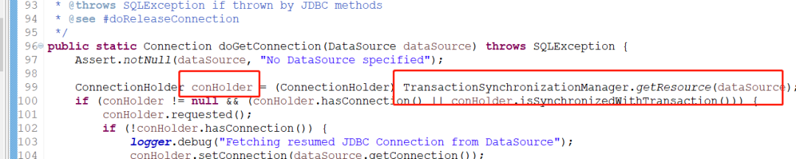

# Spring 是如何保证一个事务内获取同一个Connection


- **DataSourceTransactionManager**：适用于使用JDBC和iBatis进行数据持久化操作的情况，在定义时需要提供底层的数据源作为其属性，也就是 **DataSource**。
- **HibernateTransactionManager**：适用于使用Hibernate进行数据持久化操作的情况，与 HibernateTransactionManager 对应的是 **SessionFactory**。
- **JpaTransactionManager**：适用于使用JPA进行数据持久化操作的情况，与 JpaTransactionManager 对应的是 **EntityManagerFactory**。

## Spring 事务

Spring有声明式事务和编程式事务，声明式事务只需要提供 @Transactional的注解。然后事务的开启、提交、回滚、资源的清理都由Spring 来管理，开发人员只需要关心业务即可。

编程式事务需要使用 Spring的事务模板 TransactionTemplate或者使用直接使用底层的PlatformTransactionManager手动控制提交、回滚。

**使用 TransactionTemplate 事务管理**

````java
public class SimpleService implements Service {

  // single TransactionTemplate shared amongst all methods in this instance
  private final TransactionTemplate transactionTemplate;

  // use constructor-injection to supply the PlatformTransactionManager
  public SimpleService(PlatformTransactionManager transactionManager) {
    Assert.notNull(transactionManager, "The 'transactionManager' argument must not be null.");
    this.transactionTemplate = new TransactionTemplate(transactionManager);
  }

  public Object someServiceMethod() {
    return transactionTemplate.execute(new TransactionCallback() {

      // the code in this method executes in a transactional context
      public Object doInTransaction(TransactionStatus status) {
        updateOperation1();
        return resultOfUpdateOperation2();
      }
    });
  }
}
````

**使用PlatFormTransactionManager 的例子**

````java
DefaultTransactionDefinition def = new DefaultTransactionDefinition();
// explicitly setting the transaction name is something that can only be done programmatically
def.setName("SomeTxName");
def.setPropagationBehavior(TransactionDefinition.PROPAGATION_REQUIRED);

TransactionStatus status = txManager.getTransaction(def);
try {
  // execute your business logic here
}
catch (MyException ex) {
  txManager.rollback(status);
  throw ex;
}
txManager.commit(status);
````

**Spring事务传播级别**

- Spring事务的传播级别描述的是多个使用了@Transactional注解的方法互相调用时，Spring对事务的处理。包涵的传播级别有：
- REQUIRED, 如果当前线程已经在一个事务中，则加入该事务，否则新建一个事务。
- SUPPORT, 如果当前线程已经在一个事务中，则加入该事务，否则不使用事务。
- MANDATORY(强制的)，如果当前线程已经在一个事务中，则加入该事务，否则抛出异常。
- REQUIRES_NEW，无论如何都会创建一个新的事务，如果当前线程已经在一个事务中，则挂起当前事务，创建一个新的
- NOT_SUPPORTED，如果当前线程在一个事务中，则挂起事
- NEVER，如果当前线程在一个事务中则抛出异常。
- NESTED, 执行一个嵌套事务，有点像REQUIRED，但是有些区别，在Mysql中是采用SAVEPOINT来实现的。

要注意的是 Spring 中的 Bean 都是无状态的单例，DAO ,Connection 是单例的，同一时刻不能被多个线程共享，否则可能有线程安全问题。

org.springframework.transaction.suport.TransactionSynchronizationManager

Spring 事务管理器通过  TransactionSynchronizationManager 来解决同一个事务中不同 DAO  获得的是同一个。

看代码吧：

事务管理器的 xml 配置 里面注入了数据源 datasource

````java
 <bean id="paymentTransactionManager" class="org.springframework.jdbc.datasource.DataSourceTransactionManager"
            abstract="false" lazy-init="default" autowire="default">
        <property name="dataSource">
            <ref bean="paymentDataSource" />
        </property>
    </bean>
    <tx:annotation-driven transaction-manager="paymentTransactionManager" />
````

Update 时是怎么获取 Connection 呢?




通过 TransactionSynchronizationManager  去取 Connection

事务管理器是怎么获得 Connection 呢


**TransactionSynchronizationManager维护了ThreadLocal去取 Connection 其中 ThreadLocal 中的 key 是 datasource ，dataSource 是一致的，取到的Connection 就是一个**

org.springframework.jdbc.datasource.DataSourceTransactionManager

事务回滚也一样

````java
    protected void doRollback(DefaultTransactionStatus status) {
        DataSourceTransactionObject txObject = (DataSourceTransactionObject) status.getTransaction();
        Connection con = txObject.getConnectionHolder().getConnection();
        if (status.isDebug()) {
            logger.debug("Rolling back JDBC transaction on Connection [" + con + "]");
        }
        try {
            con.rollback();
        }
        catch (SQLException ex) {
            throw new TransactionSystemException("Could not roll back JDBC transaction", ex);
        }
    }
````

同一个连接执行不同的SQL语句 ,最后在同时rollback，或者 Comit 保证了是一个原子操作

````java
    @Override
    protected void doCommit(DefaultTransactionStatus status) {
        DataSourceTransactionObject txObject = (DataSourceTransactionObject) status.getTransaction();
        Connection con = txObject.getConnectionHolder().getConnection();
        if (status.isDebug()) {
            logger.debug("Committing JDBC transaction on Connection [" + con + "]");
        }
        try {
            con.commit();
        }
        catch (SQLException ex) {
            throw new TransactionSystemException("Could not commit JDBC transaction", ex);
        }
    }
````

> 摘自： https://cloud.tencent.com/developer/article/1584577