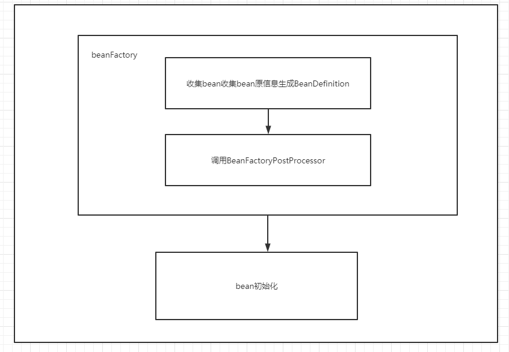
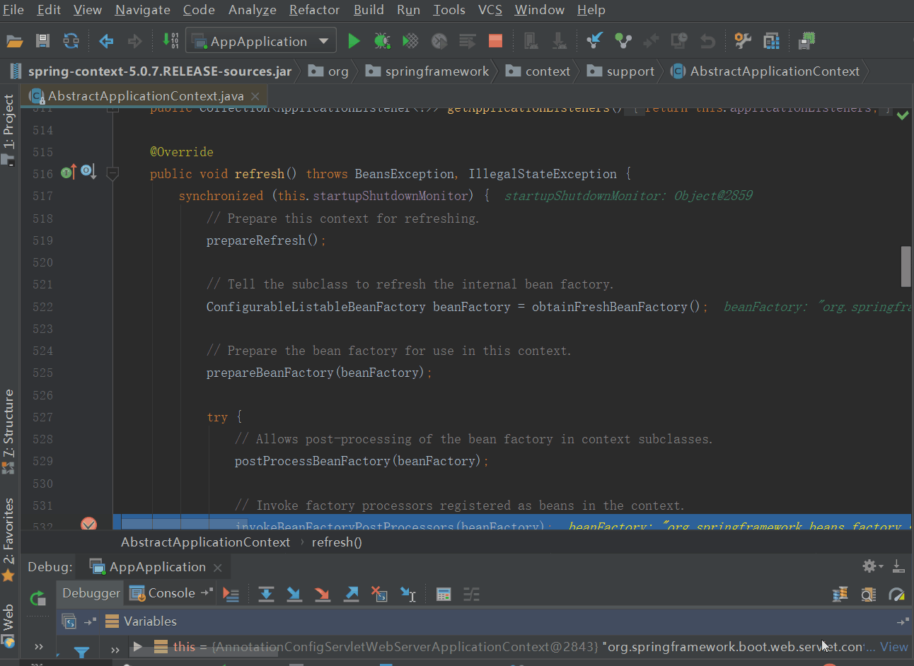

# spring之BeanFactoryPostProcessor

## 一、简介

BeanFactoryPostProcessor是BeanFactory的后置处理器，在BeanFactory初始化后被调用，此时所有的bean的BeanDefinition被定义完成并且保存到BeanFactory中了，但bean本身还没有被实例化。

既然bean没有被实例化，那么BeanFactoryPostProcessor的作用是什么呢？BeanFactoryPostProcessor是针对于bean容器的，在调用它时，BeanFactory只加载了bean的定义，还没有对它们进行实例化，所以我们可以通过对BeanFactory的处理来达到影响之后实例化bean的效果。

````java
public interface BeanFactoryPostProcessor {

	/**
	 * Modify the application context's internal bean factory after its standard
	 * initialization. All bean definitions will have been loaded, but no beans
	 * will have been instantiated yet. This allows for overriding or adding
	 * properties even to eager-initializing beans.
	 * @param beanFactory the bean factory used by the application context
	 * @throws org.springframework.beans.BeansException in case of errors
	 */
	void postProcessBeanFactory(ConfigurableListableBeanFactory beanFactory) throws BeansException;

}
````


## 二、 使用案例

既然BeanFactoryPostProcessor的作用对象是BeanFactory，那么怎么去使用BeanFactoryPostProcessor呢？我们知道Spring将bean的原信息收集到BeanDefinition中，BeanDefinition中定义了bean有哪些属性和该属性的实例化对象。因此我们可以通过实现BeanFactoryPostProcessor接口，去拿到BeanDefinition实例，然后去修改BeanDefinition。



那么怎么去使用BeanFactoryPostProcessor呢？

在spring中，我们常常通过配置占位符来给一些数据的值进行初始化，如下。

```java
<?xml version="1.0" encoding="UTF-8"?>
<beans xmlns="http://www.springframework.org/schema/beans"
    xmlns:xsi="http://www.w3.org/2001/XMLSchema-instance" xmlns:context="http://www.springframework.org/schema/context"
    xsi:schemaLocation="http://www.springframework.org/schema/beans 
     http://www.springframework.org/schema/beans/spring-beans.xsd
     http://www.springframework.org/schema/context
     http://www.springframework.org/schema/context/spring-context.xsd

    <bean id="propertyConfigurer" class="org.springframework.beans.factory.config.PropertyPlaceholderConfigurer">
        <property name="locations">
        <list>
            <value>classpath:mysqldb.properties</value>
        </list>
        </property>
    </bean>

    <bean id="dataSource" class="com.alibaba.druid.pool.DruidDataSource">
        <property name="driverClassName"value="${jdbc.driverClassName}" />
        <property name="url" value="${jdbc.url}" />
        <property name="username" value="${jdbc.username}"/>
        <property name="password"value="${jdbc.password}" />
    </bean>
</beans>
```

上述占位符的例子是BeanFactoryPostProcessor的应用之一，但这是spring提供的BeanFactoryPostProcessor拓展，不是我们自定义的；实际工作中，BeanFactoryPostProcessor的实际使用非常少，但是也是有使用用途的，比如对敏感信息的解密处理，还要我们使用占位符去注入值的时候是用的本地的配置文件，也可以考虑通过自己实现的BeanFactoryPostProcessor接口去读取远程配置文件的值。

## 三、源码验证

> 参考自： https://www.cnblogs.com/youzhibing/p/10559337.html




跟着图片一步步走查代码。可以很容易找出代码的调用链

````shell
AbstractApplicationContext.refresh()    --->

AbstractApplicationContext.invokeBeanFactoryPostProcessors(beanFactory)    --->

PostProcessorRegistrationDelegate.invokeBeanFactoryPostProcessors(beanFactory, getBeanFactoryPostProcessors())   --->

PostProcessorRegistrationDelegate.invokeBeanFactoryPostProcessors(priorityOrderedPostProcessors, beanFactory)()
````

以上，我们可以得出BeanFactoryPostProcessor会在spring初始化的时候被调用，而此时BeanDefinition信息已经被收集并被实例化，但是bean没有被实例化。至此，我们也就验证了本文开头BeanFactoryPostProcessor是BeanFactory的后置处理器的结论。
