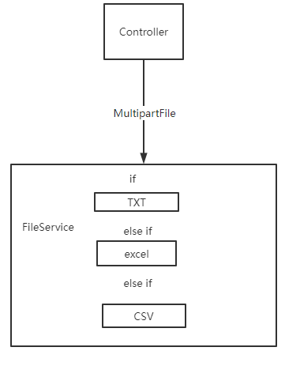
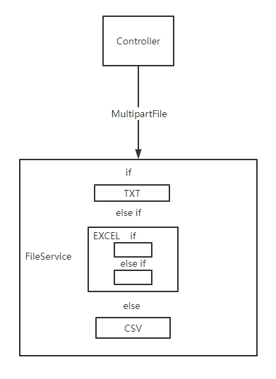
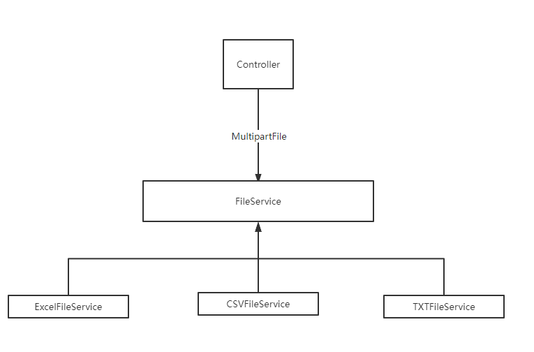
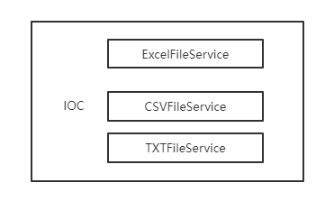

# Spring根据不同需求切换到同一接口的不同实现类

## 背景

在我们开发过程中常常会将同一个类型的业务逻辑都放在同一个service中去实现。比如我们在对不同文件进行解析的时候，就可能将文件流放到一个sercice中去处理了。



如上图，从实现上来说，这样的实现逻辑已经基本上满足业务需求了，即使是要对新的文件类型做处理，也只需要在FileService中多添加一个if else就好了。

## 问题

对于文件处理的需求，上面的处理逻辑已经可以用很久了，但为什么还会出现问题呢？

我们设想一下这样的场景，当开发者开发完文件处理的需求后，然后就被叫去其他的事情了。过来大半年，老板跑过来说，“嘿，小伙子，我们现在需要对excel和csv文件分别做特殊处理，excel的运算逻辑要改一改，balabal之类”。当我们遇到这种情况的时候，是不是会感到头大呢，当初自己写代码的时候是怎么想的都已经忘光了，现在又要改以前的逻辑，就不得不又把以前的FileService看一遍，然后其已有的代码基础上进行特殊处理，又添加了许许多多的if else。



就这样屎山越堆越高，也越来越臭。到最后负重难返，遇到新需求的时候，就只能捏着鼻子继续往上面堆东西。

## 解决办法

既然屎山的形成总是不可避免，那么我们可以将一开始就将大的屎山拆成几堆小的屎山。像这样：



不过此时我们就需要去解决spring中，对使用同一接口的不同实现的时候，动态切换实现类的问题。下面是本文给出的解决方法

## spring之同一接口的不同实现的动态切换

解决方法很简单，从spring的IOC去找到FileService接口的所有实现类，然后再拿到我们需要的实现类就行了。



创建工具类BeanSearchUtils.java

```java
@Component
public class BeanSearchUtils implements ApplicationContextAware {

    private ApplicationContext applicationContext;

    @Override
    public void setApplicationContext(ApplicationContext applicationContext) throws BeansException {
        this.applicationContext = applicationContext;
    }

    public <T> T getServiceImpl(Class<? super T> serviceInterf,Class<T> serviceImpl){
        Map<String, ? super T> beansOfType = applicationContext.getBeansOfType(parent);
        for (Map.Entry<String, ? super T> entry : beansOfType.entrySet()){
            Object value = entry.getValue();
            if (value.getClass().equals(impl)){
                return (T)value;
            }
        }
        return null;
    }
}
```

BeanSearchUtils工具实现了ApplicationContextAware接口，用于获取spring的ApplicationContext。通过该接口我们就能拿到spring IOC中的bean了。

BeanSearchUtils.getServiceImpl方法的serviceInterf参数指定接口类，serviceImpl参数指定接口的实现类。

然后我们就可以像下面这样使用BeanSearchUtils。

````java
@Autowired
private BeanSearchUtils beanSearchUtils;

FileService fileservice = beanSearchUtils.(FileService.class,ExcelFileService.class);
````

## 总结

在编码的时候，如果我们能停下来花半个小时想好如何去实现功能，这样不仅可能事半功倍，也可能为后期的维护带来许多遍历。