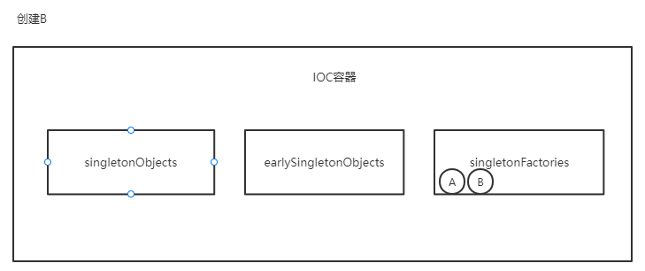

# Spring Bean 循环依赖为什么需要三级缓存

> 这里指的是单例的、非构造依赖的循环引用。很多人都知道Spring用了三层缓存来解决循环依赖，但是不知道其原因，为什么是三级缓存？二级缓存不行吗？一级缓存不可以 ？

### 问题分析

当使用spring IOC管理bean的时候，如果存在对象之间的循环引用就会出现无限递归创建bean导致程序stack over。


### 三级缓存

Spring 解决循环依赖的核心就是提前暴露对象，而提前暴露的对象就是放置于第二级缓存中。缓存的底层都是Map，至于它们属于第几层是由Spring获取数据顺序以及其作用来表现的。

三级缓存的说明：

| 名称                    | 作用                                                         |
| ----------------------- | ------------------------------------------------------------ |
| `singletonObjects`      | 一级缓存，存放完整的 Bean。                                  |
| `earlySingletonObjects` | 二级缓存，存放提前暴露的Bean，Bean 是不完整的，未完成属性注入和执行 初始化（init） 方法。 |
| `singletonFactories`    | 三级缓存，存放的是 Bean 工厂，主要是生产 Bean，存放到二级缓存中。 |

在`DefaultSingletonBeanRegistry`类中：

```java
	/** Cache of singleton objects: bean name to bean instance. */
	private final Map<String, Object> singletonObjects = new ConcurrentHashMap<>(256);

	/** Cache of singleton factories: bean name to ObjectFactory. */
	private final Map<String, ObjectFactory<?>> singletonFactories = new HashMap<>(16);

	/** Cache of early singleton objects: bean name to bean instance. */
	private final Map<String, Object> earlySingletonObjects = new ConcurrentHashMap<>(16);
```

### 为什么使用三级缓存？

#### 第一 先说说第一级缓存`singletonObjects`

1.先说一级缓存`singletonObjects`。实际上，一级依赖已经可以解决循环依赖的问题，假设两个beanA和beanB相互依赖，beanA被实例化后，放入一级缓存，即使没有进行初始化，但是beanA的引用已经创建（栈到堆的引用已经确定），其他依赖beanB已经可以持有beanA的引用，但是这个bean在没有初始化完成前，其内存（堆）里的字段、方法等还不能正常使用，but，这并不影响对象之间引用持有；这个时候beanA依赖的beanB实例化，beanB可以顺利拿到beanA的引用，完成beanB的实例化与初始化，并放入一级缓存，在beanB完成创建后，beanA通过缓存顺利拿到beanB的引用，至此，循环依赖只需一层缓存就能完成。

2.一级缓存的关键点在与：bean实例化与初始化的分离。从JVM的角度，实例化后，对象已经存在，其内的属性都是初始默认值，只有在初始化后才会赋值，以及持有其他对象的引用。通过这个特性，在实例化后，我们就可以将对象的引用放入缓存交给需要引用依赖的其他对象，这个过程就是提前暴露。

#### 第二 说说第三级缓存`singletonFactories`

1.上述我们通过一级缓存已经拿到的对象有什么问题？

根本问题就是，我们拿到的是bean的原始引用，如果我们需要的是bean的代理对象怎么办？Spring里充斥了大量的动态代理模式的架构，典型的AOP就是动态代理模式实现的，再比如我们经常使用的配置类注解`@Configuration`在缺省情况下（full mode），其内的所有@Bean都是处于动态代理模式，除非手动指定`proxyBeanMethods = false`将配置转成简略模式（lite mode）。

2.所以，Spring在bean实例化后，将原始bean放入第三级缓存singletonFactories中，第三级缓存里实际存入的是ObjectFactory接口签名的回调实现。

```java
# 函数签名
addSingletonFactory(String beanName, ObjectFactory<?> singletonFactory)
    
# 具体实现由回调决定    
addSingletonFactory(beanName, () -> getEarlyBeanReference(beanName, mbd, bean));
```

那么如果有动态代理的需求，里面可以埋点进行处理，将原始bean包装后返回。

```java
	protected Object getEarlyBeanReference(String beanName, RootBeanDefinition mbd, Object bean) {
		Object exposedObject = bean;
		if (!mbd.isSynthetic() && hasInstantiationAwareBeanPostProcessors()) {
			for (BeanPostProcessor bp : getBeanPostProcessors()) {
				if (bp instanceof SmartInstantiationAwareBeanPostProcessor) {
					SmartInstantiationAwareBeanPostProcessor ibp = (SmartInstantiationAwareBeanPostProcessor) bp;
					exposedObject = ibp.getEarlyBeanReference(exposedObject, beanName);
				}
			}
		}
		return exposedObject;
	}
```

3.通过第三级缓存我们可以拿到可能经过包装的对象，解决对象代理封装的问题。

#### 第三 说说第二级缓存`earlySingletonObjects`

1.为什么需要`earlySingletonObjects`这个二级缓存？并且，如果只有一个缓存的情况下，为什么不直接使用`singletonFactories`这个缓存，即可实现代理又可以缓存数据。

2.从软件设计角度考虑，三个缓存代表三种不同的职责，根据单一职责原理，从设计角度就需分离三种职责的缓存，所以形成三级缓存的状态。

3、再次说说三级缓存的划分及其作用。

一级缓存`singletonObjects`是完整的bean，它可以被外界任意使用，并且不会有歧义。

二级缓存`earlySingletonObjects`是不完整的bean，没有完成初始化，它与`singletonObjects`的分离主要是职责的分离以及边界划分，可以试想一个Map缓存里既有完整可使用的bean，也有不完整的，只能持有引用的bean，在复杂度很高的架构中，很容易出现歧义，并带来一些不可预知的错误。

三级缓存`singletonFactories`，其职责就是包装一个bean，有回调逻辑，所以它的作用非常清晰，并且只能处于第三层。

在实际使用中，要获取一个bean，先从一级缓存一直查找到三级缓存，缓存bean的时候是从三级到一级的顺序保存，并且缓存bean的过程中，三个缓存都是互斥的，只会保持bean在一个缓存中，而且，最终都会在一级缓存中。


### 图解循环依赖处理过程

1. 循环依赖大致分为10个阶段，我们将一一进行讲解。
2. 实例化 A，此时 A 还未完成属性填充和初始化方法（@PostConstruct）的执行，A 只是一个半成品。为 A 创建一个 Bean 工厂，并放入到  singletonFactories 中。
3. 发现 A 需要注入 B 对象，但是一级、二级、三级缓存均为发现对象 B。
4. 实例化 B，此时 B 还未完成属性填充和初始化方法（@PostConstruct）的执行，B 只是一个半成品。
5. 为 B 创建一个 Bean 工厂，并放入到  singletonFactories 中。
6. 发现 B 需要注入 A 对象，此时在一级、二级未发现对象 A，但是在三级缓存中发现了对象 A，从三级缓存中得到对象 A，并将对象 A 放入二级缓存中，同时删除三级缓存中的对象 A。（注意，此时的 A 还是一个半成品，并没有完成属性填充和执行初始化方法）
7. 将对象 A 注入到对象 B 中。
8. 对象 B 完成属性填充，执行初始化方法，并放入到一级缓存中，同时删除二级缓存中的对象 B。（此时对象 B 已经是一个成品）
9. 对象 A 得到对象 B，将对象 B 注入到对象 A 中。（对象 A 得到的是一个完整的对象 B）
10. 对象 A 完成属性填充，执行初始化方法，并放入到一级缓存中，同时删除二级缓存中的对象 A。


下面我们只以A、B之间的循环依赖来举例，这样也方便理解。


1. 实例化A，此时A未进行属性填充以及初始化方法调用，A 只是一个半成品。
2. 为 A 创建一个 Bean 工厂，并放入到 singletonFactories 中。

以上两步的代码的代码如下：

AbstractAutowireCapableBeanFactory.createBean

````java
 protected Object doCreateBean(String beanName, BeanDefinition beanDefinition, Object[] args) {
        Object bean = null;
        try {
            // 实例化 Bean
            bean = createBeanInstance(beanDefinition, beanName, args);
            // 处理循环依赖，将实例化后的Bean对象提前放入缓存中暴露出来
            if (beanDefinition.isSingleton()) {
                Object finalBean = bean;
                addSingletonFactory(beanName, () -> getEarlyBeanReference(beanName, beanDefinition, finalBean));
            }
            //省略n行代码
        } catch (Exception e) {
            throw new BeansException("Instantiation of bean failed", e);
        }
     //省略n行代码
    }
````


此时A将自己以FactoryObject的方式提前暴露到singletonFactories中

3. 发现 A 需要注入 B 对象，但是一级、二级、三级缓存均为发现对象 B，则尝试创建B

    protected void applyPropertyValues(String beanName, Object bean, BeanDefinition beanDefinition) {
        try {
            PropertyValues propertyValues = beanDefinition.getPropertyValues();
            for (PropertyValue propertyValue : propertyValues.getPropertyValues()) {
                
                if (value instanceof BeanReference) {
                    // A 依赖 B，获取 B 的实例化
                    BeanReference beanReference = (BeanReference) value;
                    value = getBean(beanReference.getBeanName());
                }
                //省略n行代码
            }
        } catch (Exception e) {
            throw new BeansException("Error setting property values：" + beanName);
        }
    }

这个getBean方法会尝试去IOC容器中拿去到B对象，如果没有B对象则会创建B。

4. 实例化 B，此时 B 还未完成属性填充和初始化方法（@PostConstruct）的执行，B 只是一个半成品。
5. 为 B 创建一个 Bean 工厂，并放入到 singletonFactories 中。



6. 发现 B 需要注入 A 对象，此时在一级、二级未发现对象 A，但是在三级缓存中发现了对象 A，从三级缓存中得到对象 A，并将对象 A 放入二级缓存中，同时删除三级缓存中的对象 A。（注意，此时的 A 还是一个半成品，并没有完成属性填充和执行初始化方法）

DefaultSingletonBeanRegistry.getSingleton

````java
    public Object getSingleton(String beanName) {
        Object singleBean = singletonObjects.get(beanName);
        if (null == singleBean){
            singleBean = earlySingletonObjects.get(beanName);

            if (singleBean == null){
                //在singletonFactories找到了A
                ObjectFactory<?> singleBeanFactory = singletonFactories.get(beanName);
                if (singleBeanFactory != null){
                    singleBean = singleBeanFactory.getObject();
                    // 把三级缓存中的代理对象中的真实对象获取出来，放入二级缓存中,提前暴露未未填充属性的bean对象
                    earlySingletonObjects.put(beanName, singleBean);
                    singletonFactories.remove(beanName);
                }
            }
        }
        return singleBean;
    }
````

7. 将对象 A 注入到对象 B 中。


8. 对象 B 完成属性填充，执行初始化方法，并放入到一级缓存中，同时删除二级缓存中的对象 B。（此时对象 B 已经是一个成品）

AbstractAutowireCapableBeanFactory.doCreateBean

````java
  protected Object doCreateBean(String beanName, BeanDefinition beanDefinition, Object[] args) {
        Object bean = null;
        try {
            
            // 给 Bean 填充属性
            applyPropertyValues(beanName, bean, beanDefinition);
          
        } catch (Exception e) {
            throw new BeansException("Instantiation of bean failed", e);
        }

        if (beanDefinition.isSingleton()) {
            // 从容器中获取到B
            exposedObject = getSingleton(beanName);
            //将获取到的B放入到singletonObjects中去
            registerSingleton(beanName, exposedObject);
        }
        return exposedObject;
      
    }
````


9. 对象 A 得到对象 B，将对象 B 注入到对象 A 中。（对象 A 得到的是一个完整的对象 B）


10. 对象 A 完成属性填充，执行初始化方法，并放入到一级缓存中，同时删除二级缓存中的对象 A。


自此，spring处理bean的循环依赖的过程完毕。可以看到不用状态的bean是处于不同Object容器中去的，然后创建完毕，可以直接使用的bean最后都会落到singletonObjects中去，这也体现了整个IOC模型的责任划分。

> 参考：https://juejin.cn/post/6882266649509298189