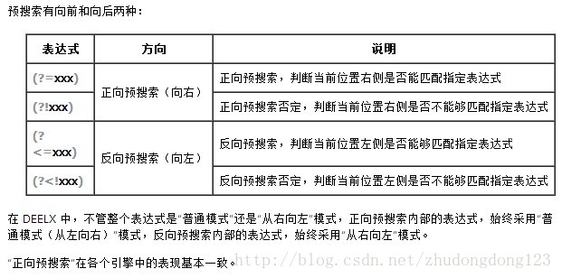

## 预搜索与反向搜索

**1.a(?=b)正向搜索，找出出现a并且出现a位置后面是b的符合a字符 例如 fgabdff会找标红的a**

**2.a(?<=b)反向搜索，找出出现a并且出现a位置前面是符合a的字符 例如 affgfgabdff是找不到任何元素的，因为会从a位置往前找，a自己本省就是往前的第一个元素，所以找不到。a(?<=a)这样写会找出所有的a，例如affgfgabdff会找出标红的a。**

**3.a(?!b)正向搜索，找出出现a并且a后面不是b的符合a字符 例如affgfgabdff会找出标红的a。**

**4.a(?例如affgfgabdff不会找到任何符合的字符，因为从出现a的位置找，并且包括a，所以往前找第一个是a，不符合不等于a的条件。**

### 总结

**就是先找到a，然后根据a的位置（包括a的位置）进行向前或者向后的预搜索,感觉类似于if语句中的&&**

