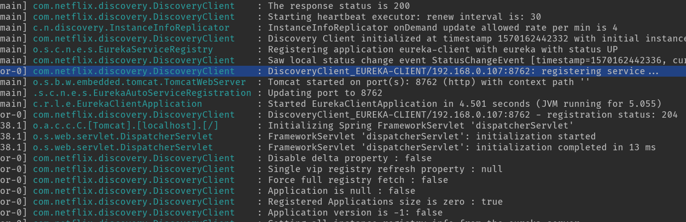

# SpringCloudEureka之Client注册

Eureka Client 是一个Java 客户端，用于简化与Eureka Server的交互，客户端同时也具备一个内置的、使用轮询负载算法的负载均衡器。

在应用启动后，将会向Eureka Server发送心跳(默认周期为30秒)，如果Eureka Server在多个心跳周期没有收到某个节点的心跳，Eureka Server 将会从服务注册表中把这个服务节点移除(默认90秒)。

Eureka Client具有缓存的机制，即使所有的Eureka Server 都挂掉的话，客户端依然可以利用缓存中的信息消费其它服务的API。下面我们一起来看客户端相关操作

#### 1.从启动类入手

我们还是和分析 Eureka Server 源码一样，从启动类的`@EnableDiscoveryClient`注解入手看调用流程。

进入 EnableDiscoveryClient 之后，通过注释知道它的作用是为了激活 DiscoveryClient：


首先是在类头使用了 import 注解引入了：EnableDiscoveryClientImportSelector。该类的主要作用是实例化：AutoServiceRegistrationConfiguration。

```java
Copy@Order(Ordered.LOWEST_PRECEDENCE - 100)
public class EnableDiscoveryClientImportSelector
		extends SpringFactoryImportSelector<EnableDiscoveryClient> {

	@Override
	public String[] selectImports(AnnotationMetadata metadata) {
         //调用父类的方法,拿到通过父类方法要注入的全路径类名数组
		String[] imports = super.selectImports(metadata);
		//获得该注解(@EnableDiscoveryClient)的所有属性参数
		AnnotationAttributes attributes = AnnotationAttributes.fromMap(
				metadata.getAnnotationAttributes(getAnnotationClass().getName(), true));
		 //获得属性autoRegister的值,该值默认是true的
		boolean autoRegister = attributes.getBoolean("autoRegister");
		//根据注解配置来判断是否要实例化下面的那个自动配置类
		if (autoRegister) {
			List<String> importsList = new ArrayList<>(Arrays.asList(imports));
			importsList.add("org.springframework.cloud.client.serviceregistry.AutoServiceRegistrationConfiguration");
			imports = importsList.toArray(new String[0]);
		} else {
			Environment env = getEnvironment();
			if(ConfigurableEnvironment.class.isInstance(env)) {
				ConfigurableEnvironment configEnv = (ConfigurableEnvironment)env;
				LinkedHashMap<String, Object> map = new LinkedHashMap<>();
				map.put("spring.cloud.service-registry.auto-registration.enabled", false);
				MapPropertySource propertySource = new MapPropertySource(
						"springCloudDiscoveryClient", map);
				configEnv.getPropertySources().addLast(propertySource);
			}

		}

		return imports;
	}

	@Override
	protected boolean isEnabled() {
		return getEnvironment().getProperty(
				"spring.cloud.discovery.enabled", Boolean.class, Boolean.TRUE);
	}

	@Override
	protected boolean hasDefaultFactory() {
		return true;
	}

}
```

这里最终的目的是想实例化：AutoServiceRegistrationConfiguration，我们来看他做了什么：

```java
Copy@Configuration
@Import(AutoServiceRegistrationConfiguration.class)
@ConditionalOnProperty(value = "spring.cloud.service-registry.auto-registration.enabled", matchIfMissing = true)
public class AutoServiceRegistrationAutoConfiguration {

	@Autowired(required = false)
	private AutoServiceRegistration autoServiceRegistration;

	@Autowired
	private AutoServiceRegistrationProperties properties;

	@PostConstruct
	protected void init() {
		if (autoServiceRegistration == null && this.properties.isFailFast()) {
			throw new IllegalStateException("Auto Service Registration has been requested, but there is no AutoServiceRegistration bean");
		}
	}
}
```

从这里看主要目的是为了实例化：AutoServiceRegistration，AutoServiceRegistrationProperties这两个类。那么初始化这两个bean的作用是什么呢，查看调用 的地方：

```java
Copy@Configuration
@EnableConfigurationProperties
@ConditionalOnClass(EurekaClientConfig.class)
@Import(DiscoveryClientOptionalArgsConfiguration.class)
@ConditionalOnBean(EurekaDiscoveryClientConfiguration.Marker.class)
@ConditionalOnProperty(value = "eureka.client.enabled", matchIfMissing = true)
@AutoConfigureBefore({ NoopDiscoveryClientAutoConfiguration.class,
		CommonsClientAutoConfiguration.class, ServiceRegistryAutoConfiguration.class })
@AutoConfigureAfter(name = {"org.springframework.cloud.autoconfigure.RefreshAutoConfiguration",
		"org.springframework.cloud.netflix.eureka.EurekaDiscoveryClientConfiguration",
		"org.springframework.cloud.client.serviceregistry.AutoServiceRegistrationAutoConfiguration"})
public class EurekaClientAutoConfiguration {
    ......
    ......
    ......
    @Bean
	@ConditionalOnBean(AutoServiceRegistrationProperties.class)
	@ConditionalOnProperty(value = "spring.cloud.service-registry.auto-registration.enabled", matchIfMissing = true)
	public EurekaRegistration eurekaRegistration(EurekaClient eurekaClient, CloudEurekaInstanceConfig instanceConfig, ApplicationInfoManager applicationInfoManager, ObjectProvider<HealthCheckHandler> healthCheckHandler) {
		return EurekaRegistration.builder(instanceConfig)
				.with(applicationInfoManager)
				.with(eurekaClient)
				.with(healthCheckHandler)
				.build();
	}

	@Bean
	@ConditionalOnBean(AutoServiceRegistrationProperties.class)
	@ConditionalOnProperty(value = "spring.cloud.service-registry.auto-registration.enabled", matchIfMissing = true)
	public EurekaAutoServiceRegistration eurekaAutoServiceRegistration(ApplicationContext context, EurekaServiceRegistry registry, EurekaRegistration registration) {
		return new EurekaAutoServiceRegistration(context, registry, registration);
	}   
    ......
    ......
    ......
}
```

原因是在这里实例化bean的时候被做为前置条件。

EurekaClientAutoConfiguration 算是到目前为止比较重要的一个类，主要做的事情包括：

1. 注册 EurekaClientConfigBean ，初始化client端配置信息；
2. 注册 EurekaInstanceConfigBean ，初始化客户端实例信息；
3. 初始化 EurekaRegistration，EurekaServiceRegistry，EurekaAutoServiceRegistration实现Eureka服务自动注册；
4. 初始化 EurekaClient ，ApplicationInfoManager。EurekaClient 的默认实现是 DiscoveryClient，是我们接下来要分析的重点；
5. 初始化 EurekaHealthIndicator，为`/health` 端点提供Eureka相关信息，主要有Status当前实例状态和applications服务列表。

继续看 EurekaClientAutoConfiguration 又在哪里被使用：

```java
Copy@ConditionalOnClass(ConfigServicePropertySourceLocator.class)
@ConditionalOnProperty(value = "spring.cloud.config.discovery.enabled", matchIfMissing = false)
@Configuration
@Import({ EurekaDiscoveryClientConfiguration.class, // this emulates @EnableDiscoveryClient, the import selector doesn't run before the bootstrap phase
		EurekaClientAutoConfiguration.class })
public class EurekaDiscoveryClientConfigServiceBootstrapConfiguration {
}
```

在 EurekaDiscoveryClientConfigServiceBootstrapConfiguration 类中被作为注入的对象。

而 EurekaDiscoveryClientConfigServiceBootstrapConfiguration 被引用的分地方就比较特殊，被配置在配置文件中。

spring.factories

```xml
Copyorg.springframework.cloud.bootstrap.BootstrapConfiguration=\
org.springframework.cloud.netflix.eureka.config.EurekaDiscoveryClientConfigServiceBootstrapConfiguration
```

这个配置的Key部分对应着一个注解类 BootstrapConfiguration：

```java
Copy@Target(ElementType.TYPE)
@Retention(RetentionPolicy.RUNTIME)
@Documented
public @interface BootstrapConfiguration {

	/**
	 * Exclude specific auto-configuration classes such that they will never be applied.
	 */
	Class<?>[] exclude() default {};

}
```

他被使用的地方是：BootstrapApplicationListener 的 164行，在这里拿到类的全路径之后，186行进行加载类。

```java
Copypublic class BootstrapApplicationListener
		implements ApplicationListener<ApplicationEnvironmentPreparedEvent>, Ordered {
    
    ......
    @Override
	public void onApplicationEvent(ApplicationEnvironmentPreparedEvent event) {
		ConfigurableEnvironment environment = event.getEnvironment();
		......
		ConfigurableApplicationContext context = null;
		String configName = environment
				.resolvePlaceholders("${spring.cloud.bootstrap.name:bootstrap}");
		for (ApplicationContextInitializer<?> initializer : event.getSpringApplication()
				.getInitializers()) {
			if (initializer instanceof ParentContextApplicationContextInitializer) {
				context = findBootstrapContext(
						(ParentContextApplicationContextInitializer) initializer,
						configName);
			}
		}
		if (context == null) {
            //在这里被调用
			context = bootstrapServiceContext(environment, event.getSpringApplication(),
					configName);
		}
		apply(context, event.getSpringApplication(), environment);
	}
    
    private ConfigurableApplicationContext bootstrapServiceContext(
        ConfigurableEnvironment environment, final SpringApplication application,
        String configName) {
        StandardEnvironment bootstrapEnvironment = new StandardEnvironment();
        MutablePropertySources bootstrapProperties = bootstrapEnvironment
            .getPropertySources();
        for (PropertySource<?> source : bootstrapProperties) {
            bootstrapProperties.remove(source.getName());
        }
        String configLocation = environment
            .resolvePlaceholders("${spring.cloud.bootstrap.location:}");
        Map<String, Object> bootstrapMap = new HashMap<>();
        bootstrapMap.put("spring.config.name", configName);
        // if an app (or test) uses spring.main.web-application-type=reactive, bootstrap will fail
        // force the environment to use none, because if though it is set below in the builder
        // the environment overrides it
        bootstrapMap.put("spring.main.web-application-type", "none");
        if (StringUtils.hasText(configLocation)) {
            bootstrapMap.put("spring.config.location", configLocation);
        }
        bootstrapProperties.addFirst(
            new MapPropertySource(BOOTSTRAP_PROPERTY_SOURCE_NAME, bootstrapMap));
        for (PropertySource<?> source : environment.getPropertySources()) {
            if (source instanceof StubPropertySource) {
                continue;
            }
            bootstrapProperties.addLast(source);
        }
        ClassLoader classLoader = Thread.currentThread().getContextClassLoader();
        // 在这里扫描BootstrapConfiguration注解
        List<String> names = new ArrayList<>(SpringFactoriesLoader
                                             .loadFactoryNames(BootstrapConfiguration.class, classLoader));
        for (String name : StringUtils.commaDelimitedListToStringArray(
            environment.getProperty("spring.cloud.bootstrap.sources", ""))) {
            names.add(name);
        }
        // TODO: is it possible or sensible to share a ResourceLoader?
        SpringApplicationBuilder builder = new SpringApplicationBuilder()
            .profiles(environment.getActiveProfiles()).bannerMode(Mode.OFF)
            .environment(bootstrapEnvironment)
            // Don't use the default properties in this builder
            .registerShutdownHook(false).logStartupInfo(false)
            .web(WebApplicationType.NONE);
        if (environment.getPropertySources().contains("refreshArgs")) {
            // If we are doing a context refresh, really we only want to refresh the
            // Environment, and there are some toxic listeners (like the
            // LoggingApplicationListener) that affect global static state, so we need a
            // way to switch those off.
            builder.application()
                .setListeners(filterListeners(builder.application().getListeners()));
        }
        List<Class<?>> sources = new ArrayList<>();
        for (String name : names) {
            Class<?> cls = ClassUtils.resolveClassName(name, null);
            try {
                cls.getDeclaredAnnotations();
            }
            catch (Exception e) {
                continue;
            }
            sources.add(cls);
        }
        AnnotationAwareOrderComparator.sort(sources);
        builder.sources(sources.toArray(new Class[sources.size()]));
        final ConfigurableApplicationContext context = builder.run();
        // gh-214 using spring.application.name=bootstrap to set the context id via
        // `ContextIdApplicationContextInitializer` prevents apps from getting the actual
        // spring.application.name
        // during the bootstrap phase.
        context.setId("bootstrap");
        // Make the bootstrap context a parent of the app context
        addAncestorInitializer(application, context);
        // It only has properties in it now that we don't want in the parent so remove
        // it (and it will be added back later)
        bootstrapProperties.remove(BOOTSTRAP_PROPERTY_SOURCE_NAME);
        mergeDefaultProperties(environment.getPropertySources(), bootstrapProperties);
        return context;
    }
    
    
    ......
    ......
      
}
```

BootstrapApplicationListener 实现了ApplicationEnvironmentPreparedEvent，作为监听器在项目启动的时候被加载。Spring根据应用启动的过程,提供了四种事件供我们使用:

- **ApplicationStartedEvent** ：Spring Boot启动开始时执行的事件；
- **ApplicationEnvironmentPreparedEvent**：Spring Boot 对应Enviroment已经准备完毕，但此时上下文context还没有创建；
- **ApplicationPreparedEvent**：Spring Boot 上下文context创建完成，但此时spring中的bean是没有完全加载完成的；
- **ApplicationFailedEvent**：Spring Boot 启动异常时执行事件。

即这里的BootstrapApplicationListener 是在项目启动加载环境变量完成，还没有创建bean的时候去加载的。

分析到这里，我们把整个的EnableDiscoveryClient注解的初始化链路都走了一遍。大致流程如下：


总结上面分析的部分主要两个作用：

1. 初始化配置文件；
2. 激活 DiscoveryClient。

下面就开始分析DiscoveryClient的作用。

#### 2. DiscoveryClient[#](https://www.cnblogs.com/rickiyang/p/11802434.html#2394216788)

启动客户端的时候查看启动日志你会看到服务注册也是从 DiscoveryClient 类中发出的：



足以见得这个类在服务注册过程中应该做了一些重要的事情。下面一起来分析一下具体实现。

##### 2.1 服务注册

DiscoveryClient 是一个接口，继续观看它的实现类，可以看到每个实现类中都有一个：DESCRIPTION字段，这个字段明确描述了当前类的作用。

1. EurekaDiscoveryClient：client 的主要实现逻辑类；
2. CompositeDiscoveryClient：会装载别的服务注册客户端，顺序查找；
3. NoopDiscoveryClient：已经被废弃；
4. SimpleDiscoveryClient：具体的服务实例从 SimpleDiscoveryProperties 配置中获取。

从描述上看 EurekaDiscoveryClient 是 client 的主要实现类。而在 EurekaDiscoveryClient 中，获取client实例主要是从 EurekaClient 中查找的：

```java
Copy@Override
public List<ServiceInstance> getInstances(String serviceId) {
    List<InstanceInfo> infos = this.eurekaClient.getInstancesByVipAddress(serviceId,false);
    List<ServiceInstance> instances = new ArrayList<>();
    for (InstanceInfo info : infos) {
        instances.add(new EurekaServiceInstance(info));
    }
    return instances;
}
```

DiscoveryClient 是 EurekaClient 的唯一实现类，他有一个很重要的构造方法：

```java
Copy@Inject
DiscoveryClient(ApplicationInfoManager applicationInfoManager, EurekaClientConfig config, AbstractDiscoveryClientOptionalArgs args,Provider<BackupRegistry> backupRegistryProvider) {
    if (args != null) {
        this.healthCheckHandlerProvider = args.healthCheckHandlerProvider;
        this.healthCheckCallbackProvider = args.healthCheckCallbackProvider;
        this.eventListeners.addAll(args.getEventListeners());
        this.preRegistrationHandler = args.preRegistrationHandler;
    } else {
        this.healthCheckCallbackProvider = null;
        this.healthCheckHandlerProvider = null;
        this.preRegistrationHandler = null;
    }

    this.applicationInfoManager = applicationInfoManager;
    InstanceInfo myInfo = applicationInfoManager.getInfo();

    clientConfig = config;
    staticClientConfig = clientConfig;
    transportConfig = config.getTransportConfig();
    instanceInfo = myInfo;
    if (myInfo != null) {
        appPathIdentifier = instanceInfo.getAppName() + "/" + instanceInfo.getId();
    } else {
        logger.warn("Setting instanceInfo to a passed in null value");
    }

    this.backupRegistryProvider = backupRegistryProvider;

    this.urlRandomizer = new EndpointUtils.InstanceInfoBasedUrlRandomizer(instanceInfo);
    localRegionApps.set(new Applications());

    fetchRegistryGeneration = new AtomicLong(0);

    remoteRegionsToFetch = new AtomicReference<String>(clientConfig.fetchRegistryForRemoteRegions());
    remoteRegionsRef = new AtomicReference<>(remoteRegionsToFetch.get() == null ? null : remoteRegionsToFetch.get().split(","));
	//上面主要是初始化一些参数
    //如果 shouldFetchRegistry= true，注册监控
    if (config.shouldFetchRegistry()) {
        this.registryStalenessMonitor = new ThresholdLevelsMetric(this, METRIC_REGISTRY_PREFIX + "lastUpdateSec_", new long[]{15L, 30L, 60L, 120L, 240L, 480L});
    } else {
        this.registryStalenessMonitor = ThresholdLevelsMetric.NO_OP_METRIC;
    }
	//如果shouldRegisterWithEureka=true，注册监控
    if (config.shouldRegisterWithEureka()) {
        this.heartbeatStalenessMonitor = new ThresholdLevelsMetric(this, METRIC_REGISTRATION_PREFIX + "lastHeartbeatSec_", new long[]{15L, 30L, 60L, 120L, 240L, 480L});
    } else {
        this.heartbeatStalenessMonitor = ThresholdLevelsMetric.NO_OP_METRIC;
    }

    logger.info("Initializing Eureka in region {}", clientConfig.getRegion());
	//如果shouldRegisterWithEureka = false && shouldFetchRegistry=false
    //就不做初始化的工作，直接返回
    if (!config.shouldRegisterWithEureka() && !config.shouldFetchRegistry()) {
        logger.info("Client configured to neither register nor query for data.");
        scheduler = null;
        heartbeatExecutor = null;
        cacheRefreshExecutor = null;
        eurekaTransport = null;
        instanceRegionChecker = new InstanceRegionChecker(new PropertyBasedAzToRegionMapper(config), clientConfig.getRegion());

        // This is a bit of hack to allow for existing code using DiscoveryManager.getInstance()
        // to work with DI'd DiscoveryClient
        DiscoveryManager.getInstance().setDiscoveryClient(this);
        DiscoveryManager.getInstance().setEurekaClientConfig(config);

        initTimestampMs = System.currentTimeMillis();
        logger.info("Discovery Client initialized at timestamp {} with initial instances count: {}",
                    initTimestampMs, this.getApplications().size());

        return;  // no need to setup up an network tasks and we are done
    }
	//从这里开始创建各种任务的线程池
    try {
        // default size of 2 - 1 each for heartbeat and cacheRefresh
        //创建定时线程池，线程数量为2个，分别用来维持心跳连接和刷新其他eureka client实例缓存
        scheduler = Executors.newScheduledThreadPool(2,
                                                     new ThreadFactoryBuilder()
                                                     .setNameFormat("DiscoveryClient-%d")
                                                     .setDaemon(true)
                                                     .build());
		//创建一个线程池，线程池大小默认为2个，用来维持心跳连接
        heartbeatExecutor = new ThreadPoolExecutor(
            1, clientConfig.getHeartbeatExecutorThreadPoolSize(), 0, TimeUnit.SECONDS,
            new SynchronousQueue<Runnable>(),
            new ThreadFactoryBuilder()
            .setNameFormat("DiscoveryClient-HeartbeatExecutor-%d")
            .setDaemon(true)
            .build()
        );  // use direct handoff
		//创建一个线程池，线程池大小默认为2个，用来刷新其他eureka client实例缓存
        cacheRefreshExecutor = new ThreadPoolExecutor(
            1, clientConfig.getCacheRefreshExecutorThreadPoolSize(), 0, TimeUnit.SECONDS,
            new SynchronousQueue<Runnable>(),
            new ThreadFactoryBuilder()
            .setNameFormat("DiscoveryClient-CacheRefreshExecutor-%d")
            .setDaemon(true)
            .build()
        );  // use direct handoff

        eurekaTransport = new EurekaTransport();
        scheduleServerEndpointTask(eurekaTransport, args);
		......
        ......
        ......
    } catch (Throwable e) {
        throw new RuntimeException("Failed to initialize DiscoveryClient!", e);
    }
     //抓取远程实例注册信息，fetchRegistry()方法里的参数，这里为false，意思是要不要强制抓取所有实例注册信息
    //这里获取注册信息，分两种方式，一种是全量获取，另一种是增量获取，默认是增量获取
    if (clientConfig.shouldFetchRegistry() && !fetchRegistry(false)) {
        //如果配置的是要获取实例注册信息，但是从远程获取失败，从备份获取实例注册信息
        fetchRegistryFromBackup();
    }

    // call and execute the pre registration handler before all background tasks (inc registration) is started
    if (this.preRegistrationHandler != null) {
        this.preRegistrationHandler.beforeRegistration();
    }
        //如果client配置注册到eureka server 且 强制 初始化就注册到eureka 那么就注册到eureka server，默认是不初始化就注册到eureka
    if (clientConfig.shouldRegisterWithEureka() && clientConfig.shouldEnforceRegistrationAtInit()) {
        try {
            if (!register() ) {
                throw new IllegalStateException("Registration error at startup. Invalid server response.");
            }
        } catch (Throwable th) {
            logger.error("Registration error at startup: {}", th.getMessage());
            throw new IllegalStateException(th);
        }
    }

    // finally, init the schedule tasks (e.g. cluster resolvers, heartbeat, instanceInfo replicator, fetch
    //初始化维持心跳连接、更新注册信息缓存的定时任务
    initScheduledTasks();

    try {
        Monitors.registerObject(this);
    } catch (Throwable e) {
        logger.warn("Cannot register timers", e);
    }

    // This is a bit of hack to allow for existing code using DiscoveryManager.getInstance()
    // to work with DI'd DiscoveryClient
    DiscoveryManager.getInstance().setDiscoveryClient(this);
    DiscoveryManager.getInstance().setEurekaClientConfig(config);

    initTimestampMs = System.currentTimeMillis();
    logger.info("Discovery Client initialized at timestamp {} with initial instances count: {}",
                initTimestampMs, this.getApplications().size());
}
```

初始化的过程主要做了两件事：

1. 创建了 scheduler 定时任务的线程池，heartbeatExecutor 心跳检查线程池(**服务续约**)，cacheRefreshExecutor 服务获取线程池 ；
2. 调用 `initScheduledTasks()`方法开启线程池，往上面3个线程池分别添加相应任务。然后创建了一个`instanceInfoReplicator(Runnable任务)`，然后调用`InstanceInfoReplicator.start`方法，把这个任务放进上面scheduler定时任务线程池(**服务注册并更新**)。

接着看 `initScheduledTasks`做了哪些事情 ：

```java
Copyprivate void initScheduledTasks() {
    //获取服务列表信息
    if (clientConfig.shouldFetchRegistry()) {
        // registry cache refresh timer
        //获取默认的注册频率信息，默认30S
        int registryFetchIntervalSeconds = clientConfig.getRegistryFetchIntervalSeconds();
        //如果缓存刷新超时，下一次执行的delay最大是registryFetchIntervalSeconds的几倍（默认10），默认每次执行是上一次的2倍
        int expBackOffBound = clientConfig.getCacheRefreshExecutorExponentialBackOffBound();
        //执行CacheRefreshThread，服务列表缓存刷新任务
        scheduler.schedule(
            new TimedSupervisorTask(
                "cacheRefresh",
                scheduler,
                cacheRefreshExecutor,
                registryFetchIntervalSeconds,
                TimeUnit.SECONDS,
                expBackOffBound,
                new CacheRefreshThread()
            ),
            registryFetchIntervalSeconds, TimeUnit.SECONDS);
    }
	//注册到eureka server
    if (clientConfig.shouldRegisterWithEureka()) {
        //续租时间间隔，默认30s
        int renewalIntervalInSecs = instanceInfo.getLeaseInfo().getRenewalIntervalInSecs();
        // 如果心跳任务超时，下一次执行的delay最大是renewalIntervalInSecs的几倍（默认10），默认每次执行是上一次的2倍
        int expBackOffBound = clientConfig.getHeartbeatExecutorExponentialBackOffBound();
        logger.info("Starting heartbeat executor: " + "renew interval is: {}", renewalIntervalInSecs);

        // Heartbeat timer
        //执行HeartbeatThread，发送心跳数据
        scheduler.schedule(
            new TimedSupervisorTask(
                "heartbeat",
                scheduler,
                heartbeatExecutor,
                renewalIntervalInSecs,
                TimeUnit.SECONDS,
                expBackOffBound,
                new HeartbeatThread()
            ),
            renewalIntervalInSecs, TimeUnit.SECONDS);

        // 客户端实例信息复制
        instanceInfoReplicator = new InstanceInfoReplicator(
            this,
            instanceInfo,
            clientConfig.getInstanceInfoReplicationIntervalSeconds(),
            2); // burstSize
		//注册监听器
        statusChangeListener = new ApplicationInfoManager.StatusChangeListener() {
            @Override
            public String getId() {
                return "statusChangeListener";
            }

            @Override
            public void notify(StatusChangeEvent statusChangeEvent) {
                if (InstanceStatus.DOWN == statusChangeEvent.getStatus() ||
                    InstanceStatus.DOWN == statusChangeEvent.getPreviousStatus()) {
                    // log at warn level if DOWN was involved
                    logger.warn("Saw local status change event {}", statusChangeEvent);
                } else {
                    logger.info("Saw local status change event {}", statusChangeEvent);
                }
                instanceInfoReplicator.onDemandUpdate();
            }
        };

        if (clientConfig.shouldOnDemandUpdateStatusChange()) {
            applicationInfoManager.registerStatusChangeListener(statusChangeListener);
        }
		//进行服务刷新
        instanceInfoReplicator.start(clientConfig.getInitialInstanceInfoReplicationIntervalSeconds());
    } else {
        logger.info("Not registering with Eureka server per configuration");
    }
}
```

总的来说`initScheduledTasks()`做了以下几件事：

- 如果shouldFetchRegistry=true，即要从Eureka Server获取服务列表：

  启动刷新服务列表定时线程（DiscoveryClient-CacheRefreshExecutor-%d），默认registryFetchIntervalSeconds=30s执行一次，任务为`CacheRefreshThread`，即从Eureka Server获取服务列表，也刷新客户端缓存。

- 如果shouldRegisterWithEureka=true，即要注册到Eureka Server。

  启动heartbeat心跳定时线程（DiscoveryClient-HeartbeatExecutor-%d），默认renewalIntervalInSecs=30s续约一次，任务为`HeartbeatThread`，即客户端向Eureka Server发送心跳；

  启动InstanceInfo复制器定时线程（DiscoveryClient-InstanceInfoReplicator-%d），开启定时线程检查当前Instance的DataCenterInfo、LeaseInfo、InstanceStatus，如果发现变更就执行`discoveryClient.register()`，将实例信息同步到Server端。

上面有一个需要关注的点是：InstanceInfoReplicator。它会去定时刷新客户端实例的最新信息：当前实例最新数据，租约信息，实例状态。InstanceInfoReplicator 是一个线程类，关注 run()方法：

```java
Copypublic void run() {
    try {
        /**
         * 刷新 InstanceInfo
         * 1、刷新 DataCenterInfo
         * 2、刷新 LeaseInfo 租约信息
         * 3、根据HealthCheckHandler获取InstanceStatus，并更新，如果状态发生变化会触发所有StatusChangeListener
         */
        discoveryClient.refreshInstanceInfo();
		//刷新完之后，当前服务有变更，还未同步给server，发起注册
        Long dirtyTimestamp = instanceInfo.isDirtyWithTime();
        if (dirtyTimestamp != null) {
            //发起注册
            discoveryClient.register();
            instanceInfo.unsetIsDirty(dirtyTimestamp);
        }
    } catch (Throwable t) {
        logger.warn("There was a problem with the instance info replicator", t);
    } finally {
        Future next = scheduler.schedule(this, replicationIntervalSeconds, TimeUnit.SECONDS);
        scheduledPeriodicRef.set(next);
    }
}
```

看一下`register（）`的实现：

```java
Copy	/**
     * Register with the eureka service by making the appropriate REST call.
     * 使用http的方式注册eureka服务
     */
boolean register() throws Throwable {
    logger.info(PREFIX + "{}: registering service...", appPathIdentifier);
    EurekaHttpResponse<Void> httpResponse;
    try {
        httpResponse = eurekaTransport.registrationClient.register(instanceInfo);
    } catch (Exception e) {
        logger.warn(PREFIX + "{} - registration failed {}", appPathIdentifier, e.getMessage(), e);
        throw e;
    }
    if (logger.isInfoEnabled()) {
        logger.info(PREFIX + "{} - registration status: {}", appPathIdentifier, httpResponse.getStatusCode());
    }
    return httpResponse.getStatusCode() == 204;
}
```

往下跟踪到 `RestTemplateEurekaHttpClient`类：

```java
Copypublic class RestTemplateEurekaHttpClient implements EurekaHttpClient {

	protected final Log logger = LogFactory.getLog(getClass());

	private RestTemplate restTemplate;
	private String serviceUrl;

	public RestTemplateEurekaHttpClient(RestTemplate restTemplate, String serviceUrl) {
		this.restTemplate = restTemplate;
		this.serviceUrl = serviceUrl;
		if (!serviceUrl.endsWith("/")) {
			this.serviceUrl = this.serviceUrl+"/";
		}
	}
    
    @Override
	public EurekaHttpResponse<Void> register(InstanceInfo info) {
		String urlPath = serviceUrl + "apps/" + info.getAppName();

		HttpHeaders headers = new HttpHeaders();
		headers.add(HttpHeaders.ACCEPT_ENCODING, "gzip");
		headers.add(HttpHeaders.CONTENT_TYPE, MediaType.APPLICATION_JSON_VALUE);

		ResponseEntity<Void> response = restTemplate.exchange(urlPath, HttpMethod.POST,
				new HttpEntity<>(info, headers), Void.class);

		return anEurekaHttpResponse(response.getStatusCodeValue())
				.headers(headersOf(response)).build();
	}
    
    ......
    ......
    ......
        
}
```

封装了`RestTemplate` http client 模板方法，给 server 端发送一个post 请求。所以启动 client 的时候，向服务端发送注册请求的地方就在这里。

##### 2.2 服务续约

服务续约的入口在DiscoveryClient 类initScheduledTasks()方法的heartBeat timer定时器任务中：

```java
Copy// Heartbeat timer
//开启定时任务每隔30s发送一次 心跳请求
scheduler.schedule(
    new TimedSupervisorTask(
        "heartbeat",
        scheduler,
        heartbeatExecutor,
        renewalIntervalInSecs,
        TimeUnit.SECONDS,
        expBackOffBound,
        new HeartbeatThread()
    ),
    renewalIntervalInSecs, TimeUnit.SECONDS);

	/**
     * The heartbeat task that renews the lease in the given intervals.
     */
private class HeartbeatThread implements Runnable {

    public void run() {
        if (renew()) {
            lastSuccessfulHeartbeatTimestamp = System.currentTimeMillis();
        }
    }
}

	/**
     * Renew with the eureka service by making the appropriate REST call
     */
boolean renew() {
    EurekaHttpResponse<InstanceInfo> httpResponse;
    try {
        httpResponse = eurekaTransport.registrationClient.sendHeartBeat(instanceInfo.getAppName(), instanceInfo.getId(), instanceInfo, null);
        logger.debug(PREFIX + "{} - Heartbeat status: {}", appPathIdentifier, httpResponse.getStatusCode());
        if (httpResponse.getStatusCode() == 404) {
            REREGISTER_COUNTER.increment();
            logger.info(PREFIX + "{} - Re-registering apps/{}", appPathIdentifier, instanceInfo.getAppName());
            long timestamp = instanceInfo.setIsDirtyWithTime();
            boolean success = register();
            if (success) {
                instanceInfo.unsetIsDirty(timestamp);
            }
            return success;
        }
        return httpResponse.getStatusCode() == 200;
    } catch (Throwable e) {
        logger.error(PREFIX + "{} - was unable to send heartbeat!", appPathIdentifier, e);
        return false;
    }
}

@Override
public EurekaHttpResponse<InstanceInfo> sendHeartBeat(String appName, String id,
                                                      InstanceInfo info, InstanceStatus overriddenStatus) {
    String urlPath = serviceUrl + "apps/" + appName + '/' + id + "?status="
        + info.getStatus().toString() + "&lastDirtyTimestamp="
        + info.getLastDirtyTimestamp().toString() + (overriddenStatus != null
                                                     ? "&overriddenstatus=" + overriddenStatus.name() : "");

    ResponseEntity<InstanceInfo> response = restTemplate.exchange(urlPath,
                                                                  HttpMethod.PUT, null, InstanceInfo.class);

    EurekaHttpResponseBuilder<InstanceInfo> eurekaResponseBuilder = anEurekaHttpResponse(
        response.getStatusCodeValue(), InstanceInfo.class)
        .headers(headersOf(response));

    if (response.hasBody())
        eurekaResponseBuilder.entity(response.getBody());

    return eurekaResponseBuilder.build();
}
```

上面贴出来了客户端发送心跳请求的完整调用过程，每隔30s客户端向服务端发送一次请求，向服务端重新注册自己。

##### 2.3 服务下线

服务下线比较好理解，在服务关闭的时候取消本机的各种定时任务，给服务端发送请求告知自己下线。

```java
Copy	/**
     * Shuts down Eureka Client. Also sends a deregistration request to the
     * eureka server.
     */
@PreDestroy
@Override
public synchronized void shutdown() {
    if (isShutdown.compareAndSet(false, true)) {
        logger.info("Shutting down DiscoveryClient ...");

        if (statusChangeListener != null && applicationInfoManager != null) {
            applicationInfoManager.unregisterStatusChangeListener(statusChangeListener.getId());
        }
		//取消各种定时任务
        cancelScheduledTasks();

        // If APPINFO was registered
        if (applicationInfoManager != null
            && clientConfig.shouldRegisterWithEureka()
            && clientConfig.shouldUnregisterOnShutdown()) {
            applicationInfoManager.setInstanceStatus(InstanceStatus.DOWN);
            //向服务端发送请求告知自己下线
            unregister();
        }

        if (eurekaTransport != null) {
            eurekaTransport.shutdown();
        }
		//关闭监控
        heartbeatStalenessMonitor.shutdown();
        registryStalenessMonitor.shutdown();

        logger.info("Completed shut down of DiscoveryClient");
    }
}


	/**
     * unregister w/ the eureka service.
     */
void unregister() {
    // It can be null if shouldRegisterWithEureka == false
    if(eurekaTransport != null && eurekaTransport.registrationClient != null) {
        try {
            logger.info("Unregistering ...");
            EurekaHttpResponse<Void> httpResponse = eurekaTransport.registrationClient.cancel(instanceInfo.getAppName(), instanceInfo.getId());
            logger.info(PREFIX + "{} - deregister  status: {}", appPathIdentifier, httpResponse.getStatusCode());
        } catch (Exception e) {
            logger.error(PREFIX + "{} - de-registration failed{}", appPathIdentifier, e.getMessage(), e);
        }
    }
}


@Override
public EurekaHttpResponse<Void> cancel(String appName, String id) {
    String urlPath = serviceUrl + "apps/" + appName + '/' + id;

    ResponseEntity<Void> response = restTemplate.exchange(urlPath, HttpMethod.DELETE,
                                                          null, Void.class);

    return anEurekaHttpResponse(response.getStatusCodeValue())
        .headers(headersOf(response)).build();
}
```

##### 2.4 服务获取 和 服务刷新

服务启动的时候会去服务端全量拉取所有已经注册过的其余client实例信息，增量的时候就是在`initScheduledTasks()` 方法中每30s增量跑一次。

```java
Copyprivate void initScheduledTasks() {
    if (clientConfig.shouldFetchRegistry()) {
        // registry cache refresh timer
        int registryFetchIntervalSeconds = clientConfig.getRegistryFetchIntervalSeconds();
        int expBackOffBound = clientConfig.getCacheRefreshExecutorExponentialBackOffBound();
        scheduler.schedule(
            new TimedSupervisorTask(
                "cacheRefresh",
                scheduler,
                cacheRefreshExecutor,
                registryFetchIntervalSeconds,
                TimeUnit.SECONDS,
                expBackOffBound,
                new CacheRefreshThread()
            ),
            registryFetchIntervalSeconds, TimeUnit.SECONDS);
    }
    
    ......
    ......
    ......
}

	/**
     * The task that fetches the registry information at specified intervals.
     *
     */
class CacheRefreshThread implements Runnable {
    public void run() {
        refreshRegistry();
    }
}

@VisibleForTesting
void refreshRegistry() {
    try {
        boolean isFetchingRemoteRegionRegistries = isFetchingRemoteRegionRegistries();

        boolean remoteRegionsModified = false;
        // This makes sure that a dynamic change to remote regions to fetch is honored.
        String latestRemoteRegions = clientConfig.fetchRegistryForRemoteRegions();
        ......
            ......
            ......

            boolean success = fetchRegistry(remoteRegionsModified);
        if (success) {
            registrySize = localRegionApps.get().size();
            lastSuccessfulRegistryFetchTimestamp = System.currentTimeMillis();
        }

        ......
            ......
            ......
    } catch (Throwable e) {
        logger.error("Cannot fetch registry from server", e);
    }        
}

	
	/**
     * Fetches the registry information.
     *
     * <p>
     * This method tries to get only deltas after the first fetch unless there
     * is an issue in reconciling eureka server and client registry information.
     * </p>
     *
     * @param forceFullRegistryFetch Forces a full registry fetch.
     *
     * @return true if the registry was fetched
     */
private boolean fetchRegistry(boolean forceFullRegistryFetch) {
    Stopwatch tracer = FETCH_REGISTRY_TIMER.start();

    try {
        // 如果现在增量服务获取不可用，或者是第一次获取服务的时候，拉去所有的应用
        Applications applications = getApplications();

        if (clientConfig.shouldDisableDelta()
            || (!Strings.isNullOrEmpty(clientConfig.getRegistryRefreshSingleVipAddress()))
            || forceFullRegistryFetch
            || (applications == null)
            || (applications.getRegisteredApplications().size() == 0)
            || (applications.getVersion() == -1)) //Client application does not have latest library supporting delta
        {
            logger.info("Disable delta property : {}", clientConfig.shouldDisableDelta());
            logger.info("Single vip registry refresh property : {}", clientConfig.getRegistryRefreshSingleVipAddress());
            logger.info("Force full registry fetch : {}", forceFullRegistryFetch);
            logger.info("Application is null : {}", (applications == null));
            logger.info("Registered Applications size is zero : {}",
                        (applications.getRegisteredApplications().size() == 0));
            logger.info("Application version is -1: {}", (applications.getVersion() == -1));
            getAndStoreFullRegistry();
        } else {
            getAndUpdateDelta(applications);
        }
        applications.setAppsHashCode(applications.getReconcileHashCode());
        logTotalInstances();
    } catch (Throwable e) {
        logger.error(PREFIX + "{} - was unable to refresh its cache! status = {}", appPathIdentifier, e.getMessage(), e);
        return false;
    } finally {
        if (tracer != null) {
            tracer.stop();
        }
    }

    // Notify about cache refresh before updating the instance remote status
    onCacheRefreshed();

    // Update remote status based on refreshed data held in the cache
    updateInstanceRemoteStatus();

    // registry was fetched successfully, so return true
    return true;
}
```

客户端拉取服务端保存的所有客户端节点信息保存时间为3分钟，Eureka client取得的数据虽然是增量更新，仍然可能和30秒前取的数据一样，所以Eureka client要自己来处理重复信息。

另外，注意到在`fetchRegistry()`方法中：

```java
Copyapplications.setAppsHashCode(applications.getReconcileHashCode());
```

每次增量更新，服务端都会带过来一个一致性hash码。Eureka client的增量更新，其实获取的是Eureka server最近三分钟内的变更，如果Eureka client有超过三分钟没有做增量更新的话（例如网络问题），这就造成了Eureka server和Eureka client之间的数据不一致。正常情况下，Eureka client多次增量更新后，最终的服务列表数据应该Eureka server保持一致，但如果期间发生异常，可能导致和Eureka server的数据不一致，为了暴露这个问题，Eureka server每次返回的增量更新数据中，会带有一致性哈希码，Eureka client用本地服务列表数据算出的一致性哈希码应该和Eureka server返回的一致，若不一致就证明增量更新出了问题导致Eureka client和Eureka server上的服务列表信息不一致了，此时需要全量更新。

关于客户端的代码分析就到这里，本篇主要从两个角度去分析：

1. 从启动类入手，查看初始化了什么；
2. 从启动日志入手，查看启动类做了什么。