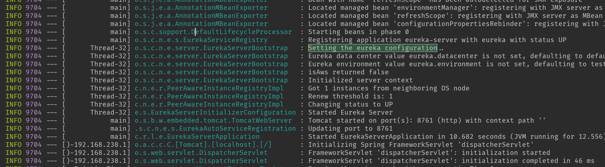
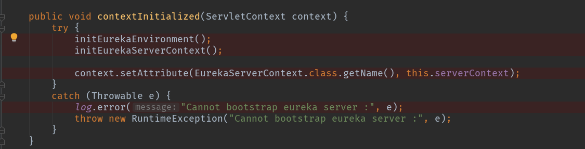
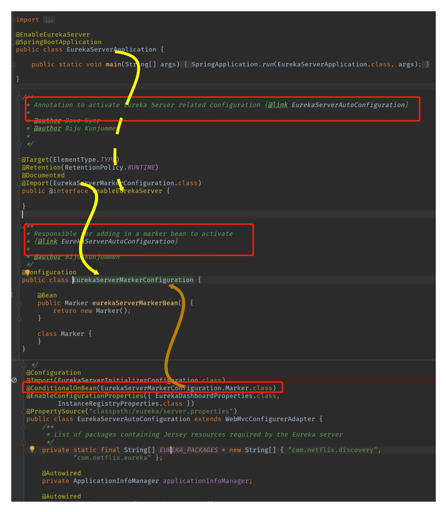
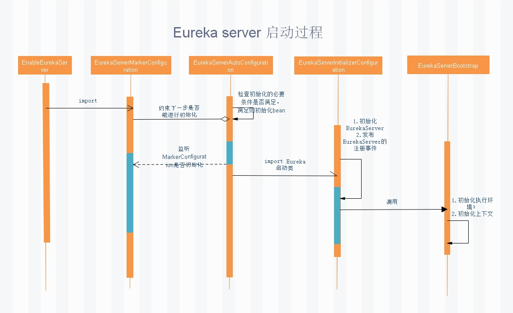
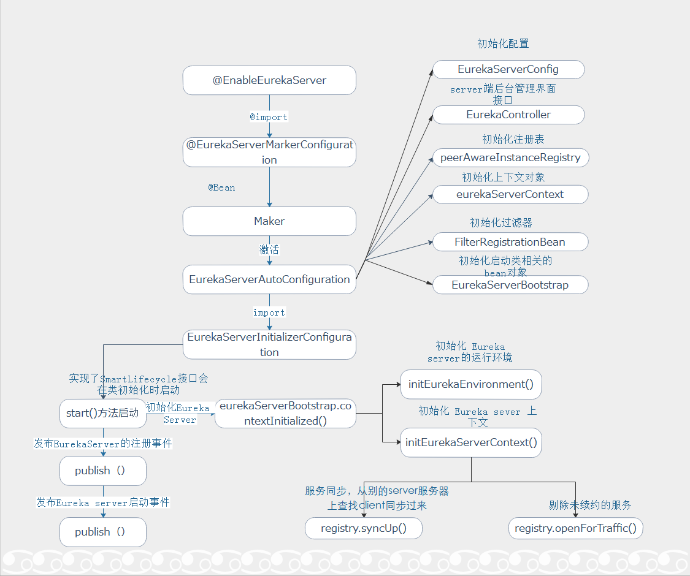
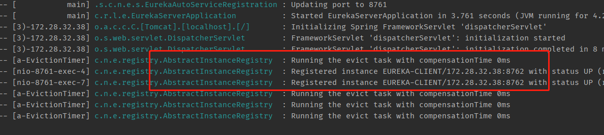
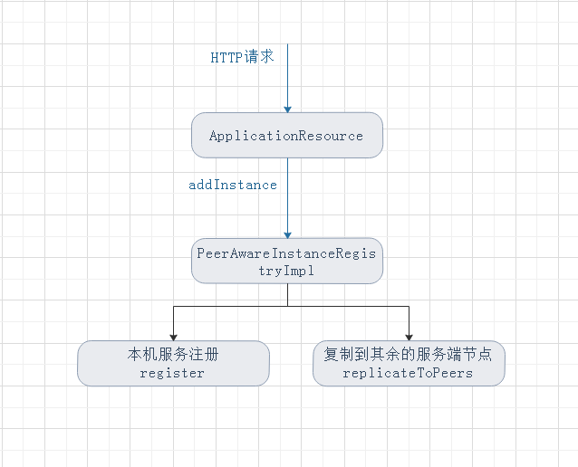

# SpringCloudEureka服务注册

本篇我们着重分析Eureka服务端的逻辑实现，主要涉及到服务的注册流程分析。

在Eureka的服务治理中，会涉及到下面一些概念：

**服务注册**：Eureka Client会通过发送REST请求的方式向Eureka Server注册自己的服务，提供自身的元数据，比如 IP 地址、端口、运行状况指标的URL、主页地址等信息。Eureka Server接收到注册请求后，就会把这些元数据信息存储在一个ConcurrentHashMap中。

**服务续约**：在服务注册后，Eureka Client会维护一个心跳来持续通知Eureka Server，说明服务一直处于可用状态，防止被剔除。Eureka Client在默认的情况下会每隔30秒发送一次心跳来进行服务续约。

**服务同步**：Eureka Server之间会互相进行注册，构建Eureka Server集群，不同Eureka Server之间会进行服务同步，用来保证服务信息的一致性。

**获取服务**：服务消费者（Eureka Client）在启动的时候，会发送一个REST请求给Eureka Server，获取上面注册的服务清单，并且缓存在Eureka Client本地，默认缓存30秒。同时，为了性能考虑，Eureka Server也会维护一份只读的服务清单缓存，该缓存每隔30秒更新一次。

**服务调用**：服务消费者在获取到服务清单后，就可以根据清单中的服务列表信息，查找到其他服务的地址，从而进行远程调用。Eureka有Region和Zone的概念，一个Region可以包含多个Zone，在进行服务调用时，优先访问处于同一个Zone中的服务提供者。

**服务下线**：当Eureka Client需要关闭或重启时，就不希望在这个时间段内再有请求进来，所以，就需要提前先发送REST请求给Eureka Server，告诉Eureka Server自己要下线了，Eureka Server在收到请求后，就会把该服务状态置为下线（DOWN），并把该下线事件传播出去。

**服务剔除**：有时候，服务实例可能会因为网络故障等原因导致不能提供服务，而此时该实例也没有发送请求给Eureka Server来进行服务下线，所以，还需要有服务剔除的机制。Eureka Server在启动的时候会创建一个定时任务，每隔一段时间（默认60秒），从当前服务清单中把超时没有续约（默认90秒）的服务剔除。

**自我保护**：既然Eureka Server会定时剔除超时没有续约的服务，那就有可能出现一种场景，网络一段时间内发生了异常，所有的服务都没能够进行续约，Eureka Server就把所有的服务都剔除了，这样显然不太合理。所以，就有了自我保护机制，当短时间内，统计续约失败的比例，如果达到一定阈值，则会触发自我保护的机制，在该机制下，Eureka Server不会剔除任何的微服务，等到正常后，再退出自我保护机制。

#### 1. 基本原理：

1. Eureka Server 提供服务注册服务，各个节点启动后，会在Eureka Server中进行注册，这样Eureka Server中的服务注册表中将会存储所有可用服务节点的信息，服务节点的信息可以在界面中直观的看到；
2. Eureka Client 是一个Java 客户端，用于简化与Eureka Server的交互，客户端同时也具备一个内置的、使用轮询负载算法的负载均衡器；
3. 在应用启动后，将会向Eureka Server发送心跳(默认周期为30秒)，如果Eureka Server在多个心跳周期没有收到某个节点的心跳，Eureka Server 将会从服务注册表中把这个服务节点移除(默认90秒)；
4. Eureka Server之间将会通过复制的方式完成数据的同步；
5. Eureka Client具有缓存的机制，即使所有的Eureka Server 都挂掉的话，客户端依然可以利用缓存中的信息消费其它服务的API；

上一篇中我们搭建了一个简单的Eureka客户端和服务端。如果你有启动过观看启动日志不难发现：



这里有个`EurekaServerBootstrap`类，启动日志中给出：`Setting the eureka configuration..，Initialized server context`。看起来这个应该是个启动类，跟进去看一下，有个很显眼的方法：



这个方法的调用先按住不表，我们先从启动类上添加的 `EnableEurekaServer`注解着手，看看为什么添加了一个注解就能激活 Rureka。

从server启动类上的`EnableEurekaServer`注解进入：

1. 接下来引用了`EurekaServerMarkerConfiguration`，看到在这个注解上有个注释：启用这个注解的目的是为了激活：EurekaServerAutoConfiguration类；

2. 进入EurekaServerAutoConfiguration看到在类头部有一个注解：

   ```java
   Copy@ConditionalOnBean(EurekaServerMarkerConfiguration.Marker.class)
   ```

   即`EurekaServerAutoConfiguration`启动的条件是`EurekaServerMarkerConfiguration`注解先加载。



上面这一张图标识出了从启动注解到预启动类的流程，但是你会发现实际上 EurekaServerAutoConfiguration 也没有做什么事情：配置初始化，启动一些基本的过滤器。同样在类头部的引用上有一个Import注解：

```java
Copy@Import(EurekaServerInitializerConfiguration.class)
```

所以在 EurekaServerAutoConfiguration 初始化的时候，会引用到 EurekaServerInitializerConfiguration，激活它的初始化。EurekaServerInitializerConfiguration 实现了SmartLifecycle.start方法，在spring 初始化的时候会被启动，激活 run 方法。可以看到在 run 方法中调用的就是：

```java
CopyeurekaServerBootstrap.contextInitialized(EurekaServerInitializerConfiguration.this.servletContext);
```

即我们上面截图中的`EurekaServerBootstrap.contextInitialized()`方法。

整体的调用流程如下：



具体的初始化信息见下图：



#### 2. 服务注册实现[#](https://www.cnblogs.com/rickiyang/p/11802413.html#877887015)

##### 2.1 server端启动时同步别的server上的client

在上面讲到Eureka server启动过程中，启动一个Eureka Client的时候，`initEurekaServerContext()`里面会进行服务同步和服务剔除，syncUp()方法所属的类是：PeerAwareInstanceRegistry，即server端的服务注册逻辑都在这里面。因为没有使用AWS的服务器，所以默认实例化的实现类为：PeerAwareInstanceRegistryImpl。

```java
CopyPeerAwareInstanceRegistry registry;
if (isAws(applicationInfoManager.getInfo())) {
    registry = new AwsInstanceRegistry(
        eurekaServerConfig,
        eurekaClient.getEurekaClientConfig(),
        serverCodecs,
        eurekaClient
    );
    awsBinder = new AwsBinderDelegate(eurekaServerConfig, eurekaClient.getEurekaClientConfig(), registry, applicationInfoManager);
    awsBinder.start();
} else {
    registry = new PeerAwareInstanceRegistryImpl(
        eurekaServerConfig,
        eurekaClient.getEurekaClientConfig(),
        serverCodecs,
        eurekaClient
    );
}
```

PeerAwareInstanceRegistryImpl 继承了一个抽象类 AbstractInstanceRegistry：

```java
Copy@Singleton
public class PeerAwareInstanceRegistryImpl extends AbstractInstanceRegistry implements PeerAwareInstanceRegistry {
    
}
```

AbstractInstanceRegistry中的实现逻辑是真正的服务注册存储所在地：

```java
Copypublic abstract class AbstractInstanceRegistry implements InstanceRegistry {
    private static final Logger logger = LoggerFactory.getLogger(AbstractInstanceRegistry.class);

    private static final String[] EMPTY_STR_ARRAY = new String[0];
    private final ConcurrentHashMap<String, Map<String, Lease<InstanceInfo>>> registry
            = new ConcurrentHashMap<String, Map<String, Lease<InstanceInfo>>>();
    protected Map<String, RemoteRegionRegistry> regionNameVSRemoteRegistry = new HashMap<String, RemoteRegionRegistry>();
    protected final ConcurrentMap<String, InstanceStatus> overriddenInstanceStatusMap = CacheBuilder
            .newBuilder().initialCapacity(500)
            .expireAfterAccess(1, TimeUnit.HOURS)
            .<String, InstanceStatus>build().asMap();

    
 ....
 ....
 ....
}
```

所有的服务实例信息都保存在 server 本地的map当中。所以在server端启动的时候会去拉别的server上存储的client实例，然后存储到本地缓存。

##### 2.2 client主动注册

如果是某个client主动发出了注册请求，那么是如何注册到服务端呢？

还是查看日志：启动服务端，然后再启动客户端，查看服务端日志：



这里能看到刚才启动的客户端已经在服务端注册了，注册逻辑走的类是：AbstractInstanceRegistry。

上面也提到 是服务注册的逻辑实现类，完成保存客户端信息的方法是：

```java
Copy    public void register(InstanceInfo registrant, int leaseDuration, boolean isReplication) {
        ......
    }
```

代码就不贴了，主要实现的逻辑是保存当前注册的客户端信息。我们知道客户端是发送了一次http请求给服务端，那么真正的注册逻辑应该是从一个http请求的接收处进来的。跟着使用了register方法的地方去找，PeerAwareInstanceRegistryImpl里面有调用：

```java
Copy@Override
public void register(final InstanceInfo info, final boolean isReplication) {
    int leaseDuration = Lease.DEFAULT_DURATION_IN_SECS;
    if (info.getLeaseInfo() != null && info.getLeaseInfo().getDurationInSecs() > 0) {
        leaseDuration = info.getLeaseInfo().getDurationInSecs();
    }
    super.register(info, leaseDuration, isReplication);
    //将新节点信息告诉别的服务端
    replicateToPeers(Action.Register, info.getAppName(), info.getId(), info, null, isReplication);
}
```

这里没有改写父类的register逻辑，下面还多了一句：replicateToPeers，这里主要做的逻辑是：给兄弟 server节点发送register 请求，告诉他们有客户端来注册。

继续看谁调用了这里,可以找到：ApplicationResource 的addInstance方法调用了：

```java
Copy@POST
@Consumes({"application/json", "application/xml"})
public Response addInstance(InstanceInfo info,
                            @HeaderParam(PeerEurekaNode.HEADER_REPLICATION) String isReplication) {
......
  registry.register(info, "true".equals(isReplication));
  return Response.status(204).build();  // 204 to be backwards compatible
}
```

而这里很显然是一个接口，逻辑就很清晰了：



另外，我们查看addInstance方法被谁调用的过程中发现：PeerReplicationResource--->batchReplication 方法也调用了注册的逻辑。

这个方法一看竟然解答了之前我的疑惑：服务端之间是如何发送心跳的。原来实现是在这里。通过dispatch方法来区分当前的调用是何种请求，

可以看到，服务注册，心跳检测，服务取消，服务下线，服务剔除的入口都在这里：

```java
Copy@Path("batch")
@POST
public Response batchReplication(ReplicationList replicationList) {
    try {
        ReplicationListResponse batchResponse = new ReplicationListResponse();
        for (ReplicationInstance instanceInfo : replicationList.getReplicationList()) {
            try {
                batchResponse.addResponse(dispatch(instanceInfo));
            } catch (Exception e) {
                batchResponse.addResponse(new ReplicationInstanceResponse(Status.INTERNAL_SERVER_ERROR.getStatusCode(), null));
                logger.error("{} request processing failed for batch item {}/{}",
                             instanceInfo.getAction(), instanceInfo.getAppName(), instanceInfo.getId(), e);
            }
        }
        return Response.ok(batchResponse).build();
    } catch (Throwable e) {
        logger.error("Cannot execute batch Request", e);
        return Response.status(Status.INTERNAL_SERVER_ERROR).build();
    }
}


private ReplicationInstanceResponse dispatch(ReplicationInstance instanceInfo) {
        ApplicationResource applicationResource = createApplicationResource(instanceInfo);
        InstanceResource resource = createInstanceResource(instanceInfo, applicationResource);

        String lastDirtyTimestamp = toString(instanceInfo.getLastDirtyTimestamp());
        String overriddenStatus = toString(instanceInfo.getOverriddenStatus());
        String instanceStatus = toString(instanceInfo.getStatus());

        Builder singleResponseBuilder = new Builder();
        switch (instanceInfo.getAction()) {
            case Register:
                singleResponseBuilder = handleRegister(instanceInfo, applicationResource);
                break;
            case Heartbeat:
                singleResponseBuilder = handleHeartbeat(serverConfig, resource, lastDirtyTimestamp, overriddenStatus, instanceStatus);
                break;
            case Cancel:
                singleResponseBuilder = handleCancel(resource);
                break;
            case StatusUpdate:
                singleResponseBuilder = handleStatusUpdate(instanceInfo, resource);
                break;
            case DeleteStatusOverride:
                singleResponseBuilder = handleDeleteStatusOverride(instanceInfo, resource);
                break;
        }
        return singleResponseBuilder.build();
    }
```

从这个入口进去，大家可以跟踪一下感兴趣的逻辑。

> 本文摘自：https://www.cnblogs.com/rickiyang/p/11802413.html