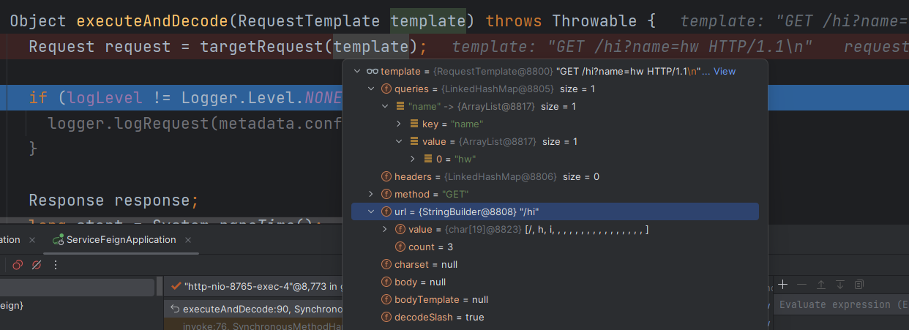
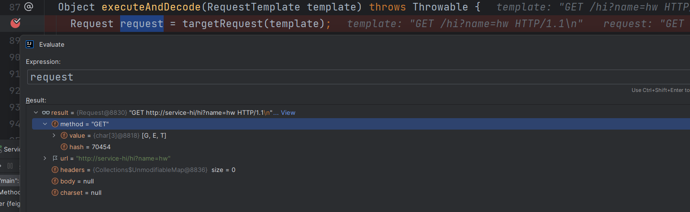

# SpringCloudFeignClient生成代理

# 程序入口
我们都知道，如果想使用 FeignClient，需要在启动主类上添加 @EnableFeignClients 注解。那么 Feign 的一套体系生效应该就在于这个注解上了。我们打开 EnableFeignClients 看下源码：

````java
@Import(FeignClientsRegistrar.class)
public @interface EnableFeignClients {
    。。。。
}
````


````java
class FeignClientsRegistrar implements ImportBeanDefinitionRegistrar,ResourceLoaderAware,EnvironmentAware {
    @Override
  public void registerBeanDefinitions(AnnotationMetadata metadata,BeanDefinitionRegistry registry) {
    。。。。
    registerFeignClients(metadata, registry);
  }
    public void registerFeignClients(AnnotationMetadata metadata,BeanDefinitionRegistry registry) {
        。。。。
        for (BeanDefinition candidateComponent : candidateComponents) {
            // 注意这里，开始寻找添加 @FeignClient 注解的接口，并在后续进行注册
            Map<String, Object> attributes = annotationMetadata.getAnnotationAttributes(FeignClient.class.getCanonicalName());

            String name = getClientName(attributes);
            registerClientConfiguration(registry, name,attributes.get("configuration"));

            registerFeignClient(registry, annotationMetadata, attributes);
        }
        。。。。
     }
}
````

上文代码印证了我们之前的猜测：Feign 组件通过 EnableFeignClients 作为入口生效。具体执行过程如下：

在用户添加了该注解后，该注解引入了FeignClientsRegistrar配置

FeignClientsRegistrar实现了ImportBeanDefinitionRegistrar接口，然后在registerBeanDefinitions方法中将加上@FeignClient注解的接口均在 spring 中做了注册（这句表述不太准确，用户完全可以自定义扫描包之类的，简单起见不做扩展）

Spring Cloud FeignClient 代理方式探究
# 生成代理

被 @FeignClient 注解的接口被抛给了 spring 去注册，但是注册的代理对象是在 FeignClientFactoryBean 返回的:

````java
class FeignClientFactoryBean implements FactoryBean<Object>, InitializingBean,ApplicationContextAware {
    @Override
  public Object getObject() throws Exception {
    FeignContext context = applicationContext.getBean(FeignContext.class);
    Feign.Builder builder = feign(context);
        // 如果没配置 url 属性，则需要走服务发现逻辑
    if (!StringUtils.hasText(this.url)) {
      String url = "http://" + this.name;
      return loadBalance(builder, context, new HardCodedTarget<>(this.type,this.name, url));
    }
        // 注意，这里的 Client 非常重要，它是 feign 网络请求组件接口，默认是 Default
    Client client = getOptional(context, Client.class);
    if (client != null) {
      if (client instanceof LoadBalancerFeignClient) {
        // not load balancing because we have a url,
        // but ribbon is on the classpath, so unwrap
        client = ((LoadBalancerFeignClient)client).getDelegate();
      }
      builder.client(client);
    }

    Targeter targeter = get(context, Targeter.class);
    return targeter.target(this, builder, context, new HardCodedTarget<>(this.type, this.name, url));
  }
}
````

由上文代码我们可以看出，在生成代理的时候分了两种情况：如果 @FeignClient 注解配置了 url 属性，则直接生成代理；如果没有配置，证明需要走服务发现逻辑，则交给 Ribbon 去拼接 url 并生成代理。

我们这里以简单的 url 配置方式为例，看看最终的代理对象是如何生成的：

````java
public class ReflectiveFeign extends Feign {

  @Override
  public <T> T newInstance(Target<T> target) {
    Map<Method, MethodHandler> methodToHandler = new LinkedHashMap<Method, MethodHandler>();

    for (Method method : target.type().getMethods()) {
        // 注意，这里的逻辑比源码删减很多
        methodToHandler.put(method, nameToHandler.get(Feign.configKey(target.type(), method)));
    }
    InvocationHandler handler = factory.create(target, methodToHandler);
    // 使用 jdk 代理生成对象，注意这里的 target 并非被 @FeignClient 注解的接口，而是 HardCodedTarget，但是它里面存储了被注解接口的信息
    T proxy = (T) Proxy.newProxyInstance(target.type().getClassLoader(), new Class<?>[]{target.type()}, handler);

    return proxy;
  }
````

既然看到了InvocationHandler，那么就不由得让人联想到InvocationHandler的实现类了，这里ReflectiveFeign使用到的InvocationHandler实现类为FeignInvocationHandler

````java
static class FeignInvocationHandler implements InvocationHandler {

    private final Target target;
    private final Map<Method, MethodHandler> dispatch;

    FeignInvocationHandler(Target target, Map<Method, MethodHandler> dispatch) {
      this.target = checkNotNull(target, "target");
      this.dispatch = checkNotNull(dispatch, "dispatch for %s", target);
    }

    @Override
    public Object invoke(Object proxy, Method method, Object[] args) throws Throwable {
      if ("equals".equals(method.getName())) {
        try {
          Object
              otherHandler =
              args.length > 0 && args[0] != null ? Proxy.getInvocationHandler(args[0]) : null;
          return equals(otherHandler);
        } catch (IllegalArgumentException e) {
          return false;
        }
      } else if ("hashCode".equals(method.getName())) {
        return hashCode();
      } else if ("toString".equals(method.getName())) {
        return toString();
      }
      return dispatch.get(method).invoke(args);
    }
}
````

在好奇心的趋势下，当我们看到了invoke方法，我们不由得注意到一行关键代码`dispatch.get(method).invoke(args)`，细心的人可以很快主要到dispatch的实现类是SynchronousMethodHandler

````java
final class SynchronousMethodHandler implements MethodHandler {

  private static final long MAX_RESPONSE_BUFFER_SIZE = 8192L;

  private final MethodMetadata metadata;
  private final Target<?> target;
  private final Client client;
  private final Retryer retryer;
  private final List<RequestInterceptor> requestInterceptors;
  private final Logger logger;
  private final Logger.Level logLevel;
  private final RequestTemplate.Factory buildTemplateFromArgs;
  private final Options options;
  private final Decoder decoder;
  private final ErrorDecoder errorDecoder;
  private final boolean decode404;

  private SynchronousMethodHandler(Target<?> target, Client client, Retryer retryer,
                                   List<RequestInterceptor> requestInterceptors, Logger logger,
                                   Logger.Level logLevel, MethodMetadata metadata,
                                   RequestTemplate.Factory buildTemplateFromArgs, Options options,
                                   Decoder decoder, ErrorDecoder errorDecoder, boolean decode404) {
    this.target = checkNotNull(target, "target");
    this.client = checkNotNull(client, "client for %s", target);
    this.retryer = checkNotNull(retryer, "retryer for %s", target);
    this.requestInterceptors =
        checkNotNull(requestInterceptors, "requestInterceptors for %s", target);
    this.logger = checkNotNull(logger, "logger for %s", target);
    this.logLevel = checkNotNull(logLevel, "logLevel for %s", target);
    this.metadata = checkNotNull(metadata, "metadata for %s", target);
    this.buildTemplateFromArgs = checkNotNull(buildTemplateFromArgs, "metadata for %s", target);
    this.options = checkNotNull(options, "options for %s", target);
    this.errorDecoder = checkNotNull(errorDecoder, "errorDecoder for %s", target);
    this.decoder = checkNotNull(decoder, "decoder for %s", target);
    this.decode404 = decode404;
  }

  @Override
  public Object invoke(Object[] argv) throws Throwable {
    RequestTemplate template = buildTemplateFromArgs.create(argv);
    Retryer retryer = this.retryer.clone();
    while (true) {
      try {
        return executeAndDecode(template);
      } catch (RetryableException e) {
        retryer.continueOrPropagate(e);
        if (logLevel != Logger.Level.NONE) {
          logger.logRetry(metadata.configKey(), logLevel);
        }
        continue;
      }
    }
  }
}
````

在这里我们看到了一个引人注目的类`RequestTemplate`，并且该类被executeAndDecode方法使用，我们看看executeAndDecode方法

````java
Object executeAndDecode(RequestTemplate template) throws Throwable {
    Request request = targetRequest(template);
    ......
  }
````







至此，我们看到了request的内部情况，request记录请求的服务的url。

到此我们也看到了feigh做了一件事，它收集被@FeignClient注释的类的信息，然后生成代理类会自己找到对应的URL进行请求。