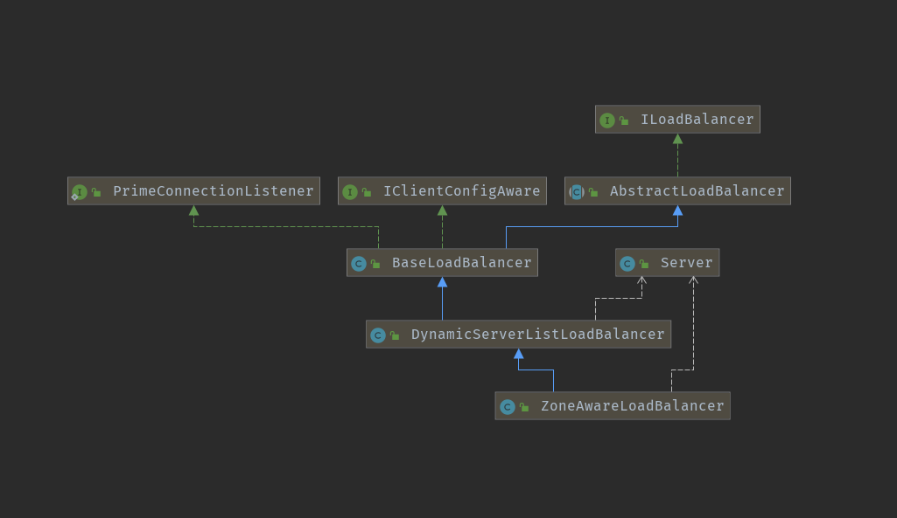

# SpringCloudRibbon负载均衡代码实现


上一篇结合 Eureka 和 Ribbon 搭建了服务注册中心，利用Ribbon实现了可配置负载均衡的服务调用。这一篇我们来分析Ribbon实现负载均衡的过程。

从 @LoadBalanced入手

还记得前面配置 RestTemplate：

```java
Copy@Bean
@LoadBalanced
RestTemplate restTemplate() {
    return new RestTemplate();
}
```

在消费端使用Spring 提供的 RestTemplate 来发出请求，而Ribbon 在 RestTemplate 上添加了@LoadBalanced 注解就可以实现负载均衡，这是怎样做到的呢？

首先看 LoadBalanced 注解：

```java
Copy/**
 * Annotation to mark a RestTemplate bean to be configured to use a LoadBalancerClient
 * @author Spencer Gibb
 */
@Target({ ElementType.FIELD, ElementType.PARAMETER, ElementType.METHOD })
@Retention(RetentionPolicy.RUNTIME)
@Documented
@Inherited
@Qualifier
public @interface LoadBalanced {
}
```

该注解的作用是为了使用 LoadBalancerClient。

LoadBalancerClient 是一个接口，包含两个方法：

```java
Copypublic interface LoadBalancerClient extends ServiceInstanceChooser {

	//针对来自LoadBalancer的特定的服务使用ServiceInstance来执行请求
    //根据 传入的 服务名 和 负载均衡请求，从 服务实例中选出一个实例发送请求
	<T> T execute(String serviceId, LoadBalancerRequest<T> request) throws IOException;
	//针对来自LoadBalancer的特定的服务使用ServiceInstance来执行请求
    //指定了服务实例，直接对该实例发送请求
	<T> T execute(String serviceId, ServiceInstance serviceInstance, LoadBalancerRequest<T> request) throws IOException;

    //使用真实的主机和端口创建适当的URI，以供系统使用。某些系统使用带有逻辑服务名称的URI作为主机
    //即将我们在  RestTemplate 中写的 服务名换为真实的 ip + 端口 的形式
	URI reconstructURI(ServiceInstance instance, URI original);
}
```

LoadBalancerClient 接口只有一个实现类：RibbonLoadBalancerClient，点击查看这个类的调用，会看到在：RibbonAutoConfiguration 类中实例化bean：

```java
Copy@Configuration
@ConditionalOnClass({ IClient.class, RestTemplate.class, AsyncRestTemplate.class, Ribbon.class})
@RibbonClients
@AutoConfigureAfter(name = "org.springframework.cloud.netflix.eureka.EurekaClientAutoConfiguration")
@AutoConfigureBefore({LoadBalancerAutoConfiguration.class, AsyncLoadBalancerAutoConfiguration.class})
@EnableConfigurationProperties({RibbonEagerLoadProperties.class, ServerIntrospectorProperties.class})
public class RibbonAutoConfiguration {

    @Bean
	@ConditionalOnMissingBean(LoadBalancerClient.class)
	public LoadBalancerClient loadBalancerClient() {
		return new RibbonLoadBalancerClient(springClientFactory());
	}
    
	@Configuration
	@ConditionalOnClass(HttpRequest.class)
	@ConditionalOnRibbonRestClient
	protected static class RibbonClientHttpRequestFactoryConfiguration {

		@Autowired
		private SpringClientFactory springClientFactory;

		@Bean
		public RestTemplateCustomizer restTemplateCustomizer(
				final RibbonClientHttpRequestFactory ribbonClientHttpRequestFactory) {
			return restTemplate -> restTemplate.setRequestFactory(ribbonClientHttpRequestFactory);
		}

		@Bean
		public RibbonClientHttpRequestFactory ribbonClientHttpRequestFactory() {
			return new RibbonClientHttpRequestFactory(this.springClientFactory);
		}
	}
    ......
    ......
    ......
}
```

在这里还实例化了RestTemplate。在类头部的配置信息中 有个注解：@AutoConfigureBefore，即在该类初始化之前需要初始化的类有两个：LoadBalancerAutoConfiguration.class, AsyncLoadBalancerAutoConfiguration.class。AsyncLoadBalancerAutoConfiguration LoadBalancerAutoConfiguration的异步实现版本，所以看一下 LoadBalancerAutoConfiguration 的实现即可：

```java
Copy@Configuration
@ConditionalOnClass(RestTemplate.class)
@ConditionalOnBean(LoadBalancerClient.class)
@EnableConfigurationProperties(LoadBalancerRetryProperties.class)
public class LoadBalancerAutoConfiguration {

	@LoadBalanced
	@Autowired(required = false)
	private List<RestTemplate> restTemplates = Collections.emptyList();

	@Bean
	public SmartInitializingSingleton loadBalancedRestTemplateInitializerDeprecated(
			final ObjectProvider<List<RestTemplateCustomizer>> restTemplateCustomizers) {
		return () -> restTemplateCustomizers.ifAvailable(customizers -> {
            for (RestTemplate restTemplate : LoadBalancerAutoConfiguration.this.restTemplates) {
                for (RestTemplateCustomizer customizer : customizers) {
                    customizer.customize(restTemplate);
                }
            }
        });
	}

	@Autowired(required = false)
	private List<LoadBalancerRequestTransformer> transformers = Collections.emptyList();

	@Bean
	@ConditionalOnMissingBean
	public LoadBalancerRequestFactory loadBalancerRequestFactory(
			LoadBalancerClient loadBalancerClient) {
		return new LoadBalancerRequestFactory(loadBalancerClient, transformers);
	}

	@Configuration
	@ConditionalOnMissingClass("org.springframework.retry.support.RetryTemplate")
	static class LoadBalancerInterceptorConfig {
		@Bean
		public LoadBalancerInterceptor ribbonInterceptor(
				LoadBalancerClient loadBalancerClient,
				LoadBalancerRequestFactory requestFactory) {
			return new LoadBalancerInterceptor(loadBalancerClient, requestFactory);
		}

		@Bean
		@ConditionalOnMissingBean
		public RestTemplateCustomizer restTemplateCustomizer(
				final LoadBalancerInterceptor loadBalancerInterceptor) {
			return restTemplate -> {
                List<ClientHttpRequestInterceptor> list = new ArrayList<>(
                        restTemplate.getInterceptors());
                list.add(loadBalancerInterceptor);
                restTemplate.setInterceptors(list);
            };
		}
	}

	@Configuration
	@ConditionalOnClass(RetryTemplate.class)
	public static class RetryAutoConfiguration {

		@Bean
		@ConditionalOnMissingBean
		public LoadBalancedRetryFactory loadBalancedRetryFactory() {
			return new LoadBalancedRetryFactory() {};
		}
	}

	@Configuration
	@ConditionalOnClass(RetryTemplate.class)
	public static class RetryInterceptorAutoConfiguration {
		@Bean
		@ConditionalOnMissingBean
		public RetryLoadBalancerInterceptor ribbonInterceptor(
				LoadBalancerClient loadBalancerClient, LoadBalancerRetryProperties properties,
				LoadBalancerRequestFactory requestFactory,
				LoadBalancedRetryFactory loadBalancedRetryFactory) {
			return new RetryLoadBalancerInterceptor(loadBalancerClient, properties,
					requestFactory, loadBalancedRetryFactory);
		}

		@Bean
		@ConditionalOnMissingBean
		public RestTemplateCustomizer restTemplateCustomizer(
				final RetryLoadBalancerInterceptor loadBalancerInterceptor) {
			return restTemplate -> {
                List<ClientHttpRequestInterceptor> list = new ArrayList<>(
                        restTemplate.getInterceptors());
                list.add(loadBalancerInterceptor);
                restTemplate.setInterceptors(list);
            };
		}
	}
}
```

在LoadBalancerAutoConfiguration类中，创建了一个LoadBalancerInterceptor拦截器，还维护了一个被@LoadBalanced修饰的RestTemplate列表，在初始化的时候，会为每个restTemplate实例添加LoadBalancerInterceptor拦截器。另外上面还能看到 Ribbon在请求失败使用的重试框架是Spring的Retry，重试的时候也会走配置好的负载均衡拦截器。继续跟踪 LoadBalancerInterceptor：

```java
Copypublic class LoadBalancerInterceptor implements ClientHttpRequestInterceptor {

	private LoadBalancerClient loadBalancer;
	private LoadBalancerRequestFactory requestFactory;

	public LoadBalancerInterceptor(LoadBalancerClient loadBalancer, LoadBalancerRequestFactory requestFactory) {
		this.loadBalancer = loadBalancer;
		this.requestFactory = requestFactory;
	}

	public LoadBalancerInterceptor(LoadBalancerClient loadBalancer) {
		// for backwards compatibility
		this(loadBalancer, new LoadBalancerRequestFactory(loadBalancer));
	}

	@Override
	public ClientHttpResponse intercept(final HttpRequest request, final byte[] body,
			final ClientHttpRequestExecution execution) throws IOException {
		final URI originalUri = request.getURI();
		String serviceName = originalUri.getHost();
		Assert.state(serviceName != null, "Request URI does not contain a valid hostname: " + originalUri);
		return this.loadBalancer.execute(serviceName, requestFactory.createRequest(request, body, execution));
	}
}
```

上面可以看到主要的逻辑在intercept方法中，从`originalUri.getHost()`中得到的就是我们在 restTemplate中填写的服务名，然后会调用LoadBalancerClient 的execute方法，即上面 LoadBalancerClient 的实现类： RibbonLoadBalancerClient，上面我们提了一嘴然后就跑到了LoadBalancerClient 的实例化逻辑里面去了，最终跟踪到现在，才发原来是在实例化LoadBalancerClient 的过程中塞入了一个拦截器。

```java
Copypublic class RibbonLoadBalancerClient implements LoadBalancerClient {

	private SpringClientFactory clientFactory;

	public RibbonLoadBalancerClient(SpringClientFactory clientFactory) {
		this.clientFactory = clientFactory;
	}

	@Override
	public <T> T execute(String serviceId, LoadBalancerRequest<T> request) throws IOException {
		ILoadBalancer loadBalancer = getLoadBalancer(serviceId);
		Server server = getServer(loadBalancer);
		if (server == null) {
			throw new IllegalStateException("No instances available for " + serviceId);
		}
		RibbonServer ribbonServer = new RibbonServer(serviceId, server, isSecure(server,
				serviceId), serverIntrospector(serviceId).getMetadata(server));

		return execute(serviceId, ribbonServer, request);
	}
    
    protected ILoadBalancer getLoadBalancer(String serviceId) {
		return this.clientFactory.getLoadBalancer(serviceId);
	}
    
    ......

}
```

在execute方法中第一行返回了ILoadBalancer， ILoadBalancer 中定义了负载均衡器的操作的接口：

```java
Copypublic interface ILoadBalancer {

	/**
	 *
	 * 可以用于服务器的初始列表。
	 * 同时也会将指定的服务器添加进服务器列表
	 * 同一逻辑服务器（host：port）本质上可以多次添加
	 * 
	 * @param newServers new servers to add
	 */
	public void addServers(List<Server> newServers);
	
	/**
	 * 根据指定的key选择服务器
	 * 
	 * @return server chosen
	 */
	public Server chooseServer(Object key);
	
	/**
	 * 由负载均衡器的客户端调用以通知服务器已关闭
	 * 否则，LB将认为它仍然有效直到下一个Ping周期
	 *（假设LB Impl执行ping操作）
	 * 
	 * @param server Server to mark as down
	 */
	public void markServerDown(Server server);
	
	/**
	 *
	 * 已过期
	 * 获取服务器列表
	 *
	 * @param availableOnly if true, only live and available servers should be returned
	 */
	@Deprecated
	public List<Server> getServerList(boolean availableOnly);

	/**
	 * 获取可用的服务器列表
	 * @return Only the servers that are up and reachable.
     */
    public List<Server> getReachableServers();

    /**
     * 获取所有的服务器列表， 包含可用的和不可用的
     * @return All known servers, both reachable and unreachable.
     */
	public List<Server> getAllServers();
}
```

因为ILoadBalancer的实现类还是挺多的，我们先看一下完整的类图：



从上面的类图可以看到，ILoadBalancer 有三个实现类，他们之间是继承关系，最终的实现类是 ZoneAwareLoadBalancer。因为很多东西都是定义在BaseLoadBalancer中的，为了能看懂，我们一起先从 BaseLoadBalancer 中的 变量开始看：

```java
Copypublic class BaseLoadBalancer extends AbstractLoadBalancer implements
        PrimeConnections.PrimeConnectionListener, IClientConfigAware {
    
    
    private final static IRule DEFAULT_RULE = new RoundRobinRule();
    
    private final static SerialPingStrategy DEFAULT_PING_STRATEGY = new SerialPingStrategy();
    
    protected IRule rule = DEFAULT_RULE;

    protected IPingStrategy pingStrategy = DEFAULT_PING_STRATEGY;

    protected IPing ping = null;

    @Monitor(name = PREFIX + "AllServerList", type = DataSourceType.INFORMATIONAL)
    protected volatile List<Server> allServerList = Collections.synchronizedList(new ArrayList<Server>());
    
    @Monitor(name = PREFIX + "UpServerList", type = DataSourceType.INFORMATIONAL)
    protected volatile List<Server> upServerList = Collections.synchronizedList(new ArrayList<Server>());
    
    private IClientConfig config; 
    
}
```

从上面的变量信息我们可以看出一些东西：

1. 默认的 负载均衡策略是随机负载均衡；
2. 默认的Ping策略为串行化Ping；
3. 使用了一个list来保存所有的服务列表，一个list来保存当前所有的存活状态的服务列表；
4. 定义了客户端配置，用于初始化客户端以及负载均衡配置 。

接着看 BaseLoadBalancer 默认的无参构造函数做了什么：

```java
Copypublic BaseLoadBalancer() {
    this.name = DEFAULT_NAME;
    this.ping = null;
    setRule(DEFAULT_RULE);
    setupPingTask();
    lbStats = new LoadBalancerStats(DEFAULT_NAME);
}
```

1. 将负载均衡的默认规则设置为随机；
2. 设置Ping 定时任务；
3. 负载均衡的一些状态设置，为下次执行负载均衡提供参考。

setupPingTask() 方法里面还是有一些东西的，我们一起看一下：

```java
Copyvoid setupPingTask() {
    if (canSkipPing()) {
        return;
    }
    if (lbTimer != null) {
        lbTimer.cancel();
    }
    lbTimer = new ShutdownEnabledTimer("NFLoadBalancer-PingTimer-" + name,
                                       true);
    lbTimer.schedule(new PingTask(), 0, pingIntervalSeconds * 1000);
    forceQuickPing();
}
```

首先是设置了一个定时任务，任务的执行间隔是每 10S 执行一次。

跟进到PingTask类中：

```java
Copy//    protected IPingStrategy pingStrategy = DEFAULT_PING_STRATEGY;

class PingTask extends TimerTask {
    public void run() {
        try {
            new Pinger(pingStrategy).runPinger();
        } catch (Exception e) {
            logger.error("LoadBalancer [{}]: Error pinging", name, e);
        }
    }
}

//默认Ping 的方式

private static class SerialPingStrategy implements IPingStrategy {

    @Override
    public boolean[] pingServers(IPing ping, Server[] servers) {
        int numCandidates = servers.length;
        boolean[] results = new boolean[numCandidates];

        logger.debug("LoadBalancer:  PingTask executing [{}] servers configured", numCandidates);

        for (int i = 0; i < numCandidates; i++) {
            results[i] = false; /* Default answer is DEAD. */
            try {
                if (ping != null) {
                    results[i] = ping.isAlive(servers[i]);
                }
            } catch (Exception e) {
                logger.error("Exception while pinging Server: '{}'", servers[i], e);
            }
        }
        return results;
    }
}
```

设置Ping的策略为：DEFAULT_PING_STRATEGY，即上面提到的串行化 Ping的方式。

在 runPinger() 方法中会拿到当前 allServerList 中 所有的节点去Ping，在allServerList 中标记其存活状态，用当前Ping的存活状态 和 上次的 准或状态比对，如果 状态不同 ，发出通知 这些节点状态有改变；如果状态为存活，那么将 upServerList 中的节点用本次检测出的所有存活节点替换。

```java
Copyclass Pinger {

        private final IPingStrategy pingerStrategy;

        public Pinger(IPingStrategy pingerStrategy) {
            this.pingerStrategy = pingerStrategy;
        }

        public void runPinger() throws Exception {
            if (!pingInProgress.compareAndSet(false, true)) { 
                return; // Ping in progress - nothing to do
            }
            
            // we are "in" - we get to Ping

            Server[] allServers = null;
            boolean[] results = null;

            Lock allLock = null;
            Lock upLock = null;

            try {
                /*
                 * The readLock should be free unless an addServer operation is
                 * going on...
                 */
                allLock = allServerLock.readLock();
                allLock.lock();
                allServers = allServerList.toArray(new Server[allServerList.size()]);
                allLock.unlock();

                int numCandidates = allServers.length;
                results = pingerStrategy.pingServers(ping, allServers);

                final List<Server> newUpList = new ArrayList<Server>();
                final List<Server> changedServers = new ArrayList<Server>();

                for (int i = 0; i < numCandidates; i++) {
                    boolean isAlive = results[i];
                    Server svr = allServers[i];
                    boolean oldIsAlive = svr.isAlive();

                    svr.setAlive(isAlive);
					//如果当前检测状态和之前的状态不一致，稍后会用于发送状态变化通知
                    if (oldIsAlive != isAlive) {
                        changedServers.add(svr);
                        logger.debug("LoadBalancer [{}]:  Server [{}] status changed to {}", 
                    		name, svr.getId(), (isAlive ? "ALIVE" : "DEAD"));
                    }
					//如果是存活状态，添加进list
                    if (isAlive) {
                        newUpList.add(svr);
                    }
                }
                upLock = upServerLock.writeLock();
                upLock.lock();
                upServerList = newUpList;
                upLock.unlock();
				//发送状态变化通知消息
                notifyServerStatusChangeListener(changedServers);
            } finally {
                pingInProgress.set(false);
            }
        }
    }
```

看完初始化bean过程之后，我们接着看 ILoadBalancer 接口中的几个方法在这里的实现：

addServers 方法：

```java
Copy@Override
public void addServers(List<Server> newServers) {
    if (newServers != null && newServers.size() > 0) {
        try {
            ArrayList<Server> newList = new ArrayList<Server>();
            newList.addAll(allServerList);
            newList.addAll(newServers);
            setServersList(newList);
        } catch (Exception e) {
            logger.error("LoadBalancer [{}]: Exception while adding Servers", name, e);
        }
    }
}


public void setServersList(List lsrv) {
    Lock writeLock = allServerLock.writeLock();
    logger.debug("LoadBalancer [{}]: clearing server list (SET op)", name);

    ArrayList<Server> newServers = new ArrayList<Server>();
    writeLock.lock();
    try {
        ArrayList<Server> allServers = new ArrayList<Server>();
        for (Object server : lsrv) {
            if (server == null) {
                continue;
            }

            if (server instanceof String) {
                server = new Server((String) server);
            }
			//这里保存当前所有的server信息
            if (server instanceof Server) {
                logger.debug("LoadBalancer [{}]:  addServer [{}]", name, ((Server) server).getId());
                allServers.add((Server) server);
            } else {
                throw new IllegalArgumentException(
                    "Type String or Server expected, instead found:"
                    + server.getClass());
            }

        }
        boolean listChanged = false;
        //如果server信息有变化，给各个监听事件发送监听信息
        if (!allServerList.equals(allServers)) {
            listChanged = true;
            if (changeListeners != null && changeListeners.size() > 0) {
                List<Server> oldList = ImmutableList.copyOf(allServerList);
                List<Server> newList = ImmutableList.copyOf(allServers);                   
                for (ServerListChangeListener l: changeListeners) {
                    try {
                        l.serverListChanged(oldList, newList);
                    } catch (Exception e) {
                        logger.error("LoadBalancer [{}]: Error invoking server list change listener", name, e);
                    }
                }
            }
        }
        if (isEnablePrimingConnections()) {
            for (Server server : allServers) {
                if (!allServerList.contains(server)) {
                    server.setReadyToServe(false);
                    newServers.add((Server) server);
                }
            }
            if (primeConnections != null) {
                primeConnections.primeConnectionsAsync(newServers, this);
            }
        }
        // This will reset readyToServe flag to true on all servers
        // regardless whether
        // previous priming connections are success or not
        //这里直接将以前的 serverList 用现在的覆盖掉， 是没有做唯一性校验的 注意*************
        allServerList = allServers;
        //下面接着去执行 Ping 
        if (canSkipPing()) {
            //如果当前没有默认的Ping策略，默认将所有的节点存活状态设置为可用
            for (Server s : allServerList) {
                s.setAlive(true);
            }
            upServerList = allServerList;
        } else if (listChanged) {
            //执行默认的Ping 策略
            forceQuickPing();
        }
    } finally {
        writeLock.unlock();
    }
}
```

直接将 newServers 添加进 allServerList ，这里是没有做唯一性过滤的。

chooseServer方法：

```java
Copypublic Server chooseServer(Object key) {
    if (counter == null) {
        counter = createCounter();
    }
    counter.increment();
    if (rule == null) {
        return null;
    } else {
        try {
            return rule.choose(key);
        } catch (Exception e) {
            logger.warn("LoadBalancer [{}]:  Error choosing server for key {}", name, key, e);
            return null;
        }
    }
}
```

这里的代码很简单，最主要的代码在：rule.choose(key)这一句，rule 为 默认的 RoundRobinRule，点进去 choose()方法，你就会进入到IRule接口，这里就是负载均衡规则的路由类， 后面我专门列一个章节讲所有的负载均衡算法，这里就先跳过。

markServerDown方法：

```java
Copypublic void markServerDown(Server server) {
    if (server == null || !server.isAlive()) {
        return;
    }

    logger.error("LoadBalancer [{}]:  markServerDown called on [{}]", name, server.getId());
    //这里将服务的状态设置为不可用
    server.setAlive(false);
    // forceQuickPing();
	//给监听器发送通知
    notifyServerStatusChangeListener(singleton(server));
}
```

getReachableServers方法：

```java
Copy@Override
public List<Server> getReachableServers() {
    return Collections.unmodifiableList(upServerList);
}
```

直接返回可用的服务list。

getAllServers方法：

```java
Copy@Override
public List<Server> getAllServers() {
    return Collections.unmodifiableList(allServerList);
}
```

直接返回所有的服务list。

分析完 BaseLoadBalancer ，DynamicServerListLoadBalancer 和 ZoneAwareLoadBalancer 基本大同小异：

- **DynamicServerListLoadBalancer** ：使用动态源的服务器， 即服务器列表可能是在运行时更改。 通过一些Filter函数来动态的过滤掉指定的服务器列表；
- **ZoneAwareLoadBalancer** ：这个负载均衡器适用于异地多机房的情况，在选择服务器的时候可以避免整个区域。LoadBalancer将计算并检查所有可用区域的区域统计信息。如果任何区域的“平均活动请求数”已达到配置的阈值，则该区域将从活动服务器列表中删除。如果多个区域已达到阈值，则将删除每台服务器上最活跃请求的区域。一旦删除了最坏的区域，将在其余区域中选择一个区域，其概率与其实例数成正比。服务器将从具有指定规则的选定区域返回。对于每个请求都将重复上述步骤，也就是说，每个区域相关的负载平衡决策都是在最新统计信息的帮助下实时做的。

以上，总结一下Ribbon的负载均衡如何实现：

在 LoadBalancerClient 类中 配置了LoadBalancerInterceptor，拦截器主要调用 ILoadBalancer 来进行 负载均衡逻辑处理。在 ILoadBalancer 中配置了 Ping 策略，负载均衡策略，维护当前可用的服务端列表信息。 RestTemplate 因为被 @LoadBalance 修饰以后，实例信息被添加进 LoadBalancerClient 的缓存中，然后被 RestTemplateCustomizer 包装，里面封装了拦截器信息所以能够进行负载均衡配置。